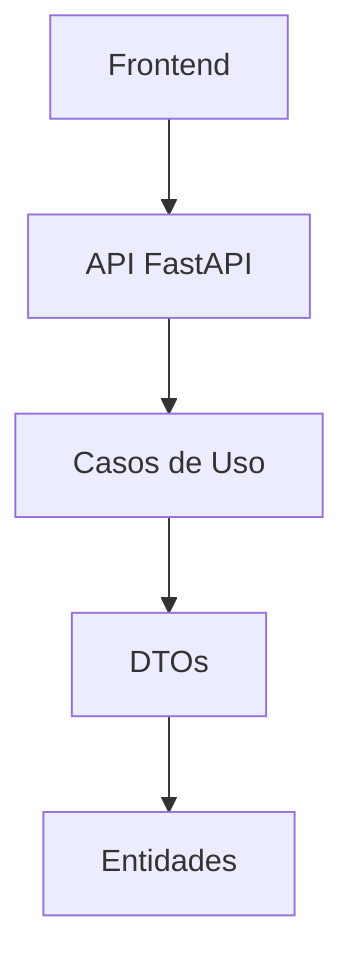

# Checklist de Definición de Tarea para Orchestrator: Desarrollo del frontend PKM con React+NextJS, Tailwind y ShadCN para operaciones CRUD

## Fase 0: Entendimiento Inicial y Preparación
- [x] Objetivo principal de la tarea a definir para el Orchestrator comprendido (basado en input del Usuario).
- [x] Identificadas las principales entidades o componentes del proyecto involucrados (proyectos, subproyectos, notas).
- [ ] Revisado el archivo `project_coder_profile.md` (o similar, el perfil tecnológico del proyecto) para entender el contexto técnico general.
- [x] Leídos otros archivos de alto nivel del proyecto (README.md proporcionado por el usuario).

## Fase 1: Recopilación y Análisis de Información (Iterativo, por sección del Prompt del Orchestrator)

### 1.1. Task Title (para el Orchestrator)
- [x] Discutido con el Usuario y obtenida la idea central para el título.
- [x] (Opcional) Delegado al modo `think`: "Sugerir 3-5 opciones concisas y descriptivas para el `Task Title` de una tarea de Orchestrator sobre [tema central]".
- [x] (Opcional) Output del modo `think` para `Task Title` recibido y revisado.
- [x] `Task Title` final redactado y confirmado con el Usuario: "Desarrollo del frontend PKM con React+NextJS, Tailwind y ShadCN para operaciones CRUD"

### 1.2. Context (para el Orchestrator)
- [x] Discutido con el Usuario y obtenida la información de fondo, relación con el proyecto mayor, stack tecnológico relevante, y el "por qué" de la tarea.
- [x] (Opcional) Solicitado al Usuario archivos `.md` adicionales si el contexto es muy complejo y necesita ser documentado.
- [x] Delegado al modo `think`: "Analizar la siguiente información de contexto [resumen del Architect o referencia a notas/archivos] y estructurar la sección 'Context' para el prompt del Orchestrator, destacando [puntos clave especificados por Architect]".
- [x] Output del modo `think` para `Context` recibido y revisado.

**Propuesta de Contexto Revisada:**

### Contexto para Desarrollo Fullstack PKM

#### Estado Actual del Proyecto
- ✅ **Componentes existentes**:
  - Casos de uso implementados
  - Interfaces definidas
  - DTOs desarrollados
- ⚙️ **Por implementar**:
  - API REST con FastAPI
  - Frontend con React/Next.js

#### Objetivos Principales
1. **Desarrollo API**:
   - Implementar endpoints REST basados en DTOs existentes
   - Integrar casos de uso mediante inyección de dependencias
   - Configurar autenticación JWT

2. **Desarrollo Frontend**:
   - Implementar interfaz para gestión jerárquica de proyectos/notas
   - Consumir API mediante servicios dedicados
   - Mantener desacoplamiento mediante contratos DTO

#### Stack Tecnológico
| Capa         | Tecnologías                           |
|--------------|---------------------------------------|
| Backend      | FastAPI, PostgreSQL                   |
| Frontend     | React, Next.js, Tailwind CSS, ShadCN  |
| Comunicación | REST API (JSON)                       |

#### Diagrama de Flujo

#### Entidades Clave
- Proyectos (con subproyectos)
- Notas (enlazables)
- Relaciones jerárquicas

#### Prioridades
1. Implementación inicial de API con endpoints críticos
2. Desarrollo paralelo de componentes frontend básicos
3. Integración progresiva siguiendo contrato API

- [x] Sección `Context` final redactada y confirmada con el Usuario.

### 1.3. Scope (para el Orchestrator)
- [x] Discutido con el Usuario y definidos los requisitos específicos, límites de la tarea, y componentes principales a desarrollar/gestionar por el Orchestrator.
- [x] Identificadas (si las hay) sub-partes del `Scope` que son particularmente complejas o que podrían necesitar un análisis previo por el "think mode del Orchestrator" (el que el Orchestrator mismo puede invocar, no el asistente del Architect). Marcar estas para incluirlas como nota en el prompt del Orchestrator.
- [x] Delegado al modo `think`: "Desglosar el 'Scope' para la tarea [Nombre Tarea] en pasos lógicos y accionables para el Orchestrator. Considerar el flujo Orchestrator -> PseudoCoder -> Coder. Detallar los sub-objetivos y los pasos del ciclo de desarrollo (Implementar, Tests, Pre-commit) que el Orchestrator deberá asegurar para cada componente. Identificar posibles dependencias o interacciones clave."
- [x] Output del modo `think` para `Scope` recibido y revisado.

**Propuesta de Scope para Orchestrator:**

#### Fase 1: Implementación API FastAPI
1. **Endpoints CRUD**:
   - Proyectos (/projects)
   - Subproyectos (/projects/{id}/subprojects)
   - Notas (/notes)
   
2. **Autenticación**:
   - JWT implementation
   - Protected routes

3. **Integración**:
   - Conexión con casos de uso existentes
   - Mapeo DTOs

#### Fase 2: Desarrollo Frontend Core
1. **Estructura Base**:
   - Configuración Next.js
   - Sistema de rutas
   - Estado global (Zustand)

2. **Componentes Principales**:
   - Vista árbol proyectos
   - Editor de notas
   - Formularios CRUD

#### Fase 3: Integración y Testing
1. **Conexión API-Frontend**:
   - Servicios API
   - Manejo de errores

2. **Testing**:
   - Unit tests
   - Integration tests
   - E2E tests

**Dependencias Clave**:
- Frontend requiere endpoints básicos de API
- Algunos componentes pueden desarrollarse en paralelo

**Flujo Orchestrator**:
1. Para cada componente:
   - Orchestrator define requisitos
   - PseudoCoder diseña solución
   - Coder implementa

- [x] Sección `Scope` final redactada y confirmada con el Usuario.

### 1.4. Expected Output (para el Orchestrator)
- [x] Discutido con el Usuario y detallados los entregables específicos, formatos y criterios de calidad que se esperan al finalizar la tarea del Orchestrator.
- [x] Delegado al modo `think`: "Definir la sección 'Expected Output' para la tarea [Nombre Tarea], asegurando que los entregables sean medibles y los criterios de calidad sean claros. Considerar todos los artefactos (código, tests, documentación, archivos de estado actualizados)."
- [x] Output del modo `think` para `Expected Output` recibido y revisado.

**Expected Output para Desarrollo Fullstack PKM:**

#### 1. Entregables Técnicos
- **API FastAPI**:
  - Endpoints RESTful para todas las entidades
  - Autenticación JWT integrada
  - Documentación Swagger/OpenAPI
- **Frontend Next.js**:
  - Vistas CRUD completas
  - Sistema de enrutamiento dinámico
  - Gestión de estado
- **Servicios de Integración**:
  - Conexión API-Frontend
  - Integración con servicios externos

#### 2. Criterios de Calidad
- **Tests**: 80% cobertura backend, 70% frontend
- **Documentación**: Swagger, JSDoc/TSDoc, ADRs
- **Estándares**: PEP8, ESLint, WCAG 2.1 AA

#### 3. Artefactos Adicionales
- Configuración entorno desarrollo (.env)
- Documentación básica de usuario

#### 4. Validación
- Pruebas E2E con Playwright
- 100% código revisado

- [x] Sección `Expected Output` final redactada y confirmada con el Usuario.

### 1.5. Additional Resources (para el Orchestrator)
- [x] Identificadas y listadas las referencias clave (código existente, DTOs, interfaces, perfiles de proyecto, `code_guidelines.md` generales, herramientas como `codebase_search`, `Context7`).
- [x] (Opcional) Delegado al modo `think`: "Para la tarea [Nombre Tarea] sobre [tema], y considerando el stack [stack_del_proyecto], ¿qué 'Additional Resources' (ejemplos de código específicos a buscar con `codebase_search`, documentación clave de `Context7` a la que el Orchestrator debería apuntar para el PseudoCoder/Coder) serían más pertinentes?"
- [x] (Opcional) Output del modo `think` para `Additional Resources` recibido y revisado.

**Recursos Adicionales Clave:**

1. **FastAPI**:
   - Documentación oficial FastAPI
   - Ejemplos de autenticación JWT
   - Configuración CORS para Next.js

2. **Next.js**:
   - Documentación App Router
   - Ejemplos de consumo de API
   - Configuración Tailwind + ShadCN

3. **ShadCN Components (USAR SERVIDOR MCP @21st-dev/magic OBLIGATORIAMENTE)**:
   - Componentes para formularios CRUD (usar /ui o /21)
   - Tree view para jerarquía proyectos
   - Editor de markdown
   - Acceso a repositorio de componentes mediante MCP

4. **Testing**:
   - Configuración Playwright
   - Ejemplos pruebas E2E para APIs

5. **Código Existente**:
   - DTOs en `src/pkm_app/core/application/dtos`
   - Interfaces en `src/pkm_app/core/application/interfaces`

- [x] Sección `Additional Resources` final redactada y confirmada con el Usuario.

### 1.6. Meta-Information (para el Orchestrator)
- [x] Determinado `priority` con el Usuario: Alta
- [x] Identificadas `dependencies` con el Usuario: Ninguna
- [x] `task_id` se dejará como `[ORCHESTRATOR_WILL_ASSIGN_ID]`.
- [x] `assigned_to` se establecerá como `Orchestrator` (ya que es el prompt para él).
- [x] Sección `Meta-Information` final redactada y confirmada con el Usuario.

## Fase 2: Generación del Prompt Final para el Orchestrator
- [x] Todas las secciones del prompt (Task Title, Context, Scope, Expected Output, Additional Resources, Meta-Information) están completas, redactadas y confirmadas por el Usuario.
- [x] El prompt completo para el Orchestrator ha sido ensamblado.
- [x] El prompt final ha sido escrito en el archivo: `.roo/tasks-prompts/orchestrator_task_def_frontend_pkm.md`.
- [x] Tarea de definición de prompt completada.