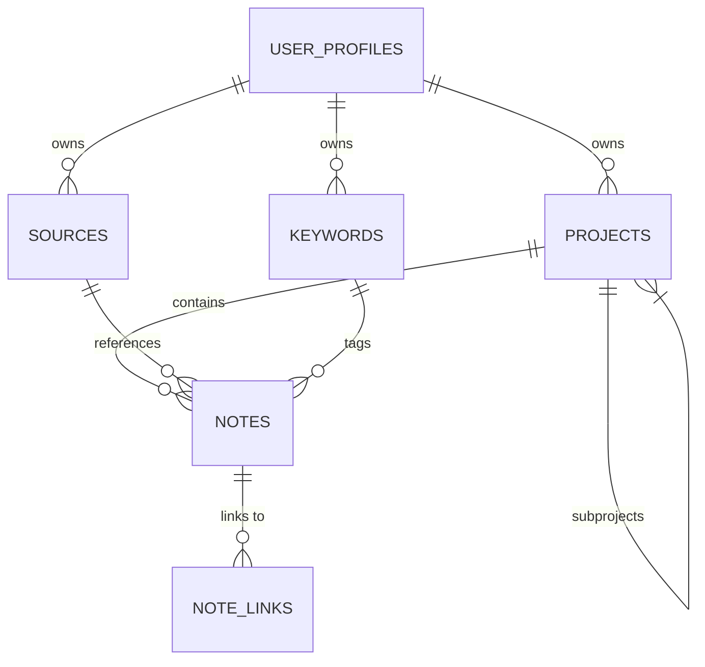

Project Path: minimal-test

Source Tree:

```txt
minimal-test
├── README.md
├── alembic.ini
├── docker-compose.yml
├── frontend
│   ├── README.md
│   ├── components.json
│   ├── eslint.config.mjs
│   ├── next.config.ts
│   ├── package-lock.json
│   ├── package.json
│   ├── postcss.config.mjs
│   ├── public
│   │   ├── file.svg
│   │   ├── globe.svg
│   │   ├── next.svg
│   │   ├── vercel.svg
│   │   └── window.svg
│   ├── src
│   │   ├── app
│   │   │   ├── (auth)
│   │   │   ├── dashboard
│   │   │   ├── favicon.ico
│   │   │   ├── globals.css
│   │   │   ├── layout.tsx
│   │   │   ├── notes
│   │   │   ├── page.tsx
│   │   │   ├── projects
│   │   │   │   └── page.tsx
│   │   │   └── search
│   │   ├── components
│   │   │   ├── forms
│   │   │   │   └── ProjectForm.tsx
│   │   │   ├── navigation
│   │   │   ├── pkm
│   │   │   │   └── TreeView.tsx
│   │   │   └── ui
│   │   │       ├── alert-dialog.tsx
│   │   │       ├── button.tsx
│   │   │       ├── card.tsx
│   │   │       ├── dialog.tsx
│   │   │       ├── form.tsx
│   │   │       ├── input.tsx
│   │   │       ├── label.tsx
│   │   │       ├── select.tsx
│   │   │       └── textarea.tsx
│   │   └── types
│   │       ├── api.ts
│   │       ├── auth.ts
│   │       ├── index.ts
│   │       ├── keyword.ts
│   │       ├── note.ts
│   │       ├── project.ts
│   │       ├── source.ts
│   │       └── user.ts
│   └── tsconfig.json
├── package-lock.json
├── package.json
├── pyproject.toml
├── spec_01_especificacion_kairos_bcp.md
├── spec_phase1.md
├── src
│   ├── __init__.py
│   └── pkm_app
│       ├── __init__.py
│       ├── core
│       │   ├── README.md
│       │   ├── __init__.py
│       │   ├── application
│       │   │   ├── README.md
│       │   │   ├── __init__.py
│       │   │   ├── dtos
│       │   │   │   ├── __init__.py
│       │   │   │   ├── keyword_dto.py
│       │   │   │   ├── note_dto.py
│       │   │   │   ├── note_link_dto.py
│       │   │   │   ├── project_dto.py
│       │   │   │   ├── source_dto.py
│       │   │   │   └── user_profile_dto.py
│       │   │   ├── interfaces
│       │   │   │   ├── __init__.py
│       │   │   │   ├── keyword_interface.py
│       │   │   │   ├── note_interface.py
│       │   │   │   ├── note_link_interface.py
│       │   │   │   ├── project_interface.py
│       │   │   │   ├── source_interface.py
│       │   │   │   ├── unit_of_work_interface.py
│       │   │   │   └── user_profile_interface.py
│       │   │   └── use_cases
│       │   │       ├── __init__.py
│       │   │       ├── keyword
│       │   │       │   ├── __init__.py
│       │   │       │   ├── create_keyword_use_case.py
│       │   │       │   ├── delete_keyword_use_case.py
│       │   │       │   ├── get_keyword_use_case.py
│       │   │       │   ├── list_keywords_use_case.py
│       │   │       │   └── update_keyword_use_case.py
│       │   │       ├── note
│       │   │       │   ├── __init__.py
│       │   │       │   ├── create_note_use_case.py
│       │   │       │   ├── delete_note_use_case.py
│       │   │       │   ├── get_note_use_case.py
│       │   │       │   ├── list_notes_use_case.py
│       │   │       │   ├── search_notes_by_project_use_case.py
│       │   │       │   ├── update_note_use_case.py
│       │   │       │   └── update_note_use_case_new.py
│       │   │       ├── note_link
│       │   │       │   ├── __init__.py
│       │   │       │   ├── create_note_link_use_case.py
│       │   │       │   ├── delete_note_link_use_case.py
│       │   │       │   ├── get_note_link_use_case.py
│       │   │       │   ├── list_note_links_use_case.py
│       │   │       │   └── update_note_link_use_case.py
│       │   │       ├── project
│       │   │       │   ├── __init__.py
│       │   │       │   ├── create_project_use_case.py
│       │   │       │   ├── delete_project_use_case.py
│       │   │       │   ├── get_project_use_case.py
│       │   │       │   ├── list_projects_use_case.py
│       │   │       │   └── update_project_use_case.py
│       │   │       ├── source
│       │   │       │   ├── __init__.py
│       │   │       │   ├── create_source_use_case.py
│       │   │       │   ├── delete_source_use_case.py
│       │   │       │   ├── get_source_use_case.py
│       │   │       │   ├── list_sources_use_case.py
│       │   │       │   └── update_source_use_case.py
│       │   │       └── user_profile
│       │   │           ├── __init__.py
│       │   │           ├── create_user_profile_use_case.py
│       │   │           ├── delete_user_profile_use_case.py
│       │   │           ├── get_user_profile_use_case.py
│       │   │           ├── list_user_profiles_use_case.py
│       │   │           └── update_user_profile_use_case.py
│       │   └── domain
│       │       ├── README.md
│       │       ├── __init__.py
│       │       ├── entities
│       │       │   ├── __init__.py
│       │       │   ├── entity.py
│       │       │   ├── keyword.py
│       │       │   ├── note.py
│       │       │   ├── note_link.py
│       │       │   ├── project.py
│       │       │   ├── source.py
│       │       │   ├── tag.py
│       │       │   └── user_profile.py
│       │       ├── errors.py
│       │       └── services
│       │           └── __init__.py
│       ├── infrastructure
│       │   ├── README.md
│       │   ├── __init__.py
│       │   ├── config
│       │   │   ├── __init__.py
│       │   │   └── settings.py
│       │   ├── persistence
│       │   │   ├── README.md
│       │   │   ├── __init__.py
│       │   │   ├── migrations
│       │   │   │   ├── README
│       │   │   │   ├── __init__.py
│       │   │   │   ├── env.py
│       │   │   │   ├── script.py.mako
│       │   │   │   └── versions
│       │   │   │       ├── 20250602_201844_seed_data.py
│       │   │   │       ├── README.md
│       │   │   │       ├── __init__.py
│       │   │   │       └── e9e6a35c39f1_initial_migration_setup.py
│       │   │   ├── schema
│       │   │   │   ├── seed.sql
│       │   │   │   └── seed_old.sql
│       │   │   └── sqlalchemy
│       │   │       ├── __init__.py
│       │   │       ├── database.py
│       │   │       ├── models
│       │   │       │   ├── README.md
│       │   │       │   ├── __init__.py
│       │   │       │   ├── associations.py
│       │   │       │   ├── base.py
│       │   │       │   ├── keyword.py
│       │   │       │   ├── note.py
│       │   │       │   ├── note_link.py
│       │   │       │   ├── project.py
│       │   │       │   ├── source.py
│       │   │       │   └── user_profile.py
│       │   │       ├── repositories
│       │   │       │   ├── README.md
│       │   │       │   ├── __init__.py
│       │   │       │   ├── keyword_repository.py
│       │   │       │   ├── note_link_repository.py
│       │   │       │   ├── note_repository.py
│       │   │       │   ├── project_repository.py
│       │   │       │   ├── source_repository.py
│       │   │       │   └── user_profile_repository.py
│       │   │       └── unit_of_work.py
│       │   └── web
│       │       ├── README.md
│       │       ├── __init__.py
│       │       └── streamlit_ui
│       │           ├── __init__.py
│       │           ├── app.py
│       │           └── views
│       │               └── __init__.py
│       ├── logging_config.py
│       ├── main.py
│       └── tests
│           ├── README.md
│           ├── TEST_DATA_README.md
│           ├── __init__.py
│           ├── conftest.py
│           ├── data_generation
│           │   ├── README.MD
│           │   ├── __init__.py
│           │   ├── generate_test_data.py
│           │   ├── keywords_data.py
│           │   ├── note_links_data.py
│           │   ├── notes_data.py
│           │   ├── projects_data.py
│           │   ├── sources_data.py
│           │   ├── sql_generator.py
│           │   └── users_data.py
│           ├── e2e
│           │   └── __init__.py
│           ├── integration
│           │   ├── __init__.py
│           │   ├── infrastructure
│           │   │   └── __init__.py
│           │   └── persistence
│           │       ├── __init__.py
│           │       └── sqlachemy
│           │           ├── __init__.py
│           │           ├── repositories
│           │           │   ├── __init__.py
│           │           │   ├── test_note_workflow.py
│           │           │   └── test_project_workflow.py
│           │           ├── test_repository_integration.py
│           │           └── test_sqlalchemy_models.py
│           └── unit
│               ├── __init__.py
│               ├── core
│               │   ├── __init__.py
│               │   ├── application
│               │   │   ├── __init__.py
│               │   │   ├── dtos
│               │   │   │   ├── __init__.py
│               │   │   │   ├── test_keyword_dto.py
│               │   │   │   ├── test_note_dto.py
│               │   │   │   ├── test_note_link_dto.py
│               │   │   │   ├── test_project_dto.py
│               │   │   │   ├── test_source_dto.py
│               │   │   │   └── test_user_profile_dto.py
│               │   │   └── use_cases
│               │   │       ├── note
│               │   │       │   ├── __init__.py
│               │   │       │   ├── test_create_note_use_case.py
│               │   │       │   ├── test_delete_note_use_case.py
│               │   │       │   ├── test_get_note_use_case.py
│               │   │       │   ├── test_list_notes_use_case.py
│               │   │       │   ├── test_search_notes_by_project_use_case.py
│               │   │       │   └── test_update_note_use_case.py
│               │   │       ├── note_link
│               │   │       │   ├── test_create_note_link_use_case.py
│               │   │       │   ├── test_delete_note_link_use_case.py
│               │   │       │   ├── test_get_note_link_use_case.py
│               │   │       │   ├── test_list_note_links_use_case.py
│               │   │       │   └── test_update_note_link_use_case.py
│               │   │       ├── project
│               │   │       │   ├── test_create_project_use_case.py
│               │   │       │   ├── test_delete_project_use_case.py
│               │   │       │   ├── test_get_project_use_case.py
│               │   │       │   ├── test_list_projects_use_case.py
│               │   │       │   └── test_update_project_use_case.py
│               │   │       ├── source
│               │   │       ├── test_keyword
│               │   │       │   ├── __init__.py
│               │   │       │   ├── test_create_keyword_use_case.py
│               │   │       │   ├── test_delete_keyword_use_case.py
│               │   │       │   ├── test_get_keyword_use_case.py
│               │   │       │   ├── test_list_keywords_use_case.py
│               │   │       │   └── test_update_keyword_use_case.py
│               │   │       └── user_profile
│               │   │           ├── __init__.py
│               │   │           ├── test_create_user_profile_use_case.py
│               │   │           ├── test_delete_user_profile_use_case.py
│               │   │           ├── test_get_user_profile_use_case.py
│               │   │           ├── test_list_user_profiles_use_case.py
│               │   │           └── test_update_user_profile_use_case.py
│               │   └── domain
│               │       ├── __init__.py
│               │       └── entities
│               │           ├── test_entity.py
│               │           ├── test_keyword_entity.py
│               │           ├── test_note.py
│               │           ├── test_note_link.py
│               │           ├── test_project.py
│               │           ├── test_source.py
│               │           ├── test_tag.py
│               │           └── test_user_profile.py
│               └── infrastructure
│                   ├── __init__.py
│                   └── persistence
│                       └── sqlalchemy
│                           └── test_database.py
├── tests
│   ├── index.js
│   └── index.ts
└── tree_template.hbs

```

`minimal-test/README.md`:

```md
# Kairos BCP: Sistema de Gestión de Conocimiento Personal

Kairos BCP es una aplicación de Gestión de Conocimiento Personal (PKM) diseñada para permitir a los usuarios capturar, organizar, enlazar y recuperar información de manera eficiente. Este sistema busca fomentar la creación de una base de conocimiento personal interconectada.

Este README describe la arquitectura del backend, las tecnologías utilizadas y las directrices iniciales para el plan de desarrollo, derivados de una investigación exhaustiva (referida como "Informe de Arquitectura Backend").

## 🏛️ Arquitectura General y Estructura del Proyecto

La arquitectura elegida para el backend de Kairos BCP es la **Arquitectura Limpia (Clean Architecture)**, complementada con un **énfasis modular interno**. Esta decisión se fundamenta en su capacidad superior para ofrecer alta mantenibilidad, testeabilidad y flexibilidad, cruciales para gestionar la complejidad de una aplicación PKM y asegurar su evolución a largo plazo.

### Principios Arquitectónicos Clave:
* **Separación de Responsabilidades Estricta**: El núcleo de la aplicación, que comprende la lógica de negocio y las entidades, se mantiene aislado de los detalles de infraestructura como frameworks, la base de datos o la interfaz de usuario.
* **Regla de Dependencia**: Todas las dependencias de código fuente apuntan estrictamente hacia el interior, hacia las capas de mayor nivel de abstracción (el dominio), protegiendo así el núcleo de la aplicación de cambios en las capas externas.
* **Énfasis Modular Interno**: Aunque la aplicación se despliega como un monolito, su código se organiza internamente en módulos lógicos. Estos módulos se basan en las funcionalidades principales del PKM (por ejemplo, gestión de notas, enlaces, búsqueda), inspirándose en los principios del Monolito Modular para mejorar la organización y la escalabilidad del desarrollo sin introducir la complejidad de los microservicios.

### Estructura de Directorios:
La estructura del proyecto está meticulosamente diseñada para reflejar estas capas y principios arquitectónicos. Una descripción detallada se encuentra en la Sección V.A del "Informe de Arquitectura Backend"  y se puede explorar dentro del directorio `src/pkm_app/` de este proyecto. Esta estructura refuerza la separación de responsabilidades y facilita la navegación y comprensión del código.

## ⚙️ Tecnologías Clave y su Integración

El backend de Kairos BCP utilizará el siguiente stack tecnológico, integrado según los principios de la Arquitectura Limpia:

* **Python**: Como lenguaje principal para el desarrollo del backend, seleccionado por su simplicidad, legibilidad y el vasto ecosistema de librerías y frameworks.
* **PostgreSQL con pgvector**: Utilizado para la persistencia de datos relacionales y para habilitar capacidades de búsqueda vectorial semántica. La interacción con la base de datos se gestionará a través de implementaciones de repositorios en la capa de infraestructura.
* **SQLAlchemy**: Implementado como el Object-Relational Mapper (ORM) para interactuar con PostgreSQL. Se han desarrollado repositorios async completos que encapsulan la lógica de acceso a datos para todas las entidades del sistema (notas, proyectos, fuentes, enlaces, keywords y perfiles de usuario). La arquitectura utiliza exclusivamente las capacidades asíncronas de SQLAlchemy para optimizar el rendimiento y mantener consistencia arquitectónica. En Streamlit se utiliza `asyncio.run()` para ejecutar operaciones async, mientras que FastAPI aprovecha el soporte nativo para async/await.
* **Pydantic**: Desempeñará un rol central y ubicuo en la aplicación para la definición de entidades de dominio, Value Objects, Data Transfer Objects (DTOs), schemas de API y la gestión de la configuración. Su uso garantizará la validación de datos y la robustez del sistema a través de todas las capas.
* **Streamlit**: Se empleará para construir la interfaz de usuario inicial. Esta UI interactuará con el backend a través de los Casos de Uso definidos en la capa de aplicación, actuando como un cliente "delgado" de la lógica de negocio.
* **FastAPI (Consideración Futura)**: Es el framework preferido para el desarrollo de una API REST en el futuro, debido a su alto rendimiento, soporte asíncrono nativo y excelente integración con Pydantic.

## 🧩 Organización Modular y Colaboración

Para fomentar un desarrollo iterativo eficiente y facilitar la colaboración, el código dentro de las capas de la Arquitectura Limpia se organizará en **módulos lógicos**. Estos módulos se definirán en torno a las principales funcionalidades o dominios del PKM (ej., `notes_module`, `linking_module`, `search_module`, `metadata_module`, `user_module`).

### Comunicación Intermodular (Interna):
* **Síncrona**: Se realizará mediante llamadas a los Casos de Uso (Servicios de Aplicación) expuestos públicamente por cada módulo. Se podría adoptar el patrón Gateway para definir interfaces claras y centralizadas para la comunicación entre módulos.
* **Asíncrona**: Se implementará a través de un sistema de eventos interno. Esto permitirá una comunicación desacoplada, donde un módulo puede emitir un evento (ej. `NoteUpdatedEvent`) y otros módulos interesados pueden suscribirse y reaccionar a dicho evento sin crear dependencias directas. Esto es particularmente útil para manejar acciones en cascada dentro de la PKM.

### Testeabilidad:
La arquitectura adoptada facilita inherentemente la testeabilidad del sistema en diferentes niveles:
* **Tests Unitarios**: Se enfocarán en probar la lógica de negocio dentro de las entidades y servicios de dominio en total aislamiento. Los casos de uso se probarán mockeando las dependencias externas (como los repositorios).
* **Tests de Integración**: Verificarán la correcta integración de los adaptadores de la capa de infraestructura con las herramientas externas reales, como la interacción de los repositorios SQLAlchemy con una base de datos de prueba (PostgreSQL/pgvector).

## 📝 Plan de Diseño y Desarrollo (Directrices Iniciales)

Las siguientes directrices iniciales, extraídas del "Informe de Arquitectura Backend", guiarán el diseño y desarrollo de Kairos BCP:

1.  **Adopción de la Arquitectura**: Implementar la Arquitectura Limpia con un énfasis modular interno como la estructura fundamental del backend.
2.  **Definición de la Estructura de Directorios**: Establecer la estructura de directorios propuesta en el informe (Sección V.A ), la cual está diseñada para reforzar la separación de responsabilidades.
3.  **Diseño del Dominio**: Modelar las entidades de negocio principales (Notas, Enlaces, Tags, etc.) y Value Objects utilizando Pydantic para asegurar la integridad y validación de los datos del dominio.
4.  **Definición de Puertos**: Especificar las interfaces abstractas (Puertos) para los repositorios en la capa de aplicación. Estas interfaces definirán los contratos para las operaciones de persistencia y consulta de datos que necesitarán los casos de uso.
5.  **Desarrollo de Casos de Uso**: Implementar la lógica de aplicación para las funcionalidades prioritarias de la PKM, orquestando el flujo de datos y las interacciones con el dominio y los puertos.
6.  **Implementación de Adaptadores de Persistencia**: Crear las clases de repositorio concretas que implementen las interfaces (puertos) definidas, utilizando SQLAlchemy para la interacción con PostgreSQL y pgvector.
7.  **Construcción de la UI Inicial**: Desarrollar la interfaz de usuario con Streamlit, asegurando que las vistas interactúen con el backend a través de los casos de uso definidos.
8.  **Estrategia de Testing Temprana**: Incorporar la escritura de tests unitarios y de integración como parte integral del ciclo de desarrollo desde el inicio del proyecto.
9.  **Configuración de Herramientas de Calidad**: Implementar y configurar herramientas de calidad de código como linters, formateadores y analizadores estáticos (más detalles se abordarán con el Prompt 5).
10. **Consideración de Comunicación Asíncrona**: Diseñar los módulos teniendo en cuenta la posibilidad de una comunicación basada en eventos para operaciones que se beneficien del desacoplamiento y el procesamiento en segundo plano.

## 📚 Proyectos de Referencia

El diseño y desarrollo de Kairos BCP se inspirará en las mejores prácticas observadas en varios proyectos de código abierto bien estructurados. Algunos ejemplos notables incluyen:

* `bodaue/fastapi-clean-architecture`: Proporciona una plantilla moderna para aplicaciones FastAPI siguiendo la Arquitectura Limpia, con SQLAlchemy asíncrono y Alembic.
* `arctikant/fastapi-modular-monolith-starter-kit`: Ofrece un excelente ejemplo de cómo lograr modularidad interna dentro de un monolito, incluyendo la comunicación intermodular y la gestión de componentes centrales.
* Ejemplos de Arquitectura Hexagonal: Proyectos como `serfer2/flask-hexagonal-architecture-api`  y `workflows-guru/hexagonal-architecture`  ilustran la implementación práctica de Puertos y Adaptadores con Flask/FastAPI y SQLAlchemy.

La convergencia de herramientas como Pydantic, SQLAlchemy y Alembic dentro de estructuras como la Arquitectura Limpia/Hexagonal en estos proyectos de referencia sugiere un conjunto de patrones maduros y bien establecidos para construir backends Python robustos, proporcionando una base sólida para Kairos BCP.

```

`minimal-test/alembic.ini`:

```ini
# A generic, single database configuration.

[alembic]
# path to migration scripts.
# this is typically a path given in POSIX (e.g. forward slashes)
# format, relative to the token %(here)s which refers to the location of this
# ini file
script_location = %(here)s/src/pkm_app/infrastructure/persistence/migrations

# template used to generate migration file names; The default value is %%(rev)s_%%(slug)s
# Uncomment the line below if you want the files to be prepended with date and time
# see https://alembic.sqlalchemy.org/en/latest/tutorial.html#editing-the-ini-file
# for all available tokens
# file_template = %%(year)d_%%(month).2d_%%(day).2d_%%(hour).2d%%(minute).2d-%%(rev)s_%%(slug)s

# sys.path path, will be prepended to sys.path if present.
# defaults to the current working directory.  for multiple paths, the path separator
# is defined by "path_separator" below.
prepend_sys_path = .


# timezone to use when rendering the date within the migration file
# as well as the filename.
# If specified, requires the python>=3.9 or backports.zoneinfo library and tzdata library.
# Any required deps can installed by adding `alembic[tz]` to the pip requirements
# string value is passed to ZoneInfo()
# leave blank for localtime
# timezone =

# max length of characters to apply to the "slug" field
# truncate_slug_length = 40

# set to 'true' to run the environment during
# the 'revision' command, regardless of autogenerate
# revision_environment = false

# set to 'true' to allow .pyc and .pyo files without
# a source .py file to be detected as revisions in the
# versions/ directory
# sourceless = false

# version location specification; This defaults
# to <script_location>/versions.  When using multiple version
# directories, initial revisions must be specified with --version-path.
# The path separator used here should be the separator specified by "path_separator"
# below.
# version_locations = %(here)s/bar:%(here)s/bat:%(here)s/alembic/versions

# path_separator; This indicates what character is used to split lists of file
# paths, including version_locations and prepend_sys_path within configparser
# files such as alembic.ini.
# The default rendered in new alembic.ini files is "os", which uses os.pathsep
# to provide os-dependent path splitting.
#
# Note that in order to support legacy alembic.ini files, this default does NOT
# take place if path_separator is not present in alembic.ini.  If this
# option is omitted entirely, fallback logic is as follows:
#
# 1. Parsing of the version_locations option falls back to using the legacy
#    "version_path_separator" key, which if absent then falls back to the legacy
#    behavior of splitting on spaces and/or commas.
# 2. Parsing of the prepend_sys_path option falls back to the legacy
#    behavior of splitting on spaces, commas, or colons.
#
# Valid values for path_separator are:
#
# path_separator = :
# path_separator = ;
# path_separator = space
# path_separator = newline
#
# Use os.pathsep. Default configuration used for new projects.
path_separator = os

# set to 'true' to search source files recursively
# in each "version_locations" directory
# new in Alembic version 1.10
# recursive_version_locations = false

# the output encoding used when revision files
# are written from script.py.mako
# output_encoding = utf-8

# database URL.  This is consumed by the user-maintained env.py script only.
# other means of configuring database URLs may be customized within the env.py
# file.
sqlalchemy.url = %(DB_CONNECTION_STRING)s


[post_write_hooks]
# post_write_hooks defines scripts or Python functions that are run
# on newly generated revision scripts.  See the documentation for further
# detail and examples

# format using "black" - use the console_scripts runner, against the "black" entrypoint
# hooks = black
# black.type = console_scripts
# black.entrypoint = black
# black.options = -l 79 REVISION_SCRIPT_FILENAME

# lint with attempts to fix using "ruff" - use the exec runner, execute a binary
# hooks = ruff
# ruff.type = exec
# ruff.executable = %(here)s/.venv/bin/ruff
# ruff.options = check --fix REVISION_SCRIPT_FILENAME

# Logging configuration.  This is also consumed by the user-maintained
# env.py script only.
[loggers]
keys = root,sqlalchemy,alembic

[handlers]
keys = console

[formatters]
keys = generic

[logger_root]
level = WARNING
handlers = console
qualname =

[logger_sqlalchemy]
level = WARNING
handlers =
qualname = sqlalchemy.engine

[logger_alembic]
level = INFO
handlers =
qualname = alembic

[handler_console]
class = StreamHandler
args = (sys.stderr,)
level = NOTSET
formatter = generic

[formatter_generic]
format = %(levelname)-5.5s [%(name)s] %(message)s
datefmt = %H:%M:%S

```

`minimal-test/docker-compose.yml`:

```yml
services:
  # Servicio de la base de datos PostgreSQL con pgvector
  db:
    image: pgvector/pgvector:pg17 # Imagen con PostgreSQL 17 y pgvector. ¡Buena elección!
    container_name: kairos-bcp-db # Nombre del contenedor. Claro y específico.
    restart: unless-stopped # Política de reinicio adecuada para desarrollo.
    environment:
      POSTGRES_USER: ${DB_USER}
      POSTGRES_PASSWORD: ${DB_PASSWORD}
      POSTGRES_DB: ${DB_NAME}
    ports:
      - "5432:5432" # Mapeo estándar.
    volumes:
      - kairos_db_data:/var/lib/postgresql/data # Persistencia de datos con volumen nombrado. Perfecto.
      # Si la carpeta 'init-scripts' va a estar en la raíz del proyecto (junto a docker-compose.yml),
      # entonces la ruta sería '- ./init-scripts:/docker-entrypoint-initdb.d'
      # o si va a estar dentro de 'src/', sería '- ./src/init-scripts:/docker-entrypoint-initdb.d'.
      # La imagen pgvector/pgvector ya debería tener la extensión pgvector disponible,
      # pero esto es útil para crear tablas o roles iniciales.
    command:
      - "postgres"
      - "-c"
      - "shared_buffers=256MB"
    healthcheck: # Comprobación de salud para asegurar que la DB esté lista.
      # El usuario 'postgres' suele ser el superusuario por defecto, y pg_isready con él
      # verifica si el servidor está aceptando conexiones, lo cual es generalmente suficiente.
      # Si ${DB_USER} es diferente de 'postgres', esta prueba no verifica que ESE usuario pueda conectar,
      # pero sí que el servicio PostgreSQL está operativo.
      test: ["CMD-SHELL", "pg_isready -U ${DB_USER:-postgres} -d ${DB_NAME}"]
      interval: 10s
      timeout: 5s
      retries: 5

  # Servicio de pgAdmin para gestionar PostgreSQL
  pgadmin:
    image: dpage/pgadmin4:latest
    restart: unless-stopped # Política de reinicio adecuada para desarrollo.
    container_name: kairos-bcp-pgadmin
    environment:
      PGADMIN_DEFAULT_EMAIL: ${PGADMIN_EMAIL} # Correcto.
      PGADMIN_DEFAULT_PASSWORD: ${PGADMIN_PASSWORD} # Correcto.
    ports:
      - "8080:80" # Mapeo de puerto estándar para pgAdmin.
    depends_on:
      db:
        condition: service_healthy

  qdrant:
    image: qdrant/qdrant
    ports:
      - "6333:6333"
    volumes:
      - qdrant_storage:/qdrant/storage


volumes:
  kairos_db_data: # Volumen para persistir los datos de PostgreSQL (nombre actualizado). Correcto.
  qdrant_storage: # Volumen para persistir los datos de Qdrant (nombre actualizado). Correcto.

```

`minimal-test/frontend\README.md`:

```md
# PKM Frontend

Personal Knowledge Management system frontend built with Next.js 15, TypeScript, and Tailwind CSS.

## Features

- 🏗️ **Project Management**: Hierarchical project organization with TreeView
- 📝 **Note Taking**: Rich note creation and management system
- 🔍 **Search**: Advanced search capabilities
- 🔗 **Knowledge Linking**: Connect related notes and concepts
- 📚 **Source Management**: Track and organize information sources
- 🏷️ **Tagging System**: Flexible keyword-based categorization
- 🎨 **Modern UI**: Built with ShadCN UI components
- 📱 **Responsive Design**: Works on desktop and mobile devices

## Tech Stack

- **Framework**: Next.js 15 (App Router)
- **Language**: TypeScript
- **Styling**: Tailwind CSS
- **UI Components**: ShadCN UI
- **State Management**: Zustand
- **Forms**: React Hook Form + Zod validation
- **HTTP Client**: Axios
- **Icons**: Lucide React

## Getting Started

### Prerequisites

- Node.js 18+
- npm or yarn
- Backend API running (see main README)

### Installation

1. Install dependencies:
```bash
npm install
```

2. Copy environment variables:
```bash
cp .env.local.example .env.local
```

3. Update environment variables in `.env.local`:
```env
NEXT_PUBLIC_API_URL=http://localhost:8000/api
```

### Development

```bash
# Start development server
npm run dev

# Build for production
npm run build

# Start production server
npm start

# Run linting
npm run lint
```

The application will be available at `http://localhost:3000`.

## Project Structure

```
frontend/
├── src/
│   ├── app/                    # Next.js App Router pages
│   │   ├── (auth)/            # Authentication routes
│   │   ├── dashboard/         # Dashboard page
│   │   ├── projects/          # Projects management
│   │   ├── notes/             # Notes management
│   │   └── search/            # Search functionality
│   ├── components/            # React components
│   │   ├── ui/                # ShadCN UI components
│   │   ├── forms/             # Form components
│   │   ├── navigation/        # Navigation components
│   │   └── pkm/               # PKM-specific components
│   ├── lib/                   # Utilities and configurations
│   │   ├── api/               # API client and services
│   │   ├── auth/              # Authentication utilities
│   │   ├── store/             # Zustand state management
│   │   └── utils/             # General utilities
│   └── types/                 # TypeScript type definitions
├── public/                    # Static assets
└── ...config files
```

## Key Components

### TreeView Component
- Hierarchical display of projects
- Drag & drop support (planned)
- Context menu actions
- Expandable/collapsible nodes

### ProjectForm Component
- Create/edit projects
- Parent project selection
- Form validation with Zod
- Real-time validation feedback

### API Client
- Axios-based HTTP client
- Automatic token refresh
- Request/response interceptors
- Error handling

### State Management
- Zustand stores for different domains
- Persistent state for authentication
- Optimistic updates
- Error state management

## Available Pages

### Home (`/`)
- Landing page with feature overview
- Quick action buttons
- Statistics dashboard

### Projects (`/projects`)
- Project hierarchy visualization
- CRUD operations for projects
- TreeView navigation
- Project details panel

### Notes (`/notes`) - Planned
- Note creation and editing
- Rich text editor
- Note linking system
- Search and filtering

### Search (`/search`) - Planned
- Global search functionality
- Semantic search capabilities
- Filter by content type
- Search history

## API Integration

The frontend communicates with the FastAPI backend through:

- **Authentication**: Token-based auth with automatic refresh
- **Projects API**: Full CRUD operations
- **Notes API**: Note management (planned)
- **Search API**: Search functionality (planned)
- **Sources API**: Source management (planned)
- **Keywords API**: Tag management (planned)

## Development Guidelines

### Code Organization
- Use TypeScript for all code
- Follow Next.js App Router conventions
- Implement responsive design patterns
- Use ShadCN UI components consistently

### State Management
- Use Zustand for client state
- Keep stores focused and domain-specific
- Implement optimistic updates where appropriate
- Handle loading and error states

### Form Handling
- Use React Hook Form + Zod for validation
- Implement proper error messaging
- Provide real-time validation feedback
- Handle form submission states

### API Calls
- Use the centralized API client
- Implement proper error handling
- Show loading states during requests
- Cache responses where appropriate

## Deployment

### Build Process
```bash
npm run build
```

### Environment Variables
- `NEXT_PUBLIC_API_URL`: Backend API URL
- `NEXTAUTH_SECRET`: NextAuth secret (when implemented)
- `NEXTAUTH_URL`: Application URL (when implemented)

### Production Considerations
- Enable compression
- Configure proper caching headers
- Set up monitoring and error tracking
- Implement proper SEO optimization

## Contributing

1. Follow the established code structure
2. Write TypeScript types for all data
3. Test components thoroughly
4. Update documentation as needed
5. Follow the existing naming conventions

## License

This project is part of the PKM system. See the main project LICENSE for details.

```

`minimal-test/frontend\components.json`:

```json
{
  "$schema": "https://ui.shadcn.com/schema.json",
  "style": "new-york",
  "rsc": true,
  "tsx": true,
  "tailwind": {
    "config": "",
    "css": "src/app/globals.css",
    "baseColor": "neutral",
    "cssVariables": true,
    "prefix": ""
  },
  "aliases": {
    "components": "@/components",
    "utils": "@/lib/utils",
    "ui": "@/components/ui",
    "lib": "@/lib",
    "hooks": "@/hooks"
  },
  "iconLibrary": "lucide"
}

```

`minimal-test/frontend\eslint.config.mjs`:

```mjs
import { dirname } from "path";
import { fileURLToPath } from "url";
import { FlatCompat } from "@eslint/eslintrc";

const __filename = fileURLToPath(import.meta.url);
const __dirname = dirname(__filename);

const compat = new FlatCompat({
  baseDirectory: __dirname,
});

const eslintConfig = [
  ...compat.extends("next/core-web-vitals", "next/typescript"),
];

export default eslintConfig;

```

`minimal-test/frontend\next.config.ts`:

```ts
import type { NextConfig } from "next";

const nextConfig: NextConfig = {
  /* config options here */
};

export default nextConfig;

```

`minimal-test/frontend\package-lock.json`:

```json
{
  "name": "frontend",
  "version": "0.1.0",
  "lockfileVersion": 3,
  "requires": true,
  "packages": {
    "": {
      "name": "frontend",
      "version": "0.1.0",
      "dependencies": {
        "@hookform/resolvers": "^5.0.1",
        "@radix-ui/react-alert-dialog": "^1.1.14",
        "@radix-ui/react-dialog": "^1.1.14",
        "@radix-ui/react-label": "^2.1.7",
        "@radix-ui/react-select": "^2.2.5",
        "@radix-ui/react-slot": "^1.2.3",
        "@types/uuid": "^10.0.0",
        "axios": "^1.9.0",
        "class-variance-authority": "^0.7.1",
        "clsx": "^2.1.1",
        "lucide-react": "^0.511.0",
        "next": "15.3.3",
        "next-auth": "^5.0.0-beta.28",
        "react": "^19.0.0",
        "react-dom": "^19.0.0",
        "react-hook-form": "^7.57.0",
        "tailwind-merge": "^3.3.0",
        "uuid": "^11.1.0",
        "zod": "^3.25.48",
        "zustand": "^5.0.5"
      },
      "devDependencies": {
        "@eslint/eslintrc": "^3",
        "@tailwindcss/postcss": "^4",
        "@types/node": "^20",
        "@types/react": "^19",
        "@types/react-dom": "^19",
        "eslint": "^9",
        "eslint-config-next": "15.3.3",
        "tailwindcss": "^4",
        "tw-animate-css": "^1.3.3",
        "typescript": "^5"
      }
    },
    "node_modules/@alloc/quick-lru": {
      "version": "5.2.0",
      "resolved": "https://registry.npmjs.org/@alloc/quick-lru/-/quick-lru-5.2.0.tgz",
      "integrity": "sha512-UrcABB+4bUrFABwbluTIBErXwvbsU/V7TZWfmbgJfbkwiBuziS9gxdODUyuiecfdGQ85jglMW6juS3+z5TsKLw==",
      "dev": true,
      "license": "MIT",
      "engines": {
        "node": ">=10"
      },
      "funding": {
        "url": "https://github.com/sponsors/sindresorhus"
      }
    },
    "node_modules/@ampproject/remapping": {
      "version": "2.3.0",
      "resolved": "https://registry.npmjs.org/@ampproject/remapping/-/remapping-2.3.0.tgz",
      "integrity": "sha512-30iZtAPgz+LTIYoeivqYo853f02jBYSd5uGnGpkFV0M3xOt9aN73erkgYAmZU43x4VfqcnLxW9Kpg3R5LC4YYw==",
      "dev": true,
      "license": "Apache-2.0",
      "dependencies": {
        "@jridgewell/gen-mapping": "^0.3.5",
        "@jridgewell/trace-mapping": "^0.3.24"
      },
      "engines": {
        "node": ">=6.0.0"
      }
    },
    "node_modules/@auth/core": {
      "version": "0.39.1",
      "resolved": "https://registry.npmjs.org/@auth/core/-/core-0.39.1.tgz",
      "integrity": "sha512-McD8slui0oOA1pjR5sPjLPl5Zm//nLP/8T3kr8hxIsvNLvsiudYvPHhDFPjh1KcZ2nFxCkZmP6bRxaaPd/AnLA==",
      "license": "ISC",
      "dependencies": {
        "@panva/hkdf": "^1.2.1",
        "jose": "^6.0.6",
        "oauth4webapi": "^3.3.0",
        "preact": "10.24.3",
        "preact-render-to-string": "6.5.11"
      },
      "peerDependencies": {
        "@simplewebauthn/browser": "^9.0.1",
        "@simplewebauthn/server": "^9.0.2",
        "nodemailer": "^6.8.0"
      },
      "peerDependenciesMeta": {
        "@simplewebauthn/browser": {
          "optional": true
        },
        "@simplewebauthn/server": {
          "optional": true
        },
        "nodemailer": {
          "optional": true
        }
      }
    },
    "node_modules/@emnapi/core": {
      "version": "1.4.3",
      "resolved": "https://registry.npmjs.org/@emnapi/core/-/core-1.4.3.tgz",
      "integrity": "sha512-4m62DuCE07lw01soJwPiBGC0nAww0Q+RY70VZ+n49yDIO13yyinhbWCeNnaob0lakDtWQzSdtNWzJeOJt2ma+g==",
      "dev": true,
      "license": "MIT",
      "optional": true,
      "dependencies": {
        "@emnapi/wasi-threads": "1.0.2",
        "tslib": "^2.4.0"
      }
    },
    "node_modules/@emnapi/runtime": {
      "version": "1.4.3",
      "resolved": "https://registry.npmjs.org/@emnapi/runtime/-/runtime-1.4.3.tgz",
      "integrity": "sha512-pBPWdu6MLKROBX05wSNKcNb++m5Er+KQ9QkB+WVM+pW2Kx9hoSrVTnu3BdkI5eBLZoKu/J6mW/B6i6bJB2ytXQ==",
      "license": "MIT",
      "optional": true,
      "dependencies": {
        "tslib": "^2.4.0"
      }
    },
    "node_modules/@emnapi/wasi-threads": {
      "version": "1.0.2",
      "resolved": "https://registry.npmjs.org/@emnapi/wasi-threads/-/wasi-threads-1.0.2.tgz",
      "integrity": "sha512-5n3nTJblwRi8LlXkJ9eBzu+kZR8Yxcc7ubakyQTFzPMtIhFpUBRbsnc2Dv88IZDIbCDlBiWrknhB4Lsz7mg6BA==",
      "dev": true,
      "license": "MIT",
      "optional": true,
      "dependencies": {
        "tslib": "^2.4.0"
      }
    },
    "node_modules/@eslint-community/eslint-utils": {
      "version": "4.7.0",
      "resolved": "https://registry.npmjs.org/@eslint-community/eslint-utils/-/eslint-utils-4.7.0.tgz",
      "integrity": "sha512-dyybb3AcajC7uha6CvhdVRJqaKyn7w2YKqKyAN37NKYgZT36w+iRb0Dymmc5qEJ549c/S31cMMSFd75bteCpCw==",
      "dev": true,
      "license": "MIT",
      "dependencies": {
        "eslint-visitor-keys": "^3.4.3"
      },
      "engines": {
        "node": "^12.22.0 || ^14.17.0 || >=16.0.0"
      },
      "funding": {
        "url": "https://opencollective.com/eslint"
      },
      "peerDependencies": {
        "eslint": "^6.0.0 || ^7.0.0 || >=8.0.0"
      }
    },
    "node_modules/@eslint-community/eslint-utils/node_modules/eslint-visitor-keys": {
      "version": "3.4.3",
      "resolved": "https://registry.npmjs.org/eslint-visitor-keys/-/eslint-visitor-keys-3.4.3.tgz",
      "integrity": "sha512-wpc+LXeiyiisxPlEkUzU6svyS1frIO3Mgxj1fdy7Pm8Ygzguax2N3Fa/D/ag1WqbOprdI+uY6wMUl8/a2G+iag==",
      "dev": true,
      "license": "Apache-2.0",
      "engines": {
        "node": "^12.22.0 || ^14.17.0 || >=16.0.0"
      },
      "funding": {
        "url": "https://opencollective.com/eslint"
      }
    },
    "node_modules/@eslint-community/regexpp": {
      "version": "4.12.1",
      "resolved": "https://registry.npmjs.org/@eslint-community/regexpp/-/regexpp-4.12.1.tgz",
      "integrity": "sha512-CCZCDJuduB9OUkFkY2IgppNZMi2lBQgD2qzwXkEia16cge2pijY/aXi96CJMquDMn3nJdlPV1A5KrJEXwfLNzQ==",
      "dev": true,
      "license": "MIT",
      "engines": {
        "node": "^12.0.0 || ^14.0.0 || >=16.0.0"
      }
    },
    "node_modules/@eslint/config-array": {
      "version": "0.20.0",
      "resolved": "https://registry.npmjs.org/@eslint/config-array/-/config-array-0.20.0.tgz",
      "integrity": "sha512-fxlS1kkIjx8+vy2SjuCB94q3htSNrufYTXubwiBFeaQHbH6Ipi43gFJq2zCMt6PHhImH3Xmr0NksKDvchWlpQQ==",
      "dev": true,
      "license": "Apache-2.0",
      "dependencies": {
        "@eslint/object-schema": "^2.1.6",
        "debug": "^4.3.1",
        "minimatch": "^3.1.2"
      },
      "engines": {
        "node": "^18.18.0 || ^20.9.0 || >=21.1.0"
      }
    },
    "node_modules/@eslint/config-helpers": {
      "version": "0.2.2",
      "resolved": "https://registry.npmjs.org/@eslint/config-helpers/-/config-helpers-0.2.2.tgz",
      "integrity": "sha512-+GPzk8PlG0sPpzdU5ZvIRMPidzAnZDl/s9L+y13iodqvb8leL53bTannOrQ/Im7UkpsmFU5Ily5U60LWixnmLg==",
      "dev": true,
      "license": "Apache-2.0",
      "engines": {
        "node": "^18.18.0 || ^20.9.0 || >=21.1.0"
      }
    },
    "node_modules/@eslint/core": {
      "version": "0.14.0",
      "resolved": "https://registry.npmjs.org/@eslint/core/-/core-0.14.0.tgz",
      "integrity": "sha512-qIbV0/JZr7iSDjqAc60IqbLdsj9GDt16xQtWD+B78d/HAlvysGdZZ6rpJHGAc2T0FQx1X6thsSPdnoiGKdNtdg==",
      "dev": true,
      "license": "Apache-2.0",
      "dependencies": {
        "@types/json-schema": "^7.0.15"
      },
      "engines": {
        "node": "^18.18.0 || ^20.9.0 || >=21.1.0"
      }
    },
    "node_modules/@eslint/eslintrc": {
      "version": "3.3.1",
      "resolved": "https://registry.npmjs.org/@eslint/eslintrc/-/eslintrc-3.3.1.tgz",
      "integrity": "sha512-gtF186CXhIl1p4pJNGZw8Yc6RlshoePRvE0X91oPGb3vZ8pM3qOS9W9NGPat9LziaBV7XrJWGylNQXkGcnM3IQ==",
      "dev": true,
      "license": "MIT",
      "dependencies": {
        "ajv": "^6.12.4",
        "debug": "^4.3.2",
        "espree": "^10.0.1",
        "globals": "^14.0.0",
        "ignore": "^5.2.0",
        "import-fresh": "^3.2.1",
        "js-yaml": "^4.1.0",
        "minimatch": "^3.1.2",
        "strip-json-comments": "^3.1.1"
      },
      "engines": {
        "node": "^18.18.0 || ^20.9.0 || >=21.1.0"
      },
      "funding": {
        "url": "https://opencollective.com/eslint"
      }
    },
    "node_modules/@eslint/js": {
      "version": "9.28.0",
      "resolved": "https://registry.npmjs.org/@eslint/js/-/js-9.28.0.tgz",
      "integrity": "sha512-fnqSjGWd/CoIp4EXIxWVK/sHA6DOHN4+8Ix2cX5ycOY7LG0UY8nHCU5pIp2eaE1Mc7Qd8kHspYNzYXT2ojPLzg==",
      "dev": true,
      "license": "MIT",
      "engines": {
        "node": "^18.18.0 || ^20.9.0 || >=21.1.0"
      },
      "funding": {
        "url": "https://eslint.org/donate"
      }
    },
    "node_modules/@eslint/object-schema": {
      "version": "2.1.6",
      "resolved": "https://registry.npmjs.org/@eslint/object-schema/-/object-schema-2.1.6.tgz",
      "integrity": "sha512-RBMg5FRL0I0gs51M/guSAj5/e14VQ4tpZnQNWwuDT66P14I43ItmPfIZRhO9fUVIPOAQXU47atlywZ/czoqFPA==",
      "dev": true,
      "license": "Apache-2.0",
      "engines": {
        "node": "^18.18.0 || ^20.9.0 || >=21.1.0"
      }
    },
    "node_modules/@eslint/plugin-kit": {
      "version": "0.3.1",
      "resolved": "https://registry.npmjs.org/@eslint/plugin-kit/-/plugin-kit-0.3.1.tgz",
      "integrity": "sha512-0J+zgWxHN+xXONWIyPWKFMgVuJoZuGiIFu8yxk7RJjxkzpGmyja5wRFqZIVtjDVOQpV+Rw0iOAjYPE2eQyjr0w==",
      "dev": true,
      "license": "Apache-2.0",
      "dependencies": {
        "@eslint/core": "^0.14.0",
        "levn": "^0.4.1"
      },
      "engines": {
        "node": "^18.18.0 || ^20.9.0 || >=21.1.0"
      }
    },
    "node_modules/@floating-ui/core": {
      "version": "1.7.1",
      "resolved": "https://registry.npmjs.org/@floating-ui/core/-/core-1.7.1.tgz",
      "integrity": "sha512-azI0DrjMMfIug/ExbBaeDVJXcY0a7EPvPjb2xAJPa4HeimBX+Z18HK8QQR3jb6356SnDDdxx+hinMLcJEDdOjw==",
      "license": "MIT",
      "dependencies": {
        "@floating-ui/utils": "^0.2.9"
      }
    },
    "node_modules/@floating-ui/dom": {
      "version": "1.7.1",
      "resolved": "https://registry.npmjs.org/@floating-ui/dom/-/dom-1.7.1.tgz",
      "integrity": "sha512-cwsmW/zyw5ltYTUeeYJ60CnQuPqmGwuGVhG9w0PRaRKkAyi38BT5CKrpIbb+jtahSwUl04cWzSx9ZOIxeS6RsQ==",
      "license": "MIT",
      "dependencies": {
        "@floating-ui/core": "^1.7.1",
        "@floating-ui/utils": "^0.2.9"
      }
    },
    "node_modules/@floating-ui/react-dom": {
      "version": "2.1.3",
      "resolved": "https://registry.npmjs.org/@floating-ui/react-dom/-/react-dom-2.1.3.tgz",
      "integrity": "sha512-huMBfiU9UnQ2oBwIhgzyIiSpVgvlDstU8CX0AF+wS+KzmYMs0J2a3GwuFHV1Lz+jlrQGeC1fF+Nv0QoumyV0bA==",
      "license": "MIT",
      "dependencies": {
        "@floating-ui/dom": "^1.0.0"
      },
      "peerDependencies": {
        "react": ">=16.8.0",
        "react-dom": ">=16.8.0"
      }
    },
    "node_modules/@floating-ui/utils": {
      "version": "0.2.9",
      "resolved": "https://registry.npmjs.org/@floating-ui/utils/-/utils-0.2.9.tgz",
      "integrity": "sha512-MDWhGtE+eHw5JW7lq4qhc5yRLS11ERl1c7Z6Xd0a58DozHES6EnNNwUWbMiG4J9Cgj053Bhk8zvlhFYKVhULwg==",
      "license": "MIT"
    },
    "node_modules/@hookform/resolvers": {
      "version": "5.0.1",
      "resolved": "https://registry.npmjs.org/@hookform/resolvers/-/resolvers-5.0.1.tgz",
      "integrity": "sha512-u/+Jp83luQNx9AdyW2fIPGY6Y7NG68eN2ZW8FOJYL+M0i4s49+refdJdOp/A9n9HFQtQs3HIDHQvX3ZET2o7YA==",
      "license": "MIT",
      "dependencies": {
        "@standard-schema/utils": "^0.3.0"
      },
      "peerDependencies": {
        "react-hook-form": "^7.55.0"
      }
    },
    "node_modules/@humanfs/core": {
      "version": "0.19.1",
      "resolved": "https://registry.npmjs.org/@humanfs/core/-/core-0.19.1.tgz",
      "integrity": "sha512-5DyQ4+1JEUzejeK1JGICcideyfUbGixgS9jNgex5nqkW+cY7WZhxBigmieN5Qnw9ZosSNVC9KQKyb+GUaGyKUA==",
      "dev": true,
      "license": "Apache-2.0",
      "engines": {
        "node": ">=18.18.0"
      }
    },
    "node_modules/@humanfs/node": {
      "version": "0.16.6",
      "resolved": "https://registry.npmjs.org/@humanfs/node/-/node-0.16.6.tgz",
      "integrity": "sha512-YuI2ZHQL78Q5HbhDiBA1X4LmYdXCKCMQIfw0pw7piHJwyREFebJUvrQN4cMssyES6x+vfUbx1CIpaQUKYdQZOw==",
      "dev": true,
      "license": "Apache-2.0",
      "dependencies": {
        "@humanfs/core": "^0.19.1",
        "@humanwhocodes/retry": "^0.3.0"
      },
      "engines": {
        "node": ">=18.18.0"
      }
    },
    "node_modules/@humanfs/node/node_modules/@humanwhocodes/retry": {
      "version": "0.3.1",
      "resolved": "https://registry.npmjs.org/@humanwhocodes/retry/-/retry-0.3.1.tgz",
      "integrity": "sha512-JBxkERygn7Bv/GbN5Rv8Ul6LVknS+5Bp6RgDC/O8gEBU/yeH5Ui5C/OlWrTb6qct7LjjfT6Re2NxB0ln0yYybA==",
      "dev": true,
      "license": "Apache-2.0",
      "engines": {
        "node": ">=18.18"
      },
      "funding": {
        "type": "github",
        "url": "https://github.com/sponsors/nzakas"
      }
    },
    "node_modules/@humanwhocodes/module-importer": {
      "version": "1.0.1",
      "resolved": "https://registry.npmjs.org/@humanwhocodes/module-importer/-/module-importer-1.0.1.tgz",
      "integrity": "sha512-bxveV4V8v5Yb4ncFTT3rPSgZBOpCkjfK0y4oVVVJwIuDVBRMDXrPyXRL988i5ap9m9bnyEEjWfm5WkBmtffLfA==",
      "dev": true,
      "license": "Apache-2.0",
      "engines": {
        "node": ">=12.22"
      },
      "funding": {
        "type": "github",
        "url": "https://github.com/sponsors/nzakas"
      }
    },
    "node_modules/@humanwhocodes/retry": {
      "version": "0.4.3",
      "resolved": "https://registry.npmjs.org/@humanwhocodes/retry/-/retry-0.4.3.tgz",
      "integrity": "sha512-bV0Tgo9K4hfPCek+aMAn81RppFKv2ySDQeMoSZuvTASywNTnVJCArCZE2FWqpvIatKu7VMRLWlR1EazvVhDyhQ==",
      "dev": true,
      "license": "Apache-2.0",
      "engines": {
        "node": ">=18.18"
      },
      "funding": {
        "type": "github",
        "url": "https://github.com/sponsors/nzakas"
      }
    },
    "node_modules/@img/sharp-darwin-arm64": {
      "version": "0.34.2",
      "resolved": "https://registry.npmjs.org/@img/sharp-darwin-arm64/-/sharp-darwin-arm64-0.34.2.tgz",
      "integrity": "sha512-OfXHZPppddivUJnqyKoi5YVeHRkkNE2zUFT2gbpKxp/JZCFYEYubnMg+gOp6lWfasPrTS+KPosKqdI+ELYVDtg==",
      "cpu": [
        "arm64"
      ],
      "license": "Apache-2.0",
      "optional": true,
      "os": [
        "darwin"
      ],
      "engines": {
        "node": "^18.17.0 || ^20.3.0 || >=21.0.0"
      },
      "funding": {
        "url": "https://opencollective.com/libvips"
      },
      "optionalDependencies": {
        "@img/sharp-libvips-darwin-arm64": "1.1.0"
      }
    },
    "node_modules/@img/sharp-darwin-x64": {
      "version": "0.34.2",
      "resolved": "https://registry.npmjs.org/@img/sharp-darwin-x64/-/sharp-darwin-x64-0.34.2.tgz",
      "integrity": "sha512-dYvWqmjU9VxqXmjEtjmvHnGqF8GrVjM2Epj9rJ6BUIXvk8slvNDJbhGFvIoXzkDhrJC2jUxNLz/GUjjvSzfw+g==",
      "cpu": [
        "x64"
      ],
      "license": "Apache-2.0",
      "optional": true,
      "os": [
        "darwin"
      ],
      "engines": {
        "node": "^18.17.0 || ^20.3.0 || >=21.0.0"
      },
      "funding": {
        "url": "https://opencollective.com/libvips"
      },
      "optionalDependencies": {
        "@img/sharp-libvips-darwin-x64": "1.1.0"
      }
    },
    "node_modules/@img/sharp-libvips-darwin-arm64": {
      "version": "1.1.0",
      "resolved": "https://registry.npmjs.org/@img/sharp-libvips-darwin-arm64/-/sharp-libvips-darwin-arm64-1.1.0.tgz",
      "integrity": "sha512-HZ/JUmPwrJSoM4DIQPv/BfNh9yrOA8tlBbqbLz4JZ5uew2+o22Ik+tHQJcih7QJuSa0zo5coHTfD5J8inqj9DA==",
      "cpu": [
        "arm64"
      ],
      "license": "LGPL-3.0-or-later",
      "optional": true,
      "os": [
        "darwin"
      ],
      "funding": {
        "url": "https://opencollective.com/libvips"
      }
    },
    "node_modules/@img/sharp-libvips-darwin-x64": {
      "version": "1.1.0",
      "resolved": "https://registry.npmjs.org/@img/sharp-libvips-darwin-x64/-/sharp-libvips-darwin-x64-1.1.0.tgz",
      "integrity": "sha512-Xzc2ToEmHN+hfvsl9wja0RlnXEgpKNmftriQp6XzY/RaSfwD9th+MSh0WQKzUreLKKINb3afirxW7A0fz2YWuQ==",
      "cpu": [
        "x64"
      ],
      "license": "LGPL-3.0-or-later",
      "optional": true,
      "os": [
        "darwin"
      ],
      "funding": {
        "url": "https://opencollective.com/libvips"
      }
    },
    "node_modules/@img/sharp-libvips-linux-arm": {
      "version": "1.1.0",
      "resolved": "https://registry.npmjs.org/@img/sharp-libvips-linux-arm/-/sharp-libvips-linux-arm-1.1.0.tgz",
      "integrity": "sha512-s8BAd0lwUIvYCJyRdFqvsj+BJIpDBSxs6ivrOPm/R7piTs5UIwY5OjXrP2bqXC9/moGsyRa37eYWYCOGVXxVrA==",
      "cpu": [
        "arm"
      ],
      "license": "LGPL-3.0-or-later",
      "optional": true,
      "os": [
        "linux"
      ],
      "funding": {
        "url": "https://opencollective.com/libvips"
      }
    },
    "node_modules/@img/sharp-libvips-linux-arm64": {
      "version": "1.1.0",
      "resolved": "https://registry.npmjs.org/@img/sharp-libvips-linux-arm64/-/sharp-libvips-linux-arm64-1.1.0.tgz",
      "integrity": "sha512-IVfGJa7gjChDET1dK9SekxFFdflarnUB8PwW8aGwEoF3oAsSDuNUTYS+SKDOyOJxQyDC1aPFMuRYLoDInyV9Ew==",
      "cpu": [
        "arm64"
      ],
      "license": "LGPL-3.0-or-later",
      "optional": true,
      "os": [
        "linux"
      ],
      "funding": {
        "url": "https://opencollective.com/libvips"
      }
    },
    "node_modules/@img/sharp-libvips-linux-ppc64": {
      "version": "1.1.0",
      "resolved": "https://registry.npmjs.org/@img/sharp-libvips-linux-ppc64/-/sharp-libvips-linux-ppc64-1.1.0.tgz",
      "integrity": "sha512-tiXxFZFbhnkWE2LA8oQj7KYR+bWBkiV2nilRldT7bqoEZ4HiDOcePr9wVDAZPi/Id5fT1oY9iGnDq20cwUz8lQ==",
      "cpu": [
        "ppc64"
      ],
      "license": "LGPL-3.0-or-later",
      "optional": true,
      "os": [
        "linux"
      ],
      "funding": {
        "url": "https://opencollective.com/libvips"
      }
    },
    "node_modules/@img/sharp-libvips-linux-s390x": {
      "version": "1.1.0",
      "resolved": "https://registry.npmjs.org/@img/sharp-libvips-linux-s390x/-/sharp-libvips-linux-s390x-1.1.0.tgz",
      "integrity": "sha512-xukSwvhguw7COyzvmjydRb3x/09+21HykyapcZchiCUkTThEQEOMtBj9UhkaBRLuBrgLFzQ2wbxdeCCJW/jgJA==",
      "cpu": [
        "s390x"
      ],
      "license": "LGPL-3.0-or-later",
      "optional": true,
      "os": [
        "linux"
      ],
      "funding": {
        "url": "https://opencollective.com/libvips"
      }
    },
    "node_modules/@img/sharp-libvips-linux-x64": {
      "version": "1.1.0",
      "resolved": "https://registry.npmjs.org/@img/sharp-libvips-linux-x64/-/sharp-libvips-linux-x64-1.1.0.tgz",
      "integrity": "sha512-yRj2+reB8iMg9W5sULM3S74jVS7zqSzHG3Ol/twnAAkAhnGQnpjj6e4ayUz7V+FpKypwgs82xbRdYtchTTUB+Q==",
      "cpu": [
        "x64"
      ],
      "license": "LGPL-3.0-or-later",
      "optional": true,
      "os": [
        "linux"
      ],
      "funding": {
        "url": "https://opencollective.com/libvips"
      }
    },
    "node_modules/@img/sharp-libvips-linuxmusl-arm64": {
      "version": "1.1.0",
      "resolved": "https://registry.npmjs.org/@img/sharp-libvips-linuxmusl-arm64/-/sharp-libvips-linuxmusl-arm64-1.1.0.tgz",
      "integrity": "sha512-jYZdG+whg0MDK+q2COKbYidaqW/WTz0cc1E+tMAusiDygrM4ypmSCjOJPmFTvHHJ8j/6cAGyeDWZOsK06tP33w==",
      "cpu": [
        "arm64"
      ],
      "license": "LGPL-3.0-or-later",
      "optional": true,
      "os": [
        "linux"
      ],
      "funding": {
        "url": "https://opencollective.com/libvips"
      }
    },
    "node_modules/@img/sharp-libvips-linuxmusl-x64": {
      "version": "1.1.0",
      "resolved": "https://registry.npmjs.org/@img/sharp-libvips-linuxmusl-x64/-/sharp-libvips-linuxmusl-x64-1.1.0.tgz",
      "integrity": "sha512-wK7SBdwrAiycjXdkPnGCPLjYb9lD4l6Ze2gSdAGVZrEL05AOUJESWU2lhlC+Ffn5/G+VKuSm6zzbQSzFX/P65A==",
      "cpu": [
        "x64"
      ],
      "license": "LGPL-3.0-or-later",
      "optional": true,
      "os": [
        "linux"
      ],
      "funding": {
        "url": "https://opencollective.com/libvips"
      }
    },
    "node_modules/@img/sharp-linux-arm": {
      "version": "0.34.2",
      "resolved": "https://registry.npmjs.org/@img/sharp-linux-arm/-/sharp-linux-arm-0.34.2.tgz",
      "integrity": "sha512-0DZzkvuEOqQUP9mo2kjjKNok5AmnOr1jB2XYjkaoNRwpAYMDzRmAqUIa1nRi58S2WswqSfPOWLNOr0FDT3H5RQ==",
      "cpu": [
        "arm"
      ],
      "license": "Apache-2.0",
      "optional": true,
      "os": [
        "linux"
      ],
      "engines": {
        "node": "^18.17.0 || ^20.3.0 || >=21.0.0"
      },
      "funding": {
        "url": "https://opencollective.com/libvips"
      },
      "optionalDependencies": {
        "@img/sharp-libvips-linux-arm": "1.1.0"
      }
    },
    "node_modules/@img/sharp-linux-arm64": {
      "version": "0.34.2",
      "resolved": "https://registry.npmjs.org/@img/sharp-linux-arm64/-/sharp-linux-arm64-0.34.2.tgz",
      "integrity": "sha512-D8n8wgWmPDakc83LORcfJepdOSN6MvWNzzz2ux0MnIbOqdieRZwVYY32zxVx+IFUT8er5KPcyU3XXsn+GzG/0Q==",
      "cpu": [
        "arm64"
      ],
      "license": "Apache-2.0",
      "optional": true,
      "os": [
        "linux"
      ],
      "engines": {
        "node": "^18.17.0 || ^20.3.0 || >=21.0.0"
      },
      "funding": {
        "url": "https://opencollective.com/libvips"
      },
      "optionalDependencies": {
        "@img/sharp-libvips-linux-arm64": "1.1.0"
      }
    },
    "node_modules/@img/sharp-linux-s390x": {
      "version": "0.34.2",
      "resolved": "https://registry.npmjs.org/@img/sharp-linux-s390x/-/sharp-linux-s390x-0.34.2.tgz",
      "integrity": "sha512-EGZ1xwhBI7dNISwxjChqBGELCWMGDvmxZXKjQRuqMrakhO8QoMgqCrdjnAqJq/CScxfRn+Bb7suXBElKQpPDiw==",
      "cpu": [
        "s390x"
      ],
      "license": "Apache-2.0",
      "optional": true,
      "os": [
        "linux"
      ],
      "engines": {
        "node": "^18.17.0 || ^20.3.0 || >=21.0.0"
      },
      "funding": {
        "url": "https://opencollective.com/libvips"
      },
      "optionalDependencies": {
        "@img/sharp-libvips-linux-s390x": "1.1.0"
      }
    },
    "node_modules/@img/sharp-linux-x64": {
      "version": "0.34.2",
      "resolved": "https://registry.npmjs.org/@img/sharp-linux-x64/-/sharp-linux-x64-0.34.2.tgz",
      "integrity": "sha512-sD7J+h5nFLMMmOXYH4DD9UtSNBD05tWSSdWAcEyzqW8Cn5UxXvsHAxmxSesYUsTOBmUnjtxghKDl15EvfqLFbQ==",
      "cpu": [
        "x64"
      ],
      "license": "Apache-2.0",
      "optional": true,
      "os": [
        "linux"
      ],
      "engines": {
        "node": "^18.17.0 || ^20.3.0 || >=21.0.0"
      },
      "funding": {
        "url": "https://opencollective.com/libvips"
      },
      "optionalDependencies": {
        "@img/sharp-libvips-linux-x64": "1.1.0"
      }
    },
    "node_modules/@img/sharp-linuxmusl-arm64": {
      "version": "0.34.2",
      "resolved": "https://registry.npmjs.org/@img/sharp-linuxmusl-arm64/-/sharp-linuxmusl-arm64-0.34.2.tgz",
      "integrity": "sha512-NEE2vQ6wcxYav1/A22OOxoSOGiKnNmDzCYFOZ949xFmrWZOVII1Bp3NqVVpvj+3UeHMFyN5eP/V5hzViQ5CZNA==",
      "cpu": [
        "arm64"
      ],
      "license": "Apache-2.0",
      "optional": true,
      "os": [
        "linux"
      ],
      "engines": {
        "node": "^18.17.0 || ^20.3.0 || >=21.0.0"
      },
      "funding": {
        "url": "https://opencollective.com/libvips"
      },
      "optionalDependencies": {
        "@img/sharp-libvips-linuxmusl-arm64": "1.1.0"
      }
    },
    "node_modules/@img/sharp-linuxmusl-x64": {
      "version": "0.34.2",
      "resolved": "https://registry.npmjs.org/@img/sharp-linuxmusl-x64/-/sharp-linuxmusl-x64-0.34.2.tgz",
      "integrity": "sha512-DOYMrDm5E6/8bm/yQLCWyuDJwUnlevR8xtF8bs+gjZ7cyUNYXiSf/E8Kp0Ss5xasIaXSHzb888V1BE4i1hFhAA==",
      "cpu": [
        "x64"
      ],
      "license": "Apache-2.0",
      "optional": true,
      "os": [
        "linux"
      ],
      "engines": {
        "node": "^18.17.0 || ^20.3.0 || >=21.0.0"
      },
      "funding": {
        "url": "https://opencollective.com/libvips"
      },
      "optionalDependencies": {
        "@img/sharp-libvips-linuxmusl-x64": "1.1.0"
      }
    },
    "node_modules/@img/sharp-wasm32": {
      "version": "0.34.2",
      "resolved": "https://registry.npmjs.org/@img/sharp-wasm32/-/sharp-wasm32-0.34.2.tgz",
      "integrity": "sha512-/VI4mdlJ9zkaq53MbIG6rZY+QRN3MLbR6usYlgITEzi4Rpx5S6LFKsycOQjkOGmqTNmkIdLjEvooFKwww6OpdQ==",
      "cpu": [
        "wasm32"
      ],
      "license": "Apache-2.0 AND LGPL-3.0-or-later AND MIT",
      "optional": true,
      "dependencies": {
        "@emnapi/runtime": "^1.4.3"
      },
      "engines": {
        "node": "^18.17.0 || ^20.3.0 || >=21.0.0"
      },
      "funding": {
        "url": "https://opencollective.com/libvips"
      }
    },
    "node_modules/@img/sharp-win32-arm64": {
      "version": "0.34.2",
      "resolved": "https://registry.npmjs.org/@img/sharp-win32-arm64/-/sharp-win32-arm64-0.34.2.tgz",
      "integrity": "sha512-cfP/r9FdS63VA5k0xiqaNaEoGxBg9k7uE+RQGzuK9fHt7jib4zAVVseR9LsE4gJcNWgT6APKMNnCcnyOtmSEUQ==",
      "cpu": [
        "arm64"
      ],
      "license": "Apache-2.0 AND LGPL-3.0-or-later",
      "optional": true,
      "os": [
        "win32"
      ],
      "engines": {
        "node": "^18.17.0 || ^20.3.0 || >=21.0.0"
      },
      "funding": {
        "url": "https://opencollective.com/libvips"
      }
    },
    "node_modules/@img/sharp-win32-ia32": {
      "version": "0.34.2",
      "resolved": "https://registry.npmjs.org/@img/sharp-win32-ia32/-/sharp-win32-ia32-0.34.2.tgz",
      "integrity": "sha512-QLjGGvAbj0X/FXl8n1WbtQ6iVBpWU7JO94u/P2M4a8CFYsvQi4GW2mRy/JqkRx0qpBzaOdKJKw8uc930EX2AHw==",
      "cpu": [
        "ia32"
      ],
      "license": "Apache-2.0 AND LGPL-3.0-or-later",
      "optional": true,
      "os": [
        "win32"
      ],
      "engines": {
        "node": "^18.17.0 || ^20.3.0 || >=21.0.0"
      },
      "funding": {
        "url": "https://opencollective.com/libvips"
      }
    },
    "node_modules/@img/sharp-win32-x64": {
      "version": "0.34.2",
      "resolved": "https://registry.npmjs.org/@img/sharp-win32-x64/-/sharp-win32-x64-0.34.2.tgz",
      "integrity": "sha512-aUdT6zEYtDKCaxkofmmJDJYGCf0+pJg3eU9/oBuqvEeoB9dKI6ZLc/1iLJCTuJQDO4ptntAlkUmHgGjyuobZbw==",
      "cpu": [
        "x64"
      ],
      "license": "Apache-2.0 AND LGPL-3.0-or-later",
      "optional": true,
      "os": [
        "win32"
      ],
      "engines": {
        "node": "^18.17.0 || ^20.3.0 || >=21.0.0"
      },
      "funding": {
        "url": "https://opencollective.com/libvips"
      }
    },
    "node_modules/@isaacs/fs-minipass": {
      "version": "4.0.1",
      "resolved": "https://registry.npmjs.org/@isaacs/fs-minipass/-/fs-minipass-4.0.1.tgz",
      "integrity": "sha512-wgm9Ehl2jpeqP3zw/7mo3kRHFp5MEDhqAdwy1fTGkHAwnkGOVsgpvQhL8B5n1qlb01jV3n/bI0ZfZp5lWA1k4w==",
      "dev": true,
      "license": "ISC",
      "dependencies": {
        "minipass": "^7.0.4"
      },
      "engines": {
        "node": ">=18.0.0"
      }
    },
    "node_modules/@jridgewell/gen-mapping": {
      "version": "0.3.8",
      "resolved": "https://registry.npmjs.org/@jridgewell/gen-mapping/-/gen-mapping-0.3.8.tgz",
      "integrity": "sha512-imAbBGkb+ebQyxKgzv5Hu2nmROxoDOXHh80evxdoXNOrvAnVx7zimzc1Oo5h9RlfV4vPXaE2iM5pOFbvOCClWA==",
      "dev": true,
      "license": "MIT",
      "dependencies": {
        "@jridgewell/set-array": "^1.2.1",
        "@jridgewell/sourcemap-codec": "^1.4.10",
        "@jridgewell/trace-mapping": "^0.3.24"
      },
      "engines": {
        "node": ">=6.0.0"
      }
    },
    "node_modules/@jridgewell/resolve-uri": {
      "version": "3.1.2",
      "resolved": "https://registry.npmjs.org/@jridgewell/resolve-uri/-/resolve-uri-3.1.2.tgz",
      "integrity": "sha512-bRISgCIjP20/tbWSPWMEi54QVPRZExkuD9lJL+UIxUKtwVJA8wW1Trb1jMs1RFXo1CBTNZ/5hpC9QvmKWdopKw==",
      "dev": true,
      "license": "MIT",
      "engines": {
        "node": ">=6.0.0"
      }
    },
    "node_modules/@jridgewell/set-array": {
      "version": "1.2.1",
      "resolved": "https://registry.npmjs.org/@jridgewell/set-array/-/set-array-1.2.1.tgz",
      "integrity": "sha512-R8gLRTZeyp03ymzP/6Lil/28tGeGEzhx1q2k703KGWRAI1VdvPIXdG70VJc2pAMw3NA6JKL5hhFu1sJX0Mnn/A==",
      "dev": true,
      "license": "MIT",
      "engines": {
        "node": ">=6.0.0"
      }
    },
    "node_modules/@jridgewell/sourcemap-codec": {
      "version": "1.5.0",
      "resolved": "https://registry.npmjs.org/@jridgewell/sourcemap-codec/-/sourcemap-codec-1.5.0.tgz",
      "integrity": "sha512-gv3ZRaISU3fjPAgNsriBRqGWQL6quFx04YMPW/zD8XMLsU32mhCCbfbO6KZFLjvYpCZ8zyDEgqsgf+PwPaM7GQ==",
      "dev": true,
      "license": "MIT"
    },
    "node_modules/@jridgewell/trace-mapping": {
      "version": "0.3.25",
      "resolved": "https://registry.npmjs.org/@jridgewell/trace-mapping/-/trace-mapping-0.3.25.tgz",
      "integrity": "sha512-vNk6aEwybGtawWmy/PzwnGDOjCkLWSD2wqvjGGAgOAwCGWySYXfYoxt00IJkTF+8Lb57DwOb3Aa0o9CApepiYQ==",
      "dev": true,
      "license": "MIT",
      "dependencies": {
        "@jridgewell/resolve-uri": "^3.1.0",
        "@jridgewell/sourcemap-codec": "^1.4.14"
      }
    },
    "node_modules/@napi-rs/wasm-runtime": {
      "version": "0.2.10",
      "resolved": "https://registry.npmjs.org/@napi-rs/wasm-runtime/-/wasm-runtime-0.2.10.tgz",
      "integrity": "sha512-bCsCyeZEwVErsGmyPNSzwfwFn4OdxBj0mmv6hOFucB/k81Ojdu68RbZdxYsRQUPc9l6SU5F/cG+bXgWs3oUgsQ==",
      "dev": true,
      "license": "MIT",
      "optional": true,
      "dependencies": {
        "@emnapi/core": "^1.4.3",
        "@emnapi/runtime": "^1.4.3",
        "@tybys/wasm-util": "^0.9.0"
      }
    },
    "node_modules/@next/env": {
      "version": "15.3.3",
      "resolved": "https://registry.npmjs.org/@next/env/-/env-15.3.3.tgz",
      "integrity": "sha512-OdiMrzCl2Xi0VTjiQQUK0Xh7bJHnOuET2s+3V+Y40WJBAXrJeGA3f+I8MZJ/YQ3mVGi5XGR1L66oFlgqXhQ4Vw==",
      "license": "MIT"
    },
    "node_modules/@next/eslint-plugin-next": {
      "version": "15.3.3",
      "resolved": "https://registry.npmjs.org/@next/eslint-plugin-next/-/eslint-plugin-next-15.3.3.tgz",
      "integrity": "sha512-VKZJEiEdpKkfBmcokGjHu0vGDG+8CehGs90tBEy/IDoDDKGngeyIStt2MmE5FYNyU9BhgR7tybNWTAJY/30u+Q==",
      "dev": true,
      "license": "MIT",
      "dependencies": {
        "fast-glob": "3.3.1"
      }
    },
    "node_modules/@next/swc-darwin-arm64": {
      "version": "15.3.3",
      "resolved": "https://registry.npmjs.org/@next/swc-darwin-arm64/-/swc-darwin-arm64-15.3.3.tgz",
      "integrity": "sha512-WRJERLuH+O3oYB4yZNVahSVFmtxRNjNF1I1c34tYMoJb0Pve+7/RaLAJJizyYiFhjYNGHRAE1Ri2Fd23zgDqhg==",
      "cpu": [
        "arm64"
      ],
      "license": "MIT",
      "optional": true,
      "os": [
        "darwin"
      ],
      "engines": {
        "node": ">= 10"
      }
    },
    "node_modules/@next/swc-darwin-x64": {
      "version": "15.3.3",
      "resolved": "https://registry.npmjs.org/@next/swc-darwin-x64/-/swc-darwin-x64-15.3.3.tgz",
      "integrity": "sha512-XHdzH/yBc55lu78k/XwtuFR/ZXUTcflpRXcsu0nKmF45U96jt1tsOZhVrn5YH+paw66zOANpOnFQ9i6/j+UYvw==",
      "cpu": [
        "x64"
      ],
      "license": "MIT",
      "optional": true,
      "os": [
        "darwin"
      ],
      "engines": {
        "node": ">= 10"
      }
    },
    "node_modules/@next/swc-linux-arm64-gnu": {
      "version": "15.3.3",
      "resolved": "https://registry.npmjs.org/@next/swc-linux-arm64-gnu/-/swc-linux-arm64-gnu-15.3.3.tgz",
      "integrity": "sha512-VZ3sYL2LXB8znNGcjhocikEkag/8xiLgnvQts41tq6i+wql63SMS1Q6N8RVXHw5pEUjiof+II3HkDd7GFcgkzw==",
      "cpu": [
        "arm64"
      ],
      "license": "MIT",
      "optional": true,
      "os": [
        "linux"
      ],
      "engines": {
        "node": ">= 10"
      }
    },
    "node_modules/@next/swc-linux-arm64-musl": {
      "version": "15.3.3",
      "resolved": "https://registry.npmjs.org/@next/swc-linux-arm64-musl/-/swc-linux-arm64-musl-15.3.3.tgz",
      "integrity": "sha512-h6Y1fLU4RWAp1HPNJWDYBQ+e3G7sLckyBXhmH9ajn8l/RSMnhbuPBV/fXmy3muMcVwoJdHL+UtzRzs0nXOf9SA==",
      "cpu": [
        "arm64"
      ],
      "license": "MIT",
      "optional": true,
      "os": [
        "linux"
      ],
      "engines": {
        "node": ">= 10"
      }
    },
    "node_modules/@next/swc-linux-x64-gnu": {
      "version": "15.3.3",
      "resolved": "https://registry.npmjs.org/@next/swc-linux-x64-gnu/-/swc-linux-x64-gnu-15.3.3.tgz",
      "integrity": "sha512-jJ8HRiF3N8Zw6hGlytCj5BiHyG/K+fnTKVDEKvUCyiQ/0r5tgwO7OgaRiOjjRoIx2vwLR+Rz8hQoPrnmFbJdfw==",
      "cpu": [
        "x64"
      ],
      "license": "MIT",
      "optional": true,
      "os": [
        "linux"
      ],
      "engines": {
        "node": ">= 10"
      }
    },
    "node_modules/@next/swc-linux-x64-musl": {
      "version": "15.3.3",
      "resolved": "https://registry.npmjs.org/@next/swc-linux-x64-musl/-/swc-linux-x64-musl-15.3.3.tgz",
      "integrity": "sha512-HrUcTr4N+RgiiGn3jjeT6Oo208UT/7BuTr7K0mdKRBtTbT4v9zJqCDKO97DUqqoBK1qyzP1RwvrWTvU6EPh/Cw==",
      "cpu": [
        "x64"
      ],
      "license": "MIT",
      "optional": true,
      "os": [
        "linux"
      ],
      "engines": {
        "node": ">= 10"
      }
    },
    "node_modules/@next/swc-win32-arm64-msvc": {
      "version": "15.3.3",
      "resolved": "https://registry.npmjs.org/@next/swc-win32-arm64-msvc/-/swc-win32-arm64-msvc-15.3.3.tgz",
      "integrity": "sha512-SxorONgi6K7ZUysMtRF3mIeHC5aA3IQLmKFQzU0OuhuUYwpOBc1ypaLJLP5Bf3M9k53KUUUj4vTPwzGvl/NwlQ==",
      "cpu": [
        "arm64"
      ],
      "license": "MIT",
      "optional": true,
      "os": [
        "win32"
      ],
      "engines": {
        "node": ">= 10"
      }
    },
    "node_modules/@next/swc-win32-x64-msvc": {
      "version": "15.3.3",
      "resolved": "https://registry.npmjs.org/@next/swc-win32-x64-msvc/-/swc-win32-x64-msvc-15.3.3.tgz",
      "integrity": "sha512-4QZG6F8enl9/S2+yIiOiju0iCTFd93d8VC1q9LZS4p/Xuk81W2QDjCFeoogmrWWkAD59z8ZxepBQap2dKS5ruw==",
      "cpu": [
        "x64"
      ],
      "license": "MIT",
      "optional": true,
      "os": [
        "win32"
      ],
      "engines": {
        "node": ">= 10"
      }
    },
    "node_modules/@nodelib/fs.scandir": {
      "version": "2.1.5",
      "resolved": "https://registry.npmjs.org/@nodelib/fs.scandir/-/fs.scandir-2.1.5.tgz",
      "integrity": "sha512-vq24Bq3ym5HEQm2NKCr3yXDwjc7vTsEThRDnkp2DK9p1uqLR+DHurm/NOTo0KG7HYHU7eppKZj3MyqYuMBf62g==",
      "dev": true,
      "license": "MIT",
      "dependencies": {
        "@nodelib/fs.stat": "2.0.5",
        "run-parallel": "^1.1.9"
      },
      "engines": {
        "node": ">= 8"
      }
    },
    "node_modules/@nodelib/fs.stat": {
      "version": "2.0.5",
      "resolved": "https://registry.npmjs.org/@nodelib/fs.stat/-/fs.stat-2.0.5.tgz",
      "integrity": "sha512-RkhPPp2zrqDAQA/2jNhnztcPAlv64XdhIp7a7454A5ovI7Bukxgt7MX7udwAu3zg1DcpPU0rz3VV1SeaqvY4+A==",
      "dev": true,
      "license": "MIT",
      "engines": {
        "node": ">= 8"
      }
    },
    "node_modules/@nodelib/fs.walk": {
      "version": "1.2.8",
      "resolved": "https://registry.npmjs.org/@nodelib/fs.walk/-/fs.walk-1.2.8.tgz",
      "integrity": "sha512-oGB+UxlgWcgQkgwo8GcEGwemoTFt3FIO9ababBmaGwXIoBKZ+GTy0pP185beGg7Llih/NSHSV2XAs1lnznocSg==",
      "dev": true,
      "license": "MIT",
      "dependencies": {
        "@nodelib/fs.scandir": "2.1.5",
        "fastq": "^1.6.0"
      },
      "engines": {
        "node": ">= 8"
      }
    },
    "node_modules/@nolyfill/is-core-module": {
      "version": "1.0.39",
      "resolved": "https://registry.npmjs.org/@nolyfill/is-core-module/-/is-core-module-1.0.39.tgz",
      "integrity": "sha512-nn5ozdjYQpUCZlWGuxcJY/KpxkWQs4DcbMCmKojjyrYDEAGy4Ce19NN4v5MduafTwJlbKc99UA8YhSVqq9yPZA==",
      "dev": true,
      "license": "MIT",
      "engines": {
        "node": ">=12.4.0"
      }
    },
    "node_modules/@panva/hkdf": {
      "version": "1.2.1",
      "resolved": "https://registry.npmjs.org/@panva/hkdf/-/hkdf-1.2.1.tgz",
      "integrity": "sha512-6oclG6Y3PiDFcoyk8srjLfVKyMfVCKJ27JwNPViuXziFpmdz+MZnZN/aKY0JGXgYuO/VghU0jcOAZgWXZ1Dmrw==",
      "license": "MIT",
      "funding": {
        "url": "https://github.com/sponsors/panva"
      }
    },
    "node_modules/@radix-ui/number": {
      "version": "1.1.1",
      "resolved": "https://registry.npmjs.org/@radix-ui/number/-/number-1.1.1.tgz",
      "integrity": "sha512-MkKCwxlXTgz6CFoJx3pCwn07GKp36+aZyu/u2Ln2VrA5DcdyCZkASEDBTd8x5whTQQL5CiYf4prXKLcgQdv29g==",
      "license": "MIT"
    },
    "node_modules/@radix-ui/primitive": {
      "version": "1.1.2",
      "resolved": "https://registry.npmjs.org/@radix-ui/primitive/-/primitive-1.1.2.tgz",
      "integrity": "sha512-XnbHrrprsNqZKQhStrSwgRUQzoCI1glLzdw79xiZPoofhGICeZRSQ3dIxAKH1gb3OHfNf4d6f+vAv3kil2eggA==",
      "license": "MIT"
    },
    "node_modules/@radix-ui/react-alert-dialog": {
      "version": "1.1.14",
      "resolved": "https://registry.npmjs.org/@radix-ui/react-alert-dialog/-/react-alert-dialog-1.1.14.tgz",
      "integrity": "sha512-IOZfZ3nPvN6lXpJTBCunFQPRSvK8MDgSc1FB85xnIpUKOw9en0dJj8JmCAxV7BiZdtYlUpmrQjoTFkVYtdoWzQ==",
      "license": "MIT",
      "dependencies": {
        "@radix-ui/primitive": "1.1.2",
        "@radix-ui/react-compose-refs": "1.1.2",
        "@radix-ui/react-context": "1.1.2",
        "@radix-ui/react-dialog": "1.1.14",
        "@radix-ui/react-primitive": "2.1.3",
        "@radix-ui/react-slot": "1.2.3"
      },
      "peerDependencies": {
        "@types/react": "*",
        "@types/react-dom": "*",
        "react": "^16.8 || ^17.0 || ^18.0 || ^19.0 || ^19.0.0-rc",
        "react-dom": "^16.8 || ^17.0 || ^18.0 || ^19.0 || ^19.0.0-rc"
      },
      "peerDependenciesMeta": {
        "@types/react": {
          "optional": true
        },
        "@types/react-dom": {
          "optional": true
        }
      }
    },
    "node_modules/@radix-ui/react-arrow": {
      "version": "1.1.7",
      "resolved": "https://registry.npmjs.org/@radix-ui/react-arrow/-/react-arrow-1.1.7.tgz",
      "integrity": "sha512-F+M1tLhO+mlQaOWspE8Wstg+z6PwxwRd8oQ8IXceWz92kfAmalTRf0EjrouQeo7QssEPfCn05B4Ihs1K9WQ/7w==",
      "license": "MIT",
      "dependencies": {
        "@radix-ui/react-primitive": "2.1.3"
      },
      "peerDependencies": {
        "@types/react": "*",
        "@types/react-dom": "*",
        "react": "^16.8 || ^17.0 || ^18.0 || ^19.0 || ^19.0.0-rc",
        "react-dom": "^16.8 || ^17.0 || ^18.0 || ^19.0 || ^19.0.0-rc"
      },
      "peerDependenciesMeta": {
        "@types/react": {
          "optional": true
        },
        "@types/react-dom": {
          "optional": true
        }
      }
    },
    "node_modules/@radix-ui/react-collection": {
      "version": "1.1.7",
      "resolved": "https://registry.npmjs.org/@radix-ui/react-collection/-/react-collection-1.1.7.tgz",
      "integrity": "sha512-Fh9rGN0MoI4ZFUNyfFVNU4y9LUz93u9/0K+yLgA2bwRojxM8JU1DyvvMBabnZPBgMWREAJvU2jjVzq+LrFUglw==",
      "license": "MIT",
      "dependencies": {
        "@radix-ui/react-compose-refs": "1.1.2",
        "@radix-ui/react-context": "1.1.2",
        "@radix-ui/react-primitive": "2.1.3",
        "@radix-ui/react-slot": "1.2.3"
      },
      "peerDependencies": {
        "@types/react": "*",
        "@types/react-dom": "*",
        "react": "^16.8 || ^17.0 || ^18.0 || ^19.0 || ^19.0.0-rc",
        "react-dom": "^16.8 || ^17.0 || ^18.0 || ^19.0 || ^19.0.0-rc"
      },
      "peerDependenciesMeta": {
        "@types/react": {
          "optional": true
        },
        "@types/react-dom": {
          "optional": true
        }
      }
    },
    "node_modules/@radix-ui/react-compose-refs": {
      "version": "1.1.2",
      "resolved": "https://registry.npmjs.org/@radix-ui/react-compose-refs/-/react-compose-refs-1.1.2.tgz",
      "integrity": "sha512-z4eqJvfiNnFMHIIvXP3CY57y2WJs5g2v3X0zm9mEJkrkNv4rDxu+sg9Jh8EkXyeqBkB7SOcboo9dMVqhyrACIg==",
      "license": "MIT",
      "peerDependencies": {
        "@types/react": "*",
        "react": "^16.8 || ^17.0 || ^18.0 || ^19.0 || ^19.0.0-rc"
      },
      "peerDependenciesMeta": {
        "@types/react": {
          "optional": true
        }
      }
    },
    "node_modules/@radix-ui/react-context": {
      "version": "1.1.2",
      "resolved": "https://registry.npmjs.org/@radix-ui/react-context/-/react-context-1.1.2.tgz",
      "integrity": "sha512-jCi/QKUM2r1Ju5a3J64TH2A5SpKAgh0LpknyqdQ4m6DCV0xJ2HG1xARRwNGPQfi1SLdLWZ1OJz6F4OMBBNiGJA==",
      "license": "MIT",
      "peerDependencies": {
        "@types/react": "*",
        "react": "^16.8 || ^17.0 || ^18.0 || ^19.0 || ^19.0.0-rc"
      },
      "peerDependenciesMeta": {
        "@types/react": {
          "optional": true
        }
      }
    },
    "node_modules/@radix-ui/react-dialog": {
      "version": "1.1.14",
      "resolved": "https://registry.npmjs.org/@radix-ui/react-dialog/-/react-dialog-1.1.14.tgz",
      "integrity": "sha512-+CpweKjqpzTmwRwcYECQcNYbI8V9VSQt0SNFKeEBLgfucbsLssU6Ppq7wUdNXEGb573bMjFhVjKVll8rmV6zMw==",
      "license": "MIT",
      "dependencies": {
        "@radix-ui/primitive": "1.1.2",
        "@radix-ui/react-compose-refs": "1.1.2",
        "@radix-ui/react-context": "1.1.2",
        "@radix-ui/react-dismissable-layer": "1.1.10",
        "@radix-ui/react-focus-guards": "1.1.2",
        "@radix-ui/react-focus-scope": "1.1.7",
        "@radix-ui/react-id": "1.1.1",
        "@radix-ui/react-portal": "1.1.9",
        "@radix-ui/react-presence": "1.1.4",
        "@radix-ui/react-primitive": "2.1.3",
        "@radix-ui/react-slot": "1.2.3",
        "@radix-ui/react-use-controllable-state": "1.2.2",
        "aria-hidden": "^1.2.4",
        "react-remove-scroll": "^2.6.3"
      },
      "peerDependencies": {
        "@types/react": "*",
        "@types/react-dom": "*",
        "react": "^16.8 || ^17.0 || ^18.0 || ^19.0 || ^19.0.0-rc",
        "react-dom": "^16.8 || ^17.0 || ^18.0 || ^19.0 || ^19.0.0-rc"
      },
      "peerDependenciesMeta": {
        "@types/react": {
          "optional": true
        },
        "@types/react-dom": {
          "optional": true
        }
      }
    },
    "node_modules/@radix-ui/react-direction": {
      "version": "1.1.1",
      "resolved": "https://registry.npmjs.org/@radix-ui/react-direction/-/react-direction-1.1.1.tgz",
      "integrity": "sha512-1UEWRX6jnOA2y4H5WczZ44gOOjTEmlqv1uNW4GAJEO5+bauCBhv8snY65Iw5/VOS/ghKN9gr2KjnLKxrsvoMVw==",
      "license": "MIT",
      "peerDependencies": {
        "@types/react": "*",
        "react": "^16.8 || ^17.0 || ^18.0 || ^19.0 || ^19.0.0-rc"
      },
      "peerDependenciesMeta": {
        "@types/react": {
          "optional": true
        }
      }
    },
    "node_modules/@radix-ui/react-dismissable-layer": {
      "version": "1.1.10",
      "resolved": "https://registry.npmjs.org/@radix-ui/react-dismissable-layer/-/react-dismissable-layer-1.1.10.tgz",
      "integrity": "sha512-IM1zzRV4W3HtVgftdQiiOmA0AdJlCtMLe00FXaHwgt3rAnNsIyDqshvkIW3hj/iu5hu8ERP7KIYki6NkqDxAwQ==",
      "license": "MIT",
      "dependencies": {
        "@radix-ui/primitive": "1.1.2",
        "@radix-ui/react-compose-refs": "1.1.2",
        "@radix-ui/react-primitive": "2.1.3",
        "@radix-ui/react-use-callback-ref": "1.1.1",
        "@radix-ui/react-use-escape-keydown": "1.1.1"
      },
      "peerDependencies": {
        "@types/react": "*",
        "@types/react-dom": "*",
        "react": "^16.8 || ^17.0 || ^18.0 || ^19.0 || ^19.0.0-rc",
        "react-dom": "^16.8 || ^17.0 || ^18.0 || ^19.0 || ^19.0.0-rc"
      },
      "peerDependenciesMeta": {
        "@types/react": {
          "optional": true
        },
        "@types/react-dom": {
          "optional": true
        }
      }
    },
    "node_modules/@radix-ui/react-focus-guards": {
      "version": "1.1.2",
      "resolved": "https://registry.npmjs.org/@radix-ui/react-focus-guards/-/react-focus-guards-1.1.2.tgz",
      "integrity": "sha512-fyjAACV62oPV925xFCrH8DR5xWhg9KYtJT4s3u54jxp+L/hbpTY2kIeEFFbFe+a/HCE94zGQMZLIpVTPVZDhaA==",
      "license": "MIT",
      "peerDependencies": {
        "@types/react": "*",
        "react": "^16.8 || ^17.0 || ^18.0 || ^19.0 || ^19.0.0-rc"
      },
      "peerDependenciesMeta": {
        "@types/react": {
          "optional": true
        }
      }
    },
    "node_modules/@radix-ui/react-focus-scope": {
      "version": "1.1.7",
      "resolved": "https://registry.npmjs.org/@radix-ui/react-focus-scope/-/react-focus-scope-1.1.7.tgz",
      "integrity": "sha512-t2ODlkXBQyn7jkl6TNaw/MtVEVvIGelJDCG41Okq/KwUsJBwQ4XVZsHAVUkK4mBv3ewiAS3PGuUWuY2BoK4ZUw==",
      "license": "MIT",
      "dependencies": {
        "@radix-ui/react-compose-refs": "1.1.2",
        "@radix-ui/react-primitive": "2.1.3",
        "@radix-ui/react-use-callback-ref": "1.1.1"
      },
      "peerDependencies": {
        "@types/react": "*",
        "@types/react-dom": "*",
        "react": "^16.8 || ^17.0 || ^18.0 || ^19.0 || ^19.0.0-rc",
        "react-dom": "^16.8 || ^17.0 || ^18.0 || ^19.0 || ^19.0.0-rc"
      },
      "peerDependenciesMeta": {
        "@types/react": {
          "optional": true
        },
        "@types/react-dom": {
          "optional": true
        }
      }
    },
    "node_modules/@radix-ui/react-id": {
      "version": "1.1.1",
      "resolved": "https://registry.npmjs.org/@radix-ui/react-id/-/react-id-1.1.1.tgz",
      "integrity": "sha512-kGkGegYIdQsOb4XjsfM97rXsiHaBwco+hFI66oO4s9LU+PLAC5oJ7khdOVFxkhsmlbpUqDAvXw11CluXP+jkHg==",
      "license": "MIT",
      "dependencies": {
        "@radix-ui/react-use-layout-effect": "1.1.1"
      },
      "peerDependencies": {
        "@types/react": "*",
        "react": "^16.8 || ^17.0 || ^18.0 || ^19.0 || ^19.0.0-rc"
      },
      "peerDependenciesMeta": {
        "@types/react": {
          "optional": true
        }
      }
    },
    "node_modules/@radix-ui/react-label": {
      "version": "2.1.7",
      "resolved": "https://registry.npmjs.org/@radix-ui/react-label/-/react-label-2.1.7.tgz",
      "integrity": "sha512-YT1GqPSL8kJn20djelMX7/cTRp/Y9w5IZHvfxQTVHrOqa2yMl7i/UfMqKRU5V7mEyKTrUVgJXhNQPVCG8PBLoQ==",
      "license": "MIT",
      "dependencies": {
        "@radix-ui/react-primitive": "2.1.3"
      },
      "peerDependencies": {
        "@types/react": "*",
        "@types/react-dom": "*",
        "react": "^16.8 || ^17.0 || ^18.0 || ^19.0 || ^19.0.0-rc",
        "react-dom": "^16.8 || ^17.0 || ^18.0 || ^19.0 || ^19.0.0-rc"
      },
      "peerDependenciesMeta": {
        "@types/react": {
          "optional": true
        },
        "@types/react-dom": {
          "optional": true
        }
      }
    },
    "node_modules/@radix-ui/react-popper": {
      "version": "1.2.7",
      "resolved": "https://registry.npmjs.org/@radix-ui/react-popper/-/react-popper-1.2.7.tgz",
      "integrity": "sha512-IUFAccz1JyKcf/RjB552PlWwxjeCJB8/4KxT7EhBHOJM+mN7LdW+B3kacJXILm32xawcMMjb2i0cIZpo+f9kiQ==",
      "license": "MIT",
      "dependencies": {
        "@floating-ui/react-dom": "^2.0.0",
        "@radix-ui/react-arrow": "1.1.7",
        "@radix-ui/react-compose-refs": "1.1.2",
        "@radix-ui/react-context": "1.1.2",
        "@radix-ui/react-primitive": "2.1.3",
        "@radix-ui/react-use-callback-ref": "1.1.1",
        "@radix-ui/react-use-layout-effect": "1.1.1",
        "@radix-ui/react-use-rect": "1.1.1",
        "@radix-ui/react-use-size": "1.1.1",
        "@radix-ui/rect": "1.1.1"
      },
      "peerDependencies": {
        "@types/react": "*",
        "@types/react-dom": "*",
        "react": "^16.8 || ^17.0 || ^18.0 || ^19.0 || ^19.0.0-rc",
        "react-dom": "^16.8 || ^17.0 || ^18.0 || ^19.0 || ^19.0.0-rc"
      },
      "peerDependenciesMeta": {
        "@types/react": {
          "optional": true
        },
        "@types/react-dom": {
          "optional": true
        }
      }
    },
    "node_modules/@radix-ui/react-portal": {
      "version": "1.1.9",
      "resolved": "https://registry.npmjs.org/@radix-ui/react-portal/-/react-portal-1.1.9.tgz",
      "integrity": "sha512-bpIxvq03if6UNwXZ+HTK71JLh4APvnXntDc6XOX8UVq4XQOVl7lwok0AvIl+b8zgCw3fSaVTZMpAPPagXbKmHQ==",
      "license": "MIT",
      "dependencies": {
        "@radix-ui/react-primitive": "2.1.3",
        "@radix-ui/react-use-layout-effect": "1.1.1"
      },
      "peerDependencies": {
        "@types/react": "*",
        "@types/react-dom": "*",
        "react": "^16.8 || ^17.0 || ^18.0 || ^19.0 || ^19.0.0-rc",
        "react-dom": "^16.8 || ^17.0 || ^18.0 || ^19.0 || ^19.0.0-rc"
      },
      "peerDependenciesMeta": {
        "@types/react": {
          "optional": true
        },
        "@types/react-dom": {
          "optional": true
        }
      }
    },
    "node_modules/@radix-ui/react-presence": {
      "version": "1.1.4",
      "resolved": "https://registry.npmjs.org/@radix-ui/react-presence/-/react-presence-1.1.4.tgz",
      "integrity": "sha512-ueDqRbdc4/bkaQT3GIpLQssRlFgWaL/U2z/S31qRwwLWoxHLgry3SIfCwhxeQNbirEUXFa+lq3RL3oBYXtcmIA==",
      "license": "MIT",
      "dependencies": {
        "@radix-ui/react-compose-refs": "1.1.2",
        "@radix-ui/react-use-layout-effect": "1.1.1"
      },
      "peerDependencies": {
        "@types/react": "*",
        "@types/react-dom": "*",
        "react": "^16.8 || ^17.0 || ^18.0 || ^19.0 || ^19.0.0-rc",
        "react-dom": "^16.8 || ^17.0 || ^18.0 || ^19.0 || ^19.0.0-rc"
      },
      "peerDependenciesMeta": {
        "@types/react": {
          "optional": true
        },
        "@types/react-dom": {
          "optional": true
        }
      }
    },
    "node_modules/@radix-ui/react-primitive": {
      "version": "2.1.3",
      "resolved": "https://registry.npmjs.org/@radix-ui/react-primitive/-/react-primitive-2.1.3.tgz",
      "integrity": "sha512-m9gTwRkhy2lvCPe6QJp4d3G1TYEUHn/FzJUtq9MjH46an1wJU+GdoGC5VLof8RX8Ft/DlpshApkhswDLZzHIcQ==",
      "license": "MIT",
      "dependencies": {
        "@radix-ui/react-slot": "1.2.3"
      },
      "peerDependencies": {
        "@types/react": "*",
        "@types/react-dom": "*",
        "react": "^16.8 || ^17.0 || ^18.0 || ^19.0 || ^19.0.0-rc",
        "react-dom": "^16.8 || ^17.0 || ^18.0 || ^19.0 || ^19.0.0-rc"
      },
      "peerDependenciesMeta": {
        "@types/react": {
          "optional": true
        },
        "@types/react-dom": {
          "optional": true
        }
      }
    },
    "node_modules/@radix-ui/react-select": {
      "version": "2.2.5",
      "resolved": "https://registry.npmjs.org/@radix-ui/react-select/-/react-select-2.2.5.tgz",
      "integrity": "sha512-HnMTdXEVuuyzx63ME0ut4+sEMYW6oouHWNGUZc7ddvUWIcfCva/AMoqEW/3wnEllriMWBa0RHspCYnfCWJQYmA==",
      "license": "MIT",
      "dependencies": {
        "@radix-ui/number": "1.1.1",
        "@radix-ui/primitive": "1.1.2",
        "@radix-ui/react-collection": "1.1.7",
        "@radix-ui/react-compose-refs": "1.1.2",
        "@radix-ui/react-context": "1.1.2",
        "@radix-ui/react-direction": "1.1.1",
        "@radix-ui/react-dismissable-layer": "1.1.10",
        "@radix-ui/react-focus-guards": "1.1.2",
        "@radix-ui/react-focus-scope": "1.1.7",
        "@radix-ui/react-id": "1.1.1",
        "@radix-ui/react-popper": "1.2.7",
        "@radix-ui/react-portal": "1.1.9",
        "@radix-ui/react-primitive": "2.1.3",
        "@radix-ui/react-slot": "1.2.3",
        "@radix-ui/react-use-callback-ref": "1.1.1",
        "@radix-ui/react-use-controllable-state": "1.2.2",
        "@radix-ui/react-use-layout-effect": "1.1.1",
        "@radix-ui/react-use-previous": "1.1.1",
        "@radix-ui/react-visually-hidden": "1.2.3",
        "aria-hidden": "^1.2.4",
        "react-remove-scroll": "^2.6.3"
      },
      "peerDependencies": {
        "@types/react": "*",
        "@types/react-dom": "*",
        "react": "^16.8 || ^17.0 || ^18.0 || ^19.0 || ^19.0.0-rc",
        "react-dom": "^16.8 || ^17.0 || ^18.0 || ^19.0 || ^19.0.0-rc"
      },
      "peerDependenciesMeta": {
        "@types/react": {
          "optional": true
        },
        "@types/react-dom": {
          "optional": true
        }
      }
    },
    "node_modules/@radix-ui/react-slot": {
      "version": "1.2.3",
      "resolved": "https://registry.npmjs.org/@radix-ui/react-slot/-/react-slot-1.2.3.tgz",
      "integrity": "sha512-aeNmHnBxbi2St0au6VBVC7JXFlhLlOnvIIlePNniyUNAClzmtAUEY8/pBiK3iHjufOlwA+c20/8jngo7xcrg8A==",
      "license": "MIT",
      "dependencies": {
        "@radix-ui/react-compose-refs": "1.1.2"
      },
      "peerDependencies": {
        "@types/react": "*",
        "react": "^16.8 || ^17.0 || ^18.0 || ^19.0 || ^19.0.0-rc"
      },
      "peerDependenciesMeta": {
        "@types/react": {
          "optional": true
        }
      }
    },
    "node_modules/@radix-ui/react-use-callback-ref": {
      "version": "1.1.1",
      "resolved": "https://registry.npmjs.org/@radix-ui/react-use-callback-ref/-/react-use-callback-ref-1.1.1.tgz",
      "integrity": "sha512-FkBMwD+qbGQeMu1cOHnuGB6x4yzPjho8ap5WtbEJ26umhgqVXbhekKUQO+hZEL1vU92a3wHwdp0HAcqAUF5iDg==",
      "license": "MIT",
      "peerDependencies": {
        "@types/react": "*",
        "react": "^16.8 || ^17.0 || ^18.0 || ^19.0 || ^19.0.0-rc"
      },
      "peerDependenciesMeta": {
        "@types/react": {
          "optional": true
        }
      }
    },
    "node_modules/@radix-ui/react-use-controllable-state": {
      "version": "1.2.2",
      "resolved": "https://registry.npmjs.org/@radix-ui/react-use-controllable-state/-/react-use-controllable-state-1.2.2.tgz",
      "integrity": "sha512-BjasUjixPFdS+NKkypcyyN5Pmg83Olst0+c6vGov0diwTEo6mgdqVR6hxcEgFuh4QrAs7Rc+9KuGJ9TVCj0Zzg==",
      "license": "MIT",
      "dependencies": {
        "@radix-ui/react-use-effect-event": "0.0.2",
        "@radix-ui/react-use-layout-effect": "1.1.1"
      },
      "peerDependencies": {
        "@types/react": "*",
        "react": "^16.8 || ^17.0 || ^18.0 || ^19.0 || ^19.0.0-rc"
      },
      "peerDependenciesMeta": {
        "@types/react": {
          "optional": true
        }
      }
    },
    "node_modules/@radix-ui/react-use-effect-event": {
      "version": "0.0.2",
      "resolved": "https://registry.npmjs.org/@radix-ui/react-use-effect-event/-/react-use-effect-event-0.0.2.tgz",
      "integrity": "sha512-Qp8WbZOBe+blgpuUT+lw2xheLP8q0oatc9UpmiemEICxGvFLYmHm9QowVZGHtJlGbS6A6yJ3iViad/2cVjnOiA==",
      "license": "MIT",
      "dependencies": {
        "@radix-ui/react-use-layout-effect": "1.1.1"
      },
      "peerDependencies": {
        "@types/react": "*",
        "react": "^16.8 || ^17.0 || ^18.0 || ^19.0 || ^19.0.0-rc"
      },
      "peerDependenciesMeta": {
        "@types/react": {
          "optional": true
        }
      }
    },
    "node_modules/@radix-ui/react-use-escape-keydown": {
      "version": "1.1.1",
      "resolved": "https://registry.npmjs.org/@radix-ui/react-use-escape-keydown/-/react-use-escape-keydown-1.1.1.tgz",
      "integrity": "sha512-Il0+boE7w/XebUHyBjroE+DbByORGR9KKmITzbR7MyQ4akpORYP/ZmbhAr0DG7RmmBqoOnZdy2QlvajJ2QA59g==",
      "license": "MIT",
      "dependencies": {
        "@radix-ui/react-use-callback-ref": "1.1.1"
      },
      "peerDependencies": {
        "@types/react": "*",
        "react": "^16.8 || ^17.0 || ^18.0 || ^19.0 || ^19.0.0-rc"
      },
      "peerDependenciesMeta": {
        "@types/react": {
          "optional": true
        }
      }
    },
    "node_modules/@radix-ui/react-use-layout-effect": {
      "version": "1.1.1",
      "resolved": "https://registry.npmjs.org/@radix-ui/react-use-layout-effect/-/react-use-layout-effect-1.1.1.tgz",
      "integrity": "sha512-RbJRS4UWQFkzHTTwVymMTUv8EqYhOp8dOOviLj2ugtTiXRaRQS7GLGxZTLL1jWhMeoSCf5zmcZkqTl9IiYfXcQ==",
      "license": "MIT",
      "peerDependencies": {
        "@types/react": "*",
        "react": "^16.8 || ^17.0 || ^18.0 || ^19.0 || ^19.0.0-rc"
      },
      "peerDependenciesMeta": {
        "@types/react": {
          "optional": true
        }
      }
    },
    "node_modules/@radix-ui/react-use-previous": {
      "version": "1.1.1",
      "resolved": "https://registry.npmjs.org/@radix-ui/react-use-previous/-/react-use-previous-1.1.1.tgz",
      "integrity": "sha512-2dHfToCj/pzca2Ck724OZ5L0EVrr3eHRNsG/b3xQJLA2hZpVCS99bLAX+hm1IHXDEnzU6by5z/5MIY794/a8NQ==",
      "license": "MIT",
      "peerDependencies": {
        "@types/react": "*",
        "react": "^16.8 || ^17.0 || ^18.0 || ^19.0 || ^19.0.0-rc"
      },
      "peerDependenciesMeta": {
        "@types/react": {
          "optional": true
        }
      }
    },
    "node_modules/@radix-ui/react-use-rect": {
      "version": "1.1.1",
      "resolved": "https://registry.npmjs.org/@radix-ui/react-use-rect/-/react-use-rect-1.1.1.tgz",
      "integrity": "sha512-QTYuDesS0VtuHNNvMh+CjlKJ4LJickCMUAqjlE3+j8w+RlRpwyX3apEQKGFzbZGdo7XNG1tXa+bQqIE7HIXT2w==",
      "license": "MIT",
      "dependencies": {
        "@radix-ui/rect": "1.1.1"
      },
      "peerDependencies": {
        "@types/react": "*",
        "react": "^16.8 || ^17.0 || ^18.0 || ^19.0 || ^19.0.0-rc"
      },
      "peerDependenciesMeta": {
        "@types/react": {
          "optional": true
        }
      }
    },
    "node_modules/@radix-ui/react-use-size": {
      "version": "1.1.1",
      "resolved": "https://registry.npmjs.org/@radix-ui/react-use-size/-/react-use-size-1.1.1.tgz",
      "integrity": "sha512-ewrXRDTAqAXlkl6t/fkXWNAhFX9I+CkKlw6zjEwk86RSPKwZr3xpBRso655aqYafwtnbpHLj6toFzmd6xdVptQ==",
      "license": "MIT",
      "dependencies": {
        "@radix-ui/react-use-layout-effect": "1.1.1"
      },
      "peerDependencies": {
        "@types/react": "*",
        "react": "^16.8 || ^17.0 || ^18.0 || ^19.0 || ^19.0.0-rc"
      },
      "peerDependenciesMeta": {
        "@types/react": {
          "optional": true
        }
      }
    },
    "node_modules/@radix-ui/react-visually-hidden": {
      "version": "1.2.3",
      "resolved": "https://registry.npmjs.org/@radix-ui/react-visually-hidden/-/react-visually-hidden-1.2.3.tgz",
      "integrity": "sha512-pzJq12tEaaIhqjbzpCuv/OypJY/BPavOofm+dbab+MHLajy277+1lLm6JFcGgF5eskJ6mquGirhXY2GD/8u8Ug==",
      "license": "MIT",
      "dependencies": {
        "@radix-ui/react-primitive": "2.1.3"
      },
      "peerDependencies": {
        "@types/react": "*",
        "@types/react-dom": "*",
        "react": "^16.8 || ^17.0 || ^18.0 || ^19.0 || ^19.0.0-rc",
        "react-dom": "^16.8 || ^17.0 || ^18.0 || ^19.0 || ^19.0.0-rc"
      },
      "peerDependenciesMeta": {
        "@types/react": {
          "optional": true
        },
        "@types/react-dom": {
          "optional": true
        }
      }
    },
    "node_modules/@radix-ui/rect": {
      "version": "1.1.1",
      "resolved": "https://registry.npmjs.org/@radix-ui/rect/-/rect-1.1.1.tgz",
      "integrity": "sha512-HPwpGIzkl28mWyZqG52jiqDJ12waP11Pa1lGoiyUkIEuMLBP0oeK/C89esbXrxsky5we7dfd8U58nm0SgAWpVw==",
      "license": "MIT"
    },
    "node_modules/@rtsao/scc": {
      "version": "1.1.0",
      "resolved": "https://registry.npmjs.org/@rtsao/scc/-/scc-1.1.0.tgz",
      "integrity": "sha512-zt6OdqaDoOnJ1ZYsCYGt9YmWzDXl4vQdKTyJev62gFhRGKdx7mcT54V9KIjg+d2wi9EXsPvAPKe7i7WjfVWB8g==",
      "dev": true,
      "license": "MIT"
    },
    "node_modules/@rushstack/eslint-patch": {
      "version": "1.11.0",
      "resolved": "https://registry.npmjs.org/@rushstack/eslint-patch/-/eslint-patch-1.11.0.tgz",
      "integrity": "sha512-zxnHvoMQVqewTJr/W4pKjF0bMGiKJv1WX7bSrkl46Hg0QjESbzBROWK0Wg4RphzSOS5Jiy7eFimmM3UgMrMZbQ==",
      "dev": true,
      "license": "MIT"
    },
    "node_modules/@standard-schema/utils": {
      "version": "0.3.0",
      "resolved": "https://registry.npmjs.org/@standard-schema/utils/-/utils-0.3.0.tgz",
      "integrity": "sha512-e7Mew686owMaPJVNNLs55PUvgz371nKgwsc4vxE49zsODpJEnxgxRo2y/OKrqueavXgZNMDVj3DdHFlaSAeU8g==",
      "license": "MIT"
    },
    "node_modules/@swc/counter": {
      "version": "0.1.3",
      "resolved": "https://registry.npmjs.org/@swc/counter/-/counter-0.1.3.tgz",
      "integrity": "sha512-e2BR4lsJkkRlKZ/qCHPw9ZaSxc0MVUd7gtbtaB7aMvHeJVYe8sOB8DBZkP2DtISHGSku9sCK6T6cnY0CtXrOCQ==",
      "license": "Apache-2.0"
    },
    "node_modules/@swc/helpers": {
      "version": "0.5.15",
      "resolved": "https://registry.npmjs.org/@swc/helpers/-/helpers-0.5.15.tgz",
      "integrity": "sha512-JQ5TuMi45Owi4/BIMAJBoSQoOJu12oOk/gADqlcUL9JEdHB8vyjUSsxqeNXnmXHjYKMi2WcYtezGEEhqUI/E2g==",
      "license": "Apache-2.0",
      "dependencies": {
        "tslib": "^2.8.0"
      }
    },
    "node_modules/@tailwindcss/node": {
      "version": "4.1.8",
      "resolved": "https://registry.npmjs.org/@tailwindcss/node/-/node-4.1.8.tgz",
      "integrity": "sha512-OWwBsbC9BFAJelmnNcrKuf+bka2ZxCE2A4Ft53Tkg4uoiE67r/PMEYwCsourC26E+kmxfwE0hVzMdxqeW+xu7Q==",
      "dev": true,
      "license": "MIT",
      "dependencies": {
        "@ampproject/remapping": "^2.3.0",
        "enhanced-resolve": "^5.18.1",
        "jiti": "^2.4.2",
        "lightningcss": "1.30.1",
        "magic-string": "^0.30.17",
        "source-map-js": "^1.2.1",
        "tailwindcss": "4.1.8"
      }
    },
    "node_modules/@tailwindcss/oxide": {
      "version": "4.1.8",
      "resolved": "https://registry.npmjs.org/@tailwindcss/oxide/-/oxide-4.1.8.tgz",
      "integrity": "sha512-d7qvv9PsM5N3VNKhwVUhpK6r4h9wtLkJ6lz9ZY9aeZgrUWk1Z8VPyqyDT9MZlem7GTGseRQHkeB1j3tC7W1P+A==",
      "dev": true,
      "hasInstallScript": true,
      "license": "MIT",
      "dependencies": {
        "detect-libc": "^2.0.4",
        "tar": "^7.4.3"
      },
      "engines": {
        "node": ">= 10"
      },
      "optionalDependencies": {
        "@tailwindcss/oxide-android-arm64": "4.1.8",
        "@tailwindcss/oxide-darwin-arm64": "4.1.8",
        "@tailwindcss/oxide-darwin-x64": "4.1.8",
        "@tailwindcss/oxide-freebsd-x64": "4.1.8",
        "@tailwindcss/oxide-linux-arm-gnueabihf": "4.1.8",
        "@tailwindcss/oxide-linux-arm64-gnu": "4.1.8",
        "@tailwindcss/oxide-linux-arm64-musl": "4.1.8",
        "@tailwindcss/oxide-linux-x64-gnu": "4.1.8",
        "@tailwindcss/oxide-linux-x64-musl": "4.1.8",
        "@tailwindcss/oxide-wasm32-wasi": "4.1.8",
        "@tailwindcss/oxide-win32-arm64-msvc": "4.1.8",
        "@tailwindcss/oxide-win32-x64-msvc": "4.1.8"
      }
    },
    "node_modules/@tailwindcss/oxide-android-arm64": {
      "version": "4.1.8",
      "resolved": "https://registry.npmjs.org/@tailwindcss/oxide-android-arm64/-/oxide-android-arm64-4.1.8.tgz",
      "integrity": "sha512-Fbz7qni62uKYceWYvUjRqhGfZKwhZDQhlrJKGtnZfuNtHFqa8wmr+Wn74CTWERiW2hn3mN5gTpOoxWKk0jRxjg==",
      "cpu": [
        "arm64"
      ],
      "dev": true,
      "license": "MIT",
      "optional": true,
      "os": [
        "android"
      ],
      "engines": {
        "node": ">= 10"
      }
    },
    "node_modules/@tailwindcss/oxide-darwin-arm64": {
      "version": "4.1.8",
      "resolved": "https://registry.npmjs.org/@tailwindcss/oxide-darwin-arm64/-/oxide-darwin-arm64-4.1.8.tgz",
      "integrity": "sha512-RdRvedGsT0vwVVDztvyXhKpsU2ark/BjgG0huo4+2BluxdXo8NDgzl77qh0T1nUxmM11eXwR8jA39ibvSTbi7A==",
      "cpu": [
        "arm64"
      ],
      "dev": true,
      "license": "MIT",
      "optional": true,
      "os": [
        "darwin"
      ],
      "engines": {
        "node": ">= 10"
      }
    },
    "node_modules/@tailwindcss/oxide-darwin-x64": {
      "version": "4.1.8",
      "resolved": "https://registry.npmjs.org/@tailwindcss/oxide-darwin-x64/-/oxide-darwin-x64-4.1.8.tgz",
      "integrity": "sha512-t6PgxjEMLp5Ovf7uMb2OFmb3kqzVTPPakWpBIFzppk4JE4ix0yEtbtSjPbU8+PZETpaYMtXvss2Sdkx8Vs4XRw==",
      "cpu": [
        "x64"
      ],
      "dev": true,
      "license": "MIT",
      "optional": true,
      "os": [
        "darwin"
      ],
      "engines": {
        "node": ">= 10"
      }
    },
    "node_modules/@tailwindcss/oxide-freebsd-x64": {
      "version": "4.1.8",
      "resolved": "https://registry.npmjs.org/@tailwindcss/oxide-freebsd-x64/-/oxide-freebsd-x64-4.1.8.tgz",
      "integrity": "sha512-g8C8eGEyhHTqwPStSwZNSrOlyx0bhK/V/+zX0Y+n7DoRUzyS8eMbVshVOLJTDDC+Qn9IJnilYbIKzpB9n4aBsg==",
      "cpu": [
        "x64"
      ],
      "dev": true,
      "license": "MIT",
      "optional": true,
      "os": [
        "freebsd"
      ],
      "engines": {
        "node": ">= 10"
      }
    },
    "node_modules/@tailwindcss/oxide-linux-arm-gnueabihf": {
      "version": "4.1.8",
      "resolved": "https://registry.npmjs.org/@tailwindcss/oxide-linux-arm-gnueabihf/-/oxide-linux-arm-gnueabihf-4.1.8.tgz",
      "integrity": "sha512-Jmzr3FA4S2tHhaC6yCjac3rGf7hG9R6Gf2z9i9JFcuyy0u79HfQsh/thifbYTF2ic82KJovKKkIB6Z9TdNhCXQ==",
      "cpu": [
        "arm"
      ],
      "dev": true,
      "license": "MIT",
      "optional": true,
      "os": [
        "linux"
      ],
      "engines": {
        "node": ">= 10"
      }
    },
    "node_modules/@tailwindcss/oxide-linux-arm64-gnu": {
      "version": "4.1.8",
      "resolved": "https://registry.npmjs.org/@tailwindcss/oxide-linux-arm64-gnu/-/oxide-linux-arm64-gnu-4.1.8.tgz",
      "integrity": "sha512-qq7jXtO1+UEtCmCeBBIRDrPFIVI4ilEQ97qgBGdwXAARrUqSn/L9fUrkb1XP/mvVtoVeR2bt/0L77xx53bPZ/Q==",
      "cpu": [
        "arm64"
      ],
      "dev": true,
      "license": "MIT",
      "optional": true,
      "os": [
        "linux"
      ],
      "engines": {
        "node": ">= 10"
      }
    },
    "node_modules/@tailwindcss/oxide-linux-arm64-musl": {
      "version": "4.1.8",
      "resolved": "https://registry.npmjs.org/@tailwindcss/oxide-linux-arm64-musl/-/oxide-linux-arm64-musl-4.1.8.tgz",
      "integrity": "sha512-O6b8QesPbJCRshsNApsOIpzKt3ztG35gfX9tEf4arD7mwNinsoCKxkj8TgEE0YRjmjtO3r9FlJnT/ENd9EVefQ==",
      "cpu": [
        "arm64"
      ],
      "dev": true,
      "license": "MIT",
      "optional": true,
      "os": [
        "linux"
      ],
      "engines": {
        "node": ">= 10"
      }
    },
    "node_modules/@tailwindcss/oxide-linux-x64-gnu": {
      "version": "4.1.8",
      "resolved": "https://registry.npmjs.org/@tailwindcss/oxide-linux-x64-gnu/-/oxide-linux-x64-gnu-4.1.8.tgz",
      "integrity": "sha512-32iEXX/pXwikshNOGnERAFwFSfiltmijMIAbUhnNyjFr3tmWmMJWQKU2vNcFX0DACSXJ3ZWcSkzNbaKTdngH6g==",
      "cpu": [
        "x64"
      ],
      "dev": true,
      "license": "MIT",
      "optional": true,
      "os": [
        "linux"
      ],
      "engines": {
        "node": ">= 10"
      }
    },
    "node_modules/@tailwindcss/oxide-linux-x64-musl": {
      "version": "4.1.8",
      "resolved": "https://registry.npmjs.org/@tailwindcss/oxide-linux-x64-musl/-/oxide-linux-x64-musl-4.1.8.tgz",
      "integrity": "sha512-s+VSSD+TfZeMEsCaFaHTaY5YNj3Dri8rST09gMvYQKwPphacRG7wbuQ5ZJMIJXN/puxPcg/nU+ucvWguPpvBDg==",
      "cpu": [
        "x64"
      ],
      "dev": true,
      "license": "MIT",
      "optional": true,
      "os": [
        "linux"
      ],
      "engines": {
        "node": ">= 10"
      }
    },
    "node_modules/@tailwindcss/oxide-wasm32-wasi": {
      "version": "4.1.8",
      "resolved": "https://registry.npmjs.org/@tailwindcss/oxide-wasm32-wasi/-/oxide-wasm32-wasi-4.1.8.tgz",
      "integrity": "sha512-CXBPVFkpDjM67sS1psWohZ6g/2/cd+cq56vPxK4JeawelxwK4YECgl9Y9TjkE2qfF+9/s1tHHJqrC4SS6cVvSg==",
      "bundleDependencies": [
        "@napi-rs/wasm-runtime",
        "@emnapi/core",
        "@emnapi/runtime",
        "@tybys/wasm-util",
        "@emnapi/wasi-threads",
        "tslib"
      ],
      "cpu": [
        "wasm32"
      ],
      "dev": true,
      "license": "MIT",
      "optional": true,
      "dependencies": {
        "@emnapi/core": "^1.4.3",
        "@emnapi/runtime": "^1.4.3",
        "@emnapi/wasi-threads": "^1.0.2",
        "@napi-rs/wasm-runtime": "^0.2.10",
        "@tybys/wasm-util": "^0.9.0",
        "tslib": "^2.8.0"
      },
      "engines": {
        "node": ">=14.0.0"
      }
    },
    "node_modules/@tailwindcss/oxide-win32-arm64-msvc": {
      "version": "4.1.8",
      "resolved": "https://registry.npmjs.org/@tailwindcss/oxide-win32-arm64-msvc/-/oxide-win32-arm64-msvc-4.1.8.tgz",
      "integrity": "sha512-7GmYk1n28teDHUjPlIx4Z6Z4hHEgvP5ZW2QS9ygnDAdI/myh3HTHjDqtSqgu1BpRoI4OiLx+fThAyA1JePoENA==",
      "cpu": [
        "arm64"
      ],
      "dev": true,
      "license": "MIT",
      "optional": true,
      "os": [
        "win32"
      ],
      "engines": {
        "node": ">= 10"
      }
    },
    "node_modules/@tailwindcss/oxide-win32-x64-msvc": {
      "version": "4.1.8",
      "resolved": "https://registry.npmjs.org/@tailwindcss/oxide-win32-x64-msvc/-/oxide-win32-x64-msvc-4.1.8.tgz",
      "integrity": "sha512-fou+U20j+Jl0EHwK92spoWISON2OBnCazIc038Xj2TdweYV33ZRkS9nwqiUi2d/Wba5xg5UoHfvynnb/UB49cQ==",
      "cpu": [
        "x64"
      ],
      "dev": true,
      "license": "MIT",
      "optional": true,
      "os": [
        "win32"
      ],
      "engines": {
        "node": ">= 10"
      }
    },
    "node_modules/@tailwindcss/postcss": {
      "version": "4.1.8",
      "resolved": "https://registry.npmjs.org/@tailwindcss/postcss/-/postcss-4.1.8.tgz",
      "integrity": "sha512-vB/vlf7rIky+w94aWMw34bWW1ka6g6C3xIOdICKX2GC0VcLtL6fhlLiafF0DVIwa9V6EHz8kbWMkS2s2QvvNlw==",
      "dev": true,
      "license": "MIT",
      "dependencies": {
        "@alloc/quick-lru": "^5.2.0",
        "@tailwindcss/node": "4.1.8",
        "@tailwindcss/oxide": "4.1.8",
        "postcss": "^8.4.41",
        "tailwindcss": "4.1.8"
      }
    },
    "node_modules/@tybys/wasm-util": {
      "version": "0.9.0",
      "resolved": "https://registry.npmjs.org/@tybys/wasm-util/-/wasm-util-0.9.0.tgz",
      "integrity": "sha512-6+7nlbMVX/PVDCwaIQ8nTOPveOcFLSt8GcXdx8hD0bt39uWxYT88uXzqTd4fTvqta7oeUJqudepapKNt2DYJFw==",
      "dev": true,
      "license": "MIT",
      "optional": true,
      "dependencies": {
        "tslib": "^2.4.0"
      }
    },
    "node_modules/@types/estree": {
      "version": "1.0.7",
      "resolved": "https://registry.npmjs.org/@types/estree/-/estree-1.0.7.tgz",
      "integrity": "sha512-w28IoSUCJpidD/TGviZwwMJckNESJZXFu7NBZ5YJ4mEUnNraUn9Pm8HSZm/jDF1pDWYKspWE7oVphigUPRakIQ==",
      "dev": true,
      "license": "MIT"
    },
    "node_modules/@types/json-schema": {
      "version": "7.0.15",
      "resolved": "https://registry.npmjs.org/@types/json-schema/-/json-schema-7.0.15.tgz",
      "integrity": "sha512-5+fP8P8MFNC+AyZCDxrB2pkZFPGzqQWUzpSeuuVLvm8VMcorNYavBqoFcxK8bQz4Qsbn4oUEEem4wDLfcysGHA==",
      "dev": true,
      "license": "MIT"
    },
    "node_modules/@types/json5": {
      "version": "0.0.29",
      "resolved": "https://registry.npmjs.org/@types/json5/-/json5-0.0.29.tgz",
      "integrity": "sha512-dRLjCWHYg4oaA77cxO64oO+7JwCwnIzkZPdrrC71jQmQtlhM556pwKo5bUzqvZndkVbeFLIIi+9TC40JNF5hNQ==",
      "dev": true,
      "license": "MIT"
    },
    "node_modules/@types/node": {
      "version": "20.17.57",
      "resolved": "https://registry.npmjs.org/@types/node/-/node-20.17.57.tgz",
      "integrity": "sha512-f3T4y6VU4fVQDKVqJV4Uppy8c1p/sVvS3peyqxyWnzkqXFJLRU7Y1Bl7rMS1Qe9z0v4M6McY0Fp9yBsgHJUsWQ==",
      "dev": true,
      "license": "MIT",
      "dependencies": {
        "undici-types": "~6.19.2"
      }
    },
    "node_modules/@types/react": {
      "version": "19.1.6",
      "resolved": "https://registry.npmjs.org/@types/react/-/react-19.1.6.tgz",
      "integrity": "sha512-JeG0rEWak0N6Itr6QUx+X60uQmN+5t3j9r/OVDtWzFXKaj6kD1BwJzOksD0FF6iWxZlbE1kB0q9vtnU2ekqa1Q==",
      "devOptional": true,
      "license": "MIT",
      "dependencies": {
        "csstype": "^3.0.2"
      }
    },
    "node_modules/@types/react-dom": {
      "version": "19.1.5",
      "resolved": "https://registry.npmjs.org/@types/react-dom/-/react-dom-19.1.5.tgz",
      "integrity": "sha512-CMCjrWucUBZvohgZxkjd6S9h0nZxXjzus6yDfUb+xLxYM7VvjKNH1tQrE9GWLql1XoOP4/Ds3bwFqShHUYraGg==",
      "devOptional": true,
      "license": "MIT",
      "peerDependencies": {
        "@types/react": "^19.0.0"
      }
    },
    "node_modules/@types/uuid": {
      "version": "10.0.0",
      "resolved": "https://registry.npmjs.org/@types/uuid/-/uuid-10.0.0.tgz",
      "integrity": "sha512-7gqG38EyHgyP1S+7+xomFtL+ZNHcKv6DwNaCZmJmo1vgMugyF3TCnXVg4t1uk89mLNwnLtnY3TpOpCOyp1/xHQ==",
      "license": "MIT"
    },
    "node_modules/@typescript-eslint/eslint-plugin": {
      "version": "8.33.0",
      "resolved": "https://registry.npmjs.org/@typescript-eslint/eslint-plugin/-/eslint-plugin-8.33.0.tgz",
      "integrity": "sha512-CACyQuqSHt7ma3Ns601xykeBK/rDeZa3w6IS6UtMQbixO5DWy+8TilKkviGDH6jtWCo8FGRKEK5cLLkPvEammQ==",
      "dev": true,
      "license": "MIT",
      "dependencies": {
        "@eslint-community/regexpp": "^4.10.0",
        "@typescript-eslint/scope-manager": "8.33.0",
        "@typescript-eslint/type-utils": "8.33.0",
        "@typescript-eslint/utils": "8.33.0",
        "@typescript-eslint/visitor-keys": "8.33.0",
        "graphemer": "^1.4.0",
        "ignore": "^7.0.0",
        "natural-compare": "^1.4.0",
        "ts-api-utils": "^2.1.0"
      },
      "engines": {
        "node": "^18.18.0 || ^20.9.0 || >=21.1.0"
      },
      "funding": {
        "type": "opencollective",
        "url": "https://opencollective.com/typescript-eslint"
      },
      "peerDependencies": {
        "@typescript-eslint/parser": "^8.33.0",
        "eslint": "^8.57.0 || ^9.0.0",
        "typescript": ">=4.8.4 <5.9.0"
      }
    },
    "node_modules/@typescript-eslint/eslint-plugin/node_modules/ignore": {
      "version": "7.0.5",
      "resolved": "https://registry.npmjs.org/ignore/-/ignore-7.0.5.tgz",
      "integrity": "sha512-Hs59xBNfUIunMFgWAbGX5cq6893IbWg4KnrjbYwX3tx0ztorVgTDA6B2sxf8ejHJ4wz8BqGUMYlnzNBer5NvGg==",
      "dev": true,
      "license": "MIT",
      "engines": {
        "node": ">= 4"
      }
    },
    "node_modules/@typescript-eslint/parser": {
      "version": "8.33.0",
      "resolved": "https://registry.npmjs.org/@typescript-eslint/parser/-/parser-8.33.0.tgz",
      "integrity": "sha512-JaehZvf6m0yqYp34+RVnihBAChkqeH+tqqhS0GuX1qgPpwLvmTPheKEs6OeCK6hVJgXZHJ2vbjnC9j119auStQ==",
      "dev": true,
      "license": "MIT",
      "dependencies": {
        "@typescript-eslint/scope-manager": "8.33.0",
        "@typescript-eslint/types": "8.33.0",
        "@typescript-eslint/typescript-estree": "8.33.0",
        "@typescript-eslint/visitor-keys": "8.33.0",
        "debug": "^4.3.4"
      },
      "engines": {
        "node": "^18.18.0 || ^20.9.0 || >=21.1.0"
      },
      "funding": {
        "type": "opencollective",
        "url": "https://opencollective.com/typescript-eslint"
      },
      "peerDependencies": {
        "eslint": "^8.57.0 || ^9.0.0",
        "typescript": ">=4.8.4 <5.9.0"
      }
    },
    "node_modules/@typescript-eslint/project-service": {
      "version": "8.33.0",
      "resolved": "https://registry.npmjs.org/@typescript-eslint/project-service/-/project-service-8.33.0.tgz",
      "integrity": "sha512-d1hz0u9l6N+u/gcrk6s6gYdl7/+pp8yHheRTqP6X5hVDKALEaTn8WfGiit7G511yueBEL3OpOEpD+3/MBdoN+A==",
      "dev": true,
      "license": "MIT",
      "dependencies": {
        "@typescript-eslint/tsconfig-utils": "^8.33.0",
        "@typescript-eslint/types": "^8.33.0",
        "debug": "^4.3.4"
      },
      "engines": {
        "node": "^18.18.0 || ^20.9.0 || >=21.1.0"
      },
      "funding": {
        "type": "opencollective",
        "url": "https://opencollective.com/typescript-eslint"
      }
    },
    "node_modules/@typescript-eslint/scope-manager": {
      "version": "8.33.0",
      "resolved": "https://registry.npmjs.org/@typescript-eslint/scope-manager/-/scope-manager-8.33.0.tgz",
      "integrity": "sha512-LMi/oqrzpqxyO72ltP+dBSP6V0xiUb4saY7WLtxSfiNEBI8m321LLVFU9/QDJxjDQG9/tjSqKz/E3380TEqSTw==",
      "dev": true,
      "license": "MIT",
      "dependencies": {
        "@typescript-eslint/types": "8.33.0",
        "@typescript-eslint/visitor-keys": "8.33.0"
      },
      "engines": {
        "node": "^18.18.0 || ^20.9.0 || >=21.1.0"
      },
      "funding": {
        "type": "opencollective",
        "url": "https://opencollective.com/typescript-eslint"
      }
    },
    "node_modules/@typescript-eslint/tsconfig-utils": {
      "version": "8.33.0",
      "resolved": "https://registry.npmjs.org/@typescript-eslint/tsconfig-utils/-/tsconfig-utils-8.33.0.tgz",
      "integrity": "sha512-sTkETlbqhEoiFmGr1gsdq5HyVbSOF0145SYDJ/EQmXHtKViCaGvnyLqWFFHtEXoS0J1yU8Wyou2UGmgW88fEug==",
      "dev": true,
      "license": "MIT",
      "engines": {
        "node": "^18.18.0 || ^20.9.0 || >=21.1.0"
      },
      "funding": {
        "type": "opencollective",
        "url": "https://opencollective.com/typescript-eslint"
      },
      "peerDependencies": {
        "typescript": ">=4.8.4 <5.9.0"
      }
    },
    "node_modules/@typescript-eslint/type-utils": {
      "version": "8.33.0",
      "resolved": "https://registry.npmjs.org/@typescript-eslint/type-utils/-/type-utils-8.33.0.tgz",
      "integrity": "sha512-lScnHNCBqL1QayuSrWeqAL5GmqNdVUQAAMTaCwdYEdWfIrSrOGzyLGRCHXcCixa5NK6i5l0AfSO2oBSjCjf4XQ==",
      "dev": true,
      "license": "MIT",
      "dependencies": {
        "@typescript-eslint/typescript-estree": "8.33.0",
        "@typescript-eslint/utils": "8.33.0",
        "debug": "^4.3.4",
        "ts-api-utils": "^2.1.0"
      },
      "engines": {
        "node": "^18.18.0 || ^20.9.0 || >=21.1.0"
      },
      "funding": {
        "type": "opencollective",
        "url": "https://opencollective.com/typescript-eslint"
      },
      "peerDependencies": {
        "eslint": "^8.57.0 || ^9.0.0",
        "typescript": ">=4.8.4 <5.9.0"
      }
    },
    "node_modules/@typescript-eslint/types": {
      "version": "8.33.0",
      "resolved": "https://registry.npmjs.org/@typescript-eslint/types/-/types-8.33.0.tgz",
      "integrity": "sha512-DKuXOKpM5IDT1FA2g9x9x1Ug81YuKrzf4mYX8FAVSNu5Wo/LELHWQyM1pQaDkI42bX15PWl0vNPt1uGiIFUOpg==",
      "dev": true,
      "license": "MIT",
      "engines": {
        "node": "^18.18.0 || ^20.9.0 || >=21.1.0"
      },
      "funding": {
        "type": "opencollective",
        "url": "https://opencollective.com/typescript-eslint"
      }
    },
    "node_modules/@typescript-eslint/typescript-estree": {
      "version": "8.33.0",
      "resolved": "https://registry.npmjs.org/@typescript-eslint/typescript-estree/-/typescript-estree-8.33.0.tgz",
      "integrity": "sha512-vegY4FQoB6jL97Tu/lWRsAiUUp8qJTqzAmENH2k59SJhw0Th1oszb9Idq/FyyONLuNqT1OADJPXfyUNOR8SzAQ==",
      "dev": true,
      "license": "MIT",
      "dependencies": {
        "@typescript-eslint/project-service": "8.33.0",
        "@typescript-eslint/tsconfig-utils": "8.33.0",
        "@typescript-eslint/types": "8.33.0",
        "@typescript-eslint/visitor-keys": "8.33.0",
        "debug": "^4.3.4",
        "fast-glob": "^3.3.2",
        "is-glob": "^4.0.3",
        "minimatch": "^9.0.4",
        "semver": "^7.6.0",
        "ts-api-utils": "^2.1.0"
      },
      "engines": {
        "node": "^18.18.0 || ^20.9.0 || >=21.1.0"
      },
      "funding": {
        "type": "opencollective",
        "url": "https://opencollective.com/typescript-eslint"
      },
      "peerDependencies": {
        "typescript": ">=4.8.4 <5.9.0"
      }
    },
    "node_modules/@typescript-eslint/typescript-estree/node_modules/brace-expansion": {
      "version": "2.0.1",
      "resolved": "https://registry.npmjs.org/brace-expansion/-/brace-expansion-2.0.1.tgz",
      "integrity": "sha512-XnAIvQ8eM+kC6aULx6wuQiwVsnzsi9d3WxzV3FpWTGA19F621kwdbsAcFKXgKUHZWsy+mY6iL1sHTxWEFCytDA==",
      "dev": true,
      "license": "MIT",
      "dependencies": {
        "balanced-match": "^1.0.0"
      }
    },
    "node_modules/@typescript-eslint/typescript-estree/node_modules/fast-glob": {
      "version": "3.3.3",
      "resolved": "https://registry.npmjs.org/fast-glob/-/fast-glob-3.3.3.tgz",
      "integrity": "sha512-7MptL8U0cqcFdzIzwOTHoilX9x5BrNqye7Z/LuC7kCMRio1EMSyqRK3BEAUD7sXRq4iT4AzTVuZdhgQ2TCvYLg==",
      "dev": true,
      "license": "MIT",
      "dependencies": {
        "@nodelib/fs.stat": "^2.0.2",
        "@nodelib/fs.walk": "^1.2.3",
        "glob-parent": "^5.1.2",
        "merge2": "^1.3.0",
        "micromatch": "^4.0.8"
      },
      "engines": {
        "node": ">=8.6.0"
      }
    },
    "node_modules/@typescript-eslint/typescript-estree/node_modules/glob-parent": {
      "version": "5.1.2",
      "resolved": "https://registry.npmjs.org/glob-parent/-/glob-parent-5.1.2.tgz",
      "integrity": "sha512-AOIgSQCepiJYwP3ARnGx+5VnTu2HBYdzbGP45eLw1vr3zB3vZLeyed1sC9hnbcOc9/SrMyM5RPQrkGz4aS9Zow==",
      "dev": true,
      "license": "ISC",
      "dependencies": {
        "is-glob": "^4.0.1"
      },
      "engines": {
        "node": ">= 6"
      }
    },
    "node_modules/@typescript-eslint/typescript-estree/node_modules/minimatch": {
      "version": "9.0.5",
      "resolved": "https://registry.npmjs.org/minimatch/-/minimatch-9.0.5.tgz",
      "integrity": "sha512-G6T0ZX48xgozx7587koeX9Ys2NYy6Gmv//P89sEte9V9whIapMNF4idKxnW2QtCcLiTWlb/wfCabAtAFWhhBow==",
      "dev": true,
      "license": "ISC",
      "dependencies": {
        "brace-expansion": "^2.0.1"
      },
      "engines": {
        "node": ">=16 || 14 >=14.17"
      },
      "funding": {
        "url": "https://github.com/sponsors/isaacs"
      }
    },
    "node_modules/@typescript-eslint/utils": {
      "version": "8.33.0",
      "resolved": "https://registry.npmjs.org/@typescript-eslint/utils/-/utils-8.33.0.tgz",
      "integrity": "sha512-lPFuQaLA9aSNa7D5u2EpRiqdAUhzShwGg/nhpBlc4GR6kcTABttCuyjFs8BcEZ8VWrjCBof/bePhP3Q3fS+Yrw==",
      "dev": true,
      "license": "MIT",
      "dependencies": {
        "@eslint-community/eslint-utils": "^4.7.0",
        "@typescript-eslint/scope-manager": "8.33.0",
        "@typescript-eslint/types": "8.33.0",
        "@typescript-eslint/typescript-estree": "8.33.0"
      },
      "engines": {
        "node": "^18.18.0 || ^20.9.0 || >=21.1.0"
      },
      "funding": {
        "type": "opencollective",
        "url": "https://opencollective.com/typescript-eslint"
      },
      "peerDependencies": {
        "eslint": "^8.57.0 || ^9.0.0",
        "typescript": ">=4.8.4 <5.9.0"
      }
    },
    "node_modules/@typescript-eslint/visitor-keys": {
      "version": "8.33.0",
      "resolved": "https://registry.npmjs.org/@typescript-eslint/visitor-keys/-/visitor-keys-8.33.0.tgz",
      "integrity": "sha512-7RW7CMYoskiz5OOGAWjJFxgb7c5UNjTG292gYhWeOAcFmYCtVCSqjqSBj5zMhxbXo2JOW95YYrUWJfU0zrpaGQ==",
      "dev": true,
      "license": "MIT",
      "dependencies": {
        "@typescript-eslint/types": "8.33.0",
        "eslint-visitor-keys": "^4.2.0"
      },
      "engines": {
        "node": "^18.18.0 || ^20.9.0 || >=21.1.0"
      },
      "funding": {
        "type": "opencollective",
        "url": "https://opencollective.com/typescript-eslint"
      }
    },
    "node_modules/@unrs/resolver-binding-darwin-arm64": {
      "version": "1.7.8",
      "resolved": "https://registry.npmjs.org/@unrs/resolver-binding-darwin-arm64/-/resolver-binding-darwin-arm64-1.7.8.tgz",
      "integrity": "sha512-rsRK8T7yxraNRDmpFLZCWqpea6OlXPNRRCjWMx24O1V86KFol7u2gj9zJCv6zB1oJjtnzWceuqdnCgOipFcJPA==",
      "cpu": [
        "arm64"
      ],
      "dev": true,
      "license": "MIT",
      "optional": true,
      "os": [
        "darwin"
      ]
    },
    "node_modules/@unrs/resolver-binding-darwin-x64": {
      "version": "1.7.8",
      "resolved": "https://registry.npmjs.org/@unrs/resolver-binding-darwin-x64/-/resolver-binding-darwin-x64-1.7.8.tgz",
      "integrity": "sha512-16yEMWa+Olqkk8Kl6Bu0ltT5OgEedkSAsxcz1B3yEctrDYp3EMBu/5PPAGhWVGnwhtf3hNe3y15gfYBAjOv5tQ==",
      "cpu": [
        "x64"
      ],
      "dev": true,
      "license": "MIT",
      "optional": true,
      "os": [
        "darwin"
      ]
    },
    "node_modules/@unrs/resolver-binding-freebsd-x64": {
      "version": "1.7.8",
      "resolved": "https://registry.npmjs.org/@unrs/resolver-binding-freebsd-x64/-/resolver-binding-freebsd-x64-1.7.8.tgz",
      "integrity": "sha512-ST4uqF6FmdZQgv+Q73FU1uHzppeT4mhX3IIEmHlLObrv5Ep50olWRz0iQ4PWovadjHMTAmpuJAGaAuCZYb7UAQ==",
      "cpu": [
        "x64"
      ],
      "dev": true,
      "license": "MIT",
      "optional": true,
      "os": [
        "freebsd"
      ]
    },
    "node_modules/@unrs/resolver-binding-linux-arm-gnueabihf": {
      "version": "1.7.8",
      "resolved": "https://registry.npmjs.org/@unrs/resolver-binding-linux-arm-gnueabihf/-/resolver-binding-linux-arm-gnueabihf-1.7.8.tgz",
      "integrity": "sha512-Z/A/4Rm2VWku2g25C3tVb986fY6unx5jaaCFpx1pbAj0OKkyuJ5wcQLHvNbIcJ9qhiYwXfrkB7JNlxrAbg7YFg==",
      "cpu": [
        "arm"
      ],
      "dev": true,
      "license": "MIT",
      "optional": true,
      "os": [
        "linux"
      ]
    },
    "node_modules/@unrs/resolver-binding-linux-arm-musleabihf": {
      "version": "1.7.8",
      "resolved": "https://registry.npmjs.org/@unrs/resolver-binding-linux-arm-musleabihf/-/resolver-binding-linux-arm-musleabihf-1.7.8.tgz",
      "integrity": "sha512-HN0p7o38qKmDo3bZUiQa6gP7Qhf0sKgJZtRfSHi6JL2Gi4NaUVF0EO1sQ1RHbeQ4VvfjUGMh3QE5dxEh06BgQQ==",
      "cpu": [
        "arm"
      ],
      "dev": true,
      "license": "MIT",
      "optional": true,
      "os": [
        "linux"
      ]
    },
    "node_modules/@unrs/resolver-binding-linux-arm64-gnu": {
      "version": "1.7.8",
      "resolved": "https://registry.npmjs.org/@unrs/resolver-binding-linux-arm64-gnu/-/resolver-binding-linux-arm64-gnu-1.7.8.tgz",
      "integrity": "sha512-HsoVqDBt9G69AN0KWeDNJW+7i8KFlwxrbbnJffgTGpiZd6Jw+Q95sqkXp8y458KhKduKLmXfVZGnKBTNxAgPjw==",
      "cpu": [
        "arm64"
      ],
      "dev": true,
      "license": "MIT",
      "optional": true,
      "os": [
        "linux"
      ]
    },
    "node_modules/@unrs/resolver-binding-linux-arm64-musl": {
      "version": "1.7.8",
      "resolved": "https://registry.npmjs.org/@unrs/resolver-binding-linux-arm64-musl/-/resolver-binding-linux-arm64-musl-1.7.8.tgz",
      "integrity": "sha512-VfR2yTDUbUvn+e/Aw22CC9fQg9zdShHAfwWctNBdOk7w9CHWl2OtYlcMvjzMAns8QxoHQoqn3/CEnZ4Ts7hfrA==",
      "cpu": [
        "arm64"
      ],
      "dev": true,
      "license": "MIT",
      "optional": true,
      "os": [
        "linux"
      ]
    },
    "node_modules/@unrs/resolver-binding-linux-ppc64-gnu": {
      "version": "1.7.8",
      "resolved": "https://registry.npmjs.org/@unrs/resolver-binding-linux-ppc64-gnu/-/resolver-binding-linux-ppc64-gnu-1.7.8.tgz",
      "integrity": "sha512-xUauVQNz4uDgs4UJJiUAwMe3N0PA0wvtImh7V0IFu++UKZJhssXbKHBRR4ecUJpUHCX2bc4Wc8sGsB6P+7BANg==",
      "cpu": [
        "ppc64"
      ],
      "dev": true,
      "license": "MIT",
      "optional": true,
      "os": [
        "linux"
      ]
    },
    "node_modules/@unrs/resolver-binding-linux-riscv64-gnu": {
      "version": "1.7.8",
      "resolved": "https://registry.npmjs.org/@unrs/resolver-binding-linux-riscv64-gnu/-/resolver-binding-linux-riscv64-gnu-1.7.8.tgz",
      "integrity": "sha512-GqyIB+CuSHGhhc8ph5RrurtNetYJjb6SctSHafqmdGcRuGi6uyTMR8l18hMEhZFsXdFMc/MpInPLvmNV22xn+A==",
      "cpu": [
        "riscv64"
      ],
      "dev": true,
      "license": "MIT",
      "optional": true,
      "os": [
        "linux"
      ]
    },
    "node_modules/@unrs/resolver-binding-linux-riscv64-musl": {
      "version": "1.7.8",
      "resolved": "https://registry.npmjs.org/@unrs/resolver-binding-linux-riscv64-musl/-/resolver-binding-linux-riscv64-musl-1.7.8.tgz",
      "integrity": "sha512-eEU3rWIFRv60xaAbtsgwHNWRZGD7cqkpCvNtio/f1TjEE3HfKLzPNB24fA9X/8ZXQrGldE65b7UKK3PmO4eWIQ==",
      "cpu": [
        "riscv64"
      ],
      "dev": true,
      "license": "MIT",
      "optional": true,
      "os": [
        "linux"
      ]
    },
    "node_modules/@unrs/resolver-binding-linux-s390x-gnu": {
      "version": "1.7.8",
      "resolved": "https://registry.npmjs.org/@unrs/resolver-binding-linux-s390x-gnu/-/resolver-binding-linux-s390x-gnu-1.7.8.tgz",
      "integrity": "sha512-GVLI0f4I4TlLqEUoOFvTWedLsJEdvsD0+sxhdvQ5s+N+m2DSynTs8h9jxR0qQbKlpHWpc2Ortz3z48NHRT4l+w==",
      "cpu": [
        "s390x"
      ],
      "dev": true,
      "license": "MIT",
      "optional": true,
      "os": [
        "linux"
      ]
    },
    "node_modules/@unrs/resolver-binding-linux-x64-gnu": {
      "version": "1.7.8",
      "resolved": "https://registry.npmjs.org/@unrs/resolver-binding-linux-x64-gnu/-/resolver-binding-linux-x64-gnu-1.7.8.tgz",
      "integrity": "sha512-GX1pZ/4ncUreB0Rlp1l7bhKAZ8ZmvDIgXdeb5V2iK0eRRF332+6gRfR/r5LK88xfbtOpsmRHU6mQ4N8ZnwvGEA==",
      "cpu": [
        "x64"
      ],
      "dev": true,
      "license": "MIT",
      "optional": true,
      "os": [
        "linux"
      ]
    },
    "node_modules/@unrs/resolver-binding-linux-x64-musl": {
      "version": "1.7.8",
      "resolved": "https://registry.npmjs.org/@unrs/resolver-binding-linux-x64-musl/-/resolver-binding-linux-x64-musl-1.7.8.tgz",
      "integrity": "sha512-n1N84MnsvDupzVuYqJGj+2pb9s8BI1A5RgXHvtVFHedGZVBCFjDpQVRlmsFMt6xZiKwDPaqsM16O/1isCUGt7w==",
      "cpu": [
        "x64"
      ],
      "dev": true,
      "license": "MIT",
      "optional": true,
      "os": [
        "linux"
      ]
    },
    "node_modules/@unrs/resolver-binding-wasm32-wasi": {
      "version": "1.7.8",
      "resolved": "https://registry.npmjs.org/@unrs/resolver-binding-wasm32-wasi/-/resolver-binding-wasm32-wasi-1.7.8.tgz",
      "integrity": "sha512-x94WnaU5g+pCPDVedfnXzoG6lCOF2xFGebNwhtbJCWfceE94Zj8aysSxdxotlrZrxnz5D3ijtyFUYtpz04n39Q==",
      "cpu": [
        "wasm32"
      ],
      "dev": true,
      "license": "MIT",
      "optional": true,
      "dependencies": {
        "@napi-rs/wasm-runtime": "^0.2.10"
      },
      "engines": {
        "node": ">=14.0.0"
      }
    },
    "node_modules/@unrs/resolver-binding-win32-arm64-msvc": {
      "version": "1.7.8",
      "resolved": "https://registry.npmjs.org/@unrs/resolver-binding-win32-arm64-msvc/-/resolver-binding-win32-arm64-msvc-1.7.8.tgz",
      "integrity": "sha512-vst2u8EJZ5L6jhJ6iLis3w9rg16aYqRxQuBAMYQRVrPMI43693hLP7DuqyOBRKgsQXy9/jgh204k0ViHkqQgdg==",
      "cpu": [
        "arm64"
      ],
      "dev": true,
      "license": "MIT",
      "optional": true,
      "os": [
        "win32"
      ]
    },
    "node_modules/@unrs/resolver-binding-win32-ia32-msvc": {
      "version": "1.7.8",
      "resolved": "https://registry.npmjs.org/@unrs/resolver-binding-win32-ia32-msvc/-/resolver-binding-win32-ia32-msvc-1.7.8.tgz",
      "integrity": "sha512-yb3LZOLMFqnA+/ShlE1E5bpYPGDsA590VHHJPB+efnyowT776GJXBoh82em6O9WmYBUq57YblGTcMYAFBm72HA==",
      "cpu": [
        "ia32"
      ],
      "dev": true,
      "license": "MIT",
      "optional": true,
      "os": [
        "win32"
      ]
    },
    "node_modules/@unrs/resolver-binding-win32-x64-msvc": {
      "version": "1.7.8",
      "resolved": "https://registry.npmjs.org/@unrs/resolver-binding-win32-x64-msvc/-/resolver-binding-win32-x64-msvc-1.7.8.tgz",
      "integrity": "sha512-hHKFx+opG5BA3/owMXon8ypwSotBGTdblG6oda/iOu9+OEYnk0cxD2uIcGyGT8jCK578kV+xMrNxqbn8Zjlpgw==",
      "cpu": [
        "x64"
      ],
      "dev": true,
      "license": "MIT",
      "optional": true,
      "os": [
        "win32"
      ]
    },
    "node_modules/acorn": {
      "version": "8.14.1",
      "resolved": "https://registry.npmjs.org/acorn/-/acorn-8.14.1.tgz",
      "integrity": "sha512-OvQ/2pUDKmgfCg++xsTX1wGxfTaszcHVcTctW4UJB4hibJx2HXxxO5UmVgyjMa+ZDsiaf5wWLXYpRWMmBI0QHg==",
      "dev": true,
      "license": "MIT",
      "bin": {
        "acorn": "bin/acorn"
      },
      "engines": {
        "node": ">=0.4.0"
      }
    },
    "node_modules/acorn-jsx": {
      "version": "5.3.2",
      "resolved": "https://registry.npmjs.org/acorn-jsx/-/acorn-jsx-5.3.2.tgz",
      "integrity": "sha512-rq9s+JNhf0IChjtDXxllJ7g41oZk5SlXtp0LHwyA5cejwn7vKmKp4pPri6YEePv2PU65sAsegbXtIinmDFDXgQ==",
      "dev": true,
      "license": "MIT",
      "peerDependencies": {
        "acorn": "^6.0.0 || ^7.0.0 || ^8.0.0"
      }
    },
    "node_modules/ajv": {
      "version": "6.12.6",
      "resolved": "https://registry.npmjs.org/ajv/-/ajv-6.12.6.tgz",
      "integrity": "sha512-j3fVLgvTo527anyYyJOGTYJbG+vnnQYvE0m5mmkc1TK+nxAppkCLMIL0aZ4dblVCNoGShhm+kzE4ZUykBoMg4g==",
      "dev": true,
      "license": "MIT",
      "dependencies": {
        "fast-deep-equal": "^3.1.1",
        "fast-json-stable-stringify": "^2.0.0",
        "json-schema-traverse": "^0.4.1",
        "uri-js": "^4.2.2"
      },
      "funding": {
        "type": "github",
        "url": "https://github.com/sponsors/epoberezkin"
      }
    },
    "node_modules/ansi-styles": {
      "version": "4.3.0",
      "resolved": "https://registry.npmjs.org/ansi-styles/-/ansi-styles-4.3.0.tgz",
      "integrity": "sha512-zbB9rCJAT1rbjiVDb2hqKFHNYLxgtk8NURxZ3IZwD3F6NtxbXZQCnnSi1Lkx+IDohdPlFp222wVALIheZJQSEg==",
      "dev": true,
      "license": "MIT",
      "dependencies": {
        "color-convert": "^2.0.1"
      },
      "engines": {
        "node": ">=8"
      },
      "funding": {
        "url": "https://github.com/chalk/ansi-styles?sponsor=1"
      }
    },
    "node_modules/argparse": {
      "version": "2.0.1",
      "resolved": "https://registry.npmjs.org/argparse/-/argparse-2.0.1.tgz",
      "integrity": "sha512-8+9WqebbFzpX9OR+Wa6O29asIogeRMzcGtAINdpMHHyAg10f05aSFVBbcEqGf/PXw1EjAZ+q2/bEBg3DvurK3Q==",
      "dev": true,
      "license": "Python-2.0"
    },
    "node_modules/aria-hidden": {
      "version": "1.2.6",
      "resolved": "https://registry.npmjs.org/aria-hidden/-/aria-hidden-1.2.6.tgz",
      "integrity": "sha512-ik3ZgC9dY/lYVVM++OISsaYDeg1tb0VtP5uL3ouh1koGOaUMDPpbFIei4JkFimWUFPn90sbMNMXQAIVOlnYKJA==",
      "license": "MIT",
      "dependencies": {
        "tslib": "^2.0.0"
      },
      "engines": {
        "node": ">=10"
      }
    },
    "node_modules/aria-query": {
      "version": "5.3.2",
      "resolved": "https://registry.npmjs.org/aria-query/-/aria-query-5.3.2.tgz",
      "integrity": "sha512-COROpnaoap1E2F000S62r6A60uHZnmlvomhfyT2DlTcrY1OrBKn2UhH7qn5wTC9zMvD0AY7csdPSNwKP+7WiQw==",
      "dev": true,
      "license": "Apache-2.0",
      "engines": {
        "node": ">= 0.4"
      }
    },
    "node_modules/array-buffer-byte-length": {
      "version": "1.0.2",
      "resolved": "https://registry.npmjs.org/array-buffer-byte-length/-/array-buffer-byte-length-1.0.2.tgz",
      "integrity": "sha512-LHE+8BuR7RYGDKvnrmcuSq3tDcKv9OFEXQt/HpbZhY7V6h0zlUXutnAD82GiFx9rdieCMjkvtcsPqBwgUl1Iiw==",
      "dev": true,
      "license": "MIT",
      "dependencies": {
        "call-bound": "^1.0.3",
        "is-array-buffer": "^3.0.5"
      },
      "engines": {
        "node": ">= 0.4"
      },
      "funding": {
        "url": "https://github.com/sponsors/ljharb"
      }
    },
    "node_modules/array-includes": {
      "version": "3.1.9",
      "resolved": "https://registry.npmjs.org/array-includes/-/array-includes-3.1.9.tgz",
      "integrity": "sha512-FmeCCAenzH0KH381SPT5FZmiA/TmpndpcaShhfgEN9eCVjnFBqq3l1xrI42y8+PPLI6hypzou4GXw00WHmPBLQ==",
      "dev": true,
      "license": "MIT",
      "dependencies": {
        "call-bind": "^1.0.8",
        "call-bound": "^1.0.4",
        "define-properties": "^1.2.1",
        "es-abstract": "^1.24.0",
        "es-object-atoms": "^1.1.1",
        "get-intrinsic": "^1.3.0",
        "is-string": "^1.1.1",
        "math-intrinsics": "^1.1.0"
      },
      "engines": {
        "node": ">= 0.4"
      },
      "funding": {
        "url": "https://github.com/sponsors/ljharb"
      }
    },
    "node_modules/array.prototype.findlast": {
      "version": "1.2.5",
      "resolved": "https://registry.npmjs.org/array.prototype.findlast/-/array.prototype.findlast-1.2.5.tgz",
      "integrity": "sha512-CVvd6FHg1Z3POpBLxO6E6zr+rSKEQ9L6rZHAaY7lLfhKsWYUBBOuMs0e9o24oopj6H+geRCX0YJ+TJLBK2eHyQ==",
      "dev": true,
      "license": "MIT",
      "dependencies": {
        "call-bind": "^1.0.7",
        "define-properties": "^1.2.1",
        "es-abstract": "^1.23.2",
        "es-errors": "^1.3.0",
        "es-object-atoms": "^1.0.0",
        "es-shim-unscopables": "^1.0.2"
      },
      "engines": {
        "node": ">= 0.4"
      },
      "funding": {
        "url": "https://github.com/sponsors/ljharb"
      }
    },
    "node_modules/array.prototype.findlastindex": {
      "version": "1.2.6",
      "resolved": "https://registry.npmjs.org/array.prototype.findlastindex/-/array.prototype.findlastindex-1.2.6.tgz",
      "integrity": "sha512-F/TKATkzseUExPlfvmwQKGITM3DGTK+vkAsCZoDc5daVygbJBnjEUCbgkAvVFsgfXfX4YIqZ/27G3k3tdXrTxQ==",
      "dev": true,
      "license": "MIT",
      "dependencies": {
        "call-bind": "^1.0.8",
        "call-bound": "^1.0.4",
        "define-properties": "^1.2.1",
        "es-abstract": "^1.23.9",
        "es-errors": "^1.3.0",
        "es-object-atoms": "^1.1.1",
        "es-shim-unscopables": "^1.1.0"
      },
      "engines": {
        "node": ">= 0.4"
      },
      "funding": {
        "url": "https://github.com/sponsors/ljharb"
      }
    },
    "node_modules/array.prototype.flat": {
      "version": "1.3.3",
      "resolved": "https://registry.npmjs.org/array.prototype.flat/-/array.prototype.flat-1.3.3.tgz",
      "integrity": "sha512-rwG/ja1neyLqCuGZ5YYrznA62D4mZXg0i1cIskIUKSiqF3Cje9/wXAls9B9s1Wa2fomMsIv8czB8jZcPmxCXFg==",
      "dev": true,
      "license": "MIT",
      "dependencies": {
        "call-bind": "^1.0.8",
        "define-properties": "^1.2.1",
        "es-abstract": "^1.23.5",
        "es-shim-unscopables": "^1.0.2"
      },
      "engines": {
        "node": ">= 0.4"
      },
      "funding": {
        "url": "https://github.com/sponsors/ljharb"
      }
    },
    "node_modules/array.prototype.flatmap": {
      "version": "1.3.3",
      "resolved": "https://registry.npmjs.org/array.prototype.flatmap/-/array.prototype.flatmap-1.3.3.tgz",
      "integrity": "sha512-Y7Wt51eKJSyi80hFrJCePGGNo5ktJCslFuboqJsbf57CCPcm5zztluPlc4/aD8sWsKvlwatezpV4U1efk8kpjg==",
      "dev": true,
      "license": "MIT",
      "dependencies": {
        "call-bind": "^1.0.8",
        "define-properties": "^1.2.1",
        "es-abstract": "^1.23.5",
        "es-shim-unscopables": "^1.0.2"
      },
      "engines": {
        "node": ">= 0.4"
      },
      "funding": {
        "url": "https://github.com/sponsors/ljharb"
      }
    },
    "node_modules/array.prototype.tosorted": {
      "version": "1.1.4",
      "resolved": "https://registry.npmjs.org/array.prototype.tosorted/-/array.prototype.tosorted-1.1.4.tgz",
      "integrity": "sha512-p6Fx8B7b7ZhL/gmUsAy0D15WhvDccw3mnGNbZpi3pmeJdxtWsj2jEaI4Y6oo3XiHfzuSgPwKc04MYt6KgvC/wA==",
      "dev": true,
      "license": "MIT",
      "dependencies": {
        "call-bind": "^1.0.7",
        "define-properties": "^1.2.1",
        "es-abstract": "^1.23.3",
        "es-errors": "^1.3.0",
        "es-shim-unscopables": "^1.0.2"
      },
      "engines": {
        "node": ">= 0.4"
      }
    },
    "node_modules/arraybuffer.prototype.slice": {
      "version": "1.0.4",
      "resolved": "https://registry.npmjs.org/arraybuffer.prototype.slice/-/arraybuffer.prototype.slice-1.0.4.tgz",
      "integrity": "sha512-BNoCY6SXXPQ7gF2opIP4GBE+Xw7U+pHMYKuzjgCN3GwiaIR09UUeKfheyIry77QtrCBlC0KK0q5/TER/tYh3PQ==",
      "dev": true,
      "license": "MIT",
      "dependencies": {
        "array-buffer-byte-length": "^1.0.1",
        "call-bind": "^1.0.8",
        "define-properties": "^1.2.1",
        "es-abstract": "^1.23.5",
        "es-errors": "^1.3.0",
        "get-intrinsic": "^1.2.6",
        "is-array-buffer": "^3.0.4"
      },
      "engines": {
        "node": ">= 0.4"
      },
      "funding": {
        "url": "https://github.com/sponsors/ljharb"
      }
    },
    "node_modules/ast-types-flow": {
      "version": "0.0.8",
      "resolved": "https://registry.npmjs.org/ast-types-flow/-/ast-types-flow-0.0.8.tgz",
      "integrity": "sha512-OH/2E5Fg20h2aPrbe+QL8JZQFko0YZaF+j4mnQ7BGhfavO7OpSLa8a0y9sBwomHdSbkhTS8TQNayBfnW5DwbvQ==",
      "dev": true,
      "license": "MIT"
    },
    "node_modules/async-function": {
      "version": "1.0.0",
      "resolved": "https://registry.npmjs.org/async-function/-/async-function-1.0.0.tgz",
      "integrity": "sha512-hsU18Ae8CDTR6Kgu9DYf0EbCr/a5iGL0rytQDobUcdpYOKokk8LEjVphnXkDkgpi0wYVsqrXuP0bZxJaTqdgoA==",
      "dev": true,
      "license": "MIT",
      "engines": {
        "node": ">= 0.4"
      }
    },
    "node_modules/asynckit": {
      "version": "0.4.0",
      "resolved": "https://registry.npmjs.org/asynckit/-/asynckit-0.4.0.tgz",
      "integrity": "sha512-Oei9OH4tRh0YqU3GxhX79dM/mwVgvbZJaSNaRk+bshkj0S5cfHcgYakreBjrHwatXKbz+IoIdYLxrKim2MjW0Q==",
      "license": "MIT"
    },
    "node_modules/available-typed-arrays": {
      "version": "1.0.7",
      "resolved": "https://registry.npmjs.org/available-typed-arrays/-/available-typed-arrays-1.0.7.tgz",
      "integrity": "sha512-wvUjBtSGN7+7SjNpq/9M2Tg350UZD3q62IFZLbRAR1bSMlCo1ZaeW+BJ+D090e4hIIZLBcTDWe4Mh4jvUDajzQ==",
      "dev": true,
      "license": "MIT",
      "dependencies": {
        "possible-typed-array-names": "^1.0.0"
      },
      "engines": {
        "node": ">= 0.4"
      },
      "funding": {
        "url": "https://github.com/sponsors/ljharb"
      }
    },
    "node_modules/axe-core": {
      "version": "4.10.3",
      "resolved": "https://registry.npmjs.org/axe-core/-/axe-core-4.10.3.tgz",
      "integrity": "sha512-Xm7bpRXnDSX2YE2YFfBk2FnF0ep6tmG7xPh8iHee8MIcrgq762Nkce856dYtJYLkuIoYZvGfTs/PbZhideTcEg==",
      "dev": true,
      "license": "MPL-2.0",
      "engines": {
        "node": ">=4"
      }
    },
    "node_modules/axios": {
      "version": "1.9.0",
      "resolved": "https://registry.npmjs.org/axios/-/axios-1.9.0.tgz",
      "integrity": "sha512-re4CqKTJaURpzbLHtIi6XpDv20/CnpXOtjRY5/CU32L8gU8ek9UIivcfvSWvmKEngmVbrUtPpdDwWDWL7DNHvg==",
      "license": "MIT",
      "dependencies": {
        "follow-redirects": "^1.15.6",
        "form-data": "^4.0.0",
        "proxy-from-env": "^1.1.0"
      }
    },
    "node_modules/axobject-query": {
      "version": "4.1.0",
      "resolved": "https://registry.npmjs.org/axobject-query/-/axobject-query-4.1.0.tgz",
      "integrity": "sha512-qIj0G9wZbMGNLjLmg1PT6v2mE9AH2zlnADJD/2tC6E00hgmhUOfEB6greHPAfLRSufHqROIUTkw6E+M3lH0PTQ==",
      "dev": true,
      "license": "Apache-2.0",
      "engines": {
        "node": ">= 0.4"
      }
    },
    "node_modules/balanced-match": {
      "version": "1.0.2",
      "resolved": "https://registry.npmjs.org/balanced-match/-/balanced-match-1.0.2.tgz",
      "integrity": "sha512-3oSeUO0TMV67hN1AmbXsK4yaqU7tjiHlbxRDZOpH0KW9+CeX4bRAaX0Anxt0tx2MrpRpWwQaPwIlISEJhYU5Pw==",
      "dev": true,
      "license": "MIT"
    },
    "node_modules/brace-expansion": {
      "version": "1.1.11",
      "resolved": "https://registry.npmjs.org/brace-expansion/-/brace-expansion-1.1.11.tgz",
      "integrity": "sha512-iCuPHDFgrHX7H2vEI/5xpz07zSHB00TpugqhmYtVmMO6518mCuRMoOYFldEBl0g187ufozdaHgWKcYFb61qGiA==",
      "dev": true,
      "license": "MIT",
      "dependencies": {
        "balanced-match": "^1.0.0",
        "concat-map": "0.0.1"
      }
    },
    "node_modules/braces": {
      "version": "3.0.3",
      "resolved": "https://registry.npmjs.org/braces/-/braces-3.0.3.tgz",
      "integrity": "sha512-yQbXgO/OSZVD2IsiLlro+7Hf6Q18EJrKSEsdoMzKePKXct3gvD8oLcOQdIzGupr5Fj+EDe8gO/lxc1BzfMpxvA==",
      "dev": true,
      "license": "MIT",
      "dependencies": {
        "fill-range": "^7.1.1"
      },
      "engines": {
        "node": ">=8"
      }
    },
    "node_modules/busboy": {
      "version": "1.6.0",
      "resolved": "https://registry.npmjs.org/busboy/-/busboy-1.6.0.tgz",
      "integrity": "sha512-8SFQbg/0hQ9xy3UNTB0YEnsNBbWfhf7RtnzpL7TkBiTBRfrQ9Fxcnz7VJsleJpyp6rVLvXiuORqjlHi5q+PYuA==",
      "dependencies": {
        "streamsearch": "^1.1.0"
      },
      "engines": {
        "node": ">=10.16.0"
      }
    },
    "node_modules/call-bind": {
      "version": "1.0.8",
      "resolved": "https://registry.npmjs.org/call-bind/-/call-bind-1.0.8.tgz",
      "integrity": "sha512-oKlSFMcMwpUg2ednkhQ454wfWiU/ul3CkJe/PEHcTKuiX6RpbehUiFMXu13HalGZxfUwCQzZG747YXBn1im9ww==",
      "dev": true,
      "license": "MIT",
      "dependencies": {
        "call-bind-apply-helpers": "^1.0.0",
        "es-define-property": "^1.0.0",
        "get-intrinsic": "^1.2.4",
        "set-function-length": "^1.2.2"
      },
      "engines": {
        "node": ">= 0.4"
      },
      "funding": {
        "url": "https://github.com/sponsors/ljharb"
      }
    },
    "node_modules/call-bind-apply-helpers": {
      "version": "1.0.2",
      "resolved": "https://registry.npmjs.org/call-bind-apply-helpers/-/call-bind-apply-helpers-1.0.2.tgz",
      "integrity": "sha512-Sp1ablJ0ivDkSzjcaJdxEunN5/XvksFJ2sMBFfq6x0ryhQV/2b/KwFe21cMpmHtPOSij8K99/wSfoEuTObmuMQ==",
      "license": "MIT",
      "dependencies": {
        "es-errors": "^1.3.0",
        "function-bind": "^1.1.2"
      },
      "engines": {
        "node": ">= 0.4"
      }
    },
    "node_modules/call-bound": {
      "version": "1.0.4",
      "resolved": "https://registry.npmjs.org/call-bound/-/call-bound-1.0.4.tgz",
      "integrity": "sha512-+ys997U96po4Kx/ABpBCqhA9EuxJaQWDQg7295H4hBphv3IZg0boBKuwYpt4YXp6MZ5AmZQnU/tyMTlRpaSejg==",
      "dev": true,
      "license": "MIT",
      "dependencies": {
        "call-bind-apply-helpers": "^1.0.2",
        "get-intrinsic": "^1.3.0"
      },
      "engines": {
        "node": ">= 0.4"
      },
      "funding": {
        "url": "https://github.com/sponsors/ljharb"
      }
    },
    "node_modules/callsites": {
      "version": "3.1.0",
      "resolved": "https://registry.npmjs.org/callsites/-/callsites-3.1.0.tgz",
      "integrity": "sha512-P8BjAsXvZS+VIDUI11hHCQEv74YT67YUi5JJFNWIqL235sBmjX4+qx9Muvls5ivyNENctx46xQLQ3aTuE7ssaQ==",
      "dev": true,
      "license": "MIT",
      "engines": {
        "node": ">=6"
      }
    },
    "node_modules/caniuse-lite": {
      "version": "1.0.30001720",
      "resolved": "https://registry.npmjs.org/caniuse-lite/-/caniuse-lite-1.0.30001720.tgz",
      "integrity": "sha512-Ec/2yV2nNPwb4DnTANEV99ZWwm3ZWfdlfkQbWSDDt+PsXEVYwlhPH8tdMaPunYTKKmz7AnHi2oNEi1GcmKCD8g==",
      "funding": [
        {
          "type": "opencollective",
          "url": "https://opencollective.com/browserslist"
        },
        {
          "type": "tidelift",
          "url": "https://tidelift.com/funding/github/npm/caniuse-lite"
        },
        {
          "type": "github",
          "url": "https://github.com/sponsors/ai"
        }
      ],
      "license": "CC-BY-4.0"
    },
    "node_modules/chalk": {
      "version": "4.1.2",
      "resolved": "https://registry.npmjs.org/chalk/-/chalk-4.1.2.tgz",
      "integrity": "sha512-oKnbhFyRIXpUuez8iBMmyEa4nbj4IOQyuhc/wy9kY7/WVPcwIO9VA668Pu8RkO7+0G76SLROeyw9CpQ061i4mA==",
      "dev": true,
      "license": "MIT",
      "dependencies": {
        "ansi-styles": "^4.1.0",
        "supports-color": "^7.1.0"
      },
      "engines": {
        "node": ">=10"
      },
      "funding": {
        "url": "https://github.com/chalk/chalk?sponsor=1"
      }
    },
    "node_modules/chownr": {
      "version": "3.0.0",
      "resolved": "https://registry.npmjs.org/chownr/-/chownr-3.0.0.tgz",
      "integrity": "sha512-+IxzY9BZOQd/XuYPRmrvEVjF/nqj5kgT4kEq7VofrDoM1MxoRjEWkrCC3EtLi59TVawxTAn+orJwFQcrqEN1+g==",
      "dev": true,
      "license": "BlueOak-1.0.0",
      "engines": {
        "node": ">=18"
      }
    },
    "node_modules/class-variance-authority": {
      "version": "0.7.1",
      "resolved": "https://registry.npmjs.org/class-variance-authority/-/class-variance-authority-0.7.1.tgz",
      "integrity": "sha512-Ka+9Trutv7G8M6WT6SeiRWz792K5qEqIGEGzXKhAE6xOWAY6pPH8U+9IY3oCMv6kqTmLsv7Xh/2w2RigkePMsg==",
      "license": "Apache-2.0",
      "dependencies": {
        "clsx": "^2.1.1"
      },
      "funding": {
        "url": "https://polar.sh/cva"
      }
    },
    "node_modules/client-only": {
      "version": "0.0.1",
      "resolved": "https://registry.npmjs.org/client-only/-/client-only-0.0.1.tgz",
      "integrity": "sha512-IV3Ou0jSMzZrd3pZ48nLkT9DA7Ag1pnPzaiQhpW7c3RbcqqzvzzVu+L8gfqMp/8IM2MQtSiqaCxrrcfu8I8rMA==",
      "license": "MIT"
    },
    "node_modules/clsx": {
      "version": "2.1.1",
      "resolved": "https://registry.npmjs.org/clsx/-/clsx-2.1.1.tgz",
      "integrity": "sha512-eYm0QWBtUrBWZWG0d386OGAw16Z995PiOVo2B7bjWSbHedGl5e0ZWaq65kOGgUSNesEIDkB9ISbTg/JK9dhCZA==",
      "license": "MIT",
      "engines": {
        "node": ">=6"
      }
    },
    "node_modules/color": {
      "version": "4.2.3",
      "resolved": "https://registry.npmjs.org/color/-/color-4.2.3.tgz",
      "integrity": "sha512-1rXeuUUiGGrykh+CeBdu5Ie7OJwinCgQY0bc7GCRxy5xVHy+moaqkpL/jqQq0MtQOeYcrqEz4abc5f0KtU7W4A==",
      "license": "MIT",
      "optional": true,
      "dependencies": {
        "color-convert": "^2.0.1",
        "color-string": "^1.9.0"
      },
      "engines": {
        "node": ">=12.5.0"
      }
    },
    "node_modules/color-convert": {
      "version": "2.0.1",
      "resolved": "https://registry.npmjs.org/color-convert/-/color-convert-2.0.1.tgz",
      "integrity": "sha512-RRECPsj7iu/xb5oKYcsFHSppFNnsj/52OVTRKb4zP5onXwVF3zVmmToNcOfGC+CRDpfK/U584fMg38ZHCaElKQ==",
      "devOptional": true,
      "license": "MIT",
      "dependencies": {
        "color-name": "~1.1.4"
      },
      "engines": {
        "node": ">=7.0.0"
      }
    },
    "node_modules/color-name": {
      "version": "1.1.4",
      "resolved": "https://registry.npmjs.org/color-name/-/color-name-1.1.4.tgz",
      "integrity": "sha512-dOy+3AuW3a2wNbZHIuMZpTcgjGuLU/uBL/ubcZF9OXbDo8ff4O8yVp5Bf0efS8uEoYo5q4Fx7dY9OgQGXgAsQA==",
      "devOptional": true,
      "license": "MIT"
    },
    "node_modules/color-string": {
      "version": "1.9.1",
      "resolved": "https://registry.npmjs.org/color-string/-/color-string-1.9.1.tgz",
      "integrity": "sha512-shrVawQFojnZv6xM40anx4CkoDP+fZsw/ZerEMsW/pyzsRbElpsL/DBVW7q3ExxwusdNXI3lXpuhEZkzs8p5Eg==",
      "license": "MIT",
      "optional": true,
      "dependencies": {
        "color-name": "^1.0.0",
        "simple-swizzle": "^0.2.2"
      }
    },
    "node_modules/combined-stream": {
      "version": "1.0.8",
      "resolved": "https://registry.npmjs.org/combined-stream/-/combined-stream-1.0.8.tgz",
      "integrity": "sha512-FQN4MRfuJeHf7cBbBMJFXhKSDq+2kAArBlmRBvcvFE5BB1HZKXtSFASDhdlz9zOYwxh8lDdnvmMOe/+5cdoEdg==",
      "license": "MIT",
      "dependencies": {
        "delayed-stream": "~1.0.0"
      },
      "engines": {
        "node": ">= 0.8"
      }
    },
    "node_modules/concat-map": {
      "version": "0.0.1",
      "resolved": "https://registry.npmjs.org/concat-map/-/concat-map-0.0.1.tgz",
      "integrity": "sha512-/Srv4dswyQNBfohGpz9o6Yb3Gz3SrUDqBH5rTuhGR7ahtlbYKnVxw2bCFMRljaA7EXHaXZ8wsHdodFvbkhKmqg==",
      "dev": true,
      "license": "MIT"
    },
    "node_modules/cross-spawn": {
      "version": "7.0.6",
      "resolved": "https://registry.npmjs.org/cross-spawn/-/cross-spawn-7.0.6.tgz",
      "integrity": "sha512-uV2QOWP2nWzsy2aMp8aRibhi9dlzF5Hgh5SHaB9OiTGEyDTiJJyx0uy51QXdyWbtAHNua4XJzUKca3OzKUd3vA==",
      "dev": true,
      "license": "MIT",
      "dependencies": {
        "path-key": "^3.1.0",
        "shebang-command": "^2.0.0",
        "which": "^2.0.1"
      },
      "engines": {
        "node": ">= 8"
      }
    },
    "node_modules/csstype": {
      "version": "3.1.3",
      "resolved": "https://registry.npmjs.org/csstype/-/csstype-3.1.3.tgz",
      "integrity": "sha512-M1uQkMl8rQK/szD0LNhtqxIPLpimGm8sOBwU7lLnCpSbTyY3yeU1Vc7l4KT5zT4s/yOxHH5O7tIuuLOCnLADRw==",
      "devOptional": true,
      "license": "MIT"
    },
    "node_modules/damerau-levenshtein": {
      "version": "1.0.8",
      "resolved": "https://registry.npmjs.org/damerau-levenshtein/-/damerau-levenshtein-1.0.8.tgz",
      "integrity": "sha512-sdQSFB7+llfUcQHUQO3+B8ERRj0Oa4w9POWMI/puGtuf7gFywGmkaLCElnudfTiKZV+NvHqL0ifzdrI8Ro7ESA==",
      "dev": true,
      "license": "BSD-2-Clause"
    },
    "node_modules/data-view-buffer": {
      "version": "1.0.2",
      "resolved": "https://registry.npmjs.org/data-view-buffer/-/data-view-buffer-1.0.2.tgz",
      "integrity": "sha512-EmKO5V3OLXh1rtK2wgXRansaK1/mtVdTUEiEI0W8RkvgT05kfxaH29PliLnpLP73yYO6142Q72QNa8Wx/A5CqQ==",
      "dev": true,
      "license": "MIT",
      "dependencies": {
        "call-bound": "^1.0.3",
        "es-errors": "^1.3.0",
        "is-data-view": "^1.0.2"
      },
      "engines": {
        "node": ">= 0.4"
      },
      "funding": {
        "url": "https://github.com/sponsors/ljharb"
      }
    },
    "node_modules/data-view-byte-length": {
      "version": "1.0.2",
      "resolved": "https://registry.npmjs.org/data-view-byte-length/-/data-view-byte-length-1.0.2.tgz",
      "integrity": "sha512-tuhGbE6CfTM9+5ANGf+oQb72Ky/0+s3xKUpHvShfiz2RxMFgFPjsXuRLBVMtvMs15awe45SRb83D6wH4ew6wlQ==",
      "dev": true,
      "license": "MIT",
      "dependencies": {
        "call-bound": "^1.0.3",
        "es-errors": "^1.3.0",
        "is-data-view": "^1.0.2"
      },
      "engines": {
        "node": ">= 0.4"
      },
      "funding": {
        "url": "https://github.com/sponsors/inspect-js"
      }
    },
    "node_modules/data-view-byte-offset": {
      "version": "1.0.1",
      "resolved": "https://registry.npmjs.org/data-view-byte-offset/-/data-view-byte-offset-1.0.1.tgz",
      "integrity": "sha512-BS8PfmtDGnrgYdOonGZQdLZslWIeCGFP9tpan0hi1Co2Zr2NKADsvGYA8XxuG/4UWgJ6Cjtv+YJnB6MM69QGlQ==",
      "dev": true,
      "license": "MIT",
      "dependencies": {
        "call-bound": "^1.0.2",
        "es-errors": "^1.3.0",
        "is-data-view": "^1.0.1"
      },
      "engines": {
        "node": ">= 0.4"
      },
      "funding": {
        "url": "https://github.com/sponsors/ljharb"
      }
    },
    "node_modules/debug": {
      "version": "4.4.1",
      "resolved": "https://registry.npmjs.org/debug/-/debug-4.4.1.tgz",
      "integrity": "sha512-KcKCqiftBJcZr++7ykoDIEwSa3XWowTfNPo92BYxjXiyYEVrUQh2aLyhxBCwww+heortUFxEJYcRzosstTEBYQ==",
      "dev": true,
      "license": "MIT",
      "dependencies": {
        "ms": "^2.1.3"
      },
      "engines": {
        "node": ">=6.0"
      },
      "peerDependenciesMeta": {
        "supports-color": {
          "optional": true
        }
      }
    },
    "node_modules/deep-is": {
      "version": "0.1.4",
      "resolved": "https://registry.npmjs.org/deep-is/-/deep-is-0.1.4.tgz",
      "integrity": "sha512-oIPzksmTg4/MriiaYGO+okXDT7ztn/w3Eptv/+gSIdMdKsJo0u4CfYNFJPy+4SKMuCqGw2wxnA+URMg3t8a/bQ==",
      "dev": true,
      "license": "MIT"
    },
    "node_modules/define-data-property": {
      "version": "1.1.4",
      "resolved": "https://registry.npmjs.org/define-data-property/-/define-data-property-1.1.4.tgz",
      "integrity": "sha512-rBMvIzlpA8v6E+SJZoo++HAYqsLrkg7MSfIinMPFhmkorw7X+dOXVJQs+QT69zGkzMyfDnIMN2Wid1+NbL3T+A==",
      "dev": true,
      "license": "MIT",
      "dependencies": {
        "es-define-property": "^1.0.0",
        "es-errors": "^1.3.0",
        "gopd": "^1.0.1"
      },
      "engines": {
        "node": ">= 0.4"
      },
      "funding": {
        "url": "https://github.com/sponsors/ljharb"
      }
    },
    "node_modules/define-properties": {
      "version": "1.2.1",
      "resolved": "https://registry.npmjs.org/define-properties/-/define-properties-1.2.1.tgz",
      "integrity": "sha512-8QmQKqEASLd5nx0U1B1okLElbUuuttJ/AnYmRXbbbGDWh6uS208EjD4Xqq/I9wK7u0v6O08XhTWnt5XtEbR6Dg==",
      "dev": true,
      "license": "MIT",
      "dependencies": {
        "define-data-property": "^1.0.1",
        "has-property-descriptors": "^1.0.0",
        "object-keys": "^1.1.1"
      },
      "engines": {
        "node": ">= 0.4"
      },
      "funding": {
        "url": "https://github.com/sponsors/ljharb"
      }
    },
    "node_modules/delayed-stream": {
      "version": "1.0.0",
      "resolved": "https://registry.npmjs.org/delayed-stream/-/delayed-stream-1.0.0.tgz",
      "integrity": "sha512-ZySD7Nf91aLB0RxL4KGrKHBXl7Eds1DAmEdcoVawXnLD7SDhpNgtuII2aAkg7a7QS41jxPSZ17p4VdGnMHk3MQ==",
      "license": "MIT",
      "engines": {
        "node": ">=0.4.0"
      }
    },
    "node_modules/detect-libc": {
      "version": "2.0.4",
      "resolved": "https://registry.npmjs.org/detect-libc/-/detect-libc-2.0.4.tgz",
      "integrity": "sha512-3UDv+G9CsCKO1WKMGw9fwq/SWJYbI0c5Y7LU1AXYoDdbhE2AHQ6N6Nb34sG8Fj7T5APy8qXDCKuuIHd1BR0tVA==",
      "devOptional": true,
      "license": "Apache-2.0",
      "engines": {
        "node": ">=8"
      }
    },
    "node_modules/detect-node-es": {
      "version": "1.1.0",
      "resolved": "https://registry.npmjs.org/detect-node-es/-/detect-node-es-1.1.0.tgz",
      "integrity": "sha512-ypdmJU/TbBby2Dxibuv7ZLW3Bs1QEmM7nHjEANfohJLvE0XVujisn1qPJcZxg+qDucsr+bP6fLD1rPS3AhJ7EQ==",
      "license": "MIT"
    },
    "node_modules/doctrine": {
      "version": "2.1.0",
      "resolved": "https://registry.npmjs.org/doctrine/-/doctrine-2.1.0.tgz",
      "integrity": "sha512-35mSku4ZXK0vfCuHEDAwt55dg2jNajHZ1odvF+8SSr82EsZY4QmXfuWso8oEd8zRhVObSN18aM0CjSdoBX7zIw==",
      "dev": true,
      "license": "Apache-2.0",
      "dependencies": {
        "esutils": "^2.0.2"
      },
      "engines": {
        "node": ">=0.10.0"
      }
    },
    "node_modules/dunder-proto": {
      "version": "1.0.1",
      "resolved": "https://registry.npmjs.org/dunder-proto/-/dunder-proto-1.0.1.tgz",
      "integrity": "sha512-KIN/nDJBQRcXw0MLVhZE9iQHmG68qAVIBg9CqmUYjmQIhgij9U5MFvrqkUL5FbtyyzZuOeOt0zdeRe4UY7ct+A==",
      "license": "MIT",
      "dependencies": {
        "call-bind-apply-helpers": "^1.0.1",
        "es-errors": "^1.3.0",
        "gopd": "^1.2.0"
      },
      "engines": {
        "node": ">= 0.4"
      }
    },
    "node_modules/emoji-regex": {
      "version": "9.2.2",
      "resolved": "https://registry.npmjs.org/emoji-regex/-/emoji-regex-9.2.2.tgz",
      "integrity": "sha512-L18DaJsXSUk2+42pv8mLs5jJT2hqFkFE4j21wOmgbUqsZ2hL72NsUU785g9RXgo3s0ZNgVl42TiHp3ZtOv/Vyg==",
      "dev": true,
      "license": "MIT"
    },
    "node_modules/enhanced-resolve": {
      "version": "5.18.1",
      "resolved": "https://registry.npmjs.org/enhanced-resolve/-/enhanced-resolve-5.18.1.tgz",
      "integrity": "sha512-ZSW3ma5GkcQBIpwZTSRAI8N71Uuwgs93IezB7mf7R60tC8ZbJideoDNKjHn2O9KIlx6rkGTTEk1xUCK2E1Y2Yg==",
      "dev": true,
      "license": "MIT",
      "dependencies": {
        "graceful-fs": "^4.2.4",
        "tapable": "^2.2.0"
      },
      "engines": {
        "node": ">=10.13.0"
      }
    },
    "node_modules/es-abstract": {
      "version": "1.24.0",
      "resolved": "https://registry.npmjs.org/es-abstract/-/es-abstract-1.24.0.tgz",
      "integrity": "sha512-WSzPgsdLtTcQwm4CROfS5ju2Wa1QQcVeT37jFjYzdFz1r9ahadC8B8/a4qxJxM+09F18iumCdRmlr96ZYkQvEg==",
      "dev": true,
      "license": "MIT",
      "dependencies": {
        "array-buffer-byte-length": "^1.0.2",
        "arraybuffer.prototype.slice": "^1.0.4",
        "available-typed-arrays": "^1.0.7",
        "call-bind": "^1.0.8",
        "call-bound": "^1.0.4",
        "data-view-buffer": "^1.0.2",
        "data-view-byte-length": "^1.0.2",
        "data-view-byte-offset": "^1.0.1",
        "es-define-property": "^1.0.1",
        "es-errors": "^1.3.0",
        "es-object-atoms": "^1.1.1",
        "es-set-tostringtag": "^2.1.0",
        "es-to-primitive": "^1.3.0",
        "function.prototype.name": "^1.1.8",
        "get-intrinsic": "^1.3.0",
        "get-proto": "^1.0.1",
        "get-symbol-description": "^1.1.0",
        "globalthis": "^1.0.4",
        "gopd": "^1.2.0",
        "has-property-descriptors": "^1.0.2",
        "has-proto": "^1.2.0",
        "has-symbols": "^1.1.0",
        "hasown": "^2.0.2",
        "internal-slot": "^1.1.0",
        "is-array-buffer": "^3.0.5",
        "is-callable": "^1.2.7",
        "is-data-view": "^1.0.2",
        "is-negative-zero": "^2.0.3",
        "is-regex": "^1.2.1",
        "is-set": "^2.0.3",
        "is-shared-array-buffer": "^1.0.4",
        "is-string": "^1.1.1",
        "is-typed-array": "^1.1.15",
        "is-weakref": "^1.1.1",
        "math-intrinsics": "^1.1.0",
        "object-inspect": "^1.13.4",
        "object-keys": "^1.1.1",
        "object.assign": "^4.1.7",
        "own-keys": "^1.0.1",
        "regexp.prototype.flags": "^1.5.4",
        "safe-array-concat": "^1.1.3",
        "safe-push-apply": "^1.0.0",
        "safe-regex-test": "^1.1.0",
        "set-proto": "^1.0.0",
        "stop-iteration-iterator": "^1.1.0",
        "string.prototype.trim": "^1.2.10",
        "string.prototype.trimend": "^1.0.9",
        "string.prototype.trimstart": "^1.0.8",
        "typed-array-buffer": "^1.0.3",
        "typed-array-byte-length": "^1.0.3",
        "typed-array-byte-offset": "^1.0.4",
        "typed-array-length": "^1.0.7",
        "unbox-primitive": "^1.1.0",
        "which-typed-array": "^1.1.19"
      },
      "engines": {
        "node": ">= 0.4"
      },
      "funding": {
        "url": "https://github.com/sponsors/ljharb"
      }
    },
    "node_modules/es-define-property": {
      "version": "1.0.1",
      "resolved": "https://registry.npmjs.org/es-define-property/-/es-define-property-1.0.1.tgz",
      "integrity": "sha512-e3nRfgfUZ4rNGL232gUgX06QNyyez04KdjFrF+LTRoOXmrOgFKDg4BCdsjW8EnT69eqdYGmRpJwiPVYNrCaW3g==",
      "license": "MIT",
      "engines": {
        "node": ">= 0.4"
      }
    },
    "node_modules/es-errors": {
      "version": "1.3.0",
      "resolved": "https://registry.npmjs.org/es-errors/-/es-errors-1.3.0.tgz",
      "integrity": "sha512-Zf5H2Kxt2xjTvbJvP2ZWLEICxA6j+hAmMzIlypy4xcBg1vKVnx89Wy0GbS+kf5cwCVFFzdCFh2XSCFNULS6csw==",
      "license": "MIT",
      "engines": {
        "node": ">= 0.4"
      }
    },
    "node_modules/es-iterator-helpers": {
      "version": "1.2.1",
      "resolved": "https://registry.npmjs.org/es-iterator-helpers/-/es-iterator-helpers-1.2.1.tgz",
      "integrity": "sha512-uDn+FE1yrDzyC0pCo961B2IHbdM8y/ACZsKD4dG6WqrjV53BADjwa7D+1aom2rsNVfLyDgU/eigvlJGJ08OQ4w==",
      "dev": true,
      "license": "MIT",
      "dependencies": {
        "call-bind": "^1.0.8",
        "call-bound": "^1.0.3",
        "define-properties": "^1.2.1",
        "es-abstract": "^1.23.6",
        "es-errors": "^1.3.0",
        "es-set-tostringtag": "^2.0.3",
        "function-bind": "^1.1.2",
        "get-intrinsic": "^1.2.6",
        "globalthis": "^1.0.4",
        "gopd": "^1.2.0",
        "has-property-descriptors": "^1.0.2",
        "has-proto": "^1.2.0",
        "has-symbols": "^1.1.0",
        "internal-slot": "^1.1.0",
        "iterator.prototype": "^1.1.4",
        "safe-array-concat": "^1.1.3"
      },
      "engines": {
        "node": ">= 0.4"
      }
    },
    "node_modules/es-object-atoms": {
      "version": "1.1.1",
      "resolved": "https://registry.npmjs.org/es-object-atoms/-/es-object-atoms-1.1.1.tgz",
      "integrity": "sha512-FGgH2h8zKNim9ljj7dankFPcICIK9Cp5bm+c2gQSYePhpaG5+esrLODihIorn+Pe6FGJzWhXQotPv73jTaldXA==",
      "license": "MIT",
      "dependencies": {
        "es-errors": "^1.3.0"
      },
      "engines": {
        "node": ">= 0.4"
      }
    },
    "node_modules/es-set-tostringtag": {
      "version": "2.1.0",
      "resolved": "https://registry.npmjs.org/es-set-tostringtag/-/es-set-tostringtag-2.1.0.tgz",
      "integrity": "sha512-j6vWzfrGVfyXxge+O0x5sh6cvxAog0a/4Rdd2K36zCMV5eJ+/+tOAngRO8cODMNWbVRdVlmGZQL2YS3yR8bIUA==",
      "license": "MIT",
      "dependencies": {
        "es-errors": "^1.3.0",
        "get-intrinsic": "^1.2.6",
        "has-tostringtag": "^1.0.2",
        "hasown": "^2.0.2"
      },
      "engines": {
        "node": ">= 0.4"
      }
    },
    "node_modules/es-shim-unscopables": {
      "version": "1.1.0",
      "resolved": "https://registry.npmjs.org/es-shim-unscopables/-/es-shim-unscopables-1.1.0.tgz",
      "integrity": "sha512-d9T8ucsEhh8Bi1woXCf+TIKDIROLG5WCkxg8geBCbvk22kzwC5G2OnXVMO6FUsvQlgUUXQ2itephWDLqDzbeCw==",
      "dev": true,
      "license": "MIT",
      "dependencies": {
        "hasown": "^2.0.2"
      },
      "engines": {
        "node": ">= 0.4"
      }
    },
    "node_modules/es-to-primitive": {
      "version": "1.3.0",
      "resolved": "https://registry.npmjs.org/es-to-primitive/-/es-to-primitive-1.3.0.tgz",
      "integrity": "sha512-w+5mJ3GuFL+NjVtJlvydShqE1eN3h3PbI7/5LAsYJP/2qtuMXjfL2LpHSRqo4b4eSF5K/DH1JXKUAHSB2UW50g==",
      "dev": true,
      "license": "MIT",
      "dependencies": {
        "is-callable": "^1.2.7",
        "is-date-object": "^1.0.5",
        "is-symbol": "^1.0.4"
      },
      "engines": {
        "node": ">= 0.4"
      },
      "funding": {
        "url": "https://github.com/sponsors/ljharb"
      }
    },
    "node_modules/escape-string-regexp": {
      "version": "4.0.0",
      "resolved": "https://registry.npmjs.org/escape-string-regexp/-/escape-string-regexp-4.0.0.tgz",
      "integrity": "sha512-TtpcNJ3XAzx3Gq8sWRzJaVajRs0uVxA2YAkdb1jm2YkPz4G6egUFAyA3n5vtEIZefPk5Wa4UXbKuS5fKkJWdgA==",
      "dev": true,
      "license": "MIT",
      "engines": {
        "node": ">=10"
      },
      "funding": {
        "url": "https://github.com/sponsors/sindresorhus"
      }
    },
    "node_modules/eslint": {
      "version": "9.28.0",
      "resolved": "https://registry.npmjs.org/eslint/-/eslint-9.28.0.tgz",
      "integrity": "sha512-ocgh41VhRlf9+fVpe7QKzwLj9c92fDiqOj8Y3Sd4/ZmVA4Btx4PlUYPq4pp9JDyupkf1upbEXecxL2mwNV7jPQ==",
      "dev": true,
      "license": "MIT",
      "dependencies": {
        "@eslint-community/eslint-utils": "^4.2.0",
        "@eslint-community/regexpp": "^4.12.1",
        "@eslint/config-array": "^0.20.0",
        "@eslint/config-helpers": "^0.2.1",
        "@eslint/core": "^0.14.0",
        "@eslint/eslintrc": "^3.3.1",
        "@eslint/js": "9.28.0",
        "@eslint/plugin-kit": "^0.3.1",
        "@humanfs/node": "^0.16.6",
        "@humanwhocodes/module-importer": "^1.0.1",
        "@humanwhocodes/retry": "^0.4.2",
        "@types/estree": "^1.0.6",
        "@types/json-schema": "^7.0.15",
        "ajv": "^6.12.4",
        "chalk": "^4.0.0",
        "cross-spawn": "^7.0.6",
        "debug": "^4.3.2",
        "escape-string-regexp": "^4.0.0",
        "eslint-scope": "^8.3.0",
        "eslint-visitor-keys": "^4.2.0",
        "espree": "^10.3.0",
        "esquery": "^1.5.0",
        "esutils": "^2.0.2",
        "fast-deep-equal": "^3.1.3",
        "file-entry-cache": "^8.0.0",
        "find-up": "^5.0.0",
        "glob-parent": "^6.0.2",
        "ignore": "^5.2.0",
        "imurmurhash": "^0.1.4",
        "is-glob": "^4.0.0",
        "json-stable-stringify-without-jsonify": "^1.0.1",
        "lodash.merge": "^4.6.2",
        "minimatch": "^3.1.2",
        "natural-compare": "^1.4.0",
        "optionator": "^0.9.3"
      },
      "bin": {
        "eslint": "bin/eslint.js"
      },
      "engines": {
        "node": "^18.18.0 || ^20.9.0 || >=21.1.0"
      },
      "funding": {
        "url": "https://eslint.org/donate"
      },
      "peerDependencies": {
        "jiti": "*"
      },
      "peerDependenciesMeta": {
        "jiti": {
          "optional": true
        }
      }
    },
    "node_modules/eslint-config-next": {
      "version": "15.3.3",
      "resolved": "https://registry.npmjs.org/eslint-config-next/-/eslint-config-next-15.3.3.tgz",
      "integrity": "sha512-QJLv/Ouk2vZnxL4b67njJwTLjTf7uZRltI0LL4GERYR4qMF5z08+gxkfODAeaK7TiC6o+cER91bDaEnwrTWV6Q==",
      "dev": true,
      "license": "MIT",
      "dependencies": {
        "@next/eslint-plugin-next": "15.3.3",
        "@rushstack/eslint-patch": "^1.10.3",
        "@typescript-eslint/eslint-plugin": "^5.4.2 || ^6.0.0 || ^7.0.0 || ^8.0.0",
        "@typescript-eslint/parser": "^5.4.2 || ^6.0.0 || ^7.0.0 || ^8.0.0",
        "eslint-import-resolver-node": "^0.3.6",
        "eslint-import-resolver-typescript": "^3.5.2",
        "eslint-plugin-import": "^2.31.0",
        "eslint-plugin-jsx-a11y": "^6.10.0",
        "eslint-plugin-react": "^7.37.0",
        "eslint-plugin-react-hooks": "^5.0.0"
      },
      "peerDependencies": {
        "eslint": "^7.23.0 || ^8.0.0 || ^9.0.0",
        "typescript": ">=3.3.1"
      },
      "peerDependenciesMeta": {
        "typescript": {
          "optional": true
        }
      }
    },
    "node_modules/eslint-import-resolver-node": {
      "version": "0.3.9",
      "resolved": "https://registry.npmjs.org/eslint-import-resolver-node/-/eslint-import-resolver-node-0.3.9.tgz",
      "integrity": "sha512-WFj2isz22JahUv+B788TlO3N6zL3nNJGU8CcZbPZvVEkBPaJdCV4vy5wyghty5ROFbCRnm132v8BScu5/1BQ8g==",
      "dev": true,
      "license": "MIT",
      "dependencies": {
        "debug": "^3.2.7",
        "is-core-module": "^2.13.0",
        "resolve": "^1.22.4"
      }
    },
    "node_modules/eslint-import-resolver-node/node_modules/debug": {
      "version": "3.2.7",
      "resolved": "https://registry.npmjs.org/debug/-/debug-3.2.7.tgz",
      "integrity": "sha512-CFjzYYAi4ThfiQvizrFQevTTXHtnCqWfe7x1AhgEscTz6ZbLbfoLRLPugTQyBth6f8ZERVUSyWHFD/7Wu4t1XQ==",
      "dev": true,
      "license": "MIT",
      "dependencies": {
        "ms": "^2.1.1"
      }
    },
    "node_modules/eslint-import-resolver-typescript": {
      "version": "3.10.1",
      "resolved": "https://registry.npmjs.org/eslint-import-resolver-typescript/-/eslint-import-resolver-typescript-3.10.1.tgz",
      "integrity": "sha512-A1rHYb06zjMGAxdLSkN2fXPBwuSaQ0iO5M/hdyS0Ajj1VBaRp0sPD3dn1FhME3c/JluGFbwSxyCfqdSbtQLAHQ==",
      "dev": true,
      "license": "ISC",
      "dependencies": {
        "@nolyfill/is-core-module": "1.0.39",
        "debug": "^4.4.0",
        "get-tsconfig": "^4.10.0",
        "is-bun-module": "^2.0.0",
        "stable-hash": "^0.0.5",
        "tinyglobby": "^0.2.13",
        "unrs-resolver": "^1.6.2"
      },
      "engines": {
        "node": "^14.18.0 || >=16.0.0"
      },
      "funding": {
        "url": "https://opencollective.com/eslint-import-resolver-typescript"
      },
      "peerDependencies": {
        "eslint": "*",
        "eslint-plugin-import": "*",
        "eslint-plugin-import-x": "*"
      },
      "peerDependenciesMeta": {
        "eslint-plugin-import": {
          "optional": true
        },
        "eslint-plugin-import-x": {
          "optional": true
        }
      }
    },
    "node_modules/eslint-module-utils": {
      "version": "2.12.0",
      "resolved": "https://registry.npmjs.org/eslint-module-utils/-/eslint-module-utils-2.12.0.tgz",
      "integrity": "sha512-wALZ0HFoytlyh/1+4wuZ9FJCD/leWHQzzrxJ8+rebyReSLk7LApMyd3WJaLVoN+D5+WIdJyDK1c6JnE65V4Zyg==",
      "dev": true,
      "license": "MIT",
      "dependencies": {
        "debug": "^3.2.7"
      },
      "engines": {
        "node": ">=4"
      },
      "peerDependenciesMeta": {
        "eslint": {
          "optional": true
        }
      }
    },
    "node_modules/eslint-module-utils/node_modules/debug": {
      "version": "3.2.7",
      "resolved": "https://registry.npmjs.org/debug/-/debug-3.2.7.tgz",
      "integrity": "sha512-CFjzYYAi4ThfiQvizrFQevTTXHtnCqWfe7x1AhgEscTz6ZbLbfoLRLPugTQyBth6f8ZERVUSyWHFD/7Wu4t1XQ==",
      "dev": true,
      "license": "MIT",
      "dependencies": {
        "ms": "^2.1.1"
      }
    },
    "node_modules/eslint-plugin-import": {
      "version": "2.31.0",
      "resolved": "https://registry.npmjs.org/eslint-plugin-import/-/eslint-plugin-import-2.31.0.tgz",
      "integrity": "sha512-ixmkI62Rbc2/w8Vfxyh1jQRTdRTF52VxwRVHl/ykPAmqG+Nb7/kNn+byLP0LxPgI7zWA16Jt82SybJInmMia3A==",
      "dev": true,
      "license": "MIT",
      "dependencies": {
        "@rtsao/scc": "^1.1.0",
        "array-includes": "^3.1.8",
        "array.prototype.findlastindex": "^1.2.5",
        "array.prototype.flat": "^1.3.2",
        "array.prototype.flatmap": "^1.3.2",
        "debug": "^3.2.7",
        "doctrine": "^2.1.0",
        "eslint-import-resolver-node": "^0.3.9",
        "eslint-module-utils": "^2.12.0",
        "hasown": "^2.0.2",
        "is-core-module": "^2.15.1",
        "is-glob": "^4.0.3",
        "minimatch": "^3.1.2",
        "object.fromentries": "^2.0.8",
        "object.groupby": "^1.0.3",
        "object.values": "^1.2.0",
        "semver": "^6.3.1",
        "string.prototype.trimend": "^1.0.8",
        "tsconfig-paths": "^3.15.0"
      },
      "engines": {
        "node": ">=4"
      },
      "peerDependencies": {
        "eslint": "^2 || ^3 || ^4 || ^5 || ^6 || ^7.2.0 || ^8 || ^9"
      }
    },
    "node_modules/eslint-plugin-import/node_modules/debug": {
      "version": "3.2.7",
      "resolved": "https://registry.npmjs.org/debug/-/debug-3.2.7.tgz",
      "integrity": "sha512-CFjzYYAi4ThfiQvizrFQevTTXHtnCqWfe7x1AhgEscTz6ZbLbfoLRLPugTQyBth6f8ZERVUSyWHFD/7Wu4t1XQ==",
      "dev": true,
      "license": "MIT",
      "dependencies": {
        "ms": "^2.1.1"
      }
    },
    "node_modules/eslint-plugin-import/node_modules/semver": {
      "version": "6.3.1",
      "resolved": "https://registry.npmjs.org/semver/-/semver-6.3.1.tgz",
      "integrity": "sha512-BR7VvDCVHO+q2xBEWskxS6DJE1qRnb7DxzUrogb71CWoSficBxYsiAGd+Kl0mmq/MprG9yArRkyrQxTO6XjMzA==",
      "dev": true,
      "license": "ISC",
      "bin": {
        "semver": "bin/semver.js"
      }
    },
    "node_modules/eslint-plugin-jsx-a11y": {
      "version": "6.10.2",
      "resolved": "https://registry.npmjs.org/eslint-plugin-jsx-a11y/-/eslint-plugin-jsx-a11y-6.10.2.tgz",
      "integrity": "sha512-scB3nz4WmG75pV8+3eRUQOHZlNSUhFNq37xnpgRkCCELU3XMvXAxLk1eqWWyE22Ki4Q01Fnsw9BA3cJHDPgn2Q==",
      "dev": true,
      "license": "MIT",
      "dependencies": {
        "aria-query": "^5.3.2",
        "array-includes": "^3.1.8",
        "array.prototype.flatmap": "^1.3.2",
        "ast-types-flow": "^0.0.8",
        "axe-core": "^4.10.0",
        "axobject-query": "^4.1.0",
        "damerau-levenshtein": "^1.0.8",
        "emoji-regex": "^9.2.2",
        "hasown": "^2.0.2",
        "jsx-ast-utils": "^3.3.5",
        "language-tags": "^1.0.9",
        "minimatch": "^3.1.2",
        "object.fromentries": "^2.0.8",
        "safe-regex-test": "^1.0.3",
        "string.prototype.includes": "^2.0.1"
      },
      "engines": {
        "node": ">=4.0"
      },
      "peerDependencies": {
        "eslint": "^3 || ^4 || ^5 || ^6 || ^7 || ^8 || ^9"
      }
    },
    "node_modules/eslint-plugin-react": {
      "version": "7.37.5",
      "resolved": "https://registry.npmjs.org/eslint-plugin-react/-/eslint-plugin-react-7.37.5.tgz",
      "integrity": "sha512-Qteup0SqU15kdocexFNAJMvCJEfa2xUKNV4CC1xsVMrIIqEy3SQ/rqyxCWNzfrd3/ldy6HMlD2e0JDVpDg2qIA==",
      "dev": true,
      "license": "MIT",
      "dependencies": {
        "array-includes": "^3.1.8",
        "array.prototype.findlast": "^1.2.5",
        "array.prototype.flatmap": "^1.3.3",
        "array.prototype.tosorted": "^1.1.4",
        "doctrine": "^2.1.0",
        "es-iterator-helpers": "^1.2.1",
        "estraverse": "^5.3.0",
        "hasown": "^2.0.2",
        "jsx-ast-utils": "^2.4.1 || ^3.0.0",
        "minimatch": "^3.1.2",
        "object.entries": "^1.1.9",
        "object.fromentries": "^2.0.8",
        "object.values": "^1.2.1",
        "prop-types": "^15.8.1",
        "resolve": "^2.0.0-next.5",
        "semver": "^6.3.1",
        "string.prototype.matchall": "^4.0.12",
        "string.prototype.repeat": "^1.0.0"
      },
      "engines": {
        "node": ">=4"
      },
      "peerDependencies": {
        "eslint": "^3 || ^4 || ^5 || ^6 || ^7 || ^8 || ^9.7"
      }
    },
    "node_modules/eslint-plugin-react-hooks": {
      "version": "5.2.0",
      "resolved": "https://registry.npmjs.org/eslint-plugin-react-hooks/-/eslint-plugin-react-hooks-5.2.0.tgz",
      "integrity": "sha512-+f15FfK64YQwZdJNELETdn5ibXEUQmW1DZL6KXhNnc2heoy/sg9VJJeT7n8TlMWouzWqSWavFkIhHyIbIAEapg==",
      "dev": true,
      "license": "MIT",
      "engines": {
        "node": ">=10"
      },
      "peerDependencies": {
        "eslint": "^3.0.0 || ^4.0.0 || ^5.0.0 || ^6.0.0 || ^7.0.0 || ^8.0.0-0 || ^9.0.0"
      }
    },
    "node_modules/eslint-plugin-react/node_modules/resolve": {
      "version": "2.0.0-next.5",
      "resolved": "https://registry.npmjs.org/resolve/-/resolve-2.0.0-next.5.tgz",
      "integrity": "sha512-U7WjGVG9sH8tvjW5SmGbQuui75FiyjAX72HX15DwBBwF9dNiQZRQAg9nnPhYy+TUnE0+VcrttuvNI8oSxZcocA==",
      "dev": true,
      "license": "MIT",
      "dependencies": {
        "is-core-module": "^2.13.0",
        "path-parse": "^1.0.7",
        "supports-preserve-symlinks-flag": "^1.0.0"
      },
      "bin": {
        "resolve": "bin/resolve"
      },
      "funding": {
        "url": "https://github.com/sponsors/ljharb"
      }
    },
    "node_modules/eslint-plugin-react/node_modules/semver": {
      "version": "6.3.1",
      "resolved": "https://registry.npmjs.org/semver/-/semver-6.3.1.tgz",
      "integrity": "sha512-BR7VvDCVHO+q2xBEWskxS6DJE1qRnb7DxzUrogb71CWoSficBxYsiAGd+Kl0mmq/MprG9yArRkyrQxTO6XjMzA==",
      "dev": true,
      "license": "ISC",
      "bin": {
        "semver": "bin/semver.js"
      }
    },
    "node_modules/eslint-scope": {
      "version": "8.3.0",
      "resolved": "https://registry.npmjs.org/eslint-scope/-/eslint-scope-8.3.0.tgz",
      "integrity": "sha512-pUNxi75F8MJ/GdeKtVLSbYg4ZI34J6C0C7sbL4YOp2exGwen7ZsuBqKzUhXd0qMQ362yET3z+uPwKeg/0C2XCQ==",
      "dev": true,
      "license": "BSD-2-Clause",
      "dependencies": {
        "esrecurse": "^4.3.0",
        "estraverse": "^5.2.0"
      },
      "engines": {
        "node": "^18.18.0 || ^20.9.0 || >=21.1.0"
      },
      "funding": {
        "url": "https://opencollective.com/eslint"
      }
    },
    "node_modules/eslint-visitor-keys": {
      "version": "4.2.0",
      "resolved": "https://registry.npmjs.org/eslint-visitor-keys/-/eslint-visitor-keys-4.2.0.tgz",
      "integrity": "sha512-UyLnSehNt62FFhSwjZlHmeokpRK59rcz29j+F1/aDgbkbRTk7wIc9XzdoasMUbRNKDM0qQt/+BJ4BrpFeABemw==",
      "dev": true,
      "license": "Apache-2.0",
      "engines": {
        "node": "^18.18.0 || ^20.9.0 || >=21.1.0"
      },
      "funding": {
        "url": "https://opencollective.com/eslint"
      }
    },
    "node_modules/espree": {
      "version": "10.3.0",
      "resolved": "https://registry.npmjs.org/espree/-/espree-10.3.0.tgz",
      "integrity": "sha512-0QYC8b24HWY8zjRnDTL6RiHfDbAWn63qb4LMj1Z4b076A4une81+z03Kg7l7mn/48PUTqoLptSXez8oknU8Clg==",
      "dev": true,
      "license": "BSD-2-Clause",
      "dependencies": {
        "acorn": "^8.14.0",
        "acorn-jsx": "^5.3.2",
        "eslint-visitor-keys": "^4.2.0"
      },
      "engines": {
        "node": "^18.18.0 || ^20.9.0 || >=21.1.0"
      },
      "funding": {
        "url": "https://opencollective.com/eslint"
      }
    },
    "node_modules/esquery": {
      "version": "1.6.0",
      "resolved": "https://registry.npmjs.org/esquery/-/esquery-1.6.0.tgz",
      "integrity": "sha512-ca9pw9fomFcKPvFLXhBKUK90ZvGibiGOvRJNbjljY7s7uq/5YO4BOzcYtJqExdx99rF6aAcnRxHmcUHcz6sQsg==",
      "dev": true,
      "license": "BSD-3-Clause",
      "dependencies": {
        "estraverse": "^5.1.0"
      },
      "engines": {
        "node": ">=0.10"
      }
    },
    "node_modules/esrecurse": {
      "version": "4.3.0",
      "resolved": "https://registry.npmjs.org/esrecurse/-/esrecurse-4.3.0.tgz",
      "integrity": "sha512-KmfKL3b6G+RXvP8N1vr3Tq1kL/oCFgn2NYXEtqP8/L3pKapUA4G8cFVaoF3SU323CD4XypR/ffioHmkti6/Tag==",
      "dev": true,
      "license": "BSD-2-Clause",
      "dependencies": {
        "estraverse": "^5.2.0"
      },
      "engines": {
        "node": ">=4.0"
      }
    },
    "node_modules/estraverse": {
      "version": "5.3.0",
      "resolved": "https://registry.npmjs.org/estraverse/-/estraverse-5.3.0.tgz",
      "integrity": "sha512-MMdARuVEQziNTeJD8DgMqmhwR11BRQ/cBP+pLtYdSTnf3MIO8fFeiINEbX36ZdNlfU/7A9f3gUw49B3oQsvwBA==",
      "dev": true,
      "license": "BSD-2-Clause",
      "engines": {
        "node": ">=4.0"
      }
    },
    "node_modules/esutils": {
      "version": "2.0.3",
      "resolved": "https://registry.npmjs.org/esutils/-/esutils-2.0.3.tgz",
      "integrity": "sha512-kVscqXk4OCp68SZ0dkgEKVi6/8ij300KBWTJq32P/dYeWTSwK41WyTxalN1eRmA5Z9UU/LX9D7FWSmV9SAYx6g==",
      "dev": true,
      "license": "BSD-2-Clause",
      "engines": {
        "node": ">=0.10.0"
      }
    },
    "node_modules/fast-deep-equal": {
      "version": "3.1.3",
      "resolved": "https://registry.npmjs.org/fast-deep-equal/-/fast-deep-equal-3.1.3.tgz",
      "integrity": "sha512-f3qQ9oQy9j2AhBe/H9VC91wLmKBCCU/gDOnKNAYG5hswO7BLKj09Hc5HYNz9cGI++xlpDCIgDaitVs03ATR84Q==",
      "dev": true,
      "license": "MIT"
    },
    "node_modules/fast-glob": {
      "version": "3.3.1",
      "resolved": "https://registry.npmjs.org/fast-glob/-/fast-glob-3.3.1.tgz",
      "integrity": "sha512-kNFPyjhh5cKjrUltxs+wFx+ZkbRaxxmZ+X0ZU31SOsxCEtP9VPgtq2teZw1DebupL5GmDaNQ6yKMMVcM41iqDg==",
      "dev": true,
      "license": "MIT",
      "dependencies": {
        "@nodelib/fs.stat": "^2.0.2",
        "@nodelib/fs.walk": "^1.2.3",
        "glob-parent": "^5.1.2",
        "merge2": "^1.3.0",
        "micromatch": "^4.0.4"
      },
      "engines": {
        "node": ">=8.6.0"
      }
    },
    "node_modules/fast-glob/node_modules/glob-parent": {
      "version": "5.1.2",
      "resolved": "https://registry.npmjs.org/glob-parent/-/glob-parent-5.1.2.tgz",
      "integrity": "sha512-AOIgSQCepiJYwP3ARnGx+5VnTu2HBYdzbGP45eLw1vr3zB3vZLeyed1sC9hnbcOc9/SrMyM5RPQrkGz4aS9Zow==",
      "dev": true,
      "license": "ISC",
      "dependencies": {
        "is-glob": "^4.0.1"
      },
      "engines": {
        "node": ">= 6"
      }
    },
    "node_modules/fast-json-stable-stringify": {
      "version": "2.1.0",
      "resolved": "https://registry.npmjs.org/fast-json-stable-stringify/-/fast-json-stable-stringify-2.1.0.tgz",
      "integrity": "sha512-lhd/wF+Lk98HZoTCtlVraHtfh5XYijIjalXck7saUtuanSDyLMxnHhSXEDJqHxD7msR8D0uCmqlkwjCV8xvwHw==",
      "dev": true,
      "license": "MIT"
    },
    "node_modules/fast-levenshtein": {
      "version": "2.0.6",
      "resolved": "https://registry.npmjs.org/fast-levenshtein/-/fast-levenshtein-2.0.6.tgz",
      "integrity": "sha512-DCXu6Ifhqcks7TZKY3Hxp3y6qphY5SJZmrWMDrKcERSOXWQdMhU9Ig/PYrzyw/ul9jOIyh0N4M0tbC5hodg8dw==",
      "dev": true,
      "license": "MIT"
    },
    "node_modules/fastq": {
      "version": "1.19.1",
      "resolved": "https://registry.npmjs.org/fastq/-/fastq-1.19.1.tgz",
      "integrity": "sha512-GwLTyxkCXjXbxqIhTsMI2Nui8huMPtnxg7krajPJAjnEG/iiOS7i+zCtWGZR9G0NBKbXKh6X9m9UIsYX/N6vvQ==",
      "dev": true,
      "license": "ISC",
      "dependencies": {
        "reusify": "^1.0.4"
      }
    },
    "node_modules/file-entry-cache": {
      "version": "8.0.0",
      "resolved": "https://registry.npmjs.org/file-entry-cache/-/file-entry-cache-8.0.0.tgz",
      "integrity": "sha512-XXTUwCvisa5oacNGRP9SfNtYBNAMi+RPwBFmblZEF7N7swHYQS6/Zfk7SRwx4D5j3CH211YNRco1DEMNVfZCnQ==",
      "dev": true,
      "license": "MIT",
      "dependencies": {
        "flat-cache": "^4.0.0"
      },
      "engines": {
        "node": ">=16.0.0"
      }
    },
    "node_modules/fill-range": {
      "version": "7.1.1",
      "resolved": "https://registry.npmjs.org/fill-range/-/fill-range-7.1.1.tgz",
      "integrity": "sha512-YsGpe3WHLK8ZYi4tWDg2Jy3ebRz2rXowDxnld4bkQB00cc/1Zw9AWnC0i9ztDJitivtQvaI9KaLyKrc+hBW0yg==",
      "dev": true,
      "license": "MIT",
      "dependencies": {
        "to-regex-range": "^5.0.1"
      },
      "engines": {
        "node": ">=8"
      }
    },
    "node_modules/find-up": {
      "version": "5.0.0",
      "resolved": "https://registry.npmjs.org/find-up/-/find-up-5.0.0.tgz",
      "integrity": "sha512-78/PXT1wlLLDgTzDs7sjq9hzz0vXD+zn+7wypEe4fXQxCmdmqfGsEPQxmiCSQI3ajFV91bVSsvNtrJRiW6nGng==",
      "dev": true,
      "license": "MIT",
      "dependencies": {
        "locate-path": "^6.0.0",
        "path-exists": "^4.0.0"
      },
      "engines": {
        "node": ">=10"
      },
      "funding": {
        "url": "https://github.com/sponsors/sindresorhus"
      }
    },
    "node_modules/flat-cache": {
      "version": "4.0.1",
      "resolved": "https://registry.npmjs.org/flat-cache/-/flat-cache-4.0.1.tgz",
      "integrity": "sha512-f7ccFPK3SXFHpx15UIGyRJ/FJQctuKZ0zVuN3frBo4HnK3cay9VEW0R6yPYFHC0AgqhukPzKjq22t5DmAyqGyw==",
      "dev": true,
      "license": "MIT",
      "dependencies": {
        "flatted": "^3.2.9",
        "keyv": "^4.5.4"
      },
      "engines": {
        "node": ">=16"
      }
    },
    "node_modules/flatted": {
      "version": "3.3.3",
      "resolved": "https://registry.npmjs.org/flatted/-/flatted-3.3.3.tgz",
      "integrity": "sha512-GX+ysw4PBCz0PzosHDepZGANEuFCMLrnRTiEy9McGjmkCQYwRq4A/X786G/fjM/+OjsWSU1ZrY5qyARZmO/uwg==",
      "dev": true,
      "license": "ISC"
    },
    "node_modules/follow-redirects": {
      "version": "1.15.9",
      "resolved": "https://registry.npmjs.org/follow-redirects/-/follow-redirects-1.15.9.tgz",
      "integrity": "sha512-gew4GsXizNgdoRyqmyfMHyAmXsZDk6mHkSxZFCzW9gwlbtOW44CDtYavM+y+72qD/Vq2l550kMF52DT8fOLJqQ==",
      "funding": [
        {
          "type": "individual",
          "url": "https://github.com/sponsors/RubenVerborgh"
        }
      ],
      "license": "MIT",
      "engines": {
        "node": ">=4.0"
      },
      "peerDependenciesMeta": {
        "debug": {
          "optional": true
        }
      }
    },
    "node_modules/for-each": {
      "version": "0.3.5",
      "resolved": "https://registry.npmjs.org/for-each/-/for-each-0.3.5.tgz",
      "integrity": "sha512-dKx12eRCVIzqCxFGplyFKJMPvLEWgmNtUrpTiJIR5u97zEhRG8ySrtboPHZXx7daLxQVrl643cTzbab2tkQjxg==",
      "dev": true,
      "license": "MIT",
      "dependencies": {
        "is-callable": "^1.2.7"
      },
      "engines": {
        "node": ">= 0.4"
      },
      "funding": {
        "url": "https://github.com/sponsors/ljharb"
      }
    },
    "node_modules/form-data": {
      "version": "4.0.2",
      "resolved": "https://registry.npmjs.org/form-data/-/form-data-4.0.2.tgz",
      "integrity": "sha512-hGfm/slu0ZabnNt4oaRZ6uREyfCj6P4fT/n6A1rGV+Z0VdGXjfOhVUpkn6qVQONHGIFwmveGXyDs75+nr6FM8w==",
      "license": "MIT",
      "dependencies": {
        "asynckit": "^0.4.0",
        "combined-stream": "^1.0.8",
        "es-set-tostringtag": "^2.1.0",
        "mime-types": "^2.1.12"
      },
      "engines": {
        "node": ">= 6"
      }
    },
    "node_modules/function-bind": {
      "version": "1.1.2",
      "resolved": "https://registry.npmjs.org/function-bind/-/function-bind-1.1.2.tgz",
      "integrity": "sha512-7XHNxH7qX9xG5mIwxkhumTox/MIRNcOgDrxWsMt2pAr23WHp6MrRlN7FBSFpCpr+oVO0F744iUgR82nJMfG2SA==",
      "license": "MIT",
      "funding": {
        "url": "https://github.com/sponsors/ljharb"
      }
    },
    "node_modules/function.prototype.name": {
      "version": "1.1.8",
      "resolved": "https://registry.npmjs.org/function.prototype.name/-/function.prototype.name-1.1.8.tgz",
      "integrity": "sha512-e5iwyodOHhbMr/yNrc7fDYG4qlbIvI5gajyzPnb5TCwyhjApznQh1BMFou9b30SevY43gCJKXycoCBjMbsuW0Q==",
      "dev": true,
      "license": "MIT",
      "dependencies": {
        "call-bind": "^1.0.8",
        "call-bound": "^1.0.3",
        "define-properties": "^1.2.1",
        "functions-have-names": "^1.2.3",
        "hasown": "^2.0.2",
        "is-callable": "^1.2.7"
      },
      "engines": {
        "node": ">= 0.4"
      },
      "funding": {
        "url": "https://github.com/sponsors/ljharb"
      }
    },
    "node_modules/functions-have-names": {
      "version": "1.2.3",
      "resolved": "https://registry.npmjs.org/functions-have-names/-/functions-have-names-1.2.3.tgz",
      "integrity": "sha512-xckBUXyTIqT97tq2x2AMb+g163b5JFysYk0x4qxNFwbfQkmNZoiRHb6sPzI9/QV33WeuvVYBUIiD4NzNIyqaRQ==",
      "dev": true,
      "license": "MIT",
      "funding": {
        "url": "https://github.com/sponsors/ljharb"
      }
    },
    "node_modules/get-intrinsic": {
      "version": "1.3.0",
      "resolved": "https://registry.npmjs.org/get-intrinsic/-/get-intrinsic-1.3.0.tgz",
      "integrity": "sha512-9fSjSaos/fRIVIp+xSJlE6lfwhES7LNtKaCBIamHsjr2na1BiABJPo0mOjjz8GJDURarmCPGqaiVg5mfjb98CQ==",
      "license": "MIT",
      "dependencies": {
        "call-bind-apply-helpers": "^1.0.2",
        "es-define-property": "^1.0.1",
        "es-errors": "^1.3.0",
        "es-object-atoms": "^1.1.1",
        "function-bind": "^1.1.2",
        "get-proto": "^1.0.1",
        "gopd": "^1.2.0",
        "has-symbols": "^1.1.0",
        "hasown": "^2.0.2",
        "math-intrinsics": "^1.1.0"
      },
      "engines": {
        "node": ">= 0.4"
      },
      "funding": {
        "url": "https://github.com/sponsors/ljharb"
      }
    },
    "node_modules/get-nonce": {
      "version": "1.0.1",
      "resolved": "https://registry.npmjs.org/get-nonce/-/get-nonce-1.0.1.tgz",
      "integrity": "sha512-FJhYRoDaiatfEkUK8HKlicmu/3SGFD51q3itKDGoSTysQJBnfOcxU5GxnhE1E6soB76MbT0MBtnKJuXyAx+96Q==",
      "license": "MIT",
      "engines": {
        "node": ">=6"
      }
    },
    "node_modules/get-proto": {
      "version": "1.0.1",
      "resolved": "https://registry.npmjs.org/get-proto/-/get-proto-1.0.1.tgz",
      "integrity": "sha512-sTSfBjoXBp89JvIKIefqw7U2CCebsc74kiY6awiGogKtoSGbgjYE/G/+l9sF3MWFPNc9IcoOC4ODfKHfxFmp0g==",
      "license": "MIT",
      "dependencies": {
        "dunder-proto": "^1.0.1",
        "es-object-atoms": "^1.0.0"
      },
      "engines": {
        "node": ">= 0.4"
      }
    },
    "node_modules/get-symbol-description": {
      "version": "1.1.0",
      "resolved": "https://registry.npmjs.org/get-symbol-description/-/get-symbol-description-1.1.0.tgz",
      "integrity": "sha512-w9UMqWwJxHNOvoNzSJ2oPF5wvYcvP7jUvYzhp67yEhTi17ZDBBC1z9pTdGuzjD+EFIqLSYRweZjqfiPzQ06Ebg==",
      "dev": true,
      "license": "MIT",
      "dependencies": {
        "call-bound": "^1.0.3",
        "es-errors": "^1.3.0",
        "get-intrinsic": "^1.2.6"
      },
      "engines": {
        "node": ">= 0.4"
      },
      "funding": {
        "url": "https://github.com/sponsors/ljharb"
      }
    },
    "node_modules/get-tsconfig": {
      "version": "4.10.1",
      "resolved": "https://registry.npmjs.org/get-tsconfig/-/get-tsconfig-4.10.1.tgz",
      "integrity": "sha512-auHyJ4AgMz7vgS8Hp3N6HXSmlMdUyhSUrfBF16w153rxtLIEOE+HGqaBppczZvnHLqQJfiHotCYpNhl0lUROFQ==",
      "dev": true,
      "license": "MIT",
      "dependencies": {
        "resolve-pkg-maps": "^1.0.0"
      },
      "funding": {
        "url": "https://github.com/privatenumber/get-tsconfig?sponsor=1"
      }
    },
    "node_modules/glob-parent": {
      "version": "6.0.2",
      "resolved": "https://registry.npmjs.org/glob-parent/-/glob-parent-6.0.2.tgz",
      "integrity": "sha512-XxwI8EOhVQgWp6iDL+3b0r86f4d6AX6zSU55HfB4ydCEuXLXc5FcYeOu+nnGftS4TEju/11rt4KJPTMgbfmv4A==",
      "dev": true,
      "license": "ISC",
      "dependencies": {
        "is-glob": "^4.0.3"
      },
      "engines": {
        "node": ">=10.13.0"
      }
    },
    "node_modules/globals": {
      "version": "14.0.0",
      "resolved": "https://registry.npmjs.org/globals/-/globals-14.0.0.tgz",
      "integrity": "sha512-oahGvuMGQlPw/ivIYBjVSrWAfWLBeku5tpPE2fOPLi+WHffIWbuh2tCjhyQhTBPMf5E9jDEH4FOmTYgYwbKwtQ==",
      "dev": true,
      "license": "MIT",
      "engines": {
        "node": ">=18"
      },
      "funding": {
        "url": "https://github.com/sponsors/sindresorhus"
      }
    },
    "node_modules/globalthis": {
      "version": "1.0.4",
      "resolved": "https://registry.npmjs.org/globalthis/-/globalthis-1.0.4.tgz",
      "integrity": "sha512-DpLKbNU4WylpxJykQujfCcwYWiV/Jhm50Goo0wrVILAv5jOr9d+H+UR3PhSCD2rCCEIg0uc+G+muBTwD54JhDQ==",
      "dev": true,
      "license": "MIT",
      "dependencies": {
        "define-properties": "^1.2.1",
        "gopd": "^1.0.1"
      },
      "engines": {
        "node": ">= 0.4"
      },
      "funding": {
        "url": "https://github.com/sponsors/ljharb"
      }
    },
    "node_modules/gopd": {
      "version": "1.2.0",
      "resolved": "https://registry.npmjs.org/gopd/-/gopd-1.2.0.tgz",
      "integrity": "sha512-ZUKRh6/kUFoAiTAtTYPZJ3hw9wNxx+BIBOijnlG9PnrJsCcSjs1wyyD6vJpaYtgnzDrKYRSqf3OO6Rfa93xsRg==",
      "license": "MIT",
      "engines": {
        "node": ">= 0.4"
      },
      "funding": {
        "url": "https://github.com/sponsors/ljharb"
      }
    },
    "node_modules/graceful-fs": {
      "version": "4.2.11",
      "resolved": "https://registry.npmjs.org/graceful-fs/-/graceful-fs-4.2.11.tgz",
      "integrity": "sha512-RbJ5/jmFcNNCcDV5o9eTnBLJ/HszWV0P73bc+Ff4nS/rJj+YaS6IGyiOL0VoBYX+l1Wrl3k63h/KrH+nhJ0XvQ==",
      "dev": true,
      "license": "ISC"
    },
    "node_modules/graphemer": {
      "version": "1.4.0",
      "resolved": "https://registry.npmjs.org/graphemer/-/graphemer-1.4.0.tgz",
      "integrity": "sha512-EtKwoO6kxCL9WO5xipiHTZlSzBm7WLT627TqC/uVRd0HKmq8NXyebnNYxDoBi7wt8eTWrUrKXCOVaFq9x1kgag==",
      "dev": true,
      "license": "MIT"
    },
    "node_modules/has-bigints": {
      "version": "1.1.0",
      "resolved": "https://registry.npmjs.org/has-bigints/-/has-bigints-1.1.0.tgz",
      "integrity": "sha512-R3pbpkcIqv2Pm3dUwgjclDRVmWpTJW2DcMzcIhEXEx1oh/CEMObMm3KLmRJOdvhM7o4uQBnwr8pzRK2sJWIqfg==",
      "dev": true,
      "license": "MIT",
      "engines": {
        "node": ">= 0.4"
      },
      "funding": {
        "url": "https://github.com/sponsors/ljharb"
      }
    },
    "node_modules/has-flag": {
      "version": "4.0.0",
      "resolved": "https://registry.npmjs.org/has-flag/-/has-flag-4.0.0.tgz",
      "integrity": "sha512-EykJT/Q1KjTWctppgIAgfSO0tKVuZUjhgMr17kqTumMl6Afv3EISleU7qZUzoXDFTAHTDC4NOoG/ZxU3EvlMPQ==",
      "dev": true,
      "license": "MIT",
      "engines": {
        "node": ">=8"
      }
    },
    "node_modules/has-property-descriptors": {
      "version": "1.0.2",
      "resolved": "https://registry.npmjs.org/has-property-descriptors/-/has-property-descriptors-1.0.2.tgz",
      "integrity": "sha512-55JNKuIW+vq4Ke1BjOTjM2YctQIvCT7GFzHwmfZPGo5wnrgkid0YQtnAleFSqumZm4az3n2BS+erby5ipJdgrg==",
      "dev": true,
      "license": "MIT",
      "dependencies": {
        "es-define-property": "^1.0.0"
      },
      "funding": {
        "url": "https://github.com/sponsors/ljharb"
      }
    },
    "node_modules/has-proto": {
      "version": "1.2.0",
      "resolved": "https://registry.npmjs.org/has-proto/-/has-proto-1.2.0.tgz",
      "integrity": "sha512-KIL7eQPfHQRC8+XluaIw7BHUwwqL19bQn4hzNgdr+1wXoU0KKj6rufu47lhY7KbJR2C6T6+PfyN0Ea7wkSS+qQ==",
      "dev": true,
      "license": "MIT",
      "dependencies": {
        "dunder-proto": "^1.0.0"
      },
      "engines": {
        "node": ">= 0.4"
      },
      "funding": {
        "url": "https://github.com/sponsors/ljharb"
      }
    },
    "node_modules/has-symbols": {
      "version": "1.1.0",
      "resolved": "https://registry.npmjs.org/has-symbols/-/has-symbols-1.1.0.tgz",
      "integrity": "sha512-1cDNdwJ2Jaohmb3sg4OmKaMBwuC48sYni5HUw2DvsC8LjGTLK9h+eb1X6RyuOHe4hT0ULCW68iomhjUoKUqlPQ==",
      "license": "MIT",
      "engines": {
        "node": ">= 0.4"
      },
      "funding": {
        "url": "https://github.com/sponsors/ljharb"
      }
    },
    "node_modules/has-tostringtag": {
      "version": "1.0.2",
      "resolved": "https://registry.npmjs.org/has-tostringtag/-/has-tostringtag-1.0.2.tgz",
      "integrity": "sha512-NqADB8VjPFLM2V0VvHUewwwsw0ZWBaIdgo+ieHtK3hasLz4qeCRjYcqfB6AQrBggRKppKF8L52/VqdVsO47Dlw==",
      "license": "MIT",
      "dependencies": {
        "has-symbols": "^1.0.3"
      },
      "engines": {
        "node": ">= 0.4"
      },
      "funding": {
        "url": "https://github.com/sponsors/ljharb"
      }
    },
    "node_modules/hasown": {
      "version": "2.0.2",
      "resolved": "https://registry.npmjs.org/hasown/-/hasown-2.0.2.tgz",
      "integrity": "sha512-0hJU9SCPvmMzIBdZFqNPXWa6dqh7WdH0cII9y+CyS8rG3nL48Bclra9HmKhVVUHyPWNH5Y7xDwAB7bfgSjkUMQ==",
      "license": "MIT",
      "dependencies": {
        "function-bind": "^1.1.2"
      },
      "engines": {
        "node": ">= 0.4"
      }
    },
    "node_modules/ignore": {
      "version": "5.3.2",
      "resolved": "https://registry.npmjs.org/ignore/-/ignore-5.3.2.tgz",
      "integrity": "sha512-hsBTNUqQTDwkWtcdYI2i06Y/nUBEsNEDJKjWdigLvegy8kDuJAS8uRlpkkcQpyEXL0Z/pjDy5HBmMjRCJ2gq+g==",
      "dev": true,
      "license": "MIT",
      "engines": {
        "node": ">= 4"
      }
    },
    "node_modules/import-fresh": {
      "version": "3.3.1",
      "resolved": "https://registry.npmjs.org/import-fresh/-/import-fresh-3.3.1.tgz",
      "integrity": "sha512-TR3KfrTZTYLPB6jUjfx6MF9WcWrHL9su5TObK4ZkYgBdWKPOFoSoQIdEuTuR82pmtxH2spWG9h6etwfr1pLBqQ==",
      "dev": true,
      "license": "MIT",
      "dependencies": {
        "parent-module": "^1.0.0",
        "resolve-from": "^4.0.0"
      },
      "engines": {
        "node": ">=6"
      },
      "funding": {
        "url": "https://github.com/sponsors/sindresorhus"
      }
    },
    "node_modules/imurmurhash": {
      "version": "0.1.4",
      "resolved": "https://registry.npmjs.org/imurmurhash/-/imurmurhash-0.1.4.tgz",
      "integrity": "sha512-JmXMZ6wuvDmLiHEml9ykzqO6lwFbof0GG4IkcGaENdCRDDmMVnny7s5HsIgHCbaq0w2MyPhDqkhTUgS2LU2PHA==",
      "dev": true,
      "license": "MIT",
      "engines": {
        "node": ">=0.8.19"
      }
    },
    "node_modules/internal-slot": {
      "version": "1.1.0",
      "resolved": "https://registry.npmjs.org/internal-slot/-/internal-slot-1.1.0.tgz",
      "integrity": "sha512-4gd7VpWNQNB4UKKCFFVcp1AVv+FMOgs9NKzjHKusc8jTMhd5eL1NqQqOpE0KzMds804/yHlglp3uxgluOqAPLw==",
      "dev": true,
      "license": "MIT",
      "dependencies": {
        "es-errors": "^1.3.0",
        "hasown": "^2.0.2",
        "side-channel": "^1.1.0"
      },
      "engines": {
        "node": ">= 0.4"
      }
    },
    "node_modules/is-array-buffer": {
      "version": "3.0.5",
      "resolved": "https://registry.npmjs.org/is-array-buffer/-/is-array-buffer-3.0.5.tgz",
      "integrity": "sha512-DDfANUiiG2wC1qawP66qlTugJeL5HyzMpfr8lLK+jMQirGzNod0B12cFB/9q838Ru27sBwfw78/rdoU7RERz6A==",
      "dev": true,
      "license": "MIT",
      "dependencies": {
        "call-bind": "^1.0.8",
        "call-bound": "^1.0.3",
        "get-intrinsic": "^1.2.6"
      },
      "engines": {
        "node": ">= 0.4"
      },
      "funding": {
        "url": "https://github.com/sponsors/ljharb"
      }
    },
    "node_modules/is-arrayish": {
      "version": "0.3.2",
      "resolved": "https://registry.npmjs.org/is-arrayish/-/is-arrayish-0.3.2.tgz",
      "integrity": "sha512-eVRqCvVlZbuw3GrM63ovNSNAeA1K16kaR/LRY/92w0zxQ5/1YzwblUX652i4Xs9RwAGjW9d9y6X88t8OaAJfWQ==",
      "license": "MIT",
      "optional": true
    },
    "node_modules/is-async-function": {
      "version": "2.1.1",
      "resolved": "https://registry.npmjs.org/is-async-function/-/is-async-function-2.1.1.tgz",
      "integrity": "sha512-9dgM/cZBnNvjzaMYHVoxxfPj2QXt22Ev7SuuPrs+xav0ukGB0S6d4ydZdEiM48kLx5kDV+QBPrpVnFyefL8kkQ==",
      "dev": true,
      "license": "MIT",
      "dependencies": {
        "async-function": "^1.0.0",
        "call-bound": "^1.0.3",
        "get-proto": "^1.0.1",
        "has-tostringtag": "^1.0.2",
        "safe-regex-test": "^1.1.0"
      },
      "engines": {
        "node": ">= 0.4"
      },
      "funding": {
        "url": "https://github.com/sponsors/ljharb"
      }
    },
    "node_modules/is-bigint": {
      "version": "1.1.0",
      "resolved": "https://registry.npmjs.org/is-bigint/-/is-bigint-1.1.0.tgz",
      "integrity": "sha512-n4ZT37wG78iz03xPRKJrHTdZbe3IicyucEtdRsV5yglwc3GyUfbAfpSeD0FJ41NbUNSt5wbhqfp1fS+BgnvDFQ==",
      "dev": true,
      "license": "MIT",
      "dependencies": {
        "has-bigints": "^1.0.2"
      },
      "engines": {
        "node": ">= 0.4"
      },
      "funding": {
        "url": "https://github.com/sponsors/ljharb"
      }
    },
    "node_modules/is-boolean-object": {
      "version": "1.2.2",
      "resolved": "https://registry.npmjs.org/is-boolean-object/-/is-boolean-object-1.2.2.tgz",
      "integrity": "sha512-wa56o2/ElJMYqjCjGkXri7it5FbebW5usLw/nPmCMs5DeZ7eziSYZhSmPRn0txqeW4LnAmQQU7FgqLpsEFKM4A==",
      "dev": true,
      "license": "MIT",
      "dependencies": {
        "call-bound": "^1.0.3",
        "has-tostringtag": "^1.0.2"
      },
      "engines": {
        "node": ">= 0.4"
      },
      "funding": {
        "url": "https://github.com/sponsors/ljharb"
      }
    },
    "node_modules/is-bun-module": {
      "version": "2.0.0",
      "resolved": "https://registry.npmjs.org/is-bun-module/-/is-bun-module-2.0.0.tgz",
      "integrity": "sha512-gNCGbnnnnFAUGKeZ9PdbyeGYJqewpmc2aKHUEMO5nQPWU9lOmv7jcmQIv+qHD8fXW6W7qfuCwX4rY9LNRjXrkQ==",
      "dev": true,
      "license": "MIT",
      "dependencies": {
        "semver": "^7.7.1"
      }
    },
    "node_modules/is-callable": {
      "version": "1.2.7",
      "resolved": "https://registry.npmjs.org/is-callable/-/is-callable-1.2.7.tgz",
      "integrity": "sha512-1BC0BVFhS/p0qtw6enp8e+8OD0UrK0oFLztSjNzhcKA3WDuJxxAPXzPuPtKkjEY9UUoEWlX/8fgKeu2S8i9JTA==",
      "dev": true,
      "license": "MIT",
      "engines": {
        "node": ">= 0.4"
      },
      "funding": {
        "url": "https://github.com/sponsors/ljharb"
      }
    },
    "node_modules/is-core-module": {
      "version": "2.16.1",
      "resolved": "https://registry.npmjs.org/is-core-module/-/is-core-module-2.16.1.tgz",
      "integrity": "sha512-UfoeMA6fIJ8wTYFEUjelnaGI67v6+N7qXJEvQuIGa99l4xsCruSYOVSQ0uPANn4dAzm8lkYPaKLrrijLq7x23w==",
      "dev": true,
      "license": "MIT",
      "dependencies": {
        "hasown": "^2.0.2"
      },
      "engines": {
        "node": ">= 0.4"
      },
      "funding": {
        "url": "https://github.com/sponsors/ljharb"
      }
    },
    "node_modules/is-data-view": {
      "version": "1.0.2",
      "resolved": "https://registry.npmjs.org/is-data-view/-/is-data-view-1.0.2.tgz",
      "integrity": "sha512-RKtWF8pGmS87i2D6gqQu/l7EYRlVdfzemCJN/P3UOs//x1QE7mfhvzHIApBTRf7axvT6DMGwSwBXYCT0nfB9xw==",
      "dev": true,
      "license": "MIT",
      "dependencies": {
        "call-bound": "^1.0.2",
        "get-intrinsic": "^1.2.6",
        "is-typed-array": "^1.1.13"
      },
      "engines": {
        "node": ">= 0.4"
      },
      "funding": {
        "url": "https://github.com/sponsors/ljharb"
      }
    },
    "node_modules/is-date-object": {
      "version": "1.1.0",
      "resolved": "https://registry.npmjs.org/is-date-object/-/is-date-object-1.1.0.tgz",
      "integrity": "sha512-PwwhEakHVKTdRNVOw+/Gyh0+MzlCl4R6qKvkhuvLtPMggI1WAHt9sOwZxQLSGpUaDnrdyDsomoRgNnCfKNSXXg==",
      "dev": true,
      "license": "MIT",
      "dependencies": {
        "call-bound": "^1.0.2",
        "has-tostringtag": "^1.0.2"
      },
      "engines": {
        "node": ">= 0.4"
      },
      "funding": {
        "url": "https://github.com/sponsors/ljharb"
      }
    },
    "node_modules/is-extglob": {
      "version": "2.1.1",
      "resolved": "https://registry.npmjs.org/is-extglob/-/is-extglob-2.1.1.tgz",
      "integrity": "sha512-SbKbANkN603Vi4jEZv49LeVJMn4yGwsbzZworEoyEiutsN3nJYdbO36zfhGJ6QEDpOZIFkDtnq5JRxmvl3jsoQ==",
      "dev": true,
      "license": "MIT",
      "engines": {
        "node": ">=0.10.0"
      }
    },
    "node_modules/is-finalizationregistry": {
      "version": "1.1.1",
      "resolved": "https://registry.npmjs.org/is-finalizationregistry/-/is-finalizationregistry-1.1.1.tgz",
      "integrity": "sha512-1pC6N8qWJbWoPtEjgcL2xyhQOP491EQjeUo3qTKcmV8YSDDJrOepfG8pcC7h/QgnQHYSv0mJ3Z/ZWxmatVrysg==",
      "dev": true,
      "license": "MIT",
      "dependencies": {
        "call-bound": "^1.0.3"
      },
      "engines": {
        "node": ">= 0.4"
      },
      "funding": {
        "url": "https://github.com/sponsors/ljharb"
      }
    },
    "node_modules/is-generator-function": {
      "version": "1.1.0",
      "resolved": "https://registry.npmjs.org/is-generator-function/-/is-generator-function-1.1.0.tgz",
      "integrity": "sha512-nPUB5km40q9e8UfN/Zc24eLlzdSf9OfKByBw9CIdw4H1giPMeA0OIJvbchsCu4npfI2QcMVBsGEBHKZ7wLTWmQ==",
      "dev": true,
      "license": "MIT",
      "dependencies": {
        "call-bound": "^1.0.3",
        "get-proto": "^1.0.0",
        "has-tostringtag": "^1.0.2",
        "safe-regex-test": "^1.1.0"
      },
      "engines": {
        "node": ">= 0.4"
      },
      "funding": {
        "url": "https://github.com/sponsors/ljharb"
      }
    },
    "node_modules/is-glob": {
      "version": "4.0.3",
      "resolved": "https://registry.npmjs.org/is-glob/-/is-glob-4.0.3.tgz",
      "integrity": "sha512-xelSayHH36ZgE7ZWhli7pW34hNbNl8Ojv5KVmkJD4hBdD3th8Tfk9vYasLM+mXWOZhFkgZfxhLSnrwRr4elSSg==",
      "dev": true,
      "license": "MIT",
      "dependencies": {
        "is-extglob": "^2.1.1"
      },
      "engines": {
        "node": ">=0.10.0"
      }
    },
    "node_modules/is-map": {
      "version": "2.0.3",
      "resolved": "https://registry.npmjs.org/is-map/-/is-map-2.0.3.tgz",
      "integrity": "sha512-1Qed0/Hr2m+YqxnM09CjA2d/i6YZNfF6R2oRAOj36eUdS6qIV/huPJNSEpKbupewFs+ZsJlxsjjPbc0/afW6Lw==",
      "dev": true,
      "license": "MIT",
      "engines": {
        "node": ">= 0.4"
      },
      "funding": {
        "url": "https://github.com/sponsors/ljharb"
      }
    },
    "node_modules/is-negative-zero": {
      "version": "2.0.3",
      "resolved": "https://registry.npmjs.org/is-negative-zero/-/is-negative-zero-2.0.3.tgz",
      "integrity": "sha512-5KoIu2Ngpyek75jXodFvnafB6DJgr3u8uuK0LEZJjrU19DrMD3EVERaR8sjz8CCGgpZvxPl9SuE1GMVPFHx1mw==",
      "dev": true,
      "license": "MIT",
      "engines": {
        "node": ">= 0.4"
      },
      "funding": {
        "url": "https://github.com/sponsors/ljharb"
      }
    },
    "node_modules/is-number": {
      "version": "7.0.0",
      "resolved": "https://registry.npmjs.org/is-number/-/is-number-7.0.0.tgz",
      "integrity": "sha512-41Cifkg6e8TylSpdtTpeLVMqvSBEVzTttHvERD741+pnZ8ANv0004MRL43QKPDlK9cGvNp6NZWZUBlbGXYxxng==",
      "dev": true,
      "license": "MIT",
      "engines": {
        "node": ">=0.12.0"
      }
    },
    "node_modules/is-number-object": {
      "version": "1.1.1",
      "resolved": "https://registry.npmjs.org/is-number-object/-/is-number-object-1.1.1.tgz",
      "integrity": "sha512-lZhclumE1G6VYD8VHe35wFaIif+CTy5SJIi5+3y4psDgWu4wPDoBhF8NxUOinEc7pHgiTsT6MaBb92rKhhD+Xw==",
      "dev": true,
      "license": "MIT",
      "dependencies": {
        "call-bound": "^1.0.3",
        "has-tostringtag": "^1.0.2"
      },
      "engines": {
        "node": ">= 0.4"
      },
      "funding": {
        "url": "https://github.com/sponsors/ljharb"
      }
    },
    "node_modules/is-regex": {
      "version": "1.2.1",
      "resolved": "https://registry.npmjs.org/is-regex/-/is-regex-1.2.1.tgz",
      "integrity": "sha512-MjYsKHO5O7mCsmRGxWcLWheFqN9DJ/2TmngvjKXihe6efViPqc274+Fx/4fYj/r03+ESvBdTXK0V6tA3rgez1g==",
      "dev": true,
      "license": "MIT",
      "dependencies": {
        "call-bound": "^1.0.2",
        "gopd": "^1.2.0",
        "has-tostringtag": "^1.0.2",
        "hasown": "^2.0.2"
      },
      "engines": {
        "node": ">= 0.4"
      },
      "funding": {
        "url": "https://github.com/sponsors/ljharb"
      }
    },
    "node_modules/is-set": {
      "version": "2.0.3",
      "resolved": "https://registry.npmjs.org/is-set/-/is-set-2.0.3.tgz",
      "integrity": "sha512-iPAjerrse27/ygGLxw+EBR9agv9Y6uLeYVJMu+QNCoouJ1/1ri0mGrcWpfCqFZuzzx3WjtwxG098X+n4OuRkPg==",
      "dev": true,
      "license": "MIT",
      "engines": {
        "node": ">= 0.4"
      },
      "funding": {
        "url": "https://github.com/sponsors/ljharb"
      }
    },
    "node_modules/is-shared-array-buffer": {
      "version": "1.0.4",
      "resolved": "https://registry.npmjs.org/is-shared-array-buffer/-/is-shared-array-buffer-1.0.4.tgz",
      "integrity": "sha512-ISWac8drv4ZGfwKl5slpHG9OwPNty4jOWPRIhBpxOoD+hqITiwuipOQ2bNthAzwA3B4fIjO4Nln74N0S9byq8A==",
      "dev": true,
      "license": "MIT",
      "dependencies": {
        "call-bound": "^1.0.3"
      },
      "engines": {
        "node": ">= 0.4"
      },
      "funding": {
        "url": "https://github.com/sponsors/ljharb"
      }
    },
    "node_modules/is-string": {
      "version": "1.1.1",
      "resolved": "https://registry.npmjs.org/is-string/-/is-string-1.1.1.tgz",
      "integrity": "sha512-BtEeSsoaQjlSPBemMQIrY1MY0uM6vnS1g5fmufYOtnxLGUZM2178PKbhsk7Ffv58IX+ZtcvoGwccYsh0PglkAA==",
      "dev": true,
      "license": "MIT",
      "dependencies": {
        "call-bound": "^1.0.3",
        "has-tostringtag": "^1.0.2"
      },
      "engines": {
        "node": ">= 0.4"
      },
      "funding": {
        "url": "https://github.com/sponsors/ljharb"
      }
    },
    "node_modules/is-symbol": {
      "version": "1.1.1",
      "resolved": "https://registry.npmjs.org/is-symbol/-/is-symbol-1.1.1.tgz",
      "integrity": "sha512-9gGx6GTtCQM73BgmHQXfDmLtfjjTUDSyoxTCbp5WtoixAhfgsDirWIcVQ/IHpvI5Vgd5i/J5F7B9cN/WlVbC/w==",
      "dev": true,
      "license": "MIT",
      "dependencies": {
        "call-bound": "^1.0.2",
        "has-symbols": "^1.1.0",
        "safe-regex-test": "^1.1.0"
      },
      "engines": {
        "node": ">= 0.4"
      },
      "funding": {
        "url": "https://github.com/sponsors/ljharb"
      }
    },
    "node_modules/is-typed-array": {
      "version": "1.1.15",
      "resolved": "https://registry.npmjs.org/is-typed-array/-/is-typed-array-1.1.15.tgz",
      "integrity": "sha512-p3EcsicXjit7SaskXHs1hA91QxgTw46Fv6EFKKGS5DRFLD8yKnohjF3hxoju94b/OcMZoQukzpPpBE9uLVKzgQ==",
      "dev": true,
      "license": "MIT",
      "dependencies": {
        "which-typed-array": "^1.1.16"
      },
      "engines": {
        "node": ">= 0.4"
      },
      "funding": {
        "url": "https://github.com/sponsors/ljharb"
      }
    },
    "node_modules/is-weakmap": {
      "version": "2.0.2",
      "resolved": "https://registry.npmjs.org/is-weakmap/-/is-weakmap-2.0.2.tgz",
      "integrity": "sha512-K5pXYOm9wqY1RgjpL3YTkF39tni1XajUIkawTLUo9EZEVUFga5gSQJF8nNS7ZwJQ02y+1YCNYcMh+HIf1ZqE+w==",
      "dev": true,
      "license": "MIT",
      "engines": {
        "node": ">= 0.4"
      },
      "funding": {
        "url": "https://github.com/sponsors/ljharb"
      }
    },
    "node_modules/is-weakref": {
      "version": "1.1.1",
      "resolved": "https://registry.npmjs.org/is-weakref/-/is-weakref-1.1.1.tgz",
      "integrity": "sha512-6i9mGWSlqzNMEqpCp93KwRS1uUOodk2OJ6b+sq7ZPDSy2WuI5NFIxp/254TytR8ftefexkWn5xNiHUNpPOfSew==",
      "dev": true,
      "license": "MIT",
      "dependencies": {
        "call-bound": "^1.0.3"
      },
      "engines": {
        "node": ">= 0.4"
      },
      "funding": {
        "url": "https://github.com/sponsors/ljharb"
      }
    },
    "node_modules/is-weakset": {
      "version": "2.0.4",
      "resolved": "https://registry.npmjs.org/is-weakset/-/is-weakset-2.0.4.tgz",
      "integrity": "sha512-mfcwb6IzQyOKTs84CQMrOwW4gQcaTOAWJ0zzJCl2WSPDrWk/OzDaImWFH3djXhb24g4eudZfLRozAvPGw4d9hQ==",
      "dev": true,
      "license": "MIT",
      "dependencies": {
        "call-bound": "^1.0.3",
        "get-intrinsic": "^1.2.6"
      },
      "engines": {
        "node": ">= 0.4"
      },
      "funding": {
        "url": "https://github.com/sponsors/ljharb"
      }
    },
    "node_modules/isarray": {
      "version": "2.0.5",
      "resolved": "https://registry.npmjs.org/isarray/-/isarray-2.0.5.tgz",
      "integrity": "sha512-xHjhDr3cNBK0BzdUJSPXZntQUx/mwMS5Rw4A7lPJ90XGAO6ISP/ePDNuo0vhqOZU+UD5JoodwCAAoZQd3FeAKw==",
      "dev": true,
      "license": "MIT"
    },
    "node_modules/isexe": {
      "version": "2.0.0",
      "resolved": "https://registry.npmjs.org/isexe/-/isexe-2.0.0.tgz",
      "integrity": "sha512-RHxMLp9lnKHGHRng9QFhRCMbYAcVpn69smSGcq3f36xjgVVWThj4qqLbTLlq7Ssj8B+fIQ1EuCEGI2lKsyQeIw==",
      "dev": true,
      "license": "ISC"
    },
    "node_modules/iterator.prototype": {
      "version": "1.1.5",
      "resolved": "https://registry.npmjs.org/iterator.prototype/-/iterator.prototype-1.1.5.tgz",
      "integrity": "sha512-H0dkQoCa3b2VEeKQBOxFph+JAbcrQdE7KC0UkqwpLmv2EC4P41QXP+rqo9wYodACiG5/WM5s9oDApTU8utwj9g==",
      "dev": true,
      "license": "MIT",
      "dependencies": {
        "define-data-property": "^1.1.4",
        "es-object-atoms": "^1.0.0",
        "get-intrinsic": "^1.2.6",
        "get-proto": "^1.0.0",
        "has-symbols": "^1.1.0",
        "set-function-name": "^2.0.2"
      },
      "engines": {
        "node": ">= 0.4"
      }
    },
    "node_modules/jiti": {
      "version": "2.4.2",
      "resolved": "https://registry.npmjs.org/jiti/-/jiti-2.4.2.tgz",
      "integrity": "sha512-rg9zJN+G4n2nfJl5MW3BMygZX56zKPNVEYYqq7adpmMh4Jn2QNEwhvQlFy6jPVdcod7txZtKHWnyZiA3a0zP7A==",
      "dev": true,
      "license": "MIT",
      "bin": {
        "jiti": "lib/jiti-cli.mjs"
      }
    },
    "node_modules/jose": {
      "version": "6.0.11",
      "resolved": "https://registry.npmjs.org/jose/-/jose-6.0.11.tgz",
      "integrity": "sha512-QxG7EaliDARm1O1S8BGakqncGT9s25bKL1WSf6/oa17Tkqwi8D2ZNglqCF+DsYF88/rV66Q/Q2mFAy697E1DUg==",
      "license": "MIT",
      "funding": {
        "url": "https://github.com/sponsors/panva"
      }
    },
    "node_modules/js-tokens": {
      "version": "4.0.0",
      "resolved": "https://registry.npmjs.org/js-tokens/-/js-tokens-4.0.0.tgz",
      "integrity": "sha512-RdJUflcE3cUzKiMqQgsCu06FPu9UdIJO0beYbPhHN4k6apgJtifcoCtT9bcxOpYBtpD2kCM6Sbzg4CausW/PKQ==",
      "dev": true,
      "license": "MIT"
    },
    "node_modules/js-yaml": {
      "version": "4.1.0",
      "resolved": "https://registry.npmjs.org/js-yaml/-/js-yaml-4.1.0.tgz",
      "integrity": "sha512-wpxZs9NoxZaJESJGIZTyDEaYpl0FKSA+FB9aJiyemKhMwkxQg63h4T1KJgUGHpTqPDNRcmmYLugrRjJlBtWvRA==",
      "dev": true,
      "license": "MIT",
      "dependencies": {
        "argparse": "^2.0.1"
      },
      "bin": {
        "js-yaml": "bin/js-yaml.js"
      }
    },
    "node_modules/json-buffer": {
      "version": "3.0.1",
      "resolved": "https://registry.npmjs.org/json-buffer/-/json-buffer-3.0.1.tgz",
      "integrity": "sha512-4bV5BfR2mqfQTJm+V5tPPdf+ZpuhiIvTuAB5g8kcrXOZpTT/QwwVRWBywX1ozr6lEuPdbHxwaJlm9G6mI2sfSQ==",
      "dev": true,
      "license": "MIT"
    },
    "node_modules/json-schema-traverse": {
      "version": "0.4.1",
      "resolved": "https://registry.npmjs.org/json-schema-traverse/-/json-schema-traverse-0.4.1.tgz",
      "integrity": "sha512-xbbCH5dCYU5T8LcEhhuh7HJ88HXuW3qsI3Y0zOZFKfZEHcpWiHU/Jxzk629Brsab/mMiHQti9wMP+845RPe3Vg==",
      "dev": true,
      "license": "MIT"
    },
    "node_modules/json-stable-stringify-without-jsonify": {
      "version": "1.0.1",
      "resolved": "https://registry.npmjs.org/json-stable-stringify-without-jsonify/-/json-stable-stringify-without-jsonify-1.0.1.tgz",
      "integrity": "sha512-Bdboy+l7tA3OGW6FjyFHWkP5LuByj1Tk33Ljyq0axyzdk9//JSi2u3fP1QSmd1KNwq6VOKYGlAu87CisVir6Pw==",
      "dev": true,
      "license": "MIT"
    },
    "node_modules/json5": {
      "version": "1.0.2",
      "resolved": "https://registry.npmjs.org/json5/-/json5-1.0.2.tgz",
      "integrity": "sha512-g1MWMLBiz8FKi1e4w0UyVL3w+iJceWAFBAaBnnGKOpNa5f8TLktkbre1+s6oICydWAm+HRUGTmI+//xv2hvXYA==",
      "dev": true,
      "license": "MIT",
      "dependencies": {
        "minimist": "^1.2.0"
      },
      "bin": {
        "json5": "lib/cli.js"
      }
    },
    "node_modules/jsx-ast-utils": {
      "version": "3.3.5",
      "resolved": "https://registry.npmjs.org/jsx-ast-utils/-/jsx-ast-utils-3.3.5.tgz",
      "integrity": "sha512-ZZow9HBI5O6EPgSJLUb8n2NKgmVWTwCvHGwFuJlMjvLFqlGG6pjirPhtdsseaLZjSibD8eegzmYpUZwoIlj2cQ==",
      "dev": true,
      "license": "MIT",
      "dependencies": {
        "array-includes": "^3.1.6",
        "array.prototype.flat": "^1.3.1",
        "object.assign": "^4.1.4",
        "object.values": "^1.1.6"
      },
      "engines": {
        "node": ">=4.0"
      }
    },
    "node_modules/keyv": {
      "version": "4.5.4",
      "resolved": "https://registry.npmjs.org/keyv/-/keyv-4.5.4.tgz",
      "integrity": "sha512-oxVHkHR/EJf2CNXnWxRLW6mg7JyCCUcG0DtEGmL2ctUo1PNTin1PUil+r/+4r5MpVgC/fn1kjsx7mjSujKqIpw==",
      "dev": true,
      "license": "MIT",
      "dependencies": {
        "json-buffer": "3.0.1"
      }
    },
    "node_modules/language-subtag-registry": {
      "version": "0.3.23",
      "resolved": "https://registry.npmjs.org/language-subtag-registry/-/language-subtag-registry-0.3.23.tgz",
      "integrity": "sha512-0K65Lea881pHotoGEa5gDlMxt3pctLi2RplBb7Ezh4rRdLEOtgi7n4EwK9lamnUCkKBqaeKRVebTq6BAxSkpXQ==",
      "dev": true,
      "license": "CC0-1.0"
    },
    "node_modules/language-tags": {
      "version": "1.0.9",
      "resolved": "https://registry.npmjs.org/language-tags/-/language-tags-1.0.9.tgz",
      "integrity": "sha512-MbjN408fEndfiQXbFQ1vnd+1NoLDsnQW41410oQBXiyXDMYH5z505juWa4KUE1LqxRC7DgOgZDbKLxHIwm27hA==",
      "dev": true,
      "license": "MIT",
      "dependencies": {
        "language-subtag-registry": "^0.3.20"
      },
      "engines": {
        "node": ">=0.10"
      }
    },
    "node_modules/levn": {
      "version": "0.4.1",
      "resolved": "https://registry.npmjs.org/levn/-/levn-0.4.1.tgz",
      "integrity": "sha512-+bT2uH4E5LGE7h/n3evcS/sQlJXCpIp6ym8OWJ5eV6+67Dsql/LaaT7qJBAt2rzfoa/5QBGBhxDix1dMt2kQKQ==",
      "dev": true,
      "license": "MIT",
      "dependencies": {
        "prelude-ls": "^1.2.1",
        "type-check": "~0.4.0"
      },
      "engines": {
        "node": ">= 0.8.0"
      }
    },
    "node_modules/lightningcss": {
      "version": "1.30.1",
      "resolved": "https://registry.npmjs.org/lightningcss/-/lightningcss-1.30.1.tgz",
      "integrity": "sha512-xi6IyHML+c9+Q3W0S4fCQJOym42pyurFiJUHEcEyHS0CeKzia4yZDEsLlqOFykxOdHpNy0NmvVO31vcSqAxJCg==",
      "dev": true,
      "license": "MPL-2.0",
      "dependencies": {
        "detect-libc": "^2.0.3"
      },
      "engines": {
        "node": ">= 12.0.0"
      },
      "funding": {
        "type": "opencollective",
        "url": "https://opencollective.com/parcel"
      },
      "optionalDependencies": {
        "lightningcss-darwin-arm64": "1.30.1",
        "lightningcss-darwin-x64": "1.30.1",
        "lightningcss-freebsd-x64": "1.30.1",
        "lightningcss-linux-arm-gnueabihf": "1.30.1",
        "lightningcss-linux-arm64-gnu": "1.30.1",
        "lightningcss-linux-arm64-musl": "1.30.1",
        "lightningcss-linux-x64-gnu": "1.30.1",
        "lightningcss-linux-x64-musl": "1.30.1",
        "lightningcss-win32-arm64-msvc": "1.30.1",
        "lightningcss-win32-x64-msvc": "1.30.1"
      }
    },
    "node_modules/lightningcss-darwin-arm64": {
      "version": "1.30.1",
      "resolved": "https://registry.npmjs.org/lightningcss-darwin-arm64/-/lightningcss-darwin-arm64-1.30.1.tgz",
      "integrity": "sha512-c8JK7hyE65X1MHMN+Viq9n11RRC7hgin3HhYKhrMyaXflk5GVplZ60IxyoVtzILeKr+xAJwg6zK6sjTBJ0FKYQ==",
      "cpu": [
        "arm64"
      ],
      "dev": true,
      "license": "MPL-2.0",
      "optional": true,
      "os": [
        "darwin"
      ],
      "engines": {
        "node": ">= 12.0.0"
      },
      "funding": {
        "type": "opencollective",
        "url": "https://opencollective.com/parcel"
      }
    },
    "node_modules/lightningcss-darwin-x64": {
      "version": "1.30.1",
      "resolved": "https://registry.npmjs.org/lightningcss-darwin-x64/-/lightningcss-darwin-x64-1.30.1.tgz",
      "integrity": "sha512-k1EvjakfumAQoTfcXUcHQZhSpLlkAuEkdMBsI/ivWw9hL+7FtilQc0Cy3hrx0AAQrVtQAbMI7YjCgYgvn37PzA==",
      "cpu": [
        "x64"
      ],
      "dev": true,
      "license": "MPL-2.0",
      "optional": true,
      "os": [
        "darwin"
      ],
      "engines": {
        "node": ">= 12.0.0"
      },
      "funding": {
        "type": "opencollective",
        "url": "https://opencollective.com/parcel"
      }
    },
    "node_modules/lightningcss-freebsd-x64": {
      "version": "1.30.1",
      "resolved": "https://registry.npmjs.org/lightningcss-freebsd-x64/-/lightningcss-freebsd-x64-1.30.1.tgz",
      "integrity": "sha512-kmW6UGCGg2PcyUE59K5r0kWfKPAVy4SltVeut+umLCFoJ53RdCUWxcRDzO1eTaxf/7Q2H7LTquFHPL5R+Gjyig==",
      "cpu": [
        "x64"
      ],
      "dev": true,
      "license": "MPL-2.0",
      "optional": true,
      "os": [
        "freebsd"
      ],
      "engines": {
        "node": ">= 12.0.0"
      },
      "funding": {
        "type": "opencollective",
        "url": "https://opencollective.com/parcel"
      }
    },
    "node_modules/lightningcss-linux-arm-gnueabihf": {
      "version": "1.30.1",
      "resolved": "https://registry.npmjs.org/lightningcss-linux-arm-gnueabihf/-/lightningcss-linux-arm-gnueabihf-1.30.1.tgz",
      "integrity": "sha512-MjxUShl1v8pit+6D/zSPq9S9dQ2NPFSQwGvxBCYaBYLPlCWuPh9/t1MRS8iUaR8i+a6w7aps+B4N0S1TYP/R+Q==",
      "cpu": [
        "arm"
      ],
      "dev": true,
      "license": "MPL-2.0",
      "optional": true,
      "os": [
        "linux"
      ],
      "engines": {
        "node": ">= 12.0.0"
      },
      "funding": {
        "type": "opencollective",
        "url": "https://opencollective.com/parcel"
      }
    },
    "node_modules/lightningcss-linux-arm64-gnu": {
      "version": "1.30.1",
      "resolved": "https://registry.npmjs.org/lightningcss-linux-arm64-gnu/-/lightningcss-linux-arm64-gnu-1.30.1.tgz",
      "integrity": "sha512-gB72maP8rmrKsnKYy8XUuXi/4OctJiuQjcuqWNlJQ6jZiWqtPvqFziskH3hnajfvKB27ynbVCucKSm2rkQp4Bw==",
      "cpu": [
        "arm64"
      ],
      "dev": true,
      "license": "MPL-2.0",
      "optional": true,
      "os": [
        "linux"
      ],
      "engines": {
        "node": ">= 12.0.0"
      },
      "funding": {
        "type": "opencollective",
        "url": "https://opencollective.com/parcel"
      }
    },
    "node_modules/lightningcss-linux-arm64-musl": {
      "version": "1.30.1",
      "resolved": "https://registry.npmjs.org/lightningcss-linux-arm64-musl/-/lightningcss-linux-arm64-musl-1.30.1.tgz",
      "integrity": "sha512-jmUQVx4331m6LIX+0wUhBbmMX7TCfjF5FoOH6SD1CttzuYlGNVpA7QnrmLxrsub43ClTINfGSYyHe2HWeLl5CQ==",
      "cpu": [
        "arm64"
      ],
      "dev": true,
      "license": "MPL-2.0",
      "optional": true,
      "os": [
        "linux"
      ],
      "engines": {
        "node": ">= 12.0.0"
      },
      "funding": {
        "type": "opencollective",
        "url": "https://opencollective.com/parcel"
      }
    },
    "node_modules/lightningcss-linux-x64-gnu": {
      "version": "1.30.1",
      "resolved": "https://registry.npmjs.org/lightningcss-linux-x64-gnu/-/lightningcss-linux-x64-gnu-1.30.1.tgz",
      "integrity": "sha512-piWx3z4wN8J8z3+O5kO74+yr6ze/dKmPnI7vLqfSqI8bccaTGY5xiSGVIJBDd5K5BHlvVLpUB3S2YCfelyJ1bw==",
      "cpu": [
        "x64"
      ],
      "dev": true,
      "license": "MPL-2.0",
      "optional": true,
      "os": [
        "linux"
      ],
      "engines": {
        "node": ">= 12.0.0"
      },
      "funding": {
        "type": "opencollective",
        "url": "https://opencollective.com/parcel"
      }
    },
    "node_modules/lightningcss-linux-x64-musl": {
      "version": "1.30.1",
      "resolved": "https://registry.npmjs.org/lightningcss-linux-x64-musl/-/lightningcss-linux-x64-musl-1.30.1.tgz",
      "integrity": "sha512-rRomAK7eIkL+tHY0YPxbc5Dra2gXlI63HL+v1Pdi1a3sC+tJTcFrHX+E86sulgAXeI7rSzDYhPSeHHjqFhqfeQ==",
      "cpu": [
        "x64"
      ],
      "dev": true,
      "license": "MPL-2.0",
      "optional": true,
      "os": [
        "linux"
      ],
      "engines": {
        "node": ">= 12.0.0"
      },
      "funding": {
        "type": "opencollective",
        "url": "https://opencollective.com/parcel"
      }
    },
    "node_modules/lightningcss-win32-arm64-msvc": {
      "version": "1.30.1",
      "resolved": "https://registry.npmjs.org/lightningcss-win32-arm64-msvc/-/lightningcss-win32-arm64-msvc-1.30.1.tgz",
      "integrity": "sha512-mSL4rqPi4iXq5YVqzSsJgMVFENoa4nGTT/GjO2c0Yl9OuQfPsIfncvLrEW6RbbB24WtZ3xP/2CCmI3tNkNV4oA==",
      "cpu": [
        "arm64"
      ],
      "dev": true,
      "license": "MPL-2.0",
      "optional": true,
      "os": [
        "win32"
      ],
      "engines": {
        "node": ">= 12.0.0"
      },
      "funding": {
        "type": "opencollective",
        "url": "https://opencollective.com/parcel"
      }
    },
    "node_modules/lightningcss-win32-x64-msvc": {
      "version": "1.30.1",
      "resolved": "https://registry.npmjs.org/lightningcss-win32-x64-msvc/-/lightningcss-win32-x64-msvc-1.30.1.tgz",
      "integrity": "sha512-PVqXh48wh4T53F/1CCu8PIPCxLzWyCnn/9T5W1Jpmdy5h9Cwd+0YQS6/LwhHXSafuc61/xg9Lv5OrCby6a++jg==",
      "cpu": [
        "x64"
      ],
      "dev": true,
      "license": "MPL-2.0",
      "optional": true,
      "os": [
        "win32"
      ],
      "engines": {
        "node": ">= 12.0.0"
      },
      "funding": {
        "type": "opencollective",
        "url": "https://opencollective.com/parcel"
      }
    },
    "node_modules/locate-path": {
      "version": "6.0.0",
      "resolved": "https://registry.npmjs.org/locate-path/-/locate-path-6.0.0.tgz",
      "integrity": "sha512-iPZK6eYjbxRu3uB4/WZ3EsEIMJFMqAoopl3R+zuq0UjcAm/MO6KCweDgPfP3elTztoKP3KtnVHxTn2NHBSDVUw==",
      "dev": true,
      "license": "MIT",
      "dependencies": {
        "p-locate": "^5.0.0"
      },
      "engines": {
        "node": ">=10"
      },
      "funding": {
        "url": "https://github.com/sponsors/sindresorhus"
      }
    },
    "node_modules/lodash.merge": {
      "version": "4.6.2",
      "resolved": "https://registry.npmjs.org/lodash.merge/-/lodash.merge-4.6.2.tgz",
      "integrity": "sha512-0KpjqXRVvrYyCsX1swR/XTK0va6VQkQM6MNo7PqW77ByjAhoARA8EfrP1N4+KlKj8YS0ZUCtRT/YUuhyYDujIQ==",
      "dev": true,
      "license": "MIT"
    },
    "node_modules/loose-envify": {
      "version": "1.4.0",
      "resolved": "https://registry.npmjs.org/loose-envify/-/loose-envify-1.4.0.tgz",
      "integrity": "sha512-lyuxPGr/Wfhrlem2CL/UcnUc1zcqKAImBDzukY7Y5F/yQiNdko6+fRLevlw1HgMySw7f611UIY408EtxRSoK3Q==",
      "dev": true,
      "license": "MIT",
      "dependencies": {
        "js-tokens": "^3.0.0 || ^4.0.0"
      },
      "bin": {
        "loose-envify": "cli.js"
      }
    },
    "node_modules/lucide-react": {
      "version": "0.511.0",
      "resolved": "https://registry.npmjs.org/lucide-react/-/lucide-react-0.511.0.tgz",
      "integrity": "sha512-VK5a2ydJ7xm8GvBeKLS9mu1pVK6ucef9780JVUjw6bAjJL/QXnd4Y0p7SPeOUMC27YhzNCZvm5d/QX0Tp3rc0w==",
      "license": "ISC",
      "peerDependencies": {
        "react": "^16.5.1 || ^17.0.0 || ^18.0.0 || ^19.0.0"
      }
    },
    "node_modules/magic-string": {
      "version": "0.30.17",
      "resolved": "https://registry.npmjs.org/magic-string/-/magic-string-0.30.17.tgz",
      "integrity": "sha512-sNPKHvyjVf7gyjwS4xGTaW/mCnF8wnjtifKBEhxfZ7E/S8tQ0rssrwGNn6q8JH/ohItJfSQp9mBtQYuTlH5QnA==",
      "dev": true,
      "license": "MIT",
      "dependencies": {
        "@jridgewell/sourcemap-codec": "^1.5.0"
      }
    },
    "node_modules/math-intrinsics": {
      "version": "1.1.0",
      "resolved": "https://registry.npmjs.org/math-intrinsics/-/math-intrinsics-1.1.0.tgz",
      "integrity": "sha512-/IXtbwEk5HTPyEwyKX6hGkYXxM9nbj64B+ilVJnC/R6B0pH5G4V3b0pVbL7DBj4tkhBAppbQUlf6F6Xl9LHu1g==",
      "license": "MIT",
      "engines": {
        "node": ">= 0.4"
      }
    },
    "node_modules/merge2": {
      "version": "1.4.1",
      "resolved": "https://registry.npmjs.org/merge2/-/merge2-1.4.1.tgz",
      "integrity": "sha512-8q7VEgMJW4J8tcfVPy8g09NcQwZdbwFEqhe/WZkoIzjn/3TGDwtOCYtXGxA3O8tPzpczCCDgv+P2P5y00ZJOOg==",
      "dev": true,
      "license": "MIT",
      "engines": {
        "node": ">= 8"
      }
    },
    "node_modules/micromatch": {
      "version": "4.0.8",
      "resolved": "https://registry.npmjs.org/micromatch/-/micromatch-4.0.8.tgz",
      "integrity": "sha512-PXwfBhYu0hBCPw8Dn0E+WDYb7af3dSLVWKi3HGv84IdF4TyFoC0ysxFd0Goxw7nSv4T/PzEJQxsYsEiFCKo2BA==",
      "dev": true,
      "license": "MIT",
      "dependencies": {
        "braces": "^3.0.3",
        "picomatch": "^2.3.1"
      },
      "engines": {
        "node": ">=8.6"
      }
    },
    "node_modules/mime-db": {
      "version": "1.52.0",
      "resolved": "https://registry.npmjs.org/mime-db/-/mime-db-1.52.0.tgz",
      "integrity": "sha512-sPU4uV7dYlvtWJxwwxHD0PuihVNiE7TyAbQ5SWxDCB9mUYvOgroQOwYQQOKPJ8CIbE+1ETVlOoK1UC2nU3gYvg==",
      "license": "MIT",
      "engines": {
        "node": ">= 0.6"
      }
    },
    "node_modules/mime-types": {
      "version": "2.1.35",
      "resolved": "https://registry.npmjs.org/mime-types/-/mime-types-2.1.35.tgz",
      "integrity": "sha512-ZDY+bPm5zTTF+YpCrAU9nK0UgICYPT0QtT1NZWFv4s++TNkcgVaT0g6+4R2uI4MjQjzysHB1zxuWL50hzaeXiw==",
      "license": "MIT",
      "dependencies": {
        "mime-db": "1.52.0"
      },
      "engines": {
        "node": ">= 0.6"
      }
    },
    "node_modules/minimatch": {
      "version": "3.1.2",
      "resolved": "https://registry.npmjs.org/minimatch/-/minimatch-3.1.2.tgz",
      "integrity": "sha512-J7p63hRiAjw1NDEww1W7i37+ByIrOWO5XQQAzZ3VOcL0PNybwpfmV/N05zFAzwQ9USyEcX6t3UO+K5aqBQOIHw==",
      "dev": true,
      "license": "ISC",
      "dependencies": {
        "brace-expansion": "^1.1.7"
      },
      "engines": {
        "node": "*"
      }
    },
    "node_modules/minimist": {
      "version": "1.2.8",
      "resolved": "https://registry.npmjs.org/minimist/-/minimist-1.2.8.tgz",
      "integrity": "sha512-2yyAR8qBkN3YuheJanUpWC5U3bb5osDywNB8RzDVlDwDHbocAJveqqj1u8+SVD7jkWT4yvsHCpWqqWqAxb0zCA==",
      "dev": true,
      "license": "MIT",
      "funding": {
        "url": "https://github.com/sponsors/ljharb"
      }
    },
    "node_modules/minipass": {
      "version": "7.1.2",
      "resolved": "https://registry.npmjs.org/minipass/-/minipass-7.1.2.tgz",
      "integrity": "sha512-qOOzS1cBTWYF4BH8fVePDBOO9iptMnGUEZwNc/cMWnTV2nVLZ7VoNWEPHkYczZA0pdoA7dl6e7FL659nX9S2aw==",
      "dev": true,
      "license": "ISC",
      "engines": {
        "node": ">=16 || 14 >=14.17"
      }
    },
    "node_modules/minizlib": {
      "version": "3.0.2",
      "resolved": "https://registry.npmjs.org/minizlib/-/minizlib-3.0.2.tgz",
      "integrity": "sha512-oG62iEk+CYt5Xj2YqI5Xi9xWUeZhDI8jjQmC5oThVH5JGCTgIjr7ciJDzC7MBzYd//WvR1OTmP5Q38Q8ShQtVA==",
      "dev": true,
      "license": "MIT",
      "dependencies": {
        "minipass": "^7.1.2"
      },
      "engines": {
        "node": ">= 18"
      }
    },
    "node_modules/mkdirp": {
      "version": "3.0.1",
      "resolved": "https://registry.npmjs.org/mkdirp/-/mkdirp-3.0.1.tgz",
      "integrity": "sha512-+NsyUUAZDmo6YVHzL/stxSu3t9YS1iljliy3BSDrXJ/dkn1KYdmtZODGGjLcc9XLgVVpH4KshHB8XmZgMhaBXg==",
      "dev": true,
      "license": "MIT",
      "bin": {
        "mkdirp": "dist/cjs/src/bin.js"
      },
      "engines": {
        "node": ">=10"
      },
      "funding": {
        "url": "https://github.com/sponsors/isaacs"
      }
    },
    "node_modules/ms": {
      "version": "2.1.3",
      "resolved": "https://registry.npmjs.org/ms/-/ms-2.1.3.tgz",
      "integrity": "sha512-6FlzubTLZG3J2a/NVCAleEhjzq5oxgHyaCU9yYXvcLsvoVaHJq/s5xXI6/XXP6tz7R9xAOtHnSO/tXtF3WRTlA==",
      "dev": true,
      "license": "MIT"
    },
    "node_modules/nanoid": {
      "version": "3.3.11",
      "resolved": "https://registry.npmjs.org/nanoid/-/nanoid-3.3.11.tgz",
      "integrity": "sha512-N8SpfPUnUp1bK+PMYW8qSWdl9U+wwNWI4QKxOYDy9JAro3WMX7p2OeVRF9v+347pnakNevPmiHhNmZ2HbFA76w==",
      "funding": [
        {
          "type": "github",
          "url": "https://github.com/sponsors/ai"
        }
      ],
      "license": "MIT",
      "bin": {
        "nanoid": "bin/nanoid.cjs"
      },
      "engines": {
        "node": "^10 || ^12 || ^13.7 || ^14 || >=15.0.1"
      }
    },
    "node_modules/napi-postinstall": {
      "version": "0.2.4",
      "resolved": "https://registry.npmjs.org/napi-postinstall/-/napi-postinstall-0.2.4.tgz",
      "integrity": "sha512-ZEzHJwBhZ8qQSbknHqYcdtQVr8zUgGyM/q6h6qAyhtyVMNrSgDhrC4disf03dYW0e+czXyLnZINnCTEkWy0eJg==",
      "dev": true,
      "license": "MIT",
      "bin": {
        "napi-postinstall": "lib/cli.js"
      },
      "engines": {
        "node": "^12.20.0 || ^14.18.0 || >=16.0.0"
      },
      "funding": {
        "url": "https://opencollective.com/napi-postinstall"
      }
    },
    "node_modules/natural-compare": {
      "version": "1.4.0",
      "resolved": "https://registry.npmjs.org/natural-compare/-/natural-compare-1.4.0.tgz",
      "integrity": "sha512-OWND8ei3VtNC9h7V60qff3SVobHr996CTwgxubgyQYEpg290h9J0buyECNNJexkFm5sOajh5G116RYA1c8ZMSw==",
      "dev": true,
      "license": "MIT"
    },
    "node_modules/next": {
      "version": "15.3.3",
      "resolved": "https://registry.npmjs.org/next/-/next-15.3.3.tgz",
      "integrity": "sha512-JqNj29hHNmCLtNvd090SyRbXJiivQ+58XjCcrC50Crb5g5u2zi7Y2YivbsEfzk6AtVI80akdOQbaMZwWB1Hthw==",
      "license": "MIT",
      "dependencies": {
        "@next/env": "15.3.3",
        "@swc/counter": "0.1.3",
        "@swc/helpers": "0.5.15",
        "busboy": "1.6.0",
        "caniuse-lite": "^1.0.30001579",
        "postcss": "8.4.31",
        "styled-jsx": "5.1.6"
      },
      "bin": {
        "next": "dist/bin/next"
      },
      "engines": {
        "node": "^18.18.0 || ^19.8.0 || >= 20.0.0"
      },
      "optionalDependencies": {
        "@next/swc-darwin-arm64": "15.3.3",
        "@next/swc-darwin-x64": "15.3.3",
        "@next/swc-linux-arm64-gnu": "15.3.3",
        "@next/swc-linux-arm64-musl": "15.3.3",
        "@next/swc-linux-x64-gnu": "15.3.3",
        "@next/swc-linux-x64-musl": "15.3.3",
        "@next/swc-win32-arm64-msvc": "15.3.3",
        "@next/swc-win32-x64-msvc": "15.3.3",
        "sharp": "^0.34.1"
      },
      "peerDependencies": {
        "@opentelemetry/api": "^1.1.0",
        "@playwright/test": "^1.41.2",
        "babel-plugin-react-compiler": "*",
        "react": "^18.2.0 || 19.0.0-rc-de68d2f4-20241204 || ^19.0.0",
        "react-dom": "^18.2.0 || 19.0.0-rc-de68d2f4-20241204 || ^19.0.0",
        "sass": "^1.3.0"
      },
      "peerDependenciesMeta": {
        "@opentelemetry/api": {
          "optional": true
        },
        "@playwright/test": {
          "optional": true
        },
        "babel-plugin-react-compiler": {
          "optional": true
        },
        "sass": {
          "optional": true
        }
      }
    },
    "node_modules/next-auth": {
      "version": "5.0.0-beta.28",
      "resolved": "https://registry.npmjs.org/next-auth/-/next-auth-5.0.0-beta.28.tgz",
      "integrity": "sha512-2RDR1h3DJb4nizcd5UBBwC2gtyP7j/jTvVLvEtDaFSKUWNfou3Gek2uTNHSga/Q4I/GF+OJobA4mFbRaWJgIDQ==",
      "license": "ISC",
      "dependencies": {
        "@auth/core": "0.39.1"
      },
      "peerDependencies": {
        "@simplewebauthn/browser": "^9.0.1",
        "@simplewebauthn/server": "^9.0.2",
        "next": "^14.0.0-0 || ^15.0.0-0",
        "nodemailer": "^6.6.5",
        "react": "^18.2.0 || ^19.0.0-0"
      },
      "peerDependenciesMeta": {
        "@simplewebauthn/browser": {
          "optional": true
        },
        "@simplewebauthn/server": {
          "optional": true
        },
        "nodemailer": {
          "optional": true
        }
      }
    },
    "node_modules/next/node_modules/postcss": {
      "version": "8.4.31",
      "resolved": "https://registry.npmjs.org/postcss/-/postcss-8.4.31.tgz",
      "integrity": "sha512-PS08Iboia9mts/2ygV3eLpY5ghnUcfLV/EXTOW1E2qYxJKGGBUtNjN76FYHnMs36RmARn41bC0AZmn+rR0OVpQ==",
      "funding": [
        {
          "type": "opencollective",
          "url": "https://opencollective.com/postcss/"
        },
        {
          "type": "tidelift",
          "url": "https://tidelift.com/funding/github/npm/postcss"
        },
        {
          "type": "github",
          "url": "https://github.com/sponsors/ai"
        }
      ],
      "license": "MIT",
      "dependencies": {
        "nanoid": "^3.3.6",
        "picocolors": "^1.0.0",
        "source-map-js": "^1.0.2"
      },
      "engines": {
        "node": "^10 || ^12 || >=14"
      }
    },
    "node_modules/oauth4webapi": {
      "version": "3.5.1",
      "resolved": "https://registry.npmjs.org/oauth4webapi/-/oauth4webapi-3.5.1.tgz",
      "integrity": "sha512-txg/jZQwcbaF7PMJgY7aoxc9QuCxHVFMiEkDIJ60DwDz3PbtXPQnrzo+3X4IRYGChIwWLabRBRpf1k9hO9+xrQ==",
      "license": "MIT",
      "funding": {
        "url": "https://github.com/sponsors/panva"
      }
    },
    "node_modules/object-assign": {
      "version": "4.1.1",
      "resolved": "https://registry.npmjs.org/object-assign/-/object-assign-4.1.1.tgz",
      "integrity": "sha512-rJgTQnkUnH1sFw8yT6VSU3zD3sWmu6sZhIseY8VX+GRu3P6F7Fu+JNDoXfklElbLJSnc3FUQHVe4cU5hj+BcUg==",
      "dev": true,
      "license": "MIT",
      "engines": {
        "node": ">=0.10.0"
      }
    },
    "node_modules/object-inspect": {
      "version": "1.13.4",
      "resolved": "https://registry.npmjs.org/object-inspect/-/object-inspect-1.13.4.tgz",
      "integrity": "sha512-W67iLl4J2EXEGTbfeHCffrjDfitvLANg0UlX3wFUUSTx92KXRFegMHUVgSqE+wvhAbi4WqjGg9czysTV2Epbew==",
      "dev": true,
      "license": "MIT",
      "engines": {
        "node": ">= 0.4"
      },
      "funding": {
        "url": "https://github.com/sponsors/ljharb"
      }
    },
    "node_modules/object-keys": {
      "version": "1.1.1",
      "resolved": "https://registry.npmjs.org/object-keys/-/object-keys-1.1.1.tgz",
      "integrity": "sha512-NuAESUOUMrlIXOfHKzD6bpPu3tYt3xvjNdRIQ+FeT0lNb4K8WR70CaDxhuNguS2XG+GjkyMwOzsN5ZktImfhLA==",
      "dev": true,
      "license": "MIT",
      "engines": {
        "node": ">= 0.4"
      }
    },
    "node_modules/object.assign": {
      "version": "4.1.7",
      "resolved": "https://registry.npmjs.org/object.assign/-/object.assign-4.1.7.tgz",
      "integrity": "sha512-nK28WOo+QIjBkDduTINE4JkF/UJJKyf2EJxvJKfblDpyg0Q+pkOHNTL0Qwy6NP6FhE/EnzV73BxxqcJaXY9anw==",
      "dev": true,
      "license": "MIT",
      "dependencies": {
        "call-bind": "^1.0.8",
        "call-bound": "^1.0.3",
        "define-properties": "^1.2.1",
        "es-object-atoms": "^1.0.0",
        "has-symbols": "^1.1.0",
        "object-keys": "^1.1.1"
      },
      "engines": {
        "node": ">= 0.4"
      },
      "funding": {
        "url": "https://github.com/sponsors/ljharb"
      }
    },
    "node_modules/object.entries": {
      "version": "1.1.9",
      "resolved": "https://registry.npmjs.org/object.entries/-/object.entries-1.1.9.tgz",
      "integrity": "sha512-8u/hfXFRBD1O0hPUjioLhoWFHRmt6tKA4/vZPyckBr18l1KE9uHrFaFaUi8MDRTpi4uak2goyPTSNJLXX2k2Hw==",
      "dev": true,
      "license": "MIT",
      "dependencies": {
        "call-bind": "^1.0.8",
        "call-bound": "^1.0.4",
        "define-properties": "^1.2.1",
        "es-object-atoms": "^1.1.1"
      },
      "engines": {
        "node": ">= 0.4"
      }
    },
    "node_modules/object.fromentries": {
      "version": "2.0.8",
      "resolved": "https://registry.npmjs.org/object.fromentries/-/object.fromentries-2.0.8.tgz",
      "integrity": "sha512-k6E21FzySsSK5a21KRADBd/NGneRegFO5pLHfdQLpRDETUNJueLXs3WCzyQ3tFRDYgbq3KHGXfTbi2bs8WQ6rQ==",
      "dev": true,
      "license": "MIT",
      "dependencies": {
        "call-bind": "^1.0.7",
        "define-properties": "^1.2.1",
        "es-abstract": "^1.23.2",
        "es-object-atoms": "^1.0.0"
      },
      "engines": {
        "node": ">= 0.4"
      },
      "funding": {
        "url": "https://github.com/sponsors/ljharb"
      }
    },
    "node_modules/object.groupby": {
      "version": "1.0.3",
      "resolved": "https://registry.npmjs.org/object.groupby/-/object.groupby-1.0.3.tgz",
      "integrity": "sha512-+Lhy3TQTuzXI5hevh8sBGqbmurHbbIjAi0Z4S63nthVLmLxfbj4T54a4CfZrXIrt9iP4mVAPYMo/v99taj3wjQ==",
      "dev": true,
      "license": "MIT",
      "dependencies": {
        "call-bind": "^1.0.7",
        "define-properties": "^1.2.1",
        "es-abstract": "^1.23.2"
      },
      "engines": {
        "node": ">= 0.4"
      }
    },
    "node_modules/object.values": {
      "version": "1.2.1",
      "resolved": "https://registry.npmjs.org/object.values/-/object.values-1.2.1.tgz",
      "integrity": "sha512-gXah6aZrcUxjWg2zR2MwouP2eHlCBzdV4pygudehaKXSGW4v2AsRQUK+lwwXhii6KFZcunEnmSUoYp5CXibxtA==",
      "dev": true,
      "license": "MIT",
      "dependencies": {
        "call-bind": "^1.0.8",
        "call-bound": "^1.0.3",
        "define-properties": "^1.2.1",
        "es-object-atoms": "^1.0.0"
      },
      "engines": {
        "node": ">= 0.4"
      },
      "funding": {
        "url": "https://github.com/sponsors/ljharb"
      }
    },
    "node_modules/optionator": {
      "version": "0.9.4",
      "resolved": "https://registry.npmjs.org/optionator/-/optionator-0.9.4.tgz",
      "integrity": "sha512-6IpQ7mKUxRcZNLIObR0hz7lxsapSSIYNZJwXPGeF0mTVqGKFIXj1DQcMoT22S3ROcLyY/rz0PWaWZ9ayWmad9g==",
      "dev": true,
      "license": "MIT",
      "dependencies": {
        "deep-is": "^0.1.3",
        "fast-levenshtein": "^2.0.6",
        "levn": "^0.4.1",
        "prelude-ls": "^1.2.1",
        "type-check": "^0.4.0",
        "word-wrap": "^1.2.5"
      },
      "engines": {
        "node": ">= 0.8.0"
      }
    },
    "node_modules/own-keys": {
      "version": "1.0.1",
      "resolved": "https://registry.npmjs.org/own-keys/-/own-keys-1.0.1.tgz",
      "integrity": "sha512-qFOyK5PjiWZd+QQIh+1jhdb9LpxTF0qs7Pm8o5QHYZ0M3vKqSqzsZaEB6oWlxZ+q2sJBMI/Ktgd2N5ZwQoRHfg==",
      "dev": true,
      "license": "MIT",
      "dependencies": {
        "get-intrinsic": "^1.2.6",
        "object-keys": "^1.1.1",
        "safe-push-apply": "^1.0.0"
      },
      "engines": {
        "node": ">= 0.4"
      },
      "funding": {
        "url": "https://github.com/sponsors/ljharb"
      }
    },
    "node_modules/p-limit": {
      "version": "3.1.0",
      "resolved": "https://registry.npmjs.org/p-limit/-/p-limit-3.1.0.tgz",
      "integrity": "sha512-TYOanM3wGwNGsZN2cVTYPArw454xnXj5qmWF1bEoAc4+cU/ol7GVh7odevjp1FNHduHc3KZMcFduxU5Xc6uJRQ==",
      "dev": true,
      "license": "MIT",
      "dependencies": {
        "yocto-queue": "^0.1.0"
      },
      "engines": {
        "node": ">=10"
      },
      "funding": {
        "url": "https://github.com/sponsors/sindresorhus"
      }
    },
    "node_modules/p-locate": {
      "version": "5.0.0",
      "resolved": "https://registry.npmjs.org/p-locate/-/p-locate-5.0.0.tgz",
      "integrity": "sha512-LaNjtRWUBY++zB5nE/NwcaoMylSPk+S+ZHNB1TzdbMJMny6dynpAGt7X/tl/QYq3TIeE6nxHppbo2LGymrG5Pw==",
      "dev": true,
      "license": "MIT",
      "dependencies": {
        "p-limit": "^3.0.2"
      },
      "engines": {
        "node": ">=10"
      },
      "funding": {
        "url": "https://github.com/sponsors/sindresorhus"
      }
    },
    "node_modules/parent-module": {
      "version": "1.0.1",
      "resolved": "https://registry.npmjs.org/parent-module/-/parent-module-1.0.1.tgz",
      "integrity": "sha512-GQ2EWRpQV8/o+Aw8YqtfZZPfNRWZYkbidE9k5rpl/hC3vtHHBfGm2Ifi6qWV+coDGkrUKZAxE3Lot5kcsRlh+g==",
      "dev": true,
      "license": "MIT",
      "dependencies": {
        "callsites": "^3.0.0"
      },
      "engines": {
        "node": ">=6"
      }
    },
    "node_modules/path-exists": {
      "version": "4.0.0",
      "resolved": "https://registry.npmjs.org/path-exists/-/path-exists-4.0.0.tgz",
      "integrity": "sha512-ak9Qy5Q7jYb2Wwcey5Fpvg2KoAc/ZIhLSLOSBmRmygPsGwkVVt0fZa0qrtMz+m6tJTAHfZQ8FnmB4MG4LWy7/w==",
      "dev": true,
      "license": "MIT",
      "engines": {
        "node": ">=8"
      }
    },
    "node_modules/path-key": {
      "version": "3.1.1",
      "resolved": "https://registry.npmjs.org/path-key/-/path-key-3.1.1.tgz",
      "integrity": "sha512-ojmeN0qd+y0jszEtoY48r0Peq5dwMEkIlCOu6Q5f41lfkswXuKtYrhgoTpLnyIcHm24Uhqx+5Tqm2InSwLhE6Q==",
      "dev": true,
      "license": "MIT",
      "engines": {
        "node": ">=8"
      }
    },
    "node_modules/path-parse": {
      "version": "1.0.7",
      "resolved": "https://registry.npmjs.org/path-parse/-/path-parse-1.0.7.tgz",
      "integrity": "sha512-LDJzPVEEEPR+y48z93A0Ed0yXb8pAByGWo/k5YYdYgpY2/2EsOsksJrq7lOHxryrVOn1ejG6oAp8ahvOIQD8sw==",
      "dev": true,
      "license": "MIT"
    },
    "node_modules/picocolors": {
      "version": "1.1.1",
      "resolved": "https://registry.npmjs.org/picocolors/-/picocolors-1.1.1.tgz",
      "integrity": "sha512-xceH2snhtb5M9liqDsmEw56le376mTZkEX/jEb/RxNFyegNul7eNslCXP9FDj/Lcu0X8KEyMceP2ntpaHrDEVA==",
      "license": "ISC"
    },
    "node_modules/picomatch": {
      "version": "2.3.1",
      "resolved": "https://registry.npmjs.org/picomatch/-/picomatch-2.3.1.tgz",
      "integrity": "sha512-JU3teHTNjmE2VCGFzuY8EXzCDVwEqB2a8fsIvwaStHhAWJEeVd1o1QD80CU6+ZdEXXSLbSsuLwJjkCBWqRQUVA==",
      "dev": true,
      "license": "MIT",
      "engines": {
        "node": ">=8.6"
      },
      "funding": {
        "url": "https://github.com/sponsors/jonschlinkert"
      }
    },
    "node_modules/possible-typed-array-names": {
      "version": "1.1.0",
      "resolved": "https://registry.npmjs.org/possible-typed-array-names/-/possible-typed-array-names-1.1.0.tgz",
      "integrity": "sha512-/+5VFTchJDoVj3bhoqi6UeymcD00DAwb1nJwamzPvHEszJ4FpF6SNNbUbOS8yI56qHzdV8eK0qEfOSiodkTdxg==",
      "dev": true,
      "license": "MIT",
      "engines": {
        "node": ">= 0.4"
      }
    },
    "node_modules/postcss": {
      "version": "8.5.4",
      "resolved": "https://registry.npmjs.org/postcss/-/postcss-8.5.4.tgz",
      "integrity": "sha512-QSa9EBe+uwlGTFmHsPKokv3B/oEMQZxfqW0QqNCyhpa6mB1afzulwn8hihglqAb2pOw+BJgNlmXQ8la2VeHB7w==",
      "dev": true,
      "funding": [
        {
          "type": "opencollective",
          "url": "https://opencollective.com/postcss/"
        },
        {
          "type": "tidelift",
          "url": "https://tidelift.com/funding/github/npm/postcss"
        },
        {
          "type": "github",
          "url": "https://github.com/sponsors/ai"
        }
      ],
      "license": "MIT",
      "dependencies": {
        "nanoid": "^3.3.11",
        "picocolors": "^1.1.1",
        "source-map-js": "^1.2.1"
      },
      "engines": {
        "node": "^10 || ^12 || >=14"
      }
    },
    "node_modules/preact": {
      "version": "10.24.3",
      "resolved": "https://registry.npmjs.org/preact/-/preact-10.24.3.tgz",
      "integrity": "sha512-Z2dPnBnMUfyQfSQ+GBdsGa16hz35YmLmtTLhM169uW944hYL6xzTYkJjC07j+Wosz733pMWx0fgON3JNw1jJQA==",
      "license": "MIT",
      "funding": {
        "type": "opencollective",
        "url": "https://opencollective.com/preact"
      }
    },
    "node_modules/preact-render-to-string": {
      "version": "6.5.11",
      "resolved": "https://registry.npmjs.org/preact-render-to-string/-/preact-render-to-string-6.5.11.tgz",
      "integrity": "sha512-ubnauqoGczeGISiOh6RjX0/cdaF8v/oDXIjO85XALCQjwQP+SB4RDXXtvZ6yTYSjG+PC1QRP2AhPgCEsM2EvUw==",
      "license": "MIT",
      "peerDependencies": {
        "preact": ">=10"
      }
    },
    "node_modules/prelude-ls": {
      "version": "1.2.1",
      "resolved": "https://registry.npmjs.org/prelude-ls/-/prelude-ls-1.2.1.tgz",
      "integrity": "sha512-vkcDPrRZo1QZLbn5RLGPpg/WmIQ65qoWWhcGKf/b5eplkkarX0m9z8ppCat4mlOqUsWpyNuYgO3VRyrYHSzX5g==",
      "dev": true,
      "license": "MIT",
      "engines": {
        "node": ">= 0.8.0"
      }
    },
    "node_modules/prop-types": {
      "version": "15.8.1",
      "resolved": "https://registry.npmjs.org/prop-types/-/prop-types-15.8.1.tgz",
      "integrity": "sha512-oj87CgZICdulUohogVAR7AjlC0327U4el4L6eAvOqCeudMDVU0NThNaV+b9Df4dXgSP1gXMTnPdhfe/2qDH5cg==",
      "dev": true,
      "license": "MIT",
      "dependencies": {
        "loose-envify": "^1.4.0",
        "object-assign": "^4.1.1",
        "react-is": "^16.13.1"
      }
    },
    "node_modules/proxy-from-env": {
      "version": "1.1.0",
      "resolved": "https://registry.npmjs.org/proxy-from-env/-/proxy-from-env-1.1.0.tgz",
      "integrity": "sha512-D+zkORCbA9f1tdWRK0RaCR3GPv50cMxcrz4X8k5LTSUD1Dkw47mKJEZQNunItRTkWwgtaUSo1RVFRIG9ZXiFYg==",
      "license": "MIT"
    },
    "node_modules/punycode": {
      "version": "2.3.1",
      "resolved": "https://registry.npmjs.org/punycode/-/punycode-2.3.1.tgz",
      "integrity": "sha512-vYt7UD1U9Wg6138shLtLOvdAu+8DsC/ilFtEVHcH+wydcSpNE20AfSOduf6MkRFahL5FY7X1oU7nKVZFtfq8Fg==",
      "dev": true,
      "license": "MIT",
      "engines": {
        "node": ">=6"
      }
    },
    "node_modules/queue-microtask": {
      "version": "1.2.3",
      "resolved": "https://registry.npmjs.org/queue-microtask/-/queue-microtask-1.2.3.tgz",
      "integrity": "sha512-NuaNSa6flKT5JaSYQzJok04JzTL1CA6aGhv5rfLW3PgqA+M2ChpZQnAC8h8i4ZFkBS8X5RqkDBHA7r4hej3K9A==",
      "dev": true,
      "funding": [
        {
          "type": "github",
          "url": "https://github.com/sponsors/feross"
        },
        {
          "type": "patreon",
          "url": "https://www.patreon.com/feross"
        },
        {
          "type": "consulting",
          "url": "https://feross.org/support"
        }
      ],
      "license": "MIT"
    },
    "node_modules/react": {
      "version": "19.1.0",
      "resolved": "https://registry.npmjs.org/react/-/react-19.1.0.tgz",
      "integrity": "sha512-FS+XFBNvn3GTAWq26joslQgWNoFu08F4kl0J4CgdNKADkdSGXQyTCnKteIAJy96Br6YbpEU1LSzV5dYtjMkMDg==",
      "license": "MIT",
      "engines": {
        "node": ">=0.10.0"
      }
    },
    "node_modules/react-dom": {
      "version": "19.1.0",
      "resolved": "https://registry.npmjs.org/react-dom/-/react-dom-19.1.0.tgz",
      "integrity": "sha512-Xs1hdnE+DyKgeHJeJznQmYMIBG3TKIHJJT95Q58nHLSrElKlGQqDTR2HQ9fx5CN/Gk6Vh/kupBTDLU11/nDk/g==",
      "license": "MIT",
      "dependencies": {
        "scheduler": "^0.26.0"
      },
      "peerDependencies": {
        "react": "^19.1.0"
      }
    },
    "node_modules/react-hook-form": {
      "version": "7.57.0",
      "resolved": "https://registry.npmjs.org/react-hook-form/-/react-hook-form-7.57.0.tgz",
      "integrity": "sha512-RbEks3+cbvTP84l/VXGUZ+JMrKOS8ykQCRYdm5aYsxnDquL0vspsyNhGRO7pcH6hsZqWlPOjLye7rJqdtdAmlg==",
      "license": "MIT",
      "engines": {
        "node": ">=18.0.0"
      },
      "funding": {
        "type": "opencollective",
        "url": "https://opencollective.com/react-hook-form"
      },
      "peerDependencies": {
        "react": "^16.8.0 || ^17 || ^18 || ^19"
      }
    },
    "node_modules/react-is": {
      "version": "16.13.1",
      "resolved": "https://registry.npmjs.org/react-is/-/react-is-16.13.1.tgz",
      "integrity": "sha512-24e6ynE2H+OKt4kqsOvNd8kBpV65zoxbA4BVsEOB3ARVWQki/DHzaUoC5KuON/BiccDaCCTZBuOcfZs70kR8bQ==",
      "dev": true,
      "license": "MIT"
    },
    "node_modules/react-remove-scroll": {
      "version": "2.7.1",
      "resolved": "https://registry.npmjs.org/react-remove-scroll/-/react-remove-scroll-2.7.1.tgz",
      "integrity": "sha512-HpMh8+oahmIdOuS5aFKKY6Pyog+FNaZV/XyJOq7b4YFwsFHe5yYfdbIalI4k3vU2nSDql7YskmUseHsRrJqIPA==",
      "license": "MIT",
      "dependencies": {
        "react-remove-scroll-bar": "^2.3.7",
        "react-style-singleton": "^2.2.3",
        "tslib": "^2.1.0",
        "use-callback-ref": "^1.3.3",
        "use-sidecar": "^1.1.3"
      },
      "engines": {
        "node": ">=10"
      },
      "peerDependencies": {
        "@types/react": "*",
        "react": "^16.8.0 || ^17.0.0 || ^18.0.0 || ^19.0.0 || ^19.0.0-rc"
      },
      "peerDependenciesMeta": {
        "@types/react": {
          "optional": true
        }
      }
    },
    "node_modules/react-remove-scroll-bar": {
      "version": "2.3.8",
      "resolved": "https://registry.npmjs.org/react-remove-scroll-bar/-/react-remove-scroll-bar-2.3.8.tgz",
      "integrity": "sha512-9r+yi9+mgU33AKcj6IbT9oRCO78WriSj6t/cF8DWBZJ9aOGPOTEDvdUDz1FwKim7QXWwmHqtdHnRJfhAxEG46Q==",
      "license": "MIT",
      "dependencies": {
        "react-style-singleton": "^2.2.2",
        "tslib": "^2.0.0"
      },
      "engines": {
        "node": ">=10"
      },
      "peerDependencies": {
        "@types/react": "*",
        "react": "^16.8.0 || ^17.0.0 || ^18.0.0 || ^19.0.0"
      },
      "peerDependenciesMeta": {
        "@types/react": {
          "optional": true
        }
      }
    },
    "node_modules/react-style-singleton": {
      "version": "2.2.3",
      "resolved": "https://registry.npmjs.org/react-style-singleton/-/react-style-singleton-2.2.3.tgz",
      "integrity": "sha512-b6jSvxvVnyptAiLjbkWLE/lOnR4lfTtDAl+eUC7RZy+QQWc6wRzIV2CE6xBuMmDxc2qIihtDCZD5NPOFl7fRBQ==",
      "license": "MIT",
      "dependencies": {
        "get-nonce": "^1.0.0",
        "tslib": "^2.0.0"
      },
      "engines": {
        "node": ">=10"
      },
      "peerDependencies": {
        "@types/react": "*",
        "react": "^16.8.0 || ^17.0.0 || ^18.0.0 || ^19.0.0 || ^19.0.0-rc"
      },
      "peerDependenciesMeta": {
        "@types/react": {
          "optional": true
        }
      }
    },
    "node_modules/reflect.getprototypeof": {
      "version": "1.0.10",
      "resolved": "https://registry.npmjs.org/reflect.getprototypeof/-/reflect.getprototypeof-1.0.10.tgz",
      "integrity": "sha512-00o4I+DVrefhv+nX0ulyi3biSHCPDe+yLv5o/p6d/UVlirijB8E16FtfwSAi4g3tcqrQ4lRAqQSoFEZJehYEcw==",
      "dev": true,
      "license": "MIT",
      "dependencies": {
        "call-bind": "^1.0.8",
        "define-properties": "^1.2.1",
        "es-abstract": "^1.23.9",
        "es-errors": "^1.3.0",
        "es-object-atoms": "^1.0.0",
        "get-intrinsic": "^1.2.7",
        "get-proto": "^1.0.1",
        "which-builtin-type": "^1.2.1"
      },
      "engines": {
        "node": ">= 0.4"
      },
      "funding": {
        "url": "https://github.com/sponsors/ljharb"
      }
    },
    "node_modules/regexp.prototype.flags": {
      "version": "1.5.4",
      "resolved": "https://registry.npmjs.org/regexp.prototype.flags/-/regexp.prototype.flags-1.5.4.tgz",
      "integrity": "sha512-dYqgNSZbDwkaJ2ceRd9ojCGjBq+mOm9LmtXnAnEGyHhN/5R7iDW2TRw3h+o/jCFxus3P2LfWIIiwowAjANm7IA==",
      "dev": true,
      "license": "MIT",
      "dependencies": {
        "call-bind": "^1.0.8",
        "define-properties": "^1.2.1",
        "es-errors": "^1.3.0",
        "get-proto": "^1.0.1",
        "gopd": "^1.2.0",
        "set-function-name": "^2.0.2"
      },
      "engines": {
        "node": ">= 0.4"
      },
      "funding": {
        "url": "https://github.com/sponsors/ljharb"
      }
    },
    "node_modules/resolve": {
      "version": "1.22.10",
      "resolved": "https://registry.npmjs.org/resolve/-/resolve-1.22.10.tgz",
      "integrity": "sha512-NPRy+/ncIMeDlTAsuqwKIiferiawhefFJtkNSW0qZJEqMEb+qBt/77B/jGeeek+F0uOeN05CDa6HXbbIgtVX4w==",
      "dev": true,
      "license": "MIT",
      "dependencies": {
        "is-core-module": "^2.16.0",
        "path-parse": "^1.0.7",
        "supports-preserve-symlinks-flag": "^1.0.0"
      },
      "bin": {
        "resolve": "bin/resolve"
      },
      "engines": {
        "node": ">= 0.4"
      },
      "funding": {
        "url": "https://github.com/sponsors/ljharb"
      }
    },
    "node_modules/resolve-from": {
      "version": "4.0.0",
      "resolved": "https://registry.npmjs.org/resolve-from/-/resolve-from-4.0.0.tgz",
      "integrity": "sha512-pb/MYmXstAkysRFx8piNI1tGFNQIFA3vkE3Gq4EuA1dF6gHp/+vgZqsCGJapvy8N3Q+4o7FwvquPJcnZ7RYy4g==",
      "dev": true,
      "license": "MIT",
      "engines": {
        "node": ">=4"
      }
    },
    "node_modules/resolve-pkg-maps": {
      "version": "1.0.0",
      "resolved": "https://registry.npmjs.org/resolve-pkg-maps/-/resolve-pkg-maps-1.0.0.tgz",
      "integrity": "sha512-seS2Tj26TBVOC2NIc2rOe2y2ZO7efxITtLZcGSOnHHNOQ7CkiUBfw0Iw2ck6xkIhPwLhKNLS8BO+hEpngQlqzw==",
      "dev": true,
      "license": "MIT",
      "funding": {
        "url": "https://github.com/privatenumber/resolve-pkg-maps?sponsor=1"
      }
    },
    "node_modules/reusify": {
      "version": "1.1.0",
      "resolved": "https://registry.npmjs.org/reusify/-/reusify-1.1.0.tgz",
      "integrity": "sha512-g6QUff04oZpHs0eG5p83rFLhHeV00ug/Yf9nZM6fLeUrPguBTkTQOdpAWWspMh55TZfVQDPaN3NQJfbVRAxdIw==",
      "dev": true,
      "license": "MIT",
      "engines": {
        "iojs": ">=1.0.0",
        "node": ">=0.10.0"
      }
    },
    "node_modules/run-parallel": {
      "version": "1.2.0",
      "resolved": "https://registry.npmjs.org/run-parallel/-/run-parallel-1.2.0.tgz",
      "integrity": "sha512-5l4VyZR86LZ/lDxZTR6jqL8AFE2S0IFLMP26AbjsLVADxHdhB/c0GUsH+y39UfCi3dzz8OlQuPmnaJOMoDHQBA==",
      "dev": true,
      "funding": [
        {
          "type": "github",
          "url": "https://github.com/sponsors/feross"
        },
        {
          "type": "patreon",
          "url": "https://www.patreon.com/feross"
        },
        {
          "type": "consulting",
          "url": "https://feross.org/support"
        }
      ],
      "license": "MIT",
      "dependencies": {
        "queue-microtask": "^1.2.2"
      }
    },
    "node_modules/safe-array-concat": {
      "version": "1.1.3",
      "resolved": "https://registry.npmjs.org/safe-array-concat/-/safe-array-concat-1.1.3.tgz",
      "integrity": "sha512-AURm5f0jYEOydBj7VQlVvDrjeFgthDdEF5H1dP+6mNpoXOMo1quQqJ4wvJDyRZ9+pO3kGWoOdmV08cSv2aJV6Q==",
      "dev": true,
      "license": "MIT",
      "dependencies": {
        "call-bind": "^1.0.8",
        "call-bound": "^1.0.2",
        "get-intrinsic": "^1.2.6",
        "has-symbols": "^1.1.0",
        "isarray": "^2.0.5"
      },
      "engines": {
        "node": ">=0.4"
      },
      "funding": {
        "url": "https://github.com/sponsors/ljharb"
      }
    },
    "node_modules/safe-push-apply": {
      "version": "1.0.0",
      "resolved": "https://registry.npmjs.org/safe-push-apply/-/safe-push-apply-1.0.0.tgz",
      "integrity": "sha512-iKE9w/Z7xCzUMIZqdBsp6pEQvwuEebH4vdpjcDWnyzaI6yl6O9FHvVpmGelvEHNsoY6wGblkxR6Zty/h00WiSA==",
      "dev": true,
      "license": "MIT",
      "dependencies": {
        "es-errors": "^1.3.0",
        "isarray": "^2.0.5"
      },
      "engines": {
        "node": ">= 0.4"
      },
      "funding": {
        "url": "https://github.com/sponsors/ljharb"
      }
    },
    "node_modules/safe-regex-test": {
      "version": "1.1.0",
      "resolved": "https://registry.npmjs.org/safe-regex-test/-/safe-regex-test-1.1.0.tgz",
      "integrity": "sha512-x/+Cz4YrimQxQccJf5mKEbIa1NzeCRNI5Ecl/ekmlYaampdNLPalVyIcCZNNH3MvmqBugV5TMYZXv0ljslUlaw==",
      "dev": true,
      "license": "MIT",
      "dependencies": {
        "call-bound": "^1.0.2",
        "es-errors": "^1.3.0",
        "is-regex": "^1.2.1"
      },
      "engines": {
        "node": ">= 0.4"
      },
      "funding": {
        "url": "https://github.com/sponsors/ljharb"
      }
    },
    "node_modules/scheduler": {
      "version": "0.26.0",
      "resolved": "https://registry.npmjs.org/scheduler/-/scheduler-0.26.0.tgz",
      "integrity": "sha512-NlHwttCI/l5gCPR3D1nNXtWABUmBwvZpEQiD4IXSbIDq8BzLIK/7Ir5gTFSGZDUu37K5cMNp0hFtzO38sC7gWA==",
      "license": "MIT"
    },
    "node_modules/semver": {
      "version": "7.7.2",
      "resolved": "https://registry.npmjs.org/semver/-/semver-7.7.2.tgz",
      "integrity": "sha512-RF0Fw+rO5AMf9MAyaRXI4AV0Ulj5lMHqVxxdSgiVbixSCXoEmmX/jk0CuJw4+3SqroYO9VoUh+HcuJivvtJemA==",
      "devOptional": true,
      "license": "ISC",
      "bin": {
        "semver": "bin/semver.js"
      },
      "engines": {
        "node": ">=10"
      }
    },
    "node_modules/set-function-length": {
      "version": "1.2.2",
      "resolved": "https://registry.npmjs.org/set-function-length/-/set-function-length-1.2.2.tgz",
      "integrity": "sha512-pgRc4hJ4/sNjWCSS9AmnS40x3bNMDTknHgL5UaMBTMyJnU90EgWh1Rz+MC9eFu4BuN/UwZjKQuY/1v3rM7HMfg==",
      "dev": true,
      "license": "MIT",
      "dependencies": {
        "define-data-property": "^1.1.4",
        "es-errors": "^1.3.0",
        "function-bind": "^1.1.2",
        "get-intrinsic": "^1.2.4",
        "gopd": "^1.0.1",
        "has-property-descriptors": "^1.0.2"
      },
      "engines": {
        "node": ">= 0.4"
      }
    },
    "node_modules/set-function-name": {
      "version": "2.0.2",
      "resolved": "https://registry.npmjs.org/set-function-name/-/set-function-name-2.0.2.tgz",
      "integrity": "sha512-7PGFlmtwsEADb0WYyvCMa1t+yke6daIG4Wirafur5kcf+MhUnPms1UeR0CKQdTZD81yESwMHbtn+TR+dMviakQ==",
      "dev": true,
      "license": "MIT",
      "dependencies": {
        "define-data-property": "^1.1.4",
        "es-errors": "^1.3.0",
        "functions-have-names": "^1.2.3",
        "has-property-descriptors": "^1.0.2"
      },
      "engines": {
        "node": ">= 0.4"
      }
    },
    "node_modules/set-proto": {
      "version": "1.0.0",
      "resolved": "https://registry.npmjs.org/set-proto/-/set-proto-1.0.0.tgz",
      "integrity": "sha512-RJRdvCo6IAnPdsvP/7m6bsQqNnn1FCBX5ZNtFL98MmFF/4xAIJTIg1YbHW5DC2W5SKZanrC6i4HsJqlajw/dZw==",
      "dev": true,
      "license": "MIT",
      "dependencies": {
        "dunder-proto": "^1.0.1",
        "es-errors": "^1.3.0",
        "es-object-atoms": "^1.0.0"
      },
      "engines": {
        "node": ">= 0.4"
      }
    },
    "node_modules/sharp": {
      "version": "0.34.2",
      "resolved": "https://registry.npmjs.org/sharp/-/sharp-0.34.2.tgz",
      "integrity": "sha512-lszvBmB9QURERtyKT2bNmsgxXK0ShJrL/fvqlonCo7e6xBF8nT8xU6pW+PMIbLsz0RxQk3rgH9kd8UmvOzlMJg==",
      "hasInstallScript": true,
      "license": "Apache-2.0",
      "optional": true,
      "dependencies": {
        "color": "^4.2.3",
        "detect-libc": "^2.0.4",
        "semver": "^7.7.2"
      },
      "engines": {
        "node": "^18.17.0 || ^20.3.0 || >=21.0.0"
      },
      "funding": {
        "url": "https://opencollective.com/libvips"
      },
      "optionalDependencies": {
        "@img/sharp-darwin-arm64": "0.34.2",
        "@img/sharp-darwin-x64": "0.34.2",
        "@img/sharp-libvips-darwin-arm64": "1.1.0",
        "@img/sharp-libvips-darwin-x64": "1.1.0",
        "@img/sharp-libvips-linux-arm": "1.1.0",
        "@img/sharp-libvips-linux-arm64": "1.1.0",
        "@img/sharp-libvips-linux-ppc64": "1.1.0",
        "@img/sharp-libvips-linux-s390x": "1.1.0",
        "@img/sharp-libvips-linux-x64": "1.1.0",
        "@img/sharp-libvips-linuxmusl-arm64": "1.1.0",
        "@img/sharp-libvips-linuxmusl-x64": "1.1.0",
        "@img/sharp-linux-arm": "0.34.2",
        "@img/sharp-linux-arm64": "0.34.2",
        "@img/sharp-linux-s390x": "0.34.2",
        "@img/sharp-linux-x64": "0.34.2",
        "@img/sharp-linuxmusl-arm64": "0.34.2",
        "@img/sharp-linuxmusl-x64": "0.34.2",
        "@img/sharp-wasm32": "0.34.2",
        "@img/sharp-win32-arm64": "0.34.2",
        "@img/sharp-win32-ia32": "0.34.2",
        "@img/sharp-win32-x64": "0.34.2"
      }
    },
    "node_modules/shebang-command": {
      "version": "2.0.0",
      "resolved": "https://registry.npmjs.org/shebang-command/-/shebang-command-2.0.0.tgz",
      "integrity": "sha512-kHxr2zZpYtdmrN1qDjrrX/Z1rR1kG8Dx+gkpK1G4eXmvXswmcE1hTWBWYUzlraYw1/yZp6YuDY77YtvbN0dmDA==",
      "dev": true,
      "license": "MIT",
      "dependencies": {
        "shebang-regex": "^3.0.0"
      },
      "engines": {
        "node": ">=8"
      }
    },
    "node_modules/shebang-regex": {
      "version": "3.0.0",
      "resolved": "https://registry.npmjs.org/shebang-regex/-/shebang-regex-3.0.0.tgz",
      "integrity": "sha512-7++dFhtcx3353uBaq8DDR4NuxBetBzC7ZQOhmTQInHEd6bSrXdiEyzCvG07Z44UYdLShWUyXt5M/yhz8ekcb1A==",
      "dev": true,
      "license": "MIT",
      "engines": {
        "node": ">=8"
      }
    },
    "node_modules/side-channel": {
      "version": "1.1.0",
      "resolved": "https://registry.npmjs.org/side-channel/-/side-channel-1.1.0.tgz",
      "integrity": "sha512-ZX99e6tRweoUXqR+VBrslhda51Nh5MTQwou5tnUDgbtyM0dBgmhEDtWGP/xbKn6hqfPRHujUNwz5fy/wbbhnpw==",
      "dev": true,
      "license": "MIT",
      "dependencies": {
        "es-errors": "^1.3.0",
        "object-inspect": "^1.13.3",
        "side-channel-list": "^1.0.0",
        "side-channel-map": "^1.0.1",
        "side-channel-weakmap": "^1.0.2"
      },
      "engines": {
        "node": ">= 0.4"
      },
      "funding": {
        "url": "https://github.com/sponsors/ljharb"
      }
    },
    "node_modules/side-channel-list": {
      "version": "1.0.0",
      "resolved": "https://registry.npmjs.org/side-channel-list/-/side-channel-list-1.0.0.tgz",
      "integrity": "sha512-FCLHtRD/gnpCiCHEiJLOwdmFP+wzCmDEkc9y7NsYxeF4u7Btsn1ZuwgwJGxImImHicJArLP4R0yX4c2KCrMrTA==",
      "dev": true,
      "license": "MIT",
      "dependencies": {
        "es-errors": "^1.3.0",
        "object-inspect": "^1.13.3"
      },
      "engines": {
        "node": ">= 0.4"
      },
      "funding": {
        "url": "https://github.com/sponsors/ljharb"
      }
    },
    "node_modules/side-channel-map": {
      "version": "1.0.1",
      "resolved": "https://registry.npmjs.org/side-channel-map/-/side-channel-map-1.0.1.tgz",
      "integrity": "sha512-VCjCNfgMsby3tTdo02nbjtM/ewra6jPHmpThenkTYh8pG9ucZ/1P8So4u4FGBek/BjpOVsDCMoLA/iuBKIFXRA==",
      "dev": true,
      "license": "MIT",
      "dependencies": {
        "call-bound": "^1.0.2",
        "es-errors": "^1.3.0",
        "get-intrinsic": "^1.2.5",
        "object-inspect": "^1.13.3"
      },
      "engines": {
        "node": ">= 0.4"
      },
      "funding": {
        "url": "https://github.com/sponsors/ljharb"
      }
    },
    "node_modules/side-channel-weakmap": {
      "version": "1.0.2",
      "resolved": "https://registry.npmjs.org/side-channel-weakmap/-/side-channel-weakmap-1.0.2.tgz",
      "integrity": "sha512-WPS/HvHQTYnHisLo9McqBHOJk2FkHO/tlpvldyrnem4aeQp4hai3gythswg6p01oSoTl58rcpiFAjF2br2Ak2A==",
      "dev": true,
      "license": "MIT",
      "dependencies": {
        "call-bound": "^1.0.2",
        "es-errors": "^1.3.0",
        "get-intrinsic": "^1.2.5",
        "object-inspect": "^1.13.3",
        "side-channel-map": "^1.0.1"
      },
      "engines": {
        "node": ">= 0.4"
      },
      "funding": {
        "url": "https://github.com/sponsors/ljharb"
      }
    },
    "node_modules/simple-swizzle": {
      "version": "0.2.2",
      "resolved": "https://registry.npmjs.org/simple-swizzle/-/simple-swizzle-0.2.2.tgz",
      "integrity": "sha512-JA//kQgZtbuY83m+xT+tXJkmJncGMTFT+C+g2h2R9uxkYIrE2yy9sgmcLhCnw57/WSD+Eh3J97FPEDFnbXnDUg==",
      "license": "MIT",
      "optional": true,
      "dependencies": {
        "is-arrayish": "^0.3.1"
      }
    },
    "node_modules/source-map-js": {
      "version": "1.2.1",
      "resolved": "https://registry.npmjs.org/source-map-js/-/source-map-js-1.2.1.tgz",
      "integrity": "sha512-UXWMKhLOwVKb728IUtQPXxfYU+usdybtUrK/8uGE8CQMvrhOpwvzDBwj0QhSL7MQc7vIsISBG8VQ8+IDQxpfQA==",
      "license": "BSD-3-Clause",
      "engines": {
        "node": ">=0.10.0"
      }
    },
    "node_modules/stable-hash": {
      "version": "0.0.5",
      "resolved": "https://registry.npmjs.org/stable-hash/-/stable-hash-0.0.5.tgz",
      "integrity": "sha512-+L3ccpzibovGXFK+Ap/f8LOS0ahMrHTf3xu7mMLSpEGU0EO9ucaysSylKo9eRDFNhWve/y275iPmIZ4z39a9iA==",
      "dev": true,
      "license": "MIT"
    },
    "node_modules/stop-iteration-iterator": {
      "version": "1.1.0",
      "resolved": "https://registry.npmjs.org/stop-iteration-iterator/-/stop-iteration-iterator-1.1.0.tgz",
      "integrity": "sha512-eLoXW/DHyl62zxY4SCaIgnRhuMr6ri4juEYARS8E6sCEqzKpOiE521Ucofdx+KnDZl5xmvGYaaKCk5FEOxJCoQ==",
      "dev": true,
      "license": "MIT",
      "dependencies": {
        "es-errors": "^1.3.0",
        "internal-slot": "^1.1.0"
      },
      "engines": {
        "node": ">= 0.4"
      }
    },
    "node_modules/streamsearch": {
      "version": "1.1.0",
      "resolved": "https://registry.npmjs.org/streamsearch/-/streamsearch-1.1.0.tgz",
      "integrity": "sha512-Mcc5wHehp9aXz1ax6bZUyY5afg9u2rv5cqQI3mRrYkGC8rW2hM02jWuwjtL++LS5qinSyhj2QfLyNsuc+VsExg==",
      "engines": {
        "node": ">=10.0.0"
      }
    },
    "node_modules/string.prototype.includes": {
      "version": "2.0.1",
      "resolved": "https://registry.npmjs.org/string.prototype.includes/-/string.prototype.includes-2.0.1.tgz",
      "integrity": "sha512-o7+c9bW6zpAdJHTtujeePODAhkuicdAryFsfVKwA+wGw89wJ4GTY484WTucM9hLtDEOpOvI+aHnzqnC5lHp4Rg==",
      "dev": true,
      "license": "MIT",
      "dependencies": {
        "call-bind": "^1.0.7",
        "define-properties": "^1.2.1",
        "es-abstract": "^1.23.3"
      },
      "engines": {
        "node": ">= 0.4"
      }
    },
    "node_modules/string.prototype.matchall": {
      "version": "4.0.12",
      "resolved": "https://registry.npmjs.org/string.prototype.matchall/-/string.prototype.matchall-4.0.12.tgz",
      "integrity": "sha512-6CC9uyBL+/48dYizRf7H7VAYCMCNTBeM78x/VTUe9bFEaxBepPJDa1Ow99LqI/1yF7kuy7Q3cQsYMrcjGUcskA==",
      "dev": true,
      "license": "MIT",
      "dependencies": {
        "call-bind": "^1.0.8",
        "call-bound": "^1.0.3",
        "define-properties": "^1.2.1",
        "es-abstract": "^1.23.6",
        "es-errors": "^1.3.0",
        "es-object-atoms": "^1.0.0",
        "get-intrinsic": "^1.2.6",
        "gopd": "^1.2.0",
        "has-symbols": "^1.1.0",
        "internal-slot": "^1.1.0",
        "regexp.prototype.flags": "^1.5.3",
        "set-function-name": "^2.0.2",
        "side-channel": "^1.1.0"
      },
      "engines": {
        "node": ">= 0.4"
      },
      "funding": {
        "url": "https://github.com/sponsors/ljharb"
      }
    },
    "node_modules/string.prototype.repeat": {
      "version": "1.0.0",
      "resolved": "https://registry.npmjs.org/string.prototype.repeat/-/string.prototype.repeat-1.0.0.tgz",
      "integrity": "sha512-0u/TldDbKD8bFCQ/4f5+mNRrXwZ8hg2w7ZR8wa16e8z9XpePWl3eGEcUD0OXpEH/VJH/2G3gjUtR3ZOiBe2S/w==",
      "dev": true,
      "license": "MIT",
      "dependencies": {
        "define-properties": "^1.1.3",
        "es-abstract": "^1.17.5"
      }
    },
    "node_modules/string.prototype.trim": {
      "version": "1.2.10",
      "resolved": "https://registry.npmjs.org/string.prototype.trim/-/string.prototype.trim-1.2.10.tgz",
      "integrity": "sha512-Rs66F0P/1kedk5lyYyH9uBzuiI/kNRmwJAR9quK6VOtIpZ2G+hMZd+HQbbv25MgCA6gEffoMZYxlTod4WcdrKA==",
      "dev": true,
      "license": "MIT",
      "dependencies": {
        "call-bind": "^1.0.8",
        "call-bound": "^1.0.2",
        "define-data-property": "^1.1.4",
        "define-properties": "^1.2.1",
        "es-abstract": "^1.23.5",
        "es-object-atoms": "^1.0.0",
        "has-property-descriptors": "^1.0.2"
      },
      "engines": {
        "node": ">= 0.4"
      },
      "funding": {
        "url": "https://github.com/sponsors/ljharb"
      }
    },
    "node_modules/string.prototype.trimend": {
      "version": "1.0.9",
      "resolved": "https://registry.npmjs.org/string.prototype.trimend/-/string.prototype.trimend-1.0.9.tgz",
      "integrity": "sha512-G7Ok5C6E/j4SGfyLCloXTrngQIQU3PWtXGst3yM7Bea9FRURf1S42ZHlZZtsNque2FN2PoUhfZXYLNWwEr4dLQ==",
      "dev": true,
      "license": "MIT",
      "dependencies": {
        "call-bind": "^1.0.8",
        "call-bound": "^1.0.2",
        "define-properties": "^1.2.1",
        "es-object-atoms": "^1.0.0"
      },
      "engines": {
        "node": ">= 0.4"
      },
      "funding": {
        "url": "https://github.com/sponsors/ljharb"
      }
    },
    "node_modules/string.prototype.trimstart": {
      "version": "1.0.8",
      "resolved": "https://registry.npmjs.org/string.prototype.trimstart/-/string.prototype.trimstart-1.0.8.tgz",
      "integrity": "sha512-UXSH262CSZY1tfu3G3Secr6uGLCFVPMhIqHjlgCUtCCcgihYc/xKs9djMTMUOb2j1mVSeU8EU6NWc/iQKU6Gfg==",
      "dev": true,
      "license": "MIT",
      "dependencies": {
        "call-bind": "^1.0.7",
        "define-properties": "^1.2.1",
        "es-object-atoms": "^1.0.0"
      },
      "engines": {
        "node": ">= 0.4"
      },
      "funding": {
        "url": "https://github.com/sponsors/ljharb"
      }
    },
    "node_modules/strip-bom": {
      "version": "3.0.0",
      "resolved": "https://registry.npmjs.org/strip-bom/-/strip-bom-3.0.0.tgz",
      "integrity": "sha512-vavAMRXOgBVNF6nyEEmL3DBK19iRpDcoIwW+swQ+CbGiu7lju6t+JklA1MHweoWtadgt4ISVUsXLyDq34ddcwA==",
      "dev": true,
      "license": "MIT",
      "engines": {
        "node": ">=4"
      }
    },
    "node_modules/strip-json-comments": {
      "version": "3.1.1",
      "resolved": "https://registry.npmjs.org/strip-json-comments/-/strip-json-comments-3.1.1.tgz",
      "integrity": "sha512-6fPc+R4ihwqP6N/aIv2f1gMH8lOVtWQHoqC4yK6oSDVVocumAsfCqjkXnqiYMhmMwS/mEHLp7Vehlt3ql6lEig==",
      "dev": true,
      "license": "MIT",
      "engines": {
        "node": ">=8"
      },
      "funding": {
        "url": "https://github.com/sponsors/sindresorhus"
      }
    },
    "node_modules/styled-jsx": {
      "version": "5.1.6",
      "resolved": "https://registry.npmjs.org/styled-jsx/-/styled-jsx-5.1.6.tgz",
      "integrity": "sha512-qSVyDTeMotdvQYoHWLNGwRFJHC+i+ZvdBRYosOFgC+Wg1vx4frN2/RG/NA7SYqqvKNLf39P2LSRA2pu6n0XYZA==",
      "license": "MIT",
      "dependencies": {
        "client-only": "0.0.1"
      },
      "engines": {
        "node": ">= 12.0.0"
      },
      "peerDependencies": {
        "react": ">= 16.8.0 || 17.x.x || ^18.0.0-0 || ^19.0.0-0"
      },
      "peerDependenciesMeta": {
        "@babel/core": {
          "optional": true
        },
        "babel-plugin-macros": {
          "optional": true
        }
      }
    },
    "node_modules/supports-color": {
      "version": "7.2.0",
      "resolved": "https://registry.npmjs.org/supports-color/-/supports-color-7.2.0.tgz",
      "integrity": "sha512-qpCAvRl9stuOHveKsn7HncJRvv501qIacKzQlO/+Lwxc9+0q2wLyv4Dfvt80/DPn2pqOBsJdDiogXGR9+OvwRw==",
      "dev": true,
      "license": "MIT",
      "dependencies": {
        "has-flag": "^4.0.0"
      },
      "engines": {
        "node": ">=8"
      }
    },
    "node_modules/supports-preserve-symlinks-flag": {
      "version": "1.0.0",
      "resolved": "https://registry.npmjs.org/supports-preserve-symlinks-flag/-/supports-preserve-symlinks-flag-1.0.0.tgz",
      "integrity": "sha512-ot0WnXS9fgdkgIcePe6RHNk1WA8+muPa6cSjeR3V8K27q9BB1rTE3R1p7Hv0z1ZyAc8s6Vvv8DIyWf681MAt0w==",
      "dev": true,
      "license": "MIT",
      "engines": {
        "node": ">= 0.4"
      },
      "funding": {
        "url": "https://github.com/sponsors/ljharb"
      }
    },
    "node_modules/tailwind-merge": {
      "version": "3.3.0",
      "resolved": "https://registry.npmjs.org/tailwind-merge/-/tailwind-merge-3.3.0.tgz",
      "integrity": "sha512-fyW/pEfcQSiigd5SNn0nApUOxx0zB/dm6UDU/rEwc2c3sX2smWUNbapHv+QRqLGVp9GWX3THIa7MUGPo+YkDzQ==",
      "license": "MIT",
      "funding": {
        "type": "github",
        "url": "https://github.com/sponsors/dcastil"
      }
    },
    "node_modules/tailwindcss": {
      "version": "4.1.8",
      "resolved": "https://registry.npmjs.org/tailwindcss/-/tailwindcss-4.1.8.tgz",
      "integrity": "sha512-kjeW8gjdxasbmFKpVGrGd5T4i40mV5J2Rasw48QARfYeQ8YS9x02ON9SFWax3Qf616rt4Cp3nVNIj6Hd1mP3og==",
      "dev": true,
      "license": "MIT"
    },
    "node_modules/tapable": {
      "version": "2.2.2",
      "resolved": "https://registry.npmjs.org/tapable/-/tapable-2.2.2.tgz",
      "integrity": "sha512-Re10+NauLTMCudc7T5WLFLAwDhQ0JWdrMK+9B2M8zR5hRExKmsRDCBA7/aV/pNJFltmBFO5BAMlQFi/vq3nKOg==",
      "dev": true,
      "license": "MIT",
      "engines": {
        "node": ">=6"
      }
    },
    "node_modules/tar": {
      "version": "7.4.3",
      "resolved": "https://registry.npmjs.org/tar/-/tar-7.4.3.tgz",
      "integrity": "sha512-5S7Va8hKfV7W5U6g3aYxXmlPoZVAwUMy9AOKyF2fVuZa2UD3qZjg578OrLRt8PcNN1PleVaL/5/yYATNL0ICUw==",
      "dev": true,
      "license": "ISC",
      "dependencies": {
        "@isaacs/fs-minipass": "^4.0.0",
        "chownr": "^3.0.0",
        "minipass": "^7.1.2",
        "minizlib": "^3.0.1",
        "mkdirp": "^3.0.1",
        "yallist": "^5.0.0"
      },
      "engines": {
        "node": ">=18"
      }
    },
    "node_modules/tinyglobby": {
      "version": "0.2.14",
      "resolved": "https://registry.npmjs.org/tinyglobby/-/tinyglobby-0.2.14.tgz",
      "integrity": "sha512-tX5e7OM1HnYr2+a2C/4V0htOcSQcoSTH9KgJnVvNm5zm/cyEWKJ7j7YutsH9CxMdtOkkLFy2AHrMci9IM8IPZQ==",
      "dev": true,
      "license": "MIT",
      "dependencies": {
        "fdir": "^6.4.4",
        "picomatch": "^4.0.2"
      },
      "engines": {
        "node": ">=12.0.0"
      },
      "funding": {
        "url": "https://github.com/sponsors/SuperchupuDev"
      }
    },
    "node_modules/tinyglobby/node_modules/fdir": {
      "version": "6.4.5",
      "resolved": "https://registry.npmjs.org/fdir/-/fdir-6.4.5.tgz",
      "integrity": "sha512-4BG7puHpVsIYxZUbiUE3RqGloLaSSwzYie5jvasC4LWuBWzZawynvYouhjbQKw2JuIGYdm0DzIxl8iVidKlUEw==",
      "dev": true,
      "license": "MIT",
      "peerDependencies": {
        "picomatch": "^3 || ^4"
      },
      "peerDependenciesMeta": {
        "picomatch": {
          "optional": true
        }
      }
    },
    "node_modules/tinyglobby/node_modules/picomatch": {
      "version": "4.0.2",
      "resolved": "https://registry.npmjs.org/picomatch/-/picomatch-4.0.2.tgz",
      "integrity": "sha512-M7BAV6Rlcy5u+m6oPhAPFgJTzAioX/6B0DxyvDlo9l8+T3nLKbrczg2WLUyzd45L8RqfUMyGPzekbMvX2Ldkwg==",
      "dev": true,
      "license": "MIT",
      "engines": {
        "node": ">=12"
      },
      "funding": {
        "url": "https://github.com/sponsors/jonschlinkert"
      }
    },
    "node_modules/to-regex-range": {
      "version": "5.0.1",
      "resolved": "https://registry.npmjs.org/to-regex-range/-/to-regex-range-5.0.1.tgz",
      "integrity": "sha512-65P7iz6X5yEr1cwcgvQxbbIw7Uk3gOy5dIdtZ4rDveLqhrdJP+Li/Hx6tyK0NEb+2GCyneCMJiGqrADCSNk8sQ==",
      "dev": true,
      "license": "MIT",
      "dependencies": {
        "is-number": "^7.0.0"
      },
      "engines": {
        "node": ">=8.0"
      }
    },
    "node_modules/ts-api-utils": {
      "version": "2.1.0",
      "resolved": "https://registry.npmjs.org/ts-api-utils/-/ts-api-utils-2.1.0.tgz",
      "integrity": "sha512-CUgTZL1irw8u29bzrOD/nH85jqyc74D6SshFgujOIA7osm2Rz7dYH77agkx7H4FBNxDq7Cjf+IjaX/8zwFW+ZQ==",
      "dev": true,
      "license": "MIT",
      "engines": {
        "node": ">=18.12"
      },
      "peerDependencies": {
        "typescript": ">=4.8.4"
      }
    },
    "node_modules/tsconfig-paths": {
      "version": "3.15.0",
      "resolved": "https://registry.npmjs.org/tsconfig-paths/-/tsconfig-paths-3.15.0.tgz",
      "integrity": "sha512-2Ac2RgzDe/cn48GvOe3M+o82pEFewD3UPbyoUHHdKasHwJKjds4fLXWf/Ux5kATBKN20oaFGu+jbElp1pos0mg==",
      "dev": true,
      "license": "MIT",
      "dependencies": {
        "@types/json5": "^0.0.29",
        "json5": "^1.0.2",
        "minimist": "^1.2.6",
        "strip-bom": "^3.0.0"
      }
    },
    "node_modules/tslib": {
      "version": "2.8.1",
      "resolved": "https://registry.npmjs.org/tslib/-/tslib-2.8.1.tgz",
      "integrity": "sha512-oJFu94HQb+KVduSUQL7wnpmqnfmLsOA/nAh6b6EH0wCEoK0/mPeXU6c3wKDV83MkOuHPRHtSXKKU99IBazS/2w==",
      "license": "0BSD"
    },
    "node_modules/tw-animate-css": {
      "version": "1.3.3",
      "resolved": "https://registry.npmjs.org/tw-animate-css/-/tw-animate-css-1.3.3.tgz",
      "integrity": "sha512-tXE2TRWrskc4TU3RDd7T8n8Np/wCfoeH9gz22c7PzYqNPQ9FBGFbWWzwL0JyHcFp+jHozmF76tbHfPAx22ua2Q==",
      "dev": true,
      "license": "MIT",
      "funding": {
        "url": "https://github.com/sponsors/Wombosvideo"
      }
    },
    "node_modules/type-check": {
      "version": "0.4.0",
      "resolved": "https://registry.npmjs.org/type-check/-/type-check-0.4.0.tgz",
      "integrity": "sha512-XleUoc9uwGXqjWwXaUTZAmzMcFZ5858QA2vvx1Ur5xIcixXIP+8LnFDgRplU30us6teqdlskFfu+ae4K79Ooew==",
      "dev": true,
      "license": "MIT",
      "dependencies": {
        "prelude-ls": "^1.2.1"
      },
      "engines": {
        "node": ">= 0.8.0"
      }
    },
    "node_modules/typed-array-buffer": {
      "version": "1.0.3",
      "resolved": "https://registry.npmjs.org/typed-array-buffer/-/typed-array-buffer-1.0.3.tgz",
      "integrity": "sha512-nAYYwfY3qnzX30IkA6AQZjVbtK6duGontcQm1WSG1MD94YLqK0515GNApXkoxKOWMusVssAHWLh9SeaoefYFGw==",
      "dev": true,
      "license": "MIT",
      "dependencies": {
        "call-bound": "^1.0.3",
        "es-errors": "^1.3.0",
        "is-typed-array": "^1.1.14"
      },
      "engines": {
        "node": ">= 0.4"
      }
    },
    "node_modules/typed-array-byte-length": {
      "version": "1.0.3",
      "resolved": "https://registry.npmjs.org/typed-array-byte-length/-/typed-array-byte-length-1.0.3.tgz",
      "integrity": "sha512-BaXgOuIxz8n8pIq3e7Atg/7s+DpiYrxn4vdot3w9KbnBhcRQq6o3xemQdIfynqSeXeDrF32x+WvfzmOjPiY9lg==",
      "dev": true,
      "license": "MIT",
      "dependencies": {
        "call-bind": "^1.0.8",
        "for-each": "^0.3.3",
        "gopd": "^1.2.0",
        "has-proto": "^1.2.0",
        "is-typed-array": "^1.1.14"
      },
      "engines": {
        "node": ">= 0.4"
      },
      "funding": {
        "url": "https://github.com/sponsors/ljharb"
      }
    },
    "node_modules/typed-array-byte-offset": {
      "version": "1.0.4",
      "resolved": "https://registry.npmjs.org/typed-array-byte-offset/-/typed-array-byte-offset-1.0.4.tgz",
      "integrity": "sha512-bTlAFB/FBYMcuX81gbL4OcpH5PmlFHqlCCpAl8AlEzMz5k53oNDvN8p1PNOWLEmI2x4orp3raOFB51tv9X+MFQ==",
      "dev": true,
      "license": "MIT",
      "dependencies": {
        "available-typed-arrays": "^1.0.7",
        "call-bind": "^1.0.8",
        "for-each": "^0.3.3",
        "gopd": "^1.2.0",
        "has-proto": "^1.2.0",
        "is-typed-array": "^1.1.15",
        "reflect.getprototypeof": "^1.0.9"
      },
      "engines": {
        "node": ">= 0.4"
      },
      "funding": {
        "url": "https://github.com/sponsors/ljharb"
      }
    },
    "node_modules/typed-array-length": {
      "version": "1.0.7",
      "resolved": "https://registry.npmjs.org/typed-array-length/-/typed-array-length-1.0.7.tgz",
      "integrity": "sha512-3KS2b+kL7fsuk/eJZ7EQdnEmQoaho/r6KUef7hxvltNA5DR8NAUM+8wJMbJyZ4G9/7i3v5zPBIMN5aybAh2/Jg==",
      "dev": true,
      "license": "MIT",
      "dependencies": {
        "call-bind": "^1.0.7",
        "for-each": "^0.3.3",
        "gopd": "^1.0.1",
        "is-typed-array": "^1.1.13",
        "possible-typed-array-names": "^1.0.0",
        "reflect.getprototypeof": "^1.0.6"
      },
      "engines": {
        "node": ">= 0.4"
      },
      "funding": {
        "url": "https://github.com/sponsors/ljharb"
      }
    },
    "node_modules/typescript": {
      "version": "5.8.3",
      "resolved": "https://registry.npmjs.org/typescript/-/typescript-5.8.3.tgz",
      "integrity": "sha512-p1diW6TqL9L07nNxvRMM7hMMw4c5XOo/1ibL4aAIGmSAt9slTE1Xgw5KWuof2uTOvCg9BY7ZRi+GaF+7sfgPeQ==",
      "dev": true,
      "license": "Apache-2.0",
      "bin": {
        "tsc": "bin/tsc",
        "tsserver": "bin/tsserver"
      },
      "engines": {
        "node": ">=14.17"
      }
    },
    "node_modules/unbox-primitive": {
      "version": "1.1.0",
      "resolved": "https://registry.npmjs.org/unbox-primitive/-/unbox-primitive-1.1.0.tgz",
      "integrity": "sha512-nWJ91DjeOkej/TA8pXQ3myruKpKEYgqvpw9lz4OPHj/NWFNluYrjbz9j01CJ8yKQd2g4jFoOkINCTW2I5LEEyw==",
      "dev": true,
      "license": "MIT",
      "dependencies": {
        "call-bound": "^1.0.3",
        "has-bigints": "^1.0.2",
        "has-symbols": "^1.1.0",
        "which-boxed-primitive": "^1.1.1"
      },
      "engines": {
        "node": ">= 0.4"
      },
      "funding": {
        "url": "https://github.com/sponsors/ljharb"
      }
    },
    "node_modules/undici-types": {
      "version": "6.19.8",
      "resolved": "https://registry.npmjs.org/undici-types/-/undici-types-6.19.8.tgz",
      "integrity": "sha512-ve2KP6f/JnbPBFyobGHuerC9g1FYGn/F8n1LWTwNxCEzd6IfqTwUQcNXgEtmmQ6DlRrC1hrSrBnCZPokRrDHjw==",
      "dev": true,
      "license": "MIT"
    },
    "node_modules/unrs-resolver": {
      "version": "1.7.8",
      "resolved": "https://registry.npmjs.org/unrs-resolver/-/unrs-resolver-1.7.8.tgz",
      "integrity": "sha512-2zsXwyOXmCX9nGz4vhtZRYhe30V78heAv+KDc21A/KMdovGHbZcixeD5JHEF0DrFXzdytwuzYclcPbvp8A3Jlw==",
      "dev": true,
      "hasInstallScript": true,
      "license": "MIT",
      "dependencies": {
        "napi-postinstall": "^0.2.2"
      },
      "funding": {
        "url": "https://opencollective.com/unrs-resolver"
      },
      "optionalDependencies": {
        "@unrs/resolver-binding-darwin-arm64": "1.7.8",
        "@unrs/resolver-binding-darwin-x64": "1.7.8",
        "@unrs/resolver-binding-freebsd-x64": "1.7.8",
        "@unrs/resolver-binding-linux-arm-gnueabihf": "1.7.8",
        "@unrs/resolver-binding-linux-arm-musleabihf": "1.7.8",
        "@unrs/resolver-binding-linux-arm64-gnu": "1.7.8",
        "@unrs/resolver-binding-linux-arm64-musl": "1.7.8",
        "@unrs/resolver-binding-linux-ppc64-gnu": "1.7.8",
        "@unrs/resolver-binding-linux-riscv64-gnu": "1.7.8",
        "@unrs/resolver-binding-linux-riscv64-musl": "1.7.8",
        "@unrs/resolver-binding-linux-s390x-gnu": "1.7.8",
        "@unrs/resolver-binding-linux-x64-gnu": "1.7.8",
        "@unrs/resolver-binding-linux-x64-musl": "1.7.8",
        "@unrs/resolver-binding-wasm32-wasi": "1.7.8",
        "@unrs/resolver-binding-win32-arm64-msvc": "1.7.8",
        "@unrs/resolver-binding-win32-ia32-msvc": "1.7.8",
        "@unrs/resolver-binding-win32-x64-msvc": "1.7.8"
      }
    },
    "node_modules/uri-js": {
      "version": "4.4.1",
      "resolved": "https://registry.npmjs.org/uri-js/-/uri-js-4.4.1.tgz",
      "integrity": "sha512-7rKUyy33Q1yc98pQ1DAmLtwX109F7TIfWlW1Ydo8Wl1ii1SeHieeh0HHfPeL2fMXK6z0s8ecKs9frCuLJvndBg==",
      "dev": true,
      "license": "BSD-2-Clause",
      "dependencies": {
        "punycode": "^2.1.0"
      }
    },
    "node_modules/use-callback-ref": {
      "version": "1.3.3",
      "resolved": "https://registry.npmjs.org/use-callback-ref/-/use-callback-ref-1.3.3.tgz",
      "integrity": "sha512-jQL3lRnocaFtu3V00JToYz/4QkNWswxijDaCVNZRiRTO3HQDLsdu1ZtmIUvV4yPp+rvWm5j0y0TG/S61cuijTg==",
      "license": "MIT",
      "dependencies": {
        "tslib": "^2.0.0"
      },
      "engines": {
        "node": ">=10"
      },
      "peerDependencies": {
        "@types/react": "*",
        "react": "^16.8.0 || ^17.0.0 || ^18.0.0 || ^19.0.0 || ^19.0.0-rc"
      },
      "peerDependenciesMeta": {
        "@types/react": {
          "optional": true
        }
      }
    },
    "node_modules/use-sidecar": {
      "version": "1.1.3",
      "resolved": "https://registry.npmjs.org/use-sidecar/-/use-sidecar-1.1.3.tgz",
      "integrity": "sha512-Fedw0aZvkhynoPYlA5WXrMCAMm+nSWdZt6lzJQ7Ok8S6Q+VsHmHpRWndVRJ8Be0ZbkfPc5LRYH+5XrzXcEeLRQ==",
      "license": "MIT",
      "dependencies": {
        "detect-node-es": "^1.1.0",
        "tslib": "^2.0.0"
      },
      "engines": {
        "node": ">=10"
      },
      "peerDependencies": {
        "@types/react": "*",
        "react": "^16.8.0 || ^17.0.0 || ^18.0.0 || ^19.0.0 || ^19.0.0-rc"
      },
      "peerDependenciesMeta": {
        "@types/react": {
          "optional": true
        }
      }
    },
    "node_modules/uuid": {
      "version": "11.1.0",
      "resolved": "https://registry.npmjs.org/uuid/-/uuid-11.1.0.tgz",
      "integrity": "sha512-0/A9rDy9P7cJ+8w1c9WD9V//9Wj15Ce2MPz8Ri6032usz+NfePxx5AcN3bN+r6ZL6jEo066/yNYB3tn4pQEx+A==",
      "funding": [
        "https://github.com/sponsors/broofa",
        "https://github.com/sponsors/ctavan"
      ],
      "license": "MIT",
      "bin": {
        "uuid": "dist/esm/bin/uuid"
      }
    },
    "node_modules/which": {
      "version": "2.0.2",
      "resolved": "https://registry.npmjs.org/which/-/which-2.0.2.tgz",
      "integrity": "sha512-BLI3Tl1TW3Pvl70l3yq3Y64i+awpwXqsGBYWkkqMtnbXgrMD+yj7rhW0kuEDxzJaYXGjEW5ogapKNMEKNMjibA==",
      "dev": true,
      "license": "ISC",
      "dependencies": {
        "isexe": "^2.0.0"
      },
      "bin": {
        "node-which": "bin/node-which"
      },
      "engines": {
        "node": ">= 8"
      }
    },
    "node_modules/which-boxed-primitive": {
      "version": "1.1.1",
      "resolved": "https://registry.npmjs.org/which-boxed-primitive/-/which-boxed-primitive-1.1.1.tgz",
      "integrity": "sha512-TbX3mj8n0odCBFVlY8AxkqcHASw3L60jIuF8jFP78az3C2YhmGvqbHBpAjTRH2/xqYunrJ9g1jSyjCjpoWzIAA==",
      "dev": true,
      "license": "MIT",
      "dependencies": {
        "is-bigint": "^1.1.0",
        "is-boolean-object": "^1.2.1",
        "is-number-object": "^1.1.1",
        "is-string": "^1.1.1",
        "is-symbol": "^1.1.1"
      },
      "engines": {
        "node": ">= 0.4"
      },
      "funding": {
        "url": "https://github.com/sponsors/ljharb"
      }
    },
    "node_modules/which-builtin-type": {
      "version": "1.2.1",
      "resolved": "https://registry.npmjs.org/which-builtin-type/-/which-builtin-type-1.2.1.tgz",
      "integrity": "sha512-6iBczoX+kDQ7a3+YJBnh3T+KZRxM/iYNPXicqk66/Qfm1b93iu+yOImkg0zHbj5LNOcNv1TEADiZ0xa34B4q6Q==",
      "dev": true,
      "license": "MIT",
      "dependencies": {
        "call-bound": "^1.0.2",
        "function.prototype.name": "^1.1.6",
        "has-tostringtag": "^1.0.2",
        "is-async-function": "^2.0.0",
        "is-date-object": "^1.1.0",
        "is-finalizationregistry": "^1.1.0",
        "is-generator-function": "^1.0.10",
        "is-regex": "^1.2.1",
        "is-weakref": "^1.0.2",
        "isarray": "^2.0.5",
        "which-boxed-primitive": "^1.1.0",
        "which-collection": "^1.0.2",
        "which-typed-array": "^1.1.16"
      },
      "engines": {
        "node": ">= 0.4"
      },
      "funding": {
        "url": "https://github.com/sponsors/ljharb"
      }
    },
    "node_modules/which-collection": {
      "version": "1.0.2",
      "resolved": "https://registry.npmjs.org/which-collection/-/which-collection-1.0.2.tgz",
      "integrity": "sha512-K4jVyjnBdgvc86Y6BkaLZEN933SwYOuBFkdmBu9ZfkcAbdVbpITnDmjvZ/aQjRXQrv5EPkTnD1s39GiiqbngCw==",
      "dev": true,
      "license": "MIT",
      "dependencies": {
        "is-map": "^2.0.3",
        "is-set": "^2.0.3",
        "is-weakmap": "^2.0.2",
        "is-weakset": "^2.0.3"
      },
      "engines": {
        "node": ">= 0.4"
      },
      "funding": {
        "url": "https://github.com/sponsors/ljharb"
      }
    },
    "node_modules/which-typed-array": {
      "version": "1.1.19",
      "resolved": "https://registry.npmjs.org/which-typed-array/-/which-typed-array-1.1.19.tgz",
      "integrity": "sha512-rEvr90Bck4WZt9HHFC4DJMsjvu7x+r6bImz0/BrbWb7A2djJ8hnZMrWnHo9F8ssv0OMErasDhftrfROTyqSDrw==",
      "dev": true,
      "license": "MIT",
      "dependencies": {
        "available-typed-arrays": "^1.0.7",
        "call-bind": "^1.0.8",
        "call-bound": "^1.0.4",
        "for-each": "^0.3.5",
        "get-proto": "^1.0.1",
        "gopd": "^1.2.0",
        "has-tostringtag": "^1.0.2"
      },
      "engines": {
        "node": ">= 0.4"
      },
      "funding": {
        "url": "https://github.com/sponsors/ljharb"
      }
    },
    "node_modules/word-wrap": {
      "version": "1.2.5",
      "resolved": "https://registry.npmjs.org/word-wrap/-/word-wrap-1.2.5.tgz",
      "integrity": "sha512-BN22B5eaMMI9UMtjrGd5g5eCYPpCPDUy0FJXbYsaT5zYxjFOckS53SQDE3pWkVoWpHXVb3BrYcEN4Twa55B5cA==",
      "dev": true,
      "license": "MIT",
      "engines": {
        "node": ">=0.10.0"
      }
    },
    "node_modules/yallist": {
      "version": "5.0.0",
      "resolved": "https://registry.npmjs.org/yallist/-/yallist-5.0.0.tgz",
      "integrity": "sha512-YgvUTfwqyc7UXVMrB+SImsVYSmTS8X/tSrtdNZMImM+n7+QTriRXyXim0mBrTXNeqzVF0KWGgHPeiyViFFrNDw==",
      "dev": true,
      "license": "BlueOak-1.0.0",
      "engines": {
        "node": ">=18"
      }
    },
    "node_modules/yocto-queue": {
      "version": "0.1.0",
      "resolved": "https://registry.npmjs.org/yocto-queue/-/yocto-queue-0.1.0.tgz",
      "integrity": "sha512-rVksvsnNCdJ/ohGc6xgPwyN8eheCxsiLM8mxuE/t/mOVqJewPuO1miLpTHQiRgTKCLexL4MeAFVagts7HmNZ2Q==",
      "dev": true,
      "license": "MIT",
      "engines": {
        "node": ">=10"
      },
      "funding": {
        "url": "https://github.com/sponsors/sindresorhus"
      }
    },
    "node_modules/zod": {
      "version": "3.25.48",
      "resolved": "https://registry.npmjs.org/zod/-/zod-3.25.48.tgz",
      "integrity": "sha512-0X1mz8FtgEIvaxGjdIImYpZEaZMrund9pGXm3M6vM7Reba0e2eI71KPjSCGXBfwKDPwPoywf6waUKc3/tFvX2Q==",
      "license": "MIT",
      "funding": {
        "url": "https://github.com/sponsors/colinhacks"
      }
    },
    "node_modules/zustand": {
      "version": "5.0.5",
      "resolved": "https://registry.npmjs.org/zustand/-/zustand-5.0.5.tgz",
      "integrity": "sha512-mILtRfKW9xM47hqxGIxCv12gXusoY/xTSHBYApXozR0HmQv299whhBeeAcRy+KrPPybzosvJBCOmVjq6x12fCg==",
      "license": "MIT",
      "engines": {
        "node": ">=12.20.0"
      },
      "peerDependencies": {
        "@types/react": ">=18.0.0",
        "immer": ">=9.0.6",
        "react": ">=18.0.0",
        "use-sync-external-store": ">=1.2.0"
      },
      "peerDependenciesMeta": {
        "@types/react": {
          "optional": true
        },
        "immer": {
          "optional": true
        },
        "react": {
          "optional": true
        },
        "use-sync-external-store": {
          "optional": true
        }
      }
    }
  }
}

```

`minimal-test/frontend\package.json`:

```json
{
  "name": "frontend",
  "version": "0.1.0",
  "private": true,
  "scripts": {
    "dev": "next dev --turbopack",
    "build": "next build",
    "start": "next start",
    "lint": "next lint"
  },
  "dependencies": {
    "@hookform/resolvers": "^5.0.1",
    "@radix-ui/react-alert-dialog": "^1.1.14",
    "@radix-ui/react-dialog": "^1.1.14",
    "@radix-ui/react-label": "^2.1.7",
    "@radix-ui/react-select": "^2.2.5",
    "@radix-ui/react-slot": "^1.2.3",
    "@types/uuid": "^10.0.0",
    "axios": "^1.9.0",
    "class-variance-authority": "^0.7.1",
    "clsx": "^2.1.1",
    "lucide-react": "^0.511.0",
    "next": "15.3.3",
    "next-auth": "^5.0.0-beta.28",
    "react": "^19.0.0",
    "react-dom": "^19.0.0",
    "react-hook-form": "^7.57.0",
    "tailwind-merge": "^3.3.0",
    "uuid": "^11.1.0",
    "zod": "^3.25.48",
    "zustand": "^5.0.5"
  },
  "devDependencies": {
    "@eslint/eslintrc": "^3",
    "@tailwindcss/postcss": "^4",
    "@types/node": "^20",
    "@types/react": "^19",
    "@types/react-dom": "^19",
    "eslint": "^9",
    "eslint-config-next": "15.3.3",
    "tailwindcss": "^4",
    "tw-animate-css": "^1.3.3",
    "typescript": "^5"
  }
}

```

`minimal-test/frontend\postcss.config.mjs`:

```mjs
const config = {
  plugins: ["@tailwindcss/postcss"],
};

export default config;

```

`minimal-test/frontend\public\file.svg`:

```svg
<svg fill="none" viewBox="0 0 16 16" xmlns="http://www.w3.org/2000/svg"><path d="M14.5 13.5V5.41a1 1 0 0 0-.3-.7L9.8.29A1 1 0 0 0 9.08 0H1.5v13.5A2.5 2.5 0 0 0 4 16h8a2.5 2.5 0 0 0 2.5-2.5m-1.5 0v-7H8v-5H3v12a1 1 0 0 0 1 1h8a1 1 0 0 0 1-1M9.5 5V2.12L12.38 5zM5.13 5h-.62v1.25h2.12V5zm-.62 3h7.12v1.25H4.5zm.62 3h-.62v1.25h7.12V11z" clip-rule="evenodd" fill="#666" fill-rule="evenodd"/></svg>

```

`minimal-test/frontend\public\globe.svg`:

```svg
<svg fill="none" xmlns="http://www.w3.org/2000/svg" viewBox="0 0 16 16"><g clip-path="url(#a)"><path fill-rule="evenodd" clip-rule="evenodd" d="M10.27 14.1a6.5 6.5 0 0 0 3.67-3.45q-1.24.21-2.7.34-.31 1.83-.97 3.1M8 16A8 8 0 1 0 8 0a8 8 0 0 0 0 16m.48-1.52a7 7 0 0 1-.96 0H7.5a4 4 0 0 1-.84-1.32q-.38-.89-.63-2.08a40 40 0 0 0 3.92 0q-.25 1.2-.63 2.08a4 4 0 0 1-.84 1.31zm2.94-4.76q1.66-.15 2.95-.43a7 7 0 0 0 0-2.58q-1.3-.27-2.95-.43a18 18 0 0 1 0 3.44m-1.27-3.54a17 17 0 0 1 0 3.64 39 39 0 0 1-4.3 0 17 17 0 0 1 0-3.64 39 39 0 0 1 4.3 0m1.1-1.17q1.45.13 2.69.34a6.5 6.5 0 0 0-3.67-3.44q.65 1.26.98 3.1M8.48 1.5l.01.02q.41.37.84 1.31.38.89.63 2.08a40 40 0 0 0-3.92 0q.25-1.2.63-2.08a4 4 0 0 1 .85-1.32 7 7 0 0 1 .96 0m-2.75.4a6.5 6.5 0 0 0-3.67 3.44 29 29 0 0 1 2.7-.34q.31-1.83.97-3.1M4.58 6.28q-1.66.16-2.95.43a7 7 0 0 0 0 2.58q1.3.27 2.95.43a18 18 0 0 1 0-3.44m.17 4.71q-1.45-.12-2.69-.34a6.5 6.5 0 0 0 3.67 3.44q-.65-1.27-.98-3.1" fill="#666"/></g><defs><clipPath id="a"><path fill="#fff" d="M0 0h16v16H0z"/></clipPath></defs></svg>

```

`minimal-test/frontend\public\next.svg`:

```svg
<svg xmlns="http://www.w3.org/2000/svg" fill="none" viewBox="0 0 394 80"><path fill="#000" d="M262 0h68.5v12.7h-27.2v66.6h-13.6V12.7H262V0ZM149 0v12.7H94v20.4h44.3v12.6H94v21h55v12.6H80.5V0h68.7zm34.3 0h-17.8l63.8 79.4h17.9l-32-39.7 32-39.6h-17.9l-23 28.6-23-28.6zm18.3 56.7-9-11-27.1 33.7h17.8l18.3-22.7z"/><path fill="#000" d="M81 79.3 17 0H0v79.3h13.6V17l50.2 62.3H81Zm252.6-.4c-1 0-1.8-.4-2.5-1s-1.1-1.6-1.1-2.6.3-1.8 1-2.5 1.6-1 2.6-1 1.8.3 2.5 1a3.4 3.4 0 0 1 .6 4.3 3.7 3.7 0 0 1-3 1.8zm23.2-33.5h6v23.3c0 2.1-.4 4-1.3 5.5a9.1 9.1 0 0 1-3.8 3.5c-1.6.8-3.5 1.3-5.7 1.3-2 0-3.7-.4-5.3-1s-2.8-1.8-3.7-3.2c-.9-1.3-1.4-3-1.4-5h6c.1.8.3 1.6.7 2.2s1 1.2 1.6 1.5c.7.4 1.5.5 2.4.5 1 0 1.8-.2 2.4-.6a4 4 0 0 0 1.6-1.8c.3-.8.5-1.8.5-3V45.5zm30.9 9.1a4.4 4.4 0 0 0-2-3.3 7.5 7.5 0 0 0-4.3-1.1c-1.3 0-2.4.2-3.3.5-.9.4-1.6 1-2 1.6a3.5 3.5 0 0 0-.3 4c.3.5.7.9 1.3 1.2l1.8 1 2 .5 3.2.8c1.3.3 2.5.7 3.7 1.2a13 13 0 0 1 3.2 1.8 8.1 8.1 0 0 1 3 6.5c0 2-.5 3.7-1.5 5.1a10 10 0 0 1-4.4 3.5c-1.8.8-4.1 1.2-6.8 1.2-2.6 0-4.9-.4-6.8-1.2-2-.8-3.4-2-4.5-3.5a10 10 0 0 1-1.7-5.6h6a5 5 0 0 0 3.5 4.6c1 .4 2.2.6 3.4.6 1.3 0 2.5-.2 3.5-.6 1-.4 1.8-1 2.4-1.7a4 4 0 0 0 .8-2.4c0-.9-.2-1.6-.7-2.2a11 11 0 0 0-2.1-1.4l-3.2-1-3.8-1c-2.8-.7-5-1.7-6.6-3.2a7.2 7.2 0 0 1-2.4-5.7 8 8 0 0 1 1.7-5 10 10 0 0 1 4.3-3.5c2-.8 4-1.2 6.4-1.2 2.3 0 4.4.4 6.2 1.2 1.8.8 3.2 2 4.3 3.4 1 1.4 1.5 3 1.5 5h-5.8z"/></svg>

```

`minimal-test/frontend\public\vercel.svg`:

```svg
<svg fill="none" xmlns="http://www.w3.org/2000/svg" viewBox="0 0 1155 1000"><path d="m577.3 0 577.4 1000H0z" fill="#fff"/></svg>

```

`minimal-test/frontend\public\window.svg`:

```svg
<svg fill="none" xmlns="http://www.w3.org/2000/svg" viewBox="0 0 16 16"><path fill-rule="evenodd" clip-rule="evenodd" d="M1.5 2.5h13v10a1 1 0 0 1-1 1h-11a1 1 0 0 1-1-1zM0 1h16v11.5a2.5 2.5 0 0 1-2.5 2.5h-11A2.5 2.5 0 0 1 0 12.5zm3.75 4.5a.75.75 0 1 0 0-1.5.75.75 0 0 0 0 1.5M7 4.75a.75.75 0 1 1-1.5 0 .75.75 0 0 1 1.5 0m1.75.75a.75.75 0 1 0 0-1.5.75.75 0 0 0 0 1.5" fill="#666"/></svg>

```

`minimal-test/frontend\src\app\globals.css`:

```css
@import "tailwindcss";
@import "tw-animate-css";

@custom-variant dark (&:is(.dark *));

@theme inline {
  --color-background: var(--background);
  --color-foreground: var(--foreground);
  --font-sans: var(--font-geist-sans);
  --font-mono: var(--font-geist-mono);
  --color-sidebar-ring: var(--sidebar-ring);
  --color-sidebar-border: var(--sidebar-border);
  --color-sidebar-accent-foreground: var(--sidebar-accent-foreground);
  --color-sidebar-accent: var(--sidebar-accent);
  --color-sidebar-primary-foreground: var(--sidebar-primary-foreground);
  --color-sidebar-primary: var(--sidebar-primary);
  --color-sidebar-foreground: var(--sidebar-foreground);
  --color-sidebar: var(--sidebar);
  --color-chart-5: var(--chart-5);
  --color-chart-4: var(--chart-4);
  --color-chart-3: var(--chart-3);
  --color-chart-2: var(--chart-2);
  --color-chart-1: var(--chart-1);
  --color-ring: var(--ring);
  --color-input: var(--input);
  --color-border: var(--border);
  --color-destructive: var(--destructive);
  --color-accent-foreground: var(--accent-foreground);
  --color-accent: var(--accent);
  --color-muted-foreground: var(--muted-foreground);
  --color-muted: var(--muted);
  --color-secondary-foreground: var(--secondary-foreground);
  --color-secondary: var(--secondary);
  --color-primary-foreground: var(--primary-foreground);
  --color-primary: var(--primary);
  --color-popover-foreground: var(--popover-foreground);
  --color-popover: var(--popover);
  --color-card-foreground: var(--card-foreground);
  --color-card: var(--card);
  --radius-sm: calc(var(--radius) - 4px);
  --radius-md: calc(var(--radius) - 2px);
  --radius-lg: var(--radius);
  --radius-xl: calc(var(--radius) + 4px);
}

:root {
  --radius: 0.625rem;
  --background: oklch(1 0 0);
  --foreground: oklch(0.145 0 0);
  --card: oklch(1 0 0);
  --card-foreground: oklch(0.145 0 0);
  --popover: oklch(1 0 0);
  --popover-foreground: oklch(0.145 0 0);
  --primary: oklch(0.205 0 0);
  --primary-foreground: oklch(0.985 0 0);
  --secondary: oklch(0.97 0 0);
  --secondary-foreground: oklch(0.205 0 0);
  --muted: oklch(0.97 0 0);
  --muted-foreground: oklch(0.556 0 0);
  --accent: oklch(0.97 0 0);
  --accent-foreground: oklch(0.205 0 0);
  --destructive: oklch(0.577 0.245 27.325);
  --border: oklch(0.922 0 0);
  --input: oklch(0.922 0 0);
  --ring: oklch(0.708 0 0);
  --chart-1: oklch(0.646 0.222 41.116);
  --chart-2: oklch(0.6 0.118 184.704);
  --chart-3: oklch(0.398 0.07 227.392);
  --chart-4: oklch(0.828 0.189 84.429);
  --chart-5: oklch(0.769 0.188 70.08);
  --sidebar: oklch(0.985 0 0);
  --sidebar-foreground: oklch(0.145 0 0);
  --sidebar-primary: oklch(0.205 0 0);
  --sidebar-primary-foreground: oklch(0.985 0 0);
  --sidebar-accent: oklch(0.97 0 0);
  --sidebar-accent-foreground: oklch(0.205 0 0);
  --sidebar-border: oklch(0.922 0 0);
  --sidebar-ring: oklch(0.708 0 0);
}

.dark {
  --background: oklch(0.145 0 0);
  --foreground: oklch(0.985 0 0);
  --card: oklch(0.205 0 0);
  --card-foreground: oklch(0.985 0 0);
  --popover: oklch(0.205 0 0);
  --popover-foreground: oklch(0.985 0 0);
  --primary: oklch(0.922 0 0);
  --primary-foreground: oklch(0.205 0 0);
  --secondary: oklch(0.269 0 0);
  --secondary-foreground: oklch(0.985 0 0);
  --muted: oklch(0.269 0 0);
  --muted-foreground: oklch(0.708 0 0);
  --accent: oklch(0.269 0 0);
  --accent-foreground: oklch(0.985 0 0);
  --destructive: oklch(0.704 0.191 22.216);
  --border: oklch(1 0 0 / 10%);
  --input: oklch(1 0 0 / 15%);
  --ring: oklch(0.556 0 0);
  --chart-1: oklch(0.488 0.243 264.376);
  --chart-2: oklch(0.696 0.17 162.48);
  --chart-3: oklch(0.769 0.188 70.08);
  --chart-4: oklch(0.627 0.265 303.9);
  --chart-5: oklch(0.645 0.246 16.439);
  --sidebar: oklch(0.205 0 0);
  --sidebar-foreground: oklch(0.985 0 0);
  --sidebar-primary: oklch(0.488 0.243 264.376);
  --sidebar-primary-foreground: oklch(0.985 0 0);
  --sidebar-accent: oklch(0.269 0 0);
  --sidebar-accent-foreground: oklch(0.985 0 0);
  --sidebar-border: oklch(1 0 0 / 10%);
  --sidebar-ring: oklch(0.556 0 0);
}

@layer base {
  * {
    @apply border-border outline-ring/50;
  }
  body {
    @apply bg-background text-foreground;
  }
}

```

`minimal-test/frontend\src\app\layout.tsx`:

```tsx
import type { Metadata } from 'next';
import { Inter } from 'next/font/google';
import './globals.css';

const inter = Inter({ subsets: ['latin'] });

export const metadata: Metadata = {
  title: 'PKM App - Personal Knowledge Management',
  description: 'A comprehensive personal knowledge management application',
};

export default function RootLayout({
  children,
}: Readonly<{
  children: React.ReactNode;
}>) {
  return (
    <html lang="en">
      <body className={`${inter.className} antialiased`}>
        {children}
      </body>
    </html>
  );
}

```

`minimal-test/frontend\src\app\page.tsx`:

```tsx
'use client';

import React from 'react';
import Link from 'next/link';
import { Button } from '@/components/ui/button';
import { Card, CardHeader, CardTitle, CardContent } from '@/components/ui/card';
import {
  FolderTree,
  FileText,
  Search,
  ArrowRight,
  BookOpen,
  Tags,
  Link as LinkIcon
} from 'lucide-react';

export default function HomePage() {
  const features = [
    {
      title: 'Project Management',
      description: 'Organize your knowledge with hierarchical projects and subprojects',
      icon: FolderTree,
      href: '/projects',
      color: 'text-blue-600',
      bgColor: 'bg-blue-50',
    },
    {
      title: 'Note Taking',
      description: 'Create and manage notes with rich content and metadata',
      icon: FileText,
      href: '/notes',
      color: 'text-green-600',
      bgColor: 'bg-green-50',
    },
    {
      title: 'Advanced Search',
      description: 'Find information quickly with semantic search capabilities',
      icon: Search,
      href: '/search',
      color: 'text-purple-600',
      bgColor: 'bg-purple-50',
    },
    {
      title: 'Knowledge Linking',
      description: 'Connect ideas and create knowledge networks',
      icon: LinkIcon,
      href: '/notes',
      color: 'text-orange-600',
      bgColor: 'bg-orange-50',
    },
    {
      title: 'Source Management',
      description: 'Track and organize your information sources',
      icon: BookOpen,
      href: '/sources',
      color: 'text-teal-600',
      bgColor: 'bg-teal-50',
    },
    {
      title: 'Tagging System',
      description: 'Categorize content with flexible keyword tagging',
      icon: Tags,
      href: '/keywords',
      color: 'text-pink-600',
      bgColor: 'bg-pink-50',
    },
  ];

  const stats = [
    { label: 'Projects', value: '0', icon: FolderTree },
    { label: 'Notes', value: '0', icon: FileText },
    { label: 'Sources', value: '0', icon: BookOpen },
    { label: 'Keywords', value: '0', icon: Tags },
  ];

  return (
    <div className="min-h-screen bg-gradient-to-br from-gray-50 to-gray-100 dark:from-gray-900 dark:to-gray-800">
      <div className="container mx-auto px-6 py-12">
        {/* Hero Section */}
        <div className="text-center mb-16">
          <h1 className="text-5xl font-bold text-gray-900 dark:text-gray-100 mb-6">
            Personal Knowledge Management
          </h1>
          <p className="text-xl text-gray-600 dark:text-gray-400 mb-8 max-w-3xl mx-auto">
            Organize, connect, and discover your knowledge with our comprehensive PKM system.
            Build your second brain and enhance your learning journey.
          </p>
          <div className="flex gap-4 justify-center">
            <Link href="/projects">
              <Button size="lg" className="text-lg px-8">
                Get Started
                <ArrowRight className="ml-2 h-5 w-5" />
              </Button>
            </Link>
            <Link href="/dashboard">
              <Button variant="outline" size="lg" className="text-lg px-8">
                View Dashboard
              </Button>
            </Link>
          </div>
        </div>

        {/* Stats Section */}
        <div className="grid grid-cols-1 md:grid-cols-2 lg:grid-cols-4 gap-6 mb-16">
          {stats.map((stat, index) => (
            <Card key={index} className="text-center">
              <CardContent className="p-6">
                <stat.icon className="h-8 w-8 mx-auto mb-3 text-gray-600" />
                <div className="text-3xl font-bold text-gray-900 dark:text-gray-100 mb-1">
                  {stat.value}
                </div>
                <div className="text-gray-600 dark:text-gray-400">
                  {stat.label}
                </div>
              </CardContent>
            </Card>
          ))}
        </div>

        {/* Features Grid */}
        <div className="mb-16">
          <h2 className="text-3xl font-bold text-center text-gray-900 dark:text-gray-100 mb-12">
            Powerful Features
          </h2>
          <div className="grid grid-cols-1 md:grid-cols-2 lg:grid-cols-3 gap-8">
            {features.map((feature, index) => (
              <Link key={index} href={feature.href}>
                <Card className="h-full hover:shadow-lg transition-shadow cursor-pointer group">
                  <CardHeader>
                    <div className={`w-12 h-12 rounded-lg ${feature.bgColor} flex items-center justify-center mb-4`}>
                      <feature.icon className={`h-6 w-6 ${feature.color}`} />
                    </div>
                    <CardTitle className="text-xl group-hover:text-blue-600 transition-colors">
                      {feature.title}
                    </CardTitle>
                  </CardHeader>
                  <CardContent>
                    <p className="text-gray-600 dark:text-gray-400">
                      {feature.description}
                    </p>
                  </CardContent>
                </Card>
              </Link>
            ))}
          </div>
        </div>

        {/* Quick Actions */}
        <div className="text-center">
          <h2 className="text-3xl font-bold text-gray-900 dark:text-gray-100 mb-8">
            Quick Actions
          </h2>
          <div className="flex flex-wrap gap-4 justify-center">
            <Link href="/projects">
              <Button variant="outline" size="lg">
                <FolderTree className="mr-2 h-5 w-5" />
                Create Project
              </Button>
            </Link>
            <Link href="/notes">
              <Button variant="outline" size="lg">
                <FileText className="mr-2 h-5 w-5" />
                Write Note
              </Button>
            </Link>
            <Link href="/search">
              <Button variant="outline" size="lg">
                <Search className="mr-2 h-5 w-5" />
                Search Knowledge
              </Button>
            </Link>
          </div>
        </div>

        {/* Footer */}
        <footer className="mt-20 pt-8 border-t border-gray-200 dark:border-gray-700 text-center">
          <p className="text-gray-600 dark:text-gray-400">
            Personal Knowledge Management System - Built with Next.js, TypeScript, and Tailwind CSS
          </p>
        </footer>
      </div>
    </div>
  );
}

```

`minimal-test/frontend\src\app\projects\page.tsx`:

```tsx
'use client';

import React, { useEffect, useState } from 'react';
import { Plus, RefreshCw } from 'lucide-react';
import { Button } from '@/components/ui/button';
import { Dialog, DialogContent, DialogHeader, DialogTitle, DialogTrigger } from '@/components/ui/dialog';
import { AlertDialog, AlertDialogAction, AlertDialogCancel, AlertDialogContent, AlertDialogDescription, AlertDialogFooter, AlertDialogHeader, AlertDialogTitle } from '@/components/ui/alert-dialog';
import { TreeView } from '@/components/pkm/TreeView';
import { ProjectForm } from '@/components/forms/ProjectForm';
import { useProjectsStore } from '@/lib/store/projects';
import { Project, ProjectNode, ProjectCreate, ProjectUpdate } from '@/types/project';

export default function ProjectsPage() {
  const {
    projectHierarchy,
    isLoading,
    error,
    fetchProjects,
    createProject,
    updateProject,
    deleteProject,
    setCurrentProject,
    clearError,
  } = useProjectsStore();

  const [selectedNode, setSelectedNode] = useState<ProjectNode | null>(null);
  const [formMode, setFormMode] = useState<'create' | 'edit'>('create');
  const [isFormOpen, setIsFormOpen] = useState(false);
  const [parentForNewProject, setParentForNewProject] = useState<Project | null>(null);
  const [projectToDelete, setProjectToDelete] = useState<ProjectNode | null>(null);

  // Load projects on component mount
  useEffect(() => {
    fetchProjects();
  }, [fetchProjects]);

  // Clear error when component unmounts
  useEffect(() => {
    return () => clearError();
  }, [clearError]);

  const handleSelectNode = (node: ProjectNode) => {
    setSelectedNode(node);
    setCurrentProject(node);
  };

  const handleCreateProject = (parentNode?: ProjectNode) => {
    setFormMode('create');
    setParentForNewProject(parentNode || null);
    setIsFormOpen(true);
  };

  const handleEditProject = (node: ProjectNode) => {
    setSelectedNode(node);
    setFormMode('edit');
    setParentForNewProject(null);
    setIsFormOpen(true);
  };

  const handleDeleteProject = (node: ProjectNode) => {
    setProjectToDelete(node);
  };

  const handleFormSubmit = async (data: ProjectCreate | ProjectUpdate) => {
    try {
      if (formMode === 'create') {
        await createProject(data as ProjectCreate);
      } else if (selectedNode) {
        await updateProject(selectedNode.id, data as ProjectUpdate);
      }
      setIsFormOpen(false);
      setSelectedNode(null);
      setParentForNewProject(null);
    } catch (error) {
      // Error is handled in the store
      console.error('Form submission error:', error);
    }
  };

  const handleFormCancel = () => {
    setIsFormOpen(false);
    setSelectedNode(null);
    setParentForNewProject(null);
  };

  const confirmDelete = async () => {
    if (projectToDelete) {
      try {
        await deleteProject(projectToDelete.id);
        setProjectToDelete(null);
        if (selectedNode?.id === projectToDelete.id) {
          setSelectedNode(null);
          setCurrentProject(null);
        }
      } catch (error) {
        // Error is handled in the store
        console.error('Delete error:', error);
      }
    }
  };

  const handleRefresh = () => {
    fetchProjects();
  };

  return (
    <div className="container mx-auto p-6">
      <div className="flex items-center justify-between mb-6">
        <div>
          <h1 className="text-3xl font-bold text-gray-900 dark:text-gray-100">
            Projects
          </h1>
          <p className="text-gray-600 dark:text-gray-400 mt-1">
            Manage your project hierarchy and organization
          </p>
        </div>

        <div className="flex gap-2">
          <Button
            variant="outline"
            onClick={handleRefresh}
            disabled={isLoading}
          >
            <RefreshCw className={`h-4 w-4 mr-2 ${isLoading ? 'animate-spin' : ''}`} />
            Refresh
          </Button>

          <Dialog open={isFormOpen} onOpenChange={setIsFormOpen}>
            <DialogTrigger asChild>
              <Button onClick={() => handleCreateProject()}>
                <Plus className="h-4 w-4 mr-2" />
                New Project
              </Button>
            </DialogTrigger>
            <DialogContent>
              <DialogHeader>
                <DialogTitle>
                  {formMode === 'create' ? 'Create New Project' : 'Edit Project'}
                </DialogTitle>
              </DialogHeader>
              <ProjectForm
                mode={formMode}
                project={selectedNode || undefined}
                parentProject={parentForNewProject || undefined}
                onSubmit={handleFormSubmit}
                onCancel={handleFormCancel}
                isLoading={isLoading}
              />
            </DialogContent>
          </Dialog>
        </div>
      </div>

      {/* Error Display */}
      {error && (
        <div className="mb-6 p-4 bg-red-50 dark:bg-red-900/20 border border-red-200 dark:border-red-800 rounded-md">
          <p className="text-red-700 dark:text-red-300 text-sm">{error}</p>
          <Button
            variant="ghost"
            size="sm"
            onClick={clearError}
            className="mt-2"
          >
            Dismiss
          </Button>
        </div>
      )}

      <div className="grid grid-cols-1 lg:grid-cols-3 gap-6">
        {/* Project Tree */}
        <div className="lg:col-span-2">
          <TreeView
            nodes={projectHierarchy}
            onSelectNode={handleSelectNode}
            onCreateChild={handleCreateProject}
            onEdit={handleEditProject}
            onDelete={handleDeleteProject}
            selectedNodeId={selectedNode?.id}
            className="h-fit"
          />
        </div>

        {/* Project Details */}
        <div className="lg:col-span-1">
          {selectedNode ? (
            <div className="bg-white dark:bg-gray-800 rounded-lg border p-6">
              <h3 className="text-xl font-semibold mb-4">{selectedNode.name}</h3>

              {selectedNode.description && (
                <div className="mb-4">
                  <h4 className="text-sm font-medium text-gray-700 dark:text-gray-300 mb-2">
                    Description
                  </h4>
                  <p className="text-gray-600 dark:text-gray-400 text-sm">
                    {selectedNode.description}
                  </p>
                </div>
              )}

              <div className="space-y-3 text-sm">
                <div>
                  <span className="font-medium text-gray-700 dark:text-gray-300">ID:</span>
                  <span className="ml-2 font-mono text-gray-600 dark:text-gray-400">
                    {selectedNode.id}
                  </span>
                </div>

                <div>
                  <span className="font-medium text-gray-700 dark:text-gray-300">Created:</span>
                  <span className="ml-2 text-gray-600 dark:text-gray-400">
                    {new Date(selectedNode.created_at).toLocaleDateString()}
                  </span>
                </div>

                <div>
                  <span className="font-medium text-gray-700 dark:text-gray-300">Updated:</span>
                  <span className="ml-2 text-gray-600 dark:text-gray-400">
                    {new Date(selectedNode.updated_at).toLocaleDateString()}
                  </span>
                </div>

                {selectedNode.children && selectedNode.children.length > 0 && (
                  <div>
                    <span className="font-medium text-gray-700 dark:text-gray-300">
                      Subprojects:
                    </span>
                    <span className="ml-2 text-gray-600 dark:text-gray-400">
                      {selectedNode.children.length}
                    </span>
                  </div>
                )}
              </div>

              <div className="mt-6 flex gap-2">
                <Button
                  variant="outline"
                  size="sm"
                  onClick={() => handleEditProject(selectedNode)}
                >
                  Edit
                </Button>
                <Button
                  variant="outline"
                  size="sm"
                  onClick={() => handleCreateProject(selectedNode)}
                >
                  Add Subproject
                </Button>
              </div>
            </div>
          ) : (
            <div className="bg-white dark:bg-gray-800 rounded-lg border p-6 text-center">
              <p className="text-gray-500 dark:text-gray-400">
                Select a project to view details
              </p>
            </div>
          )}
        </div>
      </div>

      {/* Delete Confirmation Dialog */}
      <AlertDialog open={!!projectToDelete} onOpenChange={() => setProjectToDelete(null)}>
        <AlertDialogContent>
          <AlertDialogHeader>
            <AlertDialogTitle>Delete Project</AlertDialogTitle>
            <AlertDialogDescription>
              Are you sure you want to delete &quot;{projectToDelete?.name}&quot;? This action cannot be undone.
              {projectToDelete?.children && projectToDelete.children.length > 0 && (
                <span className="block mt-2 text-orange-600 dark:text-orange-400">
                  Warning: This project has {projectToDelete.children.length} subproject(s) that will also be deleted.
                </span>
              )}
            </AlertDialogDescription>
          </AlertDialogHeader>
          <AlertDialogFooter>
            <AlertDialogCancel>Cancel</AlertDialogCancel>
            <AlertDialogAction
              onClick={confirmDelete}
              className="bg-red-600 hover:bg-red-700"
            >
              Delete
            </AlertDialogAction>
          </AlertDialogFooter>
        </AlertDialogContent>
      </AlertDialog>
    </div>
  );
}

```

`minimal-test/frontend\src\components\forms\ProjectForm.tsx`:

```tsx
'use client';

import React from 'react';
import { useForm } from 'react-hook-form';
import { zodResolver } from '@hookform/resolvers/zod';
import { Button } from '@/components/ui/button';
import { Input } from '@/components/ui/input';
import { Label } from '@/components/ui/label';
import { Textarea } from '@/components/ui/textarea';
import { Select, SelectContent, SelectItem, SelectTrigger, SelectValue } from '@/components/ui/select';
import { Card, CardHeader, CardTitle, CardContent, CardFooter } from '@/components/ui/card';
import { ProjectCreateSchema, ProjectUpdateSchema, ProjectCreate, ProjectUpdate, Project } from '@/types/project';
import { useProjectsStore } from '@/lib/store/projects';

interface ProjectFormProps {
  mode: 'create' | 'edit';
  project?: Project;
  parentProject?: Project;
  onSubmit?: (data: ProjectCreate | ProjectUpdate) => void;
  onCancel?: () => void;
  isLoading?: boolean;
}

export const ProjectForm: React.FC<ProjectFormProps> = ({
  mode,
  project,
  parentProject,
  onSubmit,
  onCancel,
  isLoading = false,
}) => {
  const { projects } = useProjectsStore();

  const schema = mode === 'create' ? ProjectCreateSchema : ProjectUpdateSchema;

  const {
    register,
    handleSubmit,
    setValue,
    watch,
    formState: { errors, isSubmitting },
  } = useForm<ProjectCreate | ProjectUpdate>({
    resolver: zodResolver(schema),
    defaultValues: mode === 'edit' && project ? {
      name: project.name,
      description: project.description || '',
      parent_project_id: project.parent_project_id || undefined,
    } : {
      name: '',
      description: '',
      parent_project_id: parentProject?.id || 'none',
    },
  });

  const selectedParentId = watch('parent_project_id');

  // Filter out the current project and its descendants from parent options
  const getAvailableParents = (): Project[] => {
    if (mode === 'create') {
      return projects;
    }

    // For edit mode, exclude the current project and its descendants
    const getDescendantIds = (projectId: string, allProjects: Project[]): string[] => {
      const descendants: string[] = [projectId];
      const children = allProjects.filter(p => p.parent_project_id === projectId);

      children.forEach(child => {
        descendants.push(...getDescendantIds(child.id, allProjects));
      });

      return descendants;
    };

    const excludeIds = project ? getDescendantIds(project.id, projects) : [];
    return projects.filter(p => !excludeIds.includes(p.id));
  };

  const handleFormSubmit = (data: ProjectCreate | ProjectUpdate) => {
    // Remove parent_project_id if it's empty string
    if (data.parent_project_id === 'none') {
      data.parent_project_id = undefined;
    }

    onSubmit?.(data);
  };

  const availableParents = getAvailableParents();

  return (
    <Card className="w-full max-w-md">
      <CardHeader>
        <CardTitle>
          {mode === 'create' ? 'Create Project' : 'Edit Project'}
        </CardTitle>
      </CardHeader>

      <form onSubmit={handleSubmit(handleFormSubmit)}>
        <CardContent className="space-y-4">
          {/* Project Name */}
          <div className="space-y-2">
            <Label htmlFor="name">Project Name *</Label>
            <Input
              id="name"
              placeholder="Enter project name"
              {...register('name')}
              className={errors.name ? 'border-red-500' : ''}
            />
            {errors.name && (
              <p className="text-sm text-red-500">{errors.name.message}</p>
            )}
          </div>

          {/* Description */}
          <div className="space-y-2">
            <Label htmlFor="description">Description</Label>
            <Textarea
              id="description"
              placeholder="Enter project description (optional)"
              rows={3}
              {...register('description')}
              className={errors.description ? 'border-red-500' : ''}
            />
            {errors.description && (
              <p className="text-sm text-red-500">{errors.description.message}</p>
            )}
          </div>

          {/* Parent Project */}
          <div className="space-y-2">
            <Label htmlFor="parent_project_id">Parent Project</Label>
            <Select
              value={selectedParentId || ''}
              onValueChange={(value) => setValue('parent_project_id', value || undefined)}
            >
              <SelectTrigger>
                <SelectValue placeholder="Select parent project (optional)" />
              </SelectTrigger>
              <SelectContent>
                <SelectItem value="">No parent (root project)</SelectItem>
                {availableParents.map((p) => (
                  <SelectItem key={p.id} value={p.id}>
                    {p.name}
                  </SelectItem>
                ))}
              </SelectContent>
            </Select>
            {errors.parent_project_id && (
              <p className="text-sm text-red-500">{errors.parent_project_id.message}</p>
            )}
          </div>

          {/* Show parent info if creating a subproject */}
          {parentProject && mode === 'create' && (
            <div className="p-3 bg-blue-50 dark:bg-blue-900/20 rounded-md">
              <p className="text-sm text-blue-700 dark:text-blue-300">
                Creating subproject under: <strong>{parentProject.name}</strong>
              </p>
            </div>
          )}
        </CardContent>

        <CardFooter className="flex gap-2">
          <Button
            type="button"
            variant="outline"
            onClick={onCancel}
            disabled={isSubmitting || isLoading}
          >
            Cancel
          </Button>
          <Button
            type="submit"
            disabled={isSubmitting || isLoading}
          >
            {isSubmitting || isLoading
              ? mode === 'create'
                ? 'Creating...'
                : 'Updating...'
              : mode === 'create'
                ? 'Create Project'
                : 'Update Project'
            }
          </Button>
        </CardFooter>
      </form>
    </Card>
  );
};

export default ProjectForm;

```

`minimal-test/frontend\src\components\pkm\TreeView.tsx`:

```tsx
'use client';

import React, { useState } from 'react';
import { ChevronRight, ChevronDown, Folder, FolderOpen, Plus, Edit, Trash2 } from 'lucide-react';
import { Button } from '@/components/ui/button';
import { Card } from '@/components/ui/card';
import { ProjectNode } from '@/types/project';

interface TreeViewProps {
  nodes: ProjectNode[];
  onSelectNode?: (node: ProjectNode) => void;
  onCreateChild?: (parentNode: ProjectNode) => void;
  onEdit?: (node: ProjectNode) => void;
  onDelete?: (node: ProjectNode) => void;
  selectedNodeId?: string;
  className?: string;
}

interface TreeNodeProps {
  node: ProjectNode;
  level: number;
  onSelectNode?: (node: ProjectNode) => void;
  onCreateChild?: (parentNode: ProjectNode) => void;
  onEdit?: (node: ProjectNode) => void;
  onDelete?: (node: ProjectNode) => void;
  selectedNodeId?: string;
  isExpanded: boolean;
  onToggleExpanded: (nodeId: string) => void;
}

const TreeNode: React.FC<TreeNodeProps> = ({
  node,
  level,
  onSelectNode,
  onCreateChild,
  onEdit,
  onDelete,
  selectedNodeId,
  isExpanded,
  onToggleExpanded,
}) => {
  const hasChildren = node.children && node.children.length > 0;
  const isSelected = selectedNodeId === node.id;
  const [isHovered, setIsHovered] = useState(false);

  const handleToggle = (e: React.MouseEvent) => {
    e.stopPropagation();
    if (hasChildren) {
      onToggleExpanded(node.id);
    }
  };

  const handleSelect = () => {
    onSelectNode?.(node);
  };

  const handleCreateChild = (e: React.MouseEvent) => {
    e.stopPropagation();
    onCreateChild?.(node);
  };

  const handleEdit = (e: React.MouseEvent) => {
    e.stopPropagation();
    onEdit?.(node);
  };

  const handleDelete = (e: React.MouseEvent) => {
    e.stopPropagation();
    onDelete?.(node);
  };

  return (
    <div className="select-none">
      <div
        className={`
          flex items-center py-2 px-2 rounded-md cursor-pointer
          hover:bg-gray-100 dark:hover:bg-gray-800
          ${isSelected ? 'bg-blue-100 dark:bg-blue-900 border-l-4 border-blue-500' : ''}
          ${level > 0 ? 'ml-' + (level * 4) : ''}
        `}
        style={{ paddingLeft: `${level * 16 + 8}px` }}
        onClick={handleSelect}
        onMouseEnter={() => setIsHovered(true)}
        onMouseLeave={() => setIsHovered(false)}
      >
        {/* Expand/Collapse Icon */}
        <Button
          variant="ghost"
          size="sm"
          className="h-6 w-6 p-0 mr-2"
          onClick={handleToggle}
        >
          {hasChildren ? (
            isExpanded ? (
              <ChevronDown className="h-4 w-4" />
            ) : (
              <ChevronRight className="h-4 w-4" />
            )
          ) : (
            <div className="h-4 w-4" />
          )}
        </Button>

        {/* Folder Icon */}
        <div className="mr-2">
          {hasChildren ? (
            isExpanded ? (
              <FolderOpen className="h-4 w-4 text-blue-600" />
            ) : (
              <Folder className="h-4 w-4 text-blue-600" />
            )
          ) : (
            <Folder className="h-4 w-4 text-gray-500" />
          )}
        </div>

        {/* Project Name */}
        <span className="flex-1 text-sm font-medium text-gray-900 dark:text-gray-100">
          {node.name}
        </span>

        {/* Action Buttons */}
        {isHovered && (
          <div className="flex items-center space-x-1">
            <Button
              variant="ghost"
              size="sm"
              className="h-6 w-6 p-0"
              onClick={handleCreateChild}
              title="Add subproject"
            >
              <Plus className="h-3 w-3" />
            </Button>
            <Button
              variant="ghost"
              size="sm"
              className="h-6 w-6 p-0"
              onClick={handleEdit}
              title="Edit project"
            >
              <Edit className="h-3 w-3" />
            </Button>
            <Button
              variant="ghost"
              size="sm"
              className="h-6 w-6 p-0 text-red-600 hover:text-red-700"
              onClick={handleDelete}
              title="Delete project"
            >
              <Trash2 className="h-3 w-3" />
            </Button>
          </div>
        )}
      </div>

      {/* Children */}
      {hasChildren && isExpanded && (
        <div>
          {node.children!.map((child) => (
            <TreeNode
              key={child.id}
              node={child}
              level={level + 1}
              onSelectNode={onSelectNode}
              onCreateChild={onCreateChild}
              onEdit={onEdit}
              onDelete={onDelete}
              selectedNodeId={selectedNodeId}
              isExpanded={isExpanded}
              onToggleExpanded={onToggleExpanded}
            />
          ))}
        </div>
      )}
    </div>
  );
};

export const TreeView: React.FC<TreeViewProps> = ({
  nodes,
  onSelectNode,
  onCreateChild,
  onEdit,
  onDelete,
  selectedNodeId,
  className = '',
}) => {
  const [expandedNodes, setExpandedNodes] = useState<Set<string>>(new Set());

  const handleToggleExpanded = (nodeId: string) => {
    setExpandedNodes(prev => {
      const newSet = new Set(prev);
      if (newSet.has(nodeId)) {
        newSet.delete(nodeId);
      } else {
        newSet.add(nodeId);
      }
      return newSet;
    });
  };

  if (nodes.length === 0) {
    return (
      <Card className={`p-6 ${className}`}>
        <div className="text-center text-gray-500 dark:text-gray-400">
          <Folder className="h-12 w-12 mx-auto mb-3 opacity-50" />
          <p className="text-sm">No projects found</p>
          <p className="text-xs mt-1">Create your first project to get started</p>
        </div>
      </Card>
    );
  }

  return (
    <Card className={`p-4 ${className}`}>
      <div className="space-y-1">
        {nodes.map((node) => (
          <TreeNode
            key={node.id}
            node={node}
            level={0}
            onSelectNode={onSelectNode}
            onCreateChild={onCreateChild}
            onEdit={onEdit}
            onDelete={onDelete}
            selectedNodeId={selectedNodeId}
            isExpanded={expandedNodes.has(node.id)}
            onToggleExpanded={handleToggleExpanded}
          />
        ))}
      </div>
    </Card>
  );
};

export default TreeView;

```

`minimal-test/frontend\src\components\ui\alert-dialog.tsx`:

```tsx
"use client"

import * as React from "react"
import * as AlertDialogPrimitive from "@radix-ui/react-alert-dialog"

import { cn } from "@/lib/utils"
import { buttonVariants } from "@/components/ui/button"

function AlertDialog({
  ...props
}: React.ComponentProps<typeof AlertDialogPrimitive.Root>) {
  return <AlertDialogPrimitive.Root data-slot="alert-dialog" {...props} />
}

function AlertDialogTrigger({
  ...props
}: React.ComponentProps<typeof AlertDialogPrimitive.Trigger>) {
  return (
    <AlertDialogPrimitive.Trigger data-slot="alert-dialog-trigger" {...props} />
  )
}

function AlertDialogPortal({
  ...props
}: React.ComponentProps<typeof AlertDialogPrimitive.Portal>) {
  return (
    <AlertDialogPrimitive.Portal data-slot="alert-dialog-portal" {...props} />
  )
}

function AlertDialogOverlay({
  className,
  ...props
}: React.ComponentProps<typeof AlertDialogPrimitive.Overlay>) {
  return (
    <AlertDialogPrimitive.Overlay
      data-slot="alert-dialog-overlay"
      className={cn(
        "data-[state=open]:animate-in data-[state=closed]:animate-out data-[state=closed]:fade-out-0 data-[state=open]:fade-in-0 fixed inset-0 z-50 bg-black/50",
        className
      )}
      {...props}
    />
  )
}

function AlertDialogContent({
  className,
  ...props
}: React.ComponentProps<typeof AlertDialogPrimitive.Content>) {
  return (
    <AlertDialogPortal>
      <AlertDialogOverlay />
      <AlertDialogPrimitive.Content
        data-slot="alert-dialog-content"
        className={cn(
          "bg-background data-[state=open]:animate-in data-[state=closed]:animate-out data-[state=closed]:fade-out-0 data-[state=open]:fade-in-0 data-[state=closed]:zoom-out-95 data-[state=open]:zoom-in-95 fixed top-[50%] left-[50%] z-50 grid w-full max-w-[calc(100%-2rem)] translate-x-[-50%] translate-y-[-50%] gap-4 rounded-lg border p-6 shadow-lg duration-200 sm:max-w-lg",
          className
        )}
        {...props}
      />
    </AlertDialogPortal>
  )
}

function AlertDialogHeader({
  className,
  ...props
}: React.ComponentProps<"div">) {
  return (
    <div
      data-slot="alert-dialog-header"
      className={cn("flex flex-col gap-2 text-center sm:text-left", className)}
      {...props}
    />
  )
}

function AlertDialogFooter({
  className,
  ...props
}: React.ComponentProps<"div">) {
  return (
    <div
      data-slot="alert-dialog-footer"
      className={cn(
        "flex flex-col-reverse gap-2 sm:flex-row sm:justify-end",
        className
      )}
      {...props}
    />
  )
}

function AlertDialogTitle({
  className,
  ...props
}: React.ComponentProps<typeof AlertDialogPrimitive.Title>) {
  return (
    <AlertDialogPrimitive.Title
      data-slot="alert-dialog-title"
      className={cn("text-lg font-semibold", className)}
      {...props}
    />
  )
}

function AlertDialogDescription({
  className,
  ...props
}: React.ComponentProps<typeof AlertDialogPrimitive.Description>) {
  return (
    <AlertDialogPrimitive.Description
      data-slot="alert-dialog-description"
      className={cn("text-muted-foreground text-sm", className)}
      {...props}
    />
  )
}

function AlertDialogAction({
  className,
  ...props
}: React.ComponentProps<typeof AlertDialogPrimitive.Action>) {
  return (
    <AlertDialogPrimitive.Action
      className={cn(buttonVariants(), className)}
      {...props}
    />
  )
}

function AlertDialogCancel({
  className,
  ...props
}: React.ComponentProps<typeof AlertDialogPrimitive.Cancel>) {
  return (
    <AlertDialogPrimitive.Cancel
      className={cn(buttonVariants({ variant: "outline" }), className)}
      {...props}
    />
  )
}

export {
  AlertDialog,
  AlertDialogPortal,
  AlertDialogOverlay,
  AlertDialogTrigger,
  AlertDialogContent,
  AlertDialogHeader,
  AlertDialogFooter,
  AlertDialogTitle,
  AlertDialogDescription,
  AlertDialogAction,
  AlertDialogCancel,
}

```

`minimal-test/frontend\src\components\ui\button.tsx`:

```tsx
import * as React from "react"
import { Slot } from "@radix-ui/react-slot"
import { cva, type VariantProps } from "class-variance-authority"

import { cn } from "@/lib/utils"

const buttonVariants = cva(
  "inline-flex items-center justify-center gap-2 whitespace-nowrap rounded-md text-sm font-medium transition-all disabled:pointer-events-none disabled:opacity-50 [&_svg]:pointer-events-none [&_svg:not([class*='size-'])]:size-4 shrink-0 [&_svg]:shrink-0 outline-none focus-visible:border-ring focus-visible:ring-ring/50 focus-visible:ring-[3px] aria-invalid:ring-destructive/20 dark:aria-invalid:ring-destructive/40 aria-invalid:border-destructive",
  {
    variants: {
      variant: {
        default:
          "bg-primary text-primary-foreground shadow-xs hover:bg-primary/90",
        destructive:
          "bg-destructive text-white shadow-xs hover:bg-destructive/90 focus-visible:ring-destructive/20 dark:focus-visible:ring-destructive/40 dark:bg-destructive/60",
        outline:
          "border bg-background shadow-xs hover:bg-accent hover:text-accent-foreground dark:bg-input/30 dark:border-input dark:hover:bg-input/50",
        secondary:
          "bg-secondary text-secondary-foreground shadow-xs hover:bg-secondary/80",
        ghost:
          "hover:bg-accent hover:text-accent-foreground dark:hover:bg-accent/50",
        link: "text-primary underline-offset-4 hover:underline",
      },
      size: {
        default: "h-9 px-4 py-2 has-[>svg]:px-3",
        sm: "h-8 rounded-md gap-1.5 px-3 has-[>svg]:px-2.5",
        lg: "h-10 rounded-md px-6 has-[>svg]:px-4",
        icon: "size-9",
      },
    },
    defaultVariants: {
      variant: "default",
      size: "default",
    },
  }
)

function Button({
  className,
  variant,
  size,
  asChild = false,
  ...props
}: React.ComponentProps<"button"> &
  VariantProps<typeof buttonVariants> & {
    asChild?: boolean
  }) {
  const Comp = asChild ? Slot : "button"

  return (
    <Comp
      data-slot="button"
      className={cn(buttonVariants({ variant, size, className }))}
      {...props}
    />
  )
}

export { Button, buttonVariants }

```

`minimal-test/frontend\src\components\ui\card.tsx`:

```tsx
import * as React from "react"

import { cn } from "@/lib/utils"

function Card({ className, ...props }: React.ComponentProps<"div">) {
  return (
    <div
      data-slot="card"
      className={cn(
        "bg-card text-card-foreground flex flex-col gap-6 rounded-xl border py-6 shadow-sm",
        className
      )}
      {...props}
    />
  )
}

function CardHeader({ className, ...props }: React.ComponentProps<"div">) {
  return (
    <div
      data-slot="card-header"
      className={cn(
        "@container/card-header grid auto-rows-min grid-rows-[auto_auto] items-start gap-1.5 px-6 has-data-[slot=card-action]:grid-cols-[1fr_auto] [.border-b]:pb-6",
        className
      )}
      {...props}
    />
  )
}

function CardTitle({ className, ...props }: React.ComponentProps<"div">) {
  return (
    <div
      data-slot="card-title"
      className={cn("leading-none font-semibold", className)}
      {...props}
    />
  )
}

function CardDescription({ className, ...props }: React.ComponentProps<"div">) {
  return (
    <div
      data-slot="card-description"
      className={cn("text-muted-foreground text-sm", className)}
      {...props}
    />
  )
}

function CardAction({ className, ...props }: React.ComponentProps<"div">) {
  return (
    <div
      data-slot="card-action"
      className={cn(
        "col-start-2 row-span-2 row-start-1 self-start justify-self-end",
        className
      )}
      {...props}
    />
  )
}

function CardContent({ className, ...props }: React.ComponentProps<"div">) {
  return (
    <div
      data-slot="card-content"
      className={cn("px-6", className)}
      {...props}
    />
  )
}

function CardFooter({ className, ...props }: React.ComponentProps<"div">) {
  return (
    <div
      data-slot="card-footer"
      className={cn("flex items-center px-6 [.border-t]:pt-6", className)}
      {...props}
    />
  )
}

export {
  Card,
  CardHeader,
  CardFooter,
  CardTitle,
  CardAction,
  CardDescription,
  CardContent,
}

```

`minimal-test/frontend\src\components\ui\dialog.tsx`:

```tsx
"use client"

import * as React from "react"
import * as DialogPrimitive from "@radix-ui/react-dialog"
import { XIcon } from "lucide-react"

import { cn } from "@/lib/utils"

function Dialog({
  ...props
}: React.ComponentProps<typeof DialogPrimitive.Root>) {
  return <DialogPrimitive.Root data-slot="dialog" {...props} />
}

function DialogTrigger({
  ...props
}: React.ComponentProps<typeof DialogPrimitive.Trigger>) {
  return <DialogPrimitive.Trigger data-slot="dialog-trigger" {...props} />
}

function DialogPortal({
  ...props
}: React.ComponentProps<typeof DialogPrimitive.Portal>) {
  return <DialogPrimitive.Portal data-slot="dialog-portal" {...props} />
}

function DialogClose({
  ...props
}: React.ComponentProps<typeof DialogPrimitive.Close>) {
  return <DialogPrimitive.Close data-slot="dialog-close" {...props} />
}

function DialogOverlay({
  className,
  ...props
}: React.ComponentProps<typeof DialogPrimitive.Overlay>) {
  return (
    <DialogPrimitive.Overlay
      data-slot="dialog-overlay"
      className={cn(
        "data-[state=open]:animate-in data-[state=closed]:animate-out data-[state=closed]:fade-out-0 data-[state=open]:fade-in-0 fixed inset-0 z-50 bg-black/50",
        className
      )}
      {...props}
    />
  )
}

function DialogContent({
  className,
  children,
  showCloseButton = true,
  ...props
}: React.ComponentProps<typeof DialogPrimitive.Content> & {
  showCloseButton?: boolean
}) {
  return (
    <DialogPortal data-slot="dialog-portal">
      <DialogOverlay />
      <DialogPrimitive.Content
        data-slot="dialog-content"
        className={cn(
          "bg-background data-[state=open]:animate-in data-[state=closed]:animate-out data-[state=closed]:fade-out-0 data-[state=open]:fade-in-0 data-[state=closed]:zoom-out-95 data-[state=open]:zoom-in-95 fixed top-[50%] left-[50%] z-50 grid w-full max-w-[calc(100%-2rem)] translate-x-[-50%] translate-y-[-50%] gap-4 rounded-lg border p-6 shadow-lg duration-200 sm:max-w-lg",
          className
        )}
        {...props}
      >
        {children}
        {showCloseButton && (
          <DialogPrimitive.Close
            data-slot="dialog-close"
            className="ring-offset-background focus:ring-ring data-[state=open]:bg-accent data-[state=open]:text-muted-foreground absolute top-4 right-4 rounded-xs opacity-70 transition-opacity hover:opacity-100 focus:ring-2 focus:ring-offset-2 focus:outline-hidden disabled:pointer-events-none [&_svg]:pointer-events-none [&_svg]:shrink-0 [&_svg:not([class*='size-'])]:size-4"
          >
            <XIcon />
            <span className="sr-only">Close</span>
          </DialogPrimitive.Close>
        )}
      </DialogPrimitive.Content>
    </DialogPortal>
  )
}

function DialogHeader({ className, ...props }: React.ComponentProps<"div">) {
  return (
    <div
      data-slot="dialog-header"
      className={cn("flex flex-col gap-2 text-center sm:text-left", className)}
      {...props}
    />
  )
}

function DialogFooter({ className, ...props }: React.ComponentProps<"div">) {
  return (
    <div
      data-slot="dialog-footer"
      className={cn(
        "flex flex-col-reverse gap-2 sm:flex-row sm:justify-end",
        className
      )}
      {...props}
    />
  )
}

function DialogTitle({
  className,
  ...props
}: React.ComponentProps<typeof DialogPrimitive.Title>) {
  return (
    <DialogPrimitive.Title
      data-slot="dialog-title"
      className={cn("text-lg leading-none font-semibold", className)}
      {...props}
    />
  )
}

function DialogDescription({
  className,
  ...props
}: React.ComponentProps<typeof DialogPrimitive.Description>) {
  return (
    <DialogPrimitive.Description
      data-slot="dialog-description"
      className={cn("text-muted-foreground text-sm", className)}
      {...props}
    />
  )
}

export {
  Dialog,
  DialogClose,
  DialogContent,
  DialogDescription,
  DialogFooter,
  DialogHeader,
  DialogOverlay,
  DialogPortal,
  DialogTitle,
  DialogTrigger,
}

```

`minimal-test/frontend\src\components\ui\form.tsx`:

```tsx
"use client"

import * as React from "react"
import * as LabelPrimitive from "@radix-ui/react-label"
import { Slot } from "@radix-ui/react-slot"
import {
  Controller,
  FormProvider,
  useFormContext,
  useFormState,
  type ControllerProps,
  type FieldPath,
  type FieldValues,
} from "react-hook-form"

import { cn } from "@/lib/utils"
import { Label } from "@/components/ui/label"

const Form = FormProvider

type FormFieldContextValue<
  TFieldValues extends FieldValues = FieldValues,
  TName extends FieldPath<TFieldValues> = FieldPath<TFieldValues>,
> = {
  name: TName
}

const FormFieldContext = React.createContext<FormFieldContextValue>(
  {} as FormFieldContextValue
)

const FormField = <
  TFieldValues extends FieldValues = FieldValues,
  TName extends FieldPath<TFieldValues> = FieldPath<TFieldValues>,
>({
  ...props
}: ControllerProps<TFieldValues, TName>) => {
  return (
    <FormFieldContext.Provider value={{ name: props.name }}>
      <Controller {...props} />
    </FormFieldContext.Provider>
  )
}

const useFormField = () => {
  const fieldContext = React.useContext(FormFieldContext)
  const itemContext = React.useContext(FormItemContext)
  const { getFieldState } = useFormContext()
  const formState = useFormState({ name: fieldContext.name })
  const fieldState = getFieldState(fieldContext.name, formState)

  if (!fieldContext) {
    throw new Error("useFormField should be used within <FormField>")
  }

  const { id } = itemContext

  return {
    id,
    name: fieldContext.name,
    formItemId: `${id}-form-item`,
    formDescriptionId: `${id}-form-item-description`,
    formMessageId: `${id}-form-item-message`,
    ...fieldState,
  }
}

type FormItemContextValue = {
  id: string
}

const FormItemContext = React.createContext<FormItemContextValue>(
  {} as FormItemContextValue
)

function FormItem({ className, ...props }: React.ComponentProps<"div">) {
  const id = React.useId()

  return (
    <FormItemContext.Provider value={{ id }}>
      <div
        data-slot="form-item"
        className={cn("grid gap-2", className)}
        {...props}
      />
    </FormItemContext.Provider>
  )
}

function FormLabel({
  className,
  ...props
}: React.ComponentProps<typeof LabelPrimitive.Root>) {
  const { error, formItemId } = useFormField()

  return (
    <Label
      data-slot="form-label"
      data-error={!!error}
      className={cn("data-[error=true]:text-destructive", className)}
      htmlFor={formItemId}
      {...props}
    />
  )
}

function FormControl({ ...props }: React.ComponentProps<typeof Slot>) {
  const { error, formItemId, formDescriptionId, formMessageId } = useFormField()

  return (
    <Slot
      data-slot="form-control"
      id={formItemId}
      aria-describedby={
        !error
          ? `${formDescriptionId}`
          : `${formDescriptionId} ${formMessageId}`
      }
      aria-invalid={!!error}
      {...props}
    />
  )
}

function FormDescription({ className, ...props }: React.ComponentProps<"p">) {
  const { formDescriptionId } = useFormField()

  return (
    <p
      data-slot="form-description"
      id={formDescriptionId}
      className={cn("text-muted-foreground text-sm", className)}
      {...props}
    />
  )
}

function FormMessage({ className, ...props }: React.ComponentProps<"p">) {
  const { error, formMessageId } = useFormField()
  const body = error ? String(error?.message ?? "") : props.children

  if (!body) {
    return null
  }

  return (
    <p
      data-slot="form-message"
      id={formMessageId}
      className={cn("text-destructive text-sm", className)}
      {...props}
    >
      {body}
    </p>
  )
}

export {
  useFormField,
  Form,
  FormItem,
  FormLabel,
  FormControl,
  FormDescription,
  FormMessage,
  FormField,
}

```

`minimal-test/frontend\src\components\ui\input.tsx`:

```tsx
import * as React from "react"

import { cn } from "@/lib/utils"

function Input({ className, type, ...props }: React.ComponentProps<"input">) {
  return (
    <input
      type={type}
      data-slot="input"
      className={cn(
        "file:text-foreground placeholder:text-muted-foreground selection:bg-primary selection:text-primary-foreground dark:bg-input/30 border-input flex h-9 w-full min-w-0 rounded-md border bg-transparent px-3 py-1 text-base shadow-xs transition-[color,box-shadow] outline-none file:inline-flex file:h-7 file:border-0 file:bg-transparent file:text-sm file:font-medium disabled:pointer-events-none disabled:cursor-not-allowed disabled:opacity-50 md:text-sm",
        "focus-visible:border-ring focus-visible:ring-ring/50 focus-visible:ring-[3px]",
        "aria-invalid:ring-destructive/20 dark:aria-invalid:ring-destructive/40 aria-invalid:border-destructive",
        className
      )}
      {...props}
    />
  )
}

export { Input }

```

`minimal-test/frontend\src\components\ui\label.tsx`:

```tsx
"use client"

import * as React from "react"
import * as LabelPrimitive from "@radix-ui/react-label"

import { cn } from "@/lib/utils"

function Label({
  className,
  ...props
}: React.ComponentProps<typeof LabelPrimitive.Root>) {
  return (
    <LabelPrimitive.Root
      data-slot="label"
      className={cn(
        "flex items-center gap-2 text-sm leading-none font-medium select-none group-data-[disabled=true]:pointer-events-none group-data-[disabled=true]:opacity-50 peer-disabled:cursor-not-allowed peer-disabled:opacity-50",
        className
      )}
      {...props}
    />
  )
}

export { Label }

```

`minimal-test/frontend\src\components\ui\select.tsx`:

```tsx
"use client"

import * as React from "react"
import * as SelectPrimitive from "@radix-ui/react-select"
import { CheckIcon, ChevronDownIcon, ChevronUpIcon } from "lucide-react"

import { cn } from "@/lib/utils"

function Select({
  ...props
}: React.ComponentProps<typeof SelectPrimitive.Root>) {
  return <SelectPrimitive.Root data-slot="select" {...props} />
}

function SelectGroup({
  ...props
}: React.ComponentProps<typeof SelectPrimitive.Group>) {
  return <SelectPrimitive.Group data-slot="select-group" {...props} />
}

function SelectValue({
  ...props
}: React.ComponentProps<typeof SelectPrimitive.Value>) {
  return <SelectPrimitive.Value data-slot="select-value" {...props} />
}

function SelectTrigger({
  className,
  size = "default",
  children,
  ...props
}: React.ComponentProps<typeof SelectPrimitive.Trigger> & {
  size?: "sm" | "default"
}) {
  return (
    <SelectPrimitive.Trigger
      data-slot="select-trigger"
      data-size={size}
      className={cn(
        "border-input data-[placeholder]:text-muted-foreground [&_svg:not([class*='text-'])]:text-muted-foreground focus-visible:border-ring focus-visible:ring-ring/50 aria-invalid:ring-destructive/20 dark:aria-invalid:ring-destructive/40 aria-invalid:border-destructive dark:bg-input/30 dark:hover:bg-input/50 flex w-fit items-center justify-between gap-2 rounded-md border bg-transparent px-3 py-2 text-sm whitespace-nowrap shadow-xs transition-[color,box-shadow] outline-none focus-visible:ring-[3px] disabled:cursor-not-allowed disabled:opacity-50 data-[size=default]:h-9 data-[size=sm]:h-8 *:data-[slot=select-value]:line-clamp-1 *:data-[slot=select-value]:flex *:data-[slot=select-value]:items-center *:data-[slot=select-value]:gap-2 [&_svg]:pointer-events-none [&_svg]:shrink-0 [&_svg:not([class*='size-'])]:size-4",
        className
      )}
      {...props}
    >
      {children}
      <SelectPrimitive.Icon asChild>
        <ChevronDownIcon className="size-4 opacity-50" />
      </SelectPrimitive.Icon>
    </SelectPrimitive.Trigger>
  )
}

function SelectContent({
  className,
  children,
  position = "popper",
  ...props
}: React.ComponentProps<typeof SelectPrimitive.Content>) {
  return (
    <SelectPrimitive.Portal>
      <SelectPrimitive.Content
        data-slot="select-content"
        className={cn(
          "bg-popover text-popover-foreground data-[state=open]:animate-in data-[state=closed]:animate-out data-[state=closed]:fade-out-0 data-[state=open]:fade-in-0 data-[state=closed]:zoom-out-95 data-[state=open]:zoom-in-95 data-[side=bottom]:slide-in-from-top-2 data-[side=left]:slide-in-from-right-2 data-[side=right]:slide-in-from-left-2 data-[side=top]:slide-in-from-bottom-2 relative z-50 max-h-(--radix-select-content-available-height) min-w-[8rem] origin-(--radix-select-content-transform-origin) overflow-x-hidden overflow-y-auto rounded-md border shadow-md",
          position === "popper" &&
            "data-[side=bottom]:translate-y-1 data-[side=left]:-translate-x-1 data-[side=right]:translate-x-1 data-[side=top]:-translate-y-1",
          className
        )}
        position={position}
        {...props}
      >
        <SelectScrollUpButton />
        <SelectPrimitive.Viewport
          className={cn(
            "p-1",
            position === "popper" &&
              "h-[var(--radix-select-trigger-height)] w-full min-w-[var(--radix-select-trigger-width)] scroll-my-1"
          )}
        >
          {children}
        </SelectPrimitive.Viewport>
        <SelectScrollDownButton />
      </SelectPrimitive.Content>
    </SelectPrimitive.Portal>
  )
}

function SelectLabel({
  className,
  ...props
}: React.ComponentProps<typeof SelectPrimitive.Label>) {
  return (
    <SelectPrimitive.Label
      data-slot="select-label"
      className={cn("text-muted-foreground px-2 py-1.5 text-xs", className)}
      {...props}
    />
  )
}

function SelectItem({
  className,
  children,
  ...props
}: React.ComponentProps<typeof SelectPrimitive.Item>) {
  return (
    <SelectPrimitive.Item
      data-slot="select-item"
      className={cn(
        "focus:bg-accent focus:text-accent-foreground [&_svg:not([class*='text-'])]:text-muted-foreground relative flex w-full cursor-default items-center gap-2 rounded-sm py-1.5 pr-8 pl-2 text-sm outline-hidden select-none data-[disabled]:pointer-events-none data-[disabled]:opacity-50 [&_svg]:pointer-events-none [&_svg]:shrink-0 [&_svg:not([class*='size-'])]:size-4 *:[span]:last:flex *:[span]:last:items-center *:[span]:last:gap-2",
        className
      )}
      {...props}
    >
      <span className="absolute right-2 flex size-3.5 items-center justify-center">
        <SelectPrimitive.ItemIndicator>
          <CheckIcon className="size-4" />
        </SelectPrimitive.ItemIndicator>
      </span>
      <SelectPrimitive.ItemText>{children}</SelectPrimitive.ItemText>
    </SelectPrimitive.Item>
  )
}

function SelectSeparator({
  className,
  ...props
}: React.ComponentProps<typeof SelectPrimitive.Separator>) {
  return (
    <SelectPrimitive.Separator
      data-slot="select-separator"
      className={cn("bg-border pointer-events-none -mx-1 my-1 h-px", className)}
      {...props}
    />
  )
}

function SelectScrollUpButton({
  className,
  ...props
}: React.ComponentProps<typeof SelectPrimitive.ScrollUpButton>) {
  return (
    <SelectPrimitive.ScrollUpButton
      data-slot="select-scroll-up-button"
      className={cn(
        "flex cursor-default items-center justify-center py-1",
        className
      )}
      {...props}
    >
      <ChevronUpIcon className="size-4" />
    </SelectPrimitive.ScrollUpButton>
  )
}

function SelectScrollDownButton({
  className,
  ...props
}: React.ComponentProps<typeof SelectPrimitive.ScrollDownButton>) {
  return (
    <SelectPrimitive.ScrollDownButton
      data-slot="select-scroll-down-button"
      className={cn(
        "flex cursor-default items-center justify-center py-1",
        className
      )}
      {...props}
    >
      <ChevronDownIcon className="size-4" />
    </SelectPrimitive.ScrollDownButton>
  )
}

export {
  Select,
  SelectContent,
  SelectGroup,
  SelectItem,
  SelectLabel,
  SelectScrollDownButton,
  SelectScrollUpButton,
  SelectSeparator,
  SelectTrigger,
  SelectValue,
}

```

`minimal-test/frontend\src\components\ui\textarea.tsx`:

```tsx
import * as React from "react"

import { cn } from "@/lib/utils"

function Textarea({ className, ...props }: React.ComponentProps<"textarea">) {
  return (
    <textarea
      data-slot="textarea"
      className={cn(
        "border-input placeholder:text-muted-foreground focus-visible:border-ring focus-visible:ring-ring/50 aria-invalid:ring-destructive/20 dark:aria-invalid:ring-destructive/40 aria-invalid:border-destructive dark:bg-input/30 flex field-sizing-content min-h-16 w-full rounded-md border bg-transparent px-3 py-2 text-base shadow-xs transition-[color,box-shadow] outline-none focus-visible:ring-[3px] disabled:cursor-not-allowed disabled:opacity-50 md:text-sm",
        className
      )}
      {...props}
    />
  )
}

export { Textarea }

```

`minimal-test/frontend\src\types\api.ts`:

```ts
// Generic API response interfaces
export interface ApiResponse<T = unknown> {
  data: T;
  message?: string;
  success: boolean;
}

export interface ApiError {
  message: string;
  status: number;
  code?: string;
  details?: Record<string, unknown>;
}

// Pagination interfaces
export interface PaginationParams {
  page?: number;
  limit?: number;
  sort?: string;
  order?: 'asc' | 'desc';
}

export interface PaginatedResponse<T = unknown> {
  data: T[];
  total: number;
  page: number;
  limit: number;
  totalPages: number;
  hasNextPage: boolean;
  hasPreviousPage: boolean;
}

// Search interfaces
export interface SearchParams {
  query?: string;
  filters?: Record<string, unknown>;
  pagination?: PaginationParams;
}

export interface SearchResponse<T = unknown> extends PaginatedResponse<T> {
  query: string;
  executionTime: number;
}

// HTTP methods type
export type HttpMethod = 'GET' | 'POST' | 'PUT' | 'PATCH' | 'DELETE';

// API client configuration
export interface ApiClientConfig {
  baseURL: string;
  timeout?: number;
  headers?: Record<string, string>;
  withCredentials?: boolean;
}

// Request options
export interface RequestOptions {
  headers?: Record<string, string>;
  timeout?: number;
  signal?: AbortSignal;
}

```

`minimal-test/frontend\src\types\auth.ts`:

```ts
import { z } from 'zod';

// Authentication schemas
export const LoginSchema = z.object({
  email: z.string().email('Email inválido'),
  password: z.string().min(6, 'La contraseña debe tener al menos 6 caracteres'),
});

export const RegisterSchema = z.object({
  name: z.string().min(1, 'El nombre es requerido'),
  email: z.string().email('Email inválido'),
  password: z.string().min(6, 'La contraseña debe tener al menos 6 caracteres'),
  confirmPassword: z.string(),
}).refine((data) => data.password === data.confirmPassword, {
  message: 'Las contraseñas no coinciden',
  path: ['confirmPassword'],
});

// Authentication types
export type LoginCredentials = z.infer<typeof LoginSchema>;
export type RegisterData = z.infer<typeof RegisterSchema>;

// Session user interface
export interface SessionUser {
  id: string;
  name: string;
  email: string;
  image?: string;
}

// Auth response interfaces
export interface AuthResponse {
  user: SessionUser;
  accessToken: string;
  refreshToken: string;
  expiresAt: number;
}

export interface RefreshTokenResponse {
  accessToken: string;
  expiresAt: number;
}

// Auth state interface
export interface AuthState {
  user: SessionUser | null;
  accessToken: string | null;
  isAuthenticated: boolean;
  isLoading: boolean;
  error: string | null;
}

// NextAuth types extension (will be enabled when NextAuth is properly configured)
/*
declare module 'next-auth' {
  interface Session {
    user: SessionUser;
    accessToken: string;
  }

  interface User extends SessionUser {
    accessToken: string;
    refreshToken: string;
  }
}

declare module 'next-auth/jwt' {
  interface JWT {
    accessToken: string;
    refreshToken: string;
    accessTokenExpires: number;
    user: SessionUser;
  }
}
*/

```

`minimal-test/frontend\src\types\index.ts`:

```ts
// Export all types from their respective modules
export * from './project';
export * from './keyword';
export * from './source';
export * from './user';
export * from './auth';
export * from './api';
export * from './note';

```

`minimal-test/frontend\src\types\keyword.ts`:

```ts
import { z } from 'zod';

// Base schema for keyword validation
export const KeywordBaseSchema = z.object({
  name: z.string().min(1, 'El nombre de la keyword es requerido'),
});

// Schema for creating a new keyword
export const KeywordCreateSchema = KeywordBaseSchema;

// Schema for updating a keyword
export const KeywordUpdateSchema = z.object({
  name: z.string().min(1).optional(),
});

// Complete keyword interface (from API response)
export interface Keyword {
  id: string;
  name: string;
  user_id: string;
  created_at: string;
  updated_at: string;
}

// Types derived from schemas
export type KeywordCreate = z.infer<typeof KeywordCreateSchema>;
export type KeywordUpdate = z.infer<typeof KeywordUpdateSchema>;

// Keyword list response
export interface KeywordListResponse {
  keywords: Keyword[];
  total: number;
  page?: number;
  limit?: number;
}

```

`minimal-test/frontend\src\types\note.ts`:

```ts
import { z } from 'zod';
import { Project } from './project';
import { Source } from './source';
import { Keyword } from './keyword';

// Base schema for note validation
export const NoteBaseSchema = z.object({
  title: z.string().optional(),
  content: z.string().min(1, 'El contenido de la nota es requerido'),
  type: z.string().max(100).optional(),
  note_metadata: z.record(z.unknown()).optional(),
  project_id: z.string().uuid().optional(),
  source_id: z.string().uuid().optional(),
});

// Schema for creating a new note
export const NoteCreateSchema = NoteBaseSchema.extend({
  keywords: z.array(z.string()).optional(),
});

// Schema for updating a note
export const NoteUpdateSchema = z.object({
  title: z.string().optional(),
  content: z.string().optional(),
  type: z.string().max(100).optional(),
  note_metadata: z.record(z.unknown()).optional(),
  project_id: z.string().uuid().optional(),
  source_id: z.string().uuid().optional(),
  keywords: z.array(z.string()).optional(),
});

// Complete note interface (from API response)
export interface Note {
  id: string;
  title?: string;
  content: string;
  type?: string;
  note_metadata?: Record<string, unknown>;
  project_id?: string;
  source_id?: string;
  user_id: string;
  created_at: string;
  updated_at: string;
  project?: Project;
  source?: Source;
  keywords: Keyword[];
}

// Note with links for detailed view
export interface NoteWithLinks extends Note {
  source_of_links: NoteLink[];
  target_of_links: NoteLink[];
}

// Note link interface
export interface NoteLink {
  id: string;
  source_note_id: string;
  target_note_id: string;
  link_type?: string;
  created_at: string;
  source_note?: Note;
  target_note?: Note;
}

// Types derived from schemas
export type NoteCreate = z.infer<typeof NoteCreateSchema>;
export type NoteUpdate = z.infer<typeof NoteUpdateSchema>;

// Note list response
export interface NoteListResponse {
  notes: Note[];
  total: number;
  page?: number;
  limit?: number;
}

// Search filters for notes
export interface NoteSearchFilters {
  query?: string;
  project_id?: string;
  type?: string;
  keywords?: string[];
  date_from?: string;
  date_to?: string;
}

```

`minimal-test/frontend\src\types\project.ts`:

```ts
import { z } from 'zod';

// Base schema for project validation
export const ProjectBaseSchema = z.object({
  name: z.string().min(1, 'El nombre del proyecto es requerido'),
  description: z.string().optional(),
  parent_project_id: z.string().uuid().optional(),
});

// Schema for creating a new project
export const ProjectCreateSchema = ProjectBaseSchema;

// Schema for updating a project
export const ProjectUpdateSchema = z.object({
  name: z.string().min(1).optional(),
  description: z.string().optional(),
  parent_project_id: z.string().uuid().optional(),
});

// Complete project interface (from API response)
export interface Project {
  id: string;
  name: string;
  description?: string;
  parent_project_id?: string;
  user_id: string;
  created_at: string;
  updated_at: string;
}

// Types derived from schemas
export type ProjectCreate = z.infer<typeof ProjectCreateSchema>;
export type ProjectUpdate = z.infer<typeof ProjectUpdateSchema>;

// Project with hierarchical structure for TreeView
export interface ProjectNode extends Project {
  children?: ProjectNode[];
  parent?: ProjectNode;
}

// Project list response
export interface ProjectListResponse {
  projects: Project[];
  total: number;
  page?: number;
  limit?: number;
}

```

`minimal-test/frontend\src\types\source.ts`:

```ts
import { z } from 'zod';

// Base schema for source validation
export const SourceBaseSchema = z.object({
  name: z.string().min(1, 'El nombre de la fuente es requerido'),
  type: z.string().max(100).optional(),
  url: z.string().url().optional(),
  description: z.string().optional(),
  source_metadata: z.record(z.unknown()).optional(),
});

// Schema for creating a new source
export const SourceCreateSchema = SourceBaseSchema;

// Schema for updating a source
export const SourceUpdateSchema = z.object({
  name: z.string().min(1).optional(),
  type: z.string().max(100).optional(),
  url: z.string().url().optional(),
  description: z.string().optional(),
  source_metadata: z.record(z.unknown()).optional(),
});

// Complete source interface (from API response)
export interface Source {
  id: string;
  name: string;
  type?: string;
  url?: string;
  description?: string;
  source_metadata?: Record<string, unknown>;
  user_id: string;
  created_at: string;
  updated_at: string;
}

// Types derived from schemas
export type SourceCreate = z.infer<typeof SourceCreateSchema>;
export type SourceUpdate = z.infer<typeof SourceUpdateSchema>;

// Source list response
export interface SourceListResponse {
  sources: Source[];
  total: number;
  page?: number;
  limit?: number;
}

```

`minimal-test/frontend\src\types\user.ts`:

```ts
import { z } from 'zod';

// Base schema for user validation
export const UserProfileBaseSchema = z.object({
  name: z.string().min(1, 'El nombre es requerido'),
  email: z.string().email('Email inválido'),
  bio: z.string().optional(),
  settings: z.record(z.unknown()).optional(),
});

// Schema for creating a new user profile
export const UserProfileCreateSchema = UserProfileBaseSchema;

// Schema for updating a user profile
export const UserProfileUpdateSchema = z.object({
  name: z.string().min(1).optional(),
  email: z.string().email().optional(),
  bio: z.string().optional(),
  settings: z.record(z.unknown()).optional(),
});

// Complete user profile interface (from API response)
export interface UserProfile {
  id: string;
  name: string;
  email: string;
  bio?: string;
  settings?: Record<string, unknown>;
  created_at: string;
  updated_at: string;
}

// Types derived from schemas
export type UserProfileCreate = z.infer<typeof UserProfileCreateSchema>;
export type UserProfileUpdate = z.infer<typeof UserProfileUpdateSchema>;

// User list response
export interface UserListResponse {
  users: UserProfile[];
  total: number;
  page?: number;
  limit?: number;
}

```

`minimal-test/frontend\tsconfig.json`:

```json
{
  "compilerOptions": {
    "target": "ES2017",
    "lib": ["dom", "dom.iterable", "esnext"],
    "allowJs": true,
    "skipLibCheck": true,
    "strict": true,
    "noEmit": true,
    "esModuleInterop": true,
    "module": "esnext",
    "moduleResolution": "bundler",
    "resolveJsonModule": true,
    "isolatedModules": true,
    "jsx": "preserve",
    "incremental": true,
    "plugins": [
      {
        "name": "next"
      }
    ],
    "paths": {
      "@/*": ["./src/*"]
    }
  },
  "include": ["next-env.d.ts", "**/*.ts", "**/*.tsx", ".next/types/**/*.ts"],
  "exclude": ["node_modules"]
}

```

`minimal-test/package-lock.json`:

```json
{
  "name": "full-sparc-test",
  "version": "0.1.0",
  "lockfileVersion": 3,
  "requires": true,
  "packages": {
    "": {
      "name": "full-sparc-test",
      "version": "0.1.0",
      "license": "MIT",
      "devDependencies": {}
    }
  }
}

```

`minimal-test/package.json`:

```json
{
  "name": "full-sparc-test",
  "version": "0.1.0",
  "description": "A project created with SPARC methodology",
  "main": "src/index.js",
  "scripts": {
    "start": "node src/index.js",
    "test": "echo \"Error: no test specified\" && exit 1"
  },
  "keywords": [
    "sparc"
  ],
  "author": "",
  "license": "MIT",
  "dependencies": {},
  "devDependencies": {}
}

```

`minimal-test/pyproject.toml`:

```toml
[project]
name = "kairos-bcp"
version = "0.1"
description = "" # SUGERENCIA: Añade una breve descripción aquí, ej: "Backend para el Sistema de Gestión de Conocimiento Personal Kairos."
authors = [
    {name = "adrirobg",email = "adrirobles1991@gmail.com"}
]
readme = "README.md"
requires-python = ">=3.13,<4.0" # Asegúrate de que tu código es compatible con Python 3.13
dependencies = [
    "pydantic[email] (>=2.11.5,<3.0.0)",
    "pydantic-settings (>=2.9.1,<3.0.0)",
    "python-dotenv (>=1.1.0,<2.0.0)",
    "sqlalchemy (>=2.0.41,<3.0.0)",
    "psycopg2-binary (>=2.9.10,<3.0.0)",
    "asyncpg (>=0.30.0,<0.31.0)",
    "alembic (>=1.16.1,<2.0.0)",
    "pgvector (>=0.4.1,<0.5.0)",
    "google-genai (>=1.16.1,<2.0.0)",
    "google-generativeai (>=0.8.5,<0.9.0)",
    "fastapi (>=0.115.12,<0.116.0)",
    "uvicorn (>=0.34.2,<0.35.0)",
    "agno==1.5.1",
    "aiocache (>=0.12.3,<0.13.0)"
] # Aquí irán las dependencias de tu aplicación, ej: fastapi, sqlalchemy, pydantic, etc.


[build-system]
requires = ["poetry-core>=2.0.0,<3.0.0"] # Esto está bien, aunque las versiones más recientes de Poetry suelen poner solo "poetry-core" o "poetry-core>=1.0.0". Lo que tienes es funcional.
build-backend = "poetry.core.masonry.api"

[tool.poetry]
packages = [{include = "pkm_app", from = "src"}]
[tool.poetry.group.dev.dependencies]
black = "^25.1.0"
ruff = "^0.11.11"
mypy = "^1.15.0"
pre-commit = "^4.2.0"
pytest = "^8.0.0"  # O la versión más reciente compatible
pytest-asyncio = "^1.0.0" # O la versión más reciente compatible
faker = "^37.3.0"

[tool.black]
line-length = 100
target-version = ['py313'] # Asegura compatibilidad con tu versión de Python

[tool.ruff]
# Establece la longitud de línea para que coincida con Black
line-length = 100
# Configura Ruff para que ignore errores de estilo que Black podría cambiar
# Habilita el fix automático para reglas que lo soporten
fix = true
# Excluye directorios comunes (como entornos virtuales)
exclude = [
    ".bzr",
    ".direnv",
    ".eggs",
    ".git",
    ".hg",
    ".mypy_cache",
    ".nox",
    ".pants.d",
    ".ruff_cache",
    ".svn",
    ".tox",
    ".venv",
    "__pypackages__",
    "_build",
    "buck-out",
    "build",
    "dist",
    "node_modules",
    "venv",
    "migrations/versions", # A menudo los archivos autogenerados de Alembic no necesitan tanto linting
    "src/pkm_app/tests", # Excluir directorio de tests
]

[tool.ruff.lint]
# Selecciona un conjunto de reglas. Ejemplos:
# E, F: Errores de pycodestyle y Pyflakes
# W: Advertencias de pycodestyle
# I: isort (ordenamiento de imports)
# UP: pyupgrade
# B: flake8-bugbear (posibles bugs)
# C4: flake8-comprehensions (comprensiones más idiomáticas)
# SIM: flake8-simplify (simplificaciones de código)
# ARG: flake8-unused-arguments (argumentos no usados)
# T20: flake8-print (evitar prints en producción)
select = ["E", "F", "W", "I", "UP", "B", "C4", "SIM", "ARG", "T20"]
ignore = [ # Puedes añadir códigos de error específicos para ignorar aquí
    "E501", # Longitud de línea, Black lo maneja
    "E203", # Espacios en slices, Black lo maneja
    "F401", # Importaciones no usadas, Black no las maneja
    "F403", # Importaciones con * (Black no las maneja)
    "F405", # Importaciones de submódulos (Black no las maneja)
    "E402", # Module level import not at top of file
]

[tool.ruff.format]
# Opcional: Ruff también puede formatear, pero si usas Black, puedes deshabilitarlo
# o asegurarte de que su configuración sea compatible.
# Si usas Black como formateador principal, no necesitas esta sección
# o puedes configurarla para que no entre en conflicto.

[tool.mypy]
python_version = "3.13"
warn_return_any = true
warn_unused_configs = true
ignore_missing_imports = true # Inicialmente útil, puedes hacerlo más estricto después
disallow_untyped_defs = true  # Fomenta la anotación de tipos en todas las funciones/métodos
exclude = ["migrations/versions/","tests/*"] # Excluye los archivos de versiones de Alembic
files = ["src/pkm_app"]

[tool.pytest.ini_options]
pythonpath = ["src"]
log_cli = true
log_cli_level = "INFO"
log_cli_format = "%(asctime)s [%(levelname)8s] %(name)s: %(message)s (%(filename)s:%(lineno)s)"
log_cli_date_format = "%Y-%m-%d %H:%M:%S"

# --- Fin Configuración de Herramientas ---

```

`minimal-test/spec_01_especificacion_kairos_bcp.md`:

```md
# Especificación SPARC – Kairos BCP (Fase 1)

## 1. Visión

Kairos BCP es una aplicación de Gestión de Conocimiento Personal (PKM) que permite a los usuarios capturar, organizar, enlazar y recuperar información de manera eficiente, fomentando una base de conocimiento personal interconectada. El sistema prioriza la mantenibilidad, modularidad y escalabilidad, siguiendo la Arquitectura Limpia y prácticas modernas de desarrollo.

## 2. Requisitos Funcionales

### 2.1. Gestión de Proyectos (CRUD)
- Crear, leer, actualizar y eliminar proyectos.
- Campos obligatorios: `name`.
- Campos opcionales: `description`, `parent_project_id` (jerarquía).
- Subproyectos soportados mediante `parent_project_id`.
- Al eliminar un proyecto, las notas asociadas quedan sin proyecto (`project_id` a `NULL`).

### 2.2. Gestión de Notas (CRUD)
- Crear, leer, actualizar y eliminar notas.
- Campos obligatorios: `content`.
- Opcionales: `title`, `type`, `note_metadata`, `project_id`, `source_id`, `keywords`.
- Las notas pueden asociarse a proyectos existentes.

### 2.3. Asociación Nota-Proyecto
- Al crear/editar una nota, puede asociarse a un proyecto.
- Al visualizar un proyecto, se listan sus notas asociadas.

### 2.4. Flujo Básico de Usuario
- Crear proyectos y subproyectos.
- Crear notas dentro de proyectos.
- Recuperar y editar notas.
- Visualizar proyectos con sus notas y subproyectos.

### 2.5. Gestión de Usuario (Implícita)
- Todas las entidades están asociadas a un `user_id`.
- El diseño soporta multiusuario, aunque la autenticación puede ser simulada en Fase 1.

## 3. Requisitos No Funcionales

- **Usabilidad:** UI inicial en Streamlit, intuitiva y usable en navegadores modernos.
- **Rendimiento:** Operaciones CRUD rápidas (<2s con ~1000 notas/100 proyectos).
- **Integridad de datos:** Asociaciones y propiedad de usuario siempre respetadas.
- **Entorno de desarrollo:** Configuración reproducible vía `pyproject.toml` y `docker-compose.yml`.
- **Testeabilidad:** Tests unitarios y de integración desde el inicio.
- **Calidad:** Uso de linters, formateadores y análisis estático.

## 4. Criterios de Aceptación

### Proyectos
- Crear, listar, ver detalles, actualizar y eliminar proyectos/subproyectos.
- Al eliminar un proyecto, las notas asociadas quedan sin proyecto.

### Notas
- Crear, listar, ver detalles, actualizar y eliminar notas.
- Asociar notas a proyectos válidos del usuario.

### General
- Todas las operaciones CRUD filtradas por `user_id`.
- Tiempos de respuesta adecuados.
- Validación de campos obligatorios y relaciones.

## 5. Restricciones

- **Lenguaje:** Python (>=3.13).
- **Base de datos:** PostgreSQL (pgvector para fases futuras).
- **ORM:** SQLAlchemy (async).
- **Modelado/Validación:** Pydantic.
- **UI:** Streamlit.
- **Arquitectura:** Clean Architecture, modularidad interna.
- **Gestión dependencias:** Poetry.
- **Async en UI:** Uso de `asyncio.run()` en Streamlit.
- **Testing:** CRUD de notas y proyectos debe tener tests de integración.
- **Embeddings:** El campo `embedding` en notas se ignora en Fase 1.

## 6. Casos Límite

- Asociación inválida de notas/proyectos (IDs inexistentes o de otro usuario): error.
- Nombres de proyecto duplicados: permitidos en Fase 1.
- Eliminación de proyecto con notas: notas quedan sin proyecto.
- Acceso cruzado entre usuarios: prohibido.
- Campos obligatorios vacíos: error de validación.
- Reutilización de keywords existentes.
- IDs malformados: error de validación.
- Jerarquía circular de proyectos: prohibida.
- Integridad y aislamiento de datos por usuario.

## 7. Consideraciones Futuras

- Búsqueda semántica con pgvector.
- Gestión avanzada de keywords y embeddings.
- Autenticación robusta y gestión dinámica de usuarios.
- Mejoras de UI: filtrado, ordenación, visualización de relaciones.
- Optimización de rendimiento para grandes volúmenes.
- Marco de pruebas ampliado.
- Documentación para desarrolladores y usuarios.
- Preparación para despliegue seguro y escalable.

```

`minimal-test/spec_phase1.md`:

```md
# Project Specification - Kairos BCP - Phase 1

## Overview

Kairos BCP es una aplicación de Gestión de Conocimiento Personal (PKM) diseñada para permitir a los usuarios capturar, organizar, enlazar y recuperar información de manera eficiente, fomentando una base de conocimiento personal interconectada. La Fase 1 se centrará en establecer las funcionalidades CRUD básicas para Notas y Proyectos, y la capacidad de asociarlos, sentando las bases para futuras expansiones.

## Requirements

### Functional Requirements (Phase 1)

1.  **User Management (Implicit)**:
    *   Todas las entidades (Proyectos, Notas, etc.) deben estar asociadas a un `user_id` para garantizar la propiedad y el aislamiento de los datos del usuario. (La autenticación/gestión de usuarios en sí misma puede estar fuera del alcance de la Fase 1 si se asume un `user_id` fijo para el desarrollo inicial, pero el diseño debe soportarlo).

2.  **Project Management (CRUD)**:
    *   **Create Project**:
        *   Los usuarios pueden crear nuevos proyectos.
        *   Campos obligatorios: `name`.
        *   Campos opcionales: `description`, `parent_project_id` (para jerarquía).
    *   **Read Project(s)**:
        *   Los usuarios pueden ver una lista de todos sus proyectos.
        *   Los usuarios pueden ver los detalles de un proyecto específico (nombre, descripción, notas asociadas, subproyectos).
    *   **Update Project**:
        *   Los usuarios pueden actualizar el `name`, `description`, y `parent_project_id` de sus proyectos existentes.
    *   **Delete Project**:
        *   Los usuarios pueden eliminar sus proyectos. Las notas asociadas tendrán su `project_id` establecido a `NULL`.

3.  **Note Management (CRUD)**:
    *   **Create Note**:
        *   Los usuarios pueden crear nuevas notas.
        *   Campos obligatorios: `content`.
        *   Campos opcionales: `title`, `type`, `note_metadata`, `project_id`, `source_id`, `keywords`.
    *   **Read Note(s)**:
        *   Los usuarios pueden ver una lista de todas sus notas.
        *   Los usuarios pueden ver el contenido completo y los detalles de una nota específica.
    *   **Update Note**:
        *   Los usuarios pueden actualizar todos los campos opcionales de sus notas existentes y su `content`.
    *   **Delete Note**:
        *   Los usuarios pueden eliminar sus notas.

4.  **Note-Project Association**:
    *   Al crear/actualizar una nota, los usuarios pueden asociarla a uno de sus proyectos existentes.
    *   Al visualizar un proyecto, los usuarios pueden ver una lista de todas las notas asociadas a ese proyecto.

5.  **Basic User Workflow**:
    *   El usuario puede crear un proyecto.
    *   Dentro de un proyecto, el usuario puede crear notas.
    *   El usuario puede crear subproyectos dentro de un proyecto.
    *   El usuario puede recuperar y editar notas.
    *   El usuario puede cargar un proyecto y ver todas sus notas y subproyectos.

### Non-Functional Requirements (Phase 1)

1.  **Usability**:
    *   La interfaz de usuario inicial (Streamlit) debe ser intuitiva para las operaciones CRUD básicas de notas y proyectos.
    *   La interfaz de Streamlit debe ser usable en navegadores web modernos.
2.  **Performance**:
    *   Las operaciones CRUD básicas para Notas y Proyectos deben ser perceptualmente rápidas en la interfaz de Streamlit (idealmente < 1-2 segundos para bases de datos con ~1000 notas/100 proyectos).
3.  **Data Integrity**:
    *   Las asociaciones entre notas y proyectos deben mantenerse correctamente.
    *   Las operaciones deben respetar la propiedad del usuario (`user_id`).
4.  **Development Environment**:
    *   El proyecto debe ser desarrollable y ejecutable siguiendo las configuraciones de `pyproject.toml` y `docker-compose.yml`.

## Constraints

1.  **Programming Language**: Python (`>=3.13` según `pyproject.toml`).
2.  **Database**: PostgreSQL (el uso de pgvector para búsqueda semántica es para fases posteriores).
3.  **ORM**: SQLAlchemy (implementación asíncrona).
4.  **Data Validation/Models**: Pydantic.
5.  **Initial UI**: Streamlit.
6.  **Architecture**: Clean Architecture con énfasis modular interno.
7.  **Dependency Management**: Poetry (definido en `pyproject.toml`).
8.  **Async Operations from Streamlit**: La UI de Streamlit deberá gestionar la ejecución de operaciones de backend asíncronas (ej. `asyncio.run()`).
9.  **Testing**: Funcionalidades CRUD principales para Notas y Proyectos deben tener tests de integración básicos.
10. **Embeddings**: El campo `embedding` en la tabla `notes` será ignorado en la Fase 1 (no se generarán ni almacenarán).

## Acceptance Criteria

### Project Management

*   **AC1.1 (Create Project)**: Un usuario puede crear un nuevo proyecto proporcionando un nombre (obligatorio) y descripción (opcional). El proyecto aparece en la lista de proyectos del usuario y se asocia con su `user_id`. `created_at` y `updated_at` se establecen.
*   **AC1.2 (Create Subproject)**: Un usuario puede crear un proyecto asignándole un `parent_project_id` válido (de un proyecto existente del mismo usuario).
*   **AC1.3 (Read Projects List)**: Un usuario puede ver una lista de sus proyectos, mostrando al menos el nombre.
*   **AC1.4 (Read Project Details)**: Al seleccionar un proyecto, se muestran su nombre, descripción, y una lista de títulos/resúmenes de notas asociadas y nombres de subproyectos.
*   **AC1.5 (Update Project)**: Un usuario puede modificar el nombre, descripción y `parent_project_id` de un proyecto existente. `updated_at` se actualiza. Los cambios se reflejan.
*   **AC1.6 (Delete Project)**: Un usuario puede eliminar un proyecto. El proyecto ya no aparece en la lista. Las notas asociadas tienen su `project_id` establecido a `NULL`.

### Note Management

*   **AC2.1 (Create Note)**: Un usuario puede crear una nota con contenido (obligatorio) y opcionalmente título, tipo, metadatos. La nota se asocia al `user_id`. `created_at` y `updated_at` se establecen.
*   **AC2.2 (Create Note in Project)**: Al crear una nota, un usuario puede asociarla a un `project_id` válido de uno de sus proyectos. La nota aparece en la lista de notas de ese proyecto.
*   **AC2.3 (Read Notes List)**: Un usuario puede ver una lista de sus notas, mostrando título/extracto.
*   **AC2.4 (Read Note Details)**: Al seleccionar una nota, se muestra su contenido completo y otros detalles (título, tipo, metadatos, proyecto asociado).
*   **AC2.5 (Update Note)**: Un usuario puede modificar el contenido, título, tipo, metadatos y `project_id` de una nota existente. `updated_at` se actualiza. Los cambios se reflejan.
*   **AC2.6 (Delete Note)**: Un usuario puede eliminar una nota. La nota ya no aparece en las listas.

### General

*   **AC3.1 (User Data Isolation)**: Todas las operaciones CRUD y de listado para notas y proyectos están estrictamente filtradas por el `user_id` del usuario autenticado.

## Edge Cases

1.  **EC1.1 (Invalid Association on Create)**:
    *   Crear nota con `project_id` inexistente o no perteneciente al usuario: Falla la operación, se muestra error.
    *   Crear proyecto con `parent_project_id` inexistente o no perteneciente al usuario: Falla la operación, se muestra error.
2.  **EC1.2 (Duplicate Project Name)**:
    *   Crear proyecto con nombre ya existente para el mismo usuario: Permitido en Fase 1 (según esquema actual sin `UNIQUE` constraint en `user_id, name`).
3.  **EC1.3 (Delete Project with Notes)**:
    *   Eliminar proyecto que contiene notas: El proyecto se elimina, las notas asociadas tienen `project_id` establecido a `NULL`. La UI podría advertir de esto.
4.  **EC1.4 (Cross-User Access Attempt)**:
    *   Cualquier intento de leer/modificar/eliminar entidades de otro `user_id`: La operación falla o la entidad se trata como no existente para el usuario actual.
5.  **EC1.5 (Invalid/Empty Fields)**:
    *   Intentar crear/actualizar con campos obligatorios vacíos (ej. nombre de proyecto, contenido de nota): Pydantic/Validación de BD lo impide, se muestra error en UI.
6.  **EC1.6 (Keyword Re-use)**:
    *   Al crear/actualizar nota con keywords, si un keyword ya existe para el usuario, se reutiliza el existente en lugar de crear un duplicado.
7.  **EC1.7 (Malformed IDs)**:
    *   Proporcionar un ID que no es un UUID válido: Pydantic lo rechaza, se muestra error.
8.  **EC1.8 (Circular Project Hierarchy)**:
    *   Intentar establecer un `parent_project_id` que cree una dependencia circular: La lógica del repositorio de proyectos debe impedirlo y devolver un error.

## Future Considerations
1.  **Search Functionality**: Implementar búsqueda semántica utilizando pgvector para notas y proyectos.
2.  **Advanced Note Features**: Implementar campos adicionales como `embedding`, `source_id`, y `keywords` con lógica de gestión de keywords.
3.  **User Authentication**: Integrar un sistema de autenticación robusto para gestionar `user_id` dinámicamente.
4.  **UI Enhancements**: Mejorar la interfaz de usuario con características como filtrado, ordenación, y visualización de relaciones entre notas y proyectos.
5.  **Performance Optimization**: Evaluar y optimizar el rendimiento de las consultas a medida que la base de datos crezca.
6.  **Testing Framework**: Implementar un marco de pruebas más robusto para cubrir casos de uso y edge cases adicionales.
7.  **Documentation**: Crear documentación detallada para desarrolladores y usuarios finales, incluyendo guías de uso y API.
8.  **Deployment**: Preparar el proyecto para despliegue en entornos de producción, incluyendo configuraciones de seguridad y escalabilidad.

```

`minimal-test/src\pkm_app\core\README.md`:

```md
# Core Layer (Domain & Application Logic)

## Purpose

This `core` directory is the heart of the Kairos BCP application. It encapsulates all the business logic, domain knowledge, and application-specific rules, completely independent of any infrastructure concerns like databases, web frameworks, or UI details. Its primary goal is to ensure that the essential complexity of the Personal Knowledge Management (PKM) system is clearly defined and managed in one place, adhering to the principles of Clean Architecture.

This layer is designed to be:
* **Independent:** It has no dependencies on `infrastructure` or any specific external frameworks.
* **Testable:** All logic within can be unit-tested in isolation.
* **Stable:** Changes in external technologies should ideally not force changes here.

## Key Subdirectories

* **`domain/`**: Contains the purest representation of the PKM's business logic, including entities, value objects, and domain services. This is the innermost circle of the Clean Architecture.
* **`application/`**: Orchestrates the data flow and implements the application-specific use cases (features). It defines the interfaces (ports) that the `infrastructure` layer must implement for external interactions (e.g., data persistence).

## Interactions

* The `core` layer (specifically `application`) defines interfaces (ports) that are implemented by the `infrastructure` layer.
* It dictates the operations needed for data persistence (e.g., `NoteRepositoryInterface`) without knowing how they are implemented.
* The `infrastructure` layer depends on `core`, but `core` depends on nothing outside itself.

## Design Rationale

This separation ensures that the core logic of Kairos BCP is robust, maintainable, and adaptable to future changes in technology or requirements. It follows the Clean Architecture principle where dependencies flow inwards.

```

`minimal-test/src\pkm_app\core\application\README.md`:

```md
# Application Sub-Layer

## Purpose

The `application` subdirectory acts as the orchestrator for the Kairos BCP system's features. It contains the application-specific business rules and use cases. Its primary goal is to define and execute the various operations the PKM can perform, such as creating a note, searching for notes, or linking notes.

This sub-layer is responsible for:
* Implementing all use cases of the system.
* Defining the interfaces (ports) that the `infrastructure` layer must implement for external operations (e.g., data persistence, external service calls).
* Mediating data flow between the `domain` entities and the `infrastructure` adapters via Data Transfer Objects (DTOs).

## Key Components

* **`use_cases/`**: Contains classes that implement specific application functionalities (e.g., `CreateNoteUseCase`, `SearchNotesUseCase`). These orchestrate interactions with domain entities and repositories.
* **`dtos/`**: Holds Pydantic models used as Data Transfer Objects for passing structured data between layers, particularly between this `application` layer and the `infrastructure` (UI/API adapters).
* **`interfaces/`**: Defines the abstract interfaces (contracts) for operations that depend on external factors, most notably repository interfaces (e.g., `NoteRepositoryInterface`) which dictate how data should be fetched or stored.

## Interactions

* Depends **only** on the `core/domain` sub-layer to access entities, value objects, and domain services.
* Is called by adapters in the `infrastructure` layer (e.g., UI views, API route handlers).
* Does **not** depend on any concrete implementations within the `infrastructure` layer, only on the interfaces (ports) it defines.

## Design Rationale

This sub-layer acts as a crucial intermediary, decoupling the core domain logic from the specifics of the delivery mechanisms (UI, API) and data storage. This adherence to the Clean Architecture allows for flexibility in how the application is presented or how its data is managed, without affecting the core use cases. Pydantic DTOs ensure clear and validated data contracts.

```

`minimal-test/src\pkm_app\core\application\dtos\__init__.py`:

```py
"""
Data Transfer Objects (DTOs) for the application layer.

This package modularizes DTOs by entity. It is recommended to import DTOs
directly from their specific modules for clarity, for example:
`from pkm_app.core.application.dtos.note_dto import NoteSchema`

However, for convenience or maintaining backward compatibility during transition,
key DTOs are also re-exported here.
"""

from .keyword_dto import (
    KeywordBase,
    KeywordCreate,
    KeywordSchema,
    KeywordUpdate,
)
from .note_dto import (
    NoteBase,
    NoteCreate,
    NoteSchema,
    NoteUpdate,
    NoteWithLinksSchema,
)
from .note_link_dto import (
    NoteLinkBase,
    NoteLinkCreate,
    NoteLinkSchema,
    NoteLinkUpdate,
)
from .project_dto import (
    ProjectBase,
    ProjectCreate,
    ProjectSchema,
    ProjectUpdate,
)
from .source_dto import (
    SourceBase,
    SourceCreate,
    SourceSchema,
    SourceUpdate,
)
from .user_profile_dto import (
    UserProfileBase,
    UserProfileCreate,
    UserProfileSchema,
    UserProfileUpdate,
)

__all__ = [
    # UserProfile DTOs
    "UserProfileBase",
    "UserProfileCreate",
    "UserProfileUpdate",
    "UserProfileSchema",
    # Keyword DTOs
    "KeywordBase",
    "KeywordCreate",
    "KeywordUpdate",
    "KeywordSchema",
    # Project DTOs
    "ProjectBase",
    "ProjectCreate",
    "ProjectUpdate",
    "ProjectSchema",
    # Source DTOs
    "SourceBase",
    "SourceCreate",
    "SourceUpdate",
    "SourceSchema",
    # NoteLink DTOs
    "NoteLinkBase",
    "NoteLinkCreate",
    "NoteLinkUpdate",
    "NoteLinkSchema",
    # Note DTOs
    "NoteBase",
    "NoteCreate",
    "NoteUpdate",
    "NoteSchema",
    "NoteWithLinksSchema",
]

```

`minimal-test/src\pkm_app\core\application\dtos\keyword_dto.py`:

```py
import uuid
from datetime import datetime
from typing import Any

from pydantic import BaseModel, ConfigDict, Field, model_validator

# --- Keyword Schemas ---


class KeywordBase(BaseModel):
    """
    Base schema for keyword data.
    """

    name: str = Field(..., min_length=1, description="The name of the keyword. Must not be empty.")

    model_config = ConfigDict(
        extra="forbid",
    )

    @model_validator(mode="before")
    @classmethod
    def validate_name_not_empty(cls, data: Any) -> Any:
        if isinstance(data, dict) and "name" in data:
            name = data["name"]
            if isinstance(name, str) and not name.strip():
                raise ValueError("El nombre de la keyword no puede estar vacío.")
        return data


class KeywordCreate(KeywordBase):
    """
    Schema for creating a new keyword.
    Inherits 'name' from KeywordBase.
    user_id will be assigned by the application logic.
    """

    pass


class KeywordUpdate(BaseModel):
    """
    Schema for updating an existing keyword.
    'name' is optional.
    """

    name: str | None = Field(
        default=None,
        min_length=1,
        description="The new name of the keyword. If provided, must not be empty.",
    )

    model_config = ConfigDict(
        extra="forbid",
    )

    @model_validator(mode="before")
    @classmethod
    def validate_name_not_empty(cls, data: Any) -> Any:
        if isinstance(data, dict) and "name" in data:
            name = data["name"]
            if name is not None and isinstance(name, str):
                if not name.strip():
                    raise ValueError("El nombre de la keyword no puede estar vacío.")
                # Update the data to the stripped version
                data["name"] = name.strip()
        return data


class KeywordSchema(KeywordBase):
    """
    Schema representing a keyword, including database-generated fields.
    This schema is typically used for responses.
    """

    id: uuid.UUID = Field(description="Unique identifier for the keyword.")
    user_id: str = Field(description="Identifier of the user who owns this keyword.")
    created_at: datetime = Field(description="Timestamp of when the keyword was created.")

    model_config = ConfigDict(
        from_attributes=True,  # Allow creating from ORM models
        frozen=True,  # Make instances immutable after creation
        extra="forbid",
    )

```

`minimal-test/src\pkm_app\core\application\dtos\note_dto.py`:

```py
import uuid
from datetime import datetime
from typing import Any, Optional

from pydantic import BaseModel, ConfigDict, Field

from .keyword_dto import KeywordSchema
from .note_link_dto import NoteLinkSchema
from .project_dto import ProjectSchema
from .source_dto import SourceSchema

# --- Note Schemas ---


class NoteBase(BaseModel):
    """
    Base schema for note data.
    """

    title: str | None = Field(default=None, description="Title of the note.")
    content: str = Field(description="Main content of the note.")
    type: str | None = Field(
        default=None,
        max_length=100,
        description="Type of the note (e.g., 'fleeting', 'permanent'). Corresponds to VARCHAR(100) in the database model.",
    )
    note_metadata: dict[str, Any] | None = Field(
        default_factory=lambda: {}, description="Additional metadata for the note."
    )
    project_id: uuid.UUID | None = Field(
        default=None, description="ID of the project this note belongs to, if any."
    )
    source_id: uuid.UUID | None = Field(
        default=None, description="ID of the source this note is derived from, if any."
    )

    model_config = ConfigDict(
        extra="forbid",
    )


class NoteCreate(NoteBase):
    """
    Schema for creating a new note.
    Inherits fields from NoteBase.
    user_id and keyword associations are handled by application logic.
    """

    keywords: list[str] | None = Field(
        default=None, description="List of keyword names to associate with the note."
    )


class NoteUpdate(BaseModel):
    """
    Schema for updating an existing note.
    All fields are optional.
    """

    title: str | None = Field(default=None, description="New title for the note.")
    content: str | None = Field(default=None, description="New content for the note.")
    type: str | None = Field(default=None, max_length=100, description="New type for the note.")
    note_metadata: dict[str, Any] | None = Field(
        default=None,
        description="New metadata for the note. If provided, replaces existing metadata.",
    )
    project_id: uuid.UUID | None = Field(default=None, description="New project ID for the note.")
    source_id: uuid.UUID | None = Field(default=None, description="New source ID for the note.")
    keywords: list[str] | None = Field(
        default=None,
        description="List of keyword names to associate/update for the note. Provide an empty list to remove all keywords.",
    )
    # Updating links is typically handled via specific endpoints/logic.

    model_config = ConfigDict(
        extra="forbid",
    )


class NoteSchema(NoteBase):
    """
    Schema representing a note, including database-generated fields and basic relationships.
    This schema is typically used for responses.
    """

    id: uuid.UUID = Field(description="Unique identifier for the note.")
    user_id: str = Field(description="Identifier of the user who owns this note.")
    created_at: datetime = Field(description="Timestamp of when the note was created.")
    updated_at: datetime = Field(description="Timestamp of the last update to the note.")

    project: ProjectSchema | None = Field(
        default=None, description="The project associated with this note, if any."
    )
    source: SourceSchema | None = Field(
        default=None, description="The source associated with this note, if any."
    )
    keywords: list[KeywordSchema] = Field(
        default_factory=list, description="List of keywords associated with this note."
    )

    model_config = ConfigDict(
        from_attributes=True,  # Allow creating from ORM models
        frozen=True,  # Make instances immutable after creation
        extra="forbid",
    )


class NoteWithLinksSchema(NoteSchema):
    """
    Extended schema for a note that includes its direct links (source of and target of).
    Useful for specific use cases requiring link details alongside the note.
    """

    source_of_links: list[NoteLinkSchema] = Field(
        default_factory=list, description="List of links where this note is the source."
    )
    target_of_links: list[NoteLinkSchema] = Field(
        default_factory=list, description="List of links where this note is the target."
    )

    model_config = ConfigDict(
        from_attributes=True,
        frozen=True,
        extra="forbid",
    )

```

`minimal-test/src\pkm_app\core\application\dtos\note_link_dto.py`:

```py
import uuid
from datetime import datetime
from typing import Optional

from pydantic import BaseModel, ConfigDict, Field

# --- NoteLink Schemas ---


class NoteLinkBase(BaseModel):
    """
    Base schema for note link data.
    A note link represents a connection between two notes.
    """

    link_type: str | None = Field(
        default="related",
        max_length=100,
        description="Type of link (e.g., 'related', 'cites', 'extends'). Corresponds to VARCHAR(100) in the database model.",
    )
    description: str | None = Field(
        default=None, description="A description of the link or its nature."
    )

    model_config = ConfigDict(
        extra="forbid",
    )


class NoteLinkCreate(NoteLinkBase):
    """
    Schema for creating a new note link.
    Requires source_note_id and target_note_id.
    user_id will be assigned by the application logic.
    """

    source_note_id: uuid.UUID = Field(description="ID of the source note in the link.")
    target_note_id: uuid.UUID = Field(description="ID of the target note in the link.")


class NoteLinkUpdate(BaseModel):
    """
    Schema for updating an existing note link.
    All fields are optional.
    """

    link_type: str | None = Field(default=None, max_length=100, description="New type of the link.")
    description: str | None = Field(default=None, description="New description of the link.")

    model_config = ConfigDict(
        extra="forbid",
    )


class NoteLinkSchema(NoteLinkBase):
    """
    Schema representing a note link, including database-generated fields.
    This schema is typically used for responses.
    """

    id: uuid.UUID = Field(description="Unique identifier for the note link.")
    source_note_id: uuid.UUID = Field(description="ID of the source note in the link.")
    target_note_id: uuid.UUID = Field(description="ID of the target note in the link.")
    user_id: str = Field(
        description="Identifier of the user who owns this note link."
    )  # Included as it's in the SQLAlchemy model
    created_at: datetime = Field(description="Timestamp of when the note link was created.")

    model_config = ConfigDict(
        from_attributes=True,  # Allow creating from ORM models
        frozen=True,  # Make instances immutable after creation
        extra="forbid",
    )

```

`minimal-test/src\pkm_app\core\application\dtos\project_dto.py`:

```py
import uuid
from datetime import datetime
from typing import Optional

from pydantic import BaseModel, ConfigDict, Field

# --- Project Schemas ---


class ProjectBase(BaseModel):
    """
    Base schema for project data.
    """

    name: str = Field(..., min_length=1, description="The name of the project. Must not be empty.")
    description: str | None = Field(default=None, description="A description of the project.")
    parent_project_id: uuid.UUID | None = Field(
        default=None, description="ID of the parent project, if this is a sub-project."
    )

    model_config = ConfigDict(
        extra="forbid",
    )


class ProjectCreate(ProjectBase):
    """
    Schema for creating a new project.
    Inherits fields from ProjectBase.
    user_id will be assigned by the application logic.
    """

    pass


class ProjectUpdate(BaseModel):
    """
    Schema for updating an existing project.
    All fields are optional.
    """

    name: str | None = Field(
        default=None,
        min_length=1,
        description="The new name of the project. If provided, must not be empty.",
    )
    description: str | None = Field(default=None, description="The new description of the project.")
    parent_project_id: uuid.UUID | None = Field(
        default=None, description="The new parent project ID."
    )

    model_config = ConfigDict(
        extra="forbid",
    )


class ProjectSchema(ProjectBase):
    """
    Schema representing a project, including database-generated fields.
    This schema is typically used for responses.
    """

    id: uuid.UUID = Field(description="Unique identifier for the project.")
    user_id: str = Field(description="Identifier of the user who owns this project.")
    created_at: datetime = Field(description="Timestamp of when the project was created.")
    updated_at: datetime = Field(description="Timestamp of the last update to the project.")
    # Relationships like child_projects or a fully resolved parent_project
    # are typically handled by specific use cases or separate queries
    # to avoid overly complex default schemas.

    model_config = ConfigDict(
        from_attributes=True,  # Allow creating from ORM models
        frozen=True,  # Make instances immutable after creation
        extra="forbid",
    )

```

`minimal-test/src\pkm_app\core\application\dtos\source_dto.py`:

```py
import uuid
from datetime import datetime
from typing import Any, Optional  # Removed Dict

from pydantic import AnyUrl, BaseModel, ConfigDict, Field

# --- Source Schemas ---


class SourceBase(BaseModel):
    """
    Base schema for source data.
    A source represents the origin of a note, like a book, article, or URL.
    """

    type: str | None = Field(
        default=None,
        max_length=100,
        description="Type of the source (e.g., 'article', 'book', 'website'). Corresponds to VARCHAR(100) in the database model.",
    )
    title: str | None = Field(default=None, description="Title of the source.")
    description: str | None = Field(default=None, description="A brief description of the source.")
    url: AnyUrl | None = Field(
        default=None, description="URL of the source, if applicable. Validated as a URL."
    )
    link_metadata: dict[str, Any] | None = Field(
        default_factory=lambda: {},
        description="Additional metadata related to the source, especially if it's a link.",
    )

    model_config = ConfigDict(
        extra="forbid",
    )


class SourceCreate(SourceBase):
    """
    Schema for creating a new source.
    Inherits fields from SourceBase.
    user_id will be assigned by the application logic.
    """

    pass


class SourceUpdate(BaseModel):
    """
    Schema for updating an existing source.
    All fields are optional.
    """

    type: str | None = Field(default=None, max_length=100, description="New type of the source.")
    title: str | None = Field(default=None, description="New title of the source.")
    description: str | None = Field(default=None, description="New description of the source.")
    url: AnyUrl | None = Field(default=None, description="New URL of the source.")
    link_metadata: dict[str, Any] | None = Field(
        default=None,
        description="New metadata for the source. If provided, replaces existing metadata.",
    )

    model_config = ConfigDict(
        extra="forbid",
    )


class SourceSchema(SourceBase):
    """
    Schema representing a source, including database-generated fields.
    This schema is typically used for responses.
    """

    id: uuid.UUID = Field(description="Unique identifier for the source.")
    user_id: str = Field(description="Identifier of the user who owns this source.")
    created_at: datetime = Field(description="Timestamp of when the source was created.")
    updated_at: datetime = Field(description="Timestamp of the last update to the source.")

    model_config = ConfigDict(
        from_attributes=True,  # Allow creating from ORM models
        frozen=True,  # Make instances immutable after creation
        extra="forbid",
    )

```

`minimal-test/src\pkm_app\core\application\dtos\user_profile_dto.py`:

```py
import uuid
from datetime import datetime
from typing import Any, Optional
from uuid import UUID

from pydantic import BaseModel, ConfigDict, EmailStr, Field

# --- UserProfile Schemas ---


class UserProfileDTO(BaseModel):
    """
    Data Transfer Object for UserProfile.
    Used in application layer use cases.
    """

    id: UUID
    username: str
    email: EmailStr

    @classmethod
    def from_entity(cls, entity: Any) -> "UserProfileDTO":
        """
        Create a UserProfileDTO from a UserProfile entity.
        """
        return cls(id=entity.id, username=entity.username, email=entity.email)


class UserProfileBase(BaseModel):
    """
    Base schema for user profile data.
    """

    name: str | None = Field(default=None, description="User's full name.")
    email: EmailStr | None = Field(default=None, description="User's email address.")
    preferences: dict[str, Any] | None = Field(None, description="User preferences")
    learned_context: dict[str, Any] | None = Field(
        default_factory=lambda: {}, description="Context learned by the system about the user."
    )

    model_config = ConfigDict(
        extra="forbid",  # Disallow extra fields
    )


class UserProfileCreate(UserProfileBase):
    """
    Schema for creating a new user profile.
    Requires user_id.
    """

    user_id: str = Field(
        description="Unique identifier for the user (e.g., from an auth provider)."
    )


class UserProfileUpdate(UserProfileBase):
    """
    Schema for updating an existing user profile.
    All fields are optional.
    """

    name: str | None = Field(default=None, description="User's full name.")
    email: EmailStr | None = Field(default=None, description="User's email address.")
    preferences: dict[str, Any] | None = Field(None, description="User preferences")
    learned_context: dict[str, Any] | None = Field(
        default=None,
        description="Context learned by the system. If provided, replaces existing learned context.",
    )

    model_config = ConfigDict(
        extra="forbid",
    )


class UserProfileSchema(UserProfileBase):
    """
    Schema representing a user profile, including database-generated fields.
    This schema is typically used for responses.
    """

    user_id: str = Field(description="Unique identifier for the user.")
    created_at: datetime = Field(description="Timestamp of when the profile was created.")
    updated_at: datetime = Field(description="Timestamp of the last update to the profile.")

    model_config = ConfigDict(
        from_attributes=True,  # Allow creating from ORM models
        frozen=True,  # Make instances immutable after creation
        extra="forbid",
    )

```

`minimal-test/src\pkm_app\core\application\interfaces\__init__.py`:

```py
from src.pkm_app.core.application.interfaces.keyword_interface import IKeywordRepository
from src.pkm_app.core.application.interfaces.note_interface import INoteRepository
from src.pkm_app.core.application.interfaces.note_link_interface import INoteLinkRepository
from src.pkm_app.core.application.interfaces.project_interface import IProjectRepository
from src.pkm_app.core.application.interfaces.source_interface import ISourceRepository
from src.pkm_app.core.application.interfaces.unit_of_work_interface import IUnitOfWork
from src.pkm_app.core.application.interfaces.user_profile_interface import IUserProfileRepository

__all__ = [
    "IKeywordRepository",
    "INoteRepository",
    "INoteLinkRepository",
    "IProjectRepository",
    "ISourceRepository",
    "IUnitOfWork",
    "IUserProfileRepository",
]

```

`minimal-test/src\pkm_app\core\application\interfaces\keyword_interface.py`:

```py
import uuid
from abc import ABC, abstractmethod
from typing import Optional

from src.pkm_app.core.application.dtos import KeywordCreate, KeywordSchema, KeywordUpdate


class IKeywordRepository(ABC):
    """Interfaz del repositorio de keywords."""

    @abstractmethod
    async def get_by_id(self, keyword_id: uuid.UUID, user_id: str) -> KeywordSchema | None:
        """Obtiene un keyword por su ID y user_id."""
        raise NotImplementedError

    @abstractmethod
    async def get_by_name(self, name: str, user_id: str) -> KeywordSchema | None:
        """Obtiene un keyword por su nombre y user_id."""
        raise NotImplementedError

    @abstractmethod
    async def list_by_user(
        self, user_id: str, skip: int = 0, limit: int = 100
    ) -> list[KeywordSchema]:
        """Lista los keywords de un usuario específico."""
        raise NotImplementedError

    @abstractmethod
    async def create(self, keyword_in: KeywordCreate, user_id: str) -> KeywordSchema:
        """Crea un nuevo keyword."""
        raise NotImplementedError

    @abstractmethod
    async def update(
        self, keyword_id: uuid.UUID, keyword_in: KeywordUpdate, user_id: str
    ) -> KeywordSchema | None:
        """Actualiza un keyword existente."""
        raise NotImplementedError

    @abstractmethod
    async def delete(self, keyword_id: uuid.UUID, user_id: str) -> bool:
        """Elimina un keyword."""
        raise NotImplementedError

```

`minimal-test/src\pkm_app\core\application\interfaces\note_interface.py`:

```py
# src/pkm_app/core/application/interfaces/note_interface.py

import uuid
from abc import ABC, abstractmethod
from typing import Optional

from src.pkm_app.core.application.dtos import (
    NoteCreate,
    NoteSchema,
    NoteUpdate,
)


class INoteRepository(ABC):
    """
    Interfaz abstracta para el repositorio de notas.
    Define el contrato para las operaciones de persistencia de notas.
    """

    @abstractmethod
    async def get_by_id(
        self, note_id: uuid.UUID, user_id: str
    ) -> NoteSchema | None:  # Cambiado de Awaitable[NoteSchema | None]
        """
        Obtiene una nota por su ID y el ID del usuario.
        Devuelve None si la nota no se encuentra o no pertenece al usuario.
        """
        raise NotImplementedError

    @abstractmethod
    async def list_by_user(  # Añadido async
        self, user_id: str, skip: int = 0, limit: int = 100
    ) -> list[NoteSchema]:
        """
        Lista las notas de un usuario específico, con paginación.
        """
        raise NotImplementedError

    @abstractmethod
    async def create(
        self, note_in: NoteCreate, user_id: str
    ) -> NoteSchema:  # Cambiado de Awaitable[NoteSchema]
        """
        Crea una nueva nota para un usuario específico.
        'note_in' es un esquema Pydantic con los datos para la nueva nota.
        Debe manejar la asociación de keywords si 'note_in.keywords' (lista de nombres de keywords) está presente.
        """
        raise NotImplementedError

    @abstractmethod
    async def update(  # Añadido async
        self, note_id: uuid.UUID, note_in: NoteUpdate, user_id: str
    ) -> NoteSchema | None:
        """
        Actualiza una nota existente perteneciente a un usuario específico.
        'note_in' es un esquema Pydantic con los campos a actualizar.
        Devuelve la nota actualizada o None si la nota no se encuentra o no pertenece al usuario.
        Debe manejar la actualización de la asociación de keywords si 'note_in.keywords' está presente.
        """
        raise NotImplementedError

    @abstractmethod
    async def delete(self, note_id: uuid.UUID, user_id: str) -> bool:  # Añadido async
        """
        Elimina una nota por su ID y el ID del usuario.
        Devuelve True si la eliminación fue exitosa, False en caso contrario.
        """
        raise NotImplementedError

    @abstractmethod
    async def search_by_title_or_content(  # Añadido async
        self, user_id: str, query: str, skip: int = 0, limit: int = 20
    ) -> list[NoteSchema]:
        """
        Busca notas por una cadena de consulta en el título o contenido.
        """
        raise NotImplementedError

    # Podríamos añadir más métodos específicos aquí según las necesidades, por ejemplo:
    @abstractmethod
    async def search_by_project(  # Añadido async
        self, project_id: uuid.UUID, user_id: str, skip: int = 0, limit: int = 20
    ) -> list[NoteSchema]:
        """
        Lista las notas asociadas a un proyecto específico.
        """
        raise NotImplementedError

    @abstractmethod
    async def search_by_keyword_name(  # Añadido async
        self,
        keyword_name: str,
        project_id: uuid.UUID | None,
        user_id: str,
        skip: int = 0,
        limit: int = 20,
    ) -> list[NoteSchema]:
        """
        Lista las notas asociadas a una keyword específica en un proyecto.
        """
        raise NotImplementedError

    @abstractmethod
    async def search_by_keyword_names(  # Añadido async
        self,
        keyword_names: list[str],
        project_id: uuid.UUID,
        user_id: str,
        skip: int = 0,
        limit: int = 20,
    ) -> list[NoteSchema]:
        """
        Lista las notas asociadas a una lista de keywords específicas en un proyecto.
        """
        raise NotImplementedError

```

`minimal-test/src\pkm_app\core\application\interfaces\note_link_interface.py`:

```py
from abc import ABC, abstractmethod
from uuid import UUID

from src.pkm_app.core.application.dtos.note_link_dto import (
    NoteLinkCreate,
    NoteLinkSchema,
    NoteLinkUpdate,
)


class INoteLinkRepository(ABC):
    """
    Interfaz abstracta para el repositorio de enlaces entre notas.
    Define el contrato para las operaciones de persistencia de enlaces.
    """

    @abstractmethod
    async def get_by_id(self, link_id: UUID, user_id: str) -> NoteLinkSchema | None:
        """
        Obtiene un enlace por su ID y el ID del usuario.
        Devuelve None si el enlace no se encuentra o no pertenece al usuario.
        """
        raise NotImplementedError

    @abstractmethod
    async def list_by_user(
        self, user_id: str, skip: int = 0, limit: int = 100
    ) -> list[NoteLinkSchema]:
        """
        Lista todos los enlaces de un usuario específico, con paginación.
        """
        raise NotImplementedError

    @abstractmethod
    async def create(self, link_in: NoteLinkCreate, user_id: str) -> NoteLinkSchema:
        """
        Crea un nuevo enlace para un usuario específico.
        'link_in' es un esquema Pydantic con los datos para el nuevo enlace.
        """
        raise NotImplementedError

    @abstractmethod
    async def update(
        self, link_id: UUID, link_in: NoteLinkUpdate, user_id: str
    ) -> NoteLinkSchema | None:
        """
        Actualiza un enlace existente perteneciente a un usuario específico.
        'link_in' es un esquema Pydantic con los campos a actualizar.
        Devuelve el enlace actualizado o None si no se encuentra o no pertenece al usuario.
        """
        raise NotImplementedError

    @abstractmethod
    async def delete(self, link_id: UUID, user_id: str) -> bool:
        """
        Elimina un enlace por su ID y el ID del usuario.
        Devuelve True si la eliminación fue exitosa, False en caso contrario.
        """
        raise NotImplementedError

    @abstractmethod
    async def get_links_by_source_note(
        self, note_id: UUID, user_id: str, skip: int = 0, limit: int = 20
    ) -> list[NoteLinkSchema]:
        """
        Obtiene todos los enlaces donde la nota especificada es el origen, con paginación.
        Retorna una lista de enlaces que tienen la nota dada como origen.
        """
        raise NotImplementedError

    @abstractmethod
    async def get_links_by_target_note(
        self, note_id: UUID, user_id: str, skip: int = 0, limit: int = 20
    ) -> list[NoteLinkSchema]:
        """
        Obtiene todos los enlaces donde la nota especificada es el destino, con paginación.
        Retorna una lista de enlaces que tienen la nota dada como destino.
        """
        raise NotImplementedError

    @abstractmethod
    async def get_links_by_type(
        self, link_type: str, user_id: str, skip: int = 0, limit: int = 20
    ) -> list[NoteLinkSchema]:
        """
        Obtiene todos los enlaces de un tipo específico para un usuario, con paginación.
        Retorna una lista de enlaces que coinciden con el tipo especificado.
        """
        raise NotImplementedError

    @abstractmethod
    async def get_link_between_notes(
        self, source_note_id: UUID, target_note_id: UUID, user_id: str, link_type: str | None = None
    ) -> NoteLinkSchema | None:
        """
        Obtiene el enlace específico entre dos notas, opcionalmente de un tipo específico.
        Devuelve None si no existe un enlace entre las notas especificadas.

        Args:
            source_note_id: ID de la nota origen
            target_note_id: ID de la nota destino
            user_id: ID del usuario
            link_type: Tipo de enlace (opcional)
        """
        raise NotImplementedError

```

`minimal-test/src\pkm_app\core\application\interfaces\project_interface.py`:

```py
from abc import ABC, abstractmethod
from uuid import UUID

from src.pkm_app.core.application.dtos.project_dto import (
    ProjectCreate,
    ProjectSchema,
    ProjectUpdate,
)


class IProjectRepository(ABC):
    """
    Interfaz abstracta para el repositorio de proyectos.
    Define el contrato para las operaciones de persistencia de proyectos.
    """

    @abstractmethod
    async def get_by_id(self, project_id: UUID, user_id: str) -> ProjectSchema | None:
        """
        Obtiene un proyecto por su ID y el ID del usuario.
        Devuelve None si el proyecto no se encuentra o no pertenece al usuario.
        """
        raise NotImplementedError

    @abstractmethod
    async def list_by_user(
        self, user_id: str, skip: int = 0, limit: int = 100
    ) -> list[ProjectSchema]:
        """
        Lista todos los proyectos de un usuario específico, con paginación.
        """
        raise NotImplementedError

    @abstractmethod
    async def create(self, project_in: ProjectCreate, user_id: str) -> ProjectSchema:
        """
        Crea un nuevo proyecto para un usuario específico.
        'project_in' es un esquema Pydantic con los datos para el nuevo proyecto.
        """
        raise NotImplementedError

    @abstractmethod
    async def update(
        self, project_id: UUID, project_in: ProjectUpdate, user_id: str
    ) -> ProjectSchema | None:
        """
        Actualiza un proyecto existente perteneciente a un usuario específico.
        'project_in' es un esquema Pydantic con los campos a actualizar.
        Devuelve el proyecto actualizado o None si no se encuentra o no pertenece al usuario.
        """
        raise NotImplementedError

    @abstractmethod
    async def delete(self, project_id: UUID, user_id: str) -> bool:
        """
        Elimina un proyecto por su ID y el ID del usuario.
        Devuelve True si la eliminación fue exitosa, False en caso contrario.
        """
        raise NotImplementedError

    @abstractmethod
    async def get_children(self, project_id: UUID, user_id: str) -> list[ProjectSchema]:
        """
        Obtiene los proyectos hijos de un proyecto específico.
        Devuelve una lista vacía si el proyecto no tiene hijos o no existe.
        """
        raise NotImplementedError

    @abstractmethod
    async def validate_hierarchy(self, project_id: UUID, parent_id: UUID, user_id: str) -> bool:
        """
        Valida que no exista una jerarquía circular al establecer un padre.
        Devuelve True si la jerarquía es válida, False si se detecta circularidad.
        """
        raise NotImplementedError

    @abstractmethod
    async def get_root_projects(
        self, user_id: str, skip: int = 0, limit: int = 100
    ) -> list[ProjectSchema]:
        """
        Obtiene los proyectos raíz (sin padre) de un usuario específico, con paginación.
        Los proyectos raíz son aquellos que no tienen un proyecto padre.
        """
        raise NotImplementedError

```

`minimal-test/src\pkm_app\core\application\interfaces\source_interface.py`:

```py
from abc import ABC, abstractmethod
from uuid import UUID

from src.pkm_app.core.application.dtos.source_dto import SourceCreate, SourceSchema, SourceUpdate


class ISourceRepository(ABC):
    """
    Interfaz abstracta para el repositorio de fuentes.
    Define el contrato para las operaciones de persistencia de fuentes.
    """

    @abstractmethod
    async def get_by_id(self, source_id: UUID, user_id: str) -> SourceSchema | None:
        """
        Obtiene una fuente por su ID y el ID del usuario.
        Devuelve None si la fuente no se encuentra o no pertenece al usuario.
        """
        raise NotImplementedError

    @abstractmethod
    async def list_by_user(
        self, user_id: str, skip: int = 0, limit: int = 100
    ) -> list[SourceSchema]:
        """
        Lista todas las fuentes de un usuario específico, con paginación.
        """
        raise NotImplementedError

    @abstractmethod
    async def create(self, source_in: SourceCreate, user_id: str) -> SourceSchema:
        """
        Crea una nueva fuente para un usuario específico.
        'source_in' es un esquema Pydantic con los datos para la nueva fuente.
        """
        raise NotImplementedError

    @abstractmethod
    async def update(
        self, source_id: UUID, source_in: SourceUpdate, user_id: str
    ) -> SourceSchema | None:
        """
        Actualiza una fuente existente perteneciente a un usuario específico.
        'source_in' es un esquema Pydantic con los campos a actualizar.
        Devuelve la fuente actualizada o None si no se encuentra o no pertenece al usuario.
        """
        raise NotImplementedError

    @abstractmethod
    async def delete(self, source_id: UUID, user_id: str) -> bool:
        """
        Elimina una fuente por su ID y el ID del usuario.
        Devuelve True si la eliminación fue exitosa, False en caso contrario.
        """
        raise NotImplementedError

    @abstractmethod
    async def search_by_type(
        self, type: str, user_id: str, skip: int = 0, limit: int = 20
    ) -> list[SourceSchema]:
        """
        Busca fuentes por tipo para un usuario específico, con paginación.
        Retorna una lista de fuentes que coinciden con el tipo especificado.
        """
        raise NotImplementedError

    @abstractmethod
    async def search_by_url(self, url: str, user_id: str) -> SourceSchema | None:
        """
        Busca una fuente por URL para un usuario específico.
        Devuelve None si no se encuentra ninguna fuente con la URL especificada.
        """
        raise NotImplementedError

    @abstractmethod
    async def search_by_title(
        self, query: str, user_id: str, skip: int = 0, limit: int = 20
    ) -> list[SourceSchema]:
        """
        Busca fuentes por título para un usuario específico, con paginación.
        Retorna una lista de fuentes cuyo título coincide parcialmente con la consulta.
        """
        raise NotImplementedError

```

`minimal-test/src\pkm_app\core\application\interfaces\unit_of_work_interface.py`:

```py
from abc import abstractmethod
from typing import Any, Protocol, TypeVar, runtime_checkable

from .keyword_interface import IKeywordRepository

# Importar las interfaces de repositorio
from .note_interface import INoteRepository
from .note_link_interface import INoteLinkRepository
from .project_interface import IProjectRepository
from .source_interface import ISourceRepository

RepoType = TypeVar("RepoType", covariant=True)


@runtime_checkable
class IRepository(Protocol[RepoType]):
    """Interfaz base para repositorios."""

    pass


@runtime_checkable
class IUnitOfWork(Protocol):
    """Interfaz para el patrón Unit of Work."""

    notes: INoteRepository
    keywords: IKeywordRepository
    projects: IProjectRepository
    sources: ISourceRepository
    note_links: INoteLinkRepository

    @abstractmethod
    async def __aenter__(self) -> "IUnitOfWork":
        """Entra en el contexto asíncrono."""
        ...

    @abstractmethod
    async def __aexit__(self, exc_type: Any, exc_val: Any, exc_tb: Any) -> None:
        """Sale del contexto, manejando excepciones y rollback si es necesario."""
        ...

    @abstractmethod
    async def commit(self) -> None:
        """Confirma las transacciones pendientes."""
        ...

    @abstractmethod
    async def rollback(self) -> None:
        """Revierte las transacciones pendientes."""
        ...

```

`minimal-test/src\pkm_app\core\application\interfaces\user_profile_interface.py`:

```py
import uuid
from abc import ABC, abstractmethod

from src.pkm_app.core.application.dtos import (
    UserProfileCreate,
    UserProfileSchema,
    UserProfileUpdate,
)


class IUserProfileRepository(ABC):
    """Interfaz del repositorio de perfiles de usuario."""

    @abstractmethod
    async def get_by_id(self, user_id: str) -> UserProfileSchema | None:
        """Obtiene un perfil de usuario por su ID."""
        raise NotImplementedError

    @abstractmethod
    async def create(self, user_profile_in: UserProfileCreate) -> UserProfileSchema:
        """Crea un nuevo perfil de usuario."""
        raise NotImplementedError

    @abstractmethod
    async def update(
        self, user_id: str, user_profile_in: UserProfileUpdate
    ) -> UserProfileSchema | None:
        """Actualiza un perfil de usuario existente."""
        raise NotImplementedError

    @abstractmethod
    async def delete(self, user_id: str) -> bool:
        """Elimina un perfil de usuario."""
        raise NotImplementedError

    @abstractmethod
    async def list_all(self, skip: int = 0, limit: int = 100) -> list[UserProfileSchema]:
        """Lista todos los perfiles de usuario."""
        raise NotImplementedError

```

`minimal-test/src\pkm_app\core\application\use_cases\keyword\__init__.py`:

```py
from .create_keyword_use_case import CreateKeywordUseCase
from .delete_keyword_use_case import DeleteKeywordUseCase
from .get_keyword_use_case import GetKeywordUseCase
from .list_keywords_use_case import ListKeywordsUseCase
from .update_keyword_use_case import UpdateKeywordUseCase

__all__ = [
    "CreateKeywordUseCase",
    "GetKeywordUseCase",
    "ListKeywordsUseCase",
    "UpdateKeywordUseCase",
    "DeleteKeywordUseCase",
]

```

`minimal-test/src\pkm_app\core\application\use_cases\keyword\create_keyword_use_case.py`:

```py
import logging
import uuid

from src.pkm_app.core.application.dtos import KeywordCreate, KeywordSchema
from src.pkm_app.core.application.interfaces.unit_of_work_interface import (
    IUnitOfWork,
)
from src.pkm_app.core.domain.errors import PermissionDeniedError, RepositoryError, ValidationError

# Configurar logger para este caso de uso
logger = logging.getLogger(__name__)


class CreateKeywordUseCase:
    def __init__(self, unit_of_work: IUnitOfWork):
        self.unit_of_work = unit_of_work

    async def execute(self, keyword_in: KeywordCreate, user_id: str) -> KeywordSchema:
        """
        Crea una nueva keyword.

        Args:
            keyword_in: Datos para crear la keyword.
            user_id: ID del usuario que crea la keyword.

        Returns:
            La keyword creada.

        Raises:
            ValidationError: Si los datos de entrada son inválidos.
            PermissionDeniedError: Si el usuario no tiene permisos.
            RepositoryError: Si ocurre un error en la capa de persistencia.
        """
        logger.info(
            "Operación iniciada: Crear keyword",
            extra={"user_id": user_id, "operation": "create_keyword"},
        )

        if not user_id:
            logger.warning(
                "Intento de creación de keyword sin user_id.",
                extra={"operation": "create_keyword"},
            )
            raise PermissionDeniedError(
                "Se requiere ID de usuario para crear una keyword.",
                context={"operation": "create_keyword"},
            )

        if not keyword_in.name or not keyword_in.name.strip():
            logger.warning(
                "Intento de creación de keyword con nombre vacío.",
                extra={"user_id": user_id, "operation": "create_keyword"},
            )
            raise ValidationError(
                "El nombre de la keyword no puede estar vacío.",
                context={"field": "name", "operation": "create_keyword"},
            )

        async with self.unit_of_work as uow:
            try:
                created_keyword_schema = await uow.keywords.create(
                    keyword_in=keyword_in, user_id=user_id
                )
                await uow.commit()

                logger.info(
                    f"Keyword creada exitosamente con ID {created_keyword_schema.id}",
                    extra={
                        "user_id": user_id,
                        "keyword_id": str(created_keyword_schema.id),
                        "operation": "create_keyword",
                    },
                )
                return created_keyword_schema
            except (
                ValueError
            ) as e:  # Asumiendo que el repositorio puede lanzar ValueError por duplicados u otras validaciones
                await uow.rollback()
                logger.warning(
                    f"Error de validación al crear keyword: {str(e)}",
                    extra={
                        "user_id": user_id,
                        "operation": "create_keyword",
                        "error_message": str(e),
                        "keyword_name": keyword_in.name,
                    },
                )
                # Podría ser un error de duplicado si el repositorio lo maneja así.
                # O podría ser una validación más específica del repositorio.
                raise ValidationError(
                    f"Error al crear la keyword: {str(e)}", context={"operation": "create_keyword"}
                ) from e
            except Exception as e:
                await uow.rollback()
                logger.exception(
                    f"Error inesperado al crear keyword: {str(e)}",
                    extra={"user_id": user_id, "operation": "create_keyword"},
                )
                raise RepositoryError(
                    f"Error inesperado en el repositorio al crear keyword: {str(e)}",
                    operation="create_keyword",
                    repository_type="KeywordRepository",
                ) from e

```

`minimal-test/src\pkm_app\core\application\use_cases\keyword\delete_keyword_use_case.py`:

```py
import logging
import uuid

from src.pkm_app.core.application.interfaces.unit_of_work_interface import (
    IUnitOfWork,
)
from src.pkm_app.core.domain.errors import (
    BusinessRuleViolationError,  # Importar el nuevo error
    EntityNotFoundError,
    PermissionDeniedError,
    RepositoryError,
    ValidationError,
)

# Configurar logger para este caso de uso
logger = logging.getLogger(__name__)


class DeleteKeywordUseCase:
    def __init__(self, unit_of_work: IUnitOfWork):
        self.unit_of_work = unit_of_work

    async def execute(self, keyword_id: uuid.UUID, user_id: str) -> bool:
        """
        Elimina una keyword.

        Args:
            keyword_id: ID de la keyword a eliminar.
            user_id: ID del usuario que elimina la keyword.

        Returns:
            True si la keyword fue eliminada.

        Raises:
            EntityNotFoundError: Si la keyword no se encuentra o no pertenece al usuario.
            PermissionDeniedError: Si no se proporciona el user_id o el usuario no tiene permisos.
            BusinessRuleViolationError: Si la keyword está asociada a notas y no puede ser eliminada.
            ValidationError: Si el keyword_id no es un UUID válido.
            RepositoryError: Si ocurre un error en la capa de persistencia.
        """
        logger.info(
            "Operación iniciada: Eliminar keyword",
            extra={
                "user_id": user_id,
                "keyword_id": str(keyword_id),
                "operation": "delete_keyword",
            },
        )

        if not user_id:
            logger.warning(
                "Intento de eliminación de keyword sin user_id.",
                extra={"keyword_id": str(keyword_id), "operation": "delete_keyword"},
            )
            raise PermissionDeniedError(
                "Se requiere ID de usuario para eliminar una keyword.",
                context={"operation": "delete_keyword"},
            )

        if not keyword_id:
            logger.warning(
                "Intento de eliminación de keyword sin keyword_id.",
                extra={"user_id": user_id, "operation": "delete_keyword"},
            )
            raise ValidationError(
                "Se requiere ID de keyword para eliminarla.",
                context={"field": "keyword_id", "operation": "delete_keyword"},
            )

        if not isinstance(keyword_id, uuid.UUID):
            logger.warning(
                f"Intento de eliminar keyword con ID inválido: {keyword_id}",
                extra={
                    "user_id": user_id,
                    "keyword_id": str(keyword_id),
                    "operation": "delete_keyword",
                },
            )
            raise ValidationError(
                f"El ID de la keyword debe ser un UUID válido. Valor recibido: {keyword_id}",
                context={"field": "keyword_id", "operation": "delete_keyword"},
            )

        async with self.unit_of_work as uow:
            try:
                # Verificar si la keyword existe y pertenece al usuario antes de intentar eliminar.
                # Esto también permite verificar reglas de negocio como la asociación con notas.
                keyword_to_delete = await uow.keywords.get_by_id(keyword_id, user_id)
                if not keyword_to_delete:
                    raise EntityNotFoundError(
                        f"Keyword con ID {keyword_id} no encontrada o no pertenece al usuario.",
                        entity_id=str(keyword_id),
                        entity_type="Keyword",
                        context={"operation": "delete_keyword", "user_id": user_id},
                    )

                # Lógica para verificar si la keyword está asociada a notas
                # Esto podría estar en el repositorio o aquí, dependiendo del diseño.
                # Por ahora, asumimos que el repositorio `delete` manejará esta lógica
                # y lanzará BusinessRuleViolationError si es necesario, o que se verifica aquí.
                # Para cumplir con test_specs_LS1_Keyword.md, el repositorio debe lanzar este error.
                # Si el repositorio no lo hace, se necesitaría una llamada adicional aquí:
                # associated_notes_count = await uow.keywords.count_notes_associated_with_keyword(keyword_id)
                # if associated_notes_count > 0:
                #     raise BusinessRuleViolationError(
                #         f"La keyword {keyword_id} no puede ser eliminada porque está asociada a {associated_notes_count} nota(s).",
                #         context={"keyword_id": str(keyword_id), "operation": "delete_keyword"}
                #     )

                # El método delete del repositorio debería lanzar EntityNotFoundError
                # si la nota no existe o no pertenece al usuario (ya cubierto por get_by_id).
                # Debería lanzar BusinessRuleViolationError si está asociada a notas.
                deleted = await uow.keywords.delete(keyword_id, user_id)

                if (
                    not deleted
                ):  # Si el repo devuelve False en lugar de lanzar error por no encontrarla
                    # Este caso es menos probable si get_by_id ya validó la existencia.
                    # Pero se mantiene por si el repo.delete tiene una lógica de no encontrado diferente.
                    raise EntityNotFoundError(
                        f"Keyword con ID {keyword_id} no pudo ser eliminada (no encontrada por el método delete).",
                        entity_id=str(keyword_id),
                        entity_type="Keyword",
                        context={"operation": "delete_keyword", "user_id": user_id},
                    )

                await uow.commit()

                logger.info(
                    f"Keyword {keyword_id} eliminada exitosamente",
                    extra={
                        "user_id": user_id,
                        "keyword_id": str(keyword_id),
                        "operation": "delete_keyword",
                    },
                )
                return True
            except EntityNotFoundError as e:
                await uow.rollback()
                logger.warning(
                    f"Keyword no encontrada al intentar eliminar: {str(e)}",
                    extra={
                        "user_id": user_id,
                        "keyword_id": str(keyword_id),
                        "operation": "delete_keyword",
                    },
                )
                e.context = e.context or {}
                e.context.update({"operation": "delete_keyword"})
                raise
            except PermissionDeniedError as e:  # Si el repositorio la lanza
                await uow.rollback()
                logger.warning(
                    f"Permiso denegado al eliminar keyword: {str(e)}",
                    extra={
                        "user_id": user_id,
                        "keyword_id": str(keyword_id),
                        "operation": "delete_keyword",
                    },
                )
                e.context = e.context or {}
                e.context.update({"operation": "delete_keyword"})
                raise
            except BusinessRuleViolationError as e:
                await uow.rollback()
                logger.warning(
                    f"Violación de regla de negocio al eliminar keyword: {str(e)}",
                    extra={
                        "user_id": user_id,
                        "keyword_id": str(keyword_id),
                        "operation": "delete_keyword",
                    },
                )
                # Re-lanzar con contexto de operación
                e.context = e.context or {}
                e.context.update({"operation": "delete_keyword"})
                raise
            except Exception as e:
                await uow.rollback()
                logger.exception(
                    f"Error inesperado al eliminar keyword {keyword_id}: {str(e)}",
                    extra={
                        "user_id": user_id,
                        "keyword_id": str(keyword_id),
                        "operation": "delete_keyword",
                    },
                )
                raise RepositoryError(
                    f"Error inesperado en el repositorio al eliminar keyword: {str(e)}",
                    operation="delete_keyword",
                    repository_type="KeywordRepository",
                    context={"keyword_id": str(keyword_id)},
                ) from e

```

`minimal-test/src\pkm_app\core\application\use_cases\keyword\get_keyword_use_case.py`:

```py
import logging
import uuid

from src.pkm_app.core.application.dtos import KeywordSchema
from src.pkm_app.core.application.interfaces.unit_of_work_interface import (
    IUnitOfWork,
)
from src.pkm_app.core.domain.errors import (
    EntityNotFoundError,
    PermissionDeniedError,
    RepositoryError,
    ValidationError,
)

# Configurar logger para este caso de uso
logger = logging.getLogger(__name__)


class GetKeywordUseCase:
    def __init__(self, unit_of_work: IUnitOfWork):
        self.unit_of_work = unit_of_work

    async def execute(self, keyword_id: uuid.UUID, user_id: str) -> KeywordSchema:
        """
        Obtiene los detalles de una keyword específica.

        Args:
            keyword_id: ID de la keyword a obtener.
            user_id: ID del usuario que solicita la keyword.

        Returns:
            Los detalles de la keyword.

        Raises:
            EntityNotFoundError: Si la keyword no se encuentra o no pertenece al usuario.
            PermissionDeniedError: Si no se proporciona el user_id.
            ValidationError: Si el keyword_id no es un UUID válido.
            RepositoryError: Si ocurre un error en la capa de persistencia.
        """
        logger.info(
            "Operación iniciada: Obtener keyword",
            extra={
                "user_id": user_id,
                "keyword_id": str(keyword_id),
                "operation": "get_keyword",
            },
        )

        if not user_id:
            logger.warning(
                "Intento de obtener keyword sin user_id.",
                extra={"keyword_id": str(keyword_id), "operation": "get_keyword"},
            )
            raise PermissionDeniedError(
                "Se requiere ID de usuario para obtener una keyword.",
                context={"operation": "get_keyword"},
            )

        if not keyword_id:
            logger.warning(
                "Intento de obtener keyword sin keyword_id.",
                extra={"user_id": user_id, "operation": "get_keyword"},
            )
            raise ValidationError(
                "Se requiere ID de keyword para obtenerla.",
                context={"field": "keyword_id", "operation": "get_keyword"},
            )

        if not isinstance(keyword_id, uuid.UUID):
            logger.warning(
                f"Intento de obtener keyword con ID inválido: {keyword_id}",
                extra={
                    "user_id": user_id,
                    "keyword_id": str(keyword_id),
                    "operation": "get_keyword",
                },
            )
            raise ValidationError(
                f"El ID de la keyword debe ser un UUID válido. Valor recibido: {keyword_id}",
                context={"field": "keyword_id", "operation": "get_keyword"},
            )

        async with self.unit_of_work as uow:
            try:
                keyword = await uow.keywords.get_by_id(keyword_id=keyword_id, user_id=user_id)
                if not keyword:
                    logger.warning(
                        f"Keyword {keyword_id} no encontrada por el repositorio para el usuario {user_id}.",
                        extra={
                            "user_id": user_id,
                            "keyword_id": str(keyword_id),
                            "operation": "get_keyword",
                        },
                    )
                    raise EntityNotFoundError(  # Usando EntityNotFoundError genérico
                        f"Keyword con ID {keyword_id} no encontrada o no pertenece al usuario.",
                        entity_id=str(keyword_id),  # Convertido a string para el contexto
                        entity_type="Keyword",
                        context={"operation": "get_keyword", "user_id": user_id},
                    )

                logger.info(
                    f"Keyword {keyword.id} obtenida exitosamente",
                    extra={
                        "user_id": user_id,
                        "keyword_id": str(keyword.id),
                        "operation": "get_keyword",
                    },
                )
                return keyword
            except EntityNotFoundError as e:
                await uow.rollback()
                logger.warning(
                    f"Keyword no encontrada al intentar obtener (relanzando): {str(e)}",
                    extra={
                        "user_id": user_id,
                        "keyword_id": str(keyword_id),
                        "operation": "get_keyword",
                    },
                )
                e.context = e.context or {}
                e.context.update({"operation": "get_keyword"})
                raise
            except Exception as e:
                await uow.rollback()
                logger.exception(
                    f"Error inesperado al obtener keyword {keyword_id}: {str(e)}",
                    extra={
                        "user_id": user_id,
                        "keyword_id": str(keyword_id),
                        "operation": "get_keyword",
                    },
                )
                raise RepositoryError(
                    f"Error inesperado en el repositorio al obtener keyword: {str(e)}",
                    operation="get_keyword",
                    repository_type="KeywordRepository",
                    context={"keyword_id": str(keyword_id)},
                ) from e

```

`minimal-test/src\pkm_app\core\application\use_cases\keyword\list_keywords_use_case.py`:

```py
import logging
from typing import Optional

from src.pkm_app.core.application.dtos import KeywordSchema
from src.pkm_app.core.application.interfaces.unit_of_work_interface import (
    IUnitOfWork,
)
from src.pkm_app.core.domain.errors import PermissionDeniedError, RepositoryError, ValidationError

# Configurar logger para este caso de uso
logger = logging.getLogger(__name__)


class ListKeywordsUseCase:
    DEFAULT_SKIP = 0
    DEFAULT_LIMIT = 50
    MAX_LIMIT = 100

    def __init__(self, unit_of_work: IUnitOfWork):
        self.unit_of_work = unit_of_work

    def _validate_pagination(self, skip: int, limit: int) -> tuple[int, int]:
        if skip < 0:
            logger.warning(f"Valor de skip negativo ({skip}) recibido, usando {self.DEFAULT_SKIP}.")
            skip = self.DEFAULT_SKIP
        if limit < 0:
            logger.warning(
                f"Valor de limit negativo ({limit}) recibido, usando {self.DEFAULT_LIMIT}."
            )
            limit = self.DEFAULT_LIMIT
        elif limit > self.MAX_LIMIT:
            logger.warning(
                f"Valor de limit ({limit}) excede MAX_LIMIT ({self.MAX_LIMIT}), usando {self.MAX_LIMIT}."
            )
            limit = self.MAX_LIMIT
        return skip, limit

    async def execute(
        self, user_id: str, skip: int | None = None, limit: int | None = None
    ) -> list[KeywordSchema]:
        """
        Lista las keywords de un usuario con paginación estandarizada.

        Args:
            user_id: ID del usuario cuyas keywords se listarán.
            skip: Número de keywords a omitir.
            limit: Número máximo de keywords a devolver.

        Returns:
            Una lista de keywords.

        Raises:
            PermissionDeniedError: Si no se proporciona el user_id.
            RepositoryError: Si ocurre un error en la capa de persistencia.
        """
        final_skip = skip if skip is not None else self.DEFAULT_SKIP
        final_limit = limit if limit is not None else self.DEFAULT_LIMIT

        final_skip, final_limit = self._validate_pagination(final_skip, final_limit)

        logger.info(
            "Operación iniciada: Listar keywords",
            extra={
                "user_id": user_id,
                "skip": final_skip,
                "limit": final_limit,
                "operation": "list_keywords",
            },
        )

        if not user_id:
            logger.warning(
                "Intento de listar keywords sin user_id.",
                extra={"operation": "list_keywords"},
            )
            raise PermissionDeniedError(
                "Se requiere ID de usuario para listar keywords.",
                context={"operation": "list_keywords"},
            )

        async with self.unit_of_work as uow:
            try:
                # Asumiendo que el repositorio de keywords tiene un método `list_by_user` similar al de notes
                keywords = await uow.keywords.list_by_user(
                    user_id=user_id, skip=final_skip, limit=final_limit
                )

                logger.info(
                    f"Listadas {len(keywords)} keywords para usuario {user_id}",
                    extra={
                        "user_id": user_id,
                        "count": len(keywords),
                        "skip": final_skip,
                        "limit": final_limit,
                        "operation": "list_keywords",
                    },
                )
                return keywords
            except Exception as e:
                await uow.rollback()
                logger.exception(
                    f"Error inesperado al listar keywords para usuario {user_id}: {str(e)}",
                    extra={
                        "user_id": user_id,
                        "skip": final_skip,
                        "limit": final_limit,
                        "operation": "list_keywords",
                    },
                )
                raise RepositoryError(
                    f"Error inesperado en el repositorio al listar keywords: {str(e)}",
                    operation="list_keywords",
                    repository_type="KeywordRepository",
                    context={"user_id": user_id, "skip": final_skip, "limit": final_limit},
                ) from e

```

`minimal-test/src\pkm_app\core\application\use_cases\keyword\update_keyword_use_case.py`:

```py
import logging
import uuid

from src.pkm_app.core.application.dtos import KeywordSchema, KeywordUpdate
from src.pkm_app.core.application.interfaces.unit_of_work_interface import (
    IUnitOfWork,
)
from src.pkm_app.core.domain.errors import (
    EntityNotFoundError,
    PermissionDeniedError,
    RepositoryError,
    ValidationError,
)

# Configurar logger para este caso de uso
logger = logging.getLogger(__name__)


class UpdateKeywordUseCase:
    def __init__(self, unit_of_work: IUnitOfWork):
        self.unit_of_work = unit_of_work

    async def execute(
        self, keyword_id: uuid.UUID, keyword_in: KeywordUpdate, user_id: str
    ) -> KeywordSchema:
        """
        Actualiza una keyword existente.

        Args:
            keyword_id: ID de la keyword a actualizar.
            keyword_in: Datos para actualizar la keyword.
            user_id: ID del usuario que actualiza la keyword.

        Returns:
            La keyword actualizada.

        Raises:
            EntityNotFoundError: Si la keyword no se encuentra o no pertenece al usuario.
            ValidationError: Si los datos de entrada son inválidos.
            PermissionDeniedError: Si no se proporciona el user_id o el usuario no tiene permisos.
            RepositoryError: Si ocurre un error en la capa de persistencia.
        """
        logger.info(
            "Operación iniciada: Actualizar keyword",
            extra={
                "user_id": user_id,
                "keyword_id": str(keyword_id),
                "operation": "update_keyword",
            },
        )

        if not user_id:
            logger.warning(
                "Intento de actualización de keyword sin user_id.",
                extra={"keyword_id": str(keyword_id), "operation": "update_keyword"},
            )
            raise PermissionDeniedError(
                "Se requiere ID de usuario para actualizar una keyword.",
                context={"operation": "update_keyword"},
            )

        if not keyword_id:
            logger.warning(
                "Intento de actualización de keyword sin keyword_id.",
                extra={"user_id": user_id, "operation": "update_keyword"},
            )
            raise ValidationError(
                "Se requiere ID de keyword para actualizarla.",
                context={"field": "keyword_id", "operation": "update_keyword"},
            )

        if not isinstance(keyword_id, uuid.UUID):
            logger.warning(
                f"Intento de actualizar keyword con ID inválido: {keyword_id}",
                extra={
                    "user_id": user_id,
                    "keyword_id": str(keyword_id),
                    "operation": "update_keyword",
                },
            )
            raise ValidationError(
                f"El ID de la keyword debe ser un UUID válido. Valor recibido: {keyword_id}",
                context={"field": "keyword_id", "operation": "update_keyword"},
            )

        if keyword_in.name is not None and not keyword_in.name.strip():
            logger.warning(
                "Intento de actualización de keyword con nombre vacío.",
                extra={
                    "user_id": user_id,
                    "keyword_id": str(keyword_id),
                    "operation": "update_keyword",
                },
            )
            raise ValidationError(
                "El nombre de la keyword no puede estar vacío si se proporciona para actualizar.",
                context={"field": "name", "operation": "update_keyword"},
            )

        async with self.unit_of_work as uow:
            try:
                # Primero, verificar si la keyword existe y pertenece al usuario
                existing_keyword = await uow.keywords.get_by_id(keyword_id, user_id)
                if not existing_keyword:
                    raise EntityNotFoundError(
                        f"Keyword con ID {keyword_id} no encontrada o no pertenece al usuario.",
                        entity_id=str(keyword_id),
                        entity_type="Keyword",
                        context={"operation": "update_keyword", "user_id": user_id},
                    )

                # El método update del repositorio se encargará de la lógica de actualización
                # y de verificar si el usuario tiene permiso (si es necesario, aunque get_by_id ya lo hizo)
                updated_keyword = await uow.keywords.update(keyword_id, keyword_in, user_id)
                # El repositorio debería lanzar EntityNotFoundError si no la encuentra durante el update,
                # o PermissionDeniedError si el user_id no coincide (aunque ya lo validamos antes).
                # Si devuelve None, también lo manejamos como no encontrado.
                if updated_keyword is None:  # Doble check, aunque el repo debería lanzar error
                    raise EntityNotFoundError(
                        f"Keyword con ID {keyword_id} no encontrada durante la actualización.",
                        entity_id=str(keyword_id),
                        entity_type="Keyword",
                        context={"operation": "update_keyword", "user_id": user_id},
                    )

                await uow.commit()

                logger.info(
                    f"Keyword {updated_keyword.id} actualizada exitosamente",
                    extra={
                        "user_id": user_id,
                        "keyword_id": str(updated_keyword.id),
                        "operation": "update_keyword",
                    },
                )
                return updated_keyword
            except EntityNotFoundError as e:
                await uow.rollback()
                logger.warning(
                    f"Keyword no encontrada al intentar actualizar: {str(e)}",
                    extra={
                        "user_id": user_id,
                        "keyword_id": str(keyword_id),
                        "operation": "update_keyword",
                    },
                )
                e.context = e.context or {}
                e.context.update({"operation": "update_keyword"})
                raise
            except PermissionDeniedError as e:  # Si el repositorio la lanza por alguna razón
                await uow.rollback()
                logger.warning(
                    f"Permiso denegado al actualizar keyword: {str(e)}",
                    extra={
                        "user_id": user_id,
                        "keyword_id": str(keyword_id),
                        "operation": "update_keyword",
                    },
                )
                e.context = e.context or {}
                e.context.update({"operation": "update_keyword"})
                raise
            except ValueError as e:  # Errores de validación del repositorio (ej: nombre duplicado)
                await uow.rollback()
                logger.warning(
                    f"Error de validación al actualizar keyword: {str(e)}",
                    extra={
                        "user_id": user_id,
                        "keyword_id": str(keyword_id),
                        "operation": "update_keyword",
                        "error_message": str(e),
                        "update_data_name": keyword_in.name,
                    },
                )
                raise ValidationError(
                    f"Error de validación al actualizar keyword: {str(e)}",
                    context={"operation": "update_keyword"},
                ) from e
            except Exception as e:
                await uow.rollback()
                logger.exception(
                    f"Error inesperado al actualizar keyword {keyword_id}: {str(e)}",
                    extra={
                        "user_id": user_id,
                        "keyword_id": str(keyword_id),
                        "operation": "update_keyword",
                    },
                )
                raise RepositoryError(
                    f"Error inesperado en el repositorio al actualizar keyword: {str(e)}",
                    operation="update_keyword",
                    repository_type="KeywordRepository",
                    context={"keyword_id": str(keyword_id)},
                ) from e

```

`minimal-test/src\pkm_app\core\application\use_cases\note\__init__.py`:

```py
# Contenido inicial para __init__.py de los casos de uso de notas.
# Este archivo puede permanecer vacío o exportar clases de los casos de uso.

__all__ = [
    "CreateNoteUseCase",
    "GetNoteUseCase",
    "ListNotesUseCase",
    "UpdateNoteUseCase",
    "DeleteNoteUseCase",
    "SearchNotesByProjectUseCase",
]

```

`minimal-test/src\pkm_app\core\application\use_cases\note\create_note_use_case.py`:

```py
import logging
import uuid

from src.pkm_app.core.application.dtos import NoteCreate, NoteSchema
from src.pkm_app.core.application.interfaces.unit_of_work_interface import (
    IUnitOfWork,
)
from src.pkm_app.core.domain.errors import PermissionDeniedError, RepositoryError, ValidationError

# Configurar logger para este caso de uso
logger = logging.getLogger(__name__)


class CreateNoteUseCase:
    def __init__(self, unit_of_work: IUnitOfWork):
        self.unit_of_work = unit_of_work

    async def execute(self, note_in: NoteCreate, user_id: str) -> NoteSchema:
        """
        Crea una nueva nota.

        Args:
            note_in: Datos para crear la nota.
            user_id: ID del usuario que crea la nota.

        Returns:
            La nota creada.

        Raises:
            ValidationError: Si los datos de entrada son inválidos o las entidades
                             relacionadas (proyecto, fuente) no existen o no pertenecen al usuario.
            PermissionDeniedError: Si el usuario no tiene permisos (aunque en este caso
                                   la validación de pertenencia se hace en el repositorio).
            RepositoryError: Si ocurre un error en la capa de persistencia.
        """
        logger.info(
            "Operación iniciada: Crear nota",
            extra={"user_id": user_id, "operation": "create_note"},
        )

        if not user_id:
            # Este error debería ser capturado antes o manejado por un decorador de autenticación.
            # No obstante, mantenemos una validación básica aquí.
            logger.warning(
                "Intento de creación de nota sin user_id.",
                extra={"operation": "create_note"},
            )
            raise PermissionDeniedError(
                "Se requiere ID de usuario para crear una nota.",
                context={"operation": "create_note"},
            )

        if not note_in.content:
            logger.warning(
                "Intento de creación de nota con contenido vacío.",
                extra={"user_id": user_id, "operation": "create_note"},
            )
            raise ValidationError(
                "El contenido de la nota no puede estar vacío.",
                context={"field": "content", "operation": "create_note"},
            )

        async with self.unit_of_work as uow:
            try:
                created_note_schema = await uow.notes.create(note_in=note_in, user_id=user_id)
                await uow.commit()

                logger.info(
                    f"Nota creada exitosamente con ID {created_note_schema.id}",
                    extra={
                        "user_id": user_id,
                        "note_id": str(created_note_schema.id),
                        "operation": "create_note",
                        "project_id": (
                            str(created_note_schema.project_id)
                            if created_note_schema.project_id
                            else None
                        ),
                        "source_id": (
                            str(created_note_schema.source_id)
                            if created_note_schema.source_id
                            else None
                        ),
                    },
                )
                return created_note_schema
            except ValueError as e:
                await uow.rollback()
                logger.warning(
                    f"Error de validación al crear nota: {str(e)}",
                    extra={
                        "user_id": user_id,
                        "operation": "create_note",
                        "error_message": str(e),
                        "project_id": str(note_in.project_id) if note_in.project_id else None,
                        "source_id": str(note_in.source_id) if note_in.source_id else None,
                    },
                )
                raise ValidationError(str(e), context={"operation": "create_note"}) from e
            except Exception as e:
                await uow.rollback()
                logger.exception(
                    f"Error inesperado al crear nota: {str(e)}",
                    extra={"user_id": user_id, "operation": "create_note"},
                )
                raise RepositoryError(
                    f"Error inesperado en el repositorio al crear nota: {str(e)}",
                    operation="create_note",
                    repository_type="NoteRepository",
                ) from e

```

`minimal-test/src\pkm_app\core\application\use_cases\note\delete_note_use_case.py`:

```py
import logging
import uuid

from src.pkm_app.core.application.interfaces.unit_of_work_interface import (
    IUnitOfWork,
)
from src.pkm_app.core.domain.errors import NoteNotFoundError, PermissionDeniedError, RepositoryError

# Configurar logger para este caso de uso
logger = logging.getLogger(__name__)


class DeleteNoteUseCase:
    def __init__(self, unit_of_work: IUnitOfWork):
        self.unit_of_work = unit_of_work

    async def execute(self, note_id: uuid.UUID, user_id: str) -> bool:
        """
        Elimina una nota.

        Args:
            note_id: ID de la nota a eliminar.
            user_id: ID del usuario que elimina la nota.

        Returns:
            True si la nota fue eliminada, False en caso contrario.

        Raises:
            NoteNotFoundError: Si la nota no se encuentra o no pertenece al usuario.
            PermissionDeniedError: Si no se proporciona el user_id.
            RepositoryError: Si ocurre un error en la capa de persistencia.
        """
        logger.info(
            "Operación iniciada: Eliminar nota",
            extra={
                "user_id": user_id,
                "note_id": str(note_id),
                "operation": "delete_note",
            },
        )

        if not user_id:
            logger.warning(
                "Intento de eliminación de nota sin user_id.",
                extra={"note_id": str(note_id), "operation": "delete_note"},
            )
            raise PermissionDeniedError(
                "Se requiere ID de usuario para eliminar una nota.",
                context={"operation": "delete_note"},
            )
        if not note_id:
            logger.warning(
                "Intento de eliminación de nota sin note_id.",
                extra={"user_id": user_id, "operation": "delete_note"},
            )
            raise NoteNotFoundError(
                "Se requiere ID de nota para eliminarla.",
                note_id=note_id,  # type: ignore
                context={"operation": "delete_note"},
            )

        async with self.unit_of_work as uow:
            try:
                # El método delete del repositorio debería lanzar NoteNotFoundError
                # si la nota no existe o no pertenece al usuario.
                # O devolver True/False y manejarlo aquí. El prompt LS1_003 sugiere
                # "Manejar apropiadamente el caso de nota no encontrada",
                # lo que implica que el caso de uso debe ser consciente de ello.
                # Si uow.notes.delete lanza la excepción, el bloque `if not deleted` no es necesario.
                # Asumiremos que el repositorio lanza NoteNotFoundError según el contrato implícito
                # de los tests y otros casos de uso.
                await uow.notes.delete(note_id=note_id, user_id=user_id)
                await uow.commit()

                logger.info(
                    f"Nota {note_id} eliminada exitosamente",
                    extra={
                        "user_id": user_id,
                        "note_id": str(note_id),
                        "operation": "delete_note",
                    },
                )
                return True
            except NoteNotFoundError as e:
                await uow.rollback()
                logger.warning(
                    f"Nota no encontrada al intentar eliminar: {str(e)}",
                    extra={
                        "user_id": user_id,
                        "note_id": str(note_id),
                        "operation": "delete_note",
                    },
                )
                raise NoteNotFoundError(
                    str(e), note_id=note_id, context={"operation": "delete_note"}
                ) from e
            except Exception as e:
                await uow.rollback()
                logger.exception(
                    f"Error inesperado al eliminar nota {note_id}: {str(e)}",
                    extra={
                        "user_id": user_id,
                        "note_id": str(note_id),
                        "operation": "delete_note",
                    },
                )
                raise RepositoryError(
                    f"Error inesperado en el repositorio al eliminar nota: {str(e)}",
                    operation="delete_note",
                    repository_type="NoteRepository",
                    context={"note_id": str(note_id)},
                ) from e

```

`minimal-test/src\pkm_app\core\application\use_cases\note\get_note_use_case.py`:

```py
import logging
import uuid

from src.pkm_app.core.application.dtos import NoteSchema
from src.pkm_app.core.application.interfaces.unit_of_work_interface import (
    IUnitOfWork,
)
from src.pkm_app.core.domain.errors import NoteNotFoundError, PermissionDeniedError, RepositoryError

# Configurar logger para este caso de uso
logger = logging.getLogger(__name__)


class GetNoteUseCase:
    def __init__(self, unit_of_work: IUnitOfWork):
        self.unit_of_work = unit_of_work

    async def execute(self, note_id: uuid.UUID, user_id: str) -> NoteSchema:
        """
        Obtiene los detalles de una nota específica.

        Args:
            note_id: ID de la nota a obtener.
            user_id: ID del usuario que solicita la nota.

        Returns:
            Los detalles de la nota.

        Raises:
            NoteNotFoundError: Si la nota no se encuentra o no pertenece al usuario.
            PermissionDeniedError: Si no se proporciona el user_id.
            RepositoryError: Si ocurre un error en la capa de persistencia.
        """
        logger.info(
            "Operación iniciada: Obtener nota",
            extra={
                "user_id": user_id,
                "note_id": str(note_id),
                "operation": "get_note",
            },
        )

        if not user_id:
            logger.warning(
                "Intento de obtener nota sin user_id.",
                extra={"note_id": str(note_id), "operation": "get_note"},
            )
            raise PermissionDeniedError(
                "Se requiere ID de usuario para obtener una nota.",
                context={"operation": "get_note"},
            )
        if not note_id:
            logger.warning(
                "Intento de obtener nota sin note_id.",
                extra={"user_id": user_id, "operation": "get_note"},
            )
            raise NoteNotFoundError(
                "Se requiere ID de nota para obtenerla.",
                note_id=note_id,  # type: ignore
                context={"operation": "get_note"},
            )

        async with self.unit_of_work as uow:
            try:
                note = await uow.notes.get_by_id(note_id=note_id, user_id=user_id)
                if not note:
                    # Aunque el repositorio podría lanzar NoteNotFoundError,
                    # es más robusto que el caso de uso también lo maneje si el repo devuelve None.
                    logger.warning(
                        f"Nota {note_id} no encontrada por el repositorio para el usuario {user_id}.",
                        extra={
                            "user_id": user_id,
                            "note_id": str(note_id),
                            "operation": "get_note",
                        },
                    )
                    raise NoteNotFoundError(
                        f"Nota con ID {note_id} no encontrada o no pertenece al usuario.",
                        note_id=note_id,
                        context={"operation": "get_note", "user_id": user_id},
                    )

                logger.info(
                    f"Nota {note.id} obtenida exitosamente",
                    extra={
                        "user_id": user_id,
                        "note_id": str(note.id),
                        "operation": "get_note",
                    },
                )
                return note
            except NoteNotFoundError as e:
                await uow.rollback()
                # No es necesario loggear de nuevo si ya se loggeó arriba o si la excepción viene del repo
                # y ya tiene suficiente contexto. Pero si la relanzamos, mantenemos el log.
                logger.warning(
                    f"Nota no encontrada al intentar obtener (relanzando): {str(e)}",
                    extra={
                        "user_id": user_id,
                        "note_id": str(note_id),
                        "operation": "get_note",
                    },
                )
                # Asegurar que el contexto de la operación se mantenga si la excepción viene del repo
                e.context = e.context or {}
                e.context.update({"operation": "get_note"})
                raise
            except Exception as e:
                await uow.rollback()
                logger.exception(
                    f"Error inesperado al obtener nota {note_id}: {str(e)}",
                    extra={
                        "user_id": user_id,
                        "note_id": str(note_id),
                        "operation": "get_note",
                    },
                )
                raise RepositoryError(
                    f"Error inesperado en el repositorio al obtener nota: {str(e)}",
                    operation="get_note",
                    repository_type="NoteRepository",
                    context={"note_id": str(note_id)},
                ) from e

```

`minimal-test/src\pkm_app\core\application\use_cases\note\list_notes_use_case.py`:

```py
import logging

from pkm_app.core.application.dtos import NoteSchema
from pkm_app.core.application.interfaces.unit_of_work_interface import (
    IUnitOfWork,
)
from pkm_app.core.domain.errors import PermissionDeniedError, RepositoryError, ValidationError

# Configurar logger para este caso de uso
logger = logging.getLogger(__name__)


class ListNotesUseCase:
    DEFAULT_SKIP = 0
    DEFAULT_LIMIT = 50  # Estandarizado según LS1_005
    MAX_LIMIT = 100  # Estandarizado según LS1_005

    def __init__(self, unit_of_work: IUnitOfWork):
        self.unit_of_work = unit_of_work

    def _validate_pagination(self, skip: int, limit: int) -> tuple[int, int]:
        if skip < 0:
            logger.warning(f"Valor de skip negativo ({skip}) recibido, usando {self.DEFAULT_SKIP}.")
            skip = self.DEFAULT_SKIP
        if limit < 0:  # Aunque el prompt no lo pide, es buena práctica validarlo
            logger.warning(
                f"Valor de limit negativo ({limit}) recibido, usando {self.DEFAULT_LIMIT}."
            )
            limit = self.DEFAULT_LIMIT
        elif limit > self.MAX_LIMIT:
            logger.warning(
                f"Valor de limit ({limit}) excede MAX_LIMIT ({self.MAX_LIMIT}), usando {self.MAX_LIMIT}."
            )
            limit = self.MAX_LIMIT
        return skip, limit

    async def execute(
        self, user_id: str, skip: int | None = None, limit: int | None = None
    ) -> list[NoteSchema]:
        """
        Lista las notas de un usuario con paginación estandarizada.

        Args:
            user_id: ID del usuario cuyas notas se listarán.
            skip: Número de notas a omitir.
            limit: Número máximo de notas a devolver.

        Returns:
            Una lista de notas.

        Raises:
            PermissionDeniedError: Si no se proporciona el user_id.
            ValidationError: Si los parámetros de paginación son inválidos (aunque se corrigen).
            RepositoryError: Si ocurre un error en la capa de persistencia.
        """
        final_skip = skip if skip is not None else self.DEFAULT_SKIP
        final_limit = limit if limit is not None else self.DEFAULT_LIMIT

        final_skip, final_limit = self._validate_pagination(final_skip, final_limit)

        logger.info(
            "Operación iniciada: Listar notas",
            extra={
                "user_id": user_id,
                "skip": final_skip,
                "limit": final_limit,
                "operation": "list_notes",
            },
        )

        if not user_id:
            logger.warning(
                "Intento de listar notas sin user_id.",
                extra={"operation": "list_notes"},
            )
            raise PermissionDeniedError(
                "Se requiere ID de usuario para listar notas.",
                context={"operation": "list_notes"},
            )

        async with self.unit_of_work as uow:
            try:
                notes_result = await uow.notes.list_by_user(
                    user_id=user_id, skip=final_skip, limit=final_limit
                )
                # Asegurar que el tipo sea correcto para MyPy
                notes: list[NoteSchema] = notes_result

                logger.info(
                    f"Listadas {len(notes)} notas para usuario {user_id}",
                    extra={
                        "user_id": user_id,
                        "count": len(notes),
                        "skip": final_skip,
                        "limit": final_limit,
                        "operation": "list_notes",
                    },
                )
                return notes
            except Exception as e:
                await uow.rollback()  # Asegurar rollback en caso de excepción inesperada
                logger.exception(
                    f"Error inesperado al listar notas para usuario {user_id}: {str(e)}",
                    extra={
                        "user_id": user_id,
                        "skip": final_skip,
                        "limit": final_limit,
                        "operation": "list_notes",
                    },
                )
                raise RepositoryError(
                    f"Error inesperado en el repositorio al listar notas: {str(e)}",
                    operation="list_notes",
                    repository_type="NoteRepository",
                    context={"user_id": user_id, "skip": final_skip, "limit": final_limit},
                ) from e

```

`minimal-test/src\pkm_app\core\application\use_cases\note\search_notes_by_project_use_case.py`:

```py
import logging
import uuid

from src.pkm_app.core.application.dtos import NoteSchema, ProjectSchema
from src.pkm_app.core.application.interfaces.unit_of_work_interface import (
    IUnitOfWork,
)
from src.pkm_app.core.domain.errors import (
    PermissionDeniedError,
    ProjectNotFoundError,
    RepositoryError,
    ValidationError,
)

# Configurar logger para este caso de uso
logger = logging.getLogger(__name__)


class SearchNotesByProjectUseCase:
    DEFAULT_SKIP = 0
    DEFAULT_LIMIT = 50  # Estandarizado según LS1_005
    MAX_LIMIT = 100  # Estandarizado según LS1_005
    DEFAULT_ORDER_BY = "created_at"  # Según LS1_006

    def __init__(self, unit_of_work: IUnitOfWork):
        self.unit_of_work = unit_of_work

    def _validate_pagination(self, skip: int, limit: int) -> tuple[int, int]:
        if skip < 0:
            logger.warning(f"Valor de skip negativo ({skip}) recibido, usando {self.DEFAULT_SKIP}.")
            skip = self.DEFAULT_SKIP
        if limit < 0:
            logger.warning(
                f"Valor de limit negativo ({limit}) recibido, usando {self.DEFAULT_LIMIT}."
            )
            limit = self.DEFAULT_LIMIT
        elif limit > self.MAX_LIMIT:
            logger.warning(
                f"Valor de limit ({limit}) excede MAX_LIMIT ({self.MAX_LIMIT}), usando {self.MAX_LIMIT}."
            )
            limit = self.MAX_LIMIT
        return skip, limit

    async def execute(
        self,
        project_id: uuid.UUID,
        user_id: str,
        skip: int | None = None,
        limit: int | None = None,
        order_by: str | None = None,
    ) -> tuple[ProjectSchema, list[NoteSchema]]:
        """
        Busca notas asociadas a un proyecto específico, devolviendo el proyecto y las notas.

        Args:
            project_id: ID del proyecto por el cual buscar notas.
            user_id: ID del usuario que realiza la búsqueda.
            skip: Número de notas a omitir.
            limit: Número máximo de notas a devolver.
            order_by: Campo por el cual ordenar las notas.

        Returns:
            Una tupla conteniendo el esquema del proyecto y una lista de notas asociadas.

        Raises:
            PermissionDeniedError: Si no se proporciona el user_id.
            ProjectNotFoundError: Si el proyecto no existe o no pertenece al usuario.
            ValidationError: Si el project_id no es válido.
            RepositoryError: Si ocurre un error en la capa de persistencia.
        """
        final_skip = skip if skip is not None else self.DEFAULT_SKIP
        final_limit = limit if limit is not None else self.DEFAULT_LIMIT
        final_order_by = order_by if order_by is not None else self.DEFAULT_ORDER_BY

        final_skip, final_limit = self._validate_pagination(final_skip, final_limit)

        logger.info(
            "Operación iniciada: Buscar notas por proyecto",
            extra={
                "user_id": user_id,
                "project_id": str(project_id),
                "skip": final_skip,
                "limit": final_limit,
                "order_by": final_order_by,
                "operation": "search_notes_by_project",
            },
        )

        if not user_id:
            logger.warning(
                "Intento de búsqueda de notas por proyecto sin user_id.",
                extra={
                    "project_id": str(project_id),
                    "operation": "search_notes_by_project",
                },
            )
            raise PermissionDeniedError(
                "Se requiere ID de usuario para buscar notas por proyecto.",
                context={"operation": "search_notes_by_project"},
            )
        if not project_id:
            logger.warning(
                "Intento de búsqueda de notas por proyecto sin project_id.",
                extra={"user_id": user_id, "operation": "search_notes_by_project"},
            )
            raise ValidationError(
                "Se requiere ID de proyecto para la búsqueda.",
                context={"field": "project_id", "operation": "search_notes_by_project"},
            )

        async with self.unit_of_work as uow:
            try:
                project = await uow.projects.get_by_id(project_id=project_id, user_id=user_id)
                if not project:
                    logger.warning(
                        f"Proyecto {project_id} no encontrado para el usuario {user_id}.",
                        extra={
                            "user_id": user_id,
                            "project_id": str(project_id),
                            "operation": "search_notes_by_project",
                        },
                    )
                    raise ProjectNotFoundError(
                        f"Proyecto con ID {project_id} no encontrado o no pertenece al usuario.",
                        project_id=project_id,
                        context={"operation": "search_notes_by_project", "user_id": user_id},
                    )

                # TODO: El repositorio debería aceptar order_by
                notes = await uow.notes.search_by_project(
                    project_id=project_id,
                    user_id=user_id,
                    skip=final_skip,
                    limit=final_limit,
                    # order_by=final_order_by  # Descomentar cuando el repo lo soporte
                )

                logger.info(
                    f"Encontradas {len(notes)} notas para proyecto {project_id}",
                    extra={
                        "user_id": user_id,
                        "project_id": str(project_id),
                        "count": len(notes),
                        "skip": final_skip,
                        "limit": final_limit,
                        "operation": "search_notes_by_project",
                    },
                )
                return project, notes
            except ProjectNotFoundError as e:
                # El rollback no es estrictamente necesario para operaciones de solo lectura,
                # pero se mantiene por consistencia con el patrón general.
                await uow.rollback()
                logger.warning(
                    f"Proyecto no encontrado al buscar notas: {str(e)}",
                    extra={
                        "user_id": user_id,
                        "project_id": str(project_id),
                        "operation": "search_notes_by_project",
                    },
                )
                raise ProjectNotFoundError(
                    str(e),
                    project_id=project_id,
                    context={"operation": "search_notes_by_project"},
                ) from e
            except Exception as e:
                await uow.rollback()
                logger.exception(
                    f"Error inesperado al buscar notas por proyecto {project_id}: {str(e)}",
                    extra={
                        "user_id": user_id,
                        "project_id": str(project_id),
                        "operation": "search_notes_by_project",
                    },
                )
                raise RepositoryError(
                    f"Error inesperado en el repositorio al buscar notas por proyecto: {str(e)}",
                    operation="search_notes_by_project",
                    repository_type="NoteRepository",  # o "ProjectRepository" o ambos
                    context={
                        "user_id": user_id,
                        "project_id": str(project_id),
                        "skip": final_skip,
                        "limit": final_limit,
                    },
                ) from e

```

`minimal-test/src\pkm_app\core\application\use_cases\note\update_note_use_case.py`:

```py
import logging
import uuid

from src.pkm_app.core.application.dtos import NoteSchema, NoteUpdate
from src.pkm_app.core.application.interfaces.unit_of_work_interface import (
    IUnitOfWork,
)
from src.pkm_app.core.domain.errors import (
    NoteNotFoundError,
    PermissionDeniedError,
    RepositoryError,
    ValidationError,
)

# Configurar logger para este caso de uso
logger = logging.getLogger(__name__)


class UpdateNoteUseCase:
    def __init__(self, unit_of_work: IUnitOfWork):
        self.unit_of_work = unit_of_work

    async def execute(self, note_id: uuid.UUID, note_in: NoteUpdate, user_id: str) -> NoteSchema:
        """
        Actualiza una nota existente.

        Args:
            note_id: ID de la nota a actualizar.
            note_in: Datos para actualizar la nota.
            user_id: ID del usuario que actualiza la nota.

        Returns:
            La nota actualizada.

        Raises:
            NoteNotFoundError: Si la nota no se encuentra o no pertenece al usuario.
            ValidationError: Si los datos de entrada son inválidos o las entidades
                             relacionadas (proyecto, fuente) no existen o no pertenecen al usuario.
            PermissionDeniedError: Si no se proporciona el user_id.
            RepositoryError: Si ocurre un error en la capa de persistencia.
        """
        logger.info(
            "Operación iniciada: Actualizar nota",
            extra={
                "user_id": user_id,
                "note_id": str(note_id),
                "operation": "update_note",
            },
        )

        if not user_id:
            logger.warning(
                "Intento de actualización de nota sin user_id.",
                extra={"note_id": str(note_id), "operation": "update_note"},
            )
            raise PermissionDeniedError(
                "Se requiere ID de usuario para actualizar una nota.",
                context={"operation": "update_note"},
            )
        if not note_id:
            logger.warning(
                "Intento de actualización de nota sin note_id.",
                extra={"user_id": user_id, "operation": "update_note"},
            )
            # Usar ValidationError aquí podría ser más consistente si se considera un input inválido.
            # Sin embargo, NoteNotFoundError también es semánticamente correcto si se interpreta
            # como "no se puede operar sobre una nota no especificada".
            # Por consistencia con el prompt LS1_002 (manejar NoteNotFoundError), lo mantenemos.
            raise NoteNotFoundError(
                "Se requiere ID de nota para actualizarla.",
                context={"operation": "update_note"},
            )

        async with self.unit_of_work as uow:
            try:
                updated_note = await uow.notes.update(
                    note_id=note_id, note_in=note_in, user_id=user_id
                )
                if updated_note is None:
                    raise NoteNotFoundError(
                        "No se encontró la nota a actualizar.",
                        note_id=note_id,
                        context={"operation": "update_note"},
                    )
                await uow.commit()

                logger.info(
                    f"Nota {updated_note.id} actualizada exitosamente",
                    extra={
                        "user_id": user_id,
                        "note_id": str(updated_note.id),
                        "operation": "update_note",
                        "project_id": (
                            str(updated_note.project_id) if updated_note.project_id else None
                        ),
                        "source_id": (
                            str(updated_note.source_id) if updated_note.source_id else None
                        ),
                    },
                )
                return updated_note
            except NoteNotFoundError as e:
                await uow.rollback()
                logger.warning(
                    f"Nota no encontrada al intentar actualizar: {str(e)}",
                    extra={
                        "user_id": user_id,
                        "note_id": str(note_id),
                        "operation": "update_note",
                    },
                )
                # Re-lanzar con contexto de operación
                raise NoteNotFoundError(
                    str(e), note_id=note_id, context={"operation": "update_note"}
                ) from e
            except ValueError as e:  # Errores de validación, ej: project_id inválido
                await uow.rollback()
                logger.warning(
                    f"Error de validación al actualizar nota: {str(e)}",
                    extra={
                        "user_id": user_id,
                        "note_id": str(note_id),
                        "operation": "update_note",
                        "error_message": str(e),
                        "project_id_update": (
                            str(note_in.project_id) if note_in.project_id else None
                        ),
                        "source_id_update": str(note_in.source_id) if note_in.source_id else None,
                    },
                )
                raise ValidationError(str(e), context={"operation": "update_note"}) from e
            except Exception as e:
                await uow.rollback()
                logger.exception(
                    f"Error inesperado al actualizar nota {note_id}: {str(e)}",
                    extra={
                        "user_id": user_id,
                        "note_id": str(note_id),
                        "operation": "update_note",
                    },
                )
                raise RepositoryError(
                    f"Error inesperado en el repositorio al actualizar nota: {str(e)}",
                    operation="update_note",
                    repository_type="NoteRepository",
                    context={"note_id": str(note_id)},
                ) from e

```

`minimal-test/src\pkm_app\core\application\use_cases\note_link\__init__.py`:

```py
# src/pkm_app/core/application/use_cases/note_link/__init__.py
"""
Casos de uso para la entidad NoteLink.
"""

from .create_note_link_use_case import CreateNoteLinkUseCase
from .delete_note_link_use_case import DeleteNoteLinkUseCase
from .get_note_link_use_case import GetNoteLinkUseCase
from .list_note_links_use_case import ListNoteLinksUseCase
from .update_note_link_use_case import UpdateNoteLinkUseCase

__all__ = [
    "CreateNoteLinkUseCase",
    "DeleteNoteLinkUseCase",
    "GetNoteLinkUseCase",
    "ListNoteLinksUseCase",
    "UpdateNoteLinkUseCase",
]

```

`minimal-test/src\pkm_app\core\application\use_cases\note_link\create_note_link_use_case.py`:

```py
import logging
import uuid

from src.pkm_app.core.application.dtos import NoteLinkCreate, NoteLinkSchema
from src.pkm_app.core.application.interfaces.unit_of_work_interface import (
    IUnitOfWork,
)
from src.pkm_app.core.domain.errors import PermissionDeniedError, RepositoryError, ValidationError

# Configurar logger para este caso de uso
logger = logging.getLogger(__name__)


class CreateNoteLinkUseCase:
    def __init__(self, unit_of_work: IUnitOfWork):
        self.unit_of_work = unit_of_work

    async def execute(self, note_link_in: NoteLinkCreate, user_id: str) -> NoteLinkSchema:
        """
        Crea un nuevo enlace entre notas.

        Args:
            note_link_in: Datos para crear el enlace entre notas.
            user_id: ID del usuario que crea el enlace.

        Returns:
            El enlace entre notas creado.

        Raises:
            ValidationError: Si los datos de entrada son inválidos o las notas
                             relacionadas no existen o no pertenecen al usuario.
            PermissionDeniedError: Si el usuario no tiene permisos.
            RepositoryError: Si ocurre un error en la capa de persistencia.
        """
        logger.info(
            "Operación iniciada: Crear enlace entre notas",
            extra={"user_id": user_id, "operation": "create_note_link"},
        )

        if not user_id:
            logger.warning(
                "Intento de creación de enlace entre notas sin user_id.",
                extra={"operation": "create_note_link"},
            )
            raise PermissionDeniedError(
                "Se requiere ID de usuario para crear un enlace entre notas.",
                context={"operation": "create_note_link"},
            )

        if not all(
            [note_link_in.source_note_id, note_link_in.target_note_id, note_link_in.link_type]
        ):
            logger.warning(
                "Intento de creación de enlace entre notas con datos incompletos.",
                extra={
                    "user_id": user_id,
                    "operation": "create_note_link",
                    "data": note_link_in.model_dump_json(),
                },
            )
            missing_fields = []
            if not note_link_in.source_note_id:
                missing_fields.append("source_note_id")
            if not note_link_in.target_note_id:
                missing_fields.append("target_note_id")
            if not note_link_in.link_type:
                missing_fields.append("link_type")

            raise ValidationError(
                f"Los campos {', '.join(missing_fields)} son obligatorios para crear un enlace entre notas.",
                context={"fields": missing_fields, "operation": "create_note_link"},
            )

        async with self.unit_of_work as uow:
            try:
                # Validar que las notas origen y destino existen y pertenecen al usuario
                source_note = await uow.notes.get_by_id(note_link_in.source_note_id, user_id)
                if not source_note or source_note.user_id != user_id:
                    raise ValidationError(
                        f"La nota origen con ID {note_link_in.source_note_id} no existe o no pertenece al usuario.",
                        context={"field": "source_note_id", "operation": "create_note_link"},
                    )

                target_note = await uow.notes.get_by_id(note_link_in.target_note_id, user_id)
                if not target_note or target_note.user_id != user_id:
                    raise ValidationError(
                        f"La nota destino con ID {note_link_in.target_note_id} no existe o no pertenece al usuario.",
                        context={"field": "target_note_id", "operation": "create_note_link"},
                    )

                created_note_link_schema = await uow.note_links.create(note_link_in, user_id)
                await uow.commit()

                logger.info(
                    f"Enlace entre notas creado exitosamente con ID {created_note_link_schema.id}",
                    extra={
                        "user_id": user_id,
                        "note_link_id": str(created_note_link_schema.id),
                        "source_note_id": str(created_note_link_schema.source_note_id),
                        "target_note_id": str(created_note_link_schema.target_note_id),
                        "operation": "create_note_link",
                    },
                )
                return created_note_link_schema
            except ValueError as e:
                await uow.rollback()
                logger.warning(
                    f"Error de validación al crear enlace entre notas: {str(e)}",
                    extra={
                        "user_id": user_id,
                        "operation": "create_note_link",
                        "error_message": str(e),
                        "data": note_link_in.model_dump_json(),
                    },
                )
                raise ValidationError(str(e), context={"operation": "create_note_link"}) from e
            except RepositoryError as e:
                await uow.rollback()
                logger.error(
                    f"Error de repositorio al crear enlace entre notas: {str(e)}",
                    extra={
                        "user_id": user_id,
                        "operation": "create_note_link",
                        "error_message": str(e),
                        "data": note_link_in.model_dump_json(),
                    },
                )
                # Re-lanzar RepositoryError tal cual para que sea manejado por capas superiores
                # y no se enmascare como un error genérico.
                raise
            except Exception as e:
                await uow.rollback()
                logger.exception(
                    f"Error inesperado al crear enlace entre notas: {str(e)}",
                    extra={
                        "user_id": user_id,
                        "operation": "create_note_link",
                        "data": note_link_in.model_dump_json(),
                    },
                )
                if isinstance(e, ValidationError):
                    raise
                raise RepositoryError(
                    f"Error inesperado en el repositorio al crear enlace entre notas: {str(e)}",
                    operation="create_note_link",
                    repository_type="NoteLinkRepository",
                ) from e

```

`minimal-test/src\pkm_app\core\application\use_cases\note_link\delete_note_link_use_case.py`:

```py
import logging
import uuid

from src.pkm_app.core.application.interfaces.unit_of_work_interface import (
    IUnitOfWork,
)
from src.pkm_app.core.domain.errors import (
    NoteLinkNotFoundError,
    PermissionDeniedError,
    RepositoryError,
    ValidationError,
)

# Configurar logger para este caso de uso
logger = logging.getLogger(__name__)


class DeleteNoteLinkUseCase:
    def __init__(self, unit_of_work: IUnitOfWork):
        self.unit_of_work = unit_of_work

    async def execute(self, note_link_id: uuid.UUID, user_id: str) -> bool:
        """
        Elimina un enlace entre notas.

        Args:
            note_link_id: ID del enlace a eliminar.
            user_id: ID del usuario que elimina el enlace.

        Returns:
            True si el enlace fue eliminado.

        Raises:
            NoteLinkNotFoundError: Si el enlace no se encuentra o no pertenece al usuario.
            PermissionDeniedError: Si no se proporciona el user_id.
            ValidationError: Si el note_link_id no es válido.
            RepositoryError: Si ocurre un error en la capa de persistencia.
        """
        logger.info(
            "Operación iniciada: Eliminar enlace entre notas",
            extra={
                "user_id": user_id,
                "note_link_id": str(note_link_id),
                "operation": "delete_note_link",
            },
        )

        if not user_id:
            logger.warning(
                "Intento de eliminación de enlace sin user_id.",
                extra={"note_link_id": str(note_link_id), "operation": "delete_note_link"},
            )
            raise PermissionDeniedError(
                "Se requiere ID de usuario para eliminar un enlace.",
                context={"operation": "delete_note_link"},
            )
        if not note_link_id:
            logger.warning(
                "Intento de eliminación de enlace sin note_link_id.",
                extra={"user_id": user_id, "operation": "delete_note_link"},
            )
            # Usamos ValidationError aquí porque un ID nulo no es un "no encontrado" sino una entrada inválida.
            # Aunque en GetNoteLinkUseCase se usa NoteLinkNotFoundError para un ID nulo,
            # aquí es más consistente con la idea de que la operación no puede proceder con un ID inválido.
            # Sin embargo, para mantener consistencia con Get y Update, usaremos NoteLinkNotFoundError.
            raise NoteLinkNotFoundError(
                "Se requiere ID de enlace para eliminarlo.",
                note_link_id=note_link_id,  # type: ignore
                context={"operation": "delete_note_link"},
            )

        async with self.unit_of_work as uow:
            try:
                # El método delete del repositorio debería lanzar NoteLinkNotFoundError
                # si el enlace no existe o no pertenece al usuario.
                await uow.note_links.delete(note_link_id, user_id)
                await uow.commit()

                logger.info(
                    f"Enlace {note_link_id} eliminado exitosamente",
                    extra={
                        "user_id": user_id,
                        "note_link_id": str(note_link_id),
                        "operation": "delete_note_link",
                    },
                )
                return True
            except NoteLinkNotFoundError as e:
                await uow.rollback()
                logger.warning(
                    f"Enlace no encontrado al intentar eliminar: {str(e)}",
                    extra={
                        "user_id": user_id,
                        "note_link_id": str(note_link_id),
                        "operation": "delete_note_link",
                    },
                )
                # Re-lanzar con contexto de operación
                raise NoteLinkNotFoundError(
                    str(e), link_id=note_link_id, context={"operation": "delete_note_link"}
                ) from e
            except RepositoryError as e:
                await uow.rollback()
                logger.error(
                    f"Error de repositorio al eliminar enlace: {str(e)}",
                    extra={
                        "user_id": user_id,
                        "note_link_id": str(note_link_id),
                        "operation": "delete_note_link",
                        "error_message": str(e),
                    },
                )
                raise
            except Exception as e:
                await uow.rollback()
                logger.exception(
                    f"Error inesperado al eliminar enlace {note_link_id}: {str(e)}",
                    extra={
                        "user_id": user_id,
                        "note_link_id": str(note_link_id),
                        "operation": "delete_note_link",
                    },
                )
                raise RepositoryError(
                    f"Error inesperado en el repositorio al eliminar enlace: {str(e)}",
                    operation="delete_note_link",
                    repository_type="NoteLinkRepository",
                    context={"note_link_id": str(note_link_id)},
                ) from e

```

`minimal-test/src\pkm_app\core\application\use_cases\note_link\get_note_link_use_case.py`:

```py
import logging
import uuid

from src.pkm_app.core.application.dtos import NoteLinkSchema
from src.pkm_app.core.application.interfaces.unit_of_work_interface import (
    IUnitOfWork,
)
from src.pkm_app.core.domain.errors import (
    NoteLinkNotFoundError,
    PermissionDeniedError,
    RepositoryError,
    ValidationError,
)

# Configurar logger para este caso de uso
logger = logging.getLogger(__name__)


class GetNoteLinkUseCase:
    def __init__(self, unit_of_work: IUnitOfWork):
        self.unit_of_work = unit_of_work

    async def execute(self, note_link_id: uuid.UUID, user_id: str) -> NoteLinkSchema:
        """
        Obtiene los detalles de un enlace entre notas específico.

        Args:
            note_link_id: ID del enlace entre notas a obtener.
            user_id: ID del usuario que solicita el enlace.

        Returns:
            Los detalles del enlace entre notas.

        Raises:
            NoteLinkNotFoundError: Si el enlace no se encuentra o no pertenece al usuario.
            PermissionDeniedError: Si no se proporciona el user_id.
            ValidationError: Si el note_link_id no es válido.
            RepositoryError: Si ocurre un error en la capa de persistencia.
        """
        logger.info(
            "Operación iniciada: Obtener enlace entre notas",
            extra={
                "user_id": user_id,
                "note_link_id": str(note_link_id),
                "operation": "get_note_link",
            },
        )

        if not user_id:
            logger.warning(
                "Intento de obtener enlace entre notas sin user_id.",
                extra={"note_link_id": str(note_link_id), "operation": "get_note_link"},
            )
            raise PermissionDeniedError(
                "Se requiere ID de usuario para obtener un enlace entre notas.",
                context={"operation": "get_note_link"},
            )
        if not note_link_id:
            logger.warning(
                "Intento de obtener enlace entre notas sin note_link_id.",
                extra={"user_id": user_id, "operation": "get_note_link"},
            )
            # Usamos ValidationError aquí porque un ID nulo no es un "no encontrado" sino una entrada inválida.
            raise ValidationError(
                "Se requiere ID de enlace para obtenerlo.",
                context={"field": "note_link_id", "operation": "get_note_link"},
            )

        async with self.unit_of_work as uow:
            try:
                note_link = await uow.note_links.get_by_id(note_link_id, user_id)
                if not note_link:
                    logger.warning(
                        f"Enlace {note_link_id} no encontrado por el repositorio para el usuario {user_id}.",
                        extra={
                            "user_id": user_id,
                            "note_link_id": str(note_link_id),
                            "operation": "get_note_link",
                        },
                    )
                    raise NoteLinkNotFoundError(
                        f"Enlace con ID {note_link_id} no encontrado o no pertenece al usuario.",
                        link_id=note_link_id,
                        context={"operation": "get_note_link", "user_id": user_id},
                    )

                logger.info(
                    f"Enlace {note_link.id} obtenido exitosamente",
                    extra={
                        "user_id": user_id,
                        "note_link_id": str(note_link.id),
                        "operation": "get_note_link",
                    },
                )
                return note_link
            except NoteLinkNotFoundError as e:
                await uow.rollback()
                logger.warning(
                    f"Enlace no encontrado al intentar obtener (relanzando): {str(e)}",
                    extra={
                        "user_id": user_id,
                        "note_link_id": str(note_link_id),
                        "operation": "get_note_link",
                    },
                )
                e.context = e.context or {}
                e.context.update({"operation": "get_note_link"})
                raise
            except RepositoryError as e:
                await uow.rollback()
                logger.error(
                    f"Error de repositorio al obtener enlace: {str(e)}",
                    extra={
                        "user_id": user_id,
                        "note_link_id": str(note_link_id),
                        "operation": "get_note_link",
                        "error_message": str(e),
                    },
                )
                raise  # Re-lanzar RepositoryError
            except Exception as e:
                await uow.rollback()
                logger.exception(
                    f"Error inesperado al obtener enlace {note_link_id}: {str(e)}",
                    extra={
                        "user_id": user_id,
                        "note_link_id": str(note_link_id),
                        "operation": "get_note_link",
                    },
                )
                raise RepositoryError(
                    f"Error inesperado en el repositorio al obtener enlace: {str(e)}",
                    operation="get_note_link",
                    repository_type="NoteLinkRepository",
                    context={"note_link_id": str(note_link_id)},
                ) from e

```

`minimal-test/src\pkm_app\core\application\use_cases\note_link\list_note_links_use_case.py`:

```py
import logging
import uuid
from typing import Optional

from src.pkm_app.core.application.dtos import NoteLinkSchema
from src.pkm_app.core.application.interfaces.unit_of_work_interface import (
    IUnitOfWork,
)
from src.pkm_app.core.domain.errors import PermissionDeniedError, RepositoryError, ValidationError

# Configurar logger para este caso de uso
logger = logging.getLogger(__name__)


class ListNoteLinksUseCase:
    DEFAULT_SKIP = 0
    DEFAULT_LIMIT = 50
    MAX_LIMIT = 100

    def __init__(self, unit_of_work: IUnitOfWork):
        self.unit_of_work = unit_of_work

    def _validate_pagination(self, skip: int, limit: int) -> tuple[int, int]:
        if skip < 0:
            logger.warning(f"Valor de skip negativo ({skip}) recibido, usando {self.DEFAULT_SKIP}.")
            skip = self.DEFAULT_SKIP
        if limit < 0:
            logger.warning(
                f"Valor de limit negativo ({limit}) recibido, usando {self.DEFAULT_LIMIT}."
            )
            limit = self.DEFAULT_LIMIT
        elif limit > self.MAX_LIMIT:
            logger.warning(
                f"Valor de limit ({limit}) excede MAX_LIMIT ({self.MAX_LIMIT}), usando {self.MAX_LIMIT}."
            )
            limit = self.MAX_LIMIT
        return skip, limit

    async def execute(
        self,
        user_id: str,
        source_note_id: uuid.UUID | None = None,
        target_note_id: uuid.UUID | None = None,
        skip: int | None = None,
        limit: int | None = None,
    ) -> list[NoteLinkSchema]:
        """
        Lista los enlaces entre notas de un usuario, opcionalmente filtrados por nota origen o destino,
        con paginación estandarizada.

        Args:
            user_id: ID del usuario cuyos enlaces se listarán.
            source_note_id: ID opcional de la nota origen para filtrar los enlaces.
            target_note_id: ID opcional de la nota destino para filtrar los enlaces.
            skip: Número de enlaces a omitir.
            limit: Número máximo de enlaces a devolver.

        Returns:
            Una lista de enlaces entre notas.

        Raises:
            PermissionDeniedError: Si no se proporciona el user_id.
            ValidationError: Si los parámetros de paginación son inválidos (aunque se corrigen)
                             o si se proporcionan source_note_id y target_note_id al mismo tiempo.
            RepositoryError: Si ocurre un error en la capa de persistencia.
        """
        final_skip = skip if skip is not None else self.DEFAULT_SKIP
        final_limit = limit if limit is not None else self.DEFAULT_LIMIT

        final_skip, final_limit = self._validate_pagination(final_skip, final_limit)

        log_extra = {
            "user_id": user_id,
            "source_note_id": str(source_note_id) if source_note_id else None,
            "target_note_id": str(target_note_id) if target_note_id else None,
            "skip": final_skip,
            "limit": final_limit,
            "operation": "list_note_links",
        }
        logger.info("Operación iniciada: Listar enlaces entre notas", extra=log_extra)

        if not user_id:
            logger.warning(
                "Intento de listar enlaces entre notas sin user_id.",
                extra={"operation": "list_note_links"},
            )
            raise PermissionDeniedError(
                "Se requiere ID de usuario para listar enlaces entre notas.",
                context={"operation": "list_note_links"},
            )

        if source_note_id and target_note_id:
            logger.warning(
                "Intento de listar enlaces con source_note_id y target_note_id simultáneamente.",
                extra=log_extra,
            )
            raise ValidationError(
                "No se pueden proporcionar source_note_id y target_note_id al mismo tiempo.",
                context={"operation": "list_note_links"},
            )

        async with self.unit_of_work as uow:
            try:
                if source_note_id:
                    # Validar que la nota origen existe y pertenece al usuario
                    source_note = await uow.notes.get_by_id(source_note_id, user_id)
                    if not source_note:
                        raise ValidationError(
                            f"La nota origen con ID {source_note_id} no existe o no pertenece al usuario.",
                            context={"field": "source_note_id", "operation": "list_note_links"},
                        )
                    note_links = await uow.note_links.get_links_by_source_note(
                        source_note_id, user_id, final_skip, final_limit
                    )
                elif target_note_id:
                    # Validar que la nota destino existe y pertenece al usuario
                    target_note = await uow.notes.get_by_id(target_note_id, user_id)
                    if not target_note:
                        raise ValidationError(
                            f"La nota destino con ID {target_note_id} no existe o no pertenece al usuario.",
                            context={"field": "target_note_id", "operation": "list_note_links"},
                        )
                    note_links = await uow.note_links.get_links_by_target_note(
                        target_note_id, user_id, final_skip, final_limit
                    )
                else:
                    note_links = await uow.note_links.list_by_user(
                        user_id=user_id, skip=final_skip, limit=final_limit
                    )

                logger.info(
                    f"Listados {len(note_links)} enlaces para usuario {user_id}",
                    extra={**log_extra, "count": len(note_links)},
                )
                return note_links
            except ValidationError:  # Para relanzar las de validación de nota
                await uow.rollback()
                raise
            except RepositoryError as e:
                await uow.rollback()
                logger.exception(
                    f"Error de repositorio al listar enlaces para usuario {user_id}: {str(e)}",
                    extra=log_extra,
                )
                raise
            except Exception as e:
                await uow.rollback()
                logger.exception(
                    f"Error inesperado al listar enlaces para usuario {user_id}: {str(e)}",
                    extra=log_extra,
                )
                raise RepositoryError(
                    f"Error inesperado en el repositorio al listar enlaces: {str(e)}",
                    operation="list_note_links",
                    repository_type="NoteLinkRepository",
                    context=log_extra,
                ) from e

```

`minimal-test/src\pkm_app\core\application\use_cases\note_link\update_note_link_use_case.py`:

```py
import logging
import uuid

from src.pkm_app.core.application.dtos import NoteLinkSchema, NoteLinkUpdate
from src.pkm_app.core.application.interfaces.unit_of_work_interface import (
    IUnitOfWork,
)
from src.pkm_app.core.domain.errors import (
    NoteLinkNotFoundError,
    PermissionDeniedError,
    RepositoryError,
    ValidationError,
)

# Configurar logger para este caso de uso
logger = logging.getLogger(__name__)


class UpdateNoteLinkUseCase:
    def __init__(self, unit_of_work: IUnitOfWork):
        self.unit_of_work = unit_of_work

    async def execute(
        self, note_link_id: uuid.UUID, note_link_in: NoteLinkUpdate, user_id: str
    ) -> NoteLinkSchema:
        """
        Actualiza un enlace entre notas existente.

        Args:
            note_link_id: ID del enlace a actualizar.
            note_link_in: Datos para actualizar el enlace.
            user_id: ID del usuario que actualiza el enlace.

        Returns:
            El enlace actualizado.

        Raises:
            NoteLinkNotFoundError: Si el enlace no se encuentra o no pertenece al usuario.
            ValidationError: Si los datos de entrada son inválidos o las notas
                             relacionadas no existen o no pertenecen al usuario.
            PermissionDeniedError: Si no se proporciona el user_id.
            RepositoryError: Si ocurre un error en la capa de persistencia.
        """
        logger.info(
            "Operación iniciada: Actualizar enlace entre notas",
            extra={
                "user_id": user_id,
                "note_link_id": str(note_link_id),
                "operation": "update_note_link",
            },
        )

        if not user_id:
            logger.warning(
                "Intento de actualización de enlace sin user_id.",
                extra={"note_link_id": str(note_link_id), "operation": "update_note_link"},
            )
            raise PermissionDeniedError(
                "Se requiere ID de usuario para actualizar un enlace.",
                context={"operation": "update_note_link"},
            )
        if not note_link_id:
            logger.warning(
                "Intento de actualización de enlace sin note_link_id.",
                extra={"user_id": user_id, "operation": "update_note_link"},
            )
            raise NoteLinkNotFoundError(  # Coherente con Get y Delete
                "Se requiere ID de enlace para actualizarlo.",
                note_link_id=note_link_id,  # type: ignore
                context={"operation": "update_note_link"},
            )

        # Validar que al menos un campo se está actualizando
        if not note_link_in.model_fields_set:
            logger.warning(
                "Intento de actualización de enlace sin datos para actualizar.",
                extra={
                    "user_id": user_id,
                    "note_link_id": str(note_link_id),
                    "operation": "update_note_link",
                },
            )
            # Devolver el enlace existente si no hay nada que actualizar, o lanzar error.
            # Por ahora, lanzaremos un error de validación para ser explícitos.
            raise ValidationError(
                "No se proporcionaron datos para actualizar el enlace.",
                context={"operation": "update_note_link"},
            )

        async with self.unit_of_work as uow:
            try:
                # Verificar que el enlace existe y pertenece al usuario antes de validar notas
                existing_link = await uow.note_links.get_by_id(note_link_id, user_id)
                if not existing_link:
                    raise NoteLinkNotFoundError(
                        f"Enlace con ID {note_link_id} no encontrado o no pertenece al usuario.",
                        link_id=note_link_id,
                        context={"operation": "update_note_link"},
                    )

                updated_note_link = await uow.note_links.update(note_link_id, note_link_in, user_id)
                if updated_note_link is None:
                    raise NoteLinkNotFoundError(
                        f"No se encontró el enlace con ID {note_link_id} para actualizar después de la operación.",
                        link_id=note_link_id,
                        context={"operation": "update_note_link"},
                    )
                await uow.commit()

                logger.info(
                    f"Enlace {updated_note_link.id} actualizado exitosamente",
                    extra={
                        "user_id": user_id,
                        "note_link_id": str(updated_note_link.id),
                        "operation": "update_note_link",
                        "updated_data": note_link_in.model_dump(exclude_unset=True),
                    },
                )
                return updated_note_link
            except NoteLinkNotFoundError as e:
                await uow.rollback()
                logger.warning(
                    f"Enlace no encontrado al intentar actualizar: {str(e)}",
                    extra={
                        "user_id": user_id,
                        "note_link_id": str(note_link_id),
                        "operation": "update_note_link",
                    },
                )
                raise NoteLinkNotFoundError(
                    str(e), link_id=note_link_id, context={"operation": "update_note_link"}
                ) from e
            except ValueError as e:  # Errores de validación, ej: IDs inválidos
                await uow.rollback()
                logger.warning(
                    f"Error de validación al actualizar enlace: {str(e)}",
                    extra={
                        "user_id": user_id,
                        "note_link_id": str(note_link_id),
                        "operation": "update_note_link",
                        "error_message": str(e),
                        "update_data": note_link_in.model_dump(exclude_unset=True),
                    },
                )
                raise ValidationError(str(e), context={"operation": "update_note_link"}) from e
            except RepositoryError as e:
                await uow.rollback()
                logger.error(
                    f"Error de repositorio al actualizar enlace: {str(e)}",
                    extra={
                        "user_id": user_id,
                        "note_link_id": str(note_link_id),
                        "operation": "update_note_link",
                        "error_message": str(e),
                    },
                )
                raise
            except Exception as e:
                await uow.rollback()
                logger.exception(
                    f"Error inesperado al actualizar enlace {note_link_id}: {str(e)}",
                    extra={
                        "user_id": user_id,
                        "note_link_id": str(note_link_id),
                        "operation": "update_note_link",
                    },
                )
                raise RepositoryError(
                    f"Error inesperado en el repositorio al actualizar enlace: {str(e)}",
                    operation="update_note_link",
                    repository_type="NoteLinkRepository",
                    context={"note_link_id": str(note_link_id)},
                ) from e

```

`minimal-test/src\pkm_app\core\application\use_cases\project\__init__.py`:

```py
"""Casos de uso para la entidad Project."""

from .create_project_use_case import CreateProjectUseCase
from .delete_project_use_case import DeleteProjectUseCase
from .get_project_use_case import GetProjectUseCase
from .list_projects_use_case import ListProjectsUseCase
from .update_project_use_case import UpdateProjectUseCase

__all__ = [
    "CreateProjectUseCase",
    "GetProjectUseCase",
    "ListProjectsUseCase",
    "UpdateProjectUseCase",
    "DeleteProjectUseCase",
]

```

`minimal-test/src\pkm_app\core\application\use_cases\project\create_project_use_case.py`:

```py
import logging
import uuid
from datetime import datetime

from src.pkm_app.core.application.dtos import ProjectCreate, ProjectSchema
from src.pkm_app.core.application.interfaces.project_interface import IProjectRepository
from src.pkm_app.core.application.interfaces.unit_of_work_interface import (
    IUnitOfWork,
)
from src.pkm_app.core.domain.errors import PermissionDeniedError, RepositoryError, ValidationError

# Configurar logger para este caso de uso
logger = logging.getLogger(__name__)


class CreateProjectUseCase:
    """
    Caso de uso para crear un nuevo proyecto.
    Sigue el patrón de user_profile: inyección explícita de repositorio y unit_of_work, logging robusto y uso de DTOs.
    """

    def __init__(self, project_repository: IProjectRepository, unit_of_work: IUnitOfWork) -> None:
        """
        Inicializa el caso de uso de creación de proyecto.

        Args:
            project_repository: Repositorio de proyectos (IProjectRepository).
            unit_of_work: Unidad de trabajo para transacciones.
        """
        self.project_repository = project_repository
        self.unit_of_work = unit_of_work
        logger.info(
            "CreateProjectUseCase inicializado con repositorio: %s y unit_of_work: %s",
            project_repository.__class__.__name__,
            unit_of_work.__class__.__name__,
        )

    async def execute(self, user_id: str) -> ProjectSchema:
        """
        Crea un nuevo proyecto.

        Args:
            user_id: ID del usuario que crea el proyecto.

        Returns:
            El proyecto creado.

        Raises:
            ValidationError: Si los datos de entrada son inválidos.
            PermissionDeniedError: Si el usuario no tiene permisos.
            RepositoryError: Si ocurre un error en la capa de persistencia.
        """
        logger.info(
            "Operación iniciada: Crear proyecto",
            extra={"user_id": user_id, "operation": "create_project"},
        )

        if not user_id:
            logger.warning(
                "Intento de creación de proyecto sin user_id.",
                extra={"operation": "create_project"},
            )
            raise PermissionDeniedError("Se requiere ID de usuario para crear un proyecto")

        # TODO: Implementar la lógica para crear un proyecto
        # Placeholder para satisfacer el type checker
        return ProjectSchema(
            id=uuid.uuid4(),
            name="Proyecto de prueba",
            description="Descripción de prueba",
            user_id=user_id,
            created_at=datetime.now(),
            updated_at=datetime.now(),
        )

```

`minimal-test/src\pkm_app\core\application\use_cases\project\delete_project_use_case.py`:

```py
import logging
import uuid

from src.pkm_app.core.application.interfaces.project_interface import IProjectRepository
from src.pkm_app.core.application.interfaces.unit_of_work_interface import (
    IUnitOfWork,
)
from src.pkm_app.core.domain.errors import (
    PermissionDeniedError,
    ProjectNotFoundError,
    RepositoryError,
)

# Configurar logger para este caso de uso
logger = logging.getLogger(__name__)


class DeleteProjectUseCase:
    def __init__(self, project_repository: IProjectRepository, unit_of_work: IUnitOfWork) -> None:
        """
        Inicializa el caso de uso de eliminación de proyecto.

        Args:
            project_repository: Repositorio de proyectos (IProjectRepository).
            unit_of_work: Unidad de trabajo para transacciones.
        """
        self.project_repository = project_repository
        self.unit_of_work = unit_of_work
        logger.info(
            "DeleteProjectUseCase inicializado con repositorio: %s y unit_of_work: %s",
            project_repository.__class__.__name__,
            unit_of_work.__class__.__name__,
        )

    async def execute(self, project_id: uuid.UUID, user_id: str) -> bool:
        """
        Elimina un proyecto.

        Args:
            project_id: ID del proyecto a eliminar.
            user_id: ID del usuario que elimina el proyecto.

        Returns:
            True si el proyecto fue eliminado.

        Raises:
            ProjectNotFoundError: Si el proyecto no se encuentra o no pertenece al usuario.
            PermissionDeniedError: Si no se proporciona el user_id.
            RepositoryError: Si ocurre un error en la capa de persistencia.
        """
        logger.info(
            "Operación iniciada: Eliminar proyecto",
            extra={
                "user_id": user_id,
                "project_id": str(project_id),
                "operation": "delete_project",
            },
        )

        logger.info(
            "Ejecutando DeleteProjectUseCase para user_id=%s, project_id=%s",
            user_id,
            project_id,
        )
        if not user_id:
            logger.warning(
                "Intento de eliminación de proyecto sin user_id.",
                extra={"project_id": str(project_id), "operation": "delete_project"},
            )
            raise PermissionDeniedError(
                "Se requiere ID de usuario para eliminar un proyecto.",
                context={"operation": "delete_project"},
            )
        if not project_id:
            logger.warning(
                "Intento de eliminación de proyecto sin project_id.",
                extra={"user_id": user_id, "operation": "delete_project"},
            )
            raise ProjectNotFoundError(
                "Se requiere ID de proyecto para eliminar.",
                context={"operation": "delete_project"},
            )

        async with self.unit_of_work as uow:
            try:
                deleted = await uow.projects.delete(project_id, user_id)
                if not deleted:
                    logger.warning(
                        "Proyecto no encontrado para eliminación: %s, user_id=%s",
                        project_id,
                        user_id,
                    )
                    raise ProjectNotFoundError(
                        f"Proyecto {project_id} no encontrado o no pertenece al usuario.",
                        context={"operation": "delete_project"},
                    )
                await uow.commit()
                logger.info("Proyecto eliminado exitosamente: %s", project_id)
                return True
            except Exception as e:
                await uow.rollback()
                logger.error("Error inesperado al eliminar proyecto: %s", e, exc_info=True)
                raise RepositoryError(
                    f"Error al eliminar el proyecto: {e}",
                    context={"operation": "delete_project"},
                ) from e

```

`minimal-test/src\pkm_app\core\application\use_cases\project\get_project_use_case.py`:

```py
import logging
import uuid

from src.pkm_app.core.application.dtos import ProjectSchema
from src.pkm_app.core.application.interfaces.project_interface import IProjectRepository
from src.pkm_app.core.application.interfaces.unit_of_work_interface import (
    IUnitOfWork,
)
from src.pkm_app.core.domain.errors import (
    PermissionDeniedError,
    ProjectNotFoundError,
    RepositoryError,
)

# Configurar logger para este caso de uso
logger = logging.getLogger(__name__)


class GetProjectUseCase:
    """
    Caso de uso para obtener los detalles de un proyecto.
    Sigue el patrón de user_profile: inyección explícita de repositorio y unit_of_work, logging robusto y uso de DTOs.
    """

    def __init__(self, project_repository: IProjectRepository, unit_of_work: IUnitOfWork) -> None:
        """
        Inicializa el caso de uso de obtención de proyecto.

        Args:
            project_repository: Repositorio de proyectos (IProjectRepository).
            unit_of_work: Unidad de trabajo para transacciones.
        """
        self.project_repository = project_repository
        self.unit_of_work = unit_of_work
        logger.info(
            "GetProjectUseCase inicializado con repositorio: %s y unit_of_work: %s",
            project_repository.__class__.__name__,
            unit_of_work.__class__.__name__,
        )

    async def execute(self, project_id: uuid.UUID, user_id: str) -> ProjectSchema:
        """
        Obtiene los detalles de un proyecto específico.

        Args:
            project_id: ID del proyecto a obtener.
            user_id: ID del usuario que solicita el proyecto.

        Returns:
            Los detalles del proyecto.

        Raises:
            ProjectNotFoundError: Si el proyecto no se encuentra o no pertenece al usuario.
            PermissionDeniedError: Si no se proporciona el user_id.
            RepositoryError: Si ocurre un error en la capa de persistencia.
        """
        logger.info(
            "Operación iniciada: Obtener proyecto",
            extra={
                "user_id": user_id,
                "project_id": str(project_id),
                "operation": "get_project",
            },
        )

        logger.info(
            "Ejecutando GetProjectUseCase para user_id=%s, project_id=%s",
            user_id,
            project_id,
        )
        if not user_id:
            logger.warning(
                "Intento de obtener proyecto sin user_id.",
                extra={"project_id": str(project_id), "operation": "get_project"},
            )
            raise PermissionDeniedError(
                "Se requiere ID de usuario para obtener un proyecto.",
                context={"operation": "get_project"},
            )
        if not project_id:
            logger.warning(
                "Intento de obtener proyecto sin project_id.",
                extra={"user_id": user_id, "operation": "get_project"},
            )
            raise ProjectNotFoundError(
                "Se requiere ID de proyecto para obtener un proyecto.",
                context={"operation": "get_project"},
            )

        async with self.unit_of_work as uow:
            try:
                project = await uow.projects.get_by_id(project_id, user_id)
                if not project:
                    logger.warning(
                        "Proyecto no encontrado: %s para user_id=%s",
                        project_id,
                        user_id,
                    )
                    raise ProjectNotFoundError(
                        f"Proyecto {project_id} no encontrado o no pertenece al usuario.",
                        context={"operation": "get_project"},
                    )
                logger.info("Proyecto obtenido exitosamente: %s", project_id)
                await uow.commit()
                return project
            except Exception as e:
                await uow.rollback()
                logger.error("Error inesperado al obtener proyecto: %s", e, exc_info=True)
                raise RepositoryError(
                    f"Error al obtener el proyecto: {e}",
                    context={"operation": "get_project"},
                ) from e

```

`minimal-test/src\pkm_app\core\application\use_cases\project\list_projects_use_case.py`:

```py
import logging

from src.pkm_app.core.application.dtos import ProjectSchema
from src.pkm_app.core.application.interfaces.project_interface import IProjectRepository
from src.pkm_app.core.application.interfaces.unit_of_work_interface import (
    IUnitOfWork,
)

# from src.pkm_app.core.application.interfaces import IProjectRepository
from src.pkm_app.core.domain.errors import PermissionDeniedError, RepositoryError, ValidationError

# Configurar logger para este caso de uso
logger = logging.getLogger(__name__)


class ListProjectsUseCase:
    DEFAULT_SKIP = 0
    DEFAULT_LIMIT = 50
    MAX_LIMIT = 100

    def __init__(self, project_repository: IProjectRepository, unit_of_work: IUnitOfWork) -> None:
        """
        Inicializa el caso de uso de listado de proyectos.

        Args:
            project_repository: Repositorio de proyectos (IProjectRepository).
            unit_of_work: Unidad de trabajo para transacciones.
        """
        self.project_repository = project_repository
        self.unit_of_work = unit_of_work
        logger.info(
            "ListProjectsUseCase inicializado con repositorio: %s y unit_of_work: %s",
            project_repository.__class__.__name__,
            unit_of_work.__class__.__name__,
        )

    def _validate_pagination(self, skip: int, limit: int) -> tuple[int, int]:
        if skip < 0:
            logger.warning(f"Valor de skip negativo ({skip}) recibido, usando {self.DEFAULT_SKIP}.")
            skip = self.DEFAULT_SKIP
        if limit < 0:
            logger.warning(
                f"Valor de limit negativo ({limit}) recibido, usando {self.DEFAULT_LIMIT}."
            )
            limit = self.DEFAULT_LIMIT
        elif limit > self.MAX_LIMIT:
            logger.warning(
                f"Valor de limit ({limit}) excede MAX_LIMIT ({self.MAX_LIMIT}), usando {self.MAX_LIMIT}."
            )
            limit = self.MAX_LIMIT
        return skip, limit

    async def execute(
        self, user_id: str, skip: int | None = None, limit: int | None = None
    ) -> list[ProjectSchema]:
        """
        Lista los proyectos de un usuario con paginación estandarizada.

        Args:
            user_id: ID del usuario cuyos proyectos se listarán.
            skip: Número de proyectos a omitir.
            limit: Número máximo de proyectos a devolver.

        Returns:
            Una lista de proyectos.

        Raises:
            PermissionDeniedError: Si no se proporciona el user_id.
            ValidationError: Si los parámetros de paginación son inválidos (aunque se corrigen).
            RepositoryError: Si ocurre un error en la capa de persistencia.
        """
        final_skip = skip if skip is not None else self.DEFAULT_SKIP
        final_limit = limit if limit is not None else self.DEFAULT_LIMIT

        final_skip, final_limit = self._validate_pagination(final_skip, final_limit)

        logger.info(
            "Ejecutando ListProjectsUseCase para user_id=%s, skip=%d, limit=%d",
            user_id,
            final_skip,
            final_limit,
        )
        if not user_id:
            logger.warning(
                "Intento de listar proyectos sin user_id.",
                extra={"operation": "list_projects"},
            )
            raise PermissionDeniedError(
                "Se requiere ID de usuario para listar proyectos.",
                context={"operation": "list_projects"},
            )

        async with self.unit_of_work as uow:
            try:
                projects = await uow.projects.list_by_user(
                    user_id=user_id, skip=final_skip, limit=final_limit
                )

                logger.info(
                    f"Listados {len(projects)} proyectos para usuario {user_id}",
                    extra={
                        "user_id": user_id,
                        "count": len(projects),
                        "skip": final_skip,
                        "limit": final_limit,
                        "operation": "list_projects",
                    },
                )
                return projects
            except Exception as e:
                await uow.rollback()
                logger.exception(
                    f"Error inesperado al listar proyectos para usuario {user_id}: {str(e)}",
                    extra={
                        "user_id": user_id,
                        "skip": final_skip,
                        "limit": final_limit,
                        "operation": "list_projects",
                    },
                )
                raise RepositoryError(
                    f"Error inesperado en el repositorio al listar proyectos: {str(e)}",
                    operation="list_projects",
                    repository_type="ProjectRepository",
                    context={"user_id": user_id, "skip": final_skip, "limit": final_limit},
                ) from e

```

`minimal-test/src\pkm_app\core\application\use_cases\project\update_project_use_case.py`:

```py
import logging
import uuid

from src.pkm_app.core.application.dtos import ProjectSchema, ProjectUpdate
from src.pkm_app.core.application.interfaces.project_interface import IProjectRepository
from src.pkm_app.core.application.interfaces.unit_of_work_interface import (
    IUnitOfWork,
)
from src.pkm_app.core.domain.errors import (
    PermissionDeniedError,
    ProjectNotFoundError,
    RepositoryError,
    ValidationError,
)

# Configurar logger para este caso de uso
logger = logging.getLogger(__name__)


class UpdateProjectUseCase:
    def __init__(self, project_repository: IProjectRepository, unit_of_work: IUnitOfWork):
        """
        Inicializa el caso de uso de actualización de proyecto.

        Args:
            project_repository: Repositorio de proyectos (IProjectRepository).
            unit_of_work: Unidad de trabajo para transacciones.
        """
        self.project_repository = project_repository
        self.unit_of_work = unit_of_work
        logger.info(
            "UpdateProjectUseCase inicializado con repositorio: %s y unit_of_work: %s",
            project_repository.__class__.__name__,
            unit_of_work.__class__.__name__,
        )

    async def execute(
        self, project_id: uuid.UUID, project_in: ProjectUpdate, user_id: str
    ) -> ProjectSchema:
        """
        Actualiza un proyecto existente.

        Args:
            project_id: ID del proyecto a actualizar.
            project_in: Datos para actualizar el proyecto.
            user_id: ID del usuario que actualiza el proyecto.

        Returns:
            El proyecto actualizado.

        Raises:
            ProjectNotFoundError: Si el proyecto no se encuentra o no pertenece al usuario.
            ValidationError: Si los datos de entrada son inválidos.
            PermissionDeniedError: Si no se proporciona el user_id.
            RepositoryError: Si ocurre un error en la capa de persistencia.
        """
        logger.info(
            "Operación iniciada: Actualizar proyecto",
            extra={
                "user_id": user_id,
                "project_id": str(project_id),
                "operation": "update_project",
            },
        )

        logger.info(
            "Ejecutando UpdateProjectUseCase para user_id=%s, project_id=%s",
            user_id,
            project_id,
        )
        if not user_id:
            logger.warning(
                "Intento de actualización de proyecto sin user_id.",
                extra={"project_id": str(project_id), "operation": "update_project"},
            )
            raise PermissionDeniedError(
                "Se requiere ID de usuario para actualizar un proyecto.",
                context={"operation": "update_project"},
            )
        if not project_id:
            logger.warning(
                "Intento de actualización de proyecto sin project_id.",
                extra={"user_id": user_id, "operation": "update_project"},
            )
            raise ProjectNotFoundError(
                "Se requiere ID de proyecto para actualizar.",
                context={"operation": "update_project"},
            )

        async with self.unit_of_work as uow:
            try:
                project = await uow.projects.get_by_id(project_id, user_id)
                if not project:
                    logger.warning(
                        "Proyecto no encontrado para actualización: %s, user_id=%s",
                        project_id,
                        user_id,
                    )
                    raise ProjectNotFoundError(
                        f"Proyecto {project_id} no encontrado o no pertenece al usuario.",
                        context={"operation": "update_project"},
                    )
                updated_project = await uow.projects.update(project_id, project_in, user_id)
                if updated_project is None:
                    logger.error(
                        "Error inesperado: el método update devolvió None para project_id=%s",
                        project_id,
                    )
                    raise RepositoryError(
                        "El método update del repositorio devolvió None",
                        context={"operation": "update_project"},
                    )
                await uow.commit()
                logger.info("Proyecto actualizado exitosamente: %s", project_id)
                return updated_project
            except Exception as e:
                await uow.rollback()
                logger.error("Error inesperado al actualizar proyecto: %s", e, exc_info=True)
                raise RepositoryError(
                    f"Error al actualizar el proyecto: {e}",
                    context={"operation": "update_project"},
                ) from e

```

`minimal-test/src\pkm_app\core\application\use_cases\source\__init__.py`:

```py
from .create_source_use_case import CreateSourceUseCase
from .delete_source_use_case import DeleteSourceUseCase
from .get_source_use_case import GetSourceUseCase
from .list_sources_use_case import ListSourcesUseCase
from .update_source_use_case import UpdateSourceUseCase

__all__ = [
    "CreateSourceUseCase",
    "GetSourceUseCase",
    "ListSourcesUseCase",
    "UpdateSourceUseCase",
    "DeleteSourceUseCase",
]

```

`minimal-test/src\pkm_app\core\application\use_cases\source\create_source_use_case.py`:

```py
import logging
import uuid

from src.pkm_app.core.application.dtos import SourceCreate, SourceSchema
from src.pkm_app.core.application.interfaces.unit_of_work_interface import (
    IUnitOfWork,
)
from src.pkm_app.core.domain.errors import PermissionDeniedError, RepositoryError, ValidationError

# Configurar logger para este caso de uso
logger = logging.getLogger(__name__)


class CreateSourceUseCase:
    def __init__(self, unit_of_work: IUnitOfWork):
        self.unit_of_work = unit_of_work

    async def execute(self, source_in: SourceCreate, user_id: str) -> SourceSchema:
        """
        Crea una nueva fuente.

        Args:
            source_in: Datos para crear la fuente.
            user_id: ID del usuario que crea la fuente.

        Returns:
            La fuente creada.

        Raises:
            ValidationError: Si los datos de entrada son inválidos.
            PermissionDeniedError: Si el usuario no tiene permisos.
            RepositoryError: Si ocurre un error en la capa de persistencia.
        """
        logger.info(
            "Operación iniciada: Crear fuente",
            extra={"user_id": user_id, "operation": "create_source"},
        )

        if not user_id:
            logger.warning(
                "Intento de creación de fuente sin user_id.",
                extra={"operation": "create_source"},
            )
            raise PermissionDeniedError(
                "Se requiere ID de usuario para crear una fuente.",
                context={"operation": "create_source"},
            )

        if not source_in.title:
            logger.warning(
                "Intento de creación de fuente con título vacío.",
                extra={"user_id": user_id, "operation": "create_source"},
            )
            raise ValidationError(
                "El título de la fuente no puede estar vacío.",
                context={"field": "title", "operation": "create_source"},
            )
        # Validar que si se proporciona url, no sea string vacío
        if hasattr(source_in, "url") and source_in.url == "":
            logger.warning(
                "Intento de creación de fuente con URL vacía.",
                extra={"user_id": user_id, "operation": "create_source"},
            )
            raise ValidationError(
                "La URL de la fuente no puede ser vacía.",
                context={"field": "url", "operation": "create_source"},
            )

        async with self.unit_of_work as uow:
            try:
                # Aquí se asume que el repositorio de fuentes tiene un método `create`
                # similar al de notas, que maneja la lógica de creación y pertenencia.
                created_source_schema = await uow.sources.create(
                    source_in=source_in, user_id=user_id
                )
                await uow.commit()

                logger.info(
                    f"Fuente creada exitosamente con ID {created_source_schema.id}",
                    extra={
                        "user_id": user_id,
                        "source_id": str(created_source_schema.id),
                        "operation": "create_source",
                    },
                )
                return created_source_schema
            except ValueError as e:
                await uow.rollback()
                logger.warning(
                    f"Error de validación al crear fuente: {str(e)}",
                    extra={
                        "user_id": user_id,
                        "operation": "create_source",
                        "error_message": str(e),
                    },
                )
                raise ValidationError(str(e), context={"operation": "create_source"}) from e
            except Exception as e:
                await uow.rollback()
                logger.exception(
                    f"Error inesperado al crear fuente: {str(e)}",
                    extra={"user_id": user_id, "operation": "create_source"},
                )
                raise RepositoryError(
                    f"Error inesperado en el repositorio al crear fuente: {str(e)}",
                    operation="create_source",
                    repository_type="SourceRepository",
                ) from e

```

`minimal-test/src\pkm_app\core\application\use_cases\source\delete_source_use_case.py`:

```py
import logging
import uuid

from src.pkm_app.core.application.interfaces.unit_of_work_interface import (
    IUnitOfWork,
)
from src.pkm_app.core.domain.errors import (
    PermissionDeniedError,
    RepositoryError,
    SourceNotFoundError,
    ValidationError,
)

# Configurar logger para este caso de uso
logger = logging.getLogger(__name__)


class DeleteSourceUseCase:
    def __init__(self, unit_of_work: IUnitOfWork):
        self.unit_of_work = unit_of_work

    async def execute(self, source_id: uuid.UUID, user_id: str) -> bool:
        """
        Elimina una fuente.

        Args:
            source_id: ID de la fuente a eliminar.
            user_id: ID del usuario que elimina la fuente.

        Returns:
            True si la fuente fue eliminada.

        Raises:
            SourceNotFoundError: Si la fuente no se encuentra o no pertenece al usuario.
            PermissionDeniedError: Si no se proporciona el user_id.
            ValidationError: Si el source_id no es un UUID válido.
            RepositoryError: Si ocurre un error en la capa de persistencia.
        """
        logger.info(
            "Operación iniciada: Eliminar fuente",
            extra={
                "user_id": user_id,
                "source_id": str(source_id),
                "operation": "delete_source",
            },
        )

        if not user_id:
            logger.warning(
                "Intento de eliminación de fuente sin user_id.",
                extra={"source_id": str(source_id), "operation": "delete_source"},
            )
            raise PermissionDeniedError(
                "Se requiere ID de usuario para eliminar una fuente.",
                context={"operation": "delete_source"},
            )

        if not isinstance(source_id, uuid.UUID):
            logger.warning(
                f"Intento de eliminar fuente con source_id inválido: {source_id}.",
                extra={
                    "user_id": user_id,
                    "operation": "delete_source",
                    "invalid_source_id": str(source_id),
                },
            )
            raise ValidationError(
                "El ID de la fuente debe ser un UUID válido.",
                context={"field": "source_id", "operation": "delete_source"},
            )

        async with self.unit_of_work as uow:
            try:
                # Se asume que el repositorio de fuentes tiene un método `delete`
                # que lanza SourceNotFoundError si la fuente no existe o no pertenece al usuario.
                await uow.sources.delete(source_id=source_id, user_id=user_id)
                await uow.commit()

                logger.info(
                    f"Fuente {source_id} eliminada exitosamente",
                    extra={
                        "user_id": user_id,
                        "source_id": str(source_id),
                        "operation": "delete_source",
                    },
                )
                return True
            except SourceNotFoundError as e:
                await uow.rollback()
                logger.warning(
                    f"Fuente no encontrada al intentar eliminar: {str(e)}",
                    extra={
                        "user_id": user_id,
                        "source_id": str(source_id),
                        "operation": "delete_source",
                    },
                )
                raise SourceNotFoundError(
                    str(e), source_id=source_id, context={"operation": "delete_source"}
                ) from e
            except Exception as e:
                await uow.rollback()
                logger.exception(
                    f"Error inesperado al eliminar fuente {source_id}: {str(e)}",
                    extra={
                        "user_id": user_id,
                        "source_id": str(source_id),
                        "operation": "delete_source",
                    },
                )
                raise RepositoryError(
                    f"Error inesperado en el repositorio al eliminar fuente: {str(e)}",
                    operation="delete_source",
                    repository_type="SourceRepository",
                    context={"source_id": str(source_id)},
                ) from e

```

`minimal-test/src\pkm_app\core\application\use_cases\source\get_source_use_case.py`:

```py
import logging
import uuid

from src.pkm_app.core.application.dtos import SourceSchema
from src.pkm_app.core.application.interfaces.unit_of_work_interface import (
    IUnitOfWork,
)
from src.pkm_app.core.domain.errors import (
    PermissionDeniedError,
    RepositoryError,
    SourceNotFoundError,
    ValidationError,
)

# Configurar logger para este caso de uso
logger = logging.getLogger(__name__)


class GetSourceUseCase:
    def __init__(self, unit_of_work: IUnitOfWork):
        self.unit_of_work = unit_of_work

    async def execute(self, source_id: uuid.UUID, user_id: str) -> SourceSchema:
        """
        Obtiene los detalles de una fuente específica.

        Args:
            source_id: ID de la fuente a obtener.
            user_id: ID del usuario que solicita la fuente.

        Returns:
            Los detalles de la fuente.

        Raises:
            SourceNotFoundError: Si la fuente no se encuentra o no pertenece al usuario.
            PermissionDeniedError: Si no se proporciona el user_id.
            ValidationError: Si el source_id no es un UUID válido.
            RepositoryError: Si ocurre un error en la capa de persistencia.
        """
        logger.info(
            "Operación iniciada: Obtener fuente",
            extra={
                "user_id": user_id,
                "source_id": str(source_id),
                "operation": "get_source",
            },
        )

        if not user_id:
            logger.warning(
                "Intento de obtener fuente sin user_id.",
                extra={"source_id": str(source_id), "operation": "get_source"},
            )
            raise PermissionDeniedError(
                "Se requiere ID de usuario para obtener una fuente.",
                context={"operation": "get_source"},
            )

        if not isinstance(source_id, uuid.UUID):
            logger.warning(
                f"Intento de obtener fuente con source_id inválido: {source_id}.",
                extra={
                    "user_id": user_id,
                    "operation": "get_source",
                    "invalid_source_id": str(source_id),
                },
            )
            raise ValidationError(
                "El ID de la fuente debe ser un UUID válido.",
                context={"field": "source_id", "operation": "get_source"},
            )

        async with self.unit_of_work as uow:
            try:
                source = await uow.sources.get_by_id(source_id=source_id, user_id=user_id)
                if not source:
                    logger.warning(
                        f"Fuente {source_id} no encontrada por el repositorio para el usuario {user_id}.",
                        extra={
                            "user_id": user_id,
                            "source_id": str(source_id),
                            "operation": "get_source",
                        },
                    )
                    raise SourceNotFoundError(
                        f"Fuente con ID {source_id} no encontrada o no pertenece al usuario.",
                        source_id=source_id,
                        context={"operation": "get_source", "user_id": user_id},
                    )

                logger.info(
                    f"Fuente {source.id} obtenida exitosamente",
                    extra={
                        "user_id": user_id,
                        "source_id": str(source.id),
                        "operation": "get_source",
                    },
                )
                return source
            except SourceNotFoundError as e:
                await uow.rollback()
                logger.warning(
                    f"Fuente no encontrada al intentar obtener (relanzando): {str(e)}",
                    extra={
                        "user_id": user_id,
                        "source_id": str(source_id),
                        "operation": "get_source",
                    },
                )
                e.context = e.context or {}
                e.context.update({"operation": "get_source"})
                raise
            except Exception as e:
                await uow.rollback()
                logger.exception(
                    f"Error inesperado al obtener fuente {source_id}: {str(e)}",
                    extra={
                        "user_id": user_id,
                        "source_id": str(source_id),
                        "operation": "get_source",
                    },
                )
                raise RepositoryError(
                    f"Error inesperado en el repositorio al obtener fuente: {str(e)}",
                    operation="get_source",
                    repository_type="SourceRepository",
                    context={"source_id": str(source_id)},
                ) from e

```

`minimal-test/src\pkm_app\core\application\use_cases\source\list_sources_use_case.py`:

```py
import logging

from src.pkm_app.core.application.dtos import SourceSchema
from src.pkm_app.core.application.interfaces.unit_of_work_interface import (
    IUnitOfWork,
)
from src.pkm_app.core.domain.errors import PermissionDeniedError, RepositoryError, ValidationError

# Configurar logger para este caso de uso
logger = logging.getLogger(__name__)


class ListSourcesUseCase:
    DEFAULT_SKIP = 0
    DEFAULT_LIMIT = 50
    MAX_LIMIT = 100

    def __init__(self, unit_of_work: IUnitOfWork):
        self.unit_of_work = unit_of_work

    def _validate_pagination(self, skip: int, limit: int) -> tuple[int, int]:
        if skip < 0:
            logger.warning(f"Valor de skip negativo ({skip}) recibido, usando {self.DEFAULT_SKIP}.")
            skip = self.DEFAULT_SKIP
        if limit < 0:
            logger.warning(
                f"Valor de limit negativo ({limit}) recibido, usando {self.DEFAULT_LIMIT}."
            )
            limit = self.DEFAULT_LIMIT
        elif limit > self.MAX_LIMIT:
            logger.warning(
                f"Valor de limit ({limit}) excede MAX_LIMIT ({self.MAX_LIMIT}), usando {self.MAX_LIMIT}."
            )
            limit = self.MAX_LIMIT
        return skip, limit

    async def execute(
        self, user_id: str, skip: int | None = None, limit: int | None = None
    ) -> list[SourceSchema]:
        """
        Lista las fuentes de un usuario con paginación estandarizada.

        Args:
            user_id: ID del usuario cuyas fuentes se listarán.
            skip: Número de fuentes a omitir.
            limit: Número máximo de fuentes a devolver.

        Returns:
            Una lista de fuentes.

        Raises:
            PermissionDeniedError: Si no se proporciona el user_id.
            ValidationError: Si los parámetros de paginación son inválidos (aunque se corrigen).
            RepositoryError: Si ocurre un error en la capa de persistencia.
        """
        final_skip = skip if skip is not None else self.DEFAULT_SKIP
        final_limit = limit if limit is not None else self.DEFAULT_LIMIT

        final_skip, final_limit = self._validate_pagination(final_skip, final_limit)

        logger.info(
            "Operación iniciada: Listar fuentes",
            extra={
                "user_id": user_id,
                "skip": final_skip,
                "limit": final_limit,
                "operation": "list_sources",
            },
        )

        if not user_id:
            logger.warning(
                "Intento de listar fuentes sin user_id.",
                extra={"operation": "list_sources"},
            )
            raise PermissionDeniedError(
                "Se requiere ID de usuario para listar fuentes.",
                context={"operation": "list_sources"},
            )

        async with self.unit_of_work as uow:
            try:
                sources = await uow.sources.list_by_user(
                    user_id=user_id, skip=final_skip, limit=final_limit
                )

                logger.info(
                    f"Listadas {len(sources)} fuentes para usuario {user_id}",
                    extra={
                        "user_id": user_id,
                        "count": len(sources),
                        "skip": final_skip,
                        "limit": final_limit,
                        "operation": "list_sources",
                    },
                )
                return sources
            except Exception as e:
                await uow.rollback()
                logger.exception(
                    f"Error inesperado al listar fuentes para usuario {user_id}: {str(e)}",
                    extra={
                        "user_id": user_id,
                        "skip": final_skip,
                        "limit": final_limit,
                        "operation": "list_sources",
                    },
                )
                raise RepositoryError(
                    f"Error inesperado en el repositorio al listar fuentes: {str(e)}",
                    operation="list_sources",
                    repository_type="SourceRepository",
                    context={"user_id": user_id, "skip": final_skip, "limit": final_limit},
                ) from e

```

`minimal-test/src\pkm_app\core\application\use_cases\source\update_source_use_case.py`:

```py
import logging
import uuid

from src.pkm_app.core.application.dtos import SourceSchema, SourceUpdate
from src.pkm_app.core.application.interfaces.unit_of_work_interface import (
    IUnitOfWork,
)
from src.pkm_app.core.domain.errors import (
    PermissionDeniedError,
    RepositoryError,
    SourceNotFoundError,
    ValidationError,
)

# Configurar logger para este caso de uso
logger = logging.getLogger(__name__)


class UpdateSourceUseCase:
    def __init__(self, unit_of_work: IUnitOfWork):
        self.unit_of_work = unit_of_work

    async def execute(
        self, source_id: uuid.UUID, source_in: SourceUpdate, user_id: str
    ) -> SourceSchema:
        """
        Actualiza una fuente existente.

        Args:
            source_id: ID de la fuente a actualizar.
            source_in: Datos para actualizar la fuente.
            user_id: ID del usuario que actualiza la fuente.

        Returns:
            La fuente actualizada.

        Raises:
            SourceNotFoundError: Si la fuente no se encuentra o no pertenece al usuario.
            ValidationError: Si los datos de entrada son inválidos.
            PermissionDeniedError: Si no se proporciona el user_id.
            RepositoryError: Si ocurre un error en la capa de persistencia.
        """
        logger.info(
            "Operación iniciada: Actualizar fuente",
            extra={
                "user_id": user_id,
                "source_id": str(source_id),
                "operation": "update_source",
            },
        )

        if not user_id:
            logger.warning(
                "Intento de actualización de fuente sin user_id.",
                extra={"source_id": str(source_id), "operation": "update_source"},
            )
            raise PermissionDeniedError(
                "Se requiere ID de usuario para actualizar una fuente.",
                context={"operation": "update_source"},
            )

        if not isinstance(source_id, uuid.UUID):
            logger.warning(
                f"Intento de actualizar fuente con source_id inválido: {source_id}.",
                extra={
                    "user_id": user_id,
                    "operation": "update_source",
                    "invalid_source_id": str(source_id),
                },
            )
            raise ValidationError(
                "El ID de la fuente debe ser un UUID válido.",
                context={"field": "source_id", "operation": "update_source"},
            )

        # Validar que al menos un campo se está actualizando
        if not source_in.model_fields_set:
            logger.warning(
                "Intento de actualización de fuente sin datos para actualizar.",
                extra={
                    "user_id": user_id,
                    "source_id": str(source_id),
                    "operation": "update_source",
                },
            )
            raise ValidationError(
                "No se proporcionaron datos para actualizar la fuente.",
                context={"operation": "update_source"},
            )

        # Validar que si se actualiza title, no sea vacío
        if hasattr(source_in, "title") and source_in.title == "":
            logger.warning(
                "Intento de actualización de fuente con título vacío.",
                extra={
                    "user_id": user_id,
                    "source_id": str(source_id),
                    "operation": "update_source",
                },
            )
            raise ValidationError(
                "El título de la fuente no puede ser vacío si se actualiza.",
                context={"field": "title", "operation": "update_source"},
            )
        # Validar que si se actualiza url, no sea string vacío
        if hasattr(source_in, "url") and source_in.url == "":
            logger.warning(
                "Intento de actualización de fuente con URL vacía.",
                extra={
                    "user_id": user_id,
                    "source_id": str(source_id),
                    "operation": "update_source",
                },
            )
            raise ValidationError(
                "La URL de la fuente no puede ser vacía si se actualiza.",
                context={"field": "url", "operation": "update_source"},
            )

        async with self.unit_of_work as uow:
            try:
                updated_source = await uow.sources.update(
                    source_id=source_id, source_in=source_in, user_id=user_id
                )
                if updated_source is None:
                    await uow.rollback()
                    logger.warning(
                        f"Fuente no encontrada al intentar actualizar: {source_id}",
                        extra={
                            "user_id": user_id,
                            "source_id": str(source_id),
                            "operation": "update_source",
                        },
                    )
                    raise SourceNotFoundError(
                        f"Fuente no encontrada: {source_id}",
                        source_id=source_id,
                        context={"operation": "update_source"},
                    )
                await uow.commit()

                logger.info(
                    f"Fuente {updated_source.id} actualizada exitosamente",
                    extra={
                        "user_id": user_id,
                        "source_id": str(updated_source.id),
                        "operation": "update_source",
                    },
                )
                return updated_source
            except SourceNotFoundError as e:
                await uow.rollback()
                logger.warning(
                    f"Fuente no encontrada al intentar actualizar: {str(e)}",
                    extra={
                        "user_id": user_id,
                        "source_id": str(source_id),
                        "operation": "update_source",
                    },
                )
                raise SourceNotFoundError(
                    str(e), source_id=source_id, context={"operation": "update_source"}
                ) from e
            except ValueError as e:  # Errores de validación desde el repositorio
                await uow.rollback()
                logger.warning(
                    f"Error de validación al actualizar fuente: {str(e)}",
                    extra={
                        "user_id": user_id,
                        "source_id": str(source_id),
                        "operation": "update_source",
                        "error_message": str(e),
                    },
                )
                raise ValidationError(str(e), context={"operation": "update_source"}) from e
            except Exception as e:
                await uow.rollback()
                logger.exception(
                    f"Error inesperado al actualizar fuente {source_id}: {str(e)}",
                    extra={
                        "user_id": user_id,
                        "source_id": str(source_id),
                        "operation": "update_source",
                    },
                )
                raise RepositoryError(
                    f"Error inesperado en el repositorio al actualizar fuente: {str(e)}",
                    operation="update_source",
                    repository_type="SourceRepository",
                    context={"source_id": str(source_id)},
                ) from e

```

`minimal-test/src\pkm_app\core\application\use_cases\user_profile\__init__.py`:

```py
"""User Profile Use Cases Module."""

from .create_user_profile_use_case import CreateUserProfileUseCase
from .delete_user_profile_use_case import DeleteUserProfileUseCase
from .get_user_profile_use_case import GetUserProfileUseCase
from .list_user_profiles_use_case import ListUserProfilesUseCase
from .update_user_profile_use_case import UpdateUserProfileUseCase

__all__ = [
    "CreateUserProfileUseCase",
    "DeleteUserProfileUseCase",
    "GetUserProfileUseCase",
    "ListUserProfilesUseCase",
    "UpdateUserProfileUseCase",
]

```

`minimal-test/src\pkm_app\core\application\use_cases\user_profile\create_user_profile_use_case.py`:

```py
"""Create User Profile Use Case."""

import logging
from typing import Optional
from uuid import uuid4

from pkm_app.core.application.dtos.user_profile_dto import UserProfileDTO
from pkm_app.core.application.interfaces.unit_of_work_interface import IUnitOfWork
from pkm_app.core.application.interfaces.user_profile_interface import IUserProfileRepository
from pkm_app.core.domain.entities.user_profile import UserProfile

# Configure logger for this module
logger = logging.getLogger(__name__)


class CreateUserProfileUseCase:
    """
    Use case for creating a new user profile.

    This use case handles the business logic required to create a new user profile
    within the system. It interacts with the repository to persist the new profile
    and ensures that all necessary operations are performed within a unit of work.
    """

    def __init__(self, user_profile_repository: IUserProfileRepository, unit_of_work: IUnitOfWork):
        """
        Initialize the CreateUserProfileUseCase.

        Args:
            user_profile_repository: The repository for user profile data access.
            unit_of_work: The unit of work for managing transactions.
        """
        if not isinstance(user_profile_repository, IUserProfileRepository):
            logger.error(
                "Invalid user_profile_repository instance: %s",
                type(user_profile_repository).__name__,
            )
            raise TypeError("user_profile_repository must be an instance of IUserProfileRepository")
        if not isinstance(unit_of_work, IUnitOfWork):
            logger.error("Invalid unit_of_work instance: %s", type(unit_of_work).__name__)
            raise TypeError("unit_of_work must be an instance of IUnitOfWork")

        self.user_profile_repository = user_profile_repository
        self.unit_of_work = unit_of_work
        logger.info(
            "CreateUserProfileUseCase initialized with repository: %s and unit_of_work: %s",
            user_profile_repository.__class__.__name__,
            unit_of_work.__class__.__name__,
        )

    async def execute(self, user_profile_data: UserProfileDTO) -> UserProfileDTO | None:
        """
        Execute the use case to create a new user profile.

        Args:
            user_profile_data: Data Transfer Object containing the details for the new user profile.

        Returns:
            A DTO representing the created user profile, or None if creation failed.

        Raises:
            ValueError: If user_profile_data is invalid.
            Exception: For any other errors during the creation process.
        """
        logger.info("Executing CreateUserProfileUseCase with data: %s", user_profile_data)

        if not isinstance(user_profile_data, UserProfileDTO):
            logger.warning("Invalid user_profile_data type: %s", type(user_profile_data).__name__)
            raise ValueError("user_profile_data must be a UserProfileDTO instance.")

        try:
            # Configurar el contexto asíncrono manualmente
            await self.unit_of_work.begin()
            try:
                # Generate a new ID if not provided
                profile_id = user_profile_data.id if user_profile_data.id else uuid4()

                # Create new profile with all required fields
                profile_data = {
                    "id": profile_id,
                    "username": user_profile_data.username,
                    "email": user_profile_data.email,
                }
                new_user_profile = UserProfile(**profile_data)
                logger.debug("Creating UserProfile entity: %s", new_user_profile)

                await self.user_profile_repository.add(new_user_profile)
                await self.unit_of_work.commit()

                logger.info("Successfully created user profile with ID: %s", new_user_profile.id)
                return UserProfileDTO.from_entity(new_user_profile)
            except Exception:
                await self.unit_of_work.rollback()
                raise

        except ValueError as ve:
            logger.error("ValueError during user profile creation: %s", ve, exc_info=True)
            await self.unit_of_work.rollback()
            raise
        except Exception as e:
            logger.error(
                "An unexpected error occurred during user profile creation: %s", e, exc_info=True
            )
            await self.unit_of_work.rollback()
            # Consider re-raising a more specific application-level exception
            raise Exception(f"Failed to create user profile: {e}") from e

```

`minimal-test/src\pkm_app\core\application\use_cases\user_profile\delete_user_profile_use_case.py`:

```py
"""Delete User Profile Use Case."""

import logging
from uuid import UUID

from pkm_app.core.application.interfaces.unit_of_work_interface import IUnitOfWork
from pkm_app.core.application.interfaces.user_profile_interface import IUserProfileRepository
from pkm_app.core.domain.errors import EntityNotFoundError

# Configure logger for this module
logger = logging.getLogger(__name__)


class DeleteUserProfileUseCase:
    """
    Use case for deleting an existing user profile.

    This use case handles the business logic required to remove a user profile
    from the system. It ensures that the operation is performed atomically and
    that the profile exists before attempting deletion.
    """

    def __init__(self, user_profile_repository: IUserProfileRepository, unit_of_work: IUnitOfWork):
        """
        Initialize the DeleteUserProfileUseCase.

        Args:
            user_profile_repository: The repository for user profile data access.
            unit_of_work: The unit of work for managing transactions.
        """
        if not isinstance(user_profile_repository, IUserProfileRepository):
            logger.error(
                "Invalid user_profile_repository instance: %s",
                type(user_profile_repository).__name__,
            )
            raise TypeError("user_profile_repository must be an instance of IUserProfileRepository")
        if not isinstance(unit_of_work, IUnitOfWork):
            logger.error("Invalid unit_of_work instance: %s", type(unit_of_work).__name__)
            raise TypeError("unit_of_work must be an instance of IUnitOfWork")

        self.user_profile_repository = user_profile_repository
        self.unit_of_work = unit_of_work
        logger.info(
            "DeleteUserProfileUseCase initialized with repository: %s and unit_of_work: %s",
            user_profile_repository.__class__.__name__,
            unit_of_work.__class__.__name__,
        )

    async def execute(self, user_profile_id: UUID) -> bool:
        """
        Execute the use case to delete an existing user profile.

        Args:
            user_profile_id: The ID of the user profile to delete.

        Returns:
            True if the user profile was successfully deleted, False otherwise.

        Raises:
            ValueError: If user_profile_id is not a valid UUID.
            EntityNotFoundError: If the user profile with the given ID does not exist.
            Exception: For any other errors during the deletion process.
        """
        logger.info("Executing DeleteUserProfileUseCase for user_profile_id: %s", user_profile_id)

        if not isinstance(user_profile_id, UUID):
            logger.warning(
                "Invalid user_profile_id type: %s. Must be UUID.", type(user_profile_id).__name__
            )
            raise ValueError("user_profile_id must be a valid UUID.")

        try:
            # Configurar el contexto asíncrono manualmente
            await self.unit_of_work.begin()
            try:
                # Verificar existencia usando exists() en lugar de get_by_id()
                exists = await self.user_profile_repository.exists(user_profile_id)

                if not exists:
                    logger.warning(
                        "User profile with ID %s not found for deletion.", user_profile_id
                    )
                    await self.unit_of_work.rollback()
                    raise EntityNotFoundError(
                        f"User profile with ID '{user_profile_id}' not found."
                    )

                logger.debug(
                    "User profile with ID %s exists. Proceeding with deletion.", user_profile_id
                )
                await self.user_profile_repository.delete(user_profile_id)
                await self.unit_of_work.commit()
                logger.info("Successfully deleted user profile with ID: %s", user_profile_id)
                return True
            except Exception:
                await self.unit_of_work.rollback()
                raise

        except EntityNotFoundError:
            # Rollback ya fue llamado en el bloque anterior
            raise
        except ValueError as ve:  # Catches the ValueError from the ID check
            logger.error(
                "ValueError during user profile deletion for ID %s: %s",
                user_profile_id,
                ve,
                exc_info=True,
            )
            await self.unit_of_work.rollback()  # Ensure rollback on validation error too
            raise
        except Exception as e:
            logger.error(
                "An unexpected error occurred during user profile deletion for ID %s: %s",
                user_profile_id,
                e,
                exc_info=True,
            )
            await self.unit_of_work.rollback()
            # Consider re-raising a more specific application-level exception
            raise Exception(f"Failed to delete user profile {user_profile_id}: {e}") from e

```

`minimal-test/src\pkm_app\core\application\use_cases\user_profile\get_user_profile_use_case.py`:

```py
"""Get User Profile Use Case."""

import logging
from typing import Optional
from uuid import UUID

from pkm_app.core.application.dtos.user_profile_dto import UserProfileDTO
from pkm_app.core.application.interfaces.user_profile_interface import IUserProfileRepository
from pkm_app.core.domain.errors import EntityNotFoundError

# Configure logger for this module
logger = logging.getLogger(__name__)


class GetUserProfileUseCase:
    """
    Use case for retrieving a specific user profile by its ID.

    This use case handles the business logic required to fetch a user profile
    from the system using its unique identifier.
    """

    def __init__(self, user_profile_repository: IUserProfileRepository):
        """
        Initialize the GetUserProfileUseCase.

        Args:
            user_profile_repository: The repository for user profile data access.
        """
        if not isinstance(user_profile_repository, IUserProfileRepository):
            logger.error(
                "Invalid user_profile_repository instance: %s",
                type(user_profile_repository).__name__,
            )
            raise TypeError("user_profile_repository must be an instance of IUserProfileRepository")

        self.user_profile_repository = user_profile_repository
        logger.info(
            "GetUserProfileUseCase initialized with repository: %s",
            user_profile_repository.__class__.__name__,
        )

    async def execute(self, user_profile_id: UUID) -> UserProfileDTO | None:
        """
        Execute the use case to retrieve a user profile.

        Args:
            user_profile_id: The unique identifier of the user profile to retrieve.

        Returns:
            A DTO representing the found user profile, or None if not found.

        Raises:
            ValueError: If user_profile_id is not a valid UUID.
            EntityNotFoundError: If the user profile with the given ID does not exist.
            Exception: For any other errors during the retrieval process.
        """
        logger.info("Executing GetUserProfileUseCase for user_profile_id: %s", user_profile_id)

        if not isinstance(user_profile_id, UUID):
            logger.warning(
                "Invalid user_profile_id type: %s. Must be UUID.", type(user_profile_id).__name__
            )
            raise ValueError("user_profile_id must be a valid UUID.")

        try:
            user_profile = await self.user_profile_repository.get_by_id(user_profile_id)

            if user_profile is None:
                logger.warning("User profile with ID %s not found.", user_profile_id)
                raise EntityNotFoundError(f"User profile with ID '{user_profile_id}' not found.")

            logger.info("Successfully retrieved user profile with ID: %s", user_profile_id)
            return UserProfileDTO.from_entity(user_profile)

        except EntityNotFoundError:
            # Re-raise EntityNotFoundError to be handled by the caller
            raise
        except Exception as e:
            logger.error(
                "An unexpected error occurred while retrieving user profile %s: %s",
                user_profile_id,
                e,
                exc_info=True,
            )
            # Consider re-raising a more specific application-level exception
            raise Exception(f"Failed to retrieve user profile {user_profile_id}: {e}") from e

```

`minimal-test/src\pkm_app\core\application\use_cases\user_profile\list_user_profiles_use_case.py`:

```py
"""List User Profiles Use Case."""

import logging
from typing import Any, Optional

from pkm_app.core.application.dtos.user_profile_dto import UserProfileDTO
from pkm_app.core.application.interfaces.user_profile_interface import IUserProfileRepository

# Configure logger for this module
logger = logging.getLogger(__name__)


class ListUserProfilesUseCase:
    """
    Use case for listing all user profiles.

    This use case handles the business logic required to retrieve a list of all
    user profiles currently stored in the system. It can also handle
    optional filtering, pagination, and sorting if implemented in the repository.
    """

    def __init__(self, user_profile_repository: IUserProfileRepository):
        """
        Initialize the ListUserProfilesUseCase.

        Args:
            user_profile_repository: The repository for user profile data access.
        """
        if not isinstance(user_profile_repository, IUserProfileRepository):
            logger.error(
                "Invalid user_profile_repository instance: %s",
                type(user_profile_repository).__name__,
            )
            raise TypeError("user_profile_repository must be an instance of IUserProfileRepository")

        self.user_profile_repository = user_profile_repository
        logger.info(
            "ListUserProfilesUseCase initialized with repository: %s",
            user_profile_repository.__class__.__name__,
        )

    async def execute(
        self, filters: dict[str, Any] | None = None, offset: int = 0, limit: int = 100
    ) -> list[UserProfileDTO]:
        """
        Execute the use case to list user profiles.

        Args:
            filters: Optional dictionary of filters to apply.
                     Example: {"username_contains": "john"}
            offset: Optional offset for pagination.
            limit: Optional limit for pagination.

        Returns:
            A list of DTOs representing the user profiles.

        Raises:
            Exception: For any errors during the listing process.
        """
        logger.info(
            "Executing ListUserProfilesUseCase with filters: %s, offset: %d, limit: %d",
            filters,
            offset,
            limit,
        )

        try:
            # The list_all method in the repository should handle pagination and filtering
            user_profiles = await self.user_profile_repository.list_all(
                filters=filters, offset=offset, limit=limit
            )

            if not user_profiles:
                logger.info("No user profiles found matching the criteria.")
                return []

            logger.info("Successfully retrieved %d user profiles.", len(user_profiles))
            return [UserProfileDTO.from_entity(profile) for profile in user_profiles]

        except Exception as e:
            logger.error(
                "An unexpected error occurred while listing user profiles: %s", e, exc_info=True
            )
            # Consider re-raising a more specific application-level exception
            raise Exception(f"Failed to list user profiles: {e}") from e

```

`minimal-test/src\pkm_app\core\application\use_cases\user_profile\update_user_profile_use_case.py`:

```py
"""Update User Profile Use Case."""

import logging
from typing import Any, Optional
from uuid import UUID

from pkm_app.core.application.dtos.user_profile_dto import UserProfileDTO
from pkm_app.core.application.interfaces.unit_of_work_interface import IUnitOfWork
from pkm_app.core.application.interfaces.user_profile_interface import IUserProfileRepository
from pkm_app.core.domain.entities.user_profile import UserProfile
from pkm_app.core.domain.errors import DuplicateEntityError, EntityNotFoundError

# Configure logger for this module
logger = logging.getLogger(__name__)


class UpdateUserProfileUseCase:
    """
    Use case for updating an existing user profile.

    This use case handles the business logic required to modify an existing
    user profile in the system. It ensures that updates are performed
    atomically and that the profile exists before attempting an update.
    """

    def __init__(self, user_profile_repository: IUserProfileRepository, unit_of_work: IUnitOfWork):
        """
        Initialize the UpdateUserProfileUseCase.

        Args:
            user_profile_repository: The repository for user profile data access.
            unit_of_work: The unit of work for managing transactions.
        """
        if not isinstance(user_profile_repository, IUserProfileRepository):
            logger.error(
                "Invalid user_profile_repository instance: %s",
                type(user_profile_repository).__name__,
            )
            raise TypeError("user_profile_repository must be an instance of IUserProfileRepository")
        if not isinstance(unit_of_work, IUnitOfWork):
            logger.error("Invalid unit_of_work instance: %s", type(unit_of_work).__name__)
            raise TypeError("unit_of_work must be an instance of IUnitOfWork")

        self.user_profile_repository = user_profile_repository
        self.unit_of_work = unit_of_work
        logger.info(
            "UpdateUserProfileUseCase initialized with repository: %s and unit_of_work: %s",
            user_profile_repository.__class__.__name__,
            unit_of_work.__class__.__name__,
        )

    async def execute(
        self, user_profile_id: UUID, update_data: dict[str, Any]
    ) -> UserProfileDTO | None:
        """
        Execute the use case to update an existing user profile.

        Args:
            user_profile_id: The ID of the user profile to update.
            update_data: A dictionary containing the fields to update and their new values.
                         Example: {"username": "new_username", "email": "new_email@example.com"}

        Returns:
            A DTO representing the updated user profile, or None if the update failed
            or the profile was not found.

        Raises:
            ValueError: If user_profile_id is not a valid UUID or update_data is empty.
            EntityNotFoundError: If the user profile with the given ID does not exist.
            Exception: For any other errors during the update process.
        """
        logger.info(
            "Executing UpdateUserProfileUseCase for user_profile_id: %s with data: %s",
            user_profile_id,
            update_data,
        )

        if not isinstance(user_profile_id, UUID):
            logger.warning(
                "Invalid user_profile_id type: %s. Must be UUID.", type(user_profile_id).__name__
            )
            raise ValueError("user_profile_id must be a valid UUID.")
        if not update_data:
            logger.warning(
                "update_data is empty. No fields to update for user_profile_id: %s", user_profile_id
            )
            raise ValueError("update_data cannot be empty.")

        try:
            # Configurar el contexto asíncrono manualmente
            await self.unit_of_work.begin()
            user_profile = await self.user_profile_repository.get_by_id(user_profile_id)

            if user_profile is None:
                logger.warning("User profile with ID %s not found for update.", user_profile_id)
                raise EntityNotFoundError(f"User profile with ID '{user_profile_id}' not found.")

            logger.debug("User profile found: %s. Applying updates: %s", user_profile, update_data)

            # Create a new entity with updated values (since UserProfile is frozen)
            update_dict = user_profile.model_dump()
            for field, value in update_data.items():
                if field in update_dict:
                    update_dict[field] = value
                else:
                    logger.warning(
                        "Field '%s' does not exist on UserProfile entity. Skipping update for this field.",
                        field,
                    )

            updated_profile = UserProfile(**update_dict)
            await self.user_profile_repository.update(updated_profile)
            await self.unit_of_work.commit()

            logger.info("Successfully updated user profile with ID: %s", user_profile_id)
            return UserProfileDTO.from_entity(updated_profile)

        except EntityNotFoundError as e:
            logger.warning(str(e))
            await self.unit_of_work.rollback()
            raise
        except DuplicateEntityError as e:
            logger.warning(str(e))
            await self.unit_of_work.rollback()
            raise
        except Exception as e:
            logger.error(
                "An unexpected error occurred during user profile update for ID %s: %s",
                user_profile_id,
                e,
                exc_info=True,
            )
            await self.unit_of_work.rollback()
            raise Exception(f"Failed to update user profile {user_profile_id}: {e}") from e

```

`minimal-test/src\pkm_app\core\domain\README.md`:

```md
# Domain Sub-Layer

## Purpose

The `domain` subdirectory represents the very center of the Clean Architecture for Kairos BCP. It contains the enterprise-wide business rules and data structures that are fundamental to the Personal Knowledge Management (PKM) system. The goal is to encapsulate the most stable and high-level policies of the application.

This sub-layer contains:
* **Entities:** Objects representing core business concepts (e.g., a Note, a Link), each with its own identity and encapsulating critical business logic.
* **Value Objects:** Immutable objects that describe attributes of entities (e.g., an EmbeddingVector) and do not have a conceptual identity.
* **Domain Services:** Logic that doesn't naturally fit within a single entity but is still part of the core domain rules, often coordinating multiple entities.

## Key Components

* **`entities/`**: Directory containing Pydantic models that define the structure and validation rules for domain entities (e.g., `note.py`, `link.py`).
* **`value_objects/`**: Directory for Pydantic models representing value objects (e.g., `note.py`).
* **`services/`**: Directory for domain services (e.g., `linking_service.py` for complex link consistency logic).

## Interactions

* This `domain` sub-layer has **no dependencies** on any other layer or sub-layer within the application. It is completely self-contained.
* Entities and value objects are used by the `application` sub-layer (specifically by use cases) and by domain services within this sub-layer.

## Design Rationale

By keeping this sub-layer pure and free of external dependencies, we ensure that the fundamental business rules of Kairos BCP are protected from changes in technology or application-specific logic. This maximizes the stability and reusability of the core domain knowledge. Pydantic is used here for robust data definition and validation.

```

`minimal-test/src\pkm_app\core\domain\entities\__init__.py`:

```py
"""Domain entities package"""

from .entity import Entity
from .keyword import Keyword
from .note import Note
from .note_link import NoteLink
from .project import Project
from .source import Source
from .tag import Tag
from .user_profile import UserProfile

__all__ = ["Entity", "Note", "Keyword", "NoteLink", "Project", "Source", "UserProfile", "Tag"]

```

`minimal-test/src\pkm_app\core\domain\entities\entity.py`:

```py
"""Base entity module for domain entities"""

import uuid
from abc import ABC
from datetime import datetime
from typing import ClassVar

from pydantic import BaseModel, ConfigDict, Field, field_validator


class Entity(BaseModel, ABC):
    """Base class for all domain entities with common fields and validation"""

    model_config: ClassVar[ConfigDict] = ConfigDict(
        frozen=True,  # Make instances immutable
        validate_default=True,
        extra="forbid",  # Prevent extra attributes
    )

    id: uuid.UUID = Field(default_factory=uuid.uuid4, description="Unique identifier of the entity")

    created_at: datetime = Field(description="Timestamp when the entity was created")

    updated_at: datetime = Field(description="Timestamp when the entity was last updated")

    @field_validator("created_at", "updated_at")
    @classmethod
    def validate_timezone(cls, value: datetime) -> datetime:
        """Validate that timestamps are timezone-aware"""
        if value.tzinfo is None:
            raise ValueError("Timestamp must be a timezone-aware datetime")
        return value

```

`minimal-test/src\pkm_app\core\domain\entities\keyword.py`:

```py
"""Keyword entity module"""

import re
import uuid

from pydantic import Field, computed_field, field_validator

from .entity import Entity


class Keyword(Entity):
    """Domain entity representing a keyword/tag for categorization"""

    name: str = Field(description="Original keyword name", max_length=100, min_length=1)

    user_id: uuid.UUID = Field(description="ID of the user who owns this keyword")

    @computed_field  # No @property needed here with Pydantic v2
    def normalized_name(self) -> str:
        """Get the normalized version of the keyword name"""
        # Convert to lowercase
        normalized = self.name.lower()

        # Replace multiple spaces with single space and trim
        normalized = " ".join(normalized.split())

        # Replace spaces and underscores with hyphens
        normalized = re.sub(r"[\s_]+", "-", normalized)

        # Remove any other special characters
        normalized = re.sub(r"[^a-z0-9\-\.]", "", normalized)

        return normalized

    @field_validator("name")
    @classmethod
    def validate_name(cls, value: str) -> str:
        """Validate keyword name format"""
        # Check for empty or whitespace-only strings
        if not value or value.isspace():
            raise ValueError("Keyword name cannot be empty or whitespace")

        # Check for invalid characters
        if re.search(r"[@/\\]", value):
            raise ValueError("Keyword name contains invalid characters")

        return value

```

`minimal-test/src\pkm_app\core\domain\entities\note.py`:

```py
"""Note entity module"""

import uuid
from datetime import datetime
from typing import Optional

from pydantic import Field, field_validator

from .entity import Entity

VALID_NOTE_TYPES = ["markdown", "text", "code", "mixed"]


class Note(Entity):
    """Core domain entity representing a note in the PKM system"""

    title: str = Field(description="Title of the note", max_length=200, min_length=1)

    content: str = Field(description="Main content of the note")

    type: str = Field(description="Type of note content", max_length=100)

    metadata: dict = Field(default_factory=dict, description="Additional metadata for the note")

    project_id: uuid.UUID | None = Field(
        default=None, description="ID of the project this note belongs to"
    )

    source_id: uuid.UUID | None = Field(
        default=None, description="ID of the source this note is derived from"
    )

    keyword_ids: list[uuid.UUID] = Field(
        default_factory=list, description="IDs of keywords associated with this note"
    )

    @field_validator("type")
    @classmethod
    def validate_note_type(cls, value: str) -> str:
        """Validate that the note type is one of the allowed values"""
        if value not in VALID_NOTE_TYPES:
            raise ValueError(f"Invalid note type. Must be one of: {', '.join(VALID_NOTE_TYPES)}")
        return value

    @field_validator("metadata")
    @classmethod
    def validate_metadata(cls, value: dict) -> dict:
        """Validate note metadata structure"""
        if not isinstance(value, dict):
            raise ValueError("Metadata must be a dictionary")
        return value

    @field_validator("keyword_ids")
    @classmethod
    def validate_keyword_ids(cls, value: list[uuid.UUID]) -> list[uuid.UUID]:
        """Validate list of keyword IDs"""
        if not isinstance(value, list):
            raise ValueError("keyword_ids must be a list")
        return value

```

`minimal-test/src\pkm_app\core\domain\entities\note_link.py`:

```py
"""NoteLink entity module"""

import uuid

from pydantic import Field, ValidationInfo, field_validator

from .entity import Entity

VALID_LINK_TYPES = ["reference", "relates_to", "depends_on", "contradicts", "supports"]


class NoteLink(Entity):
    """Domain entity representing a directed relationship between notes"""

    source_note_id: uuid.UUID = Field(description="ID of the source note in the relationship")

    target_note_id: uuid.UUID = Field(description="ID of the target note in the relationship")

    link_type: str = Field(description="Type of relationship between the notes")

    metadata: dict = Field(
        default_factory=dict, description="Additional metadata about the relationship"
    )

    @field_validator("target_note_id")
    @classmethod
    def validate_different_notes(cls, value: uuid.UUID, info: ValidationInfo) -> uuid.UUID:
        """Validate that source and target notes are different"""
        if info.data and "source_note_id" in info.data and value == info.data["source_note_id"]:
            raise ValueError("Source and target notes must be different")
        return value

    @field_validator("link_type")
    @classmethod
    def validate_link_type(cls, value: str) -> str:
        """Validate that the link type is one of the allowed values"""
        if value not in VALID_LINK_TYPES:
            raise ValueError(f"Invalid link type. Must be one of: {', '.join(VALID_LINK_TYPES)}")
        return value

    @field_validator("metadata")
    @classmethod
    def validate_metadata(cls, value: dict) -> dict:
        """Validate relationship metadata structure"""
        if not isinstance(value, dict):
            raise ValueError("Metadata must be a dictionary")
        return value

```

`minimal-test/src\pkm_app\core\domain\entities\project.py`:

```py
"""Project entity module"""

import re
from typing import Optional

from pydantic import Field, field_validator

from .entity import Entity

VALID_PROJECT_STATUSES = ["active", "completed", "archived", "on_hold"]


class Project(Entity):
    """Domain entity representing a project that groups related notes"""

    name: str = Field(description="Name of the project", max_length=100, min_length=1)

    description: str = Field(
        default="", description="Detailed description of the project", max_length=500
    )

    status: str = Field(default="active", description="Current status of the project")

    metadata: dict = Field(default_factory=dict, description="Additional metadata for the project")

    @field_validator("name")
    @classmethod
    def validate_name(cls, value: str) -> str:
        """Validate project name format"""
        if not value or value.isspace():
            raise ValueError("Project name cannot be empty or whitespace")

        # Check for invalid characters
        if re.search(r"[/\\]", value):
            raise ValueError("Project name contains invalid characters")

        return value

    @field_validator("status")
    @classmethod
    def validate_status(cls, value: str) -> str:
        """Validate that the project status is one of the allowed values"""
        if value not in VALID_PROJECT_STATUSES:
            raise ValueError(
                f"Invalid project status. Must be one of: {', '.join(VALID_PROJECT_STATUSES)}"
            )
        return value

    @field_validator("metadata")
    @classmethod
    def validate_metadata(cls, value: dict) -> dict:
        """Validate project metadata structure"""
        if not isinstance(value, dict):
            raise ValueError("Metadata must be a dictionary")
        return value

```

`minimal-test/src\pkm_app\core\domain\entities\source.py`:

```py
"""Source entity module"""

import re
from typing import Optional
from urllib.parse import urlparse

from pydantic import AnyHttpUrl, Field, HttpUrl, ValidationError, field_validator

from .entity import Entity

VALID_SOURCE_TYPES = ["article", "book", "website", "video"]


class Source(Entity):
    """Domain entity representing an external source of information"""

    title: str = Field(description="Title of the source", max_length=200, min_length=1)

    source_type: str = Field(description="Type of the source (article, book, etc.)")

    url: str | None = Field(default=None, description="URL of the source if available")

    metadata: dict = Field(
        default_factory=dict, description="Additional metadata specific to the source type"
    )

    @field_validator("title")
    @classmethod
    def validate_title(cls, value: str) -> str:
        """Validate source title"""
        if not value or value.isspace():
            raise ValueError("Source title cannot be empty or whitespace")
        return value

    @field_validator("source_type")
    @classmethod
    def validate_source_type(cls, value: str) -> str:
        """Validate that the source type is one of the allowed values"""
        if value not in VALID_SOURCE_TYPES:
            raise ValueError(
                f"Invalid source type. Must be one of: {', '.join(VALID_SOURCE_TYPES)}"
            )
        return value

    @field_validator("url")
    @classmethod
    def validate_url(cls, value: str | None) -> str | None:
        """Validate source URL if provided"""
        if value is None:
            return None

        if not value:
            raise ValueError("URL cannot be empty string, use None instead")

        try:
            # Parse URL to validate format
            parsed = urlparse(value)

            # Check scheme
            if parsed.scheme not in ["http", "https"]:
                raise ValueError("URL must use http or https scheme")

            # Check if has domain
            if not parsed.netloc:
                raise ValueError("Invalid URL format")

            # Try to parse as HttpUrl to ensure full validation
            HttpUrl(value)

            return value

        except Exception as e:
            raise ValueError(f"Invalid URL format: {str(e)}") from e

    @field_validator("metadata")
    @classmethod
    def validate_metadata(cls, value: dict) -> dict:
        """Validate source metadata structure"""
        if not isinstance(value, dict):
            raise ValueError("Metadata must be a dictionary")
        return value

```

`minimal-test/src\pkm_app\core\domain\entities\tag.py`:

```py
"""Tag entity module"""

import re
import uuid
from typing import Optional

from pydantic import Field, ValidationInfo, field_validator

from .entity import Entity


class Tag(Entity):
    """Domain entity representing a system tag for categorization"""

    name: str = Field(
        description="System tag name in dot notation (e.g., system.category.subcategory)",
        max_length=100,
    )

    metadata: dict = Field(default_factory=dict, description="Additional metadata for the tag")

    parent_id: uuid.UUID | None = Field(
        default=None, description="ID of the parent tag in the hierarchy"
    )

    @field_validator("name")
    @classmethod
    def validate_name(cls, value: str) -> str:
        """Validate tag name format"""
        if not value or value.isspace():
            raise ValueError("Tag name cannot be empty or whitespace")

        # Must start with 'system.'
        if not value.startswith("system."):
            raise ValueError("Tag name must start with 'system.'")

        # Check format (dot notation with valid characters)
        if not re.match(r"^system\.[a-zA-Z0-9-]+(\.[a-zA-Z0-9-]+)*$", value):
            raise ValueError(
                "Invalid tag name format. Must be dot notation with alphanumeric characters and hyphens"
            )

        return value

    @field_validator("parent_id")
    @classmethod
    def validate_parent_id(cls, value: uuid.UUID | None, info: ValidationInfo) -> uuid.UUID | None:
        """Validate parent tag reference"""
        if value is not None and info.data and "id" in info.data and value == info.data["id"]:
            raise ValueError("Tag cannot reference itself as parent")
        return value

    @field_validator("metadata")
    @classmethod
    def validate_metadata(cls, value: dict) -> dict:
        """Validate tag metadata structure"""
        if not isinstance(value, dict):
            raise ValueError("Metadata must be a dictionary")
        return value

```

`minimal-test/src\pkm_app\core\domain\entities\user_profile.py`:

```py
"""UserProfile entity module"""

import re
from datetime import UTC, datetime, timezone
from typing import Optional

from pydantic import EmailStr, Field, field_validator

from .entity import Entity


class UserProfile(Entity):
    """Domain entity representing a user's profile and preferences"""

    username: str = Field(description="Unique username for the user", min_length=3, max_length=50)

    email: EmailStr = Field(description="User's email address")

    display_name: str | None = Field(
        default=None, description="User's display name", max_length=100
    )

    preferences: dict = Field(default_factory=dict, description="User's preferences and settings")
    created_at: datetime = Field(default_factory=lambda: datetime.now(UTC))
    updated_at: datetime = Field(default_factory=lambda: datetime.now(UTC))

    @field_validator("username")
    @classmethod
    def validate_username(cls, value: str) -> str:
        """Validate username format"""
        if not value or value.isspace():
            raise ValueError("Username cannot be empty or whitespace")

        # Check for invalid characters
        if not re.match(r"^[a-zA-Z0-9_-]+$", value):
            raise ValueError("Username can only contain letters, numbers, underscores, and hyphens")

        return value

    @field_validator("display_name")
    @classmethod
    def validate_display_name(cls, value: str | None) -> str | None:
        """Validate display name if provided"""
        if value is not None and (not value or value.isspace()):
            raise ValueError("Display name cannot be empty or whitespace")
        return value

    @field_validator("preferences")
    @classmethod
    def validate_preferences(cls, value: dict) -> dict:
        """Validate user preferences structure"""
        if not isinstance(value, dict):
            raise ValueError("Preferences must be a dictionary")
        return value

```

`minimal-test/src\pkm_app\core\domain\errors.py`:

```py
"""
Este módulo define excepciones específicas del dominio para el sistema PKM.

Las excepciones en este módulo proporcionan información clara sobre errores
de dominio y son utilizadas por los casos de uso y otras capas de la aplicación
para manejar situaciones excepcionales de manera consistente.
"""

import logging
from typing import Any, Optional

# Configurar el logger para los errores de dominio
logger = logging.getLogger(__name__)


class DomainError(Exception):
    """
    Excepción base para todos los errores relacionados con el dominio.

    Proporciona funcionalidad común para el registro de errores y la
    inclusión de contexto adicional para depuración.
    """

    def __init__(
        self, message: str, context: dict[str, Any] | None = None, log_level: int = logging.ERROR
    ):
        """
        Inicializa una nueva instancia de DomainError.

        Args:
            message: Mensaje descriptivo del error.
            context: Diccionario opcional con información de contexto adicional.
            log_level: Nivel de registro para este error (default: ERROR).
        """
        self.message = message
        self.context = context or {}
        super().__init__(message)

        # Registrar el error en el log con el nivel especificado
        self._log_error(log_level)

    def _log_error(self, level: int) -> None:
        """
        Registra el error en el sistema de logs.

        Args:
            level: Nivel de logging para este error.
        """
        error_class = self.__class__.__name__
        log_message = f"{error_class}: {self.message}"

        if self.context:
            log_message += f" | Contexto: {self.context}"

        logger.log(level, log_message)


class ValidationError(DomainError):
    """
    Error que se produce cuando los datos de entrada no cumplen con las reglas de validación.

    Ejemplos:
    - Datos obligatorios faltantes
    - Formato incorrecto
    - Valores fuera de rango permitido
    """

    def __init__(self, message: str, context: dict[str, Any] | None = None):
        """
        Inicializa un nuevo error de validación.

        Args:
            message: Mensaje descriptivo del error de validación.
            context: Diccionario opcional con información de contexto adicional.
        """
        super().__init__(message, context, logging.WARNING)


class ResourceNotFoundError(DomainError):
    """
    Error base que se produce cuando un recurso solicitado no se encuentra.

    Esta es una clase base para errores más específicos de recursos no encontrados.
    """

    def __init__(
        self,
        message: str,
        resource_id: Any | None = None,
        resource_type: str | None = None,
        context: dict[str, Any] | None = None,
    ):
        """
        Inicializa un nuevo error de recurso no encontrado.

        Args:
            message: Mensaje descriptivo del error.
            resource_id: Identificador opcional del recurso no encontrado.
            resource_type: Tipo opcional del recurso no encontrado.
            context: Diccionario opcional con información de contexto adicional.
        """
        ctx = context or {}
        if resource_id is not None:
            ctx["resource_id"] = str(resource_id)
        if resource_type is not None:
            ctx["resource_type"] = resource_type

        super().__init__(message, ctx, logging.WARNING)


class NoteNotFoundError(ResourceNotFoundError):
    """
    Error que se produce cuando una nota solicitada no se encuentra o no pertenece al usuario.
    """

    def __init__(
        self, message: str, note_id: Any | None = None, context: dict[str, Any] | None = None
    ):
        """
        Inicializa un nuevo error de nota no encontrada.

        Args:
            message: Mensaje descriptivo del error.
            note_id: Identificador opcional de la nota no encontrada.
            context: Diccionario opcional con información de contexto adicional.
        """
        super().__init__(message, resource_id=note_id, resource_type="Note", context=context)


class ProjectNotFoundError(ResourceNotFoundError):
    """
    Error que se produce cuando un proyecto solicitado no se encuentra o no pertenece al usuario.
    """

    def __init__(
        self,
        message: str,
        project_id: Any | None = None,
        context: dict[str, Any] | None = None,
    ):
        """
        Inicializa un nuevo error de proyecto no encontrado.

        Args:
            message: Mensaje descriptivo del error.
            project_id: Identificador opcional del proyecto no encontrado.
            context: Diccionario opcional con información de contexto adicional.
        """
        super().__init__(message, resource_id=project_id, resource_type="Project", context=context)


class SourceNotFoundError(ResourceNotFoundError):
    """
    Error que se produce cuando una fuente solicitada no se encuentra o no pertenece al usuario.
    """

    def __init__(
        self,
        message: str,
        source_id: Any | None = None,
        context: dict[str, Any] | None = None,
    ):
        """
        Inicializa un nuevo error de fuente no encontrada.

        Args:
            message: Mensaje descriptivo del error.
            source_id: Identificador opcional de la fuente no encontrada.
            context: Diccionario opcional con información de contexto adicional.
        """
        super().__init__(message, resource_id=source_id, resource_type="Source", context=context)


class KeywordNotFoundError(ResourceNotFoundError):
    """
    Error que se produce cuando una palabra clave solicitada no se encuentra.
    """

    def __init__(
        self,
        message: str,
        keyword_id: Any | None = None,
        context: dict[str, Any] | None = None,
    ):
        """
        Inicializa un nuevo error de palabra clave no encontrada.

        Args:
            message: Mensaje descriptivo del error.
            keyword_id: Identificador opcional de la palabra clave no encontrada.
            context: Diccionario opcional con información de contexto adicional.
        """
        super().__init__(message, resource_id=keyword_id, resource_type="Keyword", context=context)


class NoteLinkNotFoundError(ResourceNotFoundError):
    """
    Error que se produce cuando un enlace entre notas solicitado no se encuentra.
    """

    def __init__(
        self, message: str, link_id: Any | None = None, context: dict[str, Any] | None = None
    ):
        """
        Inicializa un nuevo error de enlace entre notas no encontrado.

        Args:
            message: Mensaje descriptivo del error.
            link_id: Identificador opcional del enlace no encontrado.
            context: Diccionario opcional con información de contexto adicional.
        """
        super().__init__(message, resource_id=link_id, resource_type="NoteLink", context=context)


class PermissionDeniedError(DomainError):
    """
    Error que se produce cuando un usuario intenta acceder a un recurso
    para el cual no tiene permisos.
    """

    def __init__(
        self,
        message: str,
        user_id: str | None = None,
        resource_id: Any | None = None,
        resource_type: str | None = None,
        context: dict[str, Any] | None = None,
    ):
        """
        Inicializa un nuevo error de permiso denegado.

        Args:
            message: Mensaje descriptivo del error.
            user_id: Identificador opcional del usuario.
            resource_id: Identificador opcional del recurso.
            resource_type: Tipo opcional del recurso.
            context: Diccionario opcional con información de contexto adicional.
        """
        ctx = context or {}
        if user_id is not None:
            ctx["user_id"] = user_id
        if resource_id is not None:
            ctx["resource_id"] = str(resource_id)
        if resource_type is not None:
            ctx["resource_type"] = resource_type

        super().__init__(message, ctx, logging.WARNING)


class BusinessRuleViolationError(DomainError):
    """
    Error que se produce cuando se viola una regla de negocio del dominio.

    Ejemplos:
    - Intentar crear relaciones circulares entre notas
    - Exceder el número máximo de notas por proyecto
    - Intentar modificar datos que están en uso por otro proceso
    """

    def __init__(
        self,
        message: str,
        rule_name: str | None = None,
        context: dict[str, Any] | None = None,
    ):
        """
        Inicializa un nuevo error de violación de regla de negocio.

        Args:
            message: Mensaje descriptivo del error.
            rule_name: Nombre opcional de la regla violada.
            context: Diccionario opcional con información de contexto adicional.
        """
        ctx = context or {}
        if rule_name is not None:
            ctx["rule_name"] = rule_name

        super().__init__(message, ctx, logging.ERROR)


class ConcurrencyError(DomainError):
    """
    Error que se produce cuando hay un conflicto de concurrencia al modificar un recurso.

    Ejemplos:
    - Intentar actualizar un recurso que ha sido modificado por otro proceso
    - Problemas de bloqueo o deadlock
    """

    def __init__(
        self,
        message: str,
        resource_id: Any | None = None,
        resource_type: str | None = None,
        context: dict[str, Any] | None = None,
    ):
        """
        Inicializa un nuevo error de concurrencia.

        Args:
            message: Mensaje descriptivo del error.
            resource_id: Identificador opcional del recurso.
            resource_type: Tipo opcional del recurso.
            context: Diccionario opcional con información de contexto adicional.
        """
        ctx = context or {}
        if resource_id is not None:
            ctx["resource_id"] = str(resource_id)
        if resource_type is not None:
            ctx["resource_type"] = resource_type

        super().__init__(message, ctx, logging.ERROR)


class RepositoryError(DomainError):
    """
    Error que se produce cuando hay un problema en la capa de repositorio.

    Ejemplos:
    - Problemas de conexión con la base de datos
    - Errores en consultas
    - Problemas de integridad referencial
    """

    def __init__(
        self,
        message: str,
        operation: str | None = None,
        repository_type: str | None = None,
        context: dict[str, Any] | None = None,
    ):
        """
        Inicializa un nuevo error de repositorio.

        Args:
            message: Mensaje descriptivo del error.
            operation: Operación opcional que se estaba realizando.
            repository_type: Tipo opcional del repositorio.
            context: Diccionario opcional con información de contexto adicional.
        """
        ctx = context or {}
        if operation is not None:
            ctx["operation"] = operation
        if repository_type is not None:
            ctx["repository_type"] = repository_type

        super().__init__(message, ctx, logging.ERROR)


class EntityNotFoundError(ResourceNotFoundError):
    """
    Error que se produce cuando una entidad solicitada no se encuentra.
    """

    def __init__(
        self,
        message: str,
        entity_id: Any | None = None,
        entity_type: str | None = None,
        context: dict[str, Any] | None = None,
    ):
        """
        Inicializa un nuevo error de entidad no encontrada.

        Args:
            message: Mensaje descriptivo del error.
            entity_id: Identificador opcional de la entidad no encontrada.
            entity_type: Tipo opcional de la entidad no encontrada.
            context: Diccionario opcional con información de contexto adicional.
        """
        super().__init__(message, resource_id=entity_id, resource_type=entity_type, context=context)


class DuplicateEntityError(DomainError):
    """
    Error que se produce cuando se intenta crear una entidad que ya existe.
    """

    def __init__(
        self,
        message: str,
        entity_id: Any | None = None,
        entity_type: str | None = None,
        context: dict[str, Any] | None = None,
    ):
        """
        Inicializa un nuevo error de entidad duplicada.

        Args:
            message: Mensaje descriptivo del error.
            entity_id: Identificador opcional de la entidad duplicada.
            entity_type: Tipo opcional de la entidad duplicada.
            context: Diccionario opcional con información de contexto adicional.
        """
        ctx = context or {}
        if entity_id is not None:
            ctx["entity_id"] = str(entity_id)
        if entity_type is not None:
            ctx["entity_type"] = entity_type

        super().__init__(message, ctx, logging.WARNING)

```

`minimal-test/src\pkm_app\infrastructure\README.md`:

```md
# Infrastructure Layer

## Purpose

The `infrastructure` directory contains all the components that interface with the outside world or provide concrete implementations for the abstract ports defined in the `core/application` layer. Its primary goal is to handle all I/O, framework-specific logic, and interactions with external systems (databases, web servers, third-party APIs, file systems, etc.) for the Kairos BCP application.

This layer is where technologies are chosen and implemented. It is the most volatile part of the system, as frameworks and tools may change over time.

## Key Subdirectories

* **`persistence/`**: Contains adaptors for data storage, including SQLAlchemy models, repository implementations for PostgreSQL/pgvector, and database migration scripts (Alembic).
* **`web/`**: Holds adaptors for web interfaces, including views for the Streamlit UI and routers/schemas for the future FastAPI/Flask API.
* **`config/`**: Manages application configuration loading and validation (e.g., using Pydantic BaseSettings).

## Interactions

* Implements the interfaces (ports) defined in `core/application/ports/`.
* Depends on the `core/application` layer to call use cases and pass DTOs.
* Interacts directly with external technologies and frameworks (e.g., PostgreSQL, SQLAlchemy, Streamlit, FastAPI, file system).
* The `core` layer has no knowledge of the concrete implementations within this `infrastructure` layer.

## Design Rationale

This layer acts as the "glue" between the application's core logic and the external world. By isolating all framework-specific code and external dependencies here, the `core` of Kairos BCP remains clean, testable, and independent. This separation allows for easier adaptation to new technologies or changes in external systems without impacting the core business rules. This follows the Clean Architecture's Dependency Inversion Principle.

```

`minimal-test/src\pkm_app\infrastructure\config\settings.py`:

```py
import os
from typing import cast

from pydantic import PostgresDsn, computed_field
from pydantic_settings import BaseSettings, SettingsConfigDict


class Settings(BaseSettings):
    # Componentes individuales de la URL de la base de datos
    # Estos valores se cargarán desde el archivo .env o las variables de entorno del sistema.
    DB_USER: str = os.environ.get("DB_USER", "")
    DB_PASSWORD: str = os.environ.get("DB_PASSWORD", "")
    DB_HOST: str = os.environ.get("DB_HOST", "")
    DB_PORT: int = int(os.environ.get("DB_PORT", 5432))
    DB_NAME: str = os.environ.get("DB_NAME", "")

    # Variable original para compatibilidad o usos directos si es necesario
    # Esta plantilla utilizará los valores de DB_USER, DB_PASSWORD, etc., cargados desde el entorno.
    DATABASE_URL_TEMPLATE: str = (
        "postgresql+asyncpg://${DB_USER}:${DB_PASSWORD}@${DB_HOST}:${DB_PORT}/${DB_NAME}"
    )

    model_config = SettingsConfigDict(
        env_file=".env", extra="ignore", case_sensitive=False, env_file_encoding="utf-8"
    )

    @computed_field  # type: ignore[misc]
    @property
    def ASYNC_DATABASE_URL(self) -> str:
        # Construye la URL asíncrona usando los componentes individuales
        # Esto asegura que los valores correctos de .env se usen.
        return str(
            PostgresDsn.build(
                scheme="postgresql+asyncpg",
                username=self.DB_USER,
                password=self.DB_PASSWORD,
                host=self.DB_HOST,
                port=self.DB_PORT,
                path=f"{self.DB_NAME}",
            )
        )

    @computed_field  # type: ignore[misc]
    @property
    def SYNC_DATABASE_URL(self) -> str:
        # Construye la URL síncrona para Alembic
        return str(
            PostgresDsn.build(
                scheme="postgresql+psycopg2",  # Usamos psycopg2 para Alembic
                username=self.DB_USER,
                password=self.DB_PASSWORD,
                host=self.DB_HOST,
                port=self.DB_PORT,
                path=f"{self.DB_NAME}",
            )
        )


settings = Settings()

# Para depuración, puedes imprimir las URLs generadas:
# print(f"ASYNC_DATABASE_URL: {settings.ASYNC_DATABASE_URL}")
# print(f"SYNC_DATABASE_URL: {settings.SYNC_DATABASE_URL}")

```

`minimal-test/src\pkm_app\infrastructure\persistence\README.md`:

```md
# Persistence Module (Infrastructure)

## Purpose

The `persistence` module, within the `infrastructure` layer, is responsible for all data storage and retrieval concerns for the Kairos BCP application. Its primary goal is to provide concrete implementations for the data repository interfaces (ports) defined in the `core/application/ports/` directory.

This module handles the "how" of data persistence, translating requests from the application layer into operations on the chosen database system (PostgreSQL with pgvector).

## Key Components

* **`sqlalchemy/`**:
    * `models/`: Defines SQLAlchemy ORM models that map to the database tables.
    * `repositories/: Contains concrete implementations of the repository interfaces (e.g., `SQLAlchemyNoteRepositoryImpl`) using SQLAlchemy to interact with PostgreSQL and pgvector for CRUD operations and vector searches.
    * `database.py`: Handles database connection setup, session management, and engine configuration.
* **`migrations/`**: Contains database migration scripts managed by Alembic, allowing for version-controlled evolution of the database schema.

## Interactions

* Implements repository interfaces (ports) from `core/application/ports/`.
* Is called by use cases in the `core/application` layer (via these interfaces).
* Directly uses SQLAlchemy for ORM operations and pgvector functionalities for semantic search against the PostgreSQL database.

## Design Rationale

This module abstracts the data storage mechanism from the rest of the application. By centralizing all database interaction logic here, Kairos BCP can potentially switch database technologies or ORMs with changes localized primarily to this module, minimizing impact on the `core` application logic. This adheres to the principles of Clean Architecture, where infrastructure details are kept separate from business rules.

## Patrón de Unit of Work Dual

### Introducción

El patrón de Unit of Work (UoW) dual implementado en este proyecto tiene como objetivo gestionar las transacciones de base de datos de manera eficiente tanto en contextos síncronos como asíncronos. Proporciona una abstracción sobre las sesiones de base de datos, asegurando que todas las operaciones dentro de una unidad de trabajo se completen con éxito (commit) o se reviertan (rollback) como un todo, manteniendo la consistencia de los datos.

Este enfoque dual permite flexibilidad para diferentes partes de la aplicación, como APIs asíncronas y scripts síncronos, utilizando la implementación más adecuada para cada caso.

### Interfaz Común (`IUnitOfWork`)

La interfaz [`IUnitOfWork`](../../core/application/interfaces/unit_of_work_interface.py:0) define el contrato común para todas las implementaciones de Unit of Work. Establece los métodos esenciales para la gestión de transacciones y el acceso a los repositorios.

```python
# src/pkm_app/core/application/interfaces/unit_of_work_interface.py
from abc import ABC, abstractmethod
from typing import Any, Type

# Adelanta la declaración de INoteRepository para evitar importación circular
# en el contexto de la interfaz.
# from .note_interface import INoteRepository

class IUnitOfWork(ABC):
    notes: Any # Debería ser INoteRepository, pero se usa Any para flexibilidad inicial

    @abstractmethod
    async def __aenter__(self):
        raise NotImplementedError

    @abstractmethod
    async def __aexit__(self, exc_type, exc_val, exc_tb):
        raise NotImplementedError

    @abstractmethod
    def __enter__(self):
        raise NotImplementedError

    @abstractmethod
    def __exit__(self, exc_type, exc_val, exc_tb):
        raise NotImplementedError

    @abstractmethod
    async def commit(self):
        raise NotImplementedError

    @abstractmethod
    async def rollback(self):
        raise NotImplementedError

    @abstractmethod
    def commit_sync(self):
        raise NotImplementedError

    @abstractmethod
    def rollback_sync(self):
        raise NotImplementedError
```
Esta interfaz permite que el código de la aplicación interactúe con la UoW de manera agnóstica a su implementación específica (síncrona o asíncrona).

### Implementación Asíncrona (`AsyncSQLAlchemyUnitOfWork`)

La clase [`AsyncSQLAlchemyUnitOfWork`](../sqlalchemy/unit_of_work.py:0) es la implementación asíncrona del patrón UoW, diseñada para ser utilizada en entornos que requieren operaciones no bloqueantes, como aplicaciones web construidas con FastAPI.

**Cuándo usarla:**
*   APIs web con FastAPI.
*   Aplicaciones con alta concurrencia que se benefician del modelo `async/await`.
*   Tareas de fondo que realizan operaciones I/O intensivas de forma asíncrona.

**Breve ejemplo de uso (conceptual):**
```python
# En un caso de uso o servicio asíncrono
from src.pkm_app.infrastructure.persistence.sqlalchemy.unit_of_work import AsyncSQLAlchemyUnitOfWork
from src.pkm_app.infrastructure.config.settings import get_settings

async def create_new_note_async(note_data: dict):
    settings = get_settings()
    uow = AsyncSQLAlchemyUnitOfWork(settings.DATABASE_URL_ASYNC)
    async with uow:
        new_note = await uow.notes.add(note_data) # Asumiendo que uow.notes es un AsyncSQLAlchemyNoteRepository
        await uow.commit()
        return new_note
```

### Implementación Síncrona (`SyncSQLAlchemyUnitOfWork`)

La clase [`SyncSQLAlchemyUnitOfWork`](../sqlalchemy/sync_unit_of_work.py:0) es la implementación síncrona del patrón UoW. Es adecuada para contextos donde las operaciones asíncronas no son necesarias o añaden complejidad innecesaria.

**Cuándo usarla:**
*   Scripts de línea de comandos (CLI).
*   Tareas de fondo síncronas.
*   Aplicaciones de interfaz de usuario como Streamlit, si no se está utilizando su manejo de estado asíncrono avanzado.
*   Tests unitarios o de integración que no requieren un bucle de eventos asíncrono.

**Breve ejemplo de uso (conceptual):**
```python
# En un script o tarea síncrona
from src.pkm_app.infrastructure.persistence.sqlalchemy.sync_unit_of_work import SyncSQLAlchemyUnitOfWork
from src.pkm_app.infrastructure.config.settings import get_settings

def process_batch_notes_sync(notes_batch: list):
    settings = get_settings()
    uow = SyncSQLAlchemyUnitOfWork(settings.DATABASE_URL_SYNC)
    with uow:
        for note_data in notes_batch:
            uow.notes.add(note_data) # Asumiendo que uow.notes es un SyncSQLAlchemyNoteRepository
        uow.commit_sync()
```

### Repositorios

Existen dos variantes de repositorios de notas, cada una alineada con su respectiva implementación de Unit of Work:

*   [`AsyncSQLAlchemyNoteRepository`](../sqlalchemy/repositories/note_repository.py:0): Utilizado por `AsyncSQLAlchemyUnitOfWork`. Implementa métodos asíncronos para interactuar con la base de datos.
*   [`SyncSQLAlchemyNoteRepository`](../sqlalchemy/repositories/note_repository.py:0): Utilizado por `SyncSQLAlchemyUnitOfWork`. Implementa métodos síncronos.

Ambos repositorios operan sobre la misma tabla de base de datos (`notes`) y modelos SQLAlchemy, pero difieren en su naturaleza síncrona/asíncrona para encajar con el contexto de la UoW que los utiliza. La UoW correspondiente es responsable de inyectar la sesión de base de datos (síncrona o asíncrona) apropiada al repositorio.

### Guía de Decisión de tipo de Unit of Work

Al decidir qué tipo de Unit of Work utilizar, considera los siguientes factores:

- **Contexto de uso:** (Ej: API web con FastAPI, script de CLI, aplicación de escritorio, tarea de Celery)
- **¿Requiere concurrencia y operaciones I/O no bloqueantes?** (Sí/No)
- **¿El framework o la herramienta principal del contexto es inherentemente asíncrono?** (Sí/No)

| Contexto de Uso         | Concurrencia Requerida | Framework Async | UoW Recomendada          | Justificación                                                                    |
|-------------------------|------------------------|-----------------|--------------------------|----------------------------------------------------------------------------------|
| API FastAPI             | Sí                     | Sí              | `AsyncSQLAlchemyUnitOfWork` | FastAPI está diseñado para async, maximiza el rendimiento.                         |
| Script CLI (simple)     | No                     | No              | `SyncSQLAlchemyUnitOfWork`  | Más simple de implementar y depurar, sin necesidad de bucle de eventos.           |
| Tarea de fondo (Celery) | Depende                | Depende         | `SyncSQLAlchemyUnitOfWork` / `AsyncSQLAlchemyUnitOfWork` | Evaluar si la tarea se beneficia de async; Celery soporta ambas.                |
| UI Streamlit            | No (generalmente)      | No (principalmente) | `SyncSQLAlchemyUnitOfWork`  | Streamlit ejecuta scripts de forma síncrona; async puede añadir complejidad.    |
| Tests Unitarios/Integración | Generalmente No      | Generalmente No | `SyncSQLAlchemyUnitOfWork`  | Más sencillo para configurar y ejecutar tests que no prueban concurrencia.     |
| Jupyter Notebooks (Análisis) | No                   | No              | `SyncSQLAlchemyUnitOfWork`  | Para análisis de datos directos y prototipado rápido.                          |

### Consideraciones Adicionales

*   **Manejo de Errores y Transacciones:** Ambas implementaciones de UoW utilizan contextos (`with` / `async with`) para asegurar que las transacciones se manejen correctamente. Si ocurre una excepción dentro del bloque `with`, la UoW realizará un `rollback` automáticamente. Si no hay excepciones, se realizará un `commit` al final del bloque (o explícitamente si se llama a `commit()` / `commit_sync()` antes).
*   **Impacto en los Tests:** La existencia de UoWs duales implica que los tests de integración deben cubrir ambos flujos (síncrono y asíncrono) para asegurar la correcta funcionalidad. Se pueden utilizar fixtures de Pytest para proporcionar instancias de UoW apropiadas para cada tipo de test. Ver ejemplos en [`test_note_workflow.py`](../../tests/integration/persistence/test_note_workflow.py:0) (asíncrono) y [`test_sync_note_workflow.py`](../../tests/integration/persistence/test_sync_note_workflow.py:0) (síncrono).
*   **Configuración de Base de Datos:** Es crucial que las URLs de conexión a la base de datos (`DATABASE_URL_ASYNC` y `DATABASE_URL_SYNC`) estén configuradas correctamente para cada tipo de UoW, apuntando a los drivers de base de datos adecuados (ej., `postgresql+asyncpg` para asíncrono y `postgresql+psycopg2` para síncrono).

```

`minimal-test/src\pkm_app\infrastructure\persistence\migrations\README`:

```
# Database Migrations (Alembic)

## Purpose

This `migrations` directory is managed by Alembic and contains the history of schema changes for the Kairos BCP application's PostgreSQL database. Its primary goal is to enable version control for the database schema, allowing for reliable and repeatable schema updates across different environments (development, testing, production).

## Key Components

* **`versions/`**: This subdirectory holds the individual migration scripts generated by Alembic. Each script represents a set of changes to upgrade or downgrade the database schema.
* `script.py.mako`: Template for new migration scripts.
* `env.py`: Alembic environment configuration script, which sets up how migrations are run.

(Note: `alembic.ini` in the project root is the main configuration file for Alembic.)

## Usage

Database schema changes should not be made manually. Instead, use Alembic commands to:
1.  Generate new migration scripts (after changing SQLAlchemy models in `infrastructure/persistence/sqlalchemy/models.py`).
2.  Apply migrations to update the database schema.
3.  Downgrade migrations if necessary.

## Design Rationale

Using Alembic for database migrations ensures that schema changes are systematic, versioned, and can be reliably applied. This is crucial for maintaining database integrity and consistency throughout the development lifecycle and in production deployments.

```

`minimal-test/src\pkm_app\infrastructure\persistence\migrations\env.py`:

```py
# src/pkm_app/infrastructure/persistence/migrations/env.py
import os
from logging.config import fileConfig

from alembic import context

# --- Importar python-dotenv para cargar el archivo .env ---
from dotenv import load_dotenv
from sqlalchemy import engine_from_config, pool
from sqlalchemy.engine import URL

# --- ¡¡¡IMPORTANTE!!! ---
# Importa tu objeto 'Base' de SQLAlchemy desde donde lo hayas definido.
# Ajusta la ruta de importación según la estructura de tu proyecto.
# Esta es la Base a la que están asociados todos tus modelos SQLAlchemy.
from src.pkm_app.infrastructure.persistence.sqlalchemy.models import Base

# --- Carga de configuración de Alembic y logging ---
config = context.config

# Interpreta el archivo de configuración para el logging de Python (si existe).
if config.config_file_name is not None:
    fileConfig(config.config_file_name)

# --- Configuración de Metadata para 'autogenerate' ---
# Asigna la metadata de tu Base a target_metadata.
# Alembic usará esto para detectar cambios en tus modelos y generar migraciones.
target_metadata = Base.metadata

# --- Configuración de la URL de la Base de Datos ---
# Carga las variables de entorno desde el archivo .env
load_dotenv()

db_user = os.getenv("DB_USER")
db_password = os.getenv("DB_PASSWORD")
# Para 'DB_HOST', si ejecutas 'poetry run alembic' desde tu máquina host
# y la base de datos está en Docker, usa 'localhost'.
# Si Alembic se ejecutara DENTRO de un contenedor Docker en la misma red que la DB,
# usarías el nombre del servicio Docker (ej. 'db').
db_host = os.getenv("DB_HOST", "localhost")
db_port = os.getenv("DB_PORT", "5432")
db_name = os.getenv("DB_NAME")

if not all([db_user, db_password, db_host, db_port, db_name]):
    raise ValueError(
        "Faltan variables de entorno para la base de datos en .env: "
        "DB_USER, DB_PASSWORD, DB_HOST, DB_PORT, DB_NAME."
    )

# Construye la URL de conexión SÍNCRONA para Alembic (usando psycopg2)
# Alembic opera de forma síncrona.
s_db_url = URL.create(
    drivername="postgresql+psycopg2",  # Driver síncrono
    username=db_user,
    password=db_password,
    host=db_host,
    port=int(db_port),
    database=db_name,
)

# Establece la opción en la configuración de Alembic que será usada por alembic.ini
# (referenciada como %(DB_CONNECTION_STRING)s en alembic.ini)
config.set_main_option("DB_CONNECTION_STRING", s_db_url.render_as_string(hide_password=False))


def run_migrations_offline() -> None:
    """Run migrations in 'offline' mode.
    This configures the context with just a URL
    and not an Engine, though an Engine is acceptable
    here as well. By skipping the Engine creation
    we don't even need a DBAPI to be available.
    Calls to context.execute() here emit the given string to the
    script output.
    """
    url = config.get_main_option("DB_CONNECTION_STRING")
    context.configure(
        url=url,
        target_metadata=target_metadata,
        literal_binds=True,
        dialect_opts={"paramstyle": "named"},
        # Necesario para que autogenerate funcione correctamente con tipos como UUID de PostgreSQL
        # y otros constraints o tipos específicos.
        compare_type=True,
    )

    with context.begin_transaction():
        context.run_migrations()


def run_migrations_online() -> None:
    """Run migrations in 'online' mode.
    In this scenario we need to create an Engine
    and associate a connection with the context.
    """
    # engine_from_config lee la sección [alembic] de alembic.ini,
    # busca 'sqlalchemy.url', que a su vez usa %(DB_CONNECTION_STRING)s.
    # engine_from_config lee la sección [alembic] de alembic.ini,
    # busca 'sqlalchemy.url', que a su vez usa %(DB_CONNECTION_STRING)s.
    connectable = engine_from_config(
        config.get_section(config.config_ini_section, {}),
        prefix="sqlalchemy.",  # Asegúrate que alembic.ini tenga sqlalchemy.url = %(DB_CONNECTION_STRING)s
        poolclass=pool.NullPool,
    )

    with connectable.connect() as connection:
        context.configure(
            connection=connection,
            target_metadata=target_metadata,
            # Necesario para que autogenerate funcione correctamente
            compare_type=True,
        )

        with context.begin_transaction():
            context.run_migrations()


if context.is_offline_mode():
    run_migrations_offline()
else:
    run_migrations_online()

```

`minimal-test/src\pkm_app\infrastructure\persistence\migrations\script.py.mako`:

```mako
"""${message}

Revision ID: ${up_revision}
Revises: ${down_revision | comma,n}
Create Date: ${create_date}

"""
from typing import Sequence, Union

from alembic import op
import sqlalchemy as sa
${imports if imports else ""}

# revision identifiers, used by Alembic.
revision: str = ${repr(up_revision)}
down_revision: Union[str, None] = ${repr(down_revision)}
branch_labels: Union[str, Sequence[str], None] = ${repr(branch_labels)}
depends_on: Union[str, Sequence[str], None] = ${repr(depends_on)}


def upgrade() -> None:
    """Upgrade schema."""
    ${upgrades if upgrades else "pass"}


def downgrade() -> None:
    """Downgrade schema."""
    ${downgrades if downgrades else "pass"}

```

`minimal-test/src\pkm_app\infrastructure\persistence\migrations\versions\20250602_201844_seed_data.py`:

```py
"""Seed data migration

Revision ID: 20250602_201844
Revises: e9e6a35c39f1
Create Date: 2025-06-02T20:18:44.526128

"""

import sqlalchemy as sa
from alembic import op

# revision identifiers, used by Alembic.
revision = "20250602_201844"
down_revision = "e9e6a35c39f1"
branch_labels = None
depends_on = None


def upgrade():
    # Read seed data SQL
    with open("src/pkm_app/infrastructure/persistence/schema/seed.sql") as f:
        sql = f.read()
        op.execute(sql)


def downgrade():
    # Remove all seed data
    op.execute("DELETE FROM note_keywords;")
    op.execute("DELETE FROM note_links;")
    op.execute("DELETE FROM notes;")
    op.execute("DELETE FROM keywords;")
    op.execute("DELETE FROM sources;")
    op.execute("DELETE FROM projects;")
    op.execute("DELETE FROM user_profiles;")

```

`minimal-test/src\pkm_app\infrastructure\persistence\migrations\versions\README.md`:

```md
# Alembic Migration Scripts

## Purpose

This directory contains the individual, ordered migration scripts generated by Alembic. Each Python file herein represents a specific version or change to the Kairos BCP database schema.

**Do not manually edit files in this directory unless you are an expert in Alembic.** These are typically auto-generated.

```

`minimal-test/src\pkm_app\infrastructure\persistence\migrations\versions\e9e6a35c39f1_initial_migration_setup.py`:

```py
"""initial_migration_setup

Revision ID: e9e6a35c39f1
Revises:
Create Date: 2025-05-26 21:11:42.809360

"""

from collections.abc import Sequence
from typing import Union

import sqlalchemy as sa
from alembic import op
from sqlalchemy.dialects import postgresql

# revision identifiers, used by Alembic.
revision: str = "e9e6a35c39f1"
down_revision: str | None = None
branch_labels: str | Sequence[str] | None = None
depends_on: str | Sequence[str] | None = None


def upgrade() -> None:
    """Upgrade schema."""
    # ### commands auto generated by Alembic - please adjust! ###
    op.create_table(
        "user_profiles",
        sa.Column("user_id", sa.Text(), nullable=False),
        sa.Column("name", sa.Text(), nullable=True),
        sa.Column("email", sa.Text(), nullable=True),
        sa.Column("preferences", postgresql.JSONB(astext_type=sa.Text()), nullable=True),
        sa.Column("learned_context", postgresql.JSONB(astext_type=sa.Text()), nullable=True),
        sa.Column(
            "created_at",
            postgresql.TIMESTAMP(timezone=True),
            server_default=sa.text("now()"),
            nullable=False,
        ),
        sa.Column(
            "updated_at",
            postgresql.TIMESTAMP(timezone=True),
            server_default=sa.text("now()"),
            nullable=False,
        ),
        sa.PrimaryKeyConstraint("user_id", name=op.f("pk_user_profiles")),
    )
    op.create_index(op.f("ix_user_profiles_email"), "user_profiles", ["email"], unique=True)
    op.create_table(
        "keywords",
        sa.Column("id", sa.UUID(), nullable=False),
        sa.Column("user_id", sa.Text(), nullable=False),
        sa.Column("name", sa.Text(), nullable=False),
        sa.Column(
            "created_at",
            postgresql.TIMESTAMP(timezone=True),
            server_default=sa.text("now()"),
            nullable=False,
        ),
        sa.ForeignKeyConstraint(
            ["user_id"],
            ["user_profiles.user_id"],
            name=op.f("fk_keywords_user_id_user_profiles"),
            ondelete="CASCADE",
        ),
        sa.PrimaryKeyConstraint("id", name=op.f("pk_keywords")),
        sa.UniqueConstraint("user_id", "name", name="uq_keywords_user_id_name"),
    )
    op.create_index(op.f("ix_keywords_name"), "keywords", ["name"], unique=False)
    op.create_table(
        "projects",
        sa.Column("id", sa.UUID(), nullable=False),
        sa.Column("user_id", sa.Text(), nullable=False),
        sa.Column("name", sa.Text(), nullable=False),
        sa.Column("description", sa.Text(), nullable=True),
        sa.Column("parent_project_id", sa.UUID(), nullable=True),
        sa.Column(
            "created_at",
            postgresql.TIMESTAMP(timezone=True),
            server_default=sa.text("now()"),
            nullable=False,
        ),
        sa.Column(
            "updated_at",
            postgresql.TIMESTAMP(timezone=True),
            server_default=sa.text("now()"),
            nullable=False,
        ),
        sa.ForeignKeyConstraint(
            ["parent_project_id"],
            ["projects.id"],
            name=op.f("fk_projects_parent_project_id_projects"),
            ondelete="SET NULL",
        ),
        sa.ForeignKeyConstraint(
            ["user_id"],
            ["user_profiles.user_id"],
            name=op.f("fk_projects_user_id_user_profiles"),
            ondelete="CASCADE",
        ),
        sa.PrimaryKeyConstraint("id", name=op.f("pk_projects")),
    )
    op.create_index(op.f("ix_projects_name"), "projects", ["name"], unique=False)
    op.create_index(
        op.f("ix_projects_parent_project_id"), "projects", ["parent_project_id"], unique=False
    )
    op.create_index(op.f("ix_projects_user_id"), "projects", ["user_id"], unique=False)
    op.create_table(
        "sources",
        sa.Column("id", sa.UUID(), nullable=False),
        sa.Column("user_id", sa.Text(), nullable=False),
        sa.Column("type", sa.VARCHAR(length=100), nullable=True),
        sa.Column("title", sa.Text(), nullable=True),
        sa.Column("description", sa.Text(), nullable=True),
        sa.Column("url", sa.Text(), nullable=True),
        sa.Column("link_metadata", postgresql.JSONB(astext_type=sa.Text()), nullable=True),
        sa.Column(
            "created_at",
            postgresql.TIMESTAMP(timezone=True),
            server_default=sa.text("now()"),
            nullable=False,
        ),
        sa.Column(
            "updated_at",
            postgresql.TIMESTAMP(timezone=True),
            server_default=sa.text("now()"),
            nullable=False,
        ),
        sa.ForeignKeyConstraint(
            ["user_id"],
            ["user_profiles.user_id"],
            name=op.f("fk_sources_user_id_user_profiles"),
            ondelete="CASCADE",
        ),
        sa.PrimaryKeyConstraint("id", name=op.f("pk_sources")),
    )
    op.create_index(op.f("ix_sources_title"), "sources", ["title"], unique=False)
    op.create_index(op.f("ix_sources_type"), "sources", ["type"], unique=False)
    op.create_index(op.f("ix_sources_url"), "sources", ["url"], unique=False)
    op.create_index(op.f("ix_sources_user_id"), "sources", ["user_id"], unique=False)
    op.create_table(
        "notes",
        sa.Column("id", sa.UUID(), nullable=False),
        sa.Column("user_id", sa.Text(), nullable=False),
        sa.Column("project_id", sa.UUID(), nullable=True),
        sa.Column("source_id", sa.UUID(), nullable=True),
        sa.Column("title", sa.Text(), nullable=True),
        sa.Column("content", sa.Text(), nullable=False),
        sa.Column("type", sa.VARCHAR(length=100), nullable=True),
        sa.Column("note_metadata", postgresql.JSONB(astext_type=sa.Text()), nullable=True),
        sa.Column(
            "created_at",
            postgresql.TIMESTAMP(timezone=True),
            server_default=sa.text("now()"),
            nullable=False,
        ),
        sa.Column(
            "updated_at",
            postgresql.TIMESTAMP(timezone=True),
            server_default=sa.text("now()"),
            nullable=False,
        ),
        sa.ForeignKeyConstraint(
            ["project_id"],
            ["projects.id"],
            name=op.f("fk_notes_project_id_projects"),
            ondelete="SET NULL",
        ),
        sa.ForeignKeyConstraint(
            ["source_id"],
            ["sources.id"],
            name=op.f("fk_notes_source_id_sources"),
            ondelete="SET NULL",
        ),
        sa.ForeignKeyConstraint(
            ["user_id"],
            ["user_profiles.user_id"],
            name=op.f("fk_notes_user_id_user_profiles"),
            ondelete="CASCADE",
        ),
        sa.PrimaryKeyConstraint("id", name=op.f("pk_notes")),
    )
    op.create_index(op.f("ix_notes_created_at"), "notes", ["created_at"], unique=False)
    op.create_index(op.f("ix_notes_project_id"), "notes", ["project_id"], unique=False)
    op.create_index(op.f("ix_notes_source_id"), "notes", ["source_id"], unique=False)
    op.create_index(op.f("ix_notes_title"), "notes", ["title"], unique=False)
    op.create_index(op.f("ix_notes_type"), "notes", ["type"], unique=False)
    op.create_index(op.f("ix_notes_updated_at"), "notes", ["updated_at"], unique=False)
    op.create_index(op.f("ix_notes_user_id"), "notes", ["user_id"], unique=False)
    op.create_table(
        "note_keywords",
        sa.Column("note_id", sa.UUID(), nullable=False),
        sa.Column("keyword_id", sa.UUID(), nullable=False),
        sa.ForeignKeyConstraint(
            ["keyword_id"],
            ["keywords.id"],
            name=op.f("fk_note_keywords_keyword_id_keywords"),
            ondelete="CASCADE",
        ),
        sa.ForeignKeyConstraint(
            ["note_id"],
            ["notes.id"],
            name=op.f("fk_note_keywords_note_id_notes"),
            ondelete="CASCADE",
        ),
        sa.PrimaryKeyConstraint("note_id", "keyword_id", name=op.f("pk_note_keywords")),
    )
    op.create_index("idx_note_keywords_keyword_id", "note_keywords", ["keyword_id"], unique=False)
    op.create_index("idx_note_keywords_note_id", "note_keywords", ["note_id"], unique=False)
    op.create_table(
        "note_links",
        sa.Column("id", sa.UUID(), nullable=False),
        sa.Column("source_note_id", sa.UUID(), nullable=False),
        sa.Column("target_note_id", sa.UUID(), nullable=False),
        sa.Column("link_type", sa.VARCHAR(length=100), nullable=True),
        sa.Column("description", sa.Text(), nullable=True),
        sa.Column("user_id", sa.Text(), nullable=False),
        sa.Column(
            "created_at",
            postgresql.TIMESTAMP(timezone=True),
            server_default=sa.text("now()"),
            nullable=False,
        ),
        sa.CheckConstraint(
            "source_note_id <> target_note_id",
            name=op.f("ck_note_links_ck_note_links_different_notes"),
        ),
        sa.ForeignKeyConstraint(
            ["source_note_id"],
            ["notes.id"],
            name=op.f("fk_note_links_source_note_id_notes"),
            ondelete="CASCADE",
        ),
        sa.ForeignKeyConstraint(
            ["target_note_id"],
            ["notes.id"],
            name=op.f("fk_note_links_target_note_id_notes"),
            ondelete="CASCADE",
        ),
        sa.ForeignKeyConstraint(
            ["user_id"],
            ["user_profiles.user_id"],
            name=op.f("fk_note_links_user_id_user_profiles"),
            ondelete="CASCADE",
        ),
        sa.PrimaryKeyConstraint("id", name=op.f("pk_note_links")),
        sa.UniqueConstraint(
            "source_note_id",
            "target_note_id",
            "user_id",
            "link_type",
            name="uq_note_links_source_target_user_type",
        ),
    )
    op.create_index(op.f("ix_note_links_link_type"), "note_links", ["link_type"], unique=False)
    op.create_index(
        op.f("ix_note_links_source_note_id"), "note_links", ["source_note_id"], unique=False
    )
    op.create_index(
        op.f("ix_note_links_target_note_id"), "note_links", ["target_note_id"], unique=False
    )
    op.create_index(op.f("ix_note_links_user_id"), "note_links", ["user_id"], unique=False)
    # ### end Alembic commands ###


def downgrade() -> None:
    """Downgrade schema."""
    # ### commands auto generated by Alembic - please adjust! ###
    op.drop_index(op.f("ix_note_links_user_id"), table_name="note_links")
    op.drop_index(op.f("ix_note_links_target_note_id"), table_name="note_links")
    op.drop_index(op.f("ix_note_links_source_note_id"), table_name="note_links")
    op.drop_index(op.f("ix_note_links_link_type"), table_name="note_links")
    op.drop_table("note_links")
    op.drop_index("idx_note_keywords_note_id", table_name="note_keywords")
    op.drop_index("idx_note_keywords_keyword_id", table_name="note_keywords")
    op.drop_table("note_keywords")
    op.drop_index(op.f("ix_notes_user_id"), table_name="notes")
    op.drop_index(op.f("ix_notes_updated_at"), table_name="notes")
    op.drop_index(op.f("ix_notes_type"), table_name="notes")
    op.drop_index(op.f("ix_notes_title"), table_name="notes")
    op.drop_index(op.f("ix_notes_source_id"), table_name="notes")
    op.drop_index(op.f("ix_notes_project_id"), table_name="notes")
    op.drop_index(op.f("ix_notes_created_at"), table_name="notes")
    op.drop_table("notes")
    op.drop_index(op.f("ix_sources_user_id"), table_name="sources")
    op.drop_index(op.f("ix_sources_url"), table_name="sources")
    op.drop_index(op.f("ix_sources_type"), table_name="sources")
    op.drop_index(op.f("ix_sources_title"), table_name="sources")
    op.drop_table("sources")
    op.drop_index(op.f("ix_projects_user_id"), table_name="projects")
    op.drop_index(op.f("ix_projects_parent_project_id"), table_name="projects")
    op.drop_index(op.f("ix_projects_name"), table_name="projects")
    op.drop_table("projects")
    op.drop_index(op.f("ix_keywords_name"), table_name="keywords")
    op.drop_table("keywords")
    op.drop_index(op.f("ix_user_profiles_email"), table_name="user_profiles")
    op.drop_table("user_profiles")
    # ### end Alembic commands ###

```

`minimal-test/src\pkm_app\infrastructure\persistence\schema\seed.sql`:

```sql
-- Seed data generated on 2025-06-02T20:18:44.525109


        INSERT INTO user_profiles (user_id, name, email, preferences, created_at, updated_at)
        VALUES (
            '79ee52b4-d808-4f2a-b9bf-664875a89d59',
            'Sydney Foster',
            'leah37@example.com',
            '{"theme": "dark", "language": "es"}',
            '2025-06-02T18:18:44.511321+00:00',
            '2025-06-02T18:18:44.511326+00:00'
        );


        INSERT INTO user_profiles (user_id, name, email, preferences, created_at, updated_at)
        VALUES (
            '665af27a-0745-4ecd-9c66-b094624d6e59',
            'Sally Hansen',
            'johnsonjennifer@example.org',
            '{"theme": "dark", "language": "es"}',
            '2025-06-02T18:18:44.518281+00:00',
            '2025-06-02T18:18:44.518284+00:00'
        );


        INSERT INTO projects (id, user_id, name, description, created_at, updated_at)
        VALUES (
            '7136a788-2962-4243-ac2a-30887e2d2e98',
            '79ee52b4-d808-4f2a-b9bf-664875a89d59',
            'Project Situation',
            'Only five animal along would yet.',
            '2025-06-02T18:18:44.518669+00:00',
            '2025-06-02T18:18:44.518671+00:00'
        );


        INSERT INTO projects (id, user_id, name, description, created_at, updated_at)
        VALUES (
            '92c01586-0349-4d2d-8cd4-5cfd643eecac',
            '79ee52b4-d808-4f2a-b9bf-664875a89d59',
            'Project Image',
            'Type usually ball market protect.',
            '2025-06-02T18:18:44.518841+00:00',
            '2025-06-02T18:18:44.518843+00:00'
        );


        INSERT INTO projects (id, user_id, name, description, created_at, updated_at)
        VALUES (
            '8acec076-5fe0-4d68-954e-ac887f6951b6',
            '665af27a-0745-4ecd-9c66-b094624d6e59',
            'Project International',
            'Boy I have.',
            '2025-06-02T18:18:44.518926+00:00',
            '2025-06-02T18:18:44.518928+00:00'
        );


        INSERT INTO projects (id, user_id, name, description, created_at, updated_at)
        VALUES (
            'e841067f-3402-40cf-b35a-2557d5c4a357',
            '665af27a-0745-4ecd-9c66-b094624d6e59',
            'Project Admit',
            'Forward because carry include one design position law.',
            '2025-06-02T18:18:44.519014+00:00',
            '2025-06-02T18:18:44.519015+00:00'
        );


        INSERT INTO projects (id, user_id, name, description, created_at, updated_at)
        VALUES (
            '882104f4-a449-42e7-9828-fd9d3e807d38',
            '665af27a-0745-4ecd-9c66-b094624d6e59',
            'Project Both',
            'Officer way hospital nation.',
            '2025-06-02T18:18:44.519084+00:00',
            '2025-06-02T18:18:44.519085+00:00'
        );


        INSERT INTO sources (id, user_id, type, title, description, url, created_at, updated_at)
        VALUES (
            'a579effd-d671-4617-9aba-7dbdf08936cf',
            '79ee52b4-d808-4f2a-b9bf-664875a89d59',
            'book',
            'Book: Ago focus wife.',
            'Plant reduce talk build sure. Ability sometimes trade social similar tend yourself.',
            NULL,
            '2025-06-02T18:18:44.519200+00:00',
            '2025-06-02T18:18:44.519201+00:00'
        );


        INSERT INTO sources (id, user_id, type, title, description, url, created_at, updated_at)
        VALUES (
            '536adaee-49a3-441e-9f60-ecb56de5fccd',
            '79ee52b4-d808-4f2a-b9bf-664875a89d59',
            'video',
            'Video: White nice car buy.',
            'Compare sell soldier fill.',
            'https://davidson.com/',
            '2025-06-02T18:18:44.519513+00:00',
            '2025-06-02T18:18:44.519515+00:00'
        );


        INSERT INTO sources (id, user_id, type, title, description, url, created_at, updated_at)
        VALUES (
            'cef9e83e-b517-4f8d-82b7-1b7af69a7531',
            '665af27a-0745-4ecd-9c66-b094624d6e59',
            'book',
            'Book: Finish.',
            'Thus really most enough impact language senior. Father about race cultural. Difficult around suffer reflect.',
            NULL,
            '2025-06-02T18:18:44.520059+00:00',
            '2025-06-02T18:18:44.520062+00:00'
        );


        INSERT INTO keywords (id, user_id, name, created_at)
        VALUES (
            '24597afd-d041-4b2b-ac42-cf734d34d71a',
            '79ee52b4-d808-4f2a-b9bf-664875a89d59',
            'probably',
            '2025-06-02T18:18:44.520130+00:00'
        );


        INSERT INTO keywords (id, user_id, name, created_at)
        VALUES (
            '98f57b7b-cd1f-40b2-90e6-5e06c1a1106e',
            '79ee52b4-d808-4f2a-b9bf-664875a89d59',
            'man',
            '2025-06-02T18:18:44.520284+00:00'
        );


        INSERT INTO keywords (id, user_id, name, created_at)
        VALUES (
            'cfc12ce9-6983-4d05-b42b-4ae54d6958fb',
            '79ee52b4-d808-4f2a-b9bf-664875a89d59',
            'its',
            '2025-06-02T18:18:44.520330+00:00'
        );


        INSERT INTO keywords (id, user_id, name, created_at)
        VALUES (
            '484931c4-368a-4fd5-8f38-3e8273226415',
            '665af27a-0745-4ecd-9c66-b094624d6e59',
            'government',
            '2025-06-02T18:18:44.520389+00:00'
        );


        INSERT INTO keywords (id, user_id, name, created_at)
        VALUES (
            '6042e67b-7ab4-4775-835f-e16eaf0af54b',
            '665af27a-0745-4ecd-9c66-b094624d6e59',
            'grow',
            '2025-06-02T18:18:44.520435+00:00'
        );


        INSERT INTO keywords (id, user_id, name, created_at)
        VALUES (
            'ce33ca35-5600-492f-8a80-ec933d3377c4',
            '665af27a-0745-4ecd-9c66-b094624d6e59',
            'discuss',
            '2025-06-02T18:18:44.520471+00:00'
        );


        INSERT INTO keywords (id, user_id, name, created_at)
        VALUES (
            '6b7e7ea2-5e64-495f-a50f-2c63ea110b8a',
            '665af27a-0745-4ecd-9c66-b094624d6e59',
            'responsibility',
            '2025-06-02T18:18:44.520508+00:00'
        );


        INSERT INTO keywords (id, user_id, name, created_at)
        VALUES (
            '9e1922a1-9399-464f-8890-da79c54ba910',
            '665af27a-0745-4ecd-9c66-b094624d6e59',
            'hospital',
            '2025-06-02T18:18:44.520555+00:00'
        );


        INSERT INTO notes (id, user_id, project_id, source_id, title, content, type, note_metadata, created_at, updated_at)
        VALUES (
            '1141ab1e-9fef-4857-b1a0-915e1091f0a4',
            '79ee52b4-d808-4f2a-b9bf-664875a89d59',
            '7136a788-2962-4243-ac2a-30887e2d2e98',
            'a579effd-d671-4617-9aba-7dbdf08936cf',
            'Note: Tough perform indicate wonder.',
            'Building test range remain. Black final decide rest. Miss western race nature happy. About letter vote protect. Group throw simple same road around.',
            'code',
            '{"tags": ["probably", "man"], "user_id": "79ee52b4-d808-4f2a-b9bf-664875a89d59"}',
            '2025-06-02T18:18:44.520743+00:00',
            '2025-06-02T18:18:44.520744+00:00'
        );


            INSERT INTO note_keywords (note_id, keyword_id)
            VALUES ('1141ab1e-9fef-4857-b1a0-915e1091f0a4', '24597afd-d041-4b2b-ac42-cf734d34d71a');


            INSERT INTO note_keywords (note_id, keyword_id)
            VALUES ('1141ab1e-9fef-4857-b1a0-915e1091f0a4', '98f57b7b-cd1f-40b2-90e6-5e06c1a1106e');


        INSERT INTO notes (id, user_id, project_id, source_id, title, content, type, note_metadata, created_at, updated_at)
        VALUES (
            '0c6c5ecb-e26e-4b39-a97d-5948edc577eb',
            '79ee52b4-d808-4f2a-b9bf-664875a89d59',
            '7136a788-2962-4243-ac2a-30887e2d2e98',
            '536adaee-49a3-441e-9f60-ecb56de5fccd',
            'Note: Republican determine.',
            'Difficult human look economic. Hard attack democratic name vote usually brother. Thought save sort start same may. As lot car option. Live boy each response a. Control nothing each field stop significant each.',
            'text',
            '{"tags": ["man", "probably"], "user_id": "79ee52b4-d808-4f2a-b9bf-664875a89d59"}',
            '2025-06-02T18:18:44.520872+00:00',
            '2025-06-02T18:18:44.520872+00:00'
        );


            INSERT INTO note_keywords (note_id, keyword_id)
            VALUES ('0c6c5ecb-e26e-4b39-a97d-5948edc577eb', '98f57b7b-cd1f-40b2-90e6-5e06c1a1106e');


            INSERT INTO note_keywords (note_id, keyword_id)
            VALUES ('0c6c5ecb-e26e-4b39-a97d-5948edc577eb', '24597afd-d041-4b2b-ac42-cf734d34d71a');


        INSERT INTO notes (id, user_id, project_id, source_id, title, content, type, note_metadata, created_at, updated_at)
        VALUES (
            'e7d570e6-4046-46eb-a25d-7a1481536551',
            '79ee52b4-d808-4f2a-b9bf-664875a89d59',
            '7136a788-2962-4243-ac2a-30887e2d2e98',
            '536adaee-49a3-441e-9f60-ecb56de5fccd',
            'Note: West various available.',
            'Movie week table road. Another either care particular in because individual. Join marriage cause drug. Home provide beat occur. Change cost always interest teach large.',
            'markdown',
            '{"tags": ["probably", "its"], "user_id": "79ee52b4-d808-4f2a-b9bf-664875a89d59"}',
            '2025-06-02T18:18:44.520957+00:00',
            '2025-06-02T18:18:44.520958+00:00'
        );


            INSERT INTO note_keywords (note_id, keyword_id)
            VALUES ('e7d570e6-4046-46eb-a25d-7a1481536551', '24597afd-d041-4b2b-ac42-cf734d34d71a');


            INSERT INTO note_keywords (note_id, keyword_id)
            VALUES ('e7d570e6-4046-46eb-a25d-7a1481536551', 'cfc12ce9-6983-4d05-b42b-4ae54d6958fb');


        INSERT INTO notes (id, user_id, project_id, source_id, title, content, type, note_metadata, created_at, updated_at)
        VALUES (
            'caced21b-d3c9-47e4-bb33-62e3d47b9f26',
            '79ee52b4-d808-4f2a-b9bf-664875a89d59',
            '7136a788-2962-4243-ac2a-30887e2d2e98',
            '536adaee-49a3-441e-9f60-ecb56de5fccd',
            'Note: Man call sell suddenly.',
            'Trade like we state. Economic only ago style board whole technology. We reach send. Ready large adult be among people husband.',
            'mixed',
            '{"tags": ["man", "probably"], "user_id": "79ee52b4-d808-4f2a-b9bf-664875a89d59"}',
            '2025-06-02T18:18:44.521035+00:00',
            '2025-06-02T18:18:44.521035+00:00'
        );


            INSERT INTO note_keywords (note_id, keyword_id)
            VALUES ('caced21b-d3c9-47e4-bb33-62e3d47b9f26', '98f57b7b-cd1f-40b2-90e6-5e06c1a1106e');


            INSERT INTO note_keywords (note_id, keyword_id)
            VALUES ('caced21b-d3c9-47e4-bb33-62e3d47b9f26', '24597afd-d041-4b2b-ac42-cf734d34d71a');


        INSERT INTO notes (id, user_id, project_id, source_id, title, content, type, note_metadata, created_at, updated_at)
        VALUES (
            '7674208b-0b1c-41b3-83c5-c6d26c2d91c5',
            '79ee52b4-d808-4f2a-b9bf-664875a89d59',
            '92c01586-0349-4d2d-8cd4-5cfd643eecac',
            '536adaee-49a3-441e-9f60-ecb56de5fccd',
            'Note: Parent safe side various voice.',
            'Commercial not organization she. Continue watch whole lose policy onto art. Month air college its group focus. Two break structure ok service center.',
            'mixed',
            '{"tags": ["man", "probably"], "user_id": "79ee52b4-d808-4f2a-b9bf-664875a89d59"}',
            '2025-06-02T18:18:44.521123+00:00',
            '2025-06-02T18:18:44.521124+00:00'
        );


            INSERT INTO note_keywords (note_id, keyword_id)
            VALUES ('7674208b-0b1c-41b3-83c5-c6d26c2d91c5', '98f57b7b-cd1f-40b2-90e6-5e06c1a1106e');


            INSERT INTO note_keywords (note_id, keyword_id)
            VALUES ('7674208b-0b1c-41b3-83c5-c6d26c2d91c5', '24597afd-d041-4b2b-ac42-cf734d34d71a');


        INSERT INTO notes (id, user_id, project_id, source_id, title, content, type, note_metadata, created_at, updated_at)
        VALUES (
            '32b40f6c-3718-42d4-a1b7-1e59555e3af3',
            '79ee52b4-d808-4f2a-b9bf-664875a89d59',
            '92c01586-0349-4d2d-8cd4-5cfd643eecac',
            'a579effd-d671-4617-9aba-7dbdf08936cf',
            'Note: Level issue onto threat.',
            'Up floor officer huge. Travel force as feel these me raise. Middle specific choice author issue. Instead result decide size.',
            'mixed',
            '{"tags": ["probably", "its"], "user_id": "79ee52b4-d808-4f2a-b9bf-664875a89d59"}',
            '2025-06-02T18:18:44.521195+00:00',
            '2025-06-02T18:18:44.521196+00:00'
        );


            INSERT INTO note_keywords (note_id, keyword_id)
            VALUES ('32b40f6c-3718-42d4-a1b7-1e59555e3af3', '24597afd-d041-4b2b-ac42-cf734d34d71a');


            INSERT INTO note_keywords (note_id, keyword_id)
            VALUES ('32b40f6c-3718-42d4-a1b7-1e59555e3af3', 'cfc12ce9-6983-4d05-b42b-4ae54d6958fb');


        INSERT INTO notes (id, user_id, project_id, source_id, title, content, type, note_metadata, created_at, updated_at)
        VALUES (
            '54a9ceb8-4092-4e05-9bf4-37f38c3815d6',
            '79ee52b4-d808-4f2a-b9bf-664875a89d59',
            '92c01586-0349-4d2d-8cd4-5cfd643eecac',
            'a579effd-d671-4617-9aba-7dbdf08936cf',
            'Note: Kind ever again.',
            'Style paper detail current poor blood center myself. Most huge return author just other lead. Lose difficult ago box. To either candidate on marriage compare. Respond west mind last fact.',
            'mixed',
            '{"tags": ["its", "man"], "user_id": "79ee52b4-d808-4f2a-b9bf-664875a89d59"}',
            '2025-06-02T18:18:44.521273+00:00',
            '2025-06-02T18:18:44.521273+00:00'
        );


            INSERT INTO note_keywords (note_id, keyword_id)
            VALUES ('54a9ceb8-4092-4e05-9bf4-37f38c3815d6', 'cfc12ce9-6983-4d05-b42b-4ae54d6958fb');


            INSERT INTO note_keywords (note_id, keyword_id)
            VALUES ('54a9ceb8-4092-4e05-9bf4-37f38c3815d6', '98f57b7b-cd1f-40b2-90e6-5e06c1a1106e');


        INSERT INTO notes (id, user_id, project_id, source_id, title, content, type, note_metadata, created_at, updated_at)
        VALUES (
            '588b1ebd-04eb-401b-ad7f-a5f3066582f7',
            '79ee52b4-d808-4f2a-b9bf-664875a89d59',
            '92c01586-0349-4d2d-8cd4-5cfd643eecac',
            '536adaee-49a3-441e-9f60-ecb56de5fccd',
            'Note: Across follow rate ok.',
            'Mention think politics fire. Check pick third born arm pass. Where job value lay within certainly. Follow same success manage economic will but.',
            'text',
            '{"tags": ["man", "probably"], "user_id": "79ee52b4-d808-4f2a-b9bf-664875a89d59"}',
            '2025-06-02T18:18:44.521359+00:00',
            '2025-06-02T18:18:44.521360+00:00'
        );


            INSERT INTO note_keywords (note_id, keyword_id)
            VALUES ('588b1ebd-04eb-401b-ad7f-a5f3066582f7', '98f57b7b-cd1f-40b2-90e6-5e06c1a1106e');


            INSERT INTO note_keywords (note_id, keyword_id)
            VALUES ('588b1ebd-04eb-401b-ad7f-a5f3066582f7', '24597afd-d041-4b2b-ac42-cf734d34d71a');


        INSERT INTO notes (id, user_id, project_id, source_id, title, content, type, note_metadata, created_at, updated_at)
        VALUES (
            'b34664dc-1aef-4765-a0e8-4e719ac2b939',
            '79ee52b4-d808-4f2a-b9bf-664875a89d59',
            '92c01586-0349-4d2d-8cd4-5cfd643eecac',
            '536adaee-49a3-441e-9f60-ecb56de5fccd',
            'Note: Again value down real.',
            'Plant tonight watch base bed. Visit second capital from support hospital image. Moment wide picture coach. International eight among leave. Institution imagine major east member expect. Trip light need good.',
            'mixed',
            '{"tags": ["man", "its"], "user_id": "79ee52b4-d808-4f2a-b9bf-664875a89d59"}',
            '2025-06-02T18:18:44.521537+00:00',
            '2025-06-02T18:18:44.521538+00:00'
        );


            INSERT INTO note_keywords (note_id, keyword_id)
            VALUES ('b34664dc-1aef-4765-a0e8-4e719ac2b939', '98f57b7b-cd1f-40b2-90e6-5e06c1a1106e');


            INSERT INTO note_keywords (note_id, keyword_id)
            VALUES ('b34664dc-1aef-4765-a0e8-4e719ac2b939', 'cfc12ce9-6983-4d05-b42b-4ae54d6958fb');


        INSERT INTO notes (id, user_id, project_id, source_id, title, content, type, note_metadata, created_at, updated_at)
        VALUES (
            'b14a20a5-3aef-4679-9b55-ba01ddf817f8',
            '665af27a-0745-4ecd-9c66-b094624d6e59',
            '8acec076-5fe0-4d68-954e-ac887f6951b6',
            'cef9e83e-b517-4f8d-82b7-1b7af69a7531',
            'Note: Third clearly nature while.',
            'Peace less eight as gas take series. Car minute own enough expert political word. Need window build place such meeting man. Worry piece prove as attack southern thus wall.',
            'text',
            '{"tags": ["government", "grow"], "user_id": "665af27a-0745-4ecd-9c66-b094624d6e59"}',
            '2025-06-02T18:18:44.521679+00:00',
            '2025-06-02T18:18:44.521680+00:00'
        );


            INSERT INTO note_keywords (note_id, keyword_id)
            VALUES ('b14a20a5-3aef-4679-9b55-ba01ddf817f8', '484931c4-368a-4fd5-8f38-3e8273226415');


            INSERT INTO note_keywords (note_id, keyword_id)
            VALUES ('b14a20a5-3aef-4679-9b55-ba01ddf817f8', '6042e67b-7ab4-4775-835f-e16eaf0af54b');


        INSERT INTO notes (id, user_id, project_id, source_id, title, content, type, note_metadata, created_at, updated_at)
        VALUES (
            '461c38c4-dad5-4d61-9d53-4bf753609b6a',
            '665af27a-0745-4ecd-9c66-b094624d6e59',
            '8acec076-5fe0-4d68-954e-ac887f6951b6',
            'cef9e83e-b517-4f8d-82b7-1b7af69a7531',
            'Note: Ten stuff.',
            'Week professional market protect executive. Reveal task gun late history. Fill minute address green difference company fall.',
            'text',
            '{"tags": ["discuss", "government"], "user_id": "665af27a-0745-4ecd-9c66-b094624d6e59"}',
            '2025-06-02T18:18:44.521762+00:00',
            '2025-06-02T18:18:44.521763+00:00'
        );


            INSERT INTO note_keywords (note_id, keyword_id)
            VALUES ('461c38c4-dad5-4d61-9d53-4bf753609b6a', 'ce33ca35-5600-492f-8a80-ec933d3377c4');


            INSERT INTO note_keywords (note_id, keyword_id)
            VALUES ('461c38c4-dad5-4d61-9d53-4bf753609b6a', '484931c4-368a-4fd5-8f38-3e8273226415');


        INSERT INTO notes (id, user_id, project_id, source_id, title, content, type, note_metadata, created_at, updated_at)
        VALUES (
            '8e206611-0f9a-424d-8450-c2f863be6cf3',
            '665af27a-0745-4ecd-9c66-b094624d6e59',
            '8acec076-5fe0-4d68-954e-ac887f6951b6',
            'cef9e83e-b517-4f8d-82b7-1b7af69a7531',
            'Note: Until who lay.',
            'Specific understand keep girl lose officer enough. Drug structure student address garden west window. Service report food instead age article couple you. Hundred social office perhaps almost. Painting education some including agency structure mind.',
            'mixed',
            '{"tags": ["discuss", "responsibility"], "user_id": "665af27a-0745-4ecd-9c66-b094624d6e59"}',
            '2025-06-02T18:18:44.521843+00:00',
            '2025-06-02T18:18:44.521844+00:00'
        );


            INSERT INTO note_keywords (note_id, keyword_id)
            VALUES ('8e206611-0f9a-424d-8450-c2f863be6cf3', 'ce33ca35-5600-492f-8a80-ec933d3377c4');


            INSERT INTO note_keywords (note_id, keyword_id)
            VALUES ('8e206611-0f9a-424d-8450-c2f863be6cf3', '6b7e7ea2-5e64-495f-a50f-2c63ea110b8a');


        INSERT INTO notes (id, user_id, project_id, source_id, title, content, type, note_metadata, created_at, updated_at)
        VALUES (
            '065c7ca9-7c1e-4077-a671-265fa06b5320',
            '665af27a-0745-4ecd-9c66-b094624d6e59',
            'e841067f-3402-40cf-b35a-2557d5c4a357',
            'cef9e83e-b517-4f8d-82b7-1b7af69a7531',
            'Note: Score perform social.',
            'Event form seek none this all let. Campaign candidate front through send anyone improve drive. Build rather account responsibility.',
            'code',
            '{"tags": ["government", "grow"], "user_id": "665af27a-0745-4ecd-9c66-b094624d6e59"}',
            '2025-06-02T18:18:44.521925+00:00',
            '2025-06-02T18:18:44.521926+00:00'
        );


            INSERT INTO note_keywords (note_id, keyword_id)
            VALUES ('065c7ca9-7c1e-4077-a671-265fa06b5320', '484931c4-368a-4fd5-8f38-3e8273226415');


            INSERT INTO note_keywords (note_id, keyword_id)
            VALUES ('065c7ca9-7c1e-4077-a671-265fa06b5320', '6042e67b-7ab4-4775-835f-e16eaf0af54b');


        INSERT INTO notes (id, user_id, project_id, source_id, title, content, type, note_metadata, created_at, updated_at)
        VALUES (
            '273d9eae-6096-4796-9d32-00763578fa3a',
            '665af27a-0745-4ecd-9c66-b094624d6e59',
            'e841067f-3402-40cf-b35a-2557d5c4a357',
            'cef9e83e-b517-4f8d-82b7-1b7af69a7531',
            'Note: Rest service lawyer old.',
            'Two these field. See individual mission item important up good. Argue result face focus cup song street tell. Score factor purpose morning professional.',
            'markdown',
            '{"tags": ["grow", "government"], "user_id": "665af27a-0745-4ecd-9c66-b094624d6e59"}',
            '2025-06-02T18:18:44.522106+00:00',
            '2025-06-02T18:18:44.522108+00:00'
        );


            INSERT INTO note_keywords (note_id, keyword_id)
            VALUES ('273d9eae-6096-4796-9d32-00763578fa3a', '6042e67b-7ab4-4775-835f-e16eaf0af54b');


            INSERT INTO note_keywords (note_id, keyword_id)
            VALUES ('273d9eae-6096-4796-9d32-00763578fa3a', '484931c4-368a-4fd5-8f38-3e8273226415');


        INSERT INTO notes (id, user_id, project_id, source_id, title, content, type, note_metadata, created_at, updated_at)
        VALUES (
            'af0b6e77-e115-49d7-81b2-76dff35311f1',
            '665af27a-0745-4ecd-9c66-b094624d6e59',
            'e841067f-3402-40cf-b35a-2557d5c4a357',
            'cef9e83e-b517-4f8d-82b7-1b7af69a7531',
            'Note: Health information.',
            'Management remain fund stay machine. Live them positive during look anyone level. Fly put ago central. Work analysis two standard. Ready none miss nor. Consider our opportunity sister rise.',
            'code',
            '{"tags": ["government", "hospital"], "user_id": "665af27a-0745-4ecd-9c66-b094624d6e59"}',
            '2025-06-02T18:18:44.522300+00:00',
            '2025-06-02T18:18:44.522301+00:00'
        );


            INSERT INTO note_keywords (note_id, keyword_id)
            VALUES ('af0b6e77-e115-49d7-81b2-76dff35311f1', '484931c4-368a-4fd5-8f38-3e8273226415');


            INSERT INTO note_keywords (note_id, keyword_id)
            VALUES ('af0b6e77-e115-49d7-81b2-76dff35311f1', '9e1922a1-9399-464f-8890-da79c54ba910');


        INSERT INTO notes (id, user_id, project_id, source_id, title, content, type, note_metadata, created_at, updated_at)
        VALUES (
            'ac1fb30c-2748-43da-9a75-383b7e5628c3',
            '665af27a-0745-4ecd-9c66-b094624d6e59',
            '882104f4-a449-42e7-9828-fd9d3e807d38',
            'cef9e83e-b517-4f8d-82b7-1b7af69a7531',
            'Note: Hour could meet weight.',
            'Score prepare and generation visit. Marriage clear that expect expert. By investment reveal impact quickly area every. Assume many nor some laugh baby. Enter road whom begin type development.',
            'code',
            '{"tags": ["discuss", "responsibility"], "user_id": "665af27a-0745-4ecd-9c66-b094624d6e59"}',
            '2025-06-02T18:18:44.522496+00:00',
            '2025-06-02T18:18:44.522497+00:00'
        );


            INSERT INTO note_keywords (note_id, keyword_id)
            VALUES ('ac1fb30c-2748-43da-9a75-383b7e5628c3', 'ce33ca35-5600-492f-8a80-ec933d3377c4');


            INSERT INTO note_keywords (note_id, keyword_id)
            VALUES ('ac1fb30c-2748-43da-9a75-383b7e5628c3', '6b7e7ea2-5e64-495f-a50f-2c63ea110b8a');


        INSERT INTO notes (id, user_id, project_id, source_id, title, content, type, note_metadata, created_at, updated_at)
        VALUES (
            '15b0afb6-de16-40b4-af39-6593af1bd01c',
            '665af27a-0745-4ecd-9c66-b094624d6e59',
            '882104f4-a449-42e7-9828-fd9d3e807d38',
            'cef9e83e-b517-4f8d-82b7-1b7af69a7531',
            'Note: Decision at operation other.',
            'Food end decision yet to amount easy. Result pay everybody among analysis you. Nice music letter soldier leave. Out maintain region little capital determine. Shoulder rock answer growth husband direction.',
            'mixed',
            '{"tags": ["discuss", "government"], "user_id": "665af27a-0745-4ecd-9c66-b094624d6e59"}',
            '2025-06-02T18:18:44.522706+00:00',
            '2025-06-02T18:18:44.522708+00:00'
        );


            INSERT INTO note_keywords (note_id, keyword_id)
            VALUES ('15b0afb6-de16-40b4-af39-6593af1bd01c', 'ce33ca35-5600-492f-8a80-ec933d3377c4');


            INSERT INTO note_keywords (note_id, keyword_id)
            VALUES ('15b0afb6-de16-40b4-af39-6593af1bd01c', '484931c4-368a-4fd5-8f38-3e8273226415');


        INSERT INTO notes (id, user_id, project_id, source_id, title, content, type, note_metadata, created_at, updated_at)
        VALUES (
            '162ffebd-6e01-41b7-b5bc-f2c514e91179',
            '665af27a-0745-4ecd-9c66-b094624d6e59',
            '882104f4-a449-42e7-9828-fd9d3e807d38',
            'cef9e83e-b517-4f8d-82b7-1b7af69a7531',
            'Note: My while deal clearly network.',
            'Two determine quite know anyone tend tree. Not involve task detail parent other design. Respond article young.',
            'text',
            '{"tags": ["grow", "responsibility"], "user_id": "665af27a-0745-4ecd-9c66-b094624d6e59"}',
            '2025-06-02T18:18:44.522826+00:00',
            '2025-06-02T18:18:44.522827+00:00'
        );


            INSERT INTO note_keywords (note_id, keyword_id)
            VALUES ('162ffebd-6e01-41b7-b5bc-f2c514e91179', '6042e67b-7ab4-4775-835f-e16eaf0af54b');


            INSERT INTO note_keywords (note_id, keyword_id)
            VALUES ('162ffebd-6e01-41b7-b5bc-f2c514e91179', '6b7e7ea2-5e64-495f-a50f-2c63ea110b8a');


        INSERT INTO notes (id, user_id, project_id, source_id, title, content, type, note_metadata, created_at, updated_at)
        VALUES (
            '9afa4512-b8ca-4f91-9487-fb7174716140',
            '665af27a-0745-4ecd-9c66-b094624d6e59',
            '882104f4-a449-42e7-9828-fd9d3e807d38',
            'cef9e83e-b517-4f8d-82b7-1b7af69a7531',
            'Note: Lot camera thought stuff.',
            'Ground religious ability real former weight. Tax kid song staff pay sing. You job threat heavy.',
            'code',
            '{"tags": ["government", "hospital"], "user_id": "665af27a-0745-4ecd-9c66-b094624d6e59"}',
            '2025-06-02T18:18:44.522950+00:00',
            '2025-06-02T18:18:44.522951+00:00'
        );


            INSERT INTO note_keywords (note_id, keyword_id)
            VALUES ('9afa4512-b8ca-4f91-9487-fb7174716140', '484931c4-368a-4fd5-8f38-3e8273226415');


            INSERT INTO note_keywords (note_id, keyword_id)
            VALUES ('9afa4512-b8ca-4f91-9487-fb7174716140', '9e1922a1-9399-464f-8890-da79c54ba910');


        INSERT INTO note_links (id, source_note_id, target_note_id, link_type, user_id, created_at)
        VALUES (
            '366bc094-2d3d-4643-b499-fccfb485b364',
            '1141ab1e-9fef-4857-b1a0-915e1091f0a4',
            '588b1ebd-04eb-401b-ad7f-a5f3066582f7',
            'supports',
            '79ee52b4-d808-4f2a-b9bf-664875a89d59',
            '2025-06-02T18:18:44.520743+00:00'
        );


        INSERT INTO note_links (id, source_note_id, target_note_id, link_type, user_id, created_at)
        VALUES (
            'a13ab606-1bdf-4ae7-a616-af29ffa5a5c6',
            '1141ab1e-9fef-4857-b1a0-915e1091f0a4',
            'b14a20a5-3aef-4679-9b55-ba01ddf817f8',
            'supports',
            '79ee52b4-d808-4f2a-b9bf-664875a89d59',
            '2025-06-02T18:18:44.520743+00:00'
        );


        INSERT INTO note_links (id, source_note_id, target_note_id, link_type, user_id, created_at)
        VALUES (
            'de5112bf-f03d-47d5-858a-7d1cdfda515d',
            '0c6c5ecb-e26e-4b39-a97d-5948edc577eb',
            '588b1ebd-04eb-401b-ad7f-a5f3066582f7',
            'reference',
            '79ee52b4-d808-4f2a-b9bf-664875a89d59',
            '2025-06-02T18:18:44.520872+00:00'
        );


        INSERT INTO note_links (id, source_note_id, target_note_id, link_type, user_id, created_at)
        VALUES (
            'bf89eaf5-7b08-46d0-b7e8-cbe3d2b1553e',
            'e7d570e6-4046-46eb-a25d-7a1481536551',
            '9afa4512-b8ca-4f91-9487-fb7174716140',
            'reference',
            '79ee52b4-d808-4f2a-b9bf-664875a89d59',
            '2025-06-02T18:18:44.520957+00:00'
        );


        INSERT INTO note_links (id, source_note_id, target_note_id, link_type, user_id, created_at)
        VALUES (
            '5b0e5bf9-3f00-4e34-913f-1ff1801fe5a2',
            'caced21b-d3c9-47e4-bb33-62e3d47b9f26',
            '54a9ceb8-4092-4e05-9bf4-37f38c3815d6',
            'depends_on',
            '79ee52b4-d808-4f2a-b9bf-664875a89d59',
            '2025-06-02T18:18:44.521035+00:00'
        );


        INSERT INTO note_links (id, source_note_id, target_note_id, link_type, user_id, created_at)
        VALUES (
            '094729ba-e803-40c1-91be-cf5ca14e3171',
            '7674208b-0b1c-41b3-83c5-c6d26c2d91c5',
            '0c6c5ecb-e26e-4b39-a97d-5948edc577eb',
            'contradicts',
            '79ee52b4-d808-4f2a-b9bf-664875a89d59',
            '2025-06-02T18:18:44.521123+00:00'
        );


        INSERT INTO note_links (id, source_note_id, target_note_id, link_type, user_id, created_at)
        VALUES (
            '77ae116e-7a1b-45e2-a617-e60b133cfcb2',
            '32b40f6c-3718-42d4-a1b7-1e59555e3af3',
            'e7d570e6-4046-46eb-a25d-7a1481536551',
            'supports',
            '79ee52b4-d808-4f2a-b9bf-664875a89d59',
            '2025-06-02T18:18:44.521195+00:00'
        );


        INSERT INTO note_links (id, source_note_id, target_note_id, link_type, user_id, created_at)
        VALUES (
            '8fb5aeff-4e05-43b2-acd9-e9b53f860adf',
            '54a9ceb8-4092-4e05-9bf4-37f38c3815d6',
            '8e206611-0f9a-424d-8450-c2f863be6cf3',
            'supports',
            '79ee52b4-d808-4f2a-b9bf-664875a89d59',
            '2025-06-02T18:18:44.521273+00:00'
        );


        INSERT INTO note_links (id, source_note_id, target_note_id, link_type, user_id, created_at)
        VALUES (
            '5afd4f36-a272-40e8-8082-c900c1509963',
            '588b1ebd-04eb-401b-ad7f-a5f3066582f7',
            '8e206611-0f9a-424d-8450-c2f863be6cf3',
            'depends_on',
            '79ee52b4-d808-4f2a-b9bf-664875a89d59',
            '2025-06-02T18:18:44.521359+00:00'
        );


        INSERT INTO note_links (id, source_note_id, target_note_id, link_type, user_id, created_at)
        VALUES (
            '19b69827-4681-465b-91c6-d7254d1e75c5',
            'b34664dc-1aef-4765-a0e8-4e719ac2b939',
            '8e206611-0f9a-424d-8450-c2f863be6cf3',
            'supports',
            '79ee52b4-d808-4f2a-b9bf-664875a89d59',
            '2025-06-02T18:18:44.521537+00:00'
        );


        INSERT INTO note_links (id, source_note_id, target_note_id, link_type, user_id, created_at)
        VALUES (
            '8b16fe0b-9e39-4915-874e-3d0f0bb87b88',
            'b14a20a5-3aef-4679-9b55-ba01ddf817f8',
            '0c6c5ecb-e26e-4b39-a97d-5948edc577eb',
            'depends_on',
            '665af27a-0745-4ecd-9c66-b094624d6e59',
            '2025-06-02T18:18:44.521679+00:00'
        );


        INSERT INTO note_links (id, source_note_id, target_note_id, link_type, user_id, created_at)
        VALUES (
            '6dc0b6af-ca70-4b03-acae-7e08b9300174',
            'b14a20a5-3aef-4679-9b55-ba01ddf817f8',
            '1141ab1e-9fef-4857-b1a0-915e1091f0a4',
            'relates_to',
            '665af27a-0745-4ecd-9c66-b094624d6e59',
            '2025-06-02T18:18:44.521679+00:00'
        );


        INSERT INTO note_links (id, source_note_id, target_note_id, link_type, user_id, created_at)
        VALUES (
            '1f9f3e11-4372-4d5d-a2e2-7c80aa952806',
            '461c38c4-dad5-4d61-9d53-4bf753609b6a',
            'b34664dc-1aef-4765-a0e8-4e719ac2b939',
            'contradicts',
            '665af27a-0745-4ecd-9c66-b094624d6e59',
            '2025-06-02T18:18:44.521762+00:00'
        );


        INSERT INTO note_links (id, source_note_id, target_note_id, link_type, user_id, created_at)
        VALUES (
            '5c3001c8-3cc1-4e59-8f3b-4ee207c12b38',
            '461c38c4-dad5-4d61-9d53-4bf753609b6a',
            '7674208b-0b1c-41b3-83c5-c6d26c2d91c5',
            'reference',
            '665af27a-0745-4ecd-9c66-b094624d6e59',
            '2025-06-02T18:18:44.521762+00:00'
        );


        INSERT INTO note_links (id, source_note_id, target_note_id, link_type, user_id, created_at)
        VALUES (
            '435aefc4-9427-4e00-b2c7-daaf4063fa75',
            '8e206611-0f9a-424d-8450-c2f863be6cf3',
            '15b0afb6-de16-40b4-af39-6593af1bd01c',
            'supports',
            '665af27a-0745-4ecd-9c66-b094624d6e59',
            '2025-06-02T18:18:44.521843+00:00'
        );


        INSERT INTO note_links (id, source_note_id, target_note_id, link_type, user_id, created_at)
        VALUES (
            '2de6c393-bbb0-4cdc-97e4-0764e0f1fa96',
            '065c7ca9-7c1e-4077-a671-265fa06b5320',
            'e7d570e6-4046-46eb-a25d-7a1481536551',
            'supports',
            '665af27a-0745-4ecd-9c66-b094624d6e59',
            '2025-06-02T18:18:44.521925+00:00'
        );


        INSERT INTO note_links (id, source_note_id, target_note_id, link_type, user_id, created_at)
        VALUES (
            '84035389-2c07-4d05-aed9-35a3a5977bba',
            '273d9eae-6096-4796-9d32-00763578fa3a',
            'b14a20a5-3aef-4679-9b55-ba01ddf817f8',
            'depends_on',
            '665af27a-0745-4ecd-9c66-b094624d6e59',
            '2025-06-02T18:18:44.522106+00:00'
        );


        INSERT INTO note_links (id, source_note_id, target_note_id, link_type, user_id, created_at)
        VALUES (
            '349f369d-2764-4cf2-a080-53526ba7c534',
            'af0b6e77-e115-49d7-81b2-76dff35311f1',
            '32b40f6c-3718-42d4-a1b7-1e59555e3af3',
            'depends_on',
            '665af27a-0745-4ecd-9c66-b094624d6e59',
            '2025-06-02T18:18:44.522300+00:00'
        );


        INSERT INTO note_links (id, source_note_id, target_note_id, link_type, user_id, created_at)
        VALUES (
            '3e343790-5a0b-4dfc-a223-f47a28bac85e',
            'af0b6e77-e115-49d7-81b2-76dff35311f1',
            'e7d570e6-4046-46eb-a25d-7a1481536551',
            'supports',
            '665af27a-0745-4ecd-9c66-b094624d6e59',
            '2025-06-02T18:18:44.522300+00:00'
        );


        INSERT INTO note_links (id, source_note_id, target_note_id, link_type, user_id, created_at)
        VALUES (
            'dcc1b0d6-f704-4b8a-ad2f-6ec450b864b4',
            'ac1fb30c-2748-43da-9a75-383b7e5628c3',
            'b34664dc-1aef-4765-a0e8-4e719ac2b939',
            'relates_to',
            '665af27a-0745-4ecd-9c66-b094624d6e59',
            '2025-06-02T18:18:44.522496+00:00'
        );


        INSERT INTO note_links (id, source_note_id, target_note_id, link_type, user_id, created_at)
        VALUES (
            'a9e1ceb6-801b-4fbe-9813-ede13f16a9fe',
            'ac1fb30c-2748-43da-9a75-383b7e5628c3',
            '32b40f6c-3718-42d4-a1b7-1e59555e3af3',
            'relates_to',
            '665af27a-0745-4ecd-9c66-b094624d6e59',
            '2025-06-02T18:18:44.522496+00:00'
        );


        INSERT INTO note_links (id, source_note_id, target_note_id, link_type, user_id, created_at)
        VALUES (
            '02d00473-3cf9-46e0-a1b8-1d3aa085e710',
            '15b0afb6-de16-40b4-af39-6593af1bd01c',
            '32b40f6c-3718-42d4-a1b7-1e59555e3af3',
            'supports',
            '665af27a-0745-4ecd-9c66-b094624d6e59',
            '2025-06-02T18:18:44.522706+00:00'
        );


        INSERT INTO note_links (id, source_note_id, target_note_id, link_type, user_id, created_at)
        VALUES (
            'f7293404-061a-4048-8056-e2df7b5ae6c4',
            '162ffebd-6e01-41b7-b5bc-f2c514e91179',
            'b14a20a5-3aef-4679-9b55-ba01ddf817f8',
            'contradicts',
            '665af27a-0745-4ecd-9c66-b094624d6e59',
            '2025-06-02T18:18:44.522826+00:00'
        );


        INSERT INTO note_links (id, source_note_id, target_note_id, link_type, user_id, created_at)
        VALUES (
            'd8c0570a-a8bb-4bb8-8edd-5562efc981d8',
            '9afa4512-b8ca-4f91-9487-fb7174716140',
            'e7d570e6-4046-46eb-a25d-7a1481536551',
            'contradicts',
            '665af27a-0745-4ecd-9c66-b094624d6e59',
            '2025-06-02T18:18:44.522950+00:00'
        );


        INSERT INTO note_links (id, source_note_id, target_note_id, link_type, user_id, created_at)
        VALUES (
            'eaf2dad5-c39c-4c0c-bfcf-996c00d40ae6',
            '9afa4512-b8ca-4f91-9487-fb7174716140',
            'b14a20a5-3aef-4679-9b55-ba01ddf817f8',
            'reference',
            '665af27a-0745-4ecd-9c66-b094624d6e59',
            '2025-06-02T18:18:44.522950+00:00'
        );

```

`minimal-test/src\pkm_app\infrastructure\persistence\schema\seed_old.sql`:

```sql
-- #############################################################################
-- # KAIROS BCP - ESQUEMA DE BASE DE DATOS INICIAL                             #
-- #############################################################################

-- #############################################################################
-- # 1. EXTENSIONES
-- # Habilitar extensiones necesarias.
-- #############################################################################

CREATE EXTENSION IF NOT EXISTS "uuid-ossp"; -- Para generar UUIDs (ej. uuid_generate_v4())
CREATE EXTENSION IF NOT EXISTS "vector";    -- Para el tipo de dato VECTOR (pgvector)

-- #############################################################################
-- # 2. FUNCIÓN PARA ACTUALIZAR TIMESTAMPS
-- # Función para actualizar automáticamente el campo 'updated_at'.
-- #############################################################################

CREATE OR REPLACE FUNCTION trigger_set_timestamp()
RETURNS TRIGGER AS $$
BEGIN
  NEW.updated_at = NOW();
  RETURN NEW;
END;
$$ LANGUAGE plpgsql;

-- #############################################################################
-- # 3. DEFINICIÓN DE TABLAS
-- #############################################################################

-- -----------------------------------------------------------------------------
-- Tabla: user_profiles
-- Almacena los perfiles de los usuarios.
-- -----------------------------------------------------------------------------
CREATE TABLE IF NOT EXISTS "user_profiles" (
    "user_id" TEXT PRIMARY KEY,
    "name" TEXT NULL,
    "email" TEXT UNIQUE NULL, -- Considerar añadir email para unicidad o notificaciones
    "preferences" JSONB NULL,
    "learned_context" JSONB NULL,
    "created_at" TIMESTAMPTZ DEFAULT now() NOT NULL,
    "updated_at" TIMESTAMPTZ DEFAULT now() NOT NULL
);

COMMENT ON TABLE "user_profiles" IS 'Almacena los perfiles de los usuarios y sus preferencias.';
COMMENT ON COLUMN "user_profiles"."user_id" IS 'Identificador único del usuario (puede provenir de un sistema de autenticación externo).';
COMMENT ON COLUMN "user_profiles"."preferences" IS 'Preferencias del usuario en formato JSONB (ej. tema UI, configuraciones por defecto).';
COMMENT ON COLUMN "user_profiles"."learned_context" IS 'Contexto aprendido sobre el usuario para personalizar la experiencia (ej. con IA).';

-- Trigger para updated_at en user_profiles
CREATE OR REPLACE TRIGGER set_timestamp_user_profiles
BEFORE UPDATE ON "user_profiles"
FOR EACH ROW
EXECUTE FUNCTION trigger_set_timestamp();

-- -----------------------------------------------------------------------------
-- Tabla: projects
-- Permite organizar las notas en proyectos, con soporte para jerarquías.
-- -----------------------------------------------------------------------------
CREATE TABLE IF NOT EXISTS "projects" (
    "id" UUID PRIMARY KEY DEFAULT uuid_generate_v4(),
    "user_id" TEXT NOT NULL REFERENCES "user_profiles"("user_id") ON DELETE CASCADE,
    "name" TEXT NOT NULL,
    "description" TEXT NULL,
    "parent_project_id" UUID NULL REFERENCES "projects"("id") ON DELETE SET NULL,
    "created_at" TIMESTAMPTZ DEFAULT now() NOT NULL,
    "updated_at" TIMESTAMPTZ DEFAULT now() NOT NULL
);

COMMENT ON TABLE "projects" IS 'Permite organizar las notas en proyectos, con soporte para jerarquías.';
COMMENT ON COLUMN "projects"."parent_project_id" IS 'ID del proyecto padre para crear jerarquías.';

-- Trigger para updated_at en projects
CREATE OR REPLACE TRIGGER set_timestamp_projects
BEFORE UPDATE ON "projects"
FOR EACH ROW
EXECUTE FUNCTION trigger_set_timestamp();

-- -----------------------------------------------------------------------------
-- Tabla: sources
-- Rastrea el origen de la información de las notas (URLs, libros, etc.).
-- -----------------------------------------------------------------------------
CREATE TABLE IF NOT EXISTS "sources" (
    "id" UUID PRIMARY KEY DEFAULT uuid_generate_v4(),
    "user_id" TEXT NOT NULL REFERENCES "user_profiles"("user_id") ON DELETE CASCADE,
    "type" VARCHAR(100) NULL,
    "title" TEXT NULL,
    "description" TEXT NULL,
    "url" TEXT NULL,
    "link_metadata" JSONB NULL,
    "created_at" TIMESTAMPTZ DEFAULT now() NOT NULL,
    "updated_at" TIMESTAMPTZ DEFAULT now() NOT NULL
);

COMMENT ON TABLE "sources" IS 'Rastrea el origen de la información de las notas (URLs, libros, etc.).';
COMMENT ON COLUMN "sources"."type" IS 'Tipo de fuente, ej: website, book, article, video.';
COMMENT ON COLUMN "sources"."link_metadata" IS 'Metadatos adicionales en JSONB, específicos del tipo de fuente (ej. autor, ISBN para libros).';


-- Trigger para updated_at en sources
CREATE OR REPLACE TRIGGER set_timestamp_sources
BEFORE UPDATE ON "sources"
FOR EACH ROW
EXECUTE FUNCTION trigger_set_timestamp();

-- -----------------------------------------------------------------------------
-- Tabla: notes
-- Tabla central para almacenar las notas o unidades de conocimiento.
-- -----------------------------------------------------------------------------
CREATE TABLE IF NOT EXISTS "notes" (
    "id" UUID PRIMARY KEY DEFAULT uuid_generate_v4(),
    "user_id" TEXT NOT NULL REFERENCES "user_profiles"("user_id") ON DELETE CASCADE,
    "project_id" UUID NULL REFERENCES "projects"("id") ON DELETE SET NULL,
    "source_id" UUID NULL REFERENCES "sources"("id") ON DELETE SET NULL,
    "title" TEXT NULL,
    "content" TEXT NOT NULL,
    "type" VARCHAR(100) NULL, -- Ej: 'QuickNote', 'ArticleSummary', 'MeetingMinutes', 'Idea'
    -- "embedding" VECTOR(768) NULL, -- Se añadirá en el futuro. Dimensión según modelo (ej. 768 para text-embedding-ada-002, 1536 para otros)
    "note_metadata" JSONB NULL,
    "created_at" TIMESTAMPTZ DEFAULT now() NOT NULL,
    "updated_at" TIMESTAMPTZ DEFAULT now() NOT NULL
);

COMMENT ON TABLE "notes" IS 'Tabla central para almacenar las notas o unidades de conocimiento.';
COMMENT ON COLUMN "notes"."type" IS 'Tipo principal de la nota para categorización y comportamiento, ej: QuickNote, ArticleSummary.';
COMMENT ON COLUMN "notes"."content" IS 'Contenido principal de la nota, podría ser Markdown, texto plano, etc.';
-- COMMENT ON COLUMN "notes"."embedding" IS 'Vector de embedding para búsqueda semántica (se añadirá en el futuro).';
COMMENT ON COLUMN "notes"."note_metadata" IS 'Metadatos adicionales en JSONB (ej. estado, prioridad, datos específicos del tipo de nota).';

-- Trigger para updated_at en notes
CREATE OR REPLACE TRIGGER set_timestamp_notes
BEFORE UPDATE ON "notes"
FOR EACH ROW
EXECUTE FUNCTION trigger_set_timestamp();

-- -----------------------------------------------------------------------------
-- Tabla: keywords
-- Almacena las palabras clave o tags definidas por el usuario.
-- -----------------------------------------------------------------------------
CREATE TABLE IF NOT EXISTS "keywords" (
    "id" UUID PRIMARY KEY DEFAULT uuid_generate_v4(),
    "user_id" TEXT NOT NULL REFERENCES "user_profiles"("user_id") ON DELETE CASCADE,
    "name" TEXT NOT NULL,
    "created_at" TIMESTAMPTZ DEFAULT now() NOT NULL,
    CONSTRAINT "keywords_user_id_name_key" UNIQUE ("user_id", "name")
);

COMMENT ON TABLE "keywords" IS 'Almacena las palabras clave o tags definidas por el usuario.';
COMMENT ON COLUMN "keywords"."name" IS 'El texto de la palabra clave, único por usuario.';

-- -----------------------------------------------------------------------------
-- Tabla: note_keywords (Tabla de Unión Many-to-Many)
-- Asocia notas con palabras clave.
-- -----------------------------------------------------------------------------
CREATE TABLE IF NOT EXISTS "note_keywords" (
    "note_id" UUID NOT NULL REFERENCES "notes"("id") ON DELETE CASCADE,
    "keyword_id" UUID NOT NULL REFERENCES "keywords"("id") ON DELETE CASCADE,
    PRIMARY KEY ("note_id", "keyword_id")
);

COMMENT ON TABLE "note_keywords" IS 'Tabla de unión para asociar notas con múltiples palabras clave (tags).';

-- -----------------------------------------------------------------------------
-- Tabla: note_links (Tabla de Unión Many-to-Many)
-- Crea enlaces tipados entre notas para formar una red de conocimiento.
-- -----------------------------------------------------------------------------
CREATE TABLE IF NOT EXISTS "note_links" (
    "id" UUID PRIMARY KEY DEFAULT uuid_generate_v4(), -- Clave primaria para la relación en sí misma
    "source_note_id" UUID NOT NULL REFERENCES "notes"("id") ON DELETE CASCADE,
    "target_note_id" UUID NOT NULL REFERENCES "notes"("id") ON DELETE CASCADE,
    "link_type" VARCHAR(100) DEFAULT 'related' NULL, -- Ej: 'related', 'supports', 'refutes', 'parent_of', 'child_of'
    "description" TEXT NULL, -- Opcional: descripción del enlace
    "user_id" TEXT NOT NULL REFERENCES "user_profiles"("user_id") ON DELETE CASCADE, -- Para asegurar que el enlace es del mismo usuario que las notas
    "created_at" TIMESTAMPTZ DEFAULT now() NOT NULL,
    CONSTRAINT "note_links_source_target_user_key" UNIQUE ("source_note_id", "target_note_id", "user_id", "link_type"), -- Evita enlaces duplicados exactos
    CONSTRAINT "note_links_check_different_notes" CHECK ("source_note_id" <> "target_note_id") -- Una nota no puede enlazarse a sí misma con este constraint
);

COMMENT ON TABLE "note_links" IS 'Crea enlaces tipados entre notas para formar una red de conocimiento.';
COMMENT ON COLUMN "note_links"."link_type" IS 'Tipo de relación entre la nota origen y la nota destino.';
COMMENT ON COLUMN "note_links"."user_id" IS 'Usuario propietario del enlace, debe coincidir con el de las notas enlazadas.';


-- -----------------------------------------------------------------------------
-- Tabla: templates
-- Almacena plantillas para la creación de notas.
-- -----------------------------------------------------------------------------
/*
CREATE TABLE IF NOT EXISTS "templates" (
    "id" UUID PRIMARY KEY DEFAULT uuid_generate_v4(),
    "user_id" TEXT NOT NULL REFERENCES "user_profiles"("user_id") ON DELETE CASCADE,
    "name" TEXT NOT NULL,
    "description" TEXT NULL,
    "content_structure" JSONB NULL, -- Estructura de contenido, ej. { "title_template": "Resumen de {{source_title}}", "sections": [{"header": "Puntos Clave", "placeholder": "Añade puntos clave aquí..."}] }
    "default_note_type" VARCHAR(100) NULL,
    "default_metadata" JSONB NULL, -- Metadatos por defecto para notas creadas con esta plantilla
    "created_at" TIMESTAMPTZ DEFAULT now() NOT NULL,
    "updated_at" TIMESTAMPTZ DEFAULT now() NOT NULL,
    CONSTRAINT "templates_user_id_name_key" UNIQUE ("user_id", "name")
);

COMMENT ON TABLE "templates" IS 'Almacena plantillas definidas por el usuario para la creación de notas.';
COMMENT ON COLUMN "templates"."content_structure" IS 'Estructura de contenido de la plantilla en JSONB, puede incluir placeholders.';
COMMENT ON COLUMN "templates"."default_note_type" IS 'Tipo de nota por defecto que se asignará al usar esta plantilla.';
COMMENT ON COLUMN "templates"."default_metadata" IS 'Metadatos JSONB por defecto para notas creadas con esta plantilla.';


-- Trigger para updated_at en templates
CREATE OR REPLACE TRIGGER set_timestamp_templates
BEFORE UPDATE ON "templates"
FOR EACH ROW
EXECUTE FUNCTION trigger_set_timestamp();
*/

-- -----------------------------------------------------------------------------
-- Tabla: project_templates (Tabla de Unión Many-to-Many)
-- Asocia plantillas específicas a proyectos.
-- -----------------------------------------------------------------------------
/*
CREATE TABLE IF NOT EXISTS "project_templates" (
    "id" UUID PRIMARY KEY DEFAULT uuid_generate_v4(),
    "project_id" UUID NOT NULL REFERENCES "projects"("id") ON DELETE CASCADE,
    "template_id" UUID NOT NULL REFERENCES "templates"("id") ON DELETE CASCADE,
    "user_id" TEXT NOT NULL REFERENCES "user_profiles"("user_id") ON DELETE CASCADE, -- Para asegurar que la asociación es del mismo usuario
    "sort_order" INTEGER DEFAULT 0 NULL,
    "created_at" TIMESTAMPTZ DEFAULT now() NOT NULL,
    CONSTRAINT "project_templates_project_id_template_id_key" UNIQUE ("project_id", "template_id")
);

COMMENT ON TABLE "project_templates" IS 'Asocia plantillas específicas a proyectos.';
COMMENT ON COLUMN "project_templates"."sort_order" IS 'Para ordenar las plantillas disponibles para un proyecto específico.';
COMMENT ON COLUMN "project_templates"."user_id" IS 'Usuario propietario de la asociación, debe coincidir con el del proyecto y la plantilla.';
*/

-- #############################################################################
-- # 4. ÍNDICES
-- # Crear índices para optimizar las consultas.
-- #############################################################################

-- Índices para user_profiles
CREATE INDEX IF NOT EXISTS "idx_user_profiles_email" ON "user_profiles"("email");

-- Índices para projects
CREATE INDEX IF NOT EXISTS "idx_projects_user_id" ON "projects"("user_id");
CREATE INDEX IF NOT EXISTS "idx_projects_name" ON "projects"("name"); -- Para búsquedas por nombre de proyecto
CREATE INDEX IF NOT EXISTS "idx_projects_parent_project_id" ON "projects"("parent_project_id");

-- Índices para sources
CREATE INDEX IF NOT EXISTS "idx_sources_user_id" ON "sources"("user_id");
CREATE INDEX IF NOT EXISTS "idx_sources_type" ON "sources"("type");
CREATE INDEX IF NOT EXISTS "idx_sources_url" ON "sources"("url");
CREATE INDEX IF NOT EXISTS "idx_sources_title" ON "sources"("title");

-- Índices para notes
CREATE INDEX IF NOT EXISTS "idx_notes_user_id" ON "notes"("user_id");
CREATE INDEX IF NOT EXISTS "idx_notes_project_id" ON "notes"("project_id");
CREATE INDEX IF NOT EXISTS "idx_notes_source_id" ON "notes"("source_id");
CREATE INDEX IF NOT EXISTS "idx_notes_title" ON "notes"("title"); -- Para búsquedas por título
CREATE INDEX IF NOT EXISTS "idx_notes_type" ON "notes"("type");
CREATE INDEX IF NOT EXISTS "idx_notes_created_at" ON "notes"("created_at" DESC);
CREATE INDEX IF NOT EXISTS "idx_notes_updated_at" ON "notes"("updated_at" DESC);
-- CREATE INDEX IF NOT EXISTS idx_notes_embedding ON notes USING hnsw (embedding vector_l2_ops); -- Ejemplo para pgvector (HNSW)
-- CREATE INDEX IF NOT EXISTS idx_notes_embedding_cosine ON notes USING ivfflat (embedding vector_cosine_ops) WITH (lists = 100); -- Ejemplo para pgvector (IVFFlat)
-- Los índices de embedding se añadirán cuando se implemente la funcionalidad.

-- Índices para keywords
CREATE INDEX IF NOT EXISTS "idx_keywords_user_id_name" ON "keywords"("user_id", "name"); -- Ya cubierto por UNIQUE constraint, pero explícito
CREATE INDEX IF NOT EXISTS "idx_keywords_name" ON "keywords"("name"); -- Si se busca keywords sin filtrar por usuario

-- Índices para note_keywords
-- La PK compuesta (note_id, keyword_id) ya crea un índice.
-- Índices adicionales pueden ser útiles para consultas específicas:
CREATE INDEX IF NOT EXISTS "idx_note_keywords_note_id" ON "note_keywords"("note_id");
CREATE INDEX IF NOT EXISTS "idx_note_keywords_keyword_id" ON "note_keywords"("keyword_id");

-- Índices para note_links
CREATE INDEX IF NOT EXISTS "idx_note_links_user_id" ON "note_links"("user_id");
CREATE INDEX IF NOT EXISTS "idx_note_links_source_note_id" ON "note_links"("source_note_id");
CREATE INDEX IF NOT EXISTS "idx_note_links_target_note_id" ON "note_links"("target_note_id");
CREATE INDEX IF NOT EXISTS "idx_note_links_link_type" ON "note_links"("link_type");

-- Índices para templates
/*
CREATE INDEX IF NOT EXISTS "idx_templates_user_id" ON "templates"("user_id");
CREATE INDEX IF NOT EXISTS "idx_templates_name" ON "templates"("name");
*/

-- Índices para project_templates
/*
CREATE INDEX IF NOT EXISTS "idx_project_templates_user_id" ON "project_templates"("user_id");
CREATE INDEX IF NOT EXISTS "idx_project_templates_project_id" ON "project_templates"("project_id");
CREATE INDEX IF NOT EXISTS "idx_project_templates_template_id" ON "project_templates"("template_id");
*/


-- #############################################################################
-- # FIN DEL ESQUEMA
-- #############################################################################

```

`minimal-test/src\pkm_app\infrastructure\persistence\sqlalchemy\database.py`:

```py
import os
from collections.abc import AsyncGenerator, Iterator
from contextlib import contextmanager  # Añadido

from dotenv import load_dotenv
from sqlalchemy import create_engine
from sqlalchemy.engine import URL
from sqlalchemy.ext.asyncio import AsyncSession, async_sessionmaker, create_async_engine
from sqlalchemy.orm import Session, sessionmaker

# Cargar variables de entorno desde el archivo .env
# Esto asegura que las variables de DB_USER, DB_PASSWORD, etc., estén disponibles.
load_dotenv()

# Construir la URL de la base de datos asíncrona desde las variables de entorno
DB_USER = os.getenv("DB_USER")
DB_PASSWORD = os.getenv("DB_PASSWORD")
DB_HOST = os.getenv("DB_HOST", "localhost")  # 'localhost' si la app corre en el host y DB en Docker
DB_PORT = os.getenv("DB_PORT", "5432")
DB_NAME = os.getenv("DB_NAME")

if not all([DB_USER, DB_PASSWORD, DB_HOST, DB_PORT, DB_NAME]):
    raise ValueError(
        "Faltan variables de entorno para la base de datos en .env: "
        "DB_USER, DB_PASSWORD, DB_HOST, DB_PORT, DB_NAME."
    )

# URL para SQLAlchemy con asyncpg
ASYNC_DATABASE_URL = URL.create(
    drivername="postgresql+asyncpg",
    username=DB_USER,
    password=DB_PASSWORD,
    host=DB_HOST,
    port=int(DB_PORT),
    database=DB_NAME,
).render_as_string(
    hide_password=False
)  # hide_password=False para que esté completa la URL

# Crear el motor asíncrono de SQLAlchemy
# echo=True es útil para desarrollo para ver las sentencias SQL generadas.
# Considera ponerlo en False o controlarlo con una variable de entorno para producción.
async_engine = create_async_engine(ASYNC_DATABASE_URL, echo=True)

# Crear una fábrica de sesiones asíncronas (SessionLocal)
# Esta fábrica se usará para crear nuevas instancias de AsyncSession.
AsyncSessionLocal = async_sessionmaker(
    bind=async_engine,
    class_=AsyncSession,
    expire_on_commit=False,  # Común para evitar problemas con objetos desasociados después del commit
    autoflush=False,  # Control manual del flush para operaciones asíncronas
    autocommit=False,  # Control manual del commit
)


# (Opcional, para uso futuro con FastAPI o gestión de dependencias)
# Función para obtener una sesión de base de datos de manera asíncrona.
# Esto es un patrón común para la inyección de dependencias en FastAPI.
async def get_async_db_session() -> AsyncGenerator[AsyncSession]:
    """
    Dependency that provides an asynchronous database session.
    Ensures the session is closed after use.
    """
    async with AsyncSessionLocal() as session:
        try:
            yield session
            # Opcional: await session.commit() si quieres un commit automático aquí,
            # aunque usualmente el commit se maneja en la lógica de negocio/repositorio.
        except Exception:
            await session.rollback()
            raise
        finally:
            await session.close()


# --- Configuración Síncrona (para scripts, Alembic, tareas que no requieren async) ---

SYNC_DATABASE_URL_STR = URL.create(
    drivername="postgresql+psycopg2",  # Driver síncrono
    username=DB_USER,
    password=DB_PASSWORD,
    host=DB_HOST,
    port=int(DB_PORT),
    database=DB_NAME,
).render_as_string(hide_password=False)

sync_engine = create_engine(SYNC_DATABASE_URL_STR, echo=True)  # echo=True para desarrollo

SyncSessionLocal = sessionmaker(
    autocommit=False,
    autoflush=False,
    bind=sync_engine,
    class_=Session,  # Usando la clase correcta de sqlalchemy.orm
)


@contextmanager
def get_sync_db_session() -> Iterator[Session]:
    """
    Dependency that provides a synchronous database session.
    Ensures the session is closed after use.
    """
    db = SyncSessionLocal()
    try:
        yield db
    except Exception:
        db.rollback()
        raise
    finally:
        db.close()


# NOTA: La Base declarativa (Base = declarative_base()) que usan tus modelos SQLAlchemy
# ya está definida en tu archivo `src/pkm_app/infrastructure/persistence/sqlalchemy/models.py`.
# No necesitas redefinirla aquí. El engine que hemos creado se usará con esa Base
# cuando interactúes con los modelos a través de una sesión creada con AsyncSessionLocal.

```

`minimal-test/src\pkm_app\infrastructure\persistence\sqlalchemy\models\README.md`:

```md
# Modelos ORM SQLAlchemy

Este submódulo define los modelos ORM de SQLAlchemy que representan las entidades principales del dominio PKM en la base de datos relacional. Cada clase modela una tabla y sus relaciones, siguiendo las convenciones y patrones de Clean Architecture.

## Entidades principales

- **UserProfile**: Perfil de usuario, raíz de la mayoría de relaciones.
- **Note**: Nota individual, enlazada a usuario, proyecto, fuente y keywords.
- **Project**: Organización jerárquica de notas.
- **Source**: Fuente de información asociada a notas.
- **Keyword**: Etiquetas para clasificar notas.
- **NoteLink**: Relación entre notas (enlaces semánticos).
- **Tablas de asociación**: Gestionan relaciones N:M (ej. nota-keyword).

## Características

- Uso de convenciones de nombres para constraints y migraciones.
- Relaciones explícitas entre entidades.
- Preparado para migraciones con Alembic.
- Facilita la evolución del esquema y la trazabilidad de datos.

## Relación con otros módulos

Estos modelos son utilizados por los repositorios de [`../repositories`](../repositories/README.md) para implementar el acceso a datos y por las unidades de trabajo para la gestión transaccional.

```

`minimal-test/src\pkm_app\infrastructure\persistence\sqlalchemy\models\__init__.py`:

```py
from __future__ import annotations

from .associations import note_keywords_association_table
from .base import Base, generate_uuid, metadata_obj
from .keyword import Keyword
from .note import Note
from .note_link import NoteLink
from .project import Project
from .source import Source
from .user_profile import UserProfile

__all__ = [
    "Base",
    "metadata_obj",
    "generate_uuid",
    "note_keywords_association_table",
    "UserProfile",
    "Project",
    "Source",
    "Note",
    "Keyword",
    "NoteLink",
]

```

`minimal-test/src\pkm_app\infrastructure\persistence\sqlalchemy\models\associations.py`:

```py
from __future__ import annotations

from sqlalchemy import Column, ForeignKey, Index, Table
from sqlalchemy.dialects.postgresql import UUID

from .base import Base

note_keywords_association_table = Table(
    "note_keywords",
    Base.metadata,
    Column(
        "note_id",
        UUID(as_uuid=True),
        ForeignKey("notes.id", ondelete="CASCADE"),
        primary_key=True,
    ),
    Column(
        "keyword_id",
        UUID(as_uuid=True),
        ForeignKey("keywords.id", ondelete="CASCADE"),
        primary_key=True,
    ),
    Index("idx_note_keywords_note_id", "note_id"),
    Index("idx_note_keywords_keyword_id", "keyword_id"),
)

```

`minimal-test/src\pkm_app\infrastructure\persistence\sqlalchemy\models\base.py`:

```py
from __future__ import annotations

import uuid
from datetime import datetime
from typing import Any

from sqlalchemy import MetaData
from sqlalchemy.dialects.postgresql import TIMESTAMP
from sqlalchemy.orm import DeclarativeBase
from sqlalchemy.sql import func

# Se recomienda usar un MetaData con un esquema de nombrado para constraints
# para evitar colisiones de nombres y facilitar las migraciones con Alembic.
# https://alembic.sqlalchemy.org/en/latest/naming.html
convention = {
    "ix": "ix_%(column_0_label)s",
    "uq": "uq_%(table_name)s_%(column_0_name)s",
    "ck": "ck_%(table_name)s_%(constraint_name)s",
    "fk": "fk_%(table_name)s_%(column_0_name)s_%(referred_table_name)s",
    "pk": "pk_%(table_name)s",
}

metadata_obj = MetaData(naming_convention=convention)


class Base(DeclarativeBase):
    metadata = metadata_obj


# --- Función para el default de UUID si se genera en Python ---
def generate_uuid() -> uuid.UUID:
    return uuid.uuid4()


# Common columns that can be inherited or used as mixins if desired
# For now, keeping them directly in models for clarity, but this is an option:
# class TimestampMixin:
#     created_at: Mapped[datetime] = mapped_column(
#         TIMESTAMP(timezone=True), server_default=func.now(), nullable=False
#     )
#     updated_at: Mapped[datetime] = mapped_column(
#         TIMESTAMP(timezone=True),
#         server_default=func.now(),
#         onupdate=func.now(),
#         nullable=False,
#     )

```

`minimal-test/src\pkm_app\infrastructure\persistence\sqlalchemy\models\keyword.py`:

```py
from __future__ import annotations

import uuid
from datetime import datetime
from typing import TYPE_CHECKING

from sqlalchemy import ForeignKey, Text, UniqueConstraint
from sqlalchemy.dialects.postgresql import TIMESTAMP, UUID
from sqlalchemy.orm import Mapped, mapped_column, relationship
from sqlalchemy.sql import func

from .associations import note_keywords_association_table
from .base import Base, generate_uuid

if TYPE_CHECKING:
    from .note import Note
    from .user_profile import UserProfile


class Keyword(Base):
    __tablename__ = "keywords"

    id: Mapped[uuid.UUID] = mapped_column(
        UUID(as_uuid=True), primary_key=True, default=generate_uuid
    )
    user_id: Mapped[str] = mapped_column(
        Text, ForeignKey("user_profiles.user_id", ondelete="CASCADE"), nullable=False
    )
    name: Mapped[str] = mapped_column(Text, nullable=False, index=True)
    created_at: Mapped[datetime] = mapped_column(
        TIMESTAMP(timezone=True), server_default=func.now(), nullable=False
    )

    __table_args__ = (UniqueConstraint("user_id", "name", name="uq_keywords_user_id_name"),)

    # Relaciones
    user: Mapped[UserProfile] = relationship(back_populates="keywords")
    notes: Mapped[list[Note]] = relationship(
        secondary=note_keywords_association_table, back_populates="keywords"
    )

    def __repr__(self) -> str:
        return f"<Keyword(id='{self.id}', name='{self.name}')>"

```

`minimal-test/src\pkm_app\infrastructure\persistence\sqlalchemy\models\note.py`:

```py
from __future__ import annotations

import uuid
from datetime import datetime
from typing import TYPE_CHECKING, Any, Optional

from sqlalchemy import ForeignKey, Text
from sqlalchemy.dialects.postgresql import JSONB, TIMESTAMP, UUID, VARCHAR

# Descomenta la siguiente línea cuando vayas a implementar embeddings
# from pgvector.sqlalchemy import Vector
from sqlalchemy.orm import Mapped, mapped_column, relationship
from sqlalchemy.sql import func

from .associations import note_keywords_association_table
from .base import Base, generate_uuid

if TYPE_CHECKING:
    from .keyword import Keyword
    from .note_link import NoteLink
    from .project import Project
    from .source import Source
    from .user_profile import UserProfile

    # from .embedding import Embedding # If Embedding model is created


class Note(Base):
    __tablename__ = "notes"

    id: Mapped[uuid.UUID] = mapped_column(
        UUID(as_uuid=True), primary_key=True, default=generate_uuid
    )
    user_id: Mapped[str] = mapped_column(
        Text,
        ForeignKey("user_profiles.user_id", ondelete="CASCADE"),
        nullable=False,
        index=True,
    )
    project_id: Mapped[uuid.UUID | None] = mapped_column(
        UUID(as_uuid=True),
        ForeignKey("projects.id", ondelete="SET NULL"),
        nullable=True,
        index=True,
    )
    source_id: Mapped[uuid.UUID | None] = mapped_column(
        UUID(as_uuid=True),
        ForeignKey("sources.id", ondelete="SET NULL"),
        nullable=True,
        index=True,
    )
    title: Mapped[str | None] = mapped_column(Text, nullable=True, index=True)
    content: Mapped[str] = mapped_column(Text, nullable=False)
    type: Mapped[str | None] = mapped_column(VARCHAR(100), nullable=True, index=True)
    # embedding: Mapped[Optional[list[float]]] =
    # mapped_column(Vector(768), nullable=True)
    note_metadata: Mapped[dict[str, Any] | None] = mapped_column(JSONB, nullable=True)
    created_at: Mapped[datetime] = mapped_column(
        TIMESTAMP(timezone=True), server_default=func.now(), nullable=False, index=True
    )
    updated_at: Mapped[datetime] = mapped_column(
        TIMESTAMP(timezone=True),
        server_default=func.now(),
        onupdate=func.now(),
        nullable=False,
        index=True,
    )

    # Relaciones
    user: Mapped[UserProfile] = relationship(back_populates="notes")
    project: Mapped[Project | None] = relationship(back_populates="notes")
    source: Mapped[Source | None] = relationship(back_populates="notes")

    keywords: Mapped[list[Keyword]] = relationship(
        secondary=note_keywords_association_table, back_populates="notes"
    )

    source_of_links: Mapped[list[NoteLink]] = relationship(
        foreign_keys="NoteLink.source_note_id",
        back_populates="source_note",
        cascade="all, delete-orphan",
    )
    target_of_links: Mapped[list[NoteLink]] = relationship(
        foreign_keys="NoteLink.target_note_id",
        back_populates="target_note",
        cascade="all, delete-orphan",
    )

    # embeddings_rel: Mapped[List["Embedding"]] =
    # relationship(back_populates="note", cascade="all, delete-orphan")

    def __repr__(self) -> str:
        return f"<Note(id='{self.id}', title='{self.title}')>"

```

`minimal-test/src\pkm_app\infrastructure\persistence\sqlalchemy\models\note_link.py`:

```py
from __future__ import annotations

import uuid
from datetime import datetime
from typing import TYPE_CHECKING

from sqlalchemy import CheckConstraint, ForeignKey, Text, UniqueConstraint
from sqlalchemy.dialects.postgresql import TIMESTAMP, UUID, VARCHAR
from sqlalchemy.orm import Mapped, mapped_column, relationship
from sqlalchemy.sql import func

from .base import Base, generate_uuid

if TYPE_CHECKING:
    from .note import Note
    from .user_profile import UserProfile


class NoteLink(Base):
    __tablename__ = "note_links"

    id: Mapped[uuid.UUID] = mapped_column(
        UUID(as_uuid=True), primary_key=True, default=generate_uuid
    )
    source_note_id: Mapped[uuid.UUID] = mapped_column(
        UUID(as_uuid=True),
        ForeignKey("notes.id", ondelete="CASCADE"),
        nullable=False,
        index=True,
    )
    target_note_id: Mapped[uuid.UUID] = mapped_column(
        UUID(as_uuid=True),
        ForeignKey("notes.id", ondelete="CASCADE"),
        nullable=False,
        index=True,
    )
    link_type: Mapped[str | None] = mapped_column(
        VARCHAR(100), default="related", nullable=True, index=True
    )
    description: Mapped[str | None] = mapped_column(Text, nullable=True)
    user_id: Mapped[str] = mapped_column(
        Text,
        ForeignKey("user_profiles.user_id", ondelete="CASCADE"),
        nullable=False,
        index=True,
    )
    created_at: Mapped[datetime] = mapped_column(
        TIMESTAMP(timezone=True), server_default=func.now(), nullable=False
    )

    __table_args__ = (
        UniqueConstraint(
            "source_note_id",
            "target_note_id",
            "user_id",
            "link_type",
            name="uq_note_links_source_target_user_type",
        ),
        CheckConstraint("source_note_id <> target_note_id", name="ck_note_links_different_notes"),
    )

    # Relaciones
    user: Mapped[UserProfile] = (
        relationship()
    )  # No back_populates needed if UserProfile doesn't list NoteLinks

    source_note: Mapped[Note] = relationship(
        foreign_keys=[source_note_id], back_populates="source_of_links"
    )
    target_note: Mapped[Note] = relationship(
        foreign_keys=[target_note_id], back_populates="target_of_links"
    )

    def __repr__(self) -> str:
        return (
            f"<NoteLink(id='{self.id}', source='{self.source_note_id}', "
            f"target='{self.target_note_id}', type='{self.link_type}')>"
        )

```

`minimal-test/src\pkm_app\infrastructure\persistence\sqlalchemy\models\project.py`:

```py
from __future__ import annotations

import uuid
from datetime import datetime
from typing import TYPE_CHECKING, Optional

from sqlalchemy import ForeignKey, Text
from sqlalchemy.dialects.postgresql import TIMESTAMP, UUID
from sqlalchemy.orm import Mapped, mapped_column, relationship
from sqlalchemy.sql import func

from .base import Base, generate_uuid

if TYPE_CHECKING:
    from .note import Note
    from .user_profile import UserProfile

    # from .project_template import ProjectTemplate


class Project(Base):
    __tablename__ = "projects"

    id: Mapped[uuid.UUID] = mapped_column(
        UUID(as_uuid=True), primary_key=True, default=generate_uuid
    )
    user_id: Mapped[str] = mapped_column(
        Text,
        ForeignKey("user_profiles.user_id", ondelete="CASCADE"),
        nullable=False,
        index=True,
    )
    name: Mapped[str] = mapped_column(Text, nullable=False, index=True)
    description: Mapped[str | None] = mapped_column(Text, nullable=True)
    parent_project_id: Mapped[uuid.UUID | None] = mapped_column(
        UUID(as_uuid=True),
        ForeignKey("projects.id", ondelete="SET NULL"),
        nullable=True,
        index=True,
    )
    created_at: Mapped[datetime] = mapped_column(
        TIMESTAMP(timezone=True), server_default=func.now(), nullable=False
    )
    updated_at: Mapped[datetime] = mapped_column(
        TIMESTAMP(timezone=True),
        server_default=func.now(),
        onupdate=func.now(),
        nullable=False,
    )

    # Relaciones
    user: Mapped[UserProfile] = relationship(back_populates="projects")
    notes: Mapped[list[Note]] = relationship(back_populates="project")

    parent_project: Mapped[Project | None] = relationship(
        back_populates="child_projects", remote_side=[id]
    )
    child_projects: Mapped[list[Project]] = relationship(
        back_populates="parent_project", cascade="all, delete-orphan"
    )
    # templates_associated: Mapped[List["ProjectTemplate"]] =
    # relationship(back_populates="project", cascade="all, delete-orphan")

    def __repr__(self) -> str:
        return f"<Project(id='{self.id}', name='{self.name}')>"

```

`minimal-test/src\pkm_app\infrastructure\persistence\sqlalchemy\models\source.py`:

```py
from __future__ import annotations

import uuid
from datetime import datetime
from typing import TYPE_CHECKING, Any

from sqlalchemy import ForeignKey, Text
from sqlalchemy.dialects.postgresql import JSONB, TIMESTAMP, UUID, VARCHAR
from sqlalchemy.orm import Mapped, mapped_column, relationship
from sqlalchemy.sql import func

from .base import Base, generate_uuid

if TYPE_CHECKING:
    from .note import Note
    from .user_profile import UserProfile


class Source(Base):
    __tablename__ = "sources"

    id: Mapped[uuid.UUID] = mapped_column(
        UUID(as_uuid=True), primary_key=True, default=generate_uuid
    )
    user_id: Mapped[str] = mapped_column(
        Text,
        ForeignKey("user_profiles.user_id", ondelete="CASCADE"),
        nullable=False,
        index=True,
    )
    type: Mapped[str | None] = mapped_column(VARCHAR(100), nullable=True, index=True)
    title: Mapped[str | None] = mapped_column(Text, nullable=True, index=True)
    description: Mapped[str | None] = mapped_column(Text, nullable=True)
    url: Mapped[str | None] = mapped_column(Text, nullable=True, index=True)
    link_metadata: Mapped[dict[str, Any] | None] = mapped_column(JSONB, nullable=True)
    created_at: Mapped[datetime] = mapped_column(
        TIMESTAMP(timezone=True), server_default=func.now(), nullable=False
    )
    updated_at: Mapped[datetime] = mapped_column(
        TIMESTAMP(timezone=True),
        server_default=func.now(),
        onupdate=func.now(),
        nullable=False,
    )

    # Relaciones
    user: Mapped[UserProfile] = relationship(back_populates="sources")
    notes: Mapped[list[Note]] = relationship(back_populates="source")

    def __repr__(self) -> str:
        return f"<Source(id='{self.id}', title='{self.title}', type='{self.type}')>"

```

`minimal-test/src\pkm_app\infrastructure\persistence\sqlalchemy\models\user_profile.py`:

```py
from __future__ import annotations

from datetime import datetime
from typing import TYPE_CHECKING, Any

from sqlalchemy import Text
from sqlalchemy.dialects.postgresql import JSONB, TIMESTAMP
from sqlalchemy.orm import Mapped, mapped_column, relationship
from sqlalchemy.sql import func

from .base import Base

if TYPE_CHECKING:
    from .keyword import Keyword
    from .note import Note
    from .project import Project
    from .source import Source

    # from .template import Template # If Template model is created


class UserProfile(Base):
    __tablename__ = "user_profiles"

    user_id: Mapped[str] = mapped_column(Text, primary_key=True)
    name: Mapped[str | None] = mapped_column(Text, nullable=True)
    email: Mapped[str | None] = mapped_column(Text, unique=True, nullable=True, index=True)
    preferences: Mapped[dict[str, Any] | None] = mapped_column(JSONB, nullable=True)
    learned_context: Mapped[dict[str, Any] | None] = mapped_column(JSONB, nullable=True)
    created_at: Mapped[datetime] = mapped_column(
        TIMESTAMP(timezone=True), server_default=func.now(), nullable=False
    )
    updated_at: Mapped[datetime] = mapped_column(
        TIMESTAMP(timezone=True),
        server_default=func.now(),
        onupdate=func.now(),
        nullable=False,
    )

    # Relaciones (hacia abajo)
    projects: Mapped[list[Project]] = relationship(back_populates="user")
    sources: Mapped[list[Source]] = relationship(back_populates="user")
    notes: Mapped[list[Note]] = relationship(back_populates="user")
    keywords: Mapped[list[Keyword]] = relationship(back_populates="user")
    # templates: Mapped[List["Template"]] = relationship(back_populates="user")

    def __repr__(self) -> str:
        return f"<UserProfile(user_id='{self.user_id}', name='{self.name}')>"

```

`minimal-test/src\pkm_app\infrastructure\persistence\sqlalchemy\repositories\README.md`:

```md
# Repositorios SQLAlchemy

Este submódulo implementa los repositorios concretos para cada entidad principal del sistema PKM, siguiendo las interfaces (puertos) definidas en la capa de aplicación. Los repositorios encapsulan la lógica de acceso a datos usando SQLAlchemy y gestionan la persistencia de manera desacoplada.

## Responsabilidades

- Implementar operaciones CRUD y consultas especializadas para:
  - Notas (`Note`)
  - Enlaces entre notas (`NoteLink`)
  - Proyectos (`Project`)
  - Fuentes (`Source`)
  - Keywords (`Keyword`)
  - Perfiles de usuario (`UserProfile`)
- Integrarse con el patrón Unit of Work para garantizar la atomicidad y consistencia de las transacciones.
- Soportar asincronía para entornos web y scripts, según el contexto de uso.

## Características

- Cada repositorio implementa una interfaz definida en `core/application/interfaces`.
- Permite cambiar la tecnología de persistencia sin afectar la lógica de negocio.
- Facilita pruebas unitarias y de integración mediante inyección de dependencias.

## Relación con otros módulos

Estos repositorios son utilizados por las unidades de trabajo y los casos de uso de la aplicación para acceder y modificar los datos del sistema, manteniendo la separación entre dominio y detalles de infraestructura.

```

`minimal-test/src\pkm_app\infrastructure\persistence\sqlalchemy\repositories\__init__.py`:

```py
from src.pkm_app.infrastructure.persistence.sqlalchemy.repositories.keyword_repository import (
    SQLAlchemyKeywordRepository,
)
from src.pkm_app.infrastructure.persistence.sqlalchemy.repositories.note_link_repository import (
    SQLAlchemyNoteLinkRepository,
)
from src.pkm_app.infrastructure.persistence.sqlalchemy.repositories.note_repository import (
    SQLAlchemyNoteRepository,
)
from src.pkm_app.infrastructure.persistence.sqlalchemy.repositories.project_repository import (
    SQLAlchemyProjectRepository,
)
from src.pkm_app.infrastructure.persistence.sqlalchemy.repositories.source_repository import (
    SQLAlchemySourceRepository,
)
from src.pkm_app.infrastructure.persistence.sqlalchemy.repositories.user_profile_repository import (
    SQLAlchemyUserProfileRepository,
)

__all__ = [
    "SQLAlchemyKeywordRepository",
    "SQLAlchemyNoteLinkRepository",
    "SQLAlchemyNoteRepository",
    "SQLAlchemyProjectRepository",
    "SQLAlchemySourceRepository",
    "SQLAlchemyUserProfileRepository",
]

```

`minimal-test/src\pkm_app\infrastructure\persistence\sqlalchemy\repositories\keyword_repository.py`:

```py
from collections.abc import Sequence
from typing import Optional
from uuid import UUID

from sqlalchemy import select
from sqlalchemy.exc import IntegrityError
from sqlalchemy.ext.asyncio import AsyncSession
from sqlalchemy.orm import selectinload

from src.pkm_app.core.application.dtos.keyword_dto import (
    KeywordCreate,
    KeywordSchema,
    KeywordUpdate,
)
from src.pkm_app.core.application.interfaces.keyword_interface import IKeywordRepository
from src.pkm_app.infrastructure.persistence.sqlalchemy.models import Keyword as KeywordModel


class SQLAlchemyKeywordRepository(IKeywordRepository):
    def __init__(self, session: AsyncSession):
        self.session = session

    async def _get_keyword_instance(self, keyword_id: UUID, user_id: str) -> KeywordModel | None:
        """Método helper para obtener una instancia de KeywordModel."""
        stmt = select(KeywordModel).where(
            KeywordModel.id == keyword_id, KeywordModel.user_id == user_id
        )
        result = await self.session.execute(stmt)
        return result.scalar_one_or_none()

    async def get_by_id(self, keyword_id: UUID, user_id: str) -> KeywordSchema | None:
        keyword_instance = await self._get_keyword_instance(keyword_id, user_id)
        if keyword_instance:
            return KeywordSchema.model_validate(keyword_instance)
        return None

    async def list_by_user(
        self, user_id: str, skip: int = 0, limit: int = 100
    ) -> list[KeywordSchema]:
        stmt = (
            select(KeywordModel)
            .where(KeywordModel.user_id == user_id)
            .order_by(KeywordModel.name)
            .offset(skip)
            .limit(limit)
        )
        result = await self.session.execute(stmt)
        keywords = result.scalars().all()
        return [KeywordSchema.model_validate(keyword) for keyword in keywords]

    async def create(self, keyword_in: KeywordCreate, user_id: str) -> KeywordSchema:
        # Verificar si ya existe un keyword con el mismo nombre para este usuario
        existing = await self.get_by_name(keyword_in.name, user_id)
        if existing:
            raise ValueError(
                f"Ya existe un keyword con el nombre '{keyword_in.name}' para este usuario"
            )

        keyword_data = keyword_in.model_dump()
        keyword_instance = KeywordModel(**keyword_data, user_id=user_id)

        try:
            self.session.add(keyword_instance)
            await self.session.flush()
            await self.session.refresh(keyword_instance)
            return KeywordSchema.model_validate(keyword_instance)
        except IntegrityError as e:
            await self.session.rollback()
            raise ValueError(f"Error de integridad al crear el keyword: {keyword_in.name}") from e

    async def update(
        self, keyword_id: UUID, keyword_in: KeywordUpdate, user_id: str
    ) -> KeywordSchema | None:
        keyword_instance = await self._get_keyword_instance(keyword_id, user_id)
        if not keyword_instance:
            return None

        # Si se está actualizando el nombre, verificar que no exista otro keyword con ese nombre
        if keyword_in.name and keyword_in.name != keyword_instance.name:
            existing = await self.get_by_name(keyword_in.name, user_id)
            if existing:
                raise ValueError(
                    f"Ya existe un keyword con el nombre '{keyword_in.name}' para este usuario"
                )

        update_data = keyword_in.model_dump(exclude_unset=True)
        for field, value in update_data.items():
            setattr(keyword_instance, field, value)

        try:
            await self.session.flush()
            await self.session.refresh(keyword_instance)
            return KeywordSchema.model_validate(keyword_instance)
        except IntegrityError as e:
            await self.session.rollback()
            raise ValueError("Error de integridad al actualizar el keyword") from e

    async def delete(self, keyword_id: UUID, user_id: str) -> bool:
        keyword_instance = await self._get_keyword_instance(keyword_id, user_id)
        if not keyword_instance:
            return False

        await self.session.delete(keyword_instance)
        await self.session.flush()
        return True

    async def get_by_name(self, name: str, user_id: str) -> KeywordSchema | None:
        stmt = select(KeywordModel).where(
            KeywordModel.name == name, KeywordModel.user_id == user_id
        )
        result = await self.session.execute(stmt)
        keyword = result.scalar_one_or_none()
        if keyword:
            return KeywordSchema.model_validate(keyword)
        return None

```

`minimal-test/src\pkm_app\infrastructure\persistence\sqlalchemy\repositories\note_link_repository.py`:

```py
from collections.abc import Sequence
from typing import Optional
from uuid import UUID

from sqlalchemy import select
from sqlalchemy.exc import IntegrityError
from sqlalchemy.ext.asyncio import AsyncSession
from sqlalchemy.orm import joinedload

from src.pkm_app.core.application.dtos.note_link_dto import (
    NoteLinkCreate,
    NoteLinkSchema,
    NoteLinkUpdate,
)
from src.pkm_app.core.application.interfaces.note_link_interface import INoteLinkRepository
from src.pkm_app.infrastructure.persistence.sqlalchemy.models import Note as NoteModel
from src.pkm_app.infrastructure.persistence.sqlalchemy.models import NoteLink as NoteLinkModel


class SQLAlchemyNoteLinkRepository(INoteLinkRepository):
    def __init__(self, session: AsyncSession):
        self.session = session

    async def _get_link_instance(self, link_id: UUID, user_id: str) -> NoteLinkModel | None:
        """Método helper para obtener una instancia de NoteLinkModel."""
        stmt = (
            select(NoteLinkModel)
            .where(NoteLinkModel.id == link_id, NoteLinkModel.user_id == user_id)
            .options(joinedload(NoteLinkModel.source_note), joinedload(NoteLinkModel.target_note))
        )
        result = await self.session.execute(stmt)
        return result.scalar_one_or_none()

    async def _validate_notes_exist(
        self, source_note_id: UUID, target_note_id: UUID, user_id: str
    ) -> bool:
        """Valida que ambas notas existan y pertenezcan al usuario."""
        stmt = select(NoteModel.id).where(
            NoteModel.id.in_([source_note_id, target_note_id]), NoteModel.user_id == user_id
        )
        result = await self.session.execute(stmt)
        existing_ids = {row[0] for row in result.all()}
        return len(existing_ids) == 2

    async def get_by_id(self, link_id: UUID, user_id: str) -> NoteLinkSchema | None:
        link_instance = await self._get_link_instance(link_id, user_id)
        if link_instance:
            return NoteLinkSchema.model_validate(link_instance)
        return None

    async def list_by_user(
        self, user_id: str, skip: int = 0, limit: int = 100
    ) -> list[NoteLinkSchema]:
        stmt = (
            select(NoteLinkModel)
            .where(NoteLinkModel.user_id == user_id)
            .options(joinedload(NoteLinkModel.source_note), joinedload(NoteLinkModel.target_note))
            .order_by(NoteLinkModel.created_at.desc())
            .offset(skip)
            .limit(limit)
        )
        result = await self.session.execute(stmt)
        links = result.scalars().all()
        return [NoteLinkSchema.model_validate(link) for link in links]

    async def create(self, link_in: NoteLinkCreate, user_id: str) -> NoteLinkSchema:
        # Validar que source_note_id != target_note_id
        if link_in.source_note_id == link_in.target_note_id:
            raise ValueError("Una nota no puede enlazarse consigo misma")

        # Validar que ambas notas existen y pertenecen al usuario
        notes_exist = await self._validate_notes_exist(
            link_in.source_note_id, link_in.target_note_id, user_id
        )
        if not notes_exist:
            raise ValueError("Una o ambas notas no existen o no pertenecen al usuario")

        # Verificar si ya existe un enlace similar
        existing_link = await self.get_link_between_notes(
            link_in.source_note_id, link_in.target_note_id, user_id, link_in.link_type
        )
        if existing_link:
            raise ValueError("Ya existe un enlace entre estas notas con el mismo tipo")

        link_data = link_in.model_dump()
        link_instance = NoteLinkModel(**link_data, user_id=user_id)

        try:
            self.session.add(link_instance)
            await self.session.flush()
            await self.session.refresh(link_instance)
            # Cargar las relaciones
            await self.session.refresh(
                link_instance, attribute_names=["source_note", "target_note"]
            )
            return NoteLinkSchema.model_validate(link_instance)
        except IntegrityError as e:
            await self.session.rollback()
            raise ValueError("Error de integridad al crear el enlace") from e

    async def update(
        self, link_id: UUID, link_in: NoteLinkUpdate, user_id: str
    ) -> NoteLinkSchema | None:
        link_instance = await self._get_link_instance(link_id, user_id)
        if not link_instance:
            return None

        update_data = link_in.model_dump(exclude_unset=True)

        # Si se está actualizando alguna nota, validar que existe
        if "source_note_id" in update_data or "target_note_id" in update_data:
            source_id = update_data.get("source_note_id", link_instance.source_note_id)
            target_id = update_data.get("target_note_id", link_instance.target_note_id)

            # Validar que no se enlace una nota consigo misma
            if source_id == target_id:
                raise ValueError("Una nota no puede enlazarse consigo misma")

            # Validar que las notas existen
            notes_exist = await self._validate_notes_exist(source_id, target_id, user_id)
            if not notes_exist:
                raise ValueError("Una o ambas notas no existen o no pertenecen al usuario")

        for field, value in update_data.items():
            setattr(link_instance, field, value)

        try:
            await self.session.flush()
            await self.session.refresh(link_instance)
            return NoteLinkSchema.model_validate(link_instance)
        except IntegrityError as e:
            await self.session.rollback()
            raise ValueError("Error de integridad al actualizar el enlace") from e

    async def delete(self, link_id: UUID, user_id: str) -> bool:
        link_instance = await self._get_link_instance(link_id, user_id)
        if not link_instance:
            return False

        await self.session.delete(link_instance)
        await self.session.flush()
        return True

    async def get_links_by_source_note(
        self, note_id: UUID, user_id: str, skip: int = 0, limit: int = 20
    ) -> list[NoteLinkSchema]:
        stmt = (
            select(NoteLinkModel)
            .where(NoteLinkModel.source_note_id == note_id, NoteLinkModel.user_id == user_id)
            .options(joinedload(NoteLinkModel.source_note), joinedload(NoteLinkModel.target_note))
            .order_by(NoteLinkModel.created_at.desc())
            .offset(skip)
            .limit(limit)
        )
        result = await self.session.execute(stmt)
        links = result.scalars().all()
        return [NoteLinkSchema.model_validate(link) for link in links]

    async def get_links_by_target_note(
        self, note_id: UUID, user_id: str, skip: int = 0, limit: int = 20
    ) -> list[NoteLinkSchema]:
        stmt = (
            select(NoteLinkModel)
            .where(NoteLinkModel.target_note_id == note_id, NoteLinkModel.user_id == user_id)
            .options(joinedload(NoteLinkModel.source_note), joinedload(NoteLinkModel.target_note))
            .order_by(NoteLinkModel.created_at.desc())
            .offset(skip)
            .limit(limit)
        )
        result = await self.session.execute(stmt)
        links = result.scalars().all()
        return [NoteLinkSchema.model_validate(link) for link in links]

    async def get_links_by_type(
        self, link_type: str, user_id: str, skip: int = 0, limit: int = 20
    ) -> list[NoteLinkSchema]:
        stmt = (
            select(NoteLinkModel)
            .where(NoteLinkModel.link_type == link_type, NoteLinkModel.user_id == user_id)
            .options(joinedload(NoteLinkModel.source_note), joinedload(NoteLinkModel.target_note))
            .order_by(NoteLinkModel.created_at.desc())
            .offset(skip)
            .limit(limit)
        )
        result = await self.session.execute(stmt)
        links = result.scalars().all()
        return [NoteLinkSchema.model_validate(link) for link in links]

    async def get_link_between_notes(
        self, source_note_id: UUID, target_note_id: UUID, user_id: str, link_type: str | None = None
    ) -> NoteLinkSchema | None:
        filters = [
            NoteLinkModel.source_note_id == source_note_id,
            NoteLinkModel.target_note_id == target_note_id,
            NoteLinkModel.user_id == user_id,
        ]
        if link_type:
            filters.append(NoteLinkModel.link_type == link_type)

        stmt = (
            select(NoteLinkModel)
            .where(*filters)
            .options(joinedload(NoteLinkModel.source_note), joinedload(NoteLinkModel.target_note))
        )
        result = await self.session.execute(stmt)
        link = result.scalar_one_or_none()
        if link:
            return NoteLinkSchema.model_validate(link)
        return None

```

`minimal-test/src\pkm_app\infrastructure\persistence\sqlalchemy\repositories\note_repository.py`:

```py
import uuid
from collections.abc import Sequence
from typing import Optional

from sqlalchemy import delete as sqlalchemy_delete
from sqlalchemy import or_, select, true
from sqlalchemy import update as sqlalchemy_update
from sqlalchemy.ext.asyncio import AsyncSession
from sqlalchemy.orm import joinedload, selectinload

# Esquemas Pydantic
from src.pkm_app.core.application.dtos import NoteCreate, NoteSchema, NoteUpdate

# Interfaz del Repositorio
from src.pkm_app.core.application.interfaces.note_interface import INoteRepository
from src.pkm_app.infrastructure.persistence.sqlalchemy.models import Keyword as KeywordModel

# Modelos SQLAlchemy
from src.pkm_app.infrastructure.persistence.sqlalchemy.models import Note as NoteModel
from src.pkm_app.infrastructure.persistence.sqlalchemy.models import Project as ProjectModel
from src.pkm_app.infrastructure.persistence.sqlalchemy.models import Source as SourceModel
from src.pkm_app.infrastructure.persistence.sqlalchemy.models import UserProfile as UserProfileModel


class SQLAlchemyNoteRepository(INoteRepository):
    def __init__(self, session: AsyncSession):
        self.session = session

    async def _get_note_instance(self, note_id: uuid.UUID, user_id: str) -> NoteModel | None:
        """Método helper para obtener una instancia de NoteModel."""
        stmt = (
            select(NoteModel)
            .where(NoteModel.id == note_id, NoteModel.user_id == user_id)
            .options(
                selectinload(NoteModel.keywords),  # Carga ansiosa de keywords
                joinedload(NoteModel.project),  # Carga ansiosa del proyecto (si existe)
                joinedload(NoteModel.source),  # Carga ansiosa de la fuente (si existe)
            )
        )
        result = await self.session.execute(stmt)
        return result.scalar_one_or_none()

    async def _manage_keywords(
        self, note_instance: NoteModel, keyword_names: list[str] | None, user_id: str
    ) -> None:
        """Método helper para gestionar los keywords de una nota."""
        if keyword_names is None:  # Si es None, no se hace nada con los keywords
            return

        # Eliminar keywords actuales de la nota para luego añadir los nuevos
        note_instance.keywords.clear()

        if not keyword_names:  # Si la lista está vacía, se eliminan todos los keywords
            return

        final_keywords: list[KeywordModel] = []
        for name in set(keyword_names):  # Usar set para evitar duplicados en la entrada
            if not name.strip():  # Omitir keywords vacíos
                continue

            # Buscar si el keyword ya existe para este usuario
            stmt_keyword = select(KeywordModel).where(
                KeywordModel.user_id == user_id, KeywordModel.name == name
            )
            result_keyword = await self.session.execute(stmt_keyword)
            keyword_instance = result_keyword.scalar_one_or_none()

            if not keyword_instance:
                # Crear keyword si no existe
                keyword_instance = KeywordModel(user_id=user_id, name=name)
                self.session.add(keyword_instance)
            final_keywords.append(keyword_instance)

        note_instance.keywords.extend(final_keywords)

    async def get_by_id(self, note_id: uuid.UUID, user_id: str) -> NoteSchema | None:
        note_instance = await self._get_note_instance(note_id, user_id)
        if note_instance:
            return NoteSchema.model_validate(note_instance)
        return None

    async def list_by_user(self, user_id: str, skip: int = 0, limit: int = 100) -> list[NoteSchema]:
        stmt = (
            select(NoteModel)
            .where(NoteModel.user_id == user_id)
            .offset(skip)
            .limit(limit)
            .order_by(NoteModel.updated_at.desc())  # Ejemplo de ordenación
            .options(
                selectinload(NoteModel.keywords),  # Carga ansiosa de keywords
                joinedload(NoteModel.project),  # Carga ansiosa del proyecto (si existe)
                # joinedload(NoteModel.source)    # Decidir si cargar source aquí o bajo demanda
            )
        )
        result = await self.session.execute(stmt)
        notes_orm = result.scalars().all()
        return [NoteSchema.model_validate(note) for note in notes_orm]

    async def create(self, note_in: NoteCreate, user_id: str) -> NoteSchema:
        # Validar existencia de project_id y source_id si se proporcionan
        if note_in.project_id:
            project_stmt = select(ProjectModel.id).where(
                ProjectModel.id == note_in.project_id, ProjectModel.user_id == user_id
            )
            project_exists = await self.session.execute(project_stmt)
            if not project_exists.scalar_one_or_none():
                raise ValueError(
                    f"Proyecto con id {note_in.project_id} no encontrado para el usuario."
                )

        if note_in.source_id:
            source_stmt = select(SourceModel.id).where(
                SourceModel.id == note_in.source_id, SourceModel.user_id == user_id
            )
            source_exists = await self.session.execute(source_stmt)
            if not source_exists.scalar_one_or_none():
                raise ValueError(
                    f"Fuente con id {note_in.source_id} no encontrada para el usuario."
                )

        # Crear la instancia del modelo NoteModel
        db_note_data = note_in.model_dump(
            exclude_unset=True, exclude={"keywords"}
        )  # Excluir keywords del dump inicial

        note_instance = NoteModel(**db_note_data, user_id=user_id)

        # Gestionar keywords
        await self._manage_keywords(note_instance, note_in.keywords, user_id)

        self.session.add(note_instance)
        await self.session.flush()  # Para obtener el ID y otros defaults de la BD antes de refresh
        await self.session.refresh(
            note_instance, attribute_names=["id", "created_at", "updated_at"]
        )  # Refrescar solo campos necesarios
        await self.session.refresh(
            note_instance, attribute_names=["keywords", "project", "source"]
        )  # Refrescar relaciones

        return NoteSchema.model_validate(note_instance)

    async def update(
        self, note_id: uuid.UUID, note_in: NoteUpdate, user_id: str
    ) -> NoteSchema | None:
        note_instance = await self._get_note_instance(note_id, user_id)
        if not note_instance:
            return None

        update_data = note_in.model_dump(exclude_unset=True, exclude={"keywords"})
        for field, value in update_data.items():
            # Validar project_id y source_id si se están actualizando
            if field == "project_id" and value is not None:
                project_stmt = select(ProjectModel.id).where(
                    ProjectModel.id == value, ProjectModel.user_id == user_id
                )
                project_exists = await self.session.execute(project_stmt)
                if not project_exists.scalar_one_or_none():
                    raise ValueError(f"Proyecto con id {value} no encontrado para el usuario.")
            elif field == "source_id" and value is not None:
                source_stmt = select(SourceModel.id).where(
                    SourceModel.id == value, SourceModel.user_id == user_id
                )
                source_exists = await self.session.execute(source_stmt)
                if not source_exists.scalar_one_or_none():
                    raise ValueError(f"Fuente con id {value} no encontrada para el usuario.")
            setattr(note_instance, field, value)

        # Gestionar keywords si se proporcionan en la actualización
        if note_in.keywords is not None:  # Chequeo explícito de None para permitir lista vacía
            await self._manage_keywords(note_instance, note_in.keywords, user_id)

        self.session.add(note_instance)  # SQLAlchemy rastrea los cambios
        await self.session.flush()
        await self.session.refresh(
            note_instance, attribute_names=["updated_at"]
        )  # Refrescar campos afectados
        await self.session.refresh(
            note_instance, attribute_names=["keywords", "project", "source"]
        )  # Refrescar relaciones

        return NoteSchema.model_validate(note_instance)

    async def delete(self, note_id: uuid.UUID, user_id: str) -> bool:
        note_instance = await self._get_note_instance(note_id, user_id)
        if note_instance:
            await self.session.delete(note_instance)
            await self.session.flush()
            return True
        return False

    async def search_by_title_or_content(
        self, user_id: str, query: str, skip: int = 0, limit: int = 20
    ) -> list[NoteSchema]:
        search_term = f"%{query}%"
        stmt = (
            select(NoteModel)
            .where(
                NoteModel.user_id == user_id,
                or_(
                    NoteModel.title.ilike(search_term),  # Búsqueda case-insensitive
                    NoteModel.content.ilike(search_term),
                ),
            )
            .offset(skip)
            .limit(limit)
            .order_by(NoteModel.updated_at.desc())
            .options(selectinload(NoteModel.keywords))  # Cargar keywords
        )
        result = await self.session.execute(stmt)
        notes_orm = result.scalars().all()
        return [NoteSchema.model_validate(note) for note in notes_orm]

    async def search_by_project(
        self, project_id: uuid.UUID, user_id: str, skip: int = 0, limit: int = 20
    ) -> list[NoteSchema]:
        stmt = (
            select(NoteModel)
            .where(NoteModel.user_id == user_id, NoteModel.project_id == project_id)
            .offset(skip)
            .limit(limit)
            .order_by(NoteModel.updated_at.desc())
            .options(selectinload(NoteModel.keywords))  # Cargar keywords
        )
        result = await self.session.execute(stmt)
        notes_orm = result.scalars().all()
        return [NoteSchema.model_validate(note) for note in notes_orm]

    async def search_by_keyword_name(
        self,
        keyword_name: str,
        project_id: uuid.UUID | None,  # Puede ser None si no se filtra por proyecto
        user_id: str,
        skip: int = 0,
        limit: int = 20,
    ) -> list[NoteSchema]:
        if not keyword_name.strip():
            return []  # Si el keyword está vacío, retornar lista vacía

        filters = [
            NoteModel.user_id == user_id,
            KeywordModel.name == keyword_name,
        ]
        if project_id is not None:
            filters.append(NoteModel.project_id == project_id)

        stmt = (
            select(NoteModel)
            .join(NoteModel.keywords)  # Hacer join con la tabla de keywords
            .where(*filters)
            .offset(skip)
            .limit(limit)
            .order_by(NoteModel.updated_at.desc())
            .options(selectinload(NoteModel.keywords))  # Cargar keywords
        )
        result = await self.session.execute(stmt)
        notes_orm = result.scalars().all()
        return [NoteSchema.model_validate(note) for note in notes_orm]

    async def search_by_keyword_names(
        self,
        keyword_names: list[str],
        project_id: uuid.UUID,
        user_id: str,
        skip: int = 0,
        limit: int = 20,
    ) -> list[NoteSchema]:
        if not keyword_names:
            return []  # Si no hay keywords, retornar lista vacía

        filters = [
            NoteModel.user_id == user_id,
            KeywordModel.name.in_(keyword_names),
            NoteModel.project_id == project_id,  # project_id ya no es opcional
        ]

        stmt = (
            select(NoteModel)
            .join(NoteModel.keywords)  # Hacer join con la tabla de keywords
            .where(*filters)
            .offset(skip)
            .limit(limit)
            .order_by(NoteModel.updated_at.desc())
            .options(selectinload(NoteModel.keywords))  # Cargar keywords
        )
        result = await self.session.execute(stmt)
        notes_orm = result.scalars().all()
        return [NoteSchema.model_validate(note) for note in notes_orm]

```

`minimal-test/src\pkm_app\infrastructure\persistence\sqlalchemy\repositories\project_repository.py`:

```py
import logging
from collections.abc import Sequence
from typing import Optional
from uuid import UUID

from aiocache import Cache  # Añadido para caché
from sqlalchemy import select, text
from sqlalchemy.exc import IntegrityError
from sqlalchemy.ext.asyncio import AsyncSession
from sqlalchemy.orm import selectinload

from src.pkm_app.core.application.dtos.project_dto import (
    ProjectCreate,
    ProjectSchema,
    ProjectUpdate,
)
from src.pkm_app.core.application.interfaces.project_interface import IProjectRepository
from src.pkm_app.infrastructure.persistence.sqlalchemy.models import Project as ProjectModel

logger = logging.getLogger(__name__)


class SQLAlchemyProjectRepository(IProjectRepository):
    def __init__(self, session: AsyncSession, cache: Cache):  # Cache inyectada
        self.session = session
        self.cache = cache

    async def _get_project_instance(
        self, project_id: UUID, user_id: str, include_children: bool = False
    ) -> ProjectModel | None:
        """Método helper para obtener una instancia de ProjectModel."""
        logger.debug(
            f"Consultando instancia de proyecto {project_id} para usuario {user_id}, incluir hijos: {include_children}."
        )
        cache_key = f"project_instance:{user_id}:{project_id}:{include_children}"

        cached_project = await self.cache.get(cache_key)
        if cached_project:
            logger.debug(
                f"Instancia de proyecto {project_id} (hijos: {include_children}) encontrada en caché para usuario {user_id}."
            )
            if isinstance(cached_project, ProjectModel):
                return cached_project
            return None

        logger.debug(
            f"Instancia de proyecto {project_id} (hijos: {include_children}) no encontrada en caché, consultando BD para usuario {user_id}."
        )
        stmt = select(ProjectModel).where(
            ProjectModel.id == project_id, ProjectModel.user_id == user_id
        )

        if include_children:
            stmt = stmt.options(selectinload(ProjectModel.child_projects))

        result = await self.session.execute(stmt)
        project_instance = result.scalar_one_or_none()

        if project_instance:
            # Usar pickle serializer implícitamente o especificar uno si es necesario.
            # ProjectModel como objeto SQLAlchemy podría necesitar ser detached o convertido a un DTO simple para caché si hay problemas de sesión.
            # Por ahora, se asume que el objeto ProjectModel puede ser cacheado directamente por aiocache (usando pickle).
            await self.cache.set(cache_key, project_instance, ttl=600)  # Cache por 10 minutos
            logger.debug(
                f"Instancia de proyecto {project_id} (hijos: {include_children}) guardada en caché para usuario {user_id}."
            )

        return project_instance

    async def _get_project_ancestors(self, project_id: UUID, user_id: str) -> set[UUID]:
        """Obtiene todos los ancestros de un proyecto para validación de jerarquía."""
        # Using a Common Table Expression (CTE) to recursively fetch ancestors
        # This helps to avoid N+1 query problem.
        # The SQL query finds the parent of the current project, then the parent of that parent, and so on.
        # It stops when a project has no parent (parent_project_id is NULL).
        # The `text()` construct is used because SQLAlchemy's ORM doesn't directly support recursive CTEs in a simple way for this specific scenario.
        # We select `parent_project_id` from the CTE where `parent_project_id` is not NULL,
        # effectively giving us all unique ancestor IDs.
        stmt = """
        WITH RECURSIVE ancestors AS (
            SELECT id, parent_project_id
            FROM projects
            WHERE id = :project_id AND user_id = :user_id
            UNION ALL
            SELECT p.id, p.parent_project_id
            FROM projects p
            INNER JOIN ancestors a ON p.id = a.parent_project_id
            WHERE p.user_id = :user_id
        )
        SELECT parent_project_id FROM ancestors WHERE parent_project_id IS NOT NULL
        """
        logger.debug(f"Consultando ancestros para proyecto {project_id}, usuario {user_id}.")
        result = await self.session.execute(select(UUID).from_statement(text(stmt)), {"project_id": project_id, "user_id": user_id})  # type: ignore
        ancestor_ids = {row[0] for row in result}
        logger.debug(
            f"Encontrados {len(ancestor_ids)} ancestros para proyecto {project_id}, usuario {user_id}."
        )
        return ancestor_ids

    async def get_by_id(self, project_id: UUID, user_id: str) -> ProjectSchema | None:
        logger.info(f"Consultando proyecto por ID {project_id} para usuario {user_id}.")
        project_instance = await self._get_project_instance(
            project_id, user_id, include_children=True
        )
        if project_instance:
            logger.debug(f"Proyecto {project_id} encontrado para usuario {user_id}.")
            return ProjectSchema.model_validate(project_instance)
        logger.debug(f"Proyecto {project_id} no encontrado para usuario {user_id}.")
        return None

    async def list_by_user(
        self, user_id: str, skip: int = 0, limit: int = 100
    ) -> list[ProjectSchema]:
        logger.info(f"Listando proyectos para usuario {user_id} con skip={skip}, limit={limit}.")
        stmt = (
            select(ProjectModel)
            .where(ProjectModel.user_id == user_id)
            .options(selectinload(ProjectModel.child_projects))
            .order_by(ProjectModel.name)
            .offset(skip)
            .limit(limit)
        )
        result = await self.session.execute(stmt)
        projects = result.scalars().all()
        logger.debug(f"Encontrados {len(projects)} proyectos para usuario {user_id}.")
        return [ProjectSchema.model_validate(project) for project in projects]

    def _validate_project_data(self, project_data: dict) -> None:
        """Valida los datos del proyecto."""
        # Estos valores deben coincidir con las restricciones de la base de datos
        MAX_NAME_LENGTH = 100
        MAX_DESCRIPTION_LENGTH = 500

        name = project_data.get("name", "")
        description = project_data.get("description")

        if not name:  # Asegurar que el nombre no esté vacío
            raise ValueError("El nombre del proyecto no puede estar vacío.")
        if len(name) > MAX_NAME_LENGTH:
            raise ValueError(
                f"El nombre del proyecto excede la longitud máxima de {MAX_NAME_LENGTH} caracteres."
            )
        if description and len(description) > MAX_DESCRIPTION_LENGTH:
            raise ValueError(
                f"La descripción del proyecto excede la longitud máxima de {MAX_DESCRIPTION_LENGTH} caracteres."
            )

    async def create(self, project_in: ProjectCreate, user_id: str) -> ProjectSchema:
        project_data = project_in.model_dump()
        self._validate_project_data(project_data)
        logger.info(f"Intentando crear proyecto para usuario {user_id}: {project_data.get('name')}")

        # Validar jerarquía si se especifica un padre
        if project_in.parent_project_id:
            parent_exists = await self._get_project_instance(project_in.parent_project_id, user_id)
            if not parent_exists:
                logger.warning(
                    f"Intento de crear proyecto con padre inexistente {project_in.parent_project_id} para usuario {user_id}"
                )
                raise ValueError(
                    f"Proyecto padre con id {project_in.parent_project_id} no encontrado"
                )

        project_instance = ProjectModel(**project_data, user_id=user_id)

        try:
            self.session.add(project_instance)
            await self.session.flush()
            await self.session.refresh(project_instance)
            logger.info(
                f"Proyecto {project_instance.id} creado exitosamente para usuario {user_id}."
            )
            return ProjectSchema.model_validate(project_instance)
        except IntegrityError as e:
            await self.session.rollback()
            logger.error(f"Error de integridad al crear proyecto para usuario {user_id}: {str(e)}")
            raise ValueError("Error de integridad al crear el proyecto") from e
        except Exception as e:
            await self.session.rollback()
            logger.error(f"Error inesperado al crear proyecto para usuario {user_id}: {str(e)}")
            raise

    async def update(
        self, project_id: UUID, project_in: ProjectUpdate, user_id: str
    ) -> ProjectSchema | None:
        logger.info(f"Intentando actualizar proyecto {project_id} para usuario {user_id}.")

        # Iniciar la transacción y bloquear la fila del proyecto para la actualización.
        # Esto previene condiciones de carrera si múltiples peticiones intentan actualizar el mismo proyecto concurrentemente.
        # `with_for_update=True` añade `FOR UPDATE` a la consulta SQL, bloqueando la fila seleccionada.
        stmt = (
            select(ProjectModel)
            .where(ProjectModel.id == project_id, ProjectModel.user_id == user_id)
            .with_for_update()
        )
        result = await self.session.execute(stmt)
        project_instance = result.scalar_one_or_none()

        if not project_instance:
            logger.warning(
                f"Intento de actualizar proyecto inexistente {project_id} para usuario {user_id}"
            )
            return None

        update_data = project_in.model_dump(exclude_unset=True)
        # Re-validar datos en la actualización si es necesario,
        # especialmente si los campos validados pueden cambiar.
        # Aquí asumimos que _validate_project_data cubre los campos relevantes.
        # Si solo algunos campos son actualizables y tienen validaciones específicas,
        # podría ser necesario un método de validación diferente o ajustar _validate_project_data.
        relevant_update_data_for_validation = {
            k: v for k, v in update_data.items() if k in ["name", "description"]
        }
        if relevant_update_data_for_validation:  # Solo validar si hay datos relevantes que validar
            # Crear un diccionario temporal con los datos actuales del proyecto y sobreescribir con los actualizados
            # para una validación completa, o validar solo los campos que cambian.
            # Por simplicidad, aquí validamos solo los datos que vienen en el update.
            # Una aproximación más robusta podría ser cargar el project_data completo y aplicar updates antes de validar.
            self._validate_project_data(relevant_update_data_for_validation)

        # Validar jerarquía si se está actualizando el padre
        if "parent_project_id" in update_data:
            new_parent_id = update_data["parent_project_id"]
            if new_parent_id:  # Si se está estableciendo un nuevo padre
                parent_exists = await self._get_project_instance(new_parent_id, user_id)
                if not parent_exists:
                    logger.warning(
                        f"Intento de actualizar proyecto {project_id} con padre inexistente {new_parent_id} para usuario {user_id}"
                    )
                    raise ValueError(f"Proyecto padre con id {new_parent_id} no encontrado")

                if not await self.validate_hierarchy(project_id, new_parent_id, user_id):
                    logger.warning(
                        f"Intento de crear jerarquía circular actualizando {project_id} a padre {new_parent_id} para usuario {user_id}"
                    )
                    raise ValueError("La actualización crearía una jerarquía circular")
            # Si parent_project_id es None en update_data, significa que se está quitando el padre (haciéndolo raíz)
            # lo cual es una operación válida y no requiere validación de jerarquía aquí.

        for field, value in update_data.items():
            setattr(project_instance, field, value)

        try:
            await self.session.flush()
            await self.session.refresh(project_instance)
            logger.info(f"Proyecto {project_id} actualizado exitosamente para usuario {user_id}.")

            # Invalidar caché
            cache_key_with_children = f"project_instance:{user_id}:{project_id}:True"
            cache_key_without_children = f"project_instance:{user_id}:{project_id}:False"
            await self.cache.delete(cache_key_with_children)
            await self.cache.delete(cache_key_without_children)
            logger.debug(f"Caché invalidada para proyecto {project_id}, usuario {user_id}.")

            return ProjectSchema.model_validate(project_instance)
        except IntegrityError as e:
            await self.session.rollback()
            logger.error(
                f"Error de integridad al actualizar proyecto {project_id} para usuario {user_id}: {str(e)}"
            )
            raise ValueError("Error de integridad al actualizar el proyecto") from e
        except Exception as e:
            await self.session.rollback()
            logger.error(
                f"Error inesperado al actualizar proyecto {project_id} para usuario {user_id}: {str(e)}"
            )
            raise

    async def delete(self, project_id: UUID, user_id: str) -> bool:
        logger.info(f"Intentando eliminar proyecto {project_id} para usuario {user_id}.")
        project_instance = await self._get_project_instance(
            project_id, user_id, include_children=True
        )  # Esta llamada ya usa la caché
        if not project_instance:
            logger.warning(
                f"Intento de eliminar proyecto inexistente {project_id} para usuario {user_id}"
            )
            return False
        try:
            # Eliminar recursivamente los subproyectos
            # Cada llamada recursiva a delete invalidará su propia caché
            logger.debug(f"Eliminando subproyectos de {project_id} para usuario {user_id}.")
            for child in project_instance.child_projects:
                await self.delete(child.id, user_id)  # type: ignore

            # Las notas asociadas se manejarán automáticamente por la configuración
            # ondelete="SET NULL" en la relación project_id de Note
            await self.session.delete(project_instance)
            await self.session.flush()
            logger.info(f"Proyecto {project_id} eliminado exitosamente para usuario {user_id}.")

            # Invalidar caché para el proyecto eliminado
            cache_key_with_children = f"project_instance:{user_id}:{project_id}:True"
            cache_key_without_children = f"project_instance:{user_id}:{project_id}:False"
            await self.cache.delete(cache_key_with_children)
            await self.cache.delete(cache_key_without_children)
            logger.debug(
                f"Caché invalidada para proyecto eliminado {project_id}, usuario {user_id}."
            )

            return True
        except IntegrityError as e:
            await self.session.rollback()
            logger.error(
                f"Error de integridad al eliminar proyecto {project_id} para usuario {user_id}: {str(e)}"
            )
            raise ValueError("Error de integridad al eliminar el proyecto") from e
        except Exception as e:
            await self.session.rollback()
            logger.error(
                f"Error inesperado al eliminar proyecto {project_id} para usuario {user_id}: {str(e)}"
            )
            raise

    async def get_children(self, project_id: UUID, user_id: str) -> list[ProjectSchema]:
        logger.info(f"Consultando hijos para proyecto {project_id}, usuario {user_id}.")
        project = await self._get_project_instance(project_id, user_id, include_children=True)
        if not project:
            logger.debug(
                f"Proyecto padre {project_id} no encontrado para usuario {user_id} al buscar hijos."
            )
            return []
        children_schemas = [ProjectSchema.model_validate(child) for child in project.child_projects]
        logger.debug(
            f"Encontrados {len(children_schemas)} hijos para proyecto {project_id}, usuario {user_id}."
        )
        return children_schemas

    async def validate_hierarchy(self, project_id: UUID, parent_id: UUID, user_id: str) -> bool:
        """
        Valida que no se cree una jerarquía circular al establecer parent_id como padre de project_id.
        """
        if project_id == parent_id:
            return False

        # Obtener todos los ancestros del padre propuesto
        try:
            ancestors = await self._get_project_ancestors(parent_id, user_id)
        except ValueError:
            # Si ya hay una referencia circular en los ancestros, no permitir más cambios
            return False

        # Si el proyecto actual está en los ancestros del padre propuesto,
        # se crearía una referencia circular
        return project_id not in ancestors

    async def get_root_projects(
        self, user_id: str, skip: int = 0, limit: int = 100
    ) -> list[ProjectSchema]:
        logger.info(
            f"Listando proyectos raíz para usuario {user_id} con skip={skip}, limit={limit}."
        )
        stmt = (
            select(ProjectModel)
            .where(
                ProjectModel.user_id == user_id,
                ProjectModel.parent_project_id == None,  # noqa: E711
            )
            .options(selectinload(ProjectModel.child_projects))
            .order_by(ProjectModel.name)
            .offset(skip)
            .limit(limit)
        )
        result = await self.session.execute(stmt)
        projects = result.scalars().all()
        logger.debug(f"Encontrados {len(projects)} proyectos raíz para usuario {user_id}.")
        return [ProjectSchema.model_validate(project) for project in projects]

```

`minimal-test/src\pkm_app\infrastructure\persistence\sqlalchemy\repositories\source_repository.py`:

```py
import re
from collections.abc import Sequence
from typing import Optional
from uuid import UUID

from sqlalchemy import or_, select
from sqlalchemy.exc import IntegrityError
from sqlalchemy.ext.asyncio import AsyncSession

from src.pkm_app.core.application.dtos.source_dto import SourceCreate, SourceSchema, SourceUpdate
from src.pkm_app.core.application.interfaces.source_interface import ISourceRepository
from src.pkm_app.infrastructure.persistence.sqlalchemy.models import Source as SourceModel


class SQLAlchemySourceRepository(ISourceRepository):
    def __init__(self, session: AsyncSession):
        self.session = session

    async def _get_source_instance(self, source_id: UUID, user_id: str) -> SourceModel | None:
        """Método helper para obtener una instancia de SourceModel."""
        stmt = select(SourceModel).where(
            SourceModel.id == source_id, SourceModel.user_id == user_id
        )
        result = await self.session.execute(stmt)
        return result.scalar_one_or_none()

    def _validate_url(self, url: str) -> bool:
        """Valida que la URL tenga un formato válido."""
        if not url:
            return True
        # Patrón básico para validar URLs
        url_pattern = re.compile(
            r"^https?://"  # http:// or https://
            r"(?:(?:[A-Z0-9](?:[A-Z0-9-]{0,61}[A-Z0-9])?\.)+[A-Z]{2,6}\.?|"  # domain...
            r"localhost|"  # localhost...
            r"\d{1,3}\.\d{1,3}\.\d{1,3}\.\d{1,3})"  # ...or ip
            r"(?::\d+)?"  # optional port
            r"(?:/?|[/?]\S+)$",
            re.IGNORECASE,
        )
        return bool(url_pattern.match(url))

    async def get_by_id(self, source_id: UUID, user_id: str) -> SourceSchema | None:
        source_instance = await self._get_source_instance(source_id, user_id)
        if source_instance:
            return SourceSchema.model_validate(source_instance)
        return None

    async def list_by_user(
        self, user_id: str, skip: int = 0, limit: int = 100
    ) -> list[SourceSchema]:
        stmt = (
            select(SourceModel)
            .where(SourceModel.user_id == user_id)
            .order_by(SourceModel.title)
            .offset(skip)
            .limit(limit)
        )
        result = await self.session.execute(stmt)
        sources = result.scalars().all()
        return [SourceSchema.model_validate(source) for source in sources]

    async def create(self, source_in: SourceCreate, user_id: str) -> SourceSchema:
        # Validar URL si se proporciona
        if source_in.url and not self._validate_url(str(source_in.url)):
            raise ValueError("El formato de la URL no es válido")

        # Verificar si ya existe una fuente con la misma URL
        if source_in.url:
            existing = await self.search_by_url(str(source_in.url), user_id)
            if existing:
                raise ValueError(f"Ya existe una fuente con la URL: {source_in.url}")

        source_data = source_in.model_dump()
        source_instance = SourceModel(**source_data, user_id=user_id)

        try:
            self.session.add(source_instance)
            await self.session.flush()
            await self.session.refresh(source_instance)
            return SourceSchema.model_validate(source_instance)
        except IntegrityError as e:
            await self.session.rollback()
            raise ValueError("Error de integridad al crear la fuente") from e

    async def update(
        self, source_id: UUID, source_in: SourceUpdate, user_id: str
    ) -> SourceSchema | None:
        source_instance = await self._get_source_instance(source_id, user_id)
        if not source_instance:
            return None

        update_data = source_in.model_dump(exclude_unset=True)

        # Validar URL si se está actualizando
        if "url" in update_data and update_data["url"]:
            if not self._validate_url(update_data["url"]):
                raise ValueError("El formato de la URL no es válido")

            # Verificar si la nueva URL ya existe para otro source
            existing = await self.search_by_url(str(update_data["url"]), user_id)
            if existing and existing.id != source_id:
                raise ValueError(f"Ya existe una fuente con la URL: {update_data['url']}")

        for field, value in update_data.items():
            setattr(source_instance, field, value)

        try:
            await self.session.flush()
            await self.session.refresh(source_instance)
            return SourceSchema.model_validate(source_instance)
        except IntegrityError as e:
            await self.session.rollback()
            raise ValueError("Error de integridad al actualizar la fuente") from e

    async def delete(self, source_id: UUID, user_id: str) -> bool:
        source_instance = await self._get_source_instance(source_id, user_id)
        if not source_instance:
            return False

        await self.session.delete(source_instance)
        await self.session.flush()
        return True

    async def search_by_type(
        self, type: str, user_id: str, skip: int = 0, limit: int = 20
    ) -> list[SourceSchema]:
        stmt = (
            select(SourceModel)
            .where(SourceModel.user_id == user_id, SourceModel.type == type)
            .order_by(SourceModel.title)
            .offset(skip)
            .limit(limit)
        )
        result = await self.session.execute(stmt)
        sources = result.scalars().all()
        return [SourceSchema.model_validate(source) for source in sources]

    async def search_by_url(self, url: str, user_id: str) -> SourceSchema | None:
        stmt = select(SourceModel).where(SourceModel.user_id == user_id, SourceModel.url == url)
        result = await self.session.execute(stmt)
        source = result.scalar_one_or_none()
        if source:
            return SourceSchema.model_validate(source)
        return None

    async def search_by_title(
        self, query: str, user_id: str, skip: int = 0, limit: int = 20
    ) -> list[SourceSchema]:
        search_term = f"%{query}%"
        stmt = (
            select(SourceModel)
            .where(
                SourceModel.user_id == user_id,
                or_(
                    SourceModel.title.ilike(search_term), SourceModel.description.ilike(search_term)
                ),
            )
            .order_by(SourceModel.title)
            .offset(skip)
            .limit(limit)
        )
        result = await self.session.execute(stmt)
        sources = result.scalars().all()
        return [SourceSchema.model_validate(source) for source in sources]

```

`minimal-test/src\pkm_app\infrastructure\persistence\sqlalchemy\repositories\user_profile_repository.py`:

```py
from collections.abc import Sequence
from typing import Optional

from sqlalchemy import or_, select
from sqlalchemy.exc import IntegrityError
from sqlalchemy.ext.asyncio import AsyncSession

from src.pkm_app.core.application.dtos.user_profile_dto import (
    UserProfileCreate,
    UserProfileSchema,
    UserProfileUpdate,
)
from src.pkm_app.core.application.interfaces.user_profile_interface import IUserProfileRepository
from src.pkm_app.infrastructure.persistence.sqlalchemy.models import UserProfile as UserProfileModel


class SQLAlchemyUserProfileRepository(IUserProfileRepository):
    def __init__(self, session: AsyncSession):
        self.session = session

    async def _get_profile_instance(self, user_id: str) -> UserProfileModel | None:
        """Método helper para obtener una instancia de UserProfileModel."""
        stmt = select(UserProfileModel).where(UserProfileModel.user_id == user_id)
        result = await self.session.execute(stmt)
        return result.scalar_one_or_none()

    async def get_by_id(self, user_id: str) -> UserProfileSchema | None:
        profile_instance = await self._get_profile_instance(user_id)
        if profile_instance:
            return UserProfileSchema.model_validate(profile_instance)
        return None

    async def get_by_email(self, email: str) -> UserProfileSchema | None:
        stmt = select(UserProfileModel).where(UserProfileModel.email == email)
        result = await self.session.execute(stmt)
        profile = result.scalar_one_or_none()
        if profile:
            return UserProfileSchema.model_validate(profile)
        return None

    async def list_all(self, skip: int = 0, limit: int = 100) -> list[UserProfileSchema]:
        stmt = select(UserProfileModel).order_by(UserProfileModel.name).offset(skip).limit(limit)
        result = await self.session.execute(stmt)
        profiles = result.scalars().all()
        return [UserProfileSchema.model_validate(profile) for profile in profiles]

    async def create(self, profile_in: UserProfileCreate) -> UserProfileSchema:
        # Validar email único si se proporciona
        if profile_in.email:
            existing = await self.get_by_email(profile_in.email)
            if existing:
                raise ValueError(f"Ya existe un usuario con el email: {profile_in.email}")

        profile_data = profile_in.model_dump()
        profile_instance = UserProfileModel(**profile_data)

        try:
            self.session.add(profile_instance)
            await self.session.flush()
            await self.session.refresh(profile_instance)
            return UserProfileSchema.model_validate(profile_instance)
        except IntegrityError as e:
            await self.session.rollback()
            raise ValueError("Error de integridad al crear el perfil de usuario") from e

    async def update(self, user_id: str, profile_in: UserProfileUpdate) -> UserProfileSchema | None:
        profile_instance = await self._get_profile_instance(user_id)
        if not profile_instance:
            return None

        update_data = profile_in.model_dump(exclude_unset=True)

        # Validar email único si se está actualizando
        if "email" in update_data and update_data["email"]:
            existing = await self.get_by_email(update_data["email"])
            if existing and existing.user_id != user_id:
                raise ValueError(f"Ya existe un usuario con el email: {update_data['email']}")

        for field, value in update_data.items():
            setattr(profile_instance, field, value)

        try:
            await self.session.flush()
            await self.session.refresh(profile_instance)
            return UserProfileSchema.model_validate(profile_instance)
        except IntegrityError as e:
            await self.session.rollback()
            raise ValueError("Error de integridad al actualizar el perfil de usuario") from e

    async def delete(self, user_id: str) -> bool:
        profile_instance = await self._get_profile_instance(user_id)
        if not profile_instance:
            return False

        await self.session.delete(profile_instance)
        await self.session.flush()
        return True

    async def search_by_name(
        self, query: str, skip: int = 0, limit: int = 20
    ) -> list[UserProfileSchema]:
        search_term = f"%{query}%"
        stmt = (
            select(UserProfileModel)
            .where(UserProfileModel.name.ilike(search_term))
            .order_by(UserProfileModel.name)
            .offset(skip)
            .limit(limit)
        )
        result = await self.session.execute(stmt)
        profiles = result.scalars().all()
        return [UserProfileSchema.model_validate(profile) for profile in profiles]

```

`minimal-test/src\pkm_app\infrastructure\persistence\sqlalchemy\unit_of_work.py`:

```py
import asyncio
import contextlib
from collections.abc import Callable
from types import TracebackType
from typing import Any

from aiocache import Cache, SimpleMemoryCache
from sqlalchemy.ext.asyncio import AsyncSession

from src.pkm_app.core.application.interfaces.keyword_interface import IKeywordRepository
from src.pkm_app.core.application.interfaces.note_interface import INoteRepository
from src.pkm_app.core.application.interfaces.note_link_interface import INoteLinkRepository
from src.pkm_app.core.application.interfaces.project_interface import IProjectRepository
from src.pkm_app.core.application.interfaces.source_interface import ISourceRepository
from src.pkm_app.core.application.interfaces.unit_of_work_interface import IUnitOfWork
from src.pkm_app.infrastructure.persistence.sqlalchemy.database import AsyncSessionLocal
from src.pkm_app.infrastructure.persistence.sqlalchemy.repositories.keyword_repository import (
    SQLAlchemyKeywordRepository,
)
from src.pkm_app.infrastructure.persistence.sqlalchemy.repositories.note_link_repository import (
    SQLAlchemyNoteLinkRepository,
)
from src.pkm_app.infrastructure.persistence.sqlalchemy.repositories.note_repository import (
    SQLAlchemyNoteRepository,
)
from src.pkm_app.infrastructure.persistence.sqlalchemy.repositories.project_repository import (
    SQLAlchemyProjectRepository,
)
from src.pkm_app.infrastructure.persistence.sqlalchemy.repositories.source_repository import (
    SQLAlchemySourceRepository,
)


class SQLAlchemyUnitOfWork(IUnitOfWork):
    def __init__(
        self,
        session_factory_or_session: Callable[[], AsyncSession] | AsyncSession = AsyncSessionLocal,
        cache: Cache | None = None,
    ):
        # Permite pasar un sessionmaker o una sesión ya creada
        self._session_factory_or_session = session_factory_or_session
        self._session: AsyncSession | None = None
        self._uow_manages_transaction: bool = False
        self._cache: Cache = cache or SimpleMemoryCache()
        self.notes: INoteRepository
        self.keywords: IKeywordRepository
        self.projects: IProjectRepository
        self.sources: ISourceRepository
        self.note_links: INoteLinkRepository

    async def __aenter__(self) -> "IUnitOfWork":
        """Inicia una nueva sesión y configura los repositorios."""
        # Si es una sesión ya creada, úsala directamente
        if isinstance(self._session_factory_or_session, AsyncSession):
            self._session = self._session_factory_or_session
        else:
            session = self._session_factory_or_session()
            if asyncio.iscoroutine(session):
                self._session = await session
            else:
                self._session = session
        assert self._session is not None

        # Iniciar transacción explícita solo si no hay una activa
        if not self._session.in_transaction():
            await self._session.begin()
            self._uow_manages_transaction = True
        else:
            self._uow_manages_transaction = False

        self.notes = SQLAlchemyNoteRepository(self._session)
        self.keywords = SQLAlchemyKeywordRepository(self._session)
        self.projects = SQLAlchemyProjectRepository(self._session, self._cache)
        self.sources = SQLAlchemySourceRepository(self._session)
        self.note_links = SQLAlchemyNoteLinkRepository(self._session)

        return self

    async def __aexit__(
        self,
        exc_type: type[BaseException] | None,
        exc_val: BaseException | None,
        traceback: TracebackType | None,
    ) -> None:
        """Cierra la sesión y maneja excepciones."""
        if not self._session:
            return

        try:
            if (
                exc_type and self._uow_manages_transaction
            ):  # Solo rollback si UoW maneja la transacción
                await self.rollback()
        finally:
            if self._uow_manages_transaction:
                if self._session.in_transaction():  # Asegurar que la transacción del UoW se cierre
                    with contextlib.suppress(Exception):
                        await self._session.rollback()  # Rollback por si no hubo commit o error
                await self._session.close()  # Cerrar la sesión solo si UoW la maneja

            # Siempre limpiar la referencia a la sesión y el flag al salir del contexto del UoW
            self._session = None
            self._uow_manages_transaction = False

    async def commit(self) -> None:
        """Realiza el commit."""
        if not self._session:
            raise RuntimeError("Session no inicializada. Use 'async with'.")
        if self._uow_manages_transaction:  # Solo commit si UoW maneja la transacción
            await self._session.commit()
            # Después de un commit, la transacción se cierra. Si el UoW la maneja,
            # se debe iniciar una nueva para que la sesión siga siendo utilizable
            # dentro del mismo bloque `async with uow`.
            if self._session.is_active:  # pragma: no branch
                await self._session.begin()  # Inicia una nueva transacción controlada por UoW
        else:
            # Si la transacción es externa, el UoW no debe hacer commit.
            # Solo hace flush para persistir cambios en la transacción actual.
            await self._session.flush()

    async def rollback(self) -> None:
        if not self._session:
            raise RuntimeError("Session no inicializada. Use 'async with'.")
        if self._uow_manages_transaction:  # Solo rollback si UoW maneja la transacción
            await self._session.rollback()
            # Después de un rollback, la transacción se cierra. Si el UoW la maneja,
            # se debe iniciar una nueva.
            if self._session.is_active:  # pragma: no branch
                await self._session.begin()  # Inicia una nueva transacción controlada por UoW
        # else:
        # Si la transacción es externa, el UoW no debería hacer rollback.
        # El rollback de la transacción externa se maneja fuera (e.g., en el fixture).
        # No es necesario ni siquiera un flush aquí.
        # await self._session.flush() # No es necesario, podría causar problemas si la transacción externa ya hizo rollback

```

`minimal-test/src\pkm_app\infrastructure\web\README.md`:

```md
# Web Adapters Module (Infrastructure)

## Purpose

The `web` module, within the `infrastructure` layer, is responsible for handling all web-related interactions for the Kairos BCP application. This includes serving the user interface and, in the future, exposing an API. Its primary goal is to adapt incoming web requests into calls to the application's use cases and to present the results back to the user or client.

## Key Components

* **`streamlit_ui/`**:
    * `views/`: Contains the Python scripts that define the pages and components of the Streamlit user interface (e.g., `note_view.py`). These scripts will interact with the use cases defined in `core/application/`.
* **`api/` (Future)**:
    * `routers/`: Will contain FastAPI (or Flask) routers defining API endpoints (e.g., `notes_router.py`).
    * `schemas.py`: Will hold Pydantic models used for request and response validation/serialization for the API.

## Interactions

* Receives HTTP requests (directly via Streamlit's mechanism, or via FastAPI/Flask for the API).
* Calls use cases in the `core/application` layer, passing data typically encapsulated in DTOs.
* Receives DTOs or results from the use cases and formats them for presentation in the Streamlit UI or as API responses.

## Design Rationale

This module acts as the entry point for all web-based interactions. By separating the web concerns (UI rendering, API request handling) from the core application logic, Kairos BCP can evolve its web interfaces or add new ones (like a mobile API) with minimal impact on the underlying business rules and use cases. This aligns with the Clean Architecture's goal of making UI details an external plugin to the core application.

```

`minimal-test/src\pkm_app\infrastructure\web\streamlit_ui\app.py`:

```py
import logging

import streamlit as st

from pkm_app.core.application.use_cases.note.create_note_use_case import CreateNoteUseCase
from pkm_app.core.application.use_cases.note.list_notes_use_case import ListNotesUseCase
from pkm_app.infrastructure.config.settings import get_settings
from pkm_app.infrastructure.persistence.sqlalchemy.unit_of_work import SQLAlchemyUnitOfWork
from pkm_app.logging_config import configure_logging

# Configuración inicial
configure_logging()
logger = logging.getLogger(__name__)
settings = get_settings()


def main() -> None:
    """Función principal de la aplicación Streamlit."""
    st.set_page_config(page_title="Kairos BCP - PKM", page_icon="📝", layout="wide")

    st.title("Kairos BCP - Sistema de Gestión de Conocimiento Personal")

    # Inicializar Unit of Work
    uow = SQLAlchemyUnitOfWork(settings.DATABASE_URL)

    # Sección para listar notas
    st.header("Mis Notas")
    with st.spinner("Cargando notas..."):
        notes = ListNotesUseCase(uow).execute()
        for note in notes:
            st.write(f"**{note.title}**")
            st.write(note.content[:100] + "...")

    # Sección para crear nueva nota
    st.header("Nueva Nota")
    with st.form("new_note_form"):
        title = st.text_input("Título")
        content = st.text_area("Contenido")
        submitted = st.form_submit_button("Guardar")

        if submitted:
            try:
                CreateNoteUseCase(uow).execute(title=title, content=content)
                st.success("Nota creada exitosamente!")
            except Exception as e:
                logger.error(f"Error al crear nota: {e}")
                st.error(f"Error al crear nota: {e}")


if __name__ == "__main__":
    main()

```

`minimal-test/src\pkm_app\logging_config.py`:

```py
# src/pkm_app/logging_config.py
import logging.config
import os

LOG_LEVEL = os.getenv("LOG_LEVEL", "INFO").upper()  # Permite configurar el nivel general desde .env

LOGGING_CONFIG = {
    "version": 1,
    "disable_existing_loggers": False,  # Mantener loggers existentes (ej. de librerías)
    "formatters": {
        "simple": {
            "format": "%(asctime)s - [%(levelname)s] - %(name)s - (%(filename)s).%(funcName)s(%(lineno)d) - %(message)s",
            "datefmt": "%Y-%m-%d %H:%M:%S",
        },
        "verbose": {
            "format": "%(asctime)s - [%(levelname)s] - %(name)s - %(module)s.%(funcName)s:%(lineno)d - %(process)d-%(thread)d - %(message)s",
            "datefmt": "%Y-%m-%d %H:%M:%S",
        },
    },
    "handlers": {
        "console": {
            "class": "logging.StreamHandler",  # Envía logs a la consola (stderr por defecto)
            "formatter": "simple",  # Usa el formato 'simple'
            "level": LOG_LEVEL,  # Nivel mínimo para este handler
            "stream": "ext://sys.stdout",  # Envía a stdout en lugar de stderr
        },
        # Puedes añadir más handlers aquí en el futuro, como FileHandler:
        # "file": {
        #     "class": "logging.handlers.RotatingFileHandler",
        #     "formatter": "verbose",
        #     "filename": "kairos_bcp_app.log", # Nombre del archivo de log
        #     "maxBytes": 1024 * 1024 * 5,  # 5 MB
        #     "backupCount": 5, # Número de archivos de log a mantener
        #     "level": "INFO",
        # },
    },
    "loggers": {
        "pkm_app": {  # Logger específico para tu aplicación
            "handlers": ["console"],  # Hacia dónde enviar los logs de 'pkm_app'
            "level": LOG_LEVEL,
            "propagate": False,  # Evita que los logs de 'pkm_app' se pasen al logger root si ya los manejaste
        },
        "sqlalchemy": {  # Logger específico para SQLAlchemy
            "handlers": ["console"],
            # Nivel INFO para ver queries, DEBUG para queries + resultados de filas
            # En producción, querrás subirlo a WARNING o ERROR.
            "level": "WARNING",  # Por defecto, para no ser muy verboso
            "propagate": False,
        },
        "uvicorn": {  # Logger para el servidor Uvicorn
            "handlers": ["console"],
            "level": "INFO",
            "propagate": False,
        },
        "fastapi": {  # Logger para FastAPI
            "handlers": ["console"],
            "level": "INFO",
            "propagate": False,
        },
        # Puedes añadir más loggers específicos aquí
    },
    "root": {  # Configuración para el logger raíz (fallback)
        "handlers": [
            "console"
        ],  # Hacia dónde enviar los logs que no son capturados por loggers específicos
        "level": "WARNING",  # Nivel por defecto para el logger raíz
    },
}


def setup_logging() -> None:
    """Aplica la configuración de logging."""
    logging.config.dictConfig(LOGGING_CONFIG)
    # logger = logging.getLogger(__name__)
    # logger.info("Sistema de logging configurado.")


# Si quieres que el logging se configure al importar este módulo:
# setup_logging()

# En el punto de entrada de tu aplicación (ej. tu script principal de Streamlit),
# importa setup_logging y llámalo una vez:
# from src.pkm_app.logging_config import setup_logging; setup_logging().
# En cualquier otro módulo donde necesites logs:
# import logging; logger = logging.getLogger(__name__)
# y luego usa logger.info(), logger.debug(), logger.error(), etc.

""" Para una aplicación Streamlit: Lo harías al principio de tu script principal de Streamlit.

Python

# tu_app_streamlit.py
from src.pkm_app.logging_config import setup_logging # Asegúrate de que la ruta de importación sea correcta

setup_logging() # Configura el logging ANTES de hacer otras cosas

import streamlit as st
import logging

logger = logging.getLogger(__name__) # Obtén un logger para este script de Streamlit

logger.info("Aplicación Streamlit iniciada y logging configurado.")
st.write("Bienvenido a Kairos BCP!")
# ... resto de tu app Streamlit ... """

""" Una vez que setup_logging() ha sido llamado, la configuración está activa para toda la aplicación. En cualquier otro módulo de tu proyecto (core/services.py, infrastructure/persistence/repositories.py, etc.) donde quieras emitir logs, haces lo siguiente:

Python

# Ejemplo en: src/pkm_app/core/some_service.py
import logging

# Obtén un logger para este módulo.
# Usar __name__ es una convención que crea un logger con el nombre jerárquico del módulo,
# ej. "pkm_app.core.some_service". Esto es útil porque en LOGGING_CONFIG
# definiste un logger para "pkm_app", y sus hijos heredarán su configuración (handlers, nivel)
# a menos que se especifique lo contrario.
logger = logging.getLogger(__name__)

class MiServicio:
    def hacer_algo_importante(self, dato):
        logger.debug(f"Recibido dato para procesar: {dato}")
        try:
            if dato is None:
                logger.warning("El dato recibido es None, se procederá con valor por defecto.")
                # ... lógica con valor por defecto ...

            # ... procesamiento ...
            resultado = f"Procesado: {dato}"
            logger.info(f"Dato procesado exitosamente. Resultado: {resultado}")
            return resultado
        except Exception as e:
            logger.error(f"Ocurrió un error al procesar el dato '{dato}'. Error: {e}", exc_info=True)
            # exc_info=True añade la información de la traza de la excepción al log.
            raise # Es buena práctica relanzar la excepción o manejarla apropiadamente. """

```

`minimal-test/src\pkm_app\tests\README.md`:

```md
# Tests Directory

## Purpose

This `tests` directory contains all automated tests for the Kairos BCP application. Its primary goal is to ensure the correctness, reliability, and robustness of the application's codebase by verifying its behavior at different levels of granularity.

The testing strategy aims to cover:
* Core domain logic in isolation.
* Application use cases and their orchestration of domain logic.
* Integration points between different layers, especially with the infrastructure (e.g., database).

## Key Subdirectories

* **`unit/`**: Contains unit tests. These tests focus on small, isolated pieces of code (e.g., individual functions or methods within entities, domain services, use cases, or utility functions in infrastructure).
    * `core/`: Unit tests for the `domain` and `application` sub-layers. Dependencies on repositories or external services are typically mocked.
    * `infrastructure/`: Unit tests for any isolatable logic within infrastructure components (though much of infrastructure is better tested with integration tests).
* **`integration/`**: Contains integration tests. These tests verify the interaction between different components or layers.
    * `infrastructure/`: Tests the integration of infrastructure adapters with actual external systems (e.g., testing SQLAlchemy repository implementations against a real test database).
* **`e2e/` (Optional/Future)**: May contain end-to-end tests that simulate full user scenarios, from UI interaction or API calls down to the database and back.

## Frameworks and Tools

* **Pytest** is the recommended framework for writing and running tests due to its conciseness and powerful features (fixtures, plugins).
* Mocking libraries (e.g., `unittest.mock`) will be used for isolating components in unit tests.

## Design Rationale

A comprehensive suite of automated tests is crucial for maintaining code quality, enabling safe refactoring, and catching regressions early in the development cycle. The structured organization of tests (unit, integration) reflects the application's architecture and allows for targeted testing of different aspects of Kairos BCP. This aligns with the Clean Architecture's emphasis on testability.

```

`minimal-test/src\pkm_app\tests\TEST_DATA_README.md`:

```md
# PKM Test Data Documentation

This document describes the test data generation process and structure for the PKM application.

## Data Generation Process

1. Run `python src/pkm_app/tests/data_generation/generate_test_data.py`
2. The script will:
   - Generate test data entities in memory
   - Create a seed SQL file at `src/pkm_app/infrastructure/persistence/schema/seed.sql`
   - Create an Alembic migration file at `src/pkm_app/infrastructure/persistence/migrations/versions/`
3. Apply the migration to populate the database:
   ```bash
   alembic upgrade head
   ```

## Entity Relationships



## Data Volumes

| Entity       | Count | Notes |
|--------------|-------|-------|
| Users        | 2     | Base users |
| Projects     | 4-6   | 2-3 per user, including 1 subproject |
| Sources      | 2-4   | 1-2 per user |
| Keywords     | 6-10  | 3-5 per user |
| Notes        | 12-30 | 3-5 per project |
| Note Links   | 12-60 | 1-2 per note |

## Example Data

### User Profile
```json
{
  "id": "c8a3d1b0-7e5a-4e8f-9d2c-1b3d4e5f6a7b",
  "name": "John Doe",
  "email": "john@example.com",
  "preferences": {"theme": "dark", "language": "es"}
}
```

### Project
```json
{
  "id": "a1b2c3d4-e5f6-7890-abcd-ef1234567890",
  "name": "Research Project",
  "description": "A project for researching PKM systems",
  "owner_id": "c8a3d1b0-7e5a-4e8f-9d2c-1b3d4e5f6a7b"
}
```

### Note
```json
{
  "id": "b2c3d4e5-f6a7-890b-cdef-1234567890ab",
  "title": "Note on PKM Architecture",
  "content": "This note discusses clean architecture for PKM systems...",
  "type": "markdown",
  "metadata": {"tags": ["architecture", "pkm"]},
  "user_id": "c8a3d1b0-7e5a-4e8f-9d2c-1b3d4e5f6a7b",
  "project_id": "a1b2c3d4-e5f6-7890-abcd-ef1234567890"
}
```

## Validation

After applying the migration, verify the data by:
1. Starting the application
2. Checking that all entities appear in the UI
3. Verifying relationships between entities
4. Running integration tests

```

`minimal-test/src\pkm_app\tests\conftest.py`:

```py
# src/pkm_app/tests/conftest.py
import asyncio
import sys

if sys.platform == "win32":
    # Cambiar a SelectorEventLoopPolicy en Windows para intentar resolver
    # problemas con ProactorEventLoop y asyncpg/SQLAlchemy al cerrar conexiones.
    asyncio.set_event_loop_policy(asyncio.WindowsSelectorEventLoopPolicy())

```

`minimal-test/src\pkm_app\tests\data_generation\README.MD`:

```MD
<write_file>
<path>src/pkm_app/tests/data_generation/README.md</path>
<content># PKM Test Data Generation

Este directorio contiene los scripts y herramientas para generar datos de prueba realistas para la aplicación PKM (Personal Knowledge Management).

## Descripción General

El sistema de generación de datos de prueba está diseñado para crear un conjunto coherente y realista de datos que incluye:

- **Perfiles de Usuario**: Usuarios con preferencias y configuraciones
- **Proyectos**: Proyectos organizados por usuario
- **Fuentes**: Libros, artículos, sitios web y videos de referencia
- **Palabras Clave**: Tags para categorización de contenido
- **Notas**: Contenido principal con enlaces a proyectos y fuentes
- **Enlaces entre Notas**: Relaciones semánticas entre notas

## Estructura de Archivos

```
data_generation/
├── README.md                 # Este archivo
├── generate_test_data.py     # Script principal de coordinación
├── users_data.py            # Generación de perfiles de usuario
├── projects_data.py         # Generación de proyectos
├── sources_data.py          # Generación de fuentes de información
├── keywords_data.py         # Generación de palabras clave/tags
├── notes_data.py            # Generación de notas
├── note_links_data.py       # Generación de enlaces entre notas
└── sql_generator.py         # Conversión a SQL compatible con el esquema
```

## Uso

### Generar Datos de Prueba

```bash
# Desde el directorio raíz del proyecto
poetry run python -m src.pkm_app.tests.data_generation.generate_test_data
```

Este comando:
1. Genera todas las entidades de datos de prueba
2. Crea un archivo SQL de seed data
3. Genera una migración de Alembic para insertar los datos

### Aplicar Datos a la Base de Datos

```bash
# Aplicar la migración
poetry run alembic upgrade head
```

## Configuración de Datos Generados

### Perfiles de Usuario (3 usuarios)
- Usuarios con emails únicos
- Nombres de display realistas
- Preferencias de configuración (tema, idioma)
- Contexto de aprendizaje inicial

### Proyectos (2-3 por usuario)
- Nombres de proyecto descriptivos
- Descripción del proyecto
- Estado por defecto: "active"
- Metadatos que incluyen el owner_id

### Fuentes (1-2 por usuario)
- Tipos: article, book, website, video
- Títulos realistas según el tipo
- URLs para fuentes web y video
- Metadatos con user_id y descripción

### Palabras Clave (3-5 por usuario)
- Palabras clave únicas por usuario
- Nombres normalizados automáticamente
- Asociadas al usuario propietario

### Notas (2-3 por proyecto)
- Títulos descriptivos
- Contenido párrafo realista
- Tipos: markdown, text, code, mixed
- Enlaces a proyectos y fuentes
- Asociaciones con palabras clave (1-3 por nota)
- Metadatos con tags y user_id

### Enlaces entre Notas (1-2 por nota)
- Tipos de relación: reference, relates_to, depends_on, contradicts, supports
- Evita auto-enlaces
- Preserva información del usuario

## Arquitectura

### Entidades de Dominio
Los generadores utilizan las entidades de dominio reales:
- `UserProfile`: Perfiles de usuario
- `Project`: Proyectos de organización
- `Source`: Fuentes de información
- `Keyword`: Palabras clave/tags
- `Note`: Notas principales
- `NoteLink`: Enlaces entre notas

### Esquema de Base de Datos
El SQL generado es compatible con el esquema real definido en las migraciones de Alembic:
- `user_profiles`: user_id (TEXT) como PK
- `projects`: con user_id y parent_project_id
- `sources`: con user_id, type, description, link_metadata
- `keywords`: con user_id, name
- `notes`: con user_id, note_metadata
- `note_links`: con user_id, description
- `note_keywords`: tabla de asociación

### Generación Coherente
- Los datos mantienen integridad referencial
- Los IDs se generan como UUIDs
- Los timestamps son consistentes
- Las relaciones respetan las restricciones de dominio

## Personalización

### Modificar Cantidades
Puedes ajustar las cantidades en cada generador:

```python
# En generate_test_data.py
users = generate_user_profiles(count=5)  # Más usuarios
projects = generate_projects(users, min_per_user=1, max_per_user=4)  # Más proyectos
```

### Agregar Nuevos Tipos de Datos
1. Crear nuevo archivo `nueva_entidad_data.py`
2. Implementar función `generate_nueva_entidad()`
3. Importar y usar en `generate_test_data.py`
4. Actualizar `sql_generator.py` si es necesario

### Modificar Contenido
- **Faker**: Se usa para generar contenido realista
- **Tipos personalizados**: Modifica las listas de tipos en cada generador
- **Relaciones**: Ajusta la lógica de asociación entre entidades

## Migración y Reversión

### Aplicar Datos
```bash
poetry run alembic upgrade head
```

### Revertir Datos
```bash
poetry run alembic downgrade e9e6a35c39f1
```

Esto eliminará todos los datos de prueba pero mantendrá el esquema de la base de datos.

## Consideraciones

### Desarrollo vs Producción
- Estos datos son **SOLO para desarrollo y testing**
- No usar en producción
- Los datos se regeneran cada vez que se ejecuta el script

### Rendimiento
- La generación es rápida (< 5 segundos)
- Los datos son suficientes para pruebas pero no masivos
- Ideal para desarrollo de frontend y testing de APIs

### Consistencia
- Los UUIDs se generan aleatoriamente en cada ejecución
- Las relaciones se mantienen consistentes
- Los datos de Faker pueden variar pero la estructura se mantiene

## Solución de Problemas

### Error de Migración
Si hay errores al aplicar la migración:
1. Verificar que la base de datos esté corriendo
2. Verificar que las migraciones base estén aplicadas
3. Regenerar los datos si hay problemas de esquema

### Datos Inconsistentes
Si los datos parecen inconsistentes:
1. Regenerar completamente los datos
2. Verificar que las entidades de dominio estén actualizadas
3. Revisar el mapeo en `sql_generator.py`

### Problemas de Schema
Si hay errores de columnas faltantes:
1. Verificar que el esquema real coincida con el SQL generado
2. Actualizar `sql_generator.py` con los nombres correctos de columnas
3. Revisar las migraciones de Alembic para el esquema actual

```

`minimal-test/src\pkm_app\tests\data_generation\__init__.py`:

```py
"""Módulo para generación de datos de prueba para Kairos BCP."""

```

`minimal-test/src\pkm_app\tests\data_generation\generate_test_data.py`:

```py
"""
Main module for generating test data for the PKM application.
This script coordinates the generation of all test data entities and SQL files.
"""

import uuid
import os
from datetime import datetime
from src.pkm_app.tests.data_generation.users_data import generate_user_profiles
from src.pkm_app.tests.data_generation.projects_data import generate_projects
from src.pkm_app.tests.data_generation.sources_data import generate_sources
from src.pkm_app.tests.data_generation.keywords_data import generate_keywords
from src.pkm_app.tests.data_generation.notes_data import generate_notes
from src.pkm_app.tests.data_generation.note_links_data import generate_note_links
from src.pkm_app.tests.data_generation.sql_generator import generate_sql_inserts


def main():
    print("Generating test data for PKM application...")

    # Generate core entities
    users = generate_user_profiles()
    projects = generate_projects(users)
    sources = generate_sources(users)
    keywords = generate_keywords(users)

    # Generate notes with dependencies
    notes = generate_notes(users, projects, sources, keywords)

    # Generate note links
    note_links = generate_note_links(notes)

    print("Test data generation complete!")

    # Create data dictionary
    data = {
        "users": users,
        "projects": projects,
        "sources": sources,
        "keywords": keywords,
        "notes": notes,
        "note_links": note_links,
    }

    # Generate SQL inserts
    sql = generate_sql_inserts(data)

    # Create seed file
    seed_dir = "src/pkm_app/infrastructure/persistence/schema"
    os.makedirs(seed_dir, exist_ok=True)
    seed_path = os.path.join(seed_dir, "seed.sql")

    with open(seed_path, "w") as f:
        f.write("-- Seed data generated on " + datetime.now().isoformat() + "\n\n")
        f.write("\n".join(sql))
    print(f"Seed SQL file created at: {seed_path}")

    # Create Alembic migration file
    migrations_dir = "src/pkm_app/infrastructure/persistence/migrations/versions"
    os.makedirs(migrations_dir, exist_ok=True)
    migration_id = datetime.now().strftime("%Y%m%d_%H%M%S")
    migration_filename = f"{migration_id}_seed_data.py"
    migration_path = os.path.join(migrations_dir, migration_filename)

    migration_content = f"""
\"\"\"Seed data migration

Revision ID: {migration_id}
Revises: e9e6a35c39f1
Create Date: {datetime.now().isoformat()}

\"\"\"
from alembic import op
import sqlalchemy as sa

# revision identifiers, used by Alembic.
revision = '{migration_id}'
down_revision = 'e9e6a35c39f1'
branch_labels = None
depends_on = None


def upgrade():
    # Read seed data SQL
    with open('src/pkm_app/infrastructure/persistence/schema/seed.sql', 'r') as f:
        sql = f.read()
        op.execute(sql)


def downgrade():
    # Remove all seed data
    op.execute("DELETE FROM note_keywords;")
    op.execute("DELETE FROM note_links;")
    op.execute("DELETE FROM notes;")
    op.execute("DELETE FROM keywords;")
    op.execute("DELETE FROM sources;")
    op.execute("DELETE FROM projects;")
    op.execute("DELETE FROM user_profiles;")
"""

    with open(migration_path, "w") as f:
        f.write(migration_content)
    print(f"Alembic migration file created at: {migration_path}")

    return data


if __name__ == "__main__":
    main()

```

`minimal-test/src\pkm_app\tests\data_generation\keywords_data.py`:

```py
"""
Module for generating keyword (tag) test data
"""

import uuid
from datetime import datetime, UTC
from faker import Faker
from src.pkm_app.core.domain.entities.keyword import Keyword

fake = Faker()


def generate_keywords(users, min_per_user=3, max_per_user=5):
    """
    Generate test keywords for given users
    Returns list of Keyword entities
    """
    keywords = []
    for user in users:
        num_keywords = fake.random_int(min=min_per_user, max=max_per_user)

        for _ in range(num_keywords):
            keyword = Keyword(
                id=uuid.uuid4(),
                name=fake.word(),
                user_id=user.id,
                created_at=datetime.now(UTC),
                updated_at=datetime.now(UTC),
            )
            keywords.append(keyword)
    return keywords

```

`minimal-test/src\pkm_app\tests\data_generation\note_links_data.py`:

```py
"""
Module for generating note link test data
"""

import uuid
import random
from datetime import datetime, UTC
from src.pkm_app.core.domain.entities.note_link import NoteLink


def generate_note_links(notes, min_per_note=1, max_per_note=2):
    """
    Generate note links between existing notes
    Returns list of NoteLink entities
    """
    note_links = []

    for note in notes:
        # Avoid linking a note to itself
        other_notes = [n for n in notes if n.id != note.id]
        if not other_notes:
            continue

        num_links = random.randint(min_per_note, max_per_note)
        linked_notes = random.sample(other_notes, min(num_links, len(other_notes)))

        for target_note in linked_notes:
            note_link = NoteLink(
                id=uuid.uuid4(),
                source_note_id=note.id,
                target_note_id=target_note.id,
                link_type=random.choice(
                    ["reference", "relates_to", "depends_on", "contradicts", "supports"]
                ),
                metadata={},
                created_at=note.created_at,  # Use same timestamp as source note
                updated_at=note.updated_at,
            )
            note_links.append(note_link)
    return note_links

```

`minimal-test/src\pkm_app\tests\data_generation\notes_data.py`:

```py
"""
Module for generating note test data
"""

import uuid
from datetime import datetime, UTC
from faker import Faker
import random
from src.pkm_app.core.domain.entities.note import Note

fake = Faker()
note_types = ["markdown", "text", "code", "mixed"]


def generate_notes(users, projects, sources, keywords, min_per_project=3, max_per_project=5):
    """
    Generate test notes with relationships to users, projects, sources, and keywords
    Returns list of Note entities
    """
    notes = []

    # For each project, generate notes
    for project in projects:
        # Find the owner of this project from metadata
        owner_id = project.metadata.get("owner_id")
        if not owner_id:
            continue
        owner = next((u for u in users if str(u.id) == owner_id), None)
        if not owner:
            continue

        # Get sources and keywords for this owner
        owner_sources = [s for s in sources if s.metadata.get("user_id") == str(owner.id)]
        owner_keywords = [k for k in keywords if k.user_id == owner.id]

        num_notes = random.randint(min_per_project, max_per_project)

        for _ in range(num_notes):
            note_type = random.choice(note_types)
            source = random.choice(owner_sources) if owner_sources else None
            note_keywords = (
                random.sample(owner_keywords, min(2, len(owner_keywords))) if owner_keywords else []
            )

            note = Note(
                id=uuid.uuid4(),
                title=f"Note: {fake.sentence(nb_words=4)}",
                content=fake.paragraph(nb_sentences=5),
                type=note_type,
                metadata={"tags": [kw.name for kw in note_keywords], "user_id": str(owner.id)},
                project_id=project.id,
                source_id=source.id if source else None,
                keyword_ids=[kw.id for kw in note_keywords],
                created_at=datetime.now(UTC),
                updated_at=datetime.now(UTC),
            )
            notes.append(note)
    return notes

```

`minimal-test/src\pkm_app\tests\data_generation\projects_data.py`:

```py
"""
Module for generating project test data
"""

import uuid
from datetime import datetime, UTC
from faker import Faker
from src.pkm_app.core.domain.entities.project import Project

fake = Faker()


def generate_projects(users, min_per_user=2, max_per_user=3):
    """
    Generate test projects for given users
    Returns list of Project entities
    """
    projects = []
    for user in users:
        # Determine number of projects for this user
        num_projects = fake.random_int(min=min_per_user, max=max_per_user)

        for i in range(num_projects):
            project = Project(
                id=uuid.uuid4(),
                name=f"Project {fake.word().capitalize()}",
                description=fake.sentence(),
                status="active",
                metadata={"owner_id": str(user.id)},
                created_at=datetime.now(UTC),
                updated_at=datetime.now(UTC),
            )
            projects.append(project)
    return projects

```

`minimal-test/src\pkm_app\tests\data_generation\sources_data.py`:

```py
"""
Module for generating source test data
"""

import uuid
from datetime import datetime, UTC
from faker import Faker
from src.pkm_app.core.domain.entities.source import Source

fake = Faker()


def generate_sources(users, min_per_user=1, max_per_user=2):
    """
    Generate test sources for given users
    Returns list of Source entities
    """
    sources = []
    source_types = ["article", "book", "website", "video"]  # Using valid types from entity

    for user in users:
        num_sources = fake.random_int(min=min_per_user, max=max_per_user)

        for _ in range(num_sources):
            source_type = fake.random_element(elements=source_types)
            source = Source(
                id=uuid.uuid4(),
                title=f"{source_type.capitalize()}: {fake.sentence(nb_words=3)}",
                source_type=source_type,
                url=fake.url() if source_type in ["website", "video"] else None,
                metadata={"user_id": str(user.id), "description": fake.paragraph()},
                created_at=datetime.now(UTC),
                updated_at=datetime.now(UTC),
            )
            sources.append(source)
    return sources

```

`minimal-test/src\pkm_app\tests\data_generation\sql_generator.py`:

```py
"""
Module for converting generated test data to SQL insert statements
"""

import json


def generate_sql_inserts(data):
    """
    Convert generated test data to SQL insert statements
    Returns list of SQL statements
    """
    sql_statements = []

    # Generate SQL for users - using real schema
    for user in data["users"]:
        sql = f"""
        INSERT INTO user_profiles (user_id, name, email, preferences, created_at, updated_at)
        VALUES (
            '{user.id}',
            {f"'{user.display_name.replace("'", "''")}'" if user.display_name else 'NULL'},
            '{user.email}',
            '{json.dumps(user.preferences)}',
            '{user.created_at.isoformat()}',
            '{user.updated_at.isoformat()}'
        );
        """
        sql_statements.append(sql)

    # Generate SQL for projects - using real schema
    for project in data["projects"]:
        owner_id = project.metadata.get("owner_id")
        sql = f"""
        INSERT INTO projects (id, user_id, name, description, created_at, updated_at)
        VALUES (
            '{project.id}',
            '{owner_id}',
            '{project.name.replace("'", "''")}',
            '{project.description.replace("'", "''")}',
            '{project.created_at.isoformat()}',
            '{project.updated_at.isoformat()}'
        );
        """
        sql_statements.append(sql)

    # Generate SQL for sources - using real schema
    for source in data["sources"]:
        user_id = source.metadata.get("user_id")
        description = source.metadata.get("description", "")
        sql = f"""
        INSERT INTO sources (id, user_id, type, title, description, url, created_at, updated_at)
        VALUES (
            '{source.id}',
            '{user_id}',
            '{source.source_type}',
            '{source.title.replace("'", "''")}',
            '{description.replace("'", "''")}',
            {f"'{source.url}'" if source.url else 'NULL'},
            '{source.created_at.isoformat()}',
            '{source.updated_at.isoformat()}'
        );
        """
        sql_statements.append(sql)

    # Generate SQL for keywords - using real schema
    for keyword in data["keywords"]:
        sql = f"""
        INSERT INTO keywords (id, user_id, name, created_at)
        VALUES (
            '{keyword.id}',
            '{keyword.user_id}',
            '{keyword.name.replace("'", "''")}',
            '{keyword.created_at.isoformat()}'
        );
        """
        sql_statements.append(sql)

    # Generate SQL for notes - using real schema
    for note in data["notes"]:
        user_id = note.metadata.get("user_id")
        sql = f"""
        INSERT INTO notes (id, user_id, project_id, source_id, title, content, type, note_metadata, created_at, updated_at)
        VALUES (
            '{note.id}',
            '{user_id}',
            '{note.project_id}',
            {f"'{note.source_id}'" if note.source_id else 'NULL'},
            '{note.title.replace("'", "''")}',
            '{note.content.replace("'", "''")}',
            '{note.type}',
            '{json.dumps(note.metadata)}',
            '{note.created_at.isoformat()}',
            '{note.updated_at.isoformat()}'
        );
        """
        sql_statements.append(sql)

        # Generate SQL for note-keyword associations
        for keyword_id in note.keyword_ids:
            sql = f"""
            INSERT INTO note_keywords (note_id, keyword_id)
            VALUES ('{note.id}', '{keyword_id}');
            """
            sql_statements.append(sql)

    # Generate SQL for note links - using real schema
    for link in data["note_links"]:
        # Get user_id from source note
        source_note = next((n for n in data["notes"] if n.id == link.source_note_id), None)
        user_id = source_note.metadata.get("user_id") if source_note else None

        sql = f"""
        INSERT INTO note_links (id, source_note_id, target_note_id, link_type, user_id, created_at)
        VALUES (
            '{link.id}',
            '{link.source_note_id}',
            '{link.target_note_id}',
            '{link.link_type}',
            '{user_id}',
            '{link.created_at.isoformat()}'
        );
        """
        sql_statements.append(sql)

    return sql_statements

```

`minimal-test/src\pkm_app\tests\data_generation\users_data.py`:

```py
"""
Module for generating user profile test data
"""

import uuid
from datetime import datetime, UTC
from faker import Faker
from src.pkm_app.core.domain.entities.user_profile import UserProfile

fake = Faker()


def generate_user_profiles(count=2):
    """
    Generate test user profiles
    Returns list of UserProfile entities
    """
    users = []
    for _ in range(count):
        user = UserProfile(
            id=uuid.uuid4(),
            username=fake.user_name(),
            email=fake.email(),
            display_name=fake.name(),
            created_at=datetime.now(UTC),
            updated_at=datetime.now(UTC),
            preferences={"theme": "dark", "language": "es"},
        )
        users.append(user)
    return users

```

`minimal-test/src\pkm_app\tests\integration\persistence\sqlachemy\repositories\test_note_workflow.py`:

```py
# tests/integration/persistence/test_note_workflow.py

import pytest
import pytest_asyncio  # For async fixtures
import uuid
from typing import AsyncIterator, Optional

from sqlalchemy.ext.asyncio import AsyncSession, create_async_engine
from sqlalchemy.orm import sessionmaker

# Importaciones de la aplicación
# Ajusta las rutas si es necesario según tu estructura exacta
from src.pkm_app.infrastructure.persistence.sqlalchemy.database import ASYNC_DATABASE_URL
from src.pkm_app.infrastructure.persistence.sqlalchemy.models import (
    Base,
)  # Importa Base para asegurarte de que los modelos están registrados
from src.pkm_app.infrastructure.persistence.sqlalchemy.unit_of_work import (
    SQLAlchemyUnitOfWork,
)
from src.pkm_app.core.application.dtos import (
    NoteCreate,
    NoteSchema,
    UserProfileCreate,
    ProjectCreate,  # Añadido para crear proyectos de prueba
    ProjectSchema,  # Añadido para el fixture de proyecto
)  # Pydantic schemas
from src.pkm_app.infrastructure.persistence.sqlalchemy.models import (
    UserProfile as UserProfileModel,
)  # SQLAlchemy model
from src.pkm_app.infrastructure.persistence.sqlalchemy.models import (
    Note as NoteModel,
)  # Para verificar directamente si es necesario
from src.pkm_app.infrastructure.persistence.sqlalchemy.models import (
    Project as ProjectModel,
)  # Añadido para el fixture de proyecto


# --- Fixtures de Pytest ---


@pytest_asyncio.fixture(scope="session")
async def test_engine_instance():
    """
    Fixture de sesión para crear un motor de base de datos para las pruebas.
    Se conecta a la base de datos definida por ASYNC_DATABASE_URL_STR.
    IMPORTANTE: Este test asume que el esquema de la base de datos ya existe
    (creado por tu seed.sql). No intenta crear/eliminar tablas.
    """
    engine = create_async_engine(
        ASYNC_DATABASE_URL, echo=False
    )  # echo=False para tests más limpios
    yield engine
    await engine.dispose()  # Cierra las conexiones del motor al final de la sesión de tests


@pytest_asyncio.fixture
async def db_transactional_session(test_engine_instance) -> AsyncIterator[AsyncSession]:
    """
    Fixture que proporciona una sesión de base de datos SQLAlchemy AsyncSession.
    Esta sesión está envuelta en una transacción que se revierte después de que el test finaliza,
    asegurando el aislamiento del test y que la base de datos no se modifique permanentemente.
    """
    # Crea una conexión desde el engine
    async with test_engine_instance.connect() as connection:
        # Inicia una transacción en esta conexión
        async with connection.begin() as transaction:
            # Crea una sesión de base de datos usando la conexión y el transaction
            session = sessionmaker(
                bind=connection,
                class_=AsyncSession,
                expire_on_commit=False,  # Para evitar que los objetos se expiren automáticamente al hacer commit
            )()
            try:
                yield session  # Devuelve la sesión para su uso en los tests
            finally:
                await session.close()


@pytest_asyncio.fixture
async def uow(db_transactional_session: AsyncSession) -> SQLAlchemyUnitOfWork:
    """
    Fixture que proporciona una instancia de AsyncSQLAlchemyUnitOfWork.
    Utiliza una fábrica de sesiones que devuelve la sesión transaccional de prueba.
    """
    # Esta fábrica asegura que la UoW use la sesión de prueba gestionada por db_transactional_session
    test_session_factory = lambda: db_transactional_session
    uow_instance = SQLAlchemyUnitOfWork(session_factory=test_session_factory)
    return uow_instance


@pytest_asyncio.fixture
async def test_user(db_transactional_session: AsyncSession) -> UserProfileModel:
    """
    Fixture para crear un usuario de prueba dentro de la transacción del test.
    Devuelve la instancia del modelo SQLAlchemy UserProfile.
    """
    user_id_for_test = f"test_user_notes_{uuid.uuid4()}"
    user_profile = UserProfileModel(
        user_id=user_id_for_test,
        name="Test User for Note Workflow",
        email=f"{user_id_for_test}@example.com",
    )
    db_transactional_session.add(user_profile)
    await db_transactional_session.commit()  # Commit dentro de la transacción del test (se revertirá globalmente)
    await db_transactional_session.refresh(user_profile)
    return user_profile


@pytest_asyncio.fixture
async def test_project(uow: SQLAlchemyUnitOfWork, test_user: UserProfileModel) -> ProjectSchema:
    """
    Fixture para crear un proyecto de prueba asociado al test_user.
    Devuelve el ProjectSchema del proyecto creado.
    """
    project_create_data = ProjectCreate(
        name=f"Test Project for Notes {uuid.uuid4()}",
        description="A project to test note associations.",
    )
    async with uow:
        project_schema = await uow.projects.create(
            project_in=project_create_data, user_id=test_user.user_id
        )
        await uow.commit()
    return project_schema


# --- Test Cases ---


@pytest.mark.asyncio
async def test_create_and_retrieve_note_with_uow(
    uow: SQLAlchemyUnitOfWork, test_user: UserProfileModel
):
    """
    Test para crear una nota usando la UoW y el NoteRepository,
    y luego recuperarla para verificar su contenido.
    """
    user_id = test_user.user_id

    note_create_data = NoteCreate(
        title="Nota de Prueba de Integración UoW",
        content="Este es el contenido de la nota de prueba de integración con UoW.",
        type="IntegrationTestNote",
        note_metadata={"priority": 1, "status": "draft"},
        keywords=["integration", "pytest", "uow"],  # Keywords a asociar
    )

    created_note_schema: Optional[NoteSchema] = None
    note_id_created: Optional[uuid.UUID] = None

    # 1. Crear la nota usando la Unidad de Trabajo
    async with uow:  # Entra en el contexto de la UoW (crea sesión, instancia repositorios)
        created_note_schema = await uow.notes.create(note_in=note_create_data, user_id=user_id)
        await uow.commit()  # Confirma la transacción gestionada por la UoW

    # Verificaciones después de la creación
    assert created_note_schema is not None, "La nota creada no debería ser None"
    assert created_note_schema.title == note_create_data.title
    assert created_note_schema.content == note_create_data.content
    assert created_note_schema.user_id == user_id
    assert created_note_schema.id is not None
    note_id_created = created_note_schema.id  # Guardar el ID para la recuperación

    # Verificar keywords (asumiendo que NoteSchema incluye keywords y KeywordSchema tiene 'name')
    assert len(created_note_schema.keywords) == 3
    created_keyword_names = {kw.name for kw in created_note_schema.keywords}
    assert "integration" in created_keyword_names
    assert "pytest" in created_keyword_names
    assert "uow" in created_keyword_names

    # Verificar metadatos
    assert created_note_schema.note_metadata is not None
    assert created_note_schema.note_metadata.get("priority") == 1

    # 2. Recuperar la nota usando la Unidad de Trabajo para verificar la persistencia
    retrieved_note_schema: Optional[NoteSchema] = None
    async with uow:  # Entra en un nuevo contexto de UoW (obtiene una nueva sesión del factory)
        # pero opera dentro de la misma transacción de base de datos gestionada por el fixture
        retrieved_note_schema = await uow.notes.get_by_id(note_id=note_id_created, user_id=user_id)
        # No se necesita commit para operaciones de solo lectura

    # Verificaciones después de la recuperación
    assert retrieved_note_schema is not None, "La nota recuperada no debería ser None"
    assert retrieved_note_schema.id == note_id_created
    assert retrieved_note_schema.title == note_create_data.title
    assert retrieved_note_schema.content == note_create_data.content
    assert retrieved_note_schema.user_id == user_id
    assert retrieved_note_schema.type == note_create_data.type

    # Verificar keywords de la nota recuperada
    assert len(retrieved_note_schema.keywords) == 3
    retrieved_keyword_names = {kw.name for kw in retrieved_note_schema.keywords}
    assert "integration" in retrieved_keyword_names

    # Verificar metadatos de la nota recuperada
    assert retrieved_note_schema.note_metadata is not None
    assert retrieved_note_schema.note_metadata.get("status") == "draft"


@pytest.mark.asyncio
async def test_list_notes_by_user_with_uow(uow: SQLAlchemyUnitOfWork, test_user: UserProfileModel):
    """
    Test para listar notas de un usuario, verificando paginación básica.
    """
    user_id = test_user.user_id

    # Crear varias notas para el usuario
    async with uow:
        await uow.notes.create(
            note_in=NoteCreate(title="Note List 1", content="Content 1"), user_id=user_id
        )
        await uow.notes.create(
            note_in=NoteCreate(title="Note List 2", content="Content 2"), user_id=user_id
        )
        await uow.notes.create(
            note_in=NoteCreate(title="Note List 3", content="Content 3"), user_id=user_id
        )
        await uow.commit()

    # Listar todas las notas (sin paginación específica más allá del default del repo)
    async with uow:
        notes_page1 = await uow.notes.list_by_user(user_id=user_id, skip=0, limit=2)
        notes_page2 = await uow.notes.list_by_user(user_id=user_id, skip=2, limit=2)
        all_notes = await uow.notes.list_by_user(
            user_id=user_id, limit=10
        )  # Suficientemente grande

    assert len(notes_page1) == 2
    assert notes_page1[0].title == "Note List 3"  # Asumiendo ordenación por updated_at desc
    assert notes_page1[1].title == "Note List 2"

    assert len(notes_page2) == 1
    assert notes_page2[0].title == "Note List 1"

    assert len(all_notes) == 3

    # Probar con un usuario sin notas
    other_user_id = f"other_user_{uuid.uuid4()}"
    async with uow:  # Necesario para que la sesión de uow esté activa
        # Crear el otro usuario si no existe para que la UoW no falle al buscarlo
        # Esto es más un detalle de cómo está implementado el test_user fixture
        # En un caso real, el otro usuario ya existiría o no.
        # Para este test, nos aseguramos que el user_id es válido pero no tiene notas.
        # No es necesario crear el UserProfileModel aquí si el repositorio de notas
        # solo filtra por user_id y no valida su existencia en la tabla de usuarios.
        # Sin embargo, si el repositorio de notas *sí* valida la existencia del user_id,
        # entonces necesitaríamos crear este usuario.
        # Por simplicidad, asumimos que el list_by_user no falla si el user_id es válido
        # pero no tiene notas.
        notes_other_user = await uow.notes.list_by_user(user_id=other_user_id)
    assert len(notes_other_user) == 0


@pytest.mark.asyncio
async def test_update_note_with_uow(uow: SQLAlchemyUnitOfWork, test_user: UserProfileModel):
    """
    Test para actualizar una nota existente, incluyendo título, contenido y keywords.
    """
    user_id = test_user.user_id

    # 1. Crear una nota inicial
    note_create_data = NoteCreate(
        title="Nota Original para Actualizar",
        content="Contenido original.",
        keywords=["original", "test"],
    )
    async with uow:
        created_note = await uow.notes.create(note_in=note_create_data, user_id=user_id)
        await uow.commit()

    assert created_note is not None
    note_id_to_update = created_note.id
    original_keywords = {kw.name for kw in created_note.keywords}
    assert "original" in original_keywords
    assert "test" in original_keywords
    assert len(original_keywords) == 2

    # 2. Actualizar la nota
    from src.pkm_app.core.application.dtos import NoteUpdate  # Importación local para claridad

    note_update_data = NoteUpdate(
        title="Título Actualizado de Nota",
        content="Contenido actualizado y mejorado.",
        keywords=["actualizado", "test", "nuevo"],  # Cambia keywords
        note_metadata={"status": "finalized", "reviewed": True},
    )

    updated_note_schema: Optional[NoteSchema] = None
    async with uow:
        updated_note_schema = await uow.notes.update(
            note_id=note_id_to_update, note_in=note_update_data, user_id=user_id
        )
        await uow.commit()

    # Verificaciones después de la actualización
    assert updated_note_schema is not None
    assert updated_note_schema.id == note_id_to_update
    assert updated_note_schema.title == "Título Actualizado de Nota"
    assert updated_note_schema.content == "Contenido actualizado y mejorado."
    assert updated_note_schema.user_id == user_id

    # Verificar keywords actualizados
    assert len(updated_note_schema.keywords) == 3
    updated_keyword_names = {kw.name for kw in updated_note_schema.keywords}
    assert "actualizado" in updated_keyword_names
    assert "test" in updated_keyword_names  # 'test' se mantiene
    assert "nuevo" in updated_keyword_names
    assert "original" not in updated_keyword_names  # 'original' se elimina

    # Verificar metadatos actualizados
    assert updated_note_schema.note_metadata is not None
    assert updated_note_schema.note_metadata.get("status") == "finalized"
    assert updated_note_schema.note_metadata.get("reviewed") is True

    # 3. Recuperar y verificar de nuevo para asegurar persistencia de la actualización
    async with uow:
        retrieved_after_update = await uow.notes.get_by_id(
            note_id=note_id_to_update, user_id=user_id
        )

    assert retrieved_after_update is not None
    assert retrieved_after_update.title == "Título Actualizado de Nota"
    retrieved_keywords = {kw.name for kw in retrieved_after_update.keywords}
    assert "actualizado" in retrieved_keywords
    assert "original" not in retrieved_keywords
    assert retrieved_after_update.note_metadata.get("status") == "finalized"


@pytest.mark.asyncio
async def test_delete_note_with_uow(uow: SQLAlchemyUnitOfWork, test_user: UserProfileModel):
    """
    Test para eliminar una nota existente.
    """
    user_id = test_user.user_id

    # 1. Crear una nota para eliminarla
    note_to_delete_data = NoteCreate(title="Nota para Eliminar", content="Contenido a eliminar.")
    async with uow:
        note_to_delete = await uow.notes.create(note_in=note_to_delete_data, user_id=user_id)
        await uow.commit()

    assert note_to_delete is not None
    note_id_to_delete = note_to_delete.id

    # 2. Eliminar la nota
    delete_successful: bool = False
    async with uow:
        delete_successful = await uow.notes.delete(note_id=note_id_to_delete, user_id=user_id)
        await uow.commit()

    assert delete_successful is True

    # 3. Intentar recuperar la nota eliminada (debería ser None)
    async with uow:
        retrieved_deleted_note = await uow.notes.get_by_id(
            note_id=note_id_to_delete, user_id=user_id
        )

    assert retrieved_deleted_note is None

    # 4. Intentar eliminar una nota que no existe (o no pertenece al usuario)
    non_existent_note_id = uuid.uuid4()
    delete_non_existent_successful: bool = True  # Iniciar como True para asegurar que cambia
    async with uow:
        # El método delete del repositorio devuelve False si no se encuentra/elimina
        delete_non_existent_successful = await uow.notes.delete(
            note_id=non_existent_note_id, user_id=user_id
        )
        # No se necesita commit si no hubo cambios, pero por consistencia con el flujo
        # de la UoW, se podría llamar. El repositorio debería manejar esto internamente.
        # await uow.commit() # Opcional aquí, ya que no debería haber cambios.

    assert delete_non_existent_successful is False


@pytest.mark.asyncio
async def test_search_notes_by_project_with_uow(
    uow: SQLAlchemyUnitOfWork, test_user: UserProfileModel, test_project: ProjectSchema
):
    """
    Test para buscar notas asociadas a un proyecto específico.
    """
    user_id = test_user.user_id
    project_id_to_search = test_project.id

    # Crear notas, algunas asociadas al proyecto de prueba y otras no o a otro proyecto
    async with uow:
        # Nota 1 en el proyecto de prueba
        await uow.notes.create(
            note_in=NoteCreate(
                title="Note 1 in Project",
                content="Content for note 1 in project.",
                project_id=project_id_to_search,
            ),
            user_id=user_id,
        )
        # Nota 2 en el proyecto de prueba
        await uow.notes.create(
            note_in=NoteCreate(
                title="Note 2 in Project",
                content="Content for note 2 in project.",
                project_id=project_id_to_search,
                keywords=["project_specific_keyword"],
            ),
            user_id=user_id,
        )
        # Nota 3 sin proyecto
        await uow.notes.create(
            note_in=NoteCreate(
                title="Note without Project", content="Content for note without project."
            ),
            user_id=user_id,
        )
        # Crear otro proyecto para una nota no relacionada (opcional, para mayor robustez)
        other_project_data = ProjectCreate(name=f"Other Project {uuid.uuid4()}")
        other_project = await uow.projects.create(project_in=other_project_data, user_id=user_id)
        await uow.notes.create(
            note_in=NoteCreate(
                title="Note in Other Project",
                content="Content for note in another project.",
                project_id=other_project.id,
            ),
            user_id=user_id,
        )
        await uow.commit()

    # Buscar notas por el project_id_to_search
    async with uow:
        found_notes = await uow.notes.search_by_project(
            project_id=project_id_to_search, user_id=user_id, limit=10
        )

    assert len(found_notes) == 2
    for note in found_notes:
        assert note.project_id == project_id_to_search
        assert note.user_id == user_id

    titles_in_project = {note.title for note in found_notes}
    assert "Note 1 in Project" in titles_in_project
    assert "Note 2 in Project" in titles_in_project

    # Verificar que una búsqueda por un proyecto inexistente (para este usuario) devuelve lista vacía
    non_existent_project_id = uuid.uuid4()
    async with uow:
        notes_non_existent_project = await uow.notes.search_by_project(
            project_id=non_existent_project_id, user_id=user_id
        )
    assert len(notes_non_existent_project) == 0

    # Verificar que la búsqueda en un proyecto sin notas devuelve lista vacía
    project_no_notes_data = ProjectCreate(name=f"Project With No Notes {uuid.uuid4()}")
    async with uow:
        project_no_notes = await uow.projects.create(
            project_in=project_no_notes_data, user_id=user_id
        )
        await uow.commit()
        notes_in_empty_project = await uow.notes.search_by_project(
            project_id=project_no_notes.id, user_id=user_id
        )
    assert len(notes_in_empty_project) == 0

```

`minimal-test/src\pkm_app\tests\integration\persistence\sqlachemy\repositories\test_project_workflow.py`:

```py
# tests/integration/persistence/sqlachemy/repositories/test_project_workflow.py

import pytest
import pytest_asyncio
import uuid
from typing import AsyncIterator, Optional, Dict, Any
import logging
from unittest.mock import MagicMock, AsyncMock

from sqlalchemy.ext.asyncio import AsyncSession, create_async_engine
from sqlalchemy.orm import sessionmaker
from aiocache import Cache

from src.pkm_app.core.application.dtos.note_dto import NoteCreate, NoteSchema
from src.pkm_app.core.application.dtos.project_dto import (
    ProjectCreate,
    ProjectSchema,
    ProjectUpdate,
)
from src.pkm_app.infrastructure.persistence.sqlalchemy.database import ASYNC_DATABASE_URL
from src.pkm_app.infrastructure.persistence.sqlalchemy.models import (
    Base,
    UserProfile as UserProfileModel,
)
from src.pkm_app.infrastructure.persistence.sqlalchemy.unit_of_work import SQLAlchemyUnitOfWork


class MockCache:
    def __init__(self):
        self.cache: Dict[str, Any] = {}
        self.get = AsyncMock()
        self.set = AsyncMock()
        self.delete = AsyncMock()

    async def mock_get(self, key: str) -> Any:
        return self.cache.get(key)

    async def mock_set(self, key: str, value: Any, ttl: int = 0) -> None:
        self.cache[key] = value

    async def mock_delete(self, key: str) -> None:
        self.cache.pop(key, None)


@pytest_asyncio.fixture
def mock_cache() -> MockCache:
    """Fixture que proporciona un mock de Cache para testing."""
    return MockCache()


@pytest_asyncio.fixture
async def engine():
    """Create a test engine instance."""
    test_engine = create_async_engine(ASYNC_DATABASE_URL, echo=False)
    yield test_engine
    await test_engine.dispose()


@pytest_asyncio.fixture
async def db_session(engine) -> AsyncIterator[AsyncSession]:
    """
    Fixture que proporciona una sesión de base de datos SQLAlchemy AsyncSession.
    Esta sesión está envuelta en una transacción que se revierte después del test.
    """
    async_session_factory = sessionmaker(bind=engine, class_=AsyncSession, expire_on_commit=False)
    async with async_session_factory() as session:
        async with session.begin():
            yield session


@pytest_asyncio.fixture
async def uow(db_session: AsyncSession, mock_cache: MockCache) -> SQLAlchemyUnitOfWork:
    """
    Fixture que proporciona una instancia de SQLAlchemyUnitOfWork.
    """

    async def _session_factory() -> AsyncSession:
        return db_session

    return SQLAlchemyUnitOfWork(session_factory=_session_factory, cache=mock_cache)


@pytest_asyncio.fixture
async def test_user(db_session: AsyncSession) -> UserProfileModel:
    """
    Fixture para crear un usuario de prueba dentro de la transacción del test.
    """
    user_id_for_test = f"test_user_projects_{uuid.uuid4()}"
    user_profile = UserProfileModel(
        user_id=user_id_for_test,
        name="Test User for Project Workflow",
        email=f"{user_id_for_test}@example.com",
    )
    db_session.add(user_profile)
    await db_session.flush()
    return user_profile


@pytest.mark.asyncio
async def test_project_cache_operations(
    uow: SQLAlchemyUnitOfWork, test_user: UserProfileModel, mock_cache: MockCache
):
    """Test para verificar el comportamiento del caché en operaciones del repositorio."""
    user_id = test_user.user_id

    # 1. Crear un proyecto
    project_data = ProjectCreate(name="Proyecto Cache Test", description="Test de caché")
    created_project: Optional[ProjectSchema] = None

    async with uow:
        created_project = await uow.projects.create(project_in=project_data, user_id=user_id)
        await uow.commit()

    project_id = created_project.id
    cache_key = f"project_instance:{user_id}:{project_id}:True"

    # 2. Primera lectura (debe guardar en caché)
    async with uow:
        mock_cache.get.reset_mock()
        mock_cache.set.reset_mock()

        project1 = await uow.projects.get_by_id(project_id=project_id, user_id=user_id)

        assert mock_cache.get.called
        assert mock_cache.set.called
        assert project1 is not None
        assert project1.id == project_id

    # 3. Segunda lectura (debe usar caché)
    async with uow:
        mock_cache.get.reset_mock()
        mock_cache.set.reset_mock()

        project2 = await uow.projects.get_by_id(project_id=project_id, user_id=user_id)

        assert mock_cache.get.called
        assert not mock_cache.set.called
        assert project2 is not None
        assert project2.id == project_id

    # 4. Actualizar proyecto (debe invalidar caché)
    update_data = ProjectUpdate(name="Proyecto Cache Test Actualizado")
    async with uow:
        mock_cache.delete.reset_mock()

        updated_project = await uow.projects.update(
            project_id=project_id, project_in=update_data, user_id=user_id
        )
        await uow.commit()

        assert mock_cache.delete.called
        assert updated_project is not None
        assert updated_project.name == update_data.name

    # 5. Verificar que la siguiente lectura no use caché
    async with uow:
        mock_cache.get.reset_mock()
        mock_cache.set.reset_mock()

        project3 = await uow.projects.get_by_id(project_id=project_id, user_id=user_id)

        assert mock_cache.get.called
        assert mock_cache.set.called
        assert project3 is not None
        assert project3.name == update_data.name

    # 6. Eliminar proyecto (debe invalidar caché)
    async with uow:
        mock_cache.delete.reset_mock()

        deleted = await uow.projects.delete(project_id=project_id, user_id=user_id)
        await uow.commit()

        assert mock_cache.delete.called
        assert deleted is True


@pytest.mark.asyncio
async def test_project_logging(uow: SQLAlchemyUnitOfWork, test_user: UserProfileModel, caplog):
    """Test para verificar el logging en operaciones del repositorio."""
    caplog.set_level(logging.DEBUG)
    user_id = test_user.user_id

    # 1. Crear un proyecto y verificar logs
    project_data = ProjectCreate(name="Proyecto Log Test", description="Test de logging")
    async with uow:
        created_project = await uow.projects.create(project_in=project_data, user_id=user_id)
        await uow.commit()

        assert any(
            "Intentando crear proyecto" in record.message and user_id in record.message
            for record in caplog.records
        )
        assert any(
            "creado exitosamente" in record.message and user_id in record.message
            for record in caplog.records
        )

    project_id = created_project.id
    caplog.clear()

    # 2. Actualizar proyecto y verificar logs
    update_data = ProjectUpdate(name="Proyecto Log Test Actualizado")
    async with uow:
        updated_project = await uow.projects.update(
            project_id=project_id, project_in=update_data, user_id=user_id
        )
        await uow.commit()

        assert any(
            "Intentando actualizar proyecto" in record.message
            and str(project_id) in record.message
            and user_id in record.message
            for record in caplog.records
        )
        assert any(
            "actualizado exitosamente" in record.message and str(project_id) in record.message
            for record in caplog.records
        )
        assert any(
            "Caché invalidada" in record.message and str(project_id) in record.message
            for record in caplog.records
        )

    caplog.clear()

    # 3. Eliminar proyecto y verificar logs
    async with uow:
        deleted = await uow.projects.delete(project_id=project_id, user_id=user_id)
        await uow.commit()

        assert any(
            "Intentando eliminar proyecto" in record.message
            and str(project_id) in record.message
            and user_id in record.message
            for record in caplog.records
        )
        assert any(
            "eliminado exitosamente" in record.message and str(project_id) in record.message
            for record in caplog.records
        )
        assert any(
            "Caché invalidada" in record.message and str(project_id) in record.message
            for record in caplog.records
        )


@pytest.mark.asyncio
async def test_create_and_retrieve_project(uow: SQLAlchemyUnitOfWork, test_user: UserProfileModel):
    """Test para crear y recuperar un proyecto usando la UoW."""
    user_id = test_user.user_id

    project_create_data = ProjectCreate(
        name="Proyecto de Test",
        description="Descripción del proyecto de test",
    )

    # 1. Crear el proyecto
    created_project: Optional[ProjectSchema] = None
    async with uow:
        # 1. Crear el proyecto
        created_project = await uow.projects.create(project_in=project_create_data, user_id=user_id)
        await uow.commit()

        # Verificaciones después de la creación
        assert created_project is not None
        assert created_project.name == project_create_data.name
        assert created_project.description == project_create_data.description
        assert created_project.user_id == user_id
        assert created_project.id is not None
        project_id = created_project.id

        # 2. Recuperar el proyecto
        retrieved_project = await uow.projects.get_by_id(project_id=project_id, user_id=user_id)

    # Verificaciones después de la recuperación
    assert retrieved_project is not None
    assert retrieved_project.id == project_id
    assert retrieved_project.name == project_create_data.name
    assert retrieved_project.description == project_create_data.description
    assert retrieved_project.user_id == user_id


@pytest.mark.asyncio
async def test_update_project(uow: SQLAlchemyUnitOfWork, test_user: UserProfileModel):
    """Test para actualizar un proyecto existente."""
    user_id = test_user.user_id

    # 1. Crear un proyecto inicial
    initial_project = ProjectCreate(name="Proyecto Inicial", description="Descripción inicial")
    created_project: Optional[ProjectSchema] = None
    async with uow:
        created_project = await uow.projects.create(project_in=initial_project, user_id=user_id)
        await uow.commit()
        project_id = created_project.id

    # 2. Actualizar el proyecto
    update_data = ProjectUpdate(name="Proyecto Actualizado", description="Nueva descripción")
    updated_project: Optional[ProjectSchema] = None
    async with uow:
        updated_project = await uow.projects.update(
            project_id=project_id, project_in=update_data, user_id=user_id
        )
        await uow.commit()

    # Verificaciones después de la actualización
    assert updated_project is not None
    assert updated_project.id == project_id
    assert updated_project.name == update_data.name
    assert updated_project.description == update_data.description


@pytest.mark.asyncio
async def test_delete_project_with_notes(uow: SQLAlchemyUnitOfWork, test_user: UserProfileModel):
    """Test para verificar que al eliminar un proyecto, las notas quedan desasociadas."""
    user_id = test_user.user_id

    # 1. Crear un proyecto
    project_data = ProjectCreate(name="Proyecto a Eliminar", description="Será eliminado")
    created_project: Optional[ProjectSchema] = None
    async with uow:
        created_project = await uow.projects.create(project_in=project_data, user_id=user_id)

    project_id = created_project.id

    # 2. Crear una nota asociada al proyecto
    # Crear nota con proyecto asociado
    note_data = NoteCreate(
        title="Nota Asociada",
        content="Esta nota quedará sin proyecto al eliminar el proyecto",
        type="test",
        project_id=project_id,
    )
    created_note: Optional[NoteSchema] = None
    async with uow:
        created_note = await uow.notes.create(note_in=note_data, user_id=user_id)

    note_id = created_note.id

    # 3. Eliminar el proyecto
    async with uow:
        deleted = await uow.projects.delete(project_id=project_id, user_id=user_id)
        await uow.commit()

    assert deleted is True

    # 4. Verificar que la nota existe pero ya no está asociada al proyecto
    async with uow:
        note_after_delete = await uow.notes.get_by_id(note_id=note_id, user_id=user_id)

    assert note_after_delete is not None
    assert note_after_delete.project_id is None


@pytest.mark.asyncio
async def test_list_projects_by_user(uow: SQLAlchemyUnitOfWork, test_user: UserProfileModel):
    """Test para listar proyectos de un usuario con paginación."""
    user_id = test_user.user_id

    # 1. Crear varios proyectos
    project_names = ["Proyecto 1", "Proyecto 2", "Proyecto 3"]
    async with uow:
        # Crear proyectos
        for name in project_names:
            await uow.projects.create(
                project_in=ProjectCreate(name=name, description=f"Descripción de {name}"),
                user_id=user_id,
            )
        await uow.commit()

        # Listar y verificar proyectos
        first_page = await uow.projects.list_by_user(user_id=user_id, skip=0, limit=2)
        second_page = await uow.projects.list_by_user(user_id=user_id, skip=2, limit=1)
        all_projects = await uow.projects.list_by_user(user_id=user_id, skip=0, limit=100)

    assert len(first_page) == 2
    assert len(second_page) == 1
    assert len(all_projects) == 3

    # Verificar que los nombres están presentes
    all_names = {p.name for p in all_projects}
    assert all(name in all_names for name in project_names)


@pytest.mark.asyncio
async def test_project_hierarchy(uow: SQLAlchemyUnitOfWork, test_user: UserProfileModel):
    """Test para verificar la jerarquía de proyectos y get_root_projects."""
    user_id = test_user.user_id

    # 1. Crear proyectos raíz
    async with uow:
        # 1. Crear proyectos raíz
        root1 = await uow.projects.create(project_in=ProjectCreate(name="Root 1"), user_id=user_id)
        root2 = await uow.projects.create(project_in=ProjectCreate(name="Root 2"), user_id=user_id)
        await uow.commit()

        # 2. Crear subproyectos
        child1 = await uow.projects.create(
            project_in=ProjectCreate(name="Child 1", parent_project_id=root1.id), user_id=user_id
        )
        await uow.commit()
        await uow.projects.create(
            project_in=ProjectCreate(name="Child 2", parent_project_id=root1.id), user_id=user_id
        )
        await uow.commit()

    # 3. Verificar get_root_projects
    async with uow:
        root_projects = await uow.projects.get_root_projects(user_id=user_id)

    assert len(root_projects) == 2
    root_names = {p.name for p in root_projects}
    assert "Root 1" in root_names
    assert "Root 2" in root_names

    # 4. Intentar crear una jerarquía circular (debería fallar)
    async with uow:
        with pytest.raises(ValueError):
            await uow.projects.update(
                project_id=root1.id,
                project_in=ProjectUpdate(parent_project_id=child1.id),
                user_id=user_id,
            )


@pytest.mark.asyncio
async def test_user_id_validation(uow: SQLAlchemyUnitOfWork, test_user: UserProfileModel):
    """Test para verificar que los métodos respetan el user_id."""
    user_id = test_user.user_id
    wrong_user_id = f"wrong_user_{uuid.uuid4()}"

    # 1. Crear un proyecto
    async with uow:
        project = await uow.projects.create(
            project_in=ProjectCreate(name="Proyecto Test"), user_id=user_id
        )
        await uow.commit()
        project_id = project.id

    # 2. Intentar acceder con user_id incorrecto
    async with uow:
        # get_by_id
        retrieved = await uow.projects.get_by_id(project_id=project_id, user_id=wrong_user_id)
        assert retrieved is None

        # update
        updated = await uow.projects.update(
            project_id=project_id,
            project_in=ProjectUpdate(name="Nuevo Nombre"),
            user_id=wrong_user_id,
        )
        assert updated is None

        # delete
        deleted = await uow.projects.delete(project_id=project_id, user_id=wrong_user_id)
        assert deleted is False

        # list_by_user
        wrong_user_projects = await uow.projects.list_by_user(user_id=wrong_user_id)
        assert len(wrong_user_projects) == 0

        # get_root_projects
        wrong_user_roots = await uow.projects.get_root_projects(user_id=wrong_user_id)
        assert len(wrong_user_roots) == 0

```

`minimal-test/src\pkm_app\tests\integration\persistence\sqlachemy\test_repository_integration.py`:

```py
import uuid
from datetime import datetime
from typing import AsyncGenerator

import pytest
import pytest_asyncio
from sqlalchemy.ext.asyncio import AsyncSession, create_async_engine
from sqlalchemy.orm import sessionmaker
from sqlalchemy.exc import IntegrityError

from src.pkm_app.infrastructure.config.settings import settings
from src.pkm_app.core.application.dtos.keyword_dto import KeywordCreate
from src.pkm_app.core.application.dtos.note_dto import NoteCreate
from src.pkm_app.core.application.dtos.note_link_dto import NoteLinkCreate
from src.pkm_app.core.application.dtos.project_dto import ProjectCreate
from src.pkm_app.core.application.dtos.source_dto import SourceCreate
from src.pkm_app.infrastructure.persistence.sqlalchemy.unit_of_work import SQLAlchemyUnitOfWork
from src.pkm_app.infrastructure.persistence.sqlalchemy.models import Base


# Fixtures
@pytest_asyncio.fixture(scope="function")
def event_loop():
    """Create an instance of the default event loop for each test function."""
    import asyncio

    loop = asyncio.new_event_loop()
    yield loop
    loop.close()


@pytest_asyncio.fixture(scope="session")
async def main_db_engine():
    """
    Create an async engine for the real database, creating and dropping tables for the test session.
    """
    engine = create_async_engine(settings.ASYNC_DATABASE_URL, echo=False)
    async with engine.begin() as conn:
        await conn.run_sync(Base.metadata.drop_all)  # Ensure a clean state
        await conn.run_sync(Base.metadata.create_all)  # Create schema

    try:
        yield engine
    finally:
        # Clean up after tests
        async with engine.begin() as conn:
            await conn.run_sync(Base.metadata.drop_all)
        await engine.dispose()


@pytest_asyncio.fixture(scope="function")
async def async_session_factory_for_uow(main_db_engine):
    """
    Crea un sessionmaker ligado al engine, para que cada sesión use su propia conexión.
    """
    test_specific_session_factory = sessionmaker(
        bind=main_db_engine,
        class_=AsyncSession,
        expire_on_commit=False,
        autoflush=False,
        autocommit=False,
    )
    yield test_specific_session_factory


@pytest.fixture(scope="session")
def test_user_id() -> str:
    """Return a test user ID."""
    return "test_user_123"


@pytest_asyncio.fixture(scope="function")
async def uow(async_session_factory_for_uow: sessionmaker):
    """Crea una sesión nueva y un UnitOfWork por test."""
    async with async_session_factory_for_uow() as session:
        uow_instance = SQLAlchemyUnitOfWork(session)
        yield uow_instance


# Tests
@pytest.mark.asyncio
async def test_create_note_with_keywords_and_project(
    uow: SQLAlchemyUnitOfWork,
    test_user_id: str,
):
    """Test creating a note with keywords in a project."""
    async with uow as unit_of_work:
        # Crear un proyecto
        project_data = ProjectCreate(name="Test Project", description="Test Description")
        project = await unit_of_work.projects.create(project_data, test_user_id)

        # Crear una nota con keywords en el proyecto
        note_data = NoteCreate(
            title="Test Note",
            content="Test Content",
            keywords=["test", "integration"],
            project_id=project.id,
        )
        note = await unit_of_work.notes.create(note_data, test_user_id)

        await unit_of_work.commit()

        # Verificar que todo se creó correctamente
        retrieved_note = await unit_of_work.notes.get_by_id(note.id, test_user_id)
        assert retrieved_note is not None
        assert retrieved_note.project_id == project.id
        assert len(retrieved_note.keywords) == 2


@pytest.mark.asyncio
async def test_create_linked_notes_with_source(
    uow: SQLAlchemyUnitOfWork,
    test_user_id: str,
):
    """Test creating linked notes with a source."""
    async with uow as unit_of_work:
        # Crear una fuente
        source_data = SourceCreate(title="Test Source", url="https://example.com", type="article")
        source = await unit_of_work.sources.create(source_data, test_user_id)

        # Crear dos notas relacionadas con la fuente
        note1_data = NoteCreate(title="Note 1", content="Content 1", source_id=source.id)
        note2_data = NoteCreate(title="Note 2", content="Content 2", source_id=source.id)

        note1 = await unit_of_work.notes.create(note1_data, test_user_id)
        note2 = await unit_of_work.notes.create(note2_data, test_user_id)

        # Enlazar las notas
        link_data = NoteLinkCreate(
            source_note_id=note1.id,
            target_note_id=note2.id,
            link_type="reference",
            description="Test link",
        )
        link = await unit_of_work.note_links.create(link_data, test_user_id)

        await unit_of_work.commit()

        # Verificar todo
        note1_retrieved = await unit_of_work.notes.get_by_id(note1.id, test_user_id)
        note2_retrieved = await unit_of_work.notes.get_by_id(note2.id, test_user_id)
        assert note1_retrieved.source_id == source.id
        assert note2_retrieved.source_id == source.id

        # Verificar el enlace
        retrieved_link = await unit_of_work.note_links.get_by_id(link.id, test_user_id)
        assert retrieved_link is not None
        assert retrieved_link.source_note_id == note1.id
        assert retrieved_link.target_note_id == note2.id


@pytest.mark.asyncio
async def test_transaction_rollback_on_error(
    uow: SQLAlchemyUnitOfWork,
    test_user_id: str,
):
    """Test that transactions are rolled back on error."""
    project_id = None
    note_id = None
    keyword_name_for_rollback_test = f"rollback_keyword_{uuid.uuid4()}"

    # Intentar una operación que fallará
    try:
        async with uow as unit_of_work:
            # Crear un proyecto exitosamente
            project = await unit_of_work.projects.create(
                ProjectCreate(name="Test Project for Rollback"), test_user_id
            )
            project_id = project.id

            # Crear una nota exitosamente
            note = await unit_of_work.notes.create(
                NoteCreate(
                    title="Test Note for Rollback", content="Test Content", project_id=project.id
                ),
                test_user_id,
            )
            note_id = note.id

            # Intentar crear un keyword duplicado (debería fallar)
            # The first creation should succeed.
            await unit_of_work.keywords.create(
                KeywordCreate(name=keyword_name_for_rollback_test), test_user_id
            )
            # The second creation with the same name should fail if unique constraints are active.
            await unit_of_work.keywords.create(
                KeywordCreate(name=keyword_name_for_rollback_test), test_user_id
            )

            await unit_of_work.commit()
    except (ValueError, IntegrityError):
        # This block is expected to be hit if the duplicate keyword creation raises an error.
        pass

    # Verificar que nada se guardó debido al rollback
    async with (
        uow as unit_of_work
    ):  # Use a new UoW context for verification if needed, or re-use if appropriate
        project_check = (
            await unit_of_work.projects.get_by_id(project_id, test_user_id) if project_id else None
        )
        note_check = await unit_of_work.notes.get_by_id(note_id, test_user_id) if note_id else None

        # Also, verify the keyword that might have been partially created is not there
        keyword_check = await unit_of_work.keywords.get_by_name(
            keyword_name_for_rollback_test, test_user_id
        )

        assert project_check is None, "Project should have been rolled back"
        assert note_check is None, "Note should have been rolled back"
        assert keyword_check is None, "Keyword should have been rolled back or not committed"


@pytest.mark.asyncio
async def test_complex_project_hierarchy_with_notes(
    uow: SQLAlchemyUnitOfWork,
    test_user_id: str,
):
    """Test creating a complex project hierarchy with notes and links."""
    child_project1_name = "Child Project 1"
    child_project2_name = "Child Project 2"
    async with uow as unit_of_work:
        # Crear una jerarquía de proyectos
        root_project = await unit_of_work.projects.create(
            ProjectCreate(name="Root Project"), test_user_id
        )

        child_project1 = await unit_of_work.projects.create(
            ProjectCreate(name=child_project1_name, parent_project_id=root_project.id), test_user_id
        )

        child_project2 = await unit_of_work.projects.create(
            ProjectCreate(name=child_project2_name, parent_project_id=root_project.id), test_user_id
        )

        # Crear notas en diferentes proyectos
        note1 = await unit_of_work.notes.create(
            NoteCreate(
                title="Note in Root",
                content="Content 1",
                project_id=root_project.id,
                keywords=["root"],
            ),
            test_user_id,
        )

        note2 = await unit_of_work.notes.create(
            NoteCreate(
                title="Note in Child 1",
                content="Content 2",
                project_id=child_project1.id,
                keywords=["child1"],
            ),
            test_user_id,
        )

        note3 = await unit_of_work.notes.create(
            NoteCreate(
                title="Note in Child 2",
                content="Content 3",
                project_id=child_project2.id,
                keywords=["child2"],
            ),
            test_user_id,
        )

        # Crear enlaces entre las notas
        await unit_of_work.note_links.create(
            NoteLinkCreate(
                source_note_id=note1.id, target_note_id=note2.id, link_type="parent-child"
            ),
            test_user_id,
        )

        await unit_of_work.note_links.create(
            NoteLinkCreate(
                source_note_id=note1.id, target_note_id=note3.id, link_type="parent-child"
            ),
            test_user_id,
        )

        await unit_of_work.commit()

        # Verificar la estructura completa
        root = await unit_of_work.projects.get_by_id(root_project.id, test_user_id)
        assert root is not None

        children = await unit_of_work.projects.get_children(root.id, test_user_id)
        assert len(children) == 2

        # Verify children properties (assuming children are returned in a consistent order or checking names)
        child_names_retrieved = sorted([child.name for child in children])
        assert child_names_retrieved == sorted([child_project1_name, child_project2_name])

        # Ensure the specific child projects we created are among the children
        # This also implicitly checks they were correctly parented.
        child_ids_retrieved = [child.id for child in children]
        assert child_project1.id in child_ids_retrieved
        assert child_project2.id in child_ids_retrieved

        # Verificar notas
        root_note = await unit_of_work.notes.get_by_id(note1.id, test_user_id)
        assert root_note is not None
        assert any(k.name == "root" for k in root_note.keywords)

        # Verificar enlaces
        links = await unit_of_work.note_links.get_links_by_source_note(note1.id, test_user_id)
        assert len(links) == 2


@pytest.mark.asyncio
async def test_concurrent_note_creation(
    uow: SQLAlchemyUnitOfWork,
    test_user_id: str,
):
    """Test creating multiple notes concurrently."""
    async with uow as unit_of_work:
        # Crear varias notas en la misma transacción
        notes = []
        for i in range(5):
            note = await unit_of_work.notes.create(
                NoteCreate(title=f"Note {i}", content=f"Content {i}", keywords=[f"keyword{i}"]),
                test_user_id,
            )
            notes.append(note)

        await unit_of_work.commit()

        # Verificar que todas las notas y keywords se crearon
        for note in notes:
            retrieved = await unit_of_work.notes.get_by_id(note.id, test_user_id)
            assert retrieved is not None
            assert len(retrieved.keywords) == 1


@pytest.mark.asyncio
async def test_cascade_delete(
    uow: SQLAlchemyUnitOfWork,
    test_user_id: str,
):
    """Test that deleting a project cascades to notes properly."""
    project_id = None
    note_ids = []

    async with uow as unit_of_work:
        # Crear un proyecto con notas
        project = await unit_of_work.projects.create(
            ProjectCreate(name="Project to Delete"), test_user_id
        )
        project_id = project.id

        # Crear notas en el proyecto
        for i in range(3):
            note = await unit_of_work.notes.create(
                NoteCreate(title=f"Note {i}", content=f"Content {i}", project_id=project.id),
                test_user_id,
            )
            note_ids.append(note.id)

        await unit_of_work.commit()

    # Eliminar el proyecto
    async with uow as unit_of_work:
        await unit_of_work.projects.delete(project_id, test_user_id)
        await unit_of_work.commit()

        # Verificar que las notas también se eliminaron
        for note_id in note_ids:
            note_check = await unit_of_work.notes.get_by_id(note_id, test_user_id)
            assert note_check is None

```

`minimal-test/src\pkm_app\tests\integration\persistence\sqlachemy\test_sqlalchemy_models.py`:

```py
import logging
import os
import sys
import uuid
from collections.abc import Iterator

import pytest
import pytest_asyncio
from dotenv import load_dotenv
from sqlalchemy import create_engine
from sqlalchemy.engine import Engine
from sqlalchemy.orm import Session as SQLAlchemySession
from sqlalchemy.orm import sessionmaker

# Ajusta según la ubicación real de tu archivo models.py
# Add current working directory to path
# The following sys.path manipulation is removed as it's preferable
# for Mypy and Pytest to be configured to find packages in 'src' directory directly
# (e.g. via mypy_path = "src" in pyproject.toml and pytest's src-layout support).
# sys.path.append(os.getcwd())
from src.pkm_app.infrastructure.persistence.sqlalchemy.models import (
    Keyword,
    Note,
    NoteLink,
    Project,
    UserProfile,
)

# Cargar variables de entorno del archivo .env
load_dotenv()

# Configuración de logging
logging.basicConfig(level=logging.INFO)
logger = logging.getLogger(__name__)

# Obtener la DATABASE_URL
DATABASE_URL_FROM_ENV = os.getenv("DATABASE_URL")
if not DATABASE_URL_FROM_ENV:
    raise ValueError(
        "DATABASE_URL no encontrada en el entorno. Asegúrate de que .env está configurado."
    )

db_user = os.getenv("DB_USER")
db_password = os.getenv("DB_PASSWORD")
db_host = os.getenv("DB_HOST", "localhost")
db_port = os.getenv("DB_PORT", "5432")
db_name = os.getenv("DB_NAME")

if not all([db_user, db_password, db_host, db_port, db_name]):
    raise ValueError("Faltan variables de BD (DB_USER, DB_PASSWORD, DB_HOST, DB_PORT, DB_NAME).")

SYNC_DATABASE_URL = f"postgresql+psycopg2://{db_user}:{db_password}@{db_host}:{db_port}/{db_name}"
logger.info(f"Usando base de datos real: {SYNC_DATABASE_URL}")


@pytest_asyncio.fixture(scope="session")
def engine() -> Engine:
    """Crea un engine de SQLAlchemy para toda la sesión de tests."""
    # Usar una base de datos de test separada si es posible, ej. agregando _test al nombre
    logger.info(f"Current working directory: {os.getcwd()}")
    return create_engine(
        SYNC_DATABASE_URL, echo=False
    )  # echo=False para no ensuciar output de tests


@pytest_asyncio.fixture(scope="session")
def tables(engine: Engine) -> Iterator[None]:
    logger.info(
        f"Checking for __init__.py in src/pkm_app: " f"{os.path.exists('src/pkm_app/__init__.py')}"
    )
    logger.info(
        f"Checking for __init__.py in src/pkm_app/infrastructure: "
        f"{os.path.exists('src/pkm_app/infrastructure/__init__.py')}"
    )
    logger.info(
        f"Checking for __init__.py in src/pkm_app/infrastructure/persistence: "
        f"{os.path.exists('src/pkm_app/infrastructure/persistence/__init__.py')}"
    )
    logger.info(
        f"Checking for __init__.py in src/pkm_app/infrastructure/persistence/sqlalchemy: "
        f"{os.path.exists('src/pkm_app/infrastructure/persistence/sqlalchemy/__init__.py')}"
    )
    """
    Crea todas las tablas antes de que comiencen los tests y las elimina después.
    Se ejecuta una vez por sesión de tests.
    """
    logger.info("NO se crean ni eliminan tablas (usando base de datos real).")
    yield
    logger.info("NO se crean ni eliminan tablas (usando base de datos real).")


@pytest_asyncio.fixture(scope="session")
def db_session(engine: Engine, tables: None) -> Iterator[SQLAlchemySession]:
    """
    Proporciona una sesión de base de datos transaccional para cada test.
    Los cambios se revierten después de cada test.
    """
    connection = engine.connect()
    # Iniciar una transacción
    trans = connection.begin()

    # Crear una fábrica de sesiones vinculada a la conexión
    SessionLocal = sessionmaker(autocommit=False, autoflush=False, bind=connection)
    session = SessionLocal()
    logger.info("Sesión de base de datos (transaccional) creada para el test.")

    yield session

    # Revertir la transacción y cerrar la sesión/conexión
    session.close()
    trans.rollback()
    connection.close()
    logger.info("Sesión de base de datos (transaccional) cerrada y cambios revertidos.")


def test_database_connection(engine: Engine) -> None:
    """Prueba la conexión básica a la base de datos."""
    try:
        connection = engine.connect()
        logger.info("Conexión a la base de datos para test_database_connection exitosa.")
        connection.close()
    except Exception as e:
        logger.error(f"Error al conectar a la base de datos durante test_database_connection: {e}")
        pytest.fail(f"Error al conectar a la base de datos: {e}")


def test_models_operations(db_session: SQLAlchemySession) -> None:
    """
    Prueba las operaciones CRUD básicas en los modelos SQLAlchemy.
    Utiliza la sesión transaccional `db_session`.
    """
    # --- Test UserProfile ---
    logger.info("\n--- Probando UserProfile ---")
    test_user_id = f"test_user_{uuid.uuid4()}"
    logger.info(f"Creando usuario con ID: {test_user_id}")
    new_user = UserProfile(
        user_id=test_user_id,
        name="Test User Pytest",
        email=f"{test_user_id}@example.com",
        preferences={"theme": "light"},
    )
    db_session.add(new_user)
    db_session.commit()  # Commit para que el ID se genere y esté disponible
    db_session.refresh(new_user)
    logger.info(f"Usuario creado: {new_user}")

    fetched_user = db_session.get(UserProfile, test_user_id)
    assert fetched_user is not None
    assert fetched_user.name == "Test User Pytest"
    logger.info(f"Usuario recuperado: {fetched_user}")

    # --- Test Project (asociado al usuario) ---
    logger.info("\n--- Probando Project ---")
    new_project = Project(user_id=test_user_id, name="Proyecto de Prueba Pytest")
    db_session.add(new_project)
    db_session.commit()
    db_session.refresh(new_project)
    logger.info(f"Proyecto creado: {new_project}")
    assert new_project.user_id == test_user_id

    # --- Test Note (asociada al usuario y proyecto) ---
    logger.info("\n--- Probando Note ---")
    new_note = Note(
        user_id=test_user_id,
        project_id=new_project.id,
        title="Mi Primera Nota Pytest",
        content="Este es el contenido de la nota de prueba con Pytest.",
        type="TestNotePytest",
    )
    db_session.add(new_note)
    db_session.commit()
    db_session.refresh(new_note)
    logger.info(f"Nota creada: {new_note}")
    assert new_note.user_id == test_user_id
    assert new_note.project_id == new_project.id

    # --- Test Keyword y relación Note-Keyword ---
    logger.info("\n--- Probando Keyword y relación Note-Keyword ---")
    keyword1_name = f"pytest_tag_{uuid.uuid4()}"
    keyword2_name = f"sqlalchemy_tag_{uuid.uuid4()}"

    # Las keywords se crean si no existen o se recuperan si ya existen (por user_id, name)
    keyword1 = db_session.query(Keyword).filter_by(user_id=test_user_id, name=keyword1_name).first()
    if not keyword1:
        keyword1 = Keyword(user_id=test_user_id, name=keyword1_name)
        db_session.add(keyword1)

    keyword2 = db_session.query(Keyword).filter_by(user_id=test_user_id, name=keyword2_name).first()
    if not keyword2:
        keyword2 = Keyword(user_id=test_user_id, name=keyword2_name)
        db_session.add(keyword2)

    db_session.commit()  # Para asegurar que los keywords tengan ID si son nuevos
    if keyword1.id:
        db_session.refresh(keyword1)  # Solo refrescar si tiene ID (fue añadido/comiteado)
    if keyword2.id:
        db_session.refresh(keyword2)

    # Asignar keywords a la nota
    new_note.keywords.append(keyword1)
    new_note.keywords.append(keyword2)
    db_session.commit()
    db_session.refresh(new_note)
    logger.info(
        f"Nota '{new_note.title}' ahora tiene keywords: {[kw.name for kw in new_note.keywords]}"
    )
    assert len(new_note.keywords) >= 2

    # --- Test NoteLink ---
    logger.info("\n--- Probando NoteLink ---")
    note2 = Note(
        user_id=test_user_id,
        title="Segunda Nota para Enlace Pytest",
        content="Contenido de la segunda nota con Pytest.",
        type="TestNotePytest",
    )
    db_session.add(note2)
    db_session.commit()
    db_session.refresh(note2)

    new_link = NoteLink(
        source_note_id=new_note.id,
        target_note_id=note2.id,
        link_type="related_pytest_test",
        user_id=test_user_id,
    )
    db_session.add(new_link)
    db_session.commit()
    db_session.refresh(new_link)
    logger.info(f"Enlace creado: {new_link}")

    # Consultar los enlaces de la primera nota
    db_session.refresh(new_note)  # Refrescar para cargar las relaciones
    logger.info(f"Enlaces desde '{new_note.title}':")
    found_link = False
    for link in new_note.source_of_links:
        logger.info(f"  -> Tipo: {link.link_type}, Destino: {link.target_note.title}")
        if link.target_note_id == note2.id:
            found_link = True
    assert found_link

    logger.info("\n¡Pruebas de modelos SQLAlchemy con Pytest completadas con éxito!")


# No se necesita if __name__ == "__main__": unittest.main() con pytest
# pytest descubrirá y ejecutará las funciones test_* automáticamente.
#
# Comentario sobre Base.metadata.create_all(engine) y drop_all(engine):
# Esto ahora se maneja con la fixture `tables` a nivel de sesión.
# Si se usa una base de datos de test dedicada (ej. postgresql.../test_db),
# esto asegura que las tablas se crean al inicio y se eliminan al final de la sesión de tests.
# Cada test individual opera dentro de una transacción que se revierte,
# por lo que los datos no persisten entre tests.

```

`minimal-test/src\pkm_app\tests\unit\core\application\dtos\__init__.py`:

```py
# This file makes Python treat the directory `dtos` as a package.
# It can be left empty.
# Pytest will discover tests in files like test_*.py or *_test.py within this package.

```

`minimal-test/src\pkm_app\tests\unit\core\application\dtos\test_keyword_dto.py`:

```py
import pytest
from pydantic import ValidationError
from datetime import datetime, timezone
import uuid

# Import DTOs from the new specific module
from pkm_app.core.application.dtos.keyword_dto import (
    KeywordBase,
    KeywordCreate,
    KeywordUpdate,
    KeywordSchema,
)

# --- Helper Functions and Data (Copied and adapted) ---


def get_utc_now() -> datetime:
    return datetime.now(timezone.utc)


VALID_USER_ID = "auth0|valid_user_id_keyword"
VALID_KEYWORD_UUID = uuid.uuid4()


class MockOrmObject:
    def __init__(self, **kwargs):
        for key, value in kwargs.items():
            setattr(self, key, value)


# --- Keyword DTO Tests ---


class TestKeywordDTOs:
    def test_keyword_base_creation(self):
        dto = KeywordBase(name="Python")
        assert dto.name == "Python"
        # Test extra fields forbidden
        with pytest.raises(ValidationError):
            KeywordBase(name="Python", extra_field="fail")

    def test_keyword_base_name_empty(self):
        with pytest.raises(ValidationError) as excinfo:
            KeywordBase(name="")
        assert "El nombre de la keyword no puede estar vacío." in str(excinfo.value)

    def test_keyword_base_name_whitespace(self):
        with pytest.raises(ValidationError) as excinfo:
            KeywordBase(name="   ")
        assert "El nombre de la keyword no puede estar vacío." in str(excinfo.value)

    def test_keyword_base_name_missing(self):
        with pytest.raises(ValidationError) as excinfo:
            KeywordBase()  # name is required
        assert "name" in str(excinfo.value).lower()
        assert "field required" in str(excinfo.value).lower()

    def test_keyword_create_creation(self):
        dto = KeywordCreate(name="FastAPI")
        assert dto.name == "FastAPI"
        # Test extra fields forbidden
        with pytest.raises(ValidationError):
            KeywordCreate(name="FastAPI", extra_field="fail")

    def test_keyword_update_creation(self):
        dto = KeywordUpdate(name="Pytest")
        assert dto.name == "Pytest"
        dto_none = KeywordUpdate()
        assert dto_none.name is None
        # Test extra fields forbidden
        with pytest.raises(ValidationError):
            KeywordUpdate(name="Pytest", extra_field="fail")

    def test_keyword_update_name_empty(self):
        with pytest.raises(ValidationError) as excinfo:
            KeywordUpdate(name="")
        assert "El nombre de la keyword no puede estar vacío." in str(excinfo.value)

    def test_keyword_update_name_whitespace(self):
        with pytest.raises(ValidationError) as excinfo:
            KeywordUpdate(name="   ")
        assert "El nombre de la keyword no puede estar vacío." in str(excinfo.value)

    def test_keyword_schema_creation_from_attributes(self):
        now = get_utc_now()
        mock_orm = MockOrmObject(
            id=VALID_KEYWORD_UUID, name="ORM Keyword", user_id=VALID_USER_ID, created_at=now
        )
        dto = KeywordSchema.model_validate(mock_orm)
        assert dto.id == mock_orm.id
        assert dto.name == mock_orm.name
        assert dto.user_id == mock_orm.user_id
        assert dto.created_at == mock_orm.created_at
        # Test immutability
        with pytest.raises(ValidationError):
            dto.name = "Cannot change"
        # Test extra fields (model_validate ignores them if not in schema)
        mock_orm_extra = MockOrmObject(**vars(mock_orm), extra_field="ignored")
        dto_extra_test = KeywordSchema.model_validate(mock_orm_extra)
        assert not hasattr(dto_extra_test, "extra_field")

    def test_keyword_schema_missing_fields(self):
        # Test missing id
        with pytest.raises(ValidationError):
            KeywordSchema(name="test", user_id=VALID_USER_ID, created_at=get_utc_now())
        # Test missing user_id
        with pytest.raises(ValidationError):
            KeywordSchema(name="test", id=VALID_KEYWORD_UUID, created_at=get_utc_now())
        # Test missing created_at
        with pytest.raises(ValidationError):
            KeywordSchema(name="test", id=VALID_KEYWORD_UUID, user_id=VALID_USER_ID)

    def test_keyword_serialization_deserialization(self):
        now = get_utc_now()
        data = {
            "id": VALID_KEYWORD_UUID,
            "name": "Serializable Keyword",
            "user_id": VALID_USER_ID,
            "created_at": now,
        }
        original_dto = KeywordSchema(**data)
        dumped_data = original_dto.model_dump()

        # Pydantic v2 handles UUID and datetime string conversion automatically on validation
        new_dto = KeywordSchema.model_validate(dumped_data)
        assert new_dto == original_dto

```

`minimal-test/src\pkm_app\tests\unit\core\application\dtos\test_note_dto.py`:

```py
import pytest
from pydantic import ValidationError, AnyUrl
from datetime import datetime, timezone
import uuid
from typing import Dict, Any, List

# Import DTOs from the new specific modules
from pkm_app.core.application.dtos.note_dto import (
    NoteBase,
    NoteCreate,
    NoteUpdate,
    NoteSchema,
    NoteWithLinksSchema,
)
from pkm_app.core.application.dtos.project_dto import ProjectSchema
from pkm_app.core.application.dtos.source_dto import SourceSchema
from pkm_app.core.application.dtos.keyword_dto import KeywordSchema
from pkm_app.core.application.dtos.note_link_dto import NoteLinkSchema

# --- Helper Functions and Data (Copied and adapted) ---


def get_utc_now() -> datetime:
    return datetime.now(timezone.utc)


VALID_USER_ID = "auth0|valid_user_id_note"
VALID_NOTE_UUID = uuid.uuid4()
VALID_PROJECT_UUID_FOR_NOTE = uuid.uuid4()
VALID_SOURCE_UUID_FOR_NOTE = uuid.uuid4()
VALID_KEYWORD_UUID_FOR_NOTE = uuid.uuid4()
VALID_LINK_UUID_FOR_NOTE_SOURCE = uuid.uuid4()
VALID_LINK_UUID_FOR_NOTE_TARGET = uuid.uuid4()
ANOTHER_NOTE_UUID = uuid.uuid4()


class MockOrmObject:
    def __init__(self, **kwargs):
        for key, value in kwargs.items():
            setattr(self, key, value)


# --- Note DTO Tests ---


class TestNoteDTOs:
    def test_note_base_creation_full(self):
        data = {
            "title": "My Note",
            "content": "This is the content of the note.",
            "type": "personal_reflection",
            "note_metadata": {"mood": "happy"},
            "project_id": VALID_PROJECT_UUID_FOR_NOTE,
            "source_id": VALID_SOURCE_UUID_FOR_NOTE,
        }
        dto = NoteBase(**data)
        assert dto.title == data["title"]
        assert dto.content == data["content"]
        assert dto.type == data["type"]
        assert dto.note_metadata == data["note_metadata"]
        assert dto.project_id == data["project_id"]
        assert dto.source_id == data["source_id"]
        # Test extra fields forbidden
        with pytest.raises(ValidationError):
            NoteBase(**data, extra_field="fail")

    def test_note_base_creation_minimal_content_only(self):
        dto = NoteBase(content="Minimal content.")
        assert dto.content == "Minimal content."
        assert dto.title is None
        assert dto.type is None
        assert dto.project_id is None
        assert dto.source_id is None
        assert dto.note_metadata == {}  # Default factory

    def test_note_base_missing_content(self):
        with pytest.raises(ValidationError) as excinfo:
            NoteBase(title="Note without content")
        assert "content" in str(excinfo.value).lower()
        assert "field required" in str(excinfo.value).lower()

    def test_note_base_type_too_long(self):
        with pytest.raises(ValidationError) as excinfo:
            NoteBase(content="Valid content", type="a" * 101)
        assert "string should have at most 100 characters" in str(excinfo.value).lower()

    def test_note_create_creation(self):
        dto = NoteCreate(content="Content for new note.", title="New Note Title")
        assert dto.content == "Content for new note."
        assert dto.title == "New Note Title"
        # Test extra fields forbidden
        with pytest.raises(ValidationError):
            NoteCreate(content="Fail", extra_field="fail")

    def test_note_update_creation(self):
        dto = NoteUpdate(title="Updated Note Title", note_metadata={"status": "revised"})
        assert dto.title == "Updated Note Title"
        assert dto.content is None
        assert dto.note_metadata == {"status": "revised"}
        # Test extra fields forbidden
        with pytest.raises(ValidationError):
            NoteUpdate(title="Fail", extra_field="fail")

    def test_note_schema_creation_from_attributes(self):
        now = get_utc_now()
        project_orm = MockOrmObject(
            id=VALID_PROJECT_UUID_FOR_NOTE,
            name="Associated Project",
            user_id=VALID_USER_ID,
            created_at=now,
            updated_at=now,
        )
        source_orm = MockOrmObject(
            id=VALID_SOURCE_UUID_FOR_NOTE,
            title="Associated Source",
            user_id=VALID_USER_ID,
            created_at=now,
            updated_at=now,
            url=AnyUrl("http://source.com"),
        )
        keyword_orm = MockOrmObject(
            id=VALID_KEYWORD_UUID_FOR_NOTE, name="Tag1", user_id=VALID_USER_ID, created_at=now
        )

        mock_note_orm = MockOrmObject(
            id=VALID_NOTE_UUID,
            user_id=VALID_USER_ID,
            title="ORM Note",
            content="Content from ORM",
            type="technical",
            note_metadata={"version": 1},
            project_id=VALID_PROJECT_UUID_FOR_NOTE,
            source_id=VALID_SOURCE_UUID_FOR_NOTE,
            created_at=now,
            updated_at=now,
            project=project_orm,  # Populated by SQLAlchemy relationship
            source=source_orm,  # Populated by SQLAlchemy relationship
            keywords=[keyword_orm],  # Populated by SQLAlchemy relationship
        )

        dto = NoteSchema.model_validate(mock_note_orm)
        assert dto.id == mock_note_orm.id
        assert dto.user_id == mock_note_orm.user_id
        assert dto.title == mock_note_orm.title
        assert dto.content == mock_note_orm.content
        assert dto.project is not None
        assert dto.project.id == VALID_PROJECT_UUID_FOR_NOTE
        assert dto.source is not None
        assert dto.source.id == VALID_SOURCE_UUID_FOR_NOTE
        assert len(dto.keywords) == 1
        assert dto.keywords[0].id == VALID_KEYWORD_UUID_FOR_NOTE
        # Test immutability
        with pytest.raises(ValidationError):
            dto.title = "Cannot change"
        # Test extra fields
        mock_orm_extra = MockOrmObject(**vars(mock_note_orm), extra_field="ignored")
        dto_extra_test = NoteSchema.model_validate(mock_orm_extra)
        assert not hasattr(dto_extra_test, "extra_field")

    def test_note_schema_serialization_deserialization(self):
        now = get_utc_now()
        project_data = {
            "id": VALID_PROJECT_UUID_FOR_NOTE,
            "name": "Proj",
            "user_id": VALID_USER_ID,
            "created_at": now,
            "updated_at": now,
        }
        source_data = {
            "id": VALID_SOURCE_UUID_FOR_NOTE,
            "title": "Src",
            "user_id": VALID_USER_ID,
            "created_at": now,
            "updated_at": now,
            "url": AnyUrl("http://s.com"),
        }
        keyword_data = {
            "id": VALID_KEYWORD_UUID_FOR_NOTE,
            "name": "Key",
            "user_id": VALID_USER_ID,
            "created_at": now,
        }

        data = {
            "id": VALID_NOTE_UUID,
            "user_id": VALID_USER_ID,
            "title": "Serializable Note",
            "content": "Serializable content",
            "type": "meeting",
            "note_metadata": {"attendees": 5},
            "project_id": VALID_PROJECT_UUID_FOR_NOTE,
            "source_id": VALID_SOURCE_UUID_FOR_NOTE,
            "created_at": now,
            "updated_at": now,
            "project": ProjectSchema(**project_data),
            "source": SourceSchema(**source_data),
            "keywords": [KeywordSchema(**keyword_data)],
        }
        original_dto = NoteSchema(**data)
        dumped_data = original_dto.model_dump()
        new_dto = NoteSchema.model_validate(dumped_data)
        assert new_dto == original_dto
        assert new_dto.project.name == "Proj"
        assert len(new_dto.keywords) == 1

    def test_note_with_links_schema_creation_from_attributes(self):
        now = get_utc_now()
        link_source_orm = MockOrmObject(
            id=VALID_LINK_UUID_FOR_NOTE_SOURCE,
            source_note_id=VALID_NOTE_UUID,
            target_note_id=ANOTHER_NOTE_UUID,
            user_id=VALID_USER_ID,
            created_at=now,
            link_type="links_to",
        )
        link_target_orm = MockOrmObject(
            id=VALID_LINK_UUID_FOR_NOTE_TARGET,
            source_note_id=ANOTHER_NOTE_UUID,
            target_note_id=VALID_NOTE_UUID,
            user_id=VALID_USER_ID,
            created_at=now,
            link_type="linked_from",
        )

        mock_note_orm = MockOrmObject(
            id=VALID_NOTE_UUID,
            user_id=VALID_USER_ID,
            title="Note With Links",
            content="Content",
            created_at=now,
            updated_at=now,
            project=None,
            source=None,
            keywords=[],
            note_metadata={},
            project_id=None,
            source_id=None,
            type=None,
            source_of_links=[link_source_orm],  # Populated by SQLAlchemy relationship
            target_of_links=[link_target_orm],  # Populated by SQLAlchemy relationship
        )
        dto = NoteWithLinksSchema.model_validate(mock_note_orm)
        assert dto.id == VALID_NOTE_UUID
        assert len(dto.source_of_links) == 1
        assert dto.source_of_links[0].id == VALID_LINK_UUID_FOR_NOTE_SOURCE
        assert len(dto.target_of_links) == 1
        assert dto.target_of_links[0].id == VALID_LINK_UUID_FOR_NOTE_TARGET
        # Test immutability
        with pytest.raises(ValidationError):
            dto.title = "Cannot change"

    def test_note_with_links_schema_serialization_deserialization(self):
        now = get_utc_now()
        link1_data = {
            "id": uuid.uuid4(),
            "source_note_id": VALID_NOTE_UUID,
            "target_note_id": uuid.uuid4(),
            "user_id": VALID_USER_ID,
            "created_at": now,
            "link_type": "rel",
        }
        link2_data = {
            "id": uuid.uuid4(),
            "source_note_id": uuid.uuid4(),
            "target_note_id": VALID_NOTE_UUID,
            "user_id": VALID_USER_ID,
            "created_at": now,
            "link_type": "dep",
        }

        data = {
            "id": VALID_NOTE_UUID,
            "user_id": VALID_USER_ID,
            "title": "Note Links Test",
            "content": "Content",
            "created_at": now,
            "updated_at": now,
            "project": None,
            "source": None,
            "keywords": [],
            "note_metadata": {},
            "project_id": None,
            "source_id": None,
            "type": None,
            "source_of_links": [NoteLinkSchema(**link1_data)],
            "target_of_links": [NoteLinkSchema(**link2_data)],
        }
        original_dto = NoteWithLinksSchema(**data)
        dumped_data = original_dto.model_dump()
        new_dto = NoteWithLinksSchema.model_validate(dumped_data)
        assert new_dto == original_dto
        assert len(new_dto.source_of_links) == 1
        assert len(new_dto.target_of_links) == 1

```

`minimal-test/src\pkm_app\tests\unit\core\application\dtos\test_note_link_dto.py`:

```py
import pytest
from pydantic import ValidationError
from datetime import datetime, timezone
import uuid

# Import DTOs from the new specific module
from pkm_app.core.application.dtos.note_link_dto import (
    NoteLinkBase,
    NoteLinkCreate,
    NoteLinkUpdate,
    NoteLinkSchema,
)

# --- Helper Functions and Data (Copied and adapted) ---


def get_utc_now() -> datetime:
    return datetime.now(timezone.utc)


VALID_USER_ID = "auth0|valid_user_id_notelink"
VALID_NOTE_LINK_UUID = uuid.uuid4()
VALID_SOURCE_NOTE_UUID = uuid.uuid4()
VALID_TARGET_NOTE_UUID = uuid.uuid4()


class MockOrmObject:
    def __init__(self, **kwargs):
        for key, value in kwargs.items():
            setattr(self, key, value)


# --- NoteLink DTO Tests ---


class TestNoteLinkDTOs:
    def test_note_link_base_creation_full(self):
        dto = NoteLinkBase(link_type="connects_to", description="Specific connection")
        assert dto.link_type == "connects_to"
        assert dto.description == "Specific connection"
        # Test extra fields forbidden
        with pytest.raises(ValidationError):
            NoteLinkBase(link_type="fail", extra_field="fail")

    def test_note_link_base_creation_default_link_type(self):
        dto = NoteLinkBase()
        assert dto.link_type == "related"  # Default value from DTO definition
        assert dto.description is None

    def test_note_link_base_link_type_too_long(self):
        with pytest.raises(ValidationError) as excinfo:
            NoteLinkBase(link_type="a" * 101)
        assert "string should have at most 100 characters" in str(excinfo.value).lower()

    def test_note_link_create_creation(self):
        dto = NoteLinkCreate(
            source_note_id=VALID_SOURCE_NOTE_UUID, target_note_id=VALID_TARGET_NOTE_UUID
        )
        assert dto.source_note_id == VALID_SOURCE_NOTE_UUID
        assert dto.target_note_id == VALID_TARGET_NOTE_UUID
        assert dto.link_type == "related"  # Default from NoteLinkBase
        # Test extra fields forbidden
        with pytest.raises(ValidationError):
            NoteLinkCreate(
                source_note_id=uuid.uuid4(), target_note_id=uuid.uuid4(), extra_field="fail"
            )

    def test_note_link_create_missing_ids(self):
        with pytest.raises(ValidationError) as excinfo_source:
            NoteLinkCreate(target_note_id=VALID_TARGET_NOTE_UUID)
        assert "source_note_id" in str(excinfo_source.value).lower()
        assert "field required" in str(excinfo_source.value).lower()

        with pytest.raises(ValidationError) as excinfo_target:
            NoteLinkCreate(source_note_id=VALID_SOURCE_NOTE_UUID)
        assert "target_note_id" in str(excinfo_target.value).lower()
        assert "field required" in str(excinfo_target.value).lower()

    def test_note_link_update_creation(self):
        dto = NoteLinkUpdate(link_type="updated_link")
        assert dto.link_type == "updated_link"
        assert dto.description is None
        # Test extra fields forbidden
        with pytest.raises(ValidationError):
            NoteLinkUpdate(link_type="fail", extra_field="fail")

    def test_note_link_schema_creation_from_attributes(self):
        now = get_utc_now()
        mock_orm = MockOrmObject(
            id=VALID_NOTE_LINK_UUID,
            source_note_id=VALID_SOURCE_NOTE_UUID,
            target_note_id=VALID_TARGET_NOTE_UUID,
            user_id=VALID_USER_ID,
            link_type="orm_link",
            created_at=now,
            description="From ORM",
        )
        dto = NoteLinkSchema.model_validate(mock_orm)
        assert dto.id == mock_orm.id
        assert dto.source_note_id == mock_orm.source_note_id
        assert dto.target_note_id == mock_orm.target_note_id
        assert dto.user_id == mock_orm.user_id
        assert dto.link_type == mock_orm.link_type
        assert dto.created_at == mock_orm.created_at
        assert dto.description == "From ORM"
        # Test immutability
        with pytest.raises(ValidationError):
            dto.link_type = "Cannot change"
        # Test extra fields
        mock_orm_extra = MockOrmObject(**vars(mock_orm), extra_field="ignored")
        dto_extra_test = NoteLinkSchema.model_validate(mock_orm_extra)
        assert not hasattr(dto_extra_test, "extra_field")

    def test_note_link_serialization_deserialization(self):
        now = get_utc_now()
        data = {
            "id": VALID_NOTE_LINK_UUID,
            "source_note_id": VALID_SOURCE_NOTE_UUID,
            "target_note_id": VALID_TARGET_NOTE_UUID,
            "user_id": VALID_USER_ID,
            "link_type": "serial_link",
            "description": "Serializable link",
            "created_at": now,
        }
        original_dto = NoteLinkSchema(**data)
        dumped_data = original_dto.model_dump()

        new_dto = NoteLinkSchema.model_validate(dumped_data)
        assert new_dto == original_dto

```

`minimal-test/src\pkm_app\tests\unit\core\application\dtos\test_project_dto.py`:

```py
import pytest
from pydantic import ValidationError
from datetime import datetime, timezone
import uuid

# Import DTOs from the new specific module
from pkm_app.core.application.dtos.project_dto import (
    ProjectBase,
    ProjectCreate,
    ProjectUpdate,
    ProjectSchema,
)

# --- Helper Functions and Data (Copied and adapted) ---


def get_utc_now() -> datetime:
    return datetime.now(timezone.utc)


VALID_USER_ID = "auth0|valid_user_id_project"
VALID_PROJECT_UUID = uuid.uuid4()
VALID_PARENT_PROJECT_UUID = uuid.uuid4()


class MockOrmObject:
    def __init__(self, **kwargs):
        for key, value in kwargs.items():
            setattr(self, key, value)


# --- Project DTO Tests ---


class TestProjectDTOs:
    def test_project_base_creation_full(self):
        dto = ProjectBase(
            name="Main Project",
            description="My main project",
            parent_project_id=VALID_PARENT_PROJECT_UUID,
        )
        assert dto.name == "Main Project"
        assert dto.description == "My main project"
        assert dto.parent_project_id == VALID_PARENT_PROJECT_UUID
        # Test extra fields forbidden
        with pytest.raises(ValidationError):
            ProjectBase(name="Fail", extra_field="fail")

    def test_project_base_creation_minimal(self):
        dto = ProjectBase(name="Sub Project")
        assert dto.name == "Sub Project"
        assert dto.description is None
        assert dto.parent_project_id is None

    def test_project_base_name_empty(self):
        with pytest.raises(ValidationError) as excinfo:
            ProjectBase(name="")
        assert "string should have at least 1 character" in str(excinfo.value).lower()

    def test_project_base_name_missing(self):
        with pytest.raises(ValidationError) as excinfo:
            ProjectBase(description="A project without a name")
        assert "name" in str(excinfo.value).lower()
        assert "field required" in str(excinfo.value).lower()

    def test_project_create_creation(self):
        dto = ProjectCreate(name="New Project Alpha")
        assert dto.name == "New Project Alpha"
        # Test extra fields forbidden
        with pytest.raises(ValidationError):
            ProjectCreate(name="Fail Create", extra_field="fail")

    def test_project_update_creation(self):
        dto = ProjectUpdate(description="Updated description")
        assert dto.name is None
        assert dto.description == "Updated description"
        # Test extra fields forbidden
        with pytest.raises(ValidationError):
            ProjectUpdate(description="Fail Update", extra_field="fail")

    def test_project_update_name_empty(self):
        with pytest.raises(ValidationError) as excinfo:
            ProjectUpdate(name="")
        assert "string should have at least 1 character" in str(excinfo.value).lower()

    def test_project_schema_creation_from_attributes(self):
        now = get_utc_now()
        mock_orm = MockOrmObject(
            id=VALID_PROJECT_UUID,
            name="ORM Project",
            description="From ORM",
            user_id=VALID_USER_ID,
            parent_project_id=None,
            created_at=now,
            updated_at=now,
        )
        dto = ProjectSchema.model_validate(mock_orm)
        assert dto.id == mock_orm.id
        assert dto.name == mock_orm.name
        assert dto.user_id == mock_orm.user_id
        assert dto.created_at == mock_orm.created_at
        assert dto.updated_at == mock_orm.updated_at
        assert dto.parent_project_id is None
        # Test immutability
        with pytest.raises(ValidationError):
            dto.name = "Cannot change"
        # Test extra fields (model_validate ignores them)
        mock_orm_extra = MockOrmObject(**vars(mock_orm), extra_field="ignored")
        dto_extra_test = ProjectSchema.model_validate(mock_orm_extra)
        assert not hasattr(dto_extra_test, "extra_field")

    def test_project_invalid_parent_id_type(self):
        with pytest.raises(ValidationError) as excinfo:
            ProjectBase(name="Test", parent_project_id="not-a-uuid")
        # Pydantic v2 gives a more generic error for UUID validation failure
        assert "uuid_parsing" in str(excinfo.value).lower()

    def test_project_serialization_deserialization(self):
        now = get_utc_now()
        data = {
            "id": VALID_PROJECT_UUID,
            "name": "Serializable Project",
            "description": "Test",
            "user_id": VALID_USER_ID,
            "parent_project_id": VALID_PARENT_PROJECT_UUID,  # Test with a parent ID
            "created_at": now,
            "updated_at": now,
        }
        original_dto = ProjectSchema(**data)
        dumped_data = original_dto.model_dump()

        new_dto = ProjectSchema.model_validate(dumped_data)
        assert new_dto == original_dto
        assert new_dto.parent_project_id == VALID_PARENT_PROJECT_UUID

    def test_project_serialization_deserialization_no_parent(self):
        now = get_utc_now()
        data_no_parent = {
            "id": uuid.uuid4(),
            "name": "Serializable Project No Parent",
            "description": "Test No Parent",
            "user_id": VALID_USER_ID,
            "parent_project_id": None,
            "created_at": now,
            "updated_at": now,
        }
        original_dto_no_parent = ProjectSchema(**data_no_parent)
        dumped_data_no_parent = original_dto_no_parent.model_dump()
        new_dto_no_parent = ProjectSchema.model_validate(dumped_data_no_parent)
        assert new_dto_no_parent == original_dto_no_parent
        assert new_dto_no_parent.parent_project_id is None

```

`minimal-test/src\pkm_app\tests\unit\core\application\dtos\test_source_dto.py`:

```py
import pytest
from pydantic import ValidationError, AnyUrl
from datetime import datetime, timezone
import uuid
from typing import Dict, Any

# Import DTOs from the new specific module
from pkm_app.core.application.dtos.source_dto import (
    SourceBase,
    SourceCreate,
    SourceUpdate,
    SourceSchema,
)

# --- Helper Functions and Data (Copied and adapted) ---


def get_utc_now() -> datetime:
    return datetime.now(timezone.utc)


VALID_USER_ID = "auth0|valid_user_id_source"
VALID_SOURCE_UUID = uuid.uuid4()
VALID_URL = "http://example.com/article"
INVALID_URL = "notaurl"


class MockOrmObject:
    def __init__(self, **kwargs):
        for key, value in kwargs.items():
            setattr(self, key, value)


# --- Source DTO Tests ---


class TestSourceDTOs:
    def test_source_base_creation_full(self):
        data = {
            "type": "article",
            "title": "My Article",
            "description": "An interesting article.",
            "url": VALID_URL,
            "link_metadata": {"author": "John Doe"},
        }
        dto = SourceBase(**data)
        assert dto.type == data["type"]
        assert dto.title == data["title"]
        assert dto.description == data["description"]
        assert str(dto.url) == data["url"]  # AnyUrl needs to be cast to str for comparison
        assert dto.link_metadata == data["link_metadata"]
        # Test extra fields forbidden
        with pytest.raises(ValidationError):
            SourceBase(**data, extra_field="fail")

    def test_source_base_creation_minimal(self):
        dto = SourceBase()
        assert dto.type is None
        assert dto.title is None
        assert dto.url is None
        assert dto.link_metadata == {}  # Default factory

    def test_source_base_type_too_long(self):
        with pytest.raises(ValidationError) as excinfo:
            SourceBase(type="a" * 101)
        assert "string should have at most 100 characters" in str(excinfo.value).lower()

    def test_source_base_invalid_url(self):
        with pytest.raises(ValidationError) as excinfo:
            SourceBase(url=INVALID_URL)
        assert "url_parsing" in str(excinfo.value).lower()

    def test_source_create_creation(self):
        dto = SourceCreate(title="New Source", url="http://new.example.com")
        assert dto.title == "New Source"
        assert dto.url == AnyUrl("http://new.example.com")  # Compare AnyUrl objects
        # Test extra fields forbidden
        with pytest.raises(ValidationError):
            SourceCreate(title="Fail", url="http://f.com", extra_field="fail")

    def test_source_update_creation(self):
        dto = SourceUpdate(description="Updated source description")
        assert dto.description == "Updated source description"
        assert dto.title is None
        # Test extra fields forbidden
        with pytest.raises(ValidationError):
            SourceUpdate(description="Fail", extra_field="fail")

    def test_source_schema_creation_from_attributes(self):
        now = get_utc_now()
        mock_orm = MockOrmObject(
            id=VALID_SOURCE_UUID,
            user_id=VALID_USER_ID,
            type="book",
            title="ORM Book",
            url=str(AnyUrl("http://orm.example.com")),  # Store as string if ORM stores it as string
            created_at=now,
            updated_at=now,
            description=None,
            link_metadata=None,  # Test with None, should become {}
        )
        dto = SourceSchema.model_validate(mock_orm)
        assert dto.id == mock_orm.id
        assert dto.user_id == mock_orm.user_id
        assert dto.title == mock_orm.title
        assert str(dto.url) == mock_orm.url  # Mock ORM stores URL as string after AnyUrl conversion
        assert dto.created_at == mock_orm.created_at
        assert dto.link_metadata is None  # If ORM has None, DTO should have None
        # Test immutability
        with pytest.raises(ValidationError):
            dto.title = "Cannot change"
        # Test extra fields
        mock_orm_extra = MockOrmObject(**vars(mock_orm), extra_field="ignored")
        dto_extra_test = SourceSchema.model_validate(mock_orm_extra)
        assert not hasattr(dto_extra_test, "extra_field")

    def test_source_serialization_deserialization(self):
        now = get_utc_now()
        data = {
            "id": VALID_SOURCE_UUID,
            "user_id": VALID_USER_ID,
            "type": "website",
            "title": "Serializable Source",
            "url": AnyUrl("http://serial.example.com"),
            "created_at": now,
            "updated_at": now,
            "description": "A test description",
            "link_metadata": {"key": "value"},
        }
        original_dto = SourceSchema(**data)
        dumped_data = original_dto.model_dump()

        # AnyUrl is serialized to string, Pydantic handles re-parsing
        new_dto = SourceSchema.model_validate(dumped_data)
        assert new_dto == original_dto
        assert new_dto.description == data["description"]
        assert new_dto.link_metadata == data["link_metadata"]

    def test_source_serialization_deserialization_minimal_fields(self):
        now = get_utc_now()
        data_minimal = {
            "id": uuid.uuid4(),
            "user_id": VALID_USER_ID,
            "created_at": now,
            "updated_at": now,
            # type, title, url, description, link_metadata are None or default
        }
        original_dto_minimal = SourceSchema(**data_minimal)
        # Check defaults before dump
        assert original_dto_minimal.type is None
        assert original_dto_minimal.title is None
        assert original_dto_minimal.url is None
        assert original_dto_minimal.description is None
        assert original_dto_minimal.link_metadata == {}

        dumped_data_minimal = original_dto_minimal.model_dump(exclude_none=True)

        # Re-validate, Pydantic should apply defaults for missing fields
        new_dto_minimal = SourceSchema.model_validate(dumped_data_minimal)

        assert new_dto_minimal.id == original_dto_minimal.id
        assert new_dto_minimal.user_id == original_dto_minimal.user_id
        assert new_dto_minimal.type is None  # Default is None
        assert new_dto_minimal.title is None  # Default is None
        assert new_dto_minimal.url is None  # Default is None
        assert new_dto_minimal.description is None  # Default is None
        assert new_dto_minimal.link_metadata == {}  # Default factory
        assert new_dto_minimal.created_at == original_dto_minimal.created_at
        assert new_dto_minimal.updated_at == original_dto_minimal.updated_at

```

`minimal-test/src\pkm_app\tests\unit\core\application\dtos\test_user_profile_dto.py`:

```py
import pytest
from pydantic import ValidationError
from datetime import datetime, timezone
import uuid
from typing import Dict, Any

# Import DTOs from the new specific module
from pkm_app.core.application.dtos.user_profile_dto import (
    UserProfileBase,
    UserProfileCreate,
    UserProfileUpdate,
    UserProfileSchema,
)

# --- Helper Functions and Data (Copied from original test_dtos.py) ---


def get_utc_now() -> datetime:
    return datetime.now(timezone.utc)


VALID_USER_ID = "auth0|valid_user_id"
VALID_EMAIL = "test@example.com"


class MockOrmObject:
    def __init__(self, **kwargs):
        for key, value in kwargs.items():
            setattr(self, key, value)


# --- UserProfile DTO Tests ---


class TestUserProfileDTOs:
    def test_user_profile_base_creation_full(self):
        data = {
            "name": "Test User",
            "email": VALID_EMAIL,
            "preferences": {"theme": "dark"},
            "learned_context": {"last_login": str(get_utc_now())},
        }
        dto = UserProfileBase(**data)
        assert dto.name == data["name"]
        assert dto.email == data["email"]
        assert dto.preferences == data["preferences"]
        assert dto.learned_context == data["learned_context"]
        # Test extra fields forbidden
        with pytest.raises(ValidationError):
            UserProfileBase(**data, extra_field="should_fail")

    def test_user_profile_base_creation_minimal(self):
        dto = UserProfileBase()
        assert dto.name is None
        assert dto.email is None
        assert dto.preferences is None  # Default factory
        assert dto.learned_context == {}  # Default factory

    def test_user_profile_create_creation(self):
        data = {"user_id": VALID_USER_ID, "name": "New User", "email": "newuser@example.com"}
        dto = UserProfileCreate(**data)
        assert dto.user_id == data["user_id"]
        assert dto.name == data["name"]
        assert dto.email == data["email"]
        assert dto.preferences is None
        # Test extra fields forbidden
        with pytest.raises(ValidationError):
            UserProfileCreate(**data, extra_field="should_fail")

    def test_user_profile_create_missing_user_id(self):
        with pytest.raises(ValidationError) as excinfo:
            UserProfileCreate(name="Test")
        assert "user_id" in str(excinfo.value).lower()
        assert "field required" in str(excinfo.value).lower()

    def test_user_profile_update_creation(self):
        data = {"name": "Updated Name", "preferences": {"lang": "es"}}
        dto = UserProfileUpdate(**data)
        assert dto.name == data["name"]
        assert dto.email is None
        assert dto.preferences == data["preferences"]
        # Test extra fields forbidden
        with pytest.raises(ValidationError):
            UserProfileUpdate(**data, extra_field="should_fail")

    def test_user_profile_schema_creation_from_attributes(self):
        now = get_utc_now()
        mock_orm = MockOrmObject(
            user_id=VALID_USER_ID,
            name="ORM User",
            email="orm@example.com",
            preferences={"notifications": True},
            learned_context={"history": []},
            created_at=now,
            updated_at=now,
        )
        dto = UserProfileSchema.model_validate(mock_orm)
        assert dto.user_id == mock_orm.user_id
        assert dto.name == mock_orm.name
        assert dto.email == mock_orm.email
        assert dto.preferences == mock_orm.preferences
        assert dto.learned_context == mock_orm.learned_context
        assert dto.created_at == mock_orm.created_at
        assert dto.updated_at == mock_orm.updated_at
        # Test immutability (frozen=True)
        with pytest.raises(
            ValidationError
        ):  # Pydantic v2 raises ValidationError on attempt to change frozen model
            dto.name = "Cannot change"
        # Test extra fields forbidden (implicit via from_attributes and model_config)
        mock_orm_extra = MockOrmObject(**vars(mock_orm), extra_field="should_not_be_here")
        # model_validate will ignore extra fields if not in schema
        dto_extra_test = UserProfileSchema.model_validate(mock_orm_extra)
        assert not hasattr(dto_extra_test, "extra_field")

    def test_user_profile_invalid_email(self):
        with pytest.raises(ValidationError) as excinfo:
            UserProfileBase(email="invalid-email")
        assert "value is not a valid email address" in str(excinfo.value).lower()

    def test_user_profile_serialization_deserialization(self):
        now = get_utc_now()
        data = {
            "user_id": VALID_USER_ID,
            "name": "Serializable User",
            "email": "serial@example.com",
            "preferences": {"show_tips": False},
            "learned_context": {},  # Ensure it's an empty dict if None was intended for default_factory
            "created_at": now,
            "updated_at": now,
        }
        original_dto = UserProfileSchema(**data)
        dumped_data = original_dto.model_dump()

        # Pydantic v2 serializes datetime to string by default.
        # For comparison, ensure they are in the same format or re-parse.
        # model_validate can handle string dates.
        new_dto = UserProfileSchema.model_validate(dumped_data)
        assert new_dto == original_dto
        assert new_dto.learned_context == {}  # Check default factory behavior on deserialization

```

`minimal-test/src\pkm_app\tests\unit\core\application\use_cases\note\__init__.py`:

```py
# Contenido inicial para __init__.py de los tests de casos de uso de notas.

```

`minimal-test/src\pkm_app\tests\unit\core\application\use_cases\note\test_create_note_use_case.py`:

```py
import uuid
from unittest.mock import AsyncMock
from datetime import datetime, timezone

import pytest

from src.pkm_app.core.application.dtos import NoteCreate, NoteSchema
from src.pkm_app.core.application.use_cases.note.create_note_use_case import (
    CreateNoteUseCase,
)
from src.pkm_app.core.domain.errors import PermissionDeniedError, ValidationError, RepositoryError


@pytest.fixture
def mock_uow_instance():  # Renamed to avoid confusion if mock_uow itself is used elsewhere
    mock = AsyncMock()
    # Mock the __aenter__ and __aexit__ methods for async context management
    # The __aenter__ method should return the mock itself, or a specific part of it
    # if the UoW instance used inside the `async with` block is different.
    # Here, we assume the `uow` passed to the use case IS the context manager.
    # So, its `notes` attribute should be the one configured.
    # If `self.unit_of_work` is a factory, then `mock_uow.return_value.__aenter__.return_value.notes...`
    # For now, assume `mock_uow` is the UoW instance.
    mock_uow_entered = AsyncMock()
    mock.notes = mock_uow_entered.notes  # Alias for easier access in tests
    mock.projects = mock_uow_entered.projects  # Alias
    mock.commit = mock_uow_entered.commit
    mock.rollback = mock_uow_entered.rollback
    mock.__aenter__.return_value = (
        mock_uow_entered  # This is what `uow` will be inside the `async with`
    )
    return mock


@pytest.fixture
def create_note_use_case(mock_uow_instance):  # Use the correctly configured mock
    return CreateNoteUseCase(unit_of_work=mock_uow_instance)


@pytest.mark.asyncio
async def test_create_note_success(create_note_use_case, mock_uow_instance):
    note_create_data = NoteCreate(content="Test content", title="Test Note")
    user_id = "test_user_id"
    expected_note_id = uuid.uuid4()
    # Configure the mock that is returned by __aenter__
    mock_uow_instance.__aenter__.return_value.notes.create.return_value = NoteSchema(
        id=expected_note_id,
        user_id=user_id,
        content="Test content",
        title="Test Note",
        keywords=[],
        created_at=datetime.now(timezone.utc),
        updated_at=datetime.now(timezone.utc),
    )

    result = await create_note_use_case.execute(note_in=note_create_data, user_id=user_id)

    mock_uow_instance.__aenter__.return_value.notes.create.assert_called_once_with(
        note_in=note_create_data, user_id=user_id
    )
    mock_uow_instance.__aenter__.return_value.commit.assert_called_once()
    assert isinstance(result, NoteSchema)
    assert result.content == "Test content"
    assert result.title == "Test Note"
    assert result.user_id == user_id
    assert result.id == expected_note_id


@pytest.mark.asyncio
async def test_create_note_no_user_id(create_note_use_case):
    note_create_data = NoteCreate(content="Test content")
    with pytest.raises(PermissionDeniedError) as exc_info:
        await create_note_use_case.execute(note_in=note_create_data, user_id="")
    assert "Se requiere ID de usuario para crear una nota." in str(exc_info.value)


@pytest.mark.asyncio
async def test_create_note_no_content(create_note_use_case):
    note_create_data = NoteCreate(content="")  # Contenido vacío
    user_id = "test_user_id"
    with pytest.raises(ValidationError) as exc_info:
        await create_note_use_case.execute(note_in=note_create_data, user_id=user_id)
    assert "El contenido de la nota no puede estar vacío." in str(exc_info.value)


@pytest.mark.asyncio
async def test_create_note_repository_validation_error(create_note_use_case, mock_uow_instance):
    note_create_data = NoteCreate(content="Test content", project_id=uuid.uuid4())
    user_id = "test_user_id"
    # Configure the mock that is returned by __aenter__
    mock_uow_instance.__aenter__.return_value.notes.create.side_effect = ValueError(
        "Proyecto no encontrado"
    )

    with pytest.raises(ValidationError) as exc_info:
        await create_note_use_case.execute(note_in=note_create_data, user_id=user_id)

    assert "Proyecto no encontrado" in str(exc_info.value)
    mock_uow_instance.__aenter__.return_value.rollback.assert_called_once()
    mock_uow_instance.__aenter__.return_value.commit.assert_not_called()


@pytest.mark.asyncio
async def test_create_note_generic_exception(create_note_use_case, mock_uow_instance):
    note_create_data = NoteCreate(content="Test content")
    user_id = "test_user_id"
    # Configure the mock that is returned by __aenter__
    mock_uow_instance.__aenter__.return_value.notes.create.side_effect = Exception(
        "Unexpected DB error"
    )

    with pytest.raises(RepositoryError) as exc_info:  # Adjusted to expect RepositoryError
        await create_note_use_case.execute(note_in=note_create_data, user_id=user_id)

    assert "Error inesperado en el repositorio al crear nota: Unexpected DB error" in str(
        exc_info.value
    )
    mock_uow_instance.__aenter__.return_value.rollback.assert_called_once()
    mock_uow_instance.__aenter__.return_value.commit.assert_not_called()

```

`minimal-test/src\pkm_app\tests\unit\core\application\use_cases\note\test_delete_note_use_case.py`:

```py
import uuid
from unittest.mock import AsyncMock

import pytest

from src.pkm_app.core.application.use_cases.note.delete_note_use_case import (
    DeleteNoteUseCase,
)
from src.pkm_app.core.domain.errors import (
    NoteNotFoundError,
    PermissionDeniedError,
    RepositoryError,
)


@pytest.fixture
def mock_uow_instance():
    mock = AsyncMock()
    mock_uow_entered = AsyncMock()
    mock.notes = mock_uow_entered.notes
    mock.commit = mock_uow_entered.commit
    mock.rollback = mock_uow_entered.rollback
    mock.__aenter__.return_value = mock_uow_entered
    return mock


@pytest.fixture
def delete_note_use_case(mock_uow_instance):
    return DeleteNoteUseCase(unit_of_work=mock_uow_instance)


@pytest.mark.asyncio
async def test_delete_note_success(delete_note_use_case, mock_uow_instance):
    note_id = uuid.uuid4()
    user_id = "test_user_id"
    # El método delete del repo no devuelve nada si tiene éxito, o lanza excepción
    mock_uow_instance.__aenter__.return_value.notes.delete.return_value = None

    result = await delete_note_use_case.execute(note_id=note_id, user_id=user_id)

    mock_uow_instance.__aenter__.return_value.notes.delete.assert_called_once_with(
        note_id=note_id, user_id=user_id
    )
    mock_uow_instance.__aenter__.return_value.commit.assert_called_once()
    assert result is True


@pytest.mark.asyncio
async def test_delete_note_not_found(delete_note_use_case, mock_uow_instance):
    note_id = uuid.uuid4()
    user_id = "test_user_id"
    # Configurar el mock para que lance NoteNotFoundError
    error_message = f"Nota con ID {note_id} no encontrada para eliminar."
    mock_uow_instance.__aenter__.return_value.notes.delete.side_effect = NoteNotFoundError(
        error_message, note_id=note_id
    )

    with pytest.raises(NoteNotFoundError) as exc_info:
        await delete_note_use_case.execute(note_id=note_id, user_id=user_id)

    assert error_message in str(exc_info.value)
    mock_uow_instance.__aenter__.return_value.notes.delete.assert_called_once_with(
        note_id=note_id, user_id=user_id
    )
    mock_uow_instance.__aenter__.return_value.rollback.assert_called_once()
    mock_uow_instance.__aenter__.return_value.commit.assert_not_called()


@pytest.mark.asyncio
async def test_delete_note_no_user_id(delete_note_use_case):
    note_id = uuid.uuid4()
    with pytest.raises(PermissionDeniedError) as exc_info:
        await delete_note_use_case.execute(note_id=note_id, user_id="")
    assert "Se requiere ID de usuario para eliminar una nota." in str(exc_info.value)


@pytest.mark.asyncio
async def test_delete_note_no_note_id(delete_note_use_case):
    user_id = "test_user_id"
    with pytest.raises(NoteNotFoundError) as exc_info:
        await delete_note_use_case.execute(note_id=None, user_id=user_id)  # type: ignore
    assert "Se requiere ID de nota para eliminarla." in str(exc_info.value)


@pytest.mark.asyncio
async def test_delete_note_repository_exception(delete_note_use_case, mock_uow_instance):
    note_id = uuid.uuid4()
    user_id = "test_user_id"
    mock_uow_instance.__aenter__.return_value.notes.delete.side_effect = Exception(
        "DB error on delete"
    )

    with pytest.raises(RepositoryError) as exc_info:  # Espera RepositoryError
        await delete_note_use_case.execute(note_id=note_id, user_id=user_id)

    assert "Error inesperado en el repositorio al eliminar nota: DB error on delete" in str(
        exc_info.value
    )
    mock_uow_instance.__aenter__.return_value.rollback.assert_called_once()
    mock_uow_instance.__aenter__.return_value.commit.assert_not_called()

```

`minimal-test/src\pkm_app\tests\unit\core\application\use_cases\note\test_get_note_use_case.py`:

```py
import uuid
from unittest.mock import AsyncMock
from datetime import datetime, timezone

import pytest

from src.pkm_app.core.application.dtos import NoteSchema
from src.pkm_app.core.application.use_cases.note.get_note_use_case import (
    GetNoteUseCase,
)
from src.pkm_app.core.domain.errors import NoteNotFoundError, PermissionDeniedError


@pytest.fixture
def mock_uow_instance():
    mock = AsyncMock()
    mock_uow_entered = AsyncMock()
    mock.notes = mock_uow_entered.notes
    # No necesitamos commit/rollback para get, pero los mockeamos por si acaso
    mock.commit = mock_uow_entered.commit
    mock.rollback = mock_uow_entered.rollback
    mock.__aenter__.return_value = mock_uow_entered
    return mock


@pytest.fixture
def get_note_use_case(mock_uow_instance):
    return GetNoteUseCase(unit_of_work=mock_uow_instance)


@pytest.mark.asyncio
async def test_get_note_success(get_note_use_case, mock_uow_instance):
    note_id = uuid.uuid4()
    user_id = "test_user_id"
    now = datetime.now(timezone.utc)
    expected_note = NoteSchema(
        id=note_id,
        user_id=user_id,
        content="Test content",
        title="Test Note",
        keywords=[],
        created_at=now,
        updated_at=now,
    )
    mock_uow_instance.__aenter__.return_value.notes.get_by_id.return_value = expected_note

    result = await get_note_use_case.execute(note_id=note_id, user_id=user_id)

    mock_uow_instance.__aenter__.return_value.notes.get_by_id.assert_called_once_with(
        note_id=note_id, user_id=user_id
    )
    assert result == expected_note


@pytest.mark.asyncio
async def test_get_note_not_found(get_note_use_case, mock_uow_instance):
    note_id = uuid.uuid4()
    user_id = "test_user_id"
    mock_uow_instance.__aenter__.return_value.notes.get_by_id.return_value = None

    with pytest.raises(NoteNotFoundError) as exc_info:
        await get_note_use_case.execute(note_id=note_id, user_id=user_id)

    assert f"Nota con ID {note_id} no encontrada o no pertenece al usuario." in str(exc_info.value)
    mock_uow_instance.__aenter__.return_value.notes.get_by_id.assert_called_once_with(
        note_id=note_id, user_id=user_id
    )
    # Rollback se llama incluso en lectura si hay excepción, según el patrón
    mock_uow_instance.__aenter__.return_value.rollback.assert_called_once()


@pytest.mark.asyncio
async def test_get_note_no_user_id(get_note_use_case):
    note_id = uuid.uuid4()
    with pytest.raises(PermissionDeniedError) as exc_info:
        await get_note_use_case.execute(note_id=note_id, user_id="")
    assert "Se requiere ID de usuario para obtener una nota." in str(exc_info.value)


@pytest.mark.asyncio
async def test_get_note_no_note_id(get_note_use_case):
    user_id = "test_user_id"
    with pytest.raises(NoteNotFoundError) as exc_info:
        await get_note_use_case.execute(note_id=None, user_id=user_id)  # type: ignore
    assert "Se requiere ID de nota para obtenerla." in str(exc_info.value)

```

`minimal-test/src\pkm_app\tests\unit\core\application\use_cases\note\test_list_notes_use_case.py`:

```py
import uuid
from unittest.mock import AsyncMock
from datetime import datetime, timezone

import pytest

from src.pkm_app.core.application.dtos import NoteSchema
from src.pkm_app.core.application.use_cases.note.list_notes_use_case import (
    ListNotesUseCase,
)
from src.pkm_app.core.domain.errors import PermissionDeniedError, RepositoryError


@pytest.fixture
def mock_uow_instance():
    mock = AsyncMock()
    mock_uow_entered = AsyncMock()
    mock.notes = mock_uow_entered.notes
    mock.commit = mock_uow_entered.commit  # No se usa en list, pero por completitud
    mock.rollback = mock_uow_entered.rollback  # No se usa en list, pero por completitud
    mock.__aenter__.return_value = mock_uow_entered
    return mock


@pytest.fixture
def list_notes_use_case(mock_uow_instance):
    return ListNotesUseCase(unit_of_work=mock_uow_instance)


@pytest.mark.asyncio
async def test_list_notes_success(list_notes_use_case, mock_uow_instance):
    user_id = "test_user_id"
    skip = 5
    limit = 10
    now = datetime.now(timezone.utc)
    expected_notes = [
        NoteSchema(
            id=uuid.uuid4(),
            user_id=user_id,
            content="Test content 1",
            title="Test Note 1",
            keywords=[],
            created_at=now,
            updated_at=now,
        ),
        NoteSchema(
            id=uuid.uuid4(),
            user_id=user_id,
            content="Test content 2",
            title="Test Note 2",
            keywords=[],
            created_at=now,
            updated_at=now,
        ),
    ]
    mock_uow_instance.__aenter__.return_value.notes.list_by_user.return_value = expected_notes

    result = await list_notes_use_case.execute(user_id=user_id, skip=skip, limit=limit)

    mock_uow_instance.__aenter__.return_value.notes.list_by_user.assert_called_once_with(
        user_id=user_id, skip=skip, limit=limit
    )
    assert result == expected_notes


@pytest.mark.asyncio
async def test_list_notes_default_pagination(list_notes_use_case, mock_uow_instance):
    user_id = "test_user_id"
    expected_notes = []
    mock_uow_instance.__aenter__.return_value.notes.list_by_user.return_value = expected_notes

    await list_notes_use_case.execute(user_id=user_id)  # Uses default skip/limit

    mock_uow_instance.__aenter__.return_value.notes.list_by_user.assert_called_once_with(
        user_id=user_id, skip=ListNotesUseCase.DEFAULT_SKIP, limit=ListNotesUseCase.DEFAULT_LIMIT
    )


@pytest.mark.asyncio
async def test_list_notes_custom_pagination(list_notes_use_case, mock_uow_instance):
    user_id = "test_user_id"
    skip = 10
    limit = 20
    expected_notes = []
    mock_uow_instance.__aenter__.return_value.notes.list_by_user.return_value = expected_notes

    await list_notes_use_case.execute(user_id=user_id, skip=skip, limit=limit)

    mock_uow_instance.__aenter__.return_value.notes.list_by_user.assert_called_once_with(
        user_id=user_id, skip=skip, limit=limit
    )


@pytest.mark.asyncio
async def test_list_notes_pagination_validation_negative_skip(
    list_notes_use_case, mock_uow_instance
):
    user_id = "test_user_id"
    mock_uow_instance.__aenter__.return_value.notes.list_by_user.return_value = []
    await list_notes_use_case.execute(user_id=user_id, skip=-5, limit=10)
    mock_uow_instance.__aenter__.return_value.notes.list_by_user.assert_called_once_with(
        user_id=user_id, skip=ListNotesUseCase.DEFAULT_SKIP, limit=10
    )


@pytest.mark.asyncio
async def test_list_notes_pagination_validation_negative_limit(
    list_notes_use_case, mock_uow_instance
):
    user_id = "test_user_id"
    mock_uow_instance.__aenter__.return_value.notes.list_by_user.return_value = []
    await list_notes_use_case.execute(user_id=user_id, skip=0, limit=-10)
    mock_uow_instance.__aenter__.return_value.notes.list_by_user.assert_called_once_with(
        user_id=user_id, skip=0, limit=ListNotesUseCase.DEFAULT_LIMIT
    )


@pytest.mark.asyncio
async def test_list_notes_pagination_validation_exceed_max_limit(
    list_notes_use_case, mock_uow_instance
):
    user_id = "test_user_id"
    mock_uow_instance.__aenter__.return_value.notes.list_by_user.return_value = []
    await list_notes_use_case.execute(user_id=user_id, skip=0, limit=ListNotesUseCase.MAX_LIMIT + 1)
    mock_uow_instance.__aenter__.return_value.notes.list_by_user.assert_called_once_with(
        user_id=user_id, skip=0, limit=ListNotesUseCase.MAX_LIMIT
    )


@pytest.mark.asyncio
async def test_list_notes_no_user_id(list_notes_use_case):
    with pytest.raises(PermissionDeniedError) as exc_info:
        await list_notes_use_case.execute(user_id="")
    assert "Se requiere ID de usuario para listar notas." in str(exc_info.value)


@pytest.mark.asyncio
async def test_list_notes_empty_result(list_notes_use_case, mock_uow_instance):
    user_id = "test_user_id"
    mock_uow_instance.__aenter__.return_value.notes.list_by_user.return_value = []

    result = await list_notes_use_case.execute(user_id=user_id)  # Uses default skip/limit

    assert result == []
    mock_uow_instance.__aenter__.return_value.notes.list_by_user.assert_called_once_with(
        user_id=user_id, skip=ListNotesUseCase.DEFAULT_SKIP, limit=ListNotesUseCase.DEFAULT_LIMIT
    )


@pytest.mark.asyncio
async def test_list_notes_repository_exception(list_notes_use_case, mock_uow_instance):
    user_id = "test_user_id"
    mock_uow_instance.__aenter__.return_value.notes.list_by_user.side_effect = Exception("DB error")

    with pytest.raises(RepositoryError) as exc_info:
        await list_notes_use_case.execute(user_id=user_id)

    assert "Error inesperado en el repositorio al listar notas: DB error" in str(exc_info.value)
    mock_uow_instance.__aenter__.return_value.rollback.assert_called_once()

```

`minimal-test/src\pkm_app\tests\unit\core\application\use_cases\note\test_search_notes_by_project_use_case.py`:

```py
import uuid
from unittest.mock import AsyncMock
from datetime import datetime, timezone

import pytest

from src.pkm_app.core.application.dtos import NoteSchema, ProjectSchema
from src.pkm_app.core.application.use_cases.note.search_notes_by_project_use_case import (
    SearchNotesByProjectUseCase,
)
from src.pkm_app.core.domain.errors import (
    PermissionDeniedError,
    ProjectNotFoundError,
    ValidationError,
    RepositoryError,
)


@pytest.fixture
def mock_uow_instance():
    mock = AsyncMock()
    mock_uow_entered = AsyncMock()
    mock.notes = mock_uow_entered.notes
    mock.projects = mock_uow_entered.projects
    mock.commit = mock_uow_entered.commit
    mock.rollback = mock_uow_entered.rollback
    mock.__aenter__.return_value = mock_uow_entered
    return mock


@pytest.fixture
def search_notes_by_project_use_case(mock_uow_instance):
    return SearchNotesByProjectUseCase(unit_of_work=mock_uow_instance)


@pytest.mark.asyncio
async def test_search_notes_by_project_success(search_notes_by_project_use_case, mock_uow_instance):
    project_id = uuid.uuid4()
    user_id = "test_user_id"
    skip = 0
    limit = 10
    now = datetime.now(timezone.utc)
    mock_project = ProjectSchema(
        id=project_id, user_id=user_id, name="Test Project", created_at=now, updated_at=now
    )
    expected_notes = [
        NoteSchema(
            id=uuid.uuid4(),
            user_id=user_id,
            content="Note 1 for project",
            project_id=project_id,
            keywords=[],
            created_at=now,
            updated_at=now,
        ),
        NoteSchema(
            id=uuid.uuid4(),
            user_id=user_id,
            content="Note 2 for project",
            project_id=project_id,
            keywords=[],
            created_at=now,
            updated_at=now,
        ),
    ]
    mock_uow_instance.__aenter__.return_value.projects.get_by_id.return_value = mock_project
    mock_uow_instance.__aenter__.return_value.notes.search_by_project.return_value = expected_notes

    result_project, result_notes = await search_notes_by_project_use_case.execute(
        project_id=project_id, user_id=user_id, skip=skip, limit=limit
    )

    mock_uow_instance.__aenter__.return_value.projects.get_by_id.assert_called_once_with(
        project_id=project_id, user_id=user_id
    )
    mock_uow_instance.__aenter__.return_value.notes.search_by_project.assert_called_once_with(
        project_id=project_id, user_id=user_id, skip=skip, limit=limit
    )
    assert result_project == mock_project
    assert result_notes == expected_notes


@pytest.mark.asyncio
async def test_search_notes_project_not_found(search_notes_by_project_use_case, mock_uow_instance):
    project_id = uuid.uuid4()
    user_id = "test_user_id"
    mock_uow_instance.__aenter__.return_value.projects.get_by_id.return_value = (
        None  # Proyecto no encontrado
    )

    with pytest.raises(ProjectNotFoundError) as exc_info:
        await search_notes_by_project_use_case.execute(project_id=project_id, user_id=user_id)

    assert f"Proyecto con ID {project_id} no encontrado o no pertenece al usuario." in str(
        exc_info.value
    )
    mock_uow_instance.__aenter__.return_value.projects.get_by_id.assert_called_once_with(
        project_id=project_id, user_id=user_id
    )
    mock_uow_instance.__aenter__.return_value.notes.search_by_project.assert_not_called()
    mock_uow_instance.__aenter__.return_value.rollback.assert_called_once()


@pytest.mark.asyncio
async def test_search_notes_no_user_id(search_notes_by_project_use_case):
    project_id = uuid.uuid4()
    with pytest.raises(PermissionDeniedError) as exc_info:
        await search_notes_by_project_use_case.execute(project_id=project_id, user_id="")
    assert "Se requiere ID de usuario para buscar notas por proyecto." in str(exc_info.value)


@pytest.mark.asyncio
async def test_search_notes_no_project_id(search_notes_by_project_use_case):
    user_id = "test_user_id"
    with pytest.raises(ValidationError) as exc_info:
        await search_notes_by_project_use_case.execute(project_id=None, user_id=user_id)  # type: ignore
    assert "Se requiere ID de proyecto para la búsqueda." in str(exc_info.value)


@pytest.mark.asyncio
async def test_search_notes_empty_result(search_notes_by_project_use_case, mock_uow_instance):
    project_id = uuid.uuid4()
    user_id = "test_user_id"
    now = datetime.now(timezone.utc)
    mock_project = ProjectSchema(
        id=project_id, user_id=user_id, name="Test Project", created_at=now, updated_at=now
    )
    mock_uow_instance.__aenter__.return_value.projects.get_by_id.return_value = mock_project
    mock_uow_instance.__aenter__.return_value.notes.search_by_project.return_value = (
        []
    )  # No hay notas

    # Usa los valores por defecto para skip y limit del caso de uso
    expected_skip = SearchNotesByProjectUseCase.DEFAULT_SKIP
    expected_limit = SearchNotesByProjectUseCase.DEFAULT_LIMIT

    result_project, result_notes = await search_notes_by_project_use_case.execute(
        project_id=project_id, user_id=user_id
    )

    assert result_project == mock_project
    assert result_notes == []
    mock_uow_instance.__aenter__.return_value.notes.search_by_project.assert_called_once_with(
        project_id=project_id, user_id=user_id, skip=expected_skip, limit=expected_limit
    )


@pytest.mark.asyncio
async def test_search_notes_by_project_pagination_validation(
    search_notes_by_project_use_case, mock_uow_instance
):
    project_id = uuid.uuid4()
    user_id = "test_user_id"
    now = datetime.now(timezone.utc)
    mock_project = ProjectSchema(
        id=project_id, user_id=user_id, name="Test Project", created_at=now, updated_at=now
    )
    mock_uow_instance.__aenter__.return_value.projects.get_by_id.return_value = mock_project
    mock_uow_instance.__aenter__.return_value.notes.search_by_project.return_value = []

    # Test con skip y limit inválidos
    await search_notes_by_project_use_case.execute(
        project_id=project_id,
        user_id=user_id,
        skip=-5,
        limit=SearchNotesByProjectUseCase.MAX_LIMIT + 10,
    )
    mock_uow_instance.__aenter__.return_value.notes.search_by_project.assert_called_with(
        project_id=project_id,
        user_id=user_id,
        skip=SearchNotesByProjectUseCase.DEFAULT_SKIP,  # Corregido a DEFAULT_SKIP
        limit=SearchNotesByProjectUseCase.MAX_LIMIT,  # Corregido a MAX_LIMIT
    )


@pytest.mark.asyncio
async def test_search_notes_by_project_repository_error_on_get_project(
    search_notes_by_project_use_case, mock_uow_instance
):
    project_id = uuid.uuid4()
    user_id = "test_user_id"
    mock_uow_instance.__aenter__.return_value.projects.get_by_id.side_effect = Exception(
        "DB error getting project"
    )

    with pytest.raises(RepositoryError) as exc_info:
        await search_notes_by_project_use_case.execute(project_id=project_id, user_id=user_id)
    assert (
        "Error inesperado en el repositorio al buscar notas por proyecto: DB error getting project"
        in str(exc_info.value)
    )
    mock_uow_instance.__aenter__.return_value.rollback.assert_called_once()


@pytest.mark.asyncio
async def test_search_notes_by_project_repository_error_on_search_notes(
    search_notes_by_project_use_case, mock_uow_instance
):
    project_id = uuid.uuid4()
    user_id = "test_user_id"
    now = datetime.now(timezone.utc)
    mock_project = ProjectSchema(
        id=project_id, user_id=user_id, name="Test Project", created_at=now, updated_at=now
    )
    mock_uow_instance.__aenter__.return_value.projects.get_by_id.return_value = mock_project
    mock_uow_instance.__aenter__.return_value.notes.search_by_project.side_effect = Exception(
        "DB error searching notes"
    )

    with pytest.raises(RepositoryError) as exc_info:
        await search_notes_by_project_use_case.execute(project_id=project_id, user_id=user_id)
    assert (
        "Error inesperado en el repositorio al buscar notas por proyecto: DB error searching notes"
        in str(exc_info.value)
    )
    mock_uow_instance.__aenter__.return_value.rollback.assert_called_once()

```

`minimal-test/src\pkm_app\tests\unit\core\application\use_cases\note\test_update_note_use_case.py`:

```py
import uuid
from unittest.mock import AsyncMock
from datetime import datetime, timezone

import pytest

from src.pkm_app.core.application.dtos import NoteSchema, NoteUpdate
from src.pkm_app.core.application.use_cases.note.update_note_use_case import (
    UpdateNoteUseCase,
)
from src.pkm_app.core.domain.errors import (
    NoteNotFoundError,
    PermissionDeniedError,
    ValidationError,
    RepositoryError,
)


@pytest.fixture
def mock_uow_instance():
    mock = AsyncMock()
    mock_uow_entered = AsyncMock()
    mock.notes = mock_uow_entered.notes
    mock.commit = mock_uow_entered.commit
    mock.rollback = mock_uow_entered.rollback
    mock.__aenter__.return_value = mock_uow_entered
    return mock


@pytest.fixture
def update_note_use_case(mock_uow_instance):
    return UpdateNoteUseCase(unit_of_work=mock_uow_instance)


@pytest.mark.asyncio
async def test_update_note_success(update_note_use_case, mock_uow_instance):
    note_id = uuid.uuid4()
    user_id = "test_user_id"
    now = datetime.now(timezone.utc)
    note_update_data = NoteUpdate(title="Updated Title", content="Updated content")
    expected_updated_note = NoteSchema(
        id=note_id,
        user_id=user_id,
        title="Updated Title",
        content="Updated content",
        keywords=[],
        created_at=now,  # Assuming created_at doesn't change on update
        updated_at=datetime.now(timezone.utc),  # Should be new
    )
    # We need to mock the original created_at if it's part of the returned schema
    # For simplicity, let's assume the mock repo returns a complete schema
    mock_uow_instance.__aenter__.return_value.notes.update.return_value = expected_updated_note

    result = await update_note_use_case.execute(
        note_id=note_id, note_in=note_update_data, user_id=user_id
    )

    mock_uow_instance.__aenter__.return_value.notes.update.assert_called_once_with(
        note_id=note_id, note_in=note_update_data, user_id=user_id
    )
    mock_uow_instance.__aenter__.return_value.commit.assert_called_once()
    assert result == expected_updated_note


@pytest.mark.asyncio
async def test_update_note_not_found_by_repository(update_note_use_case, mock_uow_instance):
    # This test covers the case where the repository itself raises NoteNotFoundError
    note_id = uuid.uuid4()
    user_id = "test_user_id"
    note_update_data = NoteUpdate(title="Updated Title")
    error_message = f"Repo: Nota con ID {note_id} no encontrada."
    mock_uow_instance.__aenter__.return_value.notes.update.side_effect = NoteNotFoundError(
        error_message, note_id=note_id
    )

    with pytest.raises(NoteNotFoundError) as exc_info:
        await update_note_use_case.execute(
            note_id=note_id, note_in=note_update_data, user_id=user_id
        )

    assert error_message in str(exc_info.value)
    mock_uow_instance.__aenter__.return_value.notes.update.assert_called_once_with(
        note_id=note_id, note_in=note_update_data, user_id=user_id
    )
    mock_uow_instance.__aenter__.return_value.rollback.assert_called_once()
    mock_uow_instance.__aenter__.return_value.commit.assert_not_called()


@pytest.mark.asyncio
async def test_update_note_no_user_id(update_note_use_case):
    note_id = uuid.uuid4()
    note_update_data = NoteUpdate(title="Updated Title")
    with pytest.raises(PermissionDeniedError) as exc_info:
        await update_note_use_case.execute(note_id=note_id, note_in=note_update_data, user_id="")
    assert "Se requiere ID de usuario para actualizar una nota." in str(exc_info.value)


@pytest.mark.asyncio
async def test_update_note_no_note_id(update_note_use_case):
    user_id = "test_user_id"
    note_update_data = NoteUpdate(title="Updated Title")
    with pytest.raises(NoteNotFoundError) as exc_info:
        await update_note_use_case.execute(note_id=None, note_in=note_update_data, user_id=user_id)  # type: ignore
    assert "Se requiere ID de nota para actualizarla." in str(exc_info.value)


@pytest.mark.asyncio
async def test_update_note_repository_validation_error(update_note_use_case, mock_uow_instance):
    note_id = uuid.uuid4()
    user_id = "test_user_id"
    note_update_data = NoteUpdate(project_id=uuid.uuid4())  # project_id inválido
    error_message = "Proyecto no encontrado"
    mock_uow_instance.__aenter__.return_value.notes.update.side_effect = ValueError(error_message)

    with pytest.raises(ValidationError) as exc_info:
        await update_note_use_case.execute(
            note_id=note_id, note_in=note_update_data, user_id=user_id
        )

    assert error_message in str(exc_info.value)
    mock_uow_instance.__aenter__.return_value.rollback.assert_called_once()
    mock_uow_instance.__aenter__.return_value.commit.assert_not_called()


@pytest.mark.asyncio
async def test_update_note_generic_exception(update_note_use_case, mock_uow_instance):
    note_id = uuid.uuid4()
    user_id = "test_user_id"
    note_update_data = NoteUpdate(title="Updated Title")
    db_error_message = "Unexpected DB error"
    mock_uow_instance.__aenter__.return_value.notes.update.side_effect = Exception(db_error_message)

    with pytest.raises(RepositoryError) as exc_info:  # Expect RepositoryError
        await update_note_use_case.execute(
            note_id=note_id, note_in=note_update_data, user_id=user_id
        )

    assert f"Error inesperado en el repositorio al actualizar nota: {db_error_message}" in str(
        exc_info.value
    )
    mock_uow_instance.__aenter__.return_value.rollback.assert_called_once()
    mock_uow_instance.__aenter__.return_value.commit.assert_not_called()


# El test `test_update_note_not_found_by_use_case` es redundante si el repositorio
# siempre lanza NoteNotFoundError. Si el repositorio puede devolver None,
# entonces el caso de uso debería manejarlo y lanzar NoteNotFoundError.
# La implementación actual del caso de uso asume que el repositorio lanza la excepción.
# Por lo tanto, `test_update_note_not_found_by_repository` es el test relevante.
# Voy a eliminar `test_update_note_not_found_by_use_case` para evitar confusión,
# ya que el contrato es que el repositorio debe lanzar la excepción.
# Si se quisiera testear el manejo de `None` por el caso de uso, se necesitaría
# modificar el caso de uso para incluir `if not updated_note: raise NoteNotFoundError`.
# Por ahora, se asume que el repositorio es responsable de lanzar NoteNotFoundError.

```

`minimal-test/src\pkm_app\tests\unit\core\application\use_cases\note_link\test_create_note_link_use_case.py`:

```py
"""
Tests unitarios para CreateNoteLinkUseCase.
"""

import pytest
import uuid
from unittest.mock import AsyncMock, MagicMock

from src.pkm_app.core.application.dtos import NoteLinkCreate, NoteLinkSchema
from src.pkm_app.core.application.use_cases.note_link.create_note_link_use_case import (
    CreateNoteLinkUseCase,
)
from src.pkm_app.core.domain.errors import PermissionDeniedError, ValidationError, RepositoryError


@pytest.mark.asyncio
class TestCreateNoteLinkUseCase:
    @pytest.fixture
    def unit_of_work(self):
        uow = MagicMock()
        uow.__aenter__ = AsyncMock(return_value=uow)
        uow.__aexit__ = AsyncMock(return_value=None)
        uow.notes.get_by_id = AsyncMock()
        uow.note_links.create = AsyncMock()
        uow.commit = AsyncMock()
        uow.rollback = AsyncMock()
        return uow

    @pytest.fixture
    def use_case(self, unit_of_work):
        return CreateNoteLinkUseCase(unit_of_work)

    @pytest.fixture
    def valid_note_link_create(self):
        return NoteLinkCreate(
            source_note_id=uuid.uuid4(),
            target_note_id=uuid.uuid4(),
            link_type="related",
            description="test",
        )

    @pytest.fixture
    def user_id(self):
        return "user-123"

    @pytest.fixture
    def note_schema(self, user_id, valid_note_link_create):
        class Note:
            def __init__(self, user_id):
                self.user_id = user_id

        return Note(user_id)

    async def test_create_success(self, use_case, unit_of_work, valid_note_link_create, user_id):
        # Mock notes.get_by_id para source y target
        note = MagicMock()
        note.user_id = user_id
        unit_of_work.notes.get_by_id.side_effect = [note, note]
        created_schema = MagicMock(spec=NoteLinkSchema)
        created_schema.id = uuid.uuid4()
        created_schema.source_note_id = valid_note_link_create.source_note_id
        created_schema.target_note_id = valid_note_link_create.target_note_id
        created_schema.link_type = valid_note_link_create.link_type
        created_schema.user_id = user_id
        unit_of_work.note_links.create.return_value = created_schema

        result = await use_case.execute(valid_note_link_create, user_id)
        assert result == created_schema
        unit_of_work.commit.assert_awaited_once()

    async def test_create_permission_denied(self, use_case, valid_note_link_create):
        with pytest.raises(PermissionDeniedError):
            await use_case.execute(valid_note_link_create, "")

    async def test_create_validation_error_missing_fields(self, use_case, unit_of_work, user_id):
        # La validación de campos requeridos ocurre al instanciar el DTO, no en el use case
        with pytest.raises(ValidationError) as exc_info:
            NoteLinkCreate()
        errors = exc_info.value.errors()
        assert any(e["loc"] == ("source_note_id",) for e in errors)
        assert any(e["loc"] == ("target_note_id",) for e in errors)

    async def test_create_validation_error_note_not_found(
        self, use_case, unit_of_work, valid_note_link_create, user_id
    ):
        # Mock para que la primera nota no exista y la segunda sí
        note = MagicMock()
        note.user_id = user_id
        unit_of_work.notes.get_by_id = AsyncMock(side_effect=[None, note])

        with pytest.raises(ValidationError) as exc_info:
            await use_case.execute(valid_note_link_create, user_id)

        assert "no existe o no pertenece al usuario" in str(exc_info.value)
        assert exc_info.value.context["field"] == "source_note_id"

    async def test_create_repository_error(
        self, use_case, unit_of_work, valid_note_link_create, user_id
    ):
        note = MagicMock()
        note.user_id = user_id
        unit_of_work.notes.get_by_id.side_effect = [note, note]
        unit_of_work.note_links.create.side_effect = RepositoryError("DB error")
        with pytest.raises(RepositoryError):
            await use_case.execute(valid_note_link_create, user_id)

```

`minimal-test/src\pkm_app\tests\unit\core\application\use_cases\note_link\test_delete_note_link_use_case.py`:

```py
"""
Tests unitarios para DeleteNoteLinkUseCase.
"""

import pytest
import uuid
from unittest.mock import AsyncMock, MagicMock

from src.pkm_app.core.application.use_cases.note_link.delete_note_link_use_case import (
    DeleteNoteLinkUseCase,
)
from src.pkm_app.core.domain.errors import (
    NoteLinkNotFoundError,
    PermissionDeniedError,
    RepositoryError,
)


@pytest.mark.asyncio
class TestDeleteNoteLinkUseCase:
    @pytest.fixture
    def unit_of_work(self):
        uow = MagicMock()
        uow.__aenter__ = AsyncMock(return_value=uow)
        uow.__aexit__ = AsyncMock(return_value=None)
        uow.note_links.delete = AsyncMock()
        uow.commit = AsyncMock()
        uow.rollback = AsyncMock()
        return uow

    @pytest.fixture
    def use_case(self, unit_of_work):
        return DeleteNoteLinkUseCase(unit_of_work)

    @pytest.fixture
    def user_id(self):
        return "user-123"

    async def test_delete_success(self, use_case, unit_of_work, user_id):
        note_link_id = uuid.uuid4()
        unit_of_work.note_links.delete.return_value = True

        result = await use_case.execute(note_link_id, user_id)
        assert result is True
        unit_of_work.commit.assert_awaited_once()

    async def test_delete_permission_denied(self, use_case):
        with pytest.raises(PermissionDeniedError):
            await use_case.execute(uuid.uuid4(), "")

    async def test_delete_not_found(self, use_case, unit_of_work, user_id):
        unit_of_work.note_links.delete.side_effect = NoteLinkNotFoundError("Not found")
        note_link_id = uuid.uuid4()

        with pytest.raises(NoteLinkNotFoundError):
            await use_case.execute(note_link_id, user_id)

    async def test_delete_repository_error(self, use_case, unit_of_work, user_id):
        unit_of_work.note_links.delete.side_effect = RepositoryError("DB error")
        note_link_id = uuid.uuid4()

        with pytest.raises(RepositoryError):
            await use_case.execute(note_link_id, user_id)

```

`minimal-test/src\pkm_app\tests\unit\core\application\use_cases\note_link\test_get_note_link_use_case.py`:

```py
"""
Tests unitarios para GetNoteLinkUseCase.
"""

import pytest
import uuid
from unittest.mock import AsyncMock, MagicMock

from src.pkm_app.core.application.dtos import NoteLinkSchema
from src.pkm_app.core.application.use_cases.note_link.get_note_link_use_case import (
    GetNoteLinkUseCase,
)
from src.pkm_app.core.domain.errors import (
    NoteLinkNotFoundError,
    PermissionDeniedError,
    RepositoryError,
)


@pytest.mark.asyncio
class TestGetNoteLinkUseCase:
    @pytest.fixture
    def unit_of_work(self):
        uow = MagicMock()
        uow.__aenter__ = AsyncMock(return_value=uow)
        uow.__aexit__ = AsyncMock(return_value=None)
        uow.note_links.get_by_id = AsyncMock()
        return uow

    @pytest.fixture
    def use_case(self, unit_of_work):
        return GetNoteLinkUseCase(unit_of_work)

    @pytest.fixture
    def user_id(self):
        return "user-123"

    @pytest.fixture
    def note_link_schema(self, user_id):
        return NoteLinkSchema(
            id=uuid.uuid4(),
            source_note_id=uuid.uuid4(),
            target_note_id=uuid.uuid4(),
            link_type="related",
            user_id=user_id,
            created_at="2023-01-01T00:00:00",
        )

    async def test_get_success(self, use_case, unit_of_work, note_link_schema, user_id):
        unit_of_work.note_links.get_by_id.return_value = note_link_schema

        result = await use_case.execute(note_link_schema.id, user_id)
        assert result == note_link_schema
        unit_of_work.note_links.get_by_id.assert_awaited_once_with(note_link_schema.id, user_id)

    async def test_get_permission_denied(self, use_case):
        with pytest.raises(PermissionDeniedError):
            await use_case.execute(uuid.uuid4(), "")

    async def test_get_not_found(self, use_case, unit_of_work, user_id):
        # Configurar mock async para el repositorio
        unit_of_work.note_links.get_by_id = AsyncMock(return_value=None)
        # Configurar mock async para rollback
        unit_of_work.rollback = AsyncMock()

        note_link_id = uuid.uuid4()

        with pytest.raises(NoteLinkNotFoundError) as exc_info:
            await use_case.execute(note_link_id, user_id)

        assert str(note_link_id) in str(exc_info.value)
        unit_of_work.note_links.get_by_id.assert_awaited_once_with(note_link_id, user_id)
        unit_of_work.rollback.assert_awaited_once()

    async def test_get_repository_error(self, use_case, unit_of_work, user_id):
        unit_of_work.note_links.get_by_id = AsyncMock(side_effect=RepositoryError("DB error"))
        unit_of_work.rollback = AsyncMock()
        note_link_id = uuid.uuid4()

        with pytest.raises(RepositoryError):
            await use_case.execute(note_link_id, user_id)
        unit_of_work.note_links.get_by_id.assert_awaited_once_with(note_link_id, user_id)
        unit_of_work.rollback.assert_awaited_once()

```

`minimal-test/src\pkm_app\tests\unit\core\application\use_cases\note_link\test_list_note_links_use_case.py`:

```py
"""
Tests unitarios para ListNoteLinksUseCase.
"""

import pytest
import uuid
from unittest.mock import AsyncMock, MagicMock

from src.pkm_app.core.application.dtos import NoteLinkSchema
from src.pkm_app.core.application.use_cases.note_link.list_note_links_use_case import (
    ListNoteLinksUseCase,
)
from src.pkm_app.core.domain.errors import PermissionDeniedError, RepositoryError


@pytest.mark.asyncio
class TestListNoteLinksUseCase:
    @pytest.fixture
    def unit_of_work(self):
        uow = MagicMock()
        uow.__aenter__ = AsyncMock(return_value=uow)
        uow.__aexit__ = AsyncMock(return_value=None)
        uow.notes.get_by_id = AsyncMock()
        uow.note_links.list_by_user = AsyncMock()
        uow.note_links.list_by_source_note = AsyncMock()
        uow.note_links.list_by_target_note = AsyncMock()
        return uow

    @pytest.fixture
    def use_case(self, unit_of_work):
        return ListNoteLinksUseCase(unit_of_work)

    @pytest.fixture
    def user_id(self):
        return "user-123"

    @pytest.fixture
    def note_link_schemas(self, user_id):
        return [
            NoteLinkSchema(
                id=uuid.uuid4(),
                source_note_id=uuid.uuid4(),
                target_note_id=uuid.uuid4(),
                link_type="related",
                user_id=user_id,
                created_at="2023-01-01T00:00:00",
            )
        ]

    async def test_list_all_success(self, use_case, unit_of_work, user_id, note_link_schemas):
        unit_of_work.note_links.list_by_user.return_value = note_link_schemas

        result = await use_case.execute(user_id)
        assert result == note_link_schemas
        unit_of_work.note_links.list_by_user.assert_awaited_once_with(
            user_id=user_id, skip=0, limit=50
        )

    async def test_list_by_source_success(self, use_case, unit_of_work, user_id, note_link_schemas):
        source_note_id = uuid.uuid4()
        note = MagicMock()
        note.user_id = user_id
        unit_of_work.notes.get_by_id.return_value = note
        unit_of_work.note_links.list_by_source_note.return_value = note_link_schemas

        result = await use_case.execute(user_id, source_note_id=source_note_id)
        assert result == note_link_schemas
        unit_of_work.notes.get_by_id.assert_called_once_with(source_note_id)
        unit_of_work.note_links.list_by_source_note.assert_awaited_once_with(
            user_id=user_id, source_note_id=source_note_id, skip=0, limit=50
        )

    async def test_list_by_target_success(self, use_case, unit_of_work, user_id, note_link_schemas):
        target_note_id = uuid.uuid4()
        note = MagicMock()
        note.user_id = user_id
        unit_of_work.notes.get_by_id.return_value = note
        unit_of_work.note_links.list_by_target_note.return_value = note_link_schemas

        result = await use_case.execute(user_id, target_note_id=target_note_id)
        assert result == note_link_schemas
        unit_of_work.notes.get_by_id.assert_called_once_with(target_note_id)
        unit_of_work.note_links.list_by_target_note.assert_awaited_once_with(
            user_id=user_id, target_note_id=target_note_id, skip=0, limit=50
        )

    async def test_list_permission_denied(self, use_case):
        with pytest.raises(PermissionDeniedError):
            await use_case.execute("")

    async def test_list_repository_error(self, use_case, unit_of_work, user_id):
        unit_of_work.note_links.list_by_user = AsyncMock(side_effect=RepositoryError("DB error"))
        unit_of_work.rollback = AsyncMock()

        with pytest.raises(RepositoryError):
            await use_case.execute(user_id)
        unit_of_work.note_links.list_by_user.assert_awaited_once_with(
            user_id=user_id, skip=0, limit=50
        )
        unit_of_work.rollback.assert_awaited_once()

```

`minimal-test/src\pkm_app\tests\unit\core\application\use_cases\note_link\test_update_note_link_use_case.py`:

```py
"""
Tests unitarios para UpdateNoteLinkUseCase.
"""

import pytest
import uuid
from unittest.mock import AsyncMock, MagicMock

from src.pkm_app.core.application.dtos import NoteLinkSchema, NoteLinkUpdate
from src.pkm_app.core.application.use_cases.note_link.update_note_link_use_case import (
    UpdateNoteLinkUseCase,
)
from src.pkm_app.core.domain.errors import (
    NoteLinkNotFoundError,
    PermissionDeniedError,
    RepositoryError,
    ValidationError,
)


@pytest.mark.asyncio
class TestUpdateNoteLinkUseCase:
    @pytest.fixture
    def unit_of_work(self):
        uow = MagicMock()
        uow.__aenter__ = AsyncMock(return_value=uow)
        uow.__aexit__ = AsyncMock(return_value=None)
        uow.notes.get_by_id = AsyncMock()
        uow.note_links.get_by_id = AsyncMock()
        uow.note_links.update = AsyncMock()
        uow.commit = AsyncMock()
        uow.rollback = AsyncMock()
        return uow

    @pytest.fixture
    def use_case(self, unit_of_work):
        return UpdateNoteLinkUseCase(unit_of_work)

    @pytest.fixture
    def valid_note_link_update(self):
        return NoteLinkUpdate(link_type="updated", description="updated description")

    @pytest.fixture
    def user_id(self):
        return "user-123"

    @pytest.fixture
    def existing_note_link(self, user_id):
        return NoteLinkSchema(
            id=uuid.uuid4(),
            source_note_id=uuid.uuid4(),
            target_note_id=uuid.uuid4(),
            link_type="original",
            user_id=user_id,
            created_at="2023-01-01T00:00:00",
        )

    async def test_update_success(
        self, use_case, unit_of_work, valid_note_link_update, user_id, existing_note_link
    ):
        unit_of_work.note_links.get_by_id.return_value = existing_note_link
        updated_schema = existing_note_link.model_copy(update={"link_type": "updated"})
        unit_of_work.note_links.update.return_value = updated_schema

        result = await use_case.execute(existing_note_link.id, valid_note_link_update, user_id)
        assert result == updated_schema
        unit_of_work.commit.assert_awaited_once()

    async def test_update_permission_denied(self, use_case, valid_note_link_update):
        with pytest.raises(PermissionDeniedError):
            await use_case.execute(uuid.uuid4(), valid_note_link_update, "")

    async def test_update_not_found(self, use_case, unit_of_work, valid_note_link_update, user_id):
        unit_of_work.note_links.get_by_id.return_value = None
        note_link_id = uuid.uuid4()

        with pytest.raises(NoteLinkNotFoundError):
            await use_case.execute(note_link_id, valid_note_link_update, user_id)

    async def test_update_no_changes(self, use_case, unit_of_work, user_id, existing_note_link):
        empty_update = NoteLinkUpdate()
        with pytest.raises(ValidationError):
            await use_case.execute(existing_note_link.id, empty_update, user_id)

    async def test_update_repository_error(
        self, use_case, unit_of_work, valid_note_link_update, user_id, existing_note_link
    ):
        unit_of_work.note_links.get_by_id.return_value = existing_note_link
        unit_of_work.note_links.update.side_effect = RepositoryError("DB error")

        with pytest.raises(RepositoryError):
            await use_case.execute(existing_note_link.id, valid_note_link_update, user_id)

```

`minimal-test/src\pkm_app\tests\unit\core\application\use_cases\project\test_create_project_use_case.py`:

```py
"""Unit tests for the CreateProjectUseCase."""

import pytest
from unittest.mock import AsyncMock, MagicMock
from uuid import uuid4

from pkm_app.core.application.dtos.project_dto import ProjectCreate, ProjectSchema
from pkm_app.core.application.use_cases.project.create_project_use_case import CreateProjectUseCase
from pkm_app.core.application.interfaces.project_interface import IProjectRepository
from pkm_app.core.application.interfaces.unit_of_work_interface import IUnitOfWork
from pkm_app.core.domain.errors import ValidationError, PermissionDeniedError, RepositoryError


@pytest.fixture
def mock_project_repository():
    mock = AsyncMock(spec=IProjectRepository)
    mock.create = AsyncMock()
    mock.list_by_user = AsyncMock()
    mock.get_by_id = AsyncMock()
    mock.update = AsyncMock()
    mock.delete = AsyncMock()
    return mock


@pytest.fixture
def mock_unit_of_work():
    mock = AsyncMock(spec=IUnitOfWork)
    mock.begin = AsyncMock()
    mock.commit = AsyncMock()
    mock.rollback = AsyncMock()
    return mock


@pytest.fixture
def create_project_use_case(mock_project_repository, mock_unit_of_work):
    return CreateProjectUseCase(mock_project_repository, mock_unit_of_work)


@pytest.mark.asyncio
async def test_create_project_success(
    create_project_use_case, mock_project_repository, mock_unit_of_work
):
    user_id = "user-1"
    project_in = ProjectCreate(name="Proyecto Test", description="Desc", parent_project_id=None)
    project_schema = ProjectSchema(
        id=uuid4(),
        name=project_in.name,
        description=project_in.description,
        parent_project_id=None,
        user_id=user_id,
        created_at=None,
        updated_at=None,
    )
    mock_project_repository.create.return_value = project_schema

    result = await create_project_use_case.execute(project_in, user_id)

    assert result == project_schema
    mock_project_repository.create.assert_awaited_once_with(project_in, user_id)
    mock_unit_of_work.commit.assert_awaited_once()


@pytest.mark.asyncio
async def test_create_project_empty_name(create_project_use_case):
    user_id = "user-1"
    project_in = ProjectCreate(name="", description="Desc", parent_project_id=None)
    with pytest.raises(ValidationError):
        await create_project_use_case.execute(project_in, user_id)


@pytest.mark.asyncio
async def test_create_project_without_permission(create_project_use_case):
    project_in = ProjectCreate(name="Proyecto", description="Desc", parent_project_id=None)
    with pytest.raises(PermissionDeniedError):
        await create_project_use_case.execute(project_in, "")


@pytest.mark.asyncio
async def test_create_project_repository_error(create_project_use_case, mock_project_repository):
    user_id = "user-1"
    project_in = ProjectCreate(name="Proyecto", description="Desc", parent_project_id=None)
    mock_project_repository.create.side_effect = Exception("DB error")
    with pytest.raises(RepositoryError):
        await create_project_use_case.execute(project_in, user_id)


# Tests unitarios para CreateProjectUseCase
# Objetivo: Validar la creación de proyectos cubriendo casos normales, errores y edge cases.
# Cobertura: nombre vacío, duplicado, campos requeridos, descripción opcional, límite de caracteres, permisos.


def test_create_project_success():
    """Debe crear un proyecto con datos válidos."""
    # Arrange
    # Act
    # Assert


def test_create_project_empty_name():
    """Debe fallar si el nombre está vacío."""
    # Arrange
    # Act
    # Assert


def test_create_project_duplicate_name():
    """Debe fallar si el nombre ya existe."""
    # Arrange
    # Act
    # Assert


def test_create_project_missing_required_fields():
    """Debe fallar si faltan campos requeridos."""
    # Arrange
    # Act
    # Assert


def test_create_project_with_optional_description():
    """Debe crear proyecto con descripción opcional."""
    # Arrange
    # Act
    # Assert


def test_create_project_description_too_long():
    """Debe fallar si la descripción supera el límite de caracteres."""
    # Arrange
    # Act
    # Assert


def test_create_project_without_permission():
    """Debe fallar si el usuario no tiene permisos."""
    # Arrange
    # Act
    # Assert

```

`minimal-test/src\pkm_app\tests\unit\core\application\use_cases\project\test_delete_project_use_case.py`:

```py
"""Unit tests for the DeleteProjectUseCase."""

import pytest
from unittest.mock import AsyncMock
from uuid import uuid4

from pkm_app.core.application.use_cases.project.delete_project_use_case import DeleteProjectUseCase
from pkm_app.core.application.interfaces.project_interface import IProjectRepository
from pkm_app.core.application.interfaces.unit_of_work_interface import IUnitOfWork
from pkm_app.core.domain.errors import ProjectNotFoundError, PermissionDeniedError, RepositoryError


@pytest.fixture
def mock_project_repository():
    mock = AsyncMock(spec=IProjectRepository)
    mock.delete = AsyncMock()
    return mock


@pytest.fixture
def mock_unit_of_work():
    mock = AsyncMock(spec=IUnitOfWork)
    mock.begin = AsyncMock()
    mock.commit = AsyncMock()
    mock.rollback = AsyncMock()
    return mock


@pytest.fixture
def delete_project_use_case(mock_project_repository, mock_unit_of_work):
    return DeleteProjectUseCase(mock_project_repository, mock_unit_of_work)


@pytest.mark.asyncio
async def test_delete_project_success(
    delete_project_use_case, mock_project_repository, mock_unit_of_work
):
    user_id = "user-1"
    project_id = uuid4()
    mock_project_repository.delete.return_value = True

    result = await delete_project_use_case.execute(project_id, user_id)

    assert result is True
    mock_project_repository.delete.assert_awaited_once_with(project_id, user_id)
    mock_unit_of_work.commit.assert_awaited_once()


@pytest.mark.asyncio
async def test_delete_project_not_found(delete_project_use_case, mock_project_repository):
    user_id = "user-1"
    project_id = uuid4()
    mock_project_repository.delete.return_value = False
    with pytest.raises(ProjectNotFoundError):
        await delete_project_use_case.execute(project_id, user_id)


@pytest.mark.asyncio
async def test_delete_project_without_permission(delete_project_use_case):
    project_id = uuid4()
    with pytest.raises(PermissionDeniedError):
        await delete_project_use_case.execute(project_id, "")


@pytest.mark.asyncio
async def test_delete_project_repository_error(delete_project_use_case, mock_project_repository):
    user_id = "user-1"
    project_id = uuid4()
    mock_project_repository.delete.side_effect = Exception("DB error")
    with pytest.raises(RepositoryError):
        await delete_project_use_case.execute(project_id, user_id)


# Tests unitarios para DeleteProjectUseCase
# Objetivo: Validar la eliminación de proyectos, cubriendo casos normales, errores y edge cases.
# Cobertura: eliminación exitosa, no encontrado, permisos, dependencias, ya eliminado.


def test_delete_project_success():
    """Debe eliminar un proyecto existente."""
    # Arrange
    # Act
    # Assert


def test_delete_project_not_found():
    """Debe fallar si el proyecto no existe."""
    # Arrange
    # Act
    # Assert


def test_delete_project_without_permission():
    """Debe fallar si el usuario no tiene permisos."""
    # Arrange
    # Act
    # Assert


def test_delete_project_with_dependencies():
    """Debe fallar si el proyecto tiene dependencias (notas, etc.)."""
    # Arrange
    # Act
    # Assert


def test_delete_project_already_deleted():
    """Debe manejar el caso de eliminar un proyecto ya eliminado."""
    # Arrange
    # Act
    # Assert

```

`minimal-test/src\pkm_app\tests\unit\core\application\use_cases\project\test_get_project_use_case.py`:

```py
"""Unit tests for the GetProjectUseCase."""

import pytest
from unittest.mock import AsyncMock
from uuid import uuid4

from pkm_app.core.application.dtos.project_dto import ProjectSchema
from pkm_app.core.application.use_cases.project.get_project_use_case import GetProjectUseCase
from pkm_app.core.application.interfaces.project_interface import IProjectRepository
from pkm_app.core.application.interfaces.unit_of_work_interface import IUnitOfWork
from pkm_app.core.domain.errors import ProjectNotFoundError, PermissionDeniedError, RepositoryError


@pytest.fixture
def mock_project_repository():
    mock = AsyncMock(spec=IProjectRepository)
    mock.get_by_id = AsyncMock()
    return mock


@pytest.fixture
def mock_unit_of_work():
    mock = AsyncMock(spec=IUnitOfWork)
    mock.begin = AsyncMock()
    mock.commit = AsyncMock()
    mock.rollback = AsyncMock()
    return mock


@pytest.fixture
def get_project_use_case(mock_project_repository, mock_unit_of_work):
    return GetProjectUseCase(mock_project_repository, mock_unit_of_work)


@pytest.mark.asyncio
async def test_get_project_success(
    get_project_use_case, mock_project_repository, mock_unit_of_work
):
    user_id = "user-1"
    project_id = uuid4()
    project_schema = ProjectSchema(
        id=project_id,
        name="Proyecto Test",
        description="Desc",
        parent_project_id=None,
        user_id=user_id,
        created_at=None,
        updated_at=None,
    )
    mock_project_repository.get_by_id.return_value = project_schema

    result = await get_project_use_case.execute(project_id, user_id)

    assert result == project_schema
    mock_project_repository.get_by_id.assert_awaited_once_with(project_id, user_id)
    mock_unit_of_work.commit.assert_awaited_once()


@pytest.mark.asyncio
async def test_get_project_not_found(get_project_use_case, mock_project_repository):
    user_id = "user-1"
    project_id = uuid4()
    mock_project_repository.get_by_id.return_value = None
    with pytest.raises(ProjectNotFoundError):
        await get_project_use_case.execute(project_id, user_id)


@pytest.mark.asyncio
async def test_get_project_without_permission(get_project_use_case):
    project_id = uuid4()
    with pytest.raises(PermissionDeniedError):
        await get_project_use_case.execute(project_id, "")


@pytest.mark.asyncio
async def test_get_project_invalid_id(get_project_use_case):
    user_id = "user-1"
    with pytest.raises(ProjectNotFoundError):
        await get_project_use_case.execute(None, user_id)


@pytest.mark.asyncio
async def test_get_project_repository_error(get_project_use_case, mock_project_repository):
    user_id = "user-1"
    project_id = uuid4()
    mock_project_repository.get_by_id.side_effect = Exception("DB error")
    with pytest.raises(RepositoryError):
        await get_project_use_case.execute(project_id, user_id)


# Tests unitarios para GetProjectUseCase
# Objetivo: Validar la obtención de proyectos por ID, cubriendo casos normales, errores y edge cases.
# Cobertura: proyecto existente, no encontrado, permisos, todos los campos, ID inválido.


def test_get_project_success():
    """Debe obtener un proyecto existente por ID."""
    # Arrange
    # Act
    # Assert


def test_get_project_not_found():
    """Debe fallar si el proyecto no existe."""
    # Arrange
    # Act
    # Assert


def test_get_project_without_permission():
    """Debe fallar si el usuario no tiene permisos."""
    # Arrange
    # Act
    # Assert


def test_get_project_all_fields():
    """Debe obtener proyecto con todos los campos completos."""
    # Arrange
    # Act
    # Assert


def test_get_project_invalid_id():
    """Debe fallar con ID inválido (None, string, negativo)."""
    # Arrange
    # Act
    # Assert

```

`minimal-test/src\pkm_app\tests\unit\core\application\use_cases\project\test_list_projects_use_case.py`:

```py
"""Unit tests for the ListProjectsUseCase."""

import pytest
from unittest.mock import AsyncMock
from uuid import uuid4

from pkm_app.core.application.dtos.project_dto import ProjectSchema
from pkm_app.core.application.use_cases.project.list_projects_use_case import ListProjectsUseCase
from pkm_app.core.application.interfaces.project_interface import IProjectRepository
from pkm_app.core.application.interfaces.unit_of_work_interface import IUnitOfWork
from pkm_app.core.domain.errors import PermissionDeniedError, RepositoryError


@pytest.fixture
def mock_project_repository():
    mock = AsyncMock(spec=IProjectRepository)
    mock.list_by_user = AsyncMock()
    return mock


@pytest.fixture
def mock_unit_of_work():
    mock = AsyncMock(spec=IUnitOfWork)
    mock.begin = AsyncMock()
    mock.commit = AsyncMock()
    mock.rollback = AsyncMock()
    return mock


@pytest.fixture
def list_projects_use_case(mock_project_repository, mock_unit_of_work):
    return ListProjectsUseCase(mock_project_repository, mock_unit_of_work)


@pytest.mark.asyncio
async def test_list_projects_success(
    list_projects_use_case, mock_project_repository, mock_unit_of_work
):
    user_id = "user-1"
    projects = [
        ProjectSchema(
            id=uuid4(),
            name=f"Proyecto {i}",
            description="Desc",
            parent_project_id=None,
            user_id=user_id,
            created_at=None,
            updated_at=None,
        )
        for i in range(3)
    ]
    mock_project_repository.list_by_user.return_value = projects

    result = await list_projects_use_case.execute(user_id)

    assert result == projects
    mock_project_repository.list_by_user.assert_awaited_once_with(user_id, skip=0, limit=50)
    mock_unit_of_work.commit.assert_awaited_once()


@pytest.mark.asyncio
async def test_list_projects_empty(list_projects_use_case, mock_project_repository):
    user_id = "user-1"
    mock_project_repository.list_by_user.return_value = []
    result = await list_projects_use_case.execute(user_id)
    assert result == []


@pytest.mark.asyncio
async def test_list_projects_without_permission(list_projects_use_case):
    with pytest.raises(PermissionDeniedError):
        await list_projects_use_case.execute("")


@pytest.mark.asyncio
async def test_list_projects_pagination(list_projects_use_case, mock_project_repository):
    user_id = "user-1"
    projects = [
        ProjectSchema(
            id=uuid4(),
            name=f"Proyecto {i}",
            description="Desc",
            parent_project_id=None,
            user_id=user_id,
            created_at=None,
            updated_at=None,
        )
        for i in range(10)
    ]
    mock_project_repository.list_by_user.return_value = projects
    result = await list_projects_use_case.execute(user_id, skip=5, limit=10)
    assert result == projects
    mock_project_repository.list_by_user.assert_awaited_once_with(user_id, skip=5, limit=10)


@pytest.mark.asyncio
async def test_list_projects_repository_error(list_projects_use_case, mock_project_repository):
    user_id = "user-1"
    mock_project_repository.list_by_user.side_effect = Exception("DB error")
    with pytest.raises(RepositoryError):
        await list_projects_use_case.execute(user_id)


# Tests unitarios para ListProjectsUseCase
# Objetivo: Validar la lista de proyectos del usuario, cubriendo casos normales, filtros, errores y edge cases.
# Cobertura: lista exitosa, filtros, lista vacía, permisos, paginación, filtros inválidos.


def test_list_projects_success():
    """Debe listar todos los proyectos del usuario."""
    # Arrange
    # Act
    # Assert


def test_list_projects_with_filters():
    """Debe listar proyectos aplicando filtros (nombre, fecha, etc.)."""
    # Arrange
    # Act
    # Assert


def test_list_projects_empty():
    """Debe devolver lista vacía si no hay proyectos."""
    # Arrange
    # Act
    # Assert


def test_list_projects_without_permission():
    """Debe fallar si el usuario no tiene permisos."""
    # Arrange
    # Act
    # Assert


def test_list_projects_pagination():
    """Debe manejar correctamente la paginación con muchos proyectos."""
    # Arrange
    # Act
    # Assert


def test_list_projects_invalid_filters():
    """Debe fallar o manejar filtros inválidos."""
    # Arrange
    # Act
    # Assert

```

`minimal-test/src\pkm_app\tests\unit\core\application\use_cases\project\test_update_project_use_case.py`:

```py
"""Unit tests for the UpdateProjectUseCase."""

import pytest
from unittest.mock import AsyncMock
from uuid import uuid4

from pkm_app.core.application.dtos.project_dto import ProjectSchema, ProjectUpdate
from pkm_app.core.application.use_cases.project.update_project_use_case import UpdateProjectUseCase
from pkm_app.core.application.interfaces.project_interface import IProjectRepository
from pkm_app.core.application.interfaces.unit_of_work_interface import IUnitOfWork
from pkm_app.core.domain.errors import ProjectNotFoundError, PermissionDeniedError, RepositoryError


@pytest.fixture
def mock_project_repository():
    mock = AsyncMock(spec=IProjectRepository)
    mock.update = AsyncMock()
    return mock


@pytest.fixture
def mock_unit_of_work():
    mock = AsyncMock(spec=IUnitOfWork)
    mock.begin = AsyncMock()
    mock.commit = AsyncMock()
    mock.rollback = AsyncMock()
    return mock


@pytest.fixture
def update_project_use_case(mock_project_repository, mock_unit_of_work):
    return UpdateProjectUseCase(mock_project_repository, mock_unit_of_work)


@pytest.mark.asyncio
async def test_update_project_success(
    update_project_use_case, mock_project_repository, mock_unit_of_work
):
    user_id = "user-1"
    project_id = uuid4()
    update_data = ProjectUpdate(name="Nuevo Nombre", description="Nueva Desc")
    updated_project = ProjectSchema(
        id=project_id,
        name=update_data.name,
        description=update_data.description,
        parent_project_id=None,
        user_id=user_id,
        created_at=None,
        updated_at=None,
    )
    mock_project_repository.update.return_value = updated_project

    result = await update_project_use_case.execute(project_id, update_data, user_id)

    assert result == updated_project
    mock_project_repository.update.assert_awaited_once_with(project_id, update_data, user_id)
    mock_unit_of_work.commit.assert_awaited_once()


@pytest.mark.asyncio
async def test_update_project_not_found(update_project_use_case, mock_project_repository):
    user_id = "user-1"
    project_id = uuid4()
    update_data = ProjectUpdate(name="Nuevo Nombre")
    mock_project_repository.update.return_value = None
    with pytest.raises(ProjectNotFoundError):
        await update_project_use_case.execute(project_id, update_data, user_id)


@pytest.mark.asyncio
async def test_update_project_without_permission(update_project_use_case):
    project_id = uuid4()
    update_data = ProjectUpdate(name="Nuevo Nombre")
    with pytest.raises(PermissionDeniedError):
        await update_project_use_case.execute(project_id, update_data, "")


@pytest.mark.asyncio
async def test_update_project_repository_error(update_project_use_case, mock_project_repository):
    user_id = "user-1"
    project_id = uuid4()
    update_data = ProjectUpdate(name="Nuevo Nombre")
    mock_project_repository.update.side_effect = Exception("DB error")
    with pytest.raises(RepositoryError):
        await update_project_use_case.execute(project_id, update_data, user_id)


# Tests unitarios para UpdateProjectUseCase
# Objetivo: Validar la actualización de proyectos, cubriendo casos normales, errores y edge cases.
# Cobertura: actualización exitosa, no encontrado, permisos, nombre duplicado, campos inválidos, actualización parcial.


def test_update_project_success():
    """Debe actualizar nombre y descripción correctamente."""
    # Arrange
    # Act
    # Assert


def test_update_project_not_found():
    """Debe fallar si el proyecto no existe."""
    # Arrange
    # Act
    # Assert


def test_update_project_without_permission():
    """Debe fallar si el usuario no tiene permisos."""
    # Arrange
    # Act
    # Assert


def test_update_project_duplicate_name():
    """Debe fallar si el nombre es duplicado."""
    # Arrange
    # Act
    # Assert


def test_update_project_invalid_fields():
    """Debe fallar si los campos son inválidos (vacío, demasiado largo)."""
    # Arrange
    # Act
    # Assert


def test_update_project_partial_update():
    """Debe permitir actualización parcial de campos permitidos."""
    # Arrange
    # Act
    # Assert

```

`minimal-test/src\pkm_app\tests\unit\core\application\use_cases\test_keyword\__init__.py`:

```py
# Contenido inicial para el __init__.py de los tests de casos de uso de keyword

```

`minimal-test/src\pkm_app\tests\unit\core\application\use_cases\test_keyword\test_create_keyword_use_case.py`:

```py
import uuid
from unittest.mock import AsyncMock
import pytest
from src.pkm_app.core.application.dtos import KeywordCreate, KeywordSchema
from src.pkm_app.core.application.use_cases.keyword.create_keyword_use_case import (
    CreateKeywordUseCase,
)
from src.pkm_app.core.domain.errors import PermissionDeniedError, ValidationError, RepositoryError


@pytest.fixture
def mock_uow_instance():
    mock = AsyncMock()
    mock_keywords_repo = AsyncMock()  # Renombrado para claridad
    mock.keywords = mock_keywords_repo
    mock.__aenter__.return_value = mock  # Para el context manager asíncrono
    return mock


@pytest.fixture
def create_keyword_use_case(mock_uow_instance):
    return CreateKeywordUseCase(unit_of_work=mock_uow_instance)


@pytest.mark.asyncio
async def test_create_keyword_success(
    create_keyword_use_case: CreateKeywordUseCase, mock_uow_instance: AsyncMock
):
    # Arrange
    keyword_data = KeywordCreate(name="Test Keyword")
    user_id = "test_user_id"
    from datetime import datetime

    expected_keyword_id = uuid.uuid4()
    expected_keyword = KeywordSchema(
        id=expected_keyword_id, name="Test Keyword", user_id=user_id, created_at=datetime.now()
    )
    mock_uow_instance.keywords.create.return_value = expected_keyword

    # Act
    result = await create_keyword_use_case.execute(keyword_in=keyword_data, user_id=user_id)

    # Assert
    mock_uow_instance.keywords.create.assert_called_once_with(
        keyword_in=keyword_data, user_id=user_id
    )
    mock_uow_instance.commit.assert_called_once()
    assert result == expected_keyword


@pytest.mark.asyncio
async def test_create_keyword_no_user_id(create_keyword_use_case: CreateKeywordUseCase):
    # Arrange
    keyword_data = KeywordCreate(name="Test Keyword")
    user_id = ""  # Empty user ID

    # Act & Assert
    with pytest.raises(
        PermissionDeniedError, match="Se requiere ID de usuario para crear una keyword."
    ):
        await create_keyword_use_case.execute(keyword_in=keyword_data, user_id=user_id)


def test_create_keyword_empty_name():
    # Act & Assert
    with pytest.raises(Exception) as exc_info:
        KeywordCreate(name="")
    assert "El nombre de la keyword no puede estar vacío." in str(exc_info.value)


def test_create_keyword_name_with_only_spaces():
    # Act & Assert
    with pytest.raises(Exception) as exc_info:
        KeywordCreate(name="   ")
    assert "El nombre de la keyword no puede estar vacío." in str(exc_info.value)


@pytest.mark.asyncio
async def test_create_keyword_repository_value_error(
    create_keyword_use_case: CreateKeywordUseCase, mock_uow_instance: AsyncMock
):
    # Arrange
    keyword_data = KeywordCreate(name="Test Keyword")
    user_id = "test_user_id"
    mock_uow_instance.keywords.create.side_effect = ValueError(
        "Simulated repository validation error (e.g., duplicate name)"
    )

    # Act & Assert
    with pytest.raises(
        ValidationError, match="Error al crear la keyword: Simulated repository validation error"
    ):
        await create_keyword_use_case.execute(keyword_in=keyword_data, user_id=user_id)
    mock_uow_instance.rollback.assert_called_once()
    mock_uow_instance.commit.assert_not_called()


@pytest.mark.asyncio
async def test_create_keyword_generic_exception(
    create_keyword_use_case: CreateKeywordUseCase, mock_uow_instance: AsyncMock
):
    # Arrange
    keyword_data = KeywordCreate(name="Test Keyword")
    user_id = "test_user_id"
    mock_uow_instance.keywords.create.side_effect = Exception("Simulated generic database error")

    # Act & Assert
    with pytest.raises(
        RepositoryError,
        match="Error inesperado en el repositorio al crear keyword: Simulated generic database error",
    ):
        await create_keyword_use_case.execute(keyword_in=keyword_data, user_id=user_id)
    mock_uow_instance.rollback.assert_called_once()
    mock_uow_instance.commit.assert_not_called()

```

`minimal-test/src\pkm_app\tests\unit\core\application\use_cases\test_keyword\test_delete_keyword_use_case.py`:

```py
import uuid
from unittest.mock import AsyncMock, MagicMock
import pytest

from src.pkm_app.core.application.dtos import KeywordSchema  # Necesario para mockear get_by_id
from src.pkm_app.core.application.use_cases.keyword.delete_keyword_use_case import (
    DeleteKeywordUseCase,
)
from src.pkm_app.core.domain.errors import (
    EntityNotFoundError,
    PermissionDeniedError,
    ValidationError,
    RepositoryError,
    BusinessRuleViolationError,
)


@pytest.fixture
def mock_uow_instance():
    mock = AsyncMock()
    mock_keywords_repo = AsyncMock()
    mock.keywords = mock_keywords_repo
    mock.__aenter__.return_value = mock
    return mock


@pytest.fixture
def delete_keyword_use_case(mock_uow_instance):
    return DeleteKeywordUseCase(unit_of_work=mock_uow_instance)


@pytest.mark.asyncio
async def test_delete_keyword_success(
    delete_keyword_use_case: DeleteKeywordUseCase, mock_uow_instance: AsyncMock
):
    # Arrange
    keyword_id = uuid.uuid4()
    user_id = "test_user_id"

    # Mockear la keyword existente que se recupera primero
    from datetime import datetime

    existing_keyword_mock = KeywordSchema(
        id=keyword_id, name="Test Keyword", user_id=user_id, created_at=datetime.now()
    )
    mock_uow_instance.keywords.get_by_id.return_value = existing_keyword_mock
    mock_uow_instance.keywords.delete.return_value = (
        True  # El repo.delete devuelve True si tiene éxito
    )

    # Act
    result = await delete_keyword_use_case.execute(keyword_id=keyword_id, user_id=user_id)

    # Assert
    mock_uow_instance.keywords.get_by_id.assert_called_once_with(
        entity_id=keyword_id, user_id=user_id
    )
    mock_uow_instance.keywords.delete.assert_called_once_with(entity_id=keyword_id, user_id=user_id)
    mock_uow_instance.commit.assert_called_once()
    assert result is True


@pytest.mark.asyncio
async def test_delete_keyword_not_found_at_get(
    delete_keyword_use_case: DeleteKeywordUseCase, mock_uow_instance: AsyncMock
):
    # Arrange
    keyword_id = uuid.uuid4()
    user_id = "test_user_id"
    mock_uow_instance.keywords.get_by_id.return_value = None  # No se encuentra al buscarla primero

    # Act & Assert
    with pytest.raises(
        EntityNotFoundError,
        match=f"Keyword con ID {keyword_id} no encontrada o no pertenece al usuario.",
    ):
        await delete_keyword_use_case.execute(keyword_id=keyword_id, user_id=user_id)

    mock_uow_instance.keywords.get_by_id.assert_called_once_with(
        entity_id=keyword_id, user_id=user_id
    )
    mock_uow_instance.keywords.delete.assert_not_called()
    mock_uow_instance.rollback.assert_called_once()
    mock_uow_instance.commit.assert_not_called()


@pytest.mark.asyncio
async def test_delete_keyword_not_found_at_delete_method(
    delete_keyword_use_case: DeleteKeywordUseCase, mock_uow_instance: AsyncMock
):
    # Arrange
    keyword_id = uuid.uuid4()
    user_id = "test_user_id"
    from datetime import datetime

    existing_keyword_mock = KeywordSchema(
        id=keyword_id, name="Test Keyword", user_id=user_id, created_at=datetime.now()
    )
    mock_uow_instance.keywords.get_by_id.return_value = existing_keyword_mock
    # El método delete del repo devuelve False en lugar de lanzar EntityNotFoundError
    mock_uow_instance.keywords.delete.return_value = False

    # Act & Assert
    with pytest.raises(
        EntityNotFoundError, match=f"Keyword con ID {keyword_id} no pudo ser eliminada"
    ):
        await delete_keyword_use_case.execute(keyword_id=keyword_id, user_id=user_id)

    mock_uow_instance.keywords.get_by_id.assert_called_once_with(
        entity_id=keyword_id, user_id=user_id
    )
    mock_uow_instance.keywords.delete.assert_called_once_with(entity_id=keyword_id, user_id=user_id)
    mock_uow_instance.rollback.assert_called_once()  # Rollback porque la entidad no se eliminó como se esperaba
    mock_uow_instance.commit.assert_not_called()


@pytest.mark.asyncio
async def test_delete_keyword_no_user_id(delete_keyword_use_case: DeleteKeywordUseCase):
    # Arrange
    keyword_id = uuid.uuid4()
    user_id = ""  # Empty user ID

    # Act & Assert
    with pytest.raises(
        PermissionDeniedError, match="Se requiere ID de usuario para eliminar una keyword"
    ):
        await delete_keyword_use_case.execute(keyword_id=keyword_id, user_id=user_id)


@pytest.mark.asyncio
async def test_delete_keyword_none_id(delete_keyword_use_case: DeleteKeywordUseCase):
    # Arrange
    keyword_id = None
    user_id = "test_user_id"

    # Act & Assert
    with pytest.raises(ValidationError, match="Se requiere ID de keyword para eliminarla"):
        await delete_keyword_use_case.execute(keyword_id=keyword_id, user_id=user_id)


@pytest.mark.asyncio
async def test_delete_keyword_invalid_id_type(delete_keyword_use_case: DeleteKeywordUseCase):
    # Arrange
    invalid_keyword_id = "not-a-uuid"
    user_id = "test_user_id"

    # Act & Assert
    with pytest.raises(
        ValidationError,
        match=f"El ID de la keyword debe ser un UUID válido. Valor recibido: {invalid_keyword_id}",
    ):
        await delete_keyword_use_case.execute(keyword_id=invalid_keyword_id, user_id=user_id)  # type: ignore


@pytest.mark.asyncio
async def test_delete_keyword_unauthorized_different_user(
    delete_keyword_use_case: DeleteKeywordUseCase, mock_uow_instance: AsyncMock
):
    # Arrange
    keyword_id = uuid.uuid4()
    # owner_user_id = "owner_user_id" # No es necesario para este test si get_by_id devuelve None
    attacker_user_id = "attacker_user_id"
    mock_uow_instance.keywords.get_by_id.return_value = None  # Simula que no pertenece al attacker

    # Act & Assert
    with pytest.raises(
        EntityNotFoundError,
        match=f"Keyword con ID {keyword_id} no encontrada o no pertenece al usuario.",
    ):
        await delete_keyword_use_case.execute(keyword_id=keyword_id, user_id=attacker_user_id)

    mock_uow_instance.keywords.get_by_id.assert_called_once_with(
        entity_id=keyword_id, user_id=attacker_user_id
    )
    mock_uow_instance.rollback.assert_called_once()


@pytest.mark.asyncio
async def test_delete_keyword_with_notes_raises_business_rule_violation(
    delete_keyword_use_case: DeleteKeywordUseCase, mock_uow_instance: AsyncMock
):
    # Arrange
    keyword_id = uuid.uuid4()
    user_id = "test_user_id"

    from datetime import datetime

    existing_keyword_mock = KeywordSchema(
        id=keyword_id, name="Test Keyword", user_id=user_id, created_at=datetime.now()
    )
    mock_uow_instance.keywords.get_by_id.return_value = existing_keyword_mock

    # El repositorio delete debe lanzar BusinessRuleViolationError si la keyword está asociada a notas
    error_message = f"La keyword {keyword_id} no puede ser eliminada porque está asociada a notas."
    mock_uow_instance.keywords.delete.side_effect = BusinessRuleViolationError(error_message)

    # Act & Assert
    with pytest.raises(BusinessRuleViolationError, match=error_message):
        await delete_keyword_use_case.execute(keyword_id=keyword_id, user_id=user_id)

    mock_uow_instance.keywords.get_by_id.assert_called_once_with(
        entity_id=keyword_id, user_id=user_id
    )
    mock_uow_instance.keywords.delete.assert_called_once_with(entity_id=keyword_id, user_id=user_id)
    mock_uow_instance.rollback.assert_called_once()
    mock_uow_instance.commit.assert_not_called()


@pytest.mark.asyncio
async def test_delete_keyword_repository_generic_exception(
    delete_keyword_use_case: DeleteKeywordUseCase, mock_uow_instance: AsyncMock
):
    # Arrange
    keyword_id = uuid.uuid4()
    user_id = "test_user_id"

    from datetime import datetime

    existing_keyword_mock = KeywordSchema(
        id=keyword_id, name="Test Keyword", user_id=user_id, created_at=datetime.now()
    )
    mock_uow_instance.keywords.get_by_id.return_value = existing_keyword_mock
    mock_uow_instance.keywords.delete.side_effect = Exception("Simulated generic database error")

    # Act & Assert
    with pytest.raises(
        RepositoryError,
        match="Error inesperado en el repositorio al eliminar keyword: Simulated generic database error",
    ):
        await delete_keyword_use_case.execute(keyword_id=keyword_id, user_id=user_id)

    mock_uow_instance.rollback.assert_called_once()
    mock_uow_instance.commit.assert_not_called()

```

`minimal-test/src\pkm_app\tests\unit\core\application\use_cases\test_keyword\test_get_keyword_use_case.py`:

```py
import uuid
from unittest.mock import AsyncMock
import pytest

from src.pkm_app.core.application.dtos import KeywordSchema
from src.pkm_app.core.application.use_cases.keyword.get_keyword_use_case import GetKeywordUseCase
from src.pkm_app.core.domain.errors import (
    EntityNotFoundError,
    PermissionDeniedError,
    ValidationError,
    RepositoryError,
)


@pytest.fixture
def mock_uow_instance():  # Se puede reutilizar el fixture si es general
    mock = AsyncMock()
    mock_keywords_repo = AsyncMock()
    mock.keywords = mock_keywords_repo
    mock.__aenter__.return_value = mock
    return mock


@pytest.fixture
def get_keyword_use_case(mock_uow_instance):
    return GetKeywordUseCase(unit_of_work=mock_uow_instance)


@pytest.mark.asyncio
async def test_get_keyword_success(
    get_keyword_use_case: GetKeywordUseCase, mock_uow_instance: AsyncMock
):
    # Arrange
    keyword_id = uuid.uuid4()
    user_id = "test_user_id"
    from datetime import datetime

    expected_keyword = KeywordSchema(
        id=keyword_id, name="Test Keyword", user_id=user_id, created_at=datetime.now()
    )
    mock_uow_instance.keywords.get_by_id.return_value = expected_keyword

    # Act
    result = await get_keyword_use_case.execute(keyword_id=keyword_id, user_id=user_id)

    # Assert
    mock_uow_instance.keywords.get_by_id.assert_called_once_with(
        entity_id=keyword_id, user_id=user_id
    )
    assert result == expected_keyword


@pytest.mark.asyncio
async def test_get_keyword_not_found(
    get_keyword_use_case: GetKeywordUseCase, mock_uow_instance: AsyncMock
):
    # Arrange
    keyword_id = uuid.uuid4()
    user_id = "test_user_id"
    mock_uow_instance.keywords.get_by_id.return_value = None  # Simula que no se encuentra

    # Act & Assert
    with pytest.raises(
        EntityNotFoundError,
        match=f"Keyword con ID {keyword_id} no encontrada o no pertenece al usuario.",
    ):
        await get_keyword_use_case.execute(keyword_id=keyword_id, user_id=user_id)
    mock_uow_instance.keywords.get_by_id.assert_called_once_with(
        entity_id=keyword_id, user_id=user_id
    )
    mock_uow_instance.rollback.assert_called_once()  # Se espera rollback en caso de error de negocio como not found


@pytest.mark.asyncio
async def test_get_keyword_invalid_id_type(get_keyword_use_case: GetKeywordUseCase):
    # Arrange
    invalid_keyword_id = "not-a-uuid"
    user_id = "test_user_id"

    # Act & Assert
    with pytest.raises(
        ValidationError,
        match=f"El ID de la keyword debe ser un UUID válido. Valor recibido: {invalid_keyword_id}",
    ):
        await get_keyword_use_case.execute(keyword_id=invalid_keyword_id, user_id=user_id)  # type: ignore


@pytest.mark.asyncio
async def test_get_keyword_no_user_id(get_keyword_use_case: GetKeywordUseCase):
    # Arrange
    keyword_id = uuid.uuid4()
    user_id = ""  # Empty user ID

    # Act & Assert
    with pytest.raises(
        PermissionDeniedError, match="Se requiere ID de usuario para obtener una keyword"
    ):
        await get_keyword_use_case.execute(keyword_id=keyword_id, user_id=user_id)


@pytest.mark.asyncio
async def test_get_keyword_none_id(get_keyword_use_case: GetKeywordUseCase):
    # Arrange
    keyword_id = None
    user_id = "test_user_id"

    # Act & Assert
    with pytest.raises(ValidationError, match="Se requiere ID de keyword para obtenerla"):
        await get_keyword_use_case.execute(keyword_id=keyword_id, user_id=user_id)


@pytest.mark.asyncio
async def test_get_keyword_repository_generic_exception(
    get_keyword_use_case: GetKeywordUseCase, mock_uow_instance: AsyncMock
):
    # Arrange
    keyword_id = uuid.uuid4()
    user_id = "test_user_id"
    mock_uow_instance.keywords.get_by_id.side_effect = Exception("Simulated generic database error")

    # Act & Assert
    with pytest.raises(
        RepositoryError,
        match="Error inesperado en el repositorio al obtener keyword: Simulated generic database error",
    ):
        await get_keyword_use_case.execute(keyword_id=keyword_id, user_id=user_id)
    mock_uow_instance.rollback.assert_called_once()

```

`minimal-test/src\pkm_app\tests\unit\core\application\use_cases\test_keyword\test_list_keywords_use_case.py`:

```py
from datetime import datetime
import uuid
from unittest.mock import AsyncMock, call
import pytest
from typing import List

from src.pkm_app.core.application.dtos import KeywordSchema
from src.pkm_app.core.application.use_cases.keyword.list_keywords_use_case import (
    ListKeywordsUseCase,
)
from src.pkm_app.core.domain.errors import PermissionDeniedError, RepositoryError


@pytest.fixture
def mock_uow_instance():
    mock = AsyncMock()
    mock_keywords_repo = AsyncMock()
    mock.keywords = mock_keywords_repo
    mock.__aenter__.return_value = mock
    return mock


@pytest.fixture
def list_keywords_use_case(mock_uow_instance):
    return ListKeywordsUseCase(unit_of_work=mock_uow_instance)


@pytest.mark.asyncio
async def test_list_keywords_success_default_pagination(
    list_keywords_use_case: ListKeywordsUseCase, mock_uow_instance: AsyncMock
):
    # Arrange
    user_id = "test_user_id"
    expected_keywords = [
        KeywordSchema(
            id=uuid.uuid4(), name="Keyword 1", user_id=user_id, created_at=datetime.now()
        ),
        KeywordSchema(
            id=uuid.uuid4(), name="Keyword 2", user_id=user_id, created_at=datetime.now()
        ),
    ]
    mock_uow_instance.keywords.list_by_user.return_value = expected_keywords

    # Act
    result = await list_keywords_use_case.execute(user_id=user_id)

    # Assert
    mock_uow_instance.keywords.list_by_user.assert_called_once_with(
        user_id=user_id,
        skip=ListKeywordsUseCase.DEFAULT_SKIP,
        limit=ListKeywordsUseCase.DEFAULT_LIMIT,
    )
    assert result == expected_keywords


@pytest.mark.asyncio
async def test_list_keywords_success_custom_pagination(
    list_keywords_use_case: ListKeywordsUseCase, mock_uow_instance: AsyncMock
):
    # Arrange
    user_id = "test_user_id"
    custom_skip = 5
    custom_limit = 10
    expected_keywords = [
        KeywordSchema(
            id=uuid.uuid4(), name="Keyword 1", user_id=user_id, created_at=datetime.now()
        ),
    ]
    mock_uow_instance.keywords.list_by_user.return_value = expected_keywords

    # Act
    result = await list_keywords_use_case.execute(
        user_id=user_id, skip=custom_skip, limit=custom_limit
    )

    # Assert
    mock_uow_instance.keywords.list_by_user.assert_called_once_with(
        user_id=user_id, skip=custom_skip, limit=custom_limit
    )
    assert result == expected_keywords


@pytest.mark.asyncio
async def test_list_keywords_pagination_validation(
    list_keywords_use_case: ListKeywordsUseCase, mock_uow_instance: AsyncMock
):
    # Arrange
    user_id = "test_user_id"
    # Test skip < 0
    await list_keywords_use_case.execute(user_id=user_id, skip=-5, limit=10)
    mock_uow_instance.keywords.list_by_user.assert_called_with(user_id=user_id, skip=0, limit=10)
    mock_uow_instance.keywords.list_by_user.reset_mock()

    # Test limit < 0
    await list_keywords_use_case.execute(user_id=user_id, skip=0, limit=-10)
    mock_uow_instance.keywords.list_by_user.assert_called_with(
        user_id=user_id, skip=0, limit=ListKeywordsUseCase.DEFAULT_LIMIT
    )
    mock_uow_instance.keywords.list_by_user.reset_mock()

    # Test limit > MAX_LIMIT
    await list_keywords_use_case.execute(
        user_id=user_id, skip=0, limit=ListKeywordsUseCase.MAX_LIMIT + 1
    )
    mock_uow_instance.keywords.list_by_user.assert_called_with(
        user_id=user_id, skip=0, limit=ListKeywordsUseCase.MAX_LIMIT
    )


@pytest.mark.asyncio
async def test_list_keywords_empty(
    list_keywords_use_case: ListKeywordsUseCase, mock_uow_instance: AsyncMock
):
    # Arrange
    user_id = "test_user_id"
    mock_uow_instance.keywords.list_by_user.return_value = []  # Simula lista vacía

    # Act
    result = await list_keywords_use_case.execute(user_id=user_id)

    # Assert
    assert result == []
    mock_uow_instance.keywords.list_by_user.assert_called_once_with(
        user_id=user_id,
        skip=ListKeywordsUseCase.DEFAULT_SKIP,
        limit=ListKeywordsUseCase.DEFAULT_LIMIT,
    )


@pytest.mark.asyncio
async def test_list_keywords_no_user_id(list_keywords_use_case: ListKeywordsUseCase):
    # Arrange
    user_id = ""  # Empty user ID

    # Act & Assert
    with pytest.raises(
        PermissionDeniedError, match="Se requiere ID de usuario para listar keywords."
    ):
        await list_keywords_use_case.execute(user_id=user_id)


@pytest.mark.asyncio
async def test_list_keywords_repository_generic_exception(
    list_keywords_use_case: ListKeywordsUseCase, mock_uow_instance: AsyncMock
):
    # Arrange
    user_id = "test_user_id"
    mock_uow_instance.keywords.list_by_user.side_effect = Exception(
        "Simulated generic database error"
    )

    # Act & Assert
    with pytest.raises(
        RepositoryError,
        match="Error inesperado en el repositorio al listar keywords: Simulated generic database error",
    ):
        await list_keywords_use_case.execute(user_id=user_id)
    mock_uow_instance.rollback.assert_called_once()


# Nota: El test_list_keywords_filtered no se implementa directamente aquí
# porque la lógica de filtrado estaría en el repositorio.
# El caso de uso ListKeywordsUseCase actual no toma parámetros de filtrado más allá de la paginación.
# Si se añadiera filtrado al caso de uso, se deberían añadir tests para ello.

```

`minimal-test/src\pkm_app\tests\unit\core\application\use_cases\test_keyword\test_update_keyword_use_case.py`:

```py
import uuid
from unittest.mock import AsyncMock, MagicMock
import pytest

from src.pkm_app.core.application.dtos import KeywordSchema, KeywordUpdate
from src.pkm_app.core.application.use_cases.keyword.update_keyword_use_case import (
    UpdateKeywordUseCase,
)
from src.pkm_app.core.domain.errors import (
    EntityNotFoundError,
    PermissionDeniedError,
    ValidationError,
    RepositoryError,
)


@pytest.fixture
def mock_uow_instance():
    mock = AsyncMock()
    mock_keywords_repo = AsyncMock()
    mock.keywords = mock_keywords_repo
    mock.__aenter__.return_value = mock
    return mock


@pytest.fixture
def update_keyword_use_case(mock_uow_instance):
    return UpdateKeywordUseCase(unit_of_work=mock_uow_instance)


@pytest.mark.asyncio
async def test_update_keyword_success(
    update_keyword_use_case: UpdateKeywordUseCase, mock_uow_instance: AsyncMock
):
    # Arrange
    keyword_id = uuid.uuid4()
    user_id = "test_user_id"
    keyword_update_data = KeywordUpdate(name="Updated Keyword Name")

    # Mockear la keyword existente que se recupera primero
    from datetime import datetime

    existing_keyword_mock = KeywordSchema(
        id=keyword_id, name="Old Keyword Name", user_id=user_id, created_at=datetime.now()
    )
    mock_uow_instance.keywords.get_by_id.return_value = existing_keyword_mock

    # Mockear la keyword actualizada que devuelve el método update del repo
    updated_keyword_schema = KeywordSchema(
        id=keyword_id, name="Updated Keyword Name", user_id=user_id, created_at=datetime.now()
    )
    mock_uow_instance.keywords.update.return_value = updated_keyword_schema

    # Act
    result = await update_keyword_use_case.execute(
        keyword_id=keyword_id, keyword_in=keyword_update_data, user_id=user_id
    )

    # Assert
    mock_uow_instance.keywords.get_by_id.assert_called_once_with(
        entity_id=keyword_id, user_id=user_id
    )
    mock_uow_instance.keywords.update.assert_called_once_with(
        entity_id=keyword_id, entity_in=keyword_update_data, user_id=user_id
    )
    mock_uow_instance.commit.assert_called_once()
    assert result == updated_keyword_schema
    assert result.name == "Updated Keyword Name"


@pytest.mark.asyncio
async def test_update_keyword_not_found_at_get(
    update_keyword_use_case: UpdateKeywordUseCase, mock_uow_instance: AsyncMock
):
    # Arrange
    keyword_id = uuid.uuid4()
    user_id = "test_user_id"
    keyword_update_data = KeywordUpdate(name="Updated Name")
    mock_uow_instance.keywords.get_by_id.return_value = None  # No se encuentra al buscarla primero

    # Act & Assert
    with pytest.raises(
        EntityNotFoundError,
        match=f"Keyword con ID {keyword_id} no encontrada o no pertenece al usuario.",
    ):
        await update_keyword_use_case.execute(
            keyword_id=keyword_id, keyword_in=keyword_update_data, user_id=user_id
        )

    mock_uow_instance.keywords.get_by_id.assert_called_once_with(
        entity_id=keyword_id, user_id=user_id
    )
    mock_uow_instance.keywords.update.assert_not_called()  # No se debe llamar a update si no se encuentra
    mock_uow_instance.rollback.assert_called_once()
    mock_uow_instance.commit.assert_not_called()


@pytest.mark.asyncio
async def test_update_keyword_not_found_at_update(
    update_keyword_use_case: UpdateKeywordUseCase, mock_uow_instance: AsyncMock
):
    # Arrange
    keyword_id = uuid.uuid4()
    user_id = "test_user_id"
    keyword_update_data = KeywordUpdate(name="Updated Name")

    from datetime import datetime

    existing_keyword_mock = KeywordSchema(
        id=keyword_id, name="Old Name", user_id=user_id, created_at=datetime.now()
    )
    mock_uow_instance.keywords.get_by_id.return_value = existing_keyword_mock
    mock_uow_instance.keywords.update.return_value = None  # El repo.update devuelve None

    # Act & Assert
    with pytest.raises(
        EntityNotFoundError,
        match=f"Keyword con ID {keyword_id} no encontrada durante la actualización.",
    ):
        await update_keyword_use_case.execute(
            keyword_id=keyword_id, keyword_in=keyword_update_data, user_id=user_id
        )

    mock_uow_instance.keywords.get_by_id.assert_called_once_with(
        entity_id=keyword_id, user_id=user_id
    )
    mock_uow_instance.keywords.update.assert_called_once_with(
        entity_id=keyword_id, entity_in=keyword_update_data, user_id=user_id
    )
    mock_uow_instance.rollback.assert_called_once()
    mock_uow_instance.commit.assert_not_called()


def test_update_keyword_empty_name():
    # Act & Assert
    with pytest.raises(Exception) as exc_info:
        KeywordUpdate(name="")
    assert "El nombre de la keyword no puede estar vacío." in str(exc_info.value)


def test_update_keyword_name_with_only_spaces():
    # Act & Assert
    with pytest.raises(Exception) as exc_info:
        KeywordUpdate(name="   ")
    assert "El nombre de la keyword no puede estar vacío." in str(exc_info.value)


@pytest.mark.asyncio
async def test_update_keyword_no_user_id(update_keyword_use_case: UpdateKeywordUseCase):
    # Arrange
    keyword_id = uuid.uuid4()
    keyword_update_data = KeywordUpdate(name="Some Name")
    user_id = ""  # Empty user ID

    # Act & Assert
    with pytest.raises(
        PermissionDeniedError, match="Se requiere ID de usuario para actualizar una keyword"
    ):
        await update_keyword_use_case.execute(
            keyword_id=keyword_id, keyword_in=keyword_update_data, user_id=user_id
        )


@pytest.mark.asyncio
async def test_update_keyword_none_id(update_keyword_use_case: UpdateKeywordUseCase):
    # Arrange
    keyword_id = None
    keyword_update_data = KeywordUpdate(name="Some Name")
    user_id = "test_user_id"

    # Act & Assert
    with pytest.raises(ValidationError, match="Se requiere ID de keyword para actualizarla"):
        await update_keyword_use_case.execute(
            keyword_id=keyword_id, keyword_in=keyword_update_data, user_id=user_id
        )


@pytest.mark.asyncio
async def test_update_keyword_invalid_id_type(update_keyword_use_case: UpdateKeywordUseCase):
    # Arrange
    invalid_keyword_id = "not-a-uuid"
    user_id = "test_user_id"
    keyword_update_data = KeywordUpdate(name="Some Name")

    # Act & Assert
    with pytest.raises(
        ValidationError,
        match=f"El ID de la keyword debe ser un UUID válido. Valor recibido: {invalid_keyword_id}",
    ):
        await update_keyword_use_case.execute(keyword_id=invalid_keyword_id, keyword_in=keyword_update_data, user_id=user_id)  # type: ignore


@pytest.mark.asyncio
async def test_update_keyword_unauthorized_different_user(
    update_keyword_use_case: UpdateKeywordUseCase, mock_uow_instance: AsyncMock
):
    # Arrange
    keyword_id = uuid.uuid4()
    owner_user_id = "owner_user_id"
    attacker_user_id = "attacker_user_id"  # Usuario diferente
    keyword_update_data = KeywordUpdate(name="Updated Name")

    # Simula que get_by_id con attacker_user_id no encuentra la keyword (o lanza PermissionDeniedError desde el repo)
    mock_uow_instance.keywords.get_by_id.return_value = None
    # Opcionalmente, si el repo lanzara PermissionDeniedError directamente:
    # mock_uow_instance.keywords.get_by_id.side_effect = PermissionDeniedError("User does not own this keyword")

    # Act & Assert
    # El error esperado es EntityNotFoundError porque get_by_id devuelve None
    with pytest.raises(
        EntityNotFoundError,
        match=f"Keyword con ID {keyword_id} no encontrada o no pertenece al usuario.",
    ):
        await update_keyword_use_case.execute(
            keyword_id=keyword_id, keyword_in=keyword_update_data, user_id=attacker_user_id
        )

    mock_uow_instance.keywords.get_by_id.assert_called_once_with(
        entity_id=keyword_id, user_id=attacker_user_id
    )
    mock_uow_instance.rollback.assert_called_once()


@pytest.mark.asyncio
async def test_update_keyword_repository_value_error_on_update(
    update_keyword_use_case: UpdateKeywordUseCase, mock_uow_instance: AsyncMock
):
    # Arrange
    keyword_id = uuid.uuid4()
    user_id = "test_user_id"
    keyword_update_data = KeywordUpdate(name="Duplicate Name")

    from datetime import datetime

    existing_keyword_mock = KeywordSchema(
        id=keyword_id, name="Old Name", user_id=user_id, created_at=datetime.now()
    )
    mock_uow_instance.keywords.get_by_id.return_value = existing_keyword_mock
    mock_uow_instance.keywords.update.side_effect = ValueError(
        "Simulated duplicate name error from repo"
    )

    # Act & Assert
    with pytest.raises(
        ValidationError,
        match="Error de validación al actualizar keyword: Simulated duplicate name error from repo",
    ):
        await update_keyword_use_case.execute(
            keyword_id=keyword_id, keyword_in=keyword_update_data, user_id=user_id
        )

    mock_uow_instance.rollback.assert_called_once()
    mock_uow_instance.commit.assert_not_called()


@pytest.mark.asyncio
async def test_update_keyword_generic_exception_on_update(
    update_keyword_use_case: UpdateKeywordUseCase, mock_uow_instance: AsyncMock
):
    # Arrange
    keyword_id = uuid.uuid4()
    user_id = "test_user_id"
    keyword_update_data = KeywordUpdate(name="Some Name")

    from datetime import datetime

    existing_keyword_mock = KeywordSchema(
        id=keyword_id, name="Old Name", user_id=user_id, created_at=datetime.now()
    )
    mock_uow_instance.keywords.get_by_id.return_value = existing_keyword_mock
    mock_uow_instance.keywords.update.side_effect = Exception("Simulated generic database error")

    # Act & Assert
    with pytest.raises(
        RepositoryError,
        match="Error inesperado en el repositorio al actualizar keyword: Simulated generic database error",
    ):
        await update_keyword_use_case.execute(
            keyword_id=keyword_id, keyword_in=keyword_update_data, user_id=user_id
        )

    mock_uow_instance.rollback.assert_called_once()
    mock_uow_instance.commit.assert_not_called()

```

`minimal-test/src\pkm_app\tests\unit\core\application\use_cases\user_profile\__init__.py`:

```py
"""Unit tests for User Profile use cases."""

```

`minimal-test/src\pkm_app\tests\unit\core\application\use_cases\user_profile\test_create_user_profile_use_case.py`:

```py
"""Unit tests for the CreateUserProfileUseCase."""

import pytest
from unittest.mock import AsyncMock, MagicMock, patch
from uuid import uuid4, UUID

from pkm_app.core.application.dtos.user_profile_dto import UserProfileDTO
from pkm_app.core.application.use_cases.user_profile.create_user_profile_use_case import (
    CreateUserProfileUseCase,
)
from pkm_app.core.application.interfaces.user_profile_interface import IUserProfileRepository
from pkm_app.core.application.interfaces.unit_of_work_interface import IUnitOfWork
from pkm_app.core.domain.entities.user_profile import UserProfile
from pkm_app.core.domain.errors import DuplicateEntityError


@pytest.fixture
def mock_user_profile_repository():
    """Fixture for a mocked IUserProfileRepository."""
    mock = AsyncMock(spec=IUserProfileRepository)
    # Add all required repository methods
    mock.get_by_email = AsyncMock()
    mock.exists = AsyncMock()
    mock.get_all = AsyncMock()
    mock.add = AsyncMock()
    mock.delete = AsyncMock()
    mock.update = AsyncMock()
    mock.get_by_id = AsyncMock()
    return mock


@pytest.fixture
def mock_unit_of_work():
    """Fixture for a mocked IUnitOfWork."""
    mock = AsyncMock(spec=IUnitOfWork)
    # Add begin method to mock
    mock.begin = AsyncMock()
    mock.begin.return_value.__aenter__.return_value = None
    mock.begin.return_value.__aexit__.return_value = None
    return mock


@pytest.fixture
def create_user_profile_use_case(mock_user_profile_repository, mock_unit_of_work):
    """Fixture for the CreateUserProfileUseCase."""
    return CreateUserProfileUseCase(mock_user_profile_repository, mock_unit_of_work)


@pytest.mark.asyncio
async def test_create_user_profile_valid_data(
    create_user_profile_use_case: CreateUserProfileUseCase,
    mock_user_profile_repository: AsyncMock,
    mock_unit_of_work: AsyncMock,
):
    """Test creating a user profile with valid data."""
    user_id = uuid4()
    user_profile_dto = UserProfileDTO(id=user_id, username="testuser", email="test@example.com")

    # Mock repository methods
    mock_user_profile_repository.get_by_email.return_value = None
    mock_user_profile_repository.add.return_value = None

    created_profile_dto = await create_user_profile_use_case.execute(user_profile_dto)

    mock_user_profile_repository.add.assert_called_once()
    # Check that the argument to add is a UserProfile instance with correct data
    added_profile_arg = mock_user_profile_repository.add.call_args[0][0]
    assert isinstance(added_profile_arg, UserProfile)
    assert added_profile_arg.id == user_id
    assert added_profile_arg.username == "testuser"
    assert added_profile_arg.email == "test@example.com"

    mock_unit_of_work.commit.assert_called_once()
    mock_unit_of_work.rollback.assert_not_called()

    assert created_profile_dto is not None
    assert created_profile_dto.id == user_id
    assert created_profile_dto.username == "testuser"
    assert created_profile_dto.email == "test@example.com"


# Eliminado: test_create_user_profile_generates_id_if_not_provided
# El DTO requiere 'id' como obligatorio, por lo que este test ya no es válido.


@pytest.mark.asyncio
async def test_create_user_profile_duplicate_email(
    create_user_profile_use_case: CreateUserProfileUseCase,
    mock_user_profile_repository: AsyncMock,
    mock_unit_of_work: AsyncMock,
):
    """Test creating a user profile when email already exists."""
    user_profile_dto = UserProfileDTO(
        id=uuid4(), username="testuser", email="duplicate@example.com"
    )

    # Simulate repository raising an error for duplicate entry
    # In a real scenario, this might be a more specific DB error like IntegrityError
    mock_user_profile_repository.add.side_effect = DuplicateEntityError("Email already exists.")

    with pytest.raises(Exception, match="Failed to create user profile: Email already exists."):
        await create_user_profile_use_case.execute(user_profile_dto)

    mock_user_profile_repository.add.assert_called_once()
    mock_unit_of_work.commit.assert_not_called()
    assert mock_unit_of_work.rollback.call_count >= 1


@pytest.mark.asyncio
async def test_create_user_profile_invalid_data_type(
    create_user_profile_use_case: CreateUserProfileUseCase, mock_unit_of_work: AsyncMock
):
    """Test creating a user profile with invalid data type for DTO."""
    with pytest.raises(ValueError, match="user_profile_data must be a UserProfileDTO instance."):
        await create_user_profile_use_case.execute(None)  # type: ignore

    mock_unit_of_work.commit.assert_not_called()
    mock_unit_of_work.rollback.assert_not_called()  # Rollback not called if error before UoW begins


@pytest.mark.asyncio
async def test_create_user_profile_repository_general_exception(
    create_user_profile_use_case: CreateUserProfileUseCase,
    mock_user_profile_repository: AsyncMock,
    mock_unit_of_work: AsyncMock,
):
    """Test handling of a generic exception from the repository."""
    user_profile_dto = UserProfileDTO(id=uuid4(), username="testuser", email="test@example.com")
    mock_user_profile_repository.add.side_effect = Exception("Database connection error")

    with pytest.raises(Exception, match="Failed to create user profile: Database connection error"):
        await create_user_profile_use_case.execute(user_profile_dto)

    mock_user_profile_repository.add.assert_called_once()
    mock_unit_of_work.commit.assert_not_called()
    assert mock_unit_of_work.rollback.call_count >= 1


def test_create_user_profile_use_case_invalid_repository_type():
    """Test CreateUserProfileUseCase init with invalid repository type."""
    with pytest.raises(
        TypeError, match="user_profile_repository must be an instance of IUserProfileRepository"
    ):
        CreateUserProfileUseCase(MagicMock(), MagicMock(spec=IUnitOfWork))


def test_create_user_profile_use_case_invalid_uow_type():
    """Test CreateUserProfileUseCase init with invalid unit_of_work type."""
    with pytest.raises(TypeError, match="unit_of_work must be an instance of IUnitOfWork"):
        CreateUserProfileUseCase(MagicMock(spec=IUserProfileRepository), MagicMock())

```

`minimal-test/src\pkm_app\tests\unit\core\application\use_cases\user_profile\test_delete_user_profile_use_case.py`:

```py
"""Unit tests for the DeleteUserProfileUseCase."""

import pytest
from unittest.mock import AsyncMock, MagicMock
from uuid import uuid4, UUID

from pkm_app.core.application.use_cases.user_profile.delete_user_profile_use_case import (
    DeleteUserProfileUseCase,
)
from pkm_app.core.application.interfaces.user_profile_interface import IUserProfileRepository
from pkm_app.core.application.interfaces.unit_of_work_interface import IUnitOfWork
from pkm_app.core.domain.entities.user_profile import UserProfile  # For mock return
from pkm_app.core.domain.errors import EntityNotFoundError


@pytest.fixture
def mock_user_profile_repository():
    """Fixture for a mocked IUserProfileRepository."""
    mock = AsyncMock(spec=IUserProfileRepository)
    # Add all required repository methods
    mock.exists = AsyncMock()
    mock.get_by_id = AsyncMock()
    mock.get_by_email = AsyncMock()
    mock.get_all = AsyncMock()
    mock.add = AsyncMock()
    mock.delete = AsyncMock()
    mock.update = AsyncMock()
    return mock


@pytest.fixture
def mock_unit_of_work():
    """Fixture for a mocked IUnitOfWork."""
    mock = AsyncMock(spec=IUnitOfWork)
    # Add begin method to mock
    mock.begin = AsyncMock()
    mock.begin.return_value.__aenter__.return_value = None
    mock.begin.return_value.__aexit__.return_value = None
    return mock


@pytest.fixture
def delete_user_profile_use_case(mock_user_profile_repository, mock_unit_of_work):
    """Fixture for the DeleteUserProfileUseCase."""
    return DeleteUserProfileUseCase(mock_user_profile_repository, mock_unit_of_work)


@pytest.mark.asyncio
async def test_delete_user_profile_existing_id(
    delete_user_profile_use_case: DeleteUserProfileUseCase,
    mock_user_profile_repository: AsyncMock,
    mock_unit_of_work: AsyncMock,
):
    """Test deleting an existing user profile."""
    user_id = uuid4()
    # Mock repository methods
    mock_user_profile_repository.exists.return_value = True
    mock_user_profile_repository.delete.return_value = True  # Simulate successful deletion

    result = await delete_user_profile_use_case.execute(user_id)

    mock_user_profile_repository.exists.assert_called_once_with(user_id)
    mock_user_profile_repository.delete.assert_called_once_with(user_id)
    mock_unit_of_work.commit.assert_called_once()
    mock_unit_of_work.rollback.assert_not_called()
    assert result is True


@pytest.mark.asyncio
async def test_delete_user_profile_non_existing_id(
    delete_user_profile_use_case: DeleteUserProfileUseCase,
    mock_user_profile_repository: AsyncMock,
    mock_unit_of_work: AsyncMock,
):
    """Test deleting a user profile with a non-existing ID."""
    non_existing_id = uuid4()
    mock_user_profile_repository.exists.return_value = False  # Simulate profile not found

    with pytest.raises(
        EntityNotFoundError, match=f"User profile with ID '{non_existing_id}' not found."
    ):
        await delete_user_profile_use_case.execute(non_existing_id)

    mock_user_profile_repository.exists.assert_called_once_with(non_existing_id)
    mock_user_profile_repository.delete.assert_not_called()
    mock_unit_of_work.commit.assert_not_called()
    assert mock_unit_of_work.rollback.call_count >= 1


@pytest.mark.asyncio
async def test_delete_user_profile_invalid_id_type(
    delete_user_profile_use_case: DeleteUserProfileUseCase, mock_unit_of_work: AsyncMock
):
    """Test deleting a user profile with an invalid ID type."""
    with pytest.raises(ValueError, match="user_profile_id must be a valid UUID."):
        await delete_user_profile_use_case.execute("not-a-uuid")  # type: ignore

    # No se exige rollback porque el error ocurre antes de iniciar la transacción


@pytest.mark.asyncio
async def test_delete_user_profile_repository_exists_exception(
    delete_user_profile_use_case: DeleteUserProfileUseCase,
    mock_user_profile_repository: AsyncMock,
    mock_unit_of_work: AsyncMock,
):
    """Test handling of a generic exception from repository's exists()."""
    user_id = uuid4()
    mock_user_profile_repository.exists.side_effect = Exception(
        "Database connection error during exists"
    )

    with pytest.raises(
        Exception,
        match=f"Failed to delete user profile {user_id}: Database connection error during exists",
    ):
        await delete_user_profile_use_case.execute(user_id)

    mock_user_profile_repository.exists.assert_called_once_with(user_id)
    mock_user_profile_repository.delete.assert_not_called()
    mock_unit_of_work.commit.assert_not_called()
    assert mock_unit_of_work.rollback.call_count >= 1


@pytest.mark.asyncio
async def test_delete_user_profile_repository_delete_exception(
    delete_user_profile_use_case: DeleteUserProfileUseCase,
    mock_user_profile_repository: AsyncMock,
    mock_unit_of_work: AsyncMock,
):
    """Test handling of a generic exception from repository's delete."""
    user_id = uuid4()
    mock_user_profile_repository.exists.return_value = True
    mock_user_profile_repository.delete.side_effect = Exception(
        "Database connection error during delete"
    )

    with pytest.raises(
        Exception,
        match=f"Failed to delete user profile {user_id}: Database connection error during delete",
    ):
        await delete_user_profile_use_case.execute(user_id)

    mock_user_profile_repository.exists.assert_called_once_with(user_id)
    mock_user_profile_repository.delete.assert_called_once_with(user_id)
    mock_unit_of_work.commit.assert_not_called()
    assert mock_unit_of_work.rollback.call_count >= 1


def test_delete_user_profile_use_case_invalid_repository_type():
    """Test DeleteUserProfileUseCase init with invalid repository type."""
    with pytest.raises(
        TypeError, match="user_profile_repository must be an instance of IUserProfileRepository"
    ):
        DeleteUserProfileUseCase(MagicMock(), MagicMock(spec=IUnitOfWork))


def test_delete_user_profile_use_case_invalid_uow_type():
    """Test DeleteUserProfileUseCase init with invalid unit_of_work type."""
    with pytest.raises(TypeError, match="unit_of_work must be an instance of IUnitOfWork"):
        DeleteUserProfileUseCase(MagicMock(spec=IUserProfileRepository), MagicMock())


# Note on "Elimina perfil con relaciones (edge case)":
# This specific scenario (handling relations like cascade delete or restriction)
# is typically managed at the database schema level or within the repository's
# delete implementation (e.g., by catching ForeignKeyViolation errors).
# The use case itself, as designed, would either succeed if the repository/DB handles it,
# or fail if a restriction is violated and the repository raises an error.
# Testing this aspect thoroughly would often require integration tests with a real DB
# or more complex mocking of repository behavior based on such constraints.
# The current unit test (test_delete_user_profile_existing_id) implicitly covers
# the "happy path" where deletion (including any cascade) is successful.
# A specific test for "restriction" would involve mocking `delete` to raise an
# appropriate error (e.g., IntegrityError or a custom domain error).

```

`minimal-test/src\pkm_app\tests\unit\core\application\use_cases\user_profile\test_get_user_profile_use_case.py`:

```py
"""Unit tests for the GetUserProfileUseCase."""

import pytest
from unittest.mock import AsyncMock, MagicMock
from uuid import uuid4, UUID
from datetime import datetime, timezone

from pkm_app.core.application.dtos.user_profile_dto import UserProfileDTO
from pkm_app.core.application.use_cases.user_profile.get_user_profile_use_case import (
    GetUserProfileUseCase,
)
from pkm_app.core.application.interfaces.user_profile_interface import IUserProfileRepository
from pkm_app.core.domain.entities.user_profile import UserProfile
from pkm_app.core.domain.errors import EntityNotFoundError


@pytest.fixture
def mock_user_profile_repository():
    """Fixture for a mocked IUserProfileRepository."""
    return AsyncMock(spec=IUserProfileRepository)


@pytest.fixture
def get_user_profile_use_case(mock_user_profile_repository):
    """Fixture for the GetUserProfileUseCase."""
    return GetUserProfileUseCase(mock_user_profile_repository)


@pytest.mark.asyncio
async def test_get_user_profile_existing_id(
    get_user_profile_use_case: GetUserProfileUseCase, mock_user_profile_repository: AsyncMock
):
    """Test retrieving an existing user profile by ID."""
    user_id = uuid4()
    expected_profile = UserProfile(
        id=user_id,
        username="testuser",
        email="test@example.com",
        created_at=datetime.now(timezone.utc),
        updated_at=datetime.now(timezone.utc),
    )
    mock_user_profile_repository.get_by_id.return_value = expected_profile

    retrieved_profile_dto = await get_user_profile_use_case.execute(user_id)

    mock_user_profile_repository.get_by_id.assert_called_once_with(user_id)
    assert retrieved_profile_dto is not None
    assert retrieved_profile_dto.id == user_id
    assert retrieved_profile_dto.username == "testuser"
    assert retrieved_profile_dto.email == "test@example.com"


@pytest.mark.asyncio
async def test_get_user_profile_non_existing_id(
    get_user_profile_use_case: GetUserProfileUseCase, mock_user_profile_repository: AsyncMock
):
    """Test retrieving a user profile with a non-existing ID."""
    non_existing_id = uuid4()
    mock_user_profile_repository.get_by_id.return_value = None

    with pytest.raises(
        EntityNotFoundError, match=f"User profile with ID '{non_existing_id}' not found."
    ):
        await get_user_profile_use_case.execute(non_existing_id)

    mock_user_profile_repository.get_by_id.assert_called_once_with(non_existing_id)


@pytest.mark.asyncio
async def test_get_user_profile_invalid_id_type(get_user_profile_use_case: GetUserProfileUseCase):
    """Test retrieving a user profile with an invalid ID type."""
    with pytest.raises(ValueError, match="user_profile_id must be a valid UUID."):
        await get_user_profile_use_case.execute("not-a-uuid")  # type: ignore


@pytest.mark.asyncio
async def test_get_user_profile_repository_general_exception(
    get_user_profile_use_case: GetUserProfileUseCase, mock_user_profile_repository: AsyncMock
):
    """Test handling of a generic exception from the repository."""
    user_id = uuid4()
    mock_user_profile_repository.get_by_id.side_effect = Exception("Database error")

    with pytest.raises(
        Exception, match=f"Failed to retrieve user profile {user_id}: Database error"
    ):
        await get_user_profile_use_case.execute(user_id)

    mock_user_profile_repository.get_by_id.assert_called_once_with(user_id)


def test_get_user_profile_use_case_invalid_repository_type():
    """Test GetUserProfileUseCase init with invalid repository type."""
    with pytest.raises(
        TypeError, match="user_profile_repository must be an instance of IUserProfileRepository"
    ):
        GetUserProfileUseCase(MagicMock())


# Note: The spec mentioned "Obtiene perfil por email".
# This functionality is not directly in the GetUserProfileUseCase as implemented,
# which strictly uses ID. If getting by email is required, it would typically be
# a separate use case (e.g., GetUserProfileByEmailUseCase) or an extension
# to the repository and this use case to handle different lookup strategies.
# For now, tests align with the current ID-based implementation.

```

`minimal-test/src\pkm_app\tests\unit\core\application\use_cases\user_profile\test_list_user_profiles_use_case.py`:

```py
"""Unit tests for the ListUserProfilesUseCase."""

import pytest
from unittest.mock import AsyncMock, MagicMock
from uuid import uuid4
from datetime import datetime, timezone

from pkm_app.core.application.dtos.user_profile_dto import UserProfileDTO
from pkm_app.core.application.use_cases.user_profile.list_user_profiles_use_case import (
    ListUserProfilesUseCase,
)
from pkm_app.core.application.interfaces.user_profile_interface import IUserProfileRepository
from pkm_app.core.domain.entities.user_profile import UserProfile


@pytest.fixture
def mock_user_profile_repository():
    """Fixture for a mocked IUserProfileRepository."""
    mock = AsyncMock(spec=IUserProfileRepository)
    mock.list_all = AsyncMock()
    mock.get_all = AsyncMock()
    mock.get_by_id = AsyncMock()
    mock.get_by_email = AsyncMock()
    mock.exists = AsyncMock()
    mock.add = AsyncMock()
    mock.delete = AsyncMock()
    mock.update = AsyncMock()
    return mock


@pytest.fixture
def list_user_profiles_use_case(mock_user_profile_repository):
    """Fixture for the ListUserProfilesUseCase."""
    return ListUserProfilesUseCase(mock_user_profile_repository)


@pytest.mark.asyncio
async def test_list_all_user_profiles(
    list_user_profiles_use_case: ListUserProfilesUseCase, mock_user_profile_repository: AsyncMock
):
    """Test listing all user profiles when multiple exist."""
    profile1 = UserProfile(
        id=uuid4(),
        username="user1",
        email="user1@example.com",
        created_at=datetime.now(timezone.utc),
        updated_at=datetime.now(timezone.utc),
    )
    profile2 = UserProfile(
        id=uuid4(),
        username="user2",
        email="user2@example.com",
        created_at=datetime.now(timezone.utc),
        updated_at=datetime.now(timezone.utc),
    )
    mock_user_profile_repository.list_all.return_value = [profile1, profile2]

    result_dtos = await list_user_profiles_use_case.execute()

    mock_user_profile_repository.list_all.assert_called_once_with(filters=None, offset=0, limit=100)
    assert len(result_dtos) == 2
    assert isinstance(result_dtos[0], UserProfileDTO)
    assert isinstance(result_dtos[1], UserProfileDTO)
    assert result_dtos[0].id == profile1.id
    assert result_dtos[1].username == profile2.username


@pytest.mark.asyncio
async def test_list_user_profiles_empty(
    list_user_profiles_use_case: ListUserProfilesUseCase, mock_user_profile_repository: AsyncMock
):
    """Test listing user profiles when none exist."""
    mock_user_profile_repository.list_all.return_value = []

    result_dtos = await list_user_profiles_use_case.execute()

    mock_user_profile_repository.list_all.assert_called_once_with(filters=None, offset=0, limit=100)
    assert len(result_dtos) == 0


@pytest.mark.asyncio
async def test_list_user_profiles_with_filters_pagination(
    list_user_profiles_use_case: ListUserProfilesUseCase, mock_user_profile_repository: AsyncMock
):
    """Test listing user profiles with filters and pagination."""
    profile1 = UserProfile(
        id=uuid4(),
        username="filtered_user",
        email="filter@example.com",
        created_at=datetime.now(timezone.utc),
        updated_at=datetime.now(timezone.utc),
    )
    mock_user_profile_repository.list_all.return_value = [profile1]

    filters = {"username_contains": "filtered"}
    offset = 5
    limit = 10

    result_dtos = await list_user_profiles_use_case.execute(
        filters=filters, offset=offset, limit=limit
    )

    mock_user_profile_repository.list_all.assert_called_once_with(
        filters=filters, offset=offset, limit=limit
    )
    assert len(result_dtos) == 1
    assert result_dtos[0].username == "filtered_user"


@pytest.mark.asyncio
async def test_list_user_profiles_repository_general_exception(
    list_user_profiles_use_case: ListUserProfilesUseCase, mock_user_profile_repository: AsyncMock
):
    """Test handling of a generic exception from the repository."""
    mock_user_profile_repository.list_all.side_effect = Exception("Database query failed")

    with pytest.raises(Exception, match="Failed to list user profiles: Database query failed"):
        await list_user_profiles_use_case.execute()

    mock_user_profile_repository.list_all.assert_called_once_with(filters=None, offset=0, limit=100)


def test_list_user_profiles_use_case_invalid_repository_type():
    """Test ListUserProfilesUseCase init with invalid repository type."""
    with pytest.raises(
        TypeError, match="user_profile_repository must be an instance of IUserProfileRepository"
    ):
        ListUserProfilesUseCase(MagicMock())

```

`minimal-test/src\pkm_app\tests\unit\core\application\use_cases\user_profile\test_update_user_profile_use_case.py`:

```py
"""Unit tests for the UpdateUserProfileUseCase."""

import pytest
from unittest.mock import AsyncMock, MagicMock
from uuid import uuid4, UUID

from pkm_app.core.application.dtos.user_profile_dto import UserProfileDTO
from pkm_app.core.application.use_cases.user_profile.update_user_profile_use_case import (
    UpdateUserProfileUseCase,
)
from pkm_app.core.application.interfaces.user_profile_interface import IUserProfileRepository
from pkm_app.core.application.interfaces.unit_of_work_interface import IUnitOfWork
from pkm_app.core.domain.entities.user_profile import UserProfile
from pkm_app.core.domain.errors import EntityNotFoundError, DuplicateEntityError


@pytest.fixture
def mock_user_profile_repository():
    """Fixture for a mocked IUserProfileRepository."""
    mock = AsyncMock(spec=IUserProfileRepository)
    mock.get_by_id = AsyncMock()
    mock.update = AsyncMock()
    mock.get_by_email = AsyncMock()
    mock.exists = AsyncMock()
    mock.list_all = AsyncMock()
    mock.get_all = AsyncMock()
    mock.add = AsyncMock()
    mock.delete = AsyncMock()
    return mock


@pytest.fixture
def mock_unit_of_work():
    """Fixture for a mocked IUnitOfWork."""
    mock = AsyncMock(spec=IUnitOfWork)
    # Add begin method to mock
    mock.begin = AsyncMock()
    mock.begin.return_value.__aenter__.return_value = None
    mock.begin.return_value.__aexit__.return_value = None
    return mock


@pytest.fixture
def update_user_profile_use_case(mock_user_profile_repository, mock_unit_of_work):
    """Fixture for the UpdateUserProfileUseCase."""
    return UpdateUserProfileUseCase(mock_user_profile_repository, mock_unit_of_work)


@pytest.mark.asyncio
async def test_update_user_profile_valid_data(
    update_user_profile_use_case: UpdateUserProfileUseCase,
    mock_user_profile_repository: AsyncMock,
    mock_unit_of_work: AsyncMock,
):
    """Test updating a user profile with valid data."""
    user_id = uuid4()
    existing_profile = UserProfile(id=user_id, username="olduser", email="old@example.com")
    mock_user_profile_repository.get_by_id.return_value = existing_profile

    update_data = {"username": "newuser", "email": "new@example.com"}

    # Mock repository update to do nothing
    mock_user_profile_repository.update.return_value = None

    updated_profile_dto = await update_user_profile_use_case.execute(user_id, update_data)

    mock_user_profile_repository.get_by_id.assert_called_once_with(user_id)
    mock_user_profile_repository.update.assert_called_once()

    # Check that the argument to update is the modified UserProfile instance
    updated_profile_arg = mock_user_profile_repository.update.call_args[0][0]
    assert isinstance(updated_profile_arg, UserProfile)
    assert updated_profile_arg.id == user_id
    assert updated_profile_arg.username == "newuser"
    assert updated_profile_arg.email == "new@example.com"

    mock_unit_of_work.commit.assert_called_once()
    mock_unit_of_work.rollback.assert_not_called()

    assert updated_profile_dto is not None
    assert updated_profile_dto.id == user_id
    assert updated_profile_dto.username == "newuser"
    assert updated_profile_dto.email == "new@example.com"


@pytest.mark.asyncio
async def test_update_user_profile_non_existing_id(
    update_user_profile_use_case: UpdateUserProfileUseCase,
    mock_user_profile_repository: AsyncMock,
    mock_unit_of_work: AsyncMock,
):
    """Test updating a user profile with a non-existing ID."""
    non_existing_id = uuid4()
    mock_user_profile_repository.get_by_id.return_value = None
    update_data = {"username": "anyuser"}

    with pytest.raises(
        EntityNotFoundError, match=f"User profile with ID '{non_existing_id}' not found."
    ):
        await update_user_profile_use_case.execute(non_existing_id, update_data)

    mock_user_profile_repository.get_by_id.assert_called_once_with(non_existing_id)
    mock_user_profile_repository.update.assert_not_called()
    mock_unit_of_work.commit.assert_not_called()
    mock_unit_of_work.rollback.assert_called_once()


@pytest.mark.asyncio
async def test_update_user_profile_duplicate_email(
    update_user_profile_use_case: UpdateUserProfileUseCase,
    mock_user_profile_repository: AsyncMock,
    mock_unit_of_work: AsyncMock,
):
    """Test updating a user profile to an email that already exists."""
    user_id = uuid4()
    existing_profile = UserProfile(id=user_id, username="user1", email="user1@example.com")
    mock_user_profile_repository.get_by_id.return_value = existing_profile

    update_data = {"email": "duplicate@example.com"}
    mock_user_profile_repository.update.side_effect = DuplicateEntityError("Email already exists.")

    with pytest.raises(DuplicateEntityError, match="Email already exists."):
        await update_user_profile_use_case.execute(user_id, update_data)

    mock_user_profile_repository.get_by_id.assert_called_once_with(user_id)
    mock_user_profile_repository.update.assert_called_once()
    mock_unit_of_work.commit.assert_not_called()
    mock_unit_of_work.rollback.assert_called_once()


@pytest.mark.asyncio
async def test_update_user_profile_invalid_id_type(
    update_user_profile_use_case: UpdateUserProfileUseCase, mock_unit_of_work: AsyncMock
):
    """Test updating a user profile with an invalid ID type."""
    with pytest.raises(ValueError, match="user_profile_id must be a valid UUID."):
        await update_user_profile_use_case.execute("not-a-uuid", {"username": "test"})  # type: ignore
    mock_unit_of_work.rollback.assert_not_called()  # Error before UoW begins


@pytest.mark.asyncio
async def test_update_user_profile_empty_update_data(
    update_user_profile_use_case: UpdateUserProfileUseCase, mock_unit_of_work: AsyncMock
):
    """Test updating a user profile with empty update data."""
    user_id = uuid4()
    with pytest.raises(ValueError, match="update_data cannot be empty."):
        await update_user_profile_use_case.execute(user_id, {})
    mock_unit_of_work.rollback.assert_not_called()  # Error before UoW begins


@pytest.mark.asyncio
async def test_update_user_profile_unknown_field_in_update_data(
    update_user_profile_use_case: UpdateUserProfileUseCase,
    mock_user_profile_repository: AsyncMock,
    mock_unit_of_work: AsyncMock,
):
    """Test updating with a field not present in the UserProfile entity."""
    user_id = uuid4()
    existing_profile = UserProfile(id=user_id, username="testuser", email="test@example.com")
    mock_user_profile_repository.get_by_id.return_value = existing_profile
    mock_user_profile_repository.update.return_value = None  # Simulate successful update

    update_data = {"unknown_field": "some_value", "username": "newusername"}

    # The use case logs a warning but proceeds with known fields.
    updated_dto = await update_user_profile_use_case.execute(user_id, update_data)

    mock_user_profile_repository.update.assert_called_once()
    updated_entity_arg = mock_user_profile_repository.update.call_args[0][0]
    assert updated_entity_arg.username == "newusername"
    assert not hasattr(updated_entity_arg, "unknown_field")  # Ensure unknown field was not set

    mock_unit_of_work.commit.assert_called_once()
    assert updated_dto is not None
    assert updated_dto.username == "newusername"


@pytest.mark.asyncio
async def test_update_user_profile_repository_general_exception(
    update_user_profile_use_case: UpdateUserProfileUseCase,
    mock_user_profile_repository: AsyncMock,
    mock_unit_of_work: AsyncMock,
):
    """Test handling of a generic exception from the repository during update."""
    user_id = uuid4()
    existing_profile = UserProfile(id=user_id, username="testuser", email="test@example.com")
    mock_user_profile_repository.get_by_id.return_value = existing_profile
    mock_user_profile_repository.update.side_effect = Exception("Database connection failed")
    update_data = {"username": "newuser"}

    with pytest.raises(
        Exception, match=f"Failed to update user profile {user_id}: Database connection failed"
    ):
        await update_user_profile_use_case.execute(user_id, update_data)

    mock_user_profile_repository.get_by_id.assert_called_once_with(user_id)
    mock_user_profile_repository.update.assert_called_once()
    mock_unit_of_work.commit.assert_not_called()
    mock_unit_of_work.rollback.assert_called_once()


def test_update_user_profile_use_case_invalid_repository_type():
    """Test UpdateUserProfileUseCase init with invalid repository type."""
    with pytest.raises(
        TypeError, match="user_profile_repository must be an instance of IUserProfileRepository"
    ):
        UpdateUserProfileUseCase(MagicMock(), MagicMock(spec=IUnitOfWork))


def test_update_user_profile_use_case_invalid_uow_type():
    """Test UpdateUserProfileUseCase init with invalid unit_of_work type."""
    with pytest.raises(TypeError, match="unit_of_work must be an instance of IUnitOfWork"):
        UpdateUserProfileUseCase(MagicMock(spec=IUserProfileRepository), MagicMock())

```

`minimal-test/src\pkm_app\tests\unit\core\domain\entities\test_entity.py`:

```py
"""Tests for the base Entity class"""

import uuid
from datetime import datetime, timezone
import pytest
from pydantic import ValidationError
from pkm_app.core.domain.entities.entity import Entity


class ConcreteEntity(Entity):
    """Concrete implementation of Entity for testing"""

    pass


def test_entity_base_fields():
    """Test basic entity field validation"""
    # Arrange
    entity_id = uuid.uuid4()
    now = datetime.now(timezone.utc)

    # Act
    entity = ConcreteEntity(id=entity_id, created_at=now, updated_at=now)

    # Assert
    assert entity.id == entity_id
    assert entity.created_at == now
    assert entity.updated_at == now

    # Verify immutability
    with pytest.raises(ValidationError):
        entity.id = uuid.uuid4()


def test_entity_id_validation():
    """Test validation of entity ID field"""
    # Arrange
    now = datetime.now(timezone.utc)
    invalid_id = "not-a-uuid"

    # Act & Assert
    with pytest.raises(ValidationError, match="Input should be a valid UUID"):
        ConcreteEntity(id=invalid_id, created_at=now, updated_at=now)


def test_entity_timestamp_validation():
    """Test validation of timestamp fields"""
    # Arrange
    entity_id = uuid.uuid4()
    naive_datetime = datetime.now()  # Naive datetime without timezone

    # Act & Assert - Test created_at validation
    with pytest.raises(ValidationError, match="timezone-aware datetime"):
        ConcreteEntity(
            id=entity_id, created_at=naive_datetime, updated_at=datetime.now(timezone.utc)
        )

    # Act & Assert - Test updated_at validation
    with pytest.raises(ValidationError, match="timezone-aware datetime"):
        ConcreteEntity(
            id=entity_id, created_at=datetime.now(timezone.utc), updated_at=naive_datetime
        )

```

`minimal-test/src\pkm_app\tests\unit\core\domain\entities\test_keyword_entity.py`:

```py
"""Tests for the Keyword entity"""

import uuid
from datetime import datetime, timezone
import pytest
from pydantic import ValidationError
from pkm_app.core.domain.entities.keyword import Keyword


def test_keyword_creation_valid():
    """Test creating a valid keyword"""
    # Arrange
    now = datetime.now(timezone.utc)
    keyword_data = {
        "id": uuid.uuid4(),
        "created_at": now,
        "updated_at": now,
        "name": "test-keyword",
        "user_id": uuid.uuid4(),
    }

    # Act
    keyword = Keyword(**keyword_data)

    # Assert
    assert keyword.id == keyword_data["id"]
    assert keyword.name == keyword_data["name"]
    assert keyword.user_id == keyword_data["user_id"]
    assert keyword.normalized_name == "test-keyword"


def test_keyword_name_validation():
    """Test keyword name validation rules"""
    # Arrange
    now = datetime.now(timezone.utc)
    base_data = {"id": uuid.uuid4(), "created_at": now, "updated_at": now, "user_id": uuid.uuid4()}

    # Act & Assert - Valid names
    valid_names = ["test", "test-keyword", "python3.9", "machine_learning"]
    for name in valid_names:
        keyword = Keyword(**{**base_data, "name": name})
        assert keyword.name == name

    # Act & Assert - Invalid names
    invalid_names = ["", " ", "a" * 101, "invalid@name", "no/slashes"]
    for name in invalid_names:
        with pytest.raises(ValidationError):
            Keyword(**{**base_data, "name": name})


def test_keyword_normalization():
    """Test keyword name normalization"""
    # Arrange
    now = datetime.now(timezone.utc)
    base_data = {"id": uuid.uuid4(), "created_at": now, "updated_at": now, "user_id": uuid.uuid4()}

    # Act & Assert - Test different formats
    test_cases = [
        ("Machine Learning", "machine-learning"),
        ("PYTHON3.9", "python3.9"),
        ("data_science", "data-science"),
        ("  spaces  ", "spaces"),
        ("multiple   spaces", "multiple-spaces"),
    ]

    for input_name, expected_normalized in test_cases:
        keyword = Keyword(**{**base_data, "name": input_name})
        assert keyword.normalized_name == expected_normalized
        assert keyword.name == input_name  # Original name should be preserved


def test_keyword_user_id_required():
    """Test that user_id is required"""
    # Arrange
    now = datetime.now(timezone.utc)
    keyword_data = {
        "id": uuid.uuid4(),
        "created_at": now,
        "updated_at": now,
        "name": "test-keyword",
    }

    # Act & Assert
    with pytest.raises(ValidationError, match="Field required"):
        Keyword(**keyword_data)

```

`minimal-test/src\pkm_app\tests\unit\core\domain\entities\test_note.py`:

```py
"""Tests for the Note entity"""

import uuid
from datetime import datetime, timezone
import pytest
from pydantic import ValidationError
from pkm_app.core.domain.entities.note import Note


def test_note_creation_valid():
    """Test creating a valid note with all required fields"""
    # Arrange
    now = datetime.now(timezone.utc)
    note_data = {
        "id": uuid.uuid4(),
        "created_at": now,
        "updated_at": now,
        "title": "Test Note",
        "content": "This is a test note content",
        "type": "markdown",
        "metadata": {"tags": ["test"], "priority": 1},
        "project_id": uuid.uuid4(),
        "source_id": uuid.uuid4(),
        "keyword_ids": [uuid.uuid4(), uuid.uuid4()],
    }

    # Act
    note = Note(**note_data)

    # Assert
    assert note.id == note_data["id"]
    assert note.title == note_data["title"]
    assert note.content == note_data["content"]
    assert note.type == note_data["type"]
    assert note.metadata == note_data["metadata"]
    assert note.project_id == note_data["project_id"]
    assert note.source_id == note_data["source_id"]
    assert note.keyword_ids == note_data["keyword_ids"]


def test_note_content_required():
    """Test that note content is required"""
    # Arrange
    now = datetime.now(timezone.utc)
    note_data = {
        "id": uuid.uuid4(),
        "created_at": now,
        "updated_at": now,
        "title": "Test Note",
        "type": "markdown",
    }

    # Act & Assert
    with pytest.raises(ValidationError, match="Field required"):
        Note(**note_data)


def test_note_type_validation():
    """Test note type validation"""
    # Arrange
    now = datetime.now(timezone.utc)
    valid_types = ["markdown", "text", "code", "mixed"]
    invalid_type = "invalid_type"
    base_data = {
        "id": uuid.uuid4(),
        "created_at": now,
        "updated_at": now,
        "title": "Test Note",
        "content": "Test content",
    }

    # Act & Assert - Valid types
    for note_type in valid_types:
        note = Note(**{**base_data, "type": note_type})
        assert note.type == note_type

    # Act & Assert - Invalid type
    with pytest.raises(ValidationError, match="Invalid note type"):
        Note(**{**base_data, "type": invalid_type})

    # Act & Assert - Type length validation
    with pytest.raises(ValidationError, match="String should have at most 100 characters"):
        Note(**{**base_data, "type": "x" * 101})


def test_note_metadata_validation():
    """Test note metadata validation"""
    # Arrange
    now = datetime.now(timezone.utc)
    base_data = {
        "id": uuid.uuid4(),
        "created_at": now,
        "updated_at": now,
        "title": "Test Note",
        "content": "Test content",
        "type": "markdown",
    }

    # Act & Assert - Valid metadata
    valid_metadata = {"tags": ["test"], "priority": 1}
    note = Note(**{**base_data, "metadata": valid_metadata})
    assert note.metadata == valid_metadata

    # Act & Assert - Default metadata when not provided
    note = Note(**base_data)
    assert note.metadata == {}


def test_note_relationships():
    """Test note relationships validation"""
    # Arrange
    now = datetime.now(timezone.utc)
    base_data = {
        "id": uuid.uuid4(),
        "created_at": now,
        "updated_at": now,
        "title": "Test Note",
        "content": "Test content",
        "type": "markdown",
    }

    # Act & Assert - Valid relationships
    project_id = uuid.uuid4()
    source_id = uuid.uuid4()
    keyword_ids = [uuid.uuid4(), uuid.uuid4()]

    note = Note(
        **{
            **base_data,
            "project_id": project_id,
            "source_id": source_id,
            "keyword_ids": keyword_ids,
        }
    )

    assert note.project_id == project_id
    assert note.source_id == source_id
    assert note.keyword_ids == keyword_ids

    # Act & Assert - Optional relationships
    note = Note(**base_data)
    assert note.project_id is None
    assert note.source_id is None
    assert note.keyword_ids == []

```

`minimal-test/src\pkm_app\tests\unit\core\domain\entities\test_note_link.py`:

```py
"""Tests for the NoteLink entity"""

import uuid
from datetime import datetime, timezone
import pytest
from pydantic import ValidationError
from pkm_app.core.domain.entities.note_link import NoteLink


def test_notelink_creation_valid():
    """Test creating a valid note link"""
    # Arrange
    now = datetime.now(timezone.utc)
    link_data = {
        "id": uuid.uuid4(),
        "created_at": now,
        "updated_at": now,
        "source_note_id": uuid.uuid4(),
        "target_note_id": uuid.uuid4(),
        "link_type": "reference",
        "metadata": {"strength": 1},
    }

    # Act
    link = NoteLink(**link_data)

    # Assert
    assert link.id == link_data["id"]
    assert link.source_note_id == link_data["source_note_id"]
    assert link.target_note_id == link_data["target_note_id"]
    assert link.link_type == link_data["link_type"]
    assert link.metadata == link_data["metadata"]


def test_notelink_different_notes():
    """Test validation that source and target notes must be different"""
    # Arrange
    now = datetime.now(timezone.utc)
    same_note_id = uuid.uuid4()
    link_data = {
        "id": uuid.uuid4(),
        "created_at": now,
        "updated_at": now,
        "source_note_id": same_note_id,
        "target_note_id": same_note_id,
        "link_type": "reference",
    }

    # Act & Assert
    with pytest.raises(ValidationError, match="Source and target notes must be different"):
        NoteLink(**link_data)


def test_notelink_valid_types():
    """Test validation of link types"""
    # Arrange
    now = datetime.now(timezone.utc)
    base_data = {
        "id": uuid.uuid4(),
        "created_at": now,
        "updated_at": now,
        "source_note_id": uuid.uuid4(),
        "target_note_id": uuid.uuid4(),
    }

    # Act & Assert - Valid types
    valid_types = ["reference", "relates_to", "depends_on", "contradicts", "supports"]
    for link_type in valid_types:
        link = NoteLink(**{**base_data, "link_type": link_type})
        assert link.link_type == link_type

    # Act & Assert - Invalid type
    with pytest.raises(ValidationError, match="Invalid link type"):
        NoteLink(**{**base_data, "link_type": "invalid_type"})


def test_notelink_metadata_validation():
    """Test validation of link metadata"""
    # Arrange
    now = datetime.now(timezone.utc)
    base_data = {
        "id": uuid.uuid4(),
        "created_at": now,
        "updated_at": now,
        "source_note_id": uuid.uuid4(),
        "target_note_id": uuid.uuid4(),
        "link_type": "reference",
    }

    # Act & Assert - Valid metadata
    valid_metadata = {"strength": 1, "description": "test link"}
    link = NoteLink(**{**base_data, "metadata": valid_metadata})
    assert link.metadata == valid_metadata

    # Act & Assert - Default metadata when not provided
    link = NoteLink(**base_data)
    assert link.metadata == {}

    # Act & Assert - Invalid metadata (not a dict)
    with pytest.raises(ValidationError, match="Input should be a valid dictionary"):
        NoteLink(**{**base_data, "metadata": ["invalid"]})

```

`minimal-test/src\pkm_app\tests\unit\core\domain\entities\test_project.py`:

```py
"""Tests for the Project entity"""

import uuid
from datetime import datetime, timezone
import pytest
from pydantic import ValidationError
from pkm_app.core.domain.entities.project import Project


def test_project_creation_valid():
    """Test creating a valid project"""
    # Arrange
    now = datetime.now(timezone.utc)
    project_data = {
        "id": uuid.uuid4(),
        "created_at": now,
        "updated_at": now,
        "name": "Test Project",
        "description": "A test project description",
        "status": "active",
        "metadata": {"priority": 1, "category": "research"},
    }

    # Act
    project = Project(**project_data)

    # Assert
    assert project.id == project_data["id"]
    assert project.name == project_data["name"]
    assert project.description == project_data["description"]
    assert project.status == project_data["status"]
    assert project.metadata == project_data["metadata"]


def test_project_name_description_validation():
    """Test project name and description validation"""
    # Arrange
    now = datetime.now(timezone.utc)
    base_data = {"id": uuid.uuid4(), "created_at": now, "updated_at": now, "status": "active"}

    # Act & Assert - Name validation
    # Test empty name
    with pytest.raises(ValidationError, match="String should have at least 1 character"):
        Project(**{**base_data, "name": "", "description": "Valid description"})

    # Test too long name
    with pytest.raises(ValidationError, match="String should have at most 100 characters"):
        Project(**{**base_data, "name": "x" * 101, "description": "Valid description"})

    # Test name with invalid characters
    with pytest.raises(ValidationError):
        Project(**{**base_data, "name": "Invalid/Name", "description": "Valid description"})

    # Act & Assert - Description validation
    # Test too long description
    with pytest.raises(ValidationError, match="String should have at most 500 characters"):
        Project(**{**base_data, "name": "Valid Name", "description": "x" * 501})

    # Test valid case with optional description
    project = Project(**{**base_data, "name": "Valid Name"})
    assert project.description == ""


def test_project_status():
    """Test project status validation"""
    # Arrange
    now = datetime.now(timezone.utc)
    base_data = {"id": uuid.uuid4(), "created_at": now, "updated_at": now, "name": "Test Project"}

    # Act & Assert - Valid statuses
    valid_statuses = ["active", "completed", "archived", "on_hold"]
    for status in valid_statuses:
        project = Project(**{**base_data, "status": status})
        assert project.status == status

    # Act & Assert - Invalid status
    with pytest.raises(ValidationError, match="Invalid project status"):
        Project(**{**base_data, "status": "invalid_status"})

    # Act & Assert - Default status
    project = Project(**{k: v for k, v in base_data.items() if k != "status"})
    assert project.status == "active"


def test_project_metadata_validation():
    """Test project metadata validation"""
    # Arrange
    now = datetime.now(timezone.utc)
    base_data = {
        "id": uuid.uuid4(),
        "created_at": now,
        "updated_at": now,
        "name": "Test Project",
        "status": "active",
    }

    # Act & Assert - Valid metadata
    valid_metadata = {"priority": 1, "category": "research", "tags": ["test", "project"]}
    project = Project(**{**base_data, "metadata": valid_metadata})
    assert project.metadata == valid_metadata

    # Act & Assert - Invalid metadata (not a dict)
    with pytest.raises(ValidationError, match="Input should be a valid dictionary"):
        Project(**{**base_data, "metadata": ["invalid"]})

    # Act & Assert - Default metadata
    project = Project(**base_data)
    assert project.metadata == {}

```

`minimal-test/src\pkm_app\tests\unit\core\domain\entities\test_source.py`:

```py
"""Tests for the Source entity"""

import uuid
from datetime import datetime, timezone
import pytest
from pydantic import ValidationError
from pkm_app.core.domain.entities.source import Source


def test_source_creation_valid():
    """Test creating a valid source"""
    # Arrange
    now = datetime.now(timezone.utc)
    source_data = {
        "id": uuid.uuid4(),
        "created_at": now,
        "updated_at": now,
        "title": "Test Source",
        "source_type": "article",
        "url": "https://example.com/article",
        "metadata": {"author": "Test Author", "publication_date": "2025-01-01"},
    }

    # Act
    source = Source(**source_data)

    # Assert
    assert source.id == source_data["id"]
    assert source.title == source_data["title"]
    assert source.source_type == source_data["source_type"]
    assert source.url == source_data["url"]
    assert source.metadata == source_data["metadata"]


def test_source_url_validation():
    """Test source URL validation"""
    # Arrange
    now = datetime.now(timezone.utc)
    base_data = {
        "id": uuid.uuid4(),
        "created_at": now,
        "updated_at": now,
        "title": "Test Source",
        "source_type": "article",
    }

    # Act & Assert - Valid URLs
    valid_urls = [
        "https://example.com",
        "http://test.org/path",
        "https://sub.domain.com/path?param=value",
        None,  # URL is optional
    ]

    for url in valid_urls:
        source = Source(**{**base_data, "url": url})
        assert source.url == url

    # Act & Assert - Empty string URL
    with pytest.raises(ValidationError, match="URL cannot be empty string"):
        Source(**{**base_data, "url": ""})

    # Act & Assert - Invalid URLs
    invalid_urls = ["not-a-url", "ftp://invalid-scheme.com", "http:/missing-slash.com"]

    for url in invalid_urls:
        with pytest.raises(ValidationError):
            Source(**{**base_data, "url": url})


def test_source_type_metadata():
    """Test source type and metadata validation"""
    # Arrange
    now = datetime.now(timezone.utc)
    base_data = {"id": uuid.uuid4(), "created_at": now, "updated_at": now, "title": "Test Source"}

    # Act & Assert - Valid types and metadata
    valid_types = [
        ("article", {"author": "Test Author", "journal": "Test Journal"}),
        ("book", {"author": "Test Author", "isbn": "1234567890"}),
        ("website", {"domain": "example.com"}),
        ("video", {"duration": "10:00", "platform": "YouTube"}),
    ]

    for source_type, metadata in valid_types:
        source = Source(**{**base_data, "source_type": source_type, "metadata": metadata})
        assert source.source_type == source_type
        assert source.metadata == metadata

    # Act & Assert - Invalid type
    with pytest.raises(ValidationError, match="Invalid source type"):
        Source(**{**base_data, "source_type": "invalid_type"})

    # Act & Assert - Invalid metadata (not a dict)
    with pytest.raises(ValidationError, match="Input should be a valid dictionary"):
        Source(**{**base_data, "source_type": "article", "metadata": ["invalid"]})


def test_source_title_validation():
    """Test source title validation"""
    # Arrange
    now = datetime.now(timezone.utc)
    base_data = {"id": uuid.uuid4(), "created_at": now, "updated_at": now, "source_type": "article"}

    # Act & Assert - Empty title
    with pytest.raises(ValidationError, match="String should have at least 1 character"):
        Source(**{**base_data, "title": ""})

    # Act & Assert - Too long title
    with pytest.raises(ValidationError, match="String should have at most 200 characters"):
        Source(**{**base_data, "title": "x" * 201})

    # Act & Assert - Valid title
    source = Source(**{**base_data, "title": "Valid Title"})
    assert source.title == "Valid Title"

```

`minimal-test/src\pkm_app\tests\unit\core\domain\entities\test_tag.py`:

```py
"""Tests for the Tag entity"""

import uuid
from datetime import datetime, timezone
import pytest
from pydantic import ValidationError
from pkm_app.core.domain.entities.tag import Tag


def test_tag_creation_valid():
    """Test creating a valid tag"""
    # Arrange
    now = datetime.now(timezone.utc)
    tag_data = {
        "id": uuid.uuid4(),
        "created_at": now,
        "updated_at": now,
        "name": "system.category.test",
        "metadata": {"description": "Test tag"},
        "parent_id": None,
    }

    # Act
    tag = Tag(**tag_data)

    # Assert
    assert tag.id == tag_data["id"]
    assert tag.name == tag_data["name"]
    assert tag.metadata == tag_data["metadata"]
    assert tag.parent_id == tag_data["parent_id"]


def test_tag_format_validation():
    """Test tag format validation rules"""
    # Arrange
    now = datetime.now(timezone.utc)
    base_data = {"id": uuid.uuid4(), "created_at": now, "updated_at": now}

    # Act & Assert - Valid formats
    valid_names = ["system.test", "system.category.subcategory", "system.test-tag"]

    for name in valid_names:
        tag = Tag(**{**base_data, "name": name})
        assert tag.name == name

    # Act & Assert - Invalid formats
    invalid_names = [
        "",  # Empty
        "notprefix",  # Missing system prefix
        "system.",  # Empty segment
        "system.test.",  # Trailing dot
        "system.invalid#char",  # Invalid character
        "system." + "x" * 100,  # Too long
    ]

    for name in invalid_names:
        with pytest.raises(ValidationError):
            Tag(**{**base_data, "name": name})


def test_tag_hierarchy():
    """Test tag hierarchy validation"""
    # Arrange
    now = datetime.now(timezone.utc)
    parent_id = uuid.uuid4()
    base_data = {
        "id": uuid.uuid4(),
        "created_at": now,
        "updated_at": now,
        "name": "system.category.test",
    }

    # Act & Assert - Valid parent
    tag = Tag(**{**base_data, "parent_id": parent_id})
    assert tag.parent_id == parent_id

    # Act & Assert - Self-reference
    with pytest.raises(ValidationError, match="Tag cannot reference itself as parent"):
        Tag(**{**base_data, "id": parent_id, "parent_id": parent_id})

    # Act & Assert - Optional parent
    tag = Tag(**base_data)
    assert tag.parent_id is None


def test_tag_metadata_validation():
    """Test tag metadata validation"""
    # Arrange
    now = datetime.now(timezone.utc)
    base_data = {
        "id": uuid.uuid4(),
        "created_at": now,
        "updated_at": now,
        "name": "system.category.test",
    }

    # Act & Assert - Valid metadata
    valid_metadata = {"description": "Test tag", "color": "#FF0000", "icon": "folder"}
    tag = Tag(**{**base_data, "metadata": valid_metadata})
    assert tag.metadata == valid_metadata

    # Act & Assert - Invalid metadata (not a dict)
    with pytest.raises(ValidationError, match="Input should be a valid dictionary"):
        Tag(**{**base_data, "metadata": ["invalid"]})

    # Act & Assert - Default metadata
    tag = Tag(**base_data)
    assert tag.metadata == {}

```

`minimal-test/src\pkm_app\tests\unit\core\domain\entities\test_user_profile.py`:

```py
"""Tests for the UserProfile entity"""

import uuid
from datetime import datetime, timezone
import pytest
from pydantic import ValidationError
from pkm_app.core.domain.entities.user_profile import UserProfile


def test_userprofile_creation_valid():
    """Test creating a valid user profile"""
    # Arrange
    now = datetime.now(timezone.utc)
    profile_data = {
        "id": uuid.uuid4(),
        "created_at": now,
        "updated_at": now,
        "username": "testuser",
        "email": "test@example.com",
        "display_name": "Test User",
        "preferences": {"theme": "light", "language": "en", "notifications_enabled": True},
    }

    # Act
    profile = UserProfile(**profile_data)

    # Assert
    assert profile.id == profile_data["id"]
    assert profile.username == profile_data["username"]
    assert profile.email == profile_data["email"]
    assert profile.display_name == profile_data["display_name"]
    assert profile.preferences == profile_data["preferences"]


def test_userprofile_field_validation():
    """Test validation of user profile fields"""
    # Arrange
    now = datetime.now(timezone.utc)
    base_data = {"id": uuid.uuid4(), "created_at": now, "updated_at": now}

    # Act & Assert - Username validation
    invalid_usernames = ["", "a", "ab", "user@name", "user name", "a" * 51]
    for username in invalid_usernames:
        with pytest.raises(ValidationError):
            UserProfile(**{**base_data, "username": username, "email": "valid@example.com"})

    # Act & Assert - Email validation
    invalid_emails = ["", "notanemail", "@nodomain.com", "invalid@", "invalid@.com"]
    for email in invalid_emails:
        with pytest.raises(ValidationError):
            UserProfile(**{**base_data, "username": "validuser", "email": email})

    # Act & Assert - Display name validation
    with pytest.raises(ValidationError, match="String should have at most 100 characters"):
        UserProfile(
            **{
                **base_data,
                "username": "validuser",
                "email": "valid@example.com",
                "display_name": "x" * 101,
            }
        )


def test_userprofile_preferences():
    """Test user preferences validation"""
    # Arrange
    now = datetime.now(timezone.utc)
    base_data = {
        "id": uuid.uuid4(),
        "created_at": now,
        "updated_at": now,
        "username": "testuser",
        "email": "test@example.com",
    }

    # Act & Assert - Valid preferences
    valid_preferences = {
        "theme": "dark",
        "language": "es",
        "notifications_enabled": False,
        "custom_setting": "value",
    }
    profile = UserProfile(**{**base_data, "preferences": valid_preferences})
    assert profile.preferences == valid_preferences

    # Act & Assert - Default preferences
    profile = UserProfile(**base_data)
    assert profile.preferences == {}

    # Act & Assert - Invalid preferences (not a dict)
    with pytest.raises(ValidationError, match="Input should be a valid dictionary"):
        UserProfile(**{**base_data, "preferences": ["invalid"]})


def test_userprofile_email_format():
    """Test email format validation"""
    # Arrange
    now = datetime.now(timezone.utc)
    base_data = {"id": uuid.uuid4(), "created_at": now, "updated_at": now, "username": "testuser"}

    # Act & Assert - Valid emails
    valid_emails = ["test@example.com", "user.name@domain.com", "user+label@domain.co.uk"]
    for email in valid_emails:
        profile = UserProfile(**{**base_data, "email": email})
        assert str(profile.email) == email

```

`minimal-test/src\pkm_app\tests\unit\infrastructure\persistence\sqlalchemy\test_database.py`:

```py
import pytest
import os
import sys  # Añadido para manipular sys.modules
from unittest import mock
from sqlalchemy.ext.asyncio import AsyncSession, create_async_engine, async_sessionmaker
from sqlalchemy.engine import URL
from sqlalchemy import create_engine
from sqlalchemy.orm import sessionmaker, Session

# Mockear las variables de entorno antes de que database.py las cargue
DEFAULT_ENV_VARS = {
    "DB_USER": "test_user",
    "DB_PASSWORD": "test_password",
    "DB_HOST": "test_host",
    "DB_PORT": "1234",
    "DB_NAME": "test_db",
}


@pytest.fixture(autouse=True)
def mock_env_vars(monkeypatch):
    """Mockea las variables de entorno para todos los tests en este módulo."""
    for key, value in DEFAULT_ENV_VARS.items():
        monkeypatch.setenv(key, value)
    # Mockear load_dotenv a nivel global para todos los tests que importen 'database'
    # Esto debe hacerse antes de la primera importación de 'database'
    monkeypatch.setattr("dotenv.load_dotenv", lambda: None)


@pytest.fixture
def mock_sqlalchemy_creators(monkeypatch):
    """Mockea create_async_engine y async_sessionmaker."""
    mock_engine_creator = mock.MagicMock()
    monkeypatch.setattr("sqlalchemy.ext.asyncio.create_async_engine", mock_engine_creator)

    mock_session_maker_creator_func = mock.MagicMock(spec=async_sessionmaker)

    # Lo que async_sessionmaker(...) devuelve (el callable AsyncSessionLocal)
    mock_async_session_local_callable = mock.Mock(spec=async_sessionmaker)  # spec para el callable

    # Lo que AsyncSessionLocal() devuelve (la instancia de sesión)
    mock_async_session_instance = mock.AsyncMock(spec=AsyncSession)
    # Configurar __aenter__ para que devuelva la propia instancia de sesión mockeada
    mock_async_session_instance.__aenter__.return_value = mock_async_session_instance

    # Asegurar que los métodos a ser awaited sean AsyncMocks
    mock_async_session_instance.rollback = mock.AsyncMock()
    mock_async_session_instance.close = mock.AsyncMock()

    mock_async_session_local_callable.return_value = mock_async_session_instance
    mock_session_maker_creator_func.return_value = mock_async_session_local_callable

    monkeypatch.setattr(
        "sqlalchemy.ext.asyncio.async_sessionmaker", mock_session_maker_creator_func
    )

    return (
        mock_engine_creator,
        mock_session_maker_creator_func,
        mock_async_session_local_callable,
        mock_async_session_instance,
    )


def import_database_module():
    """
    Importa y devuelve el módulo database.
    Se asegura de que se recargue si ya está en sys.modules para aplicar mocks
    o reflejar cambios en el entorno (ej. variables de entorno eliminadas).
    """
    import importlib

    module_name = "pkm_app.infrastructure.persistence.sqlalchemy.database"

    # Los mocks (dotenv, sqlalchemy) deben ser aplicados por las fixtures ANTES de llamar esta función.

    if module_name in sys.modules:
        # Si el módulo ya fue importado, lo recargamos.
        reloaded_module = importlib.reload(sys.modules[module_name])
    else:
        # Si es la primera vez en este contexto (ej. después de del sys.modules[module_name]), lo importamos.
        reloaded_module = importlib.import_module(module_name)
    return reloaded_module


def test_database_url_construction(monkeypatch):
    """Verifica que ASYNC_DATABASE_URL se construye correctamente."""
    # monkeypatch.setattr ya se encarga de mockear load_dotenv en mock_env_vars
    database = import_database_module()

    expected_url = URL.create(
        drivername="postgresql+asyncpg",
        username=DEFAULT_ENV_VARS["DB_USER"],
        password=DEFAULT_ENV_VARS["DB_PASSWORD"],
        host=DEFAULT_ENV_VARS["DB_HOST"],
        port=int(DEFAULT_ENV_VARS["DB_PORT"]),
        database=DEFAULT_ENV_VARS["DB_NAME"],
    ).render_as_string(hide_password=False)

    assert database.ASYNC_DATABASE_URL == expected_url


def test_missing_env_vars_raises_value_error(monkeypatch):
    """Verifica que se lanza ValueError si faltan variables de entorno."""
    module_name = "pkm_app.infrastructure.persistence.sqlalchemy.database"

    # Eliminar todas las variables de entorno relevantes
    for var in DEFAULT_ENV_VARS.keys():
        monkeypatch.delenv(var, raising=False)

    # Asegurarse de que el módulo database no esté usando una versión cacheada
    # que podría haber leído las variables de entorno antes de que las elimináramos.
    if module_name in sys.modules:
        del sys.modules[module_name]

    with pytest.raises(ValueError, match="Faltan variables de entorno para la base de datos"):
        # La importación (y por tanto la comprobación de env vars) ocurre aquí.
        # Como lo eliminamos de sys.modules, import_database_module lo importará "de nuevo".
        import_database_module()


def test_async_engine_creation(mock_sqlalchemy_creators, monkeypatch):
    """Verifica que create_async_engine se llama con la URL y echo=True."""
    mock_engine_creator, _, _, _ = mock_sqlalchemy_creators

    # Importar el módulo DESPUÉS de que mock_sqlalchemy_creators haya aplicado los mocks
    database_module = import_database_module()

    mock_engine_creator.assert_called_once_with(database_module.ASYNC_DATABASE_URL, echo=True)


def test_async_session_local_creation(mock_sqlalchemy_creators, monkeypatch):
    """Verifica que async_sessionmaker se llama con los parámetros correctos."""
    mock_engine_creator, mock_session_maker_creator_func, _, _ = mock_sqlalchemy_creators

    # El engine que create_async_engine (mockeado) "devolvería"
    # Necesitamos que el mock_engine_creator.return_value sea algo,
    # ya que database.py lo usa como 'bind'
    mock_created_engine = mock.MagicMock()
    mock_engine_creator.return_value = mock_created_engine

    # Importar el módulo DESPUÉS de que los mocks estén listos
    import_database_module()

    mock_session_maker_creator_func.assert_called_once_with(
        bind=mock_created_engine,
        class_=AsyncSession,
        expire_on_commit=False,
        autoflush=False,
        autocommit=False,
    )


@pytest.mark.asyncio
async def test_get_async_db_session_success(mock_sqlalchemy_creators, monkeypatch):
    """Verifica que get_async_db_session proporciona y cierra una sesión."""
    _, _, mock_callable_session_local, mock_session_instance = mock_sqlalchemy_creators

    database_module = import_database_module()

    # Sobrescribir AsyncSessionLocal en el módulo 'database_module' importado
    # con nuestro callable mockeado.
    monkeypatch.setattr(database_module, "AsyncSessionLocal", mock_callable_session_local)

    retrieved_session = None
    # Usar el get_async_db_session del módulo importado
    async for s in database_module.get_async_db_session():
        retrieved_session = s
        # s es el resultado de mock_session_instance.__aenter__()
        # que hemos configurado para que sea mock_session_instance
        assert s is mock_session_instance

    assert retrieved_session is not None
    mock_callable_session_local.assert_called_once()
    mock_session_instance.__aenter__.assert_called_once()
    mock_session_instance.close.assert_called_once()
    mock_session_instance.rollback.assert_not_called()


@pytest.mark.asyncio
async def test_get_async_db_session_exception_rollbacks_and_closes(
    mock_sqlalchemy_creators, monkeypatch
):
    """Verifica que la sesión hace rollback y se cierra en caso de excepción."""
    _, _, mock_callable_session_local, mock_session_instance = mock_sqlalchemy_creators

    database_module = import_database_module()
    monkeypatch.setattr(database_module, "AsyncSessionLocal", mock_callable_session_local)

    custom_exception = ValueError("Test Exception")

    agen = database_module.get_async_db_session()

    # Consumir el generador hasta el primer yield para obtener la sesión
    s = await agen.__anext__()
    assert s is mock_session_instance

    # Ahora, inyectar la excepción en el generador
    # Esto debería ser capturado por el bloque `except Exception:` en `get_async_db_session`
    with pytest.raises(ValueError, match="Test Exception"):
        await agen.athrow(custom_exception)

    # Cuando athrow propaga una excepción fuera del generador, este se cierra automáticamente.
    # No se necesita una llamada explícita a agen.aclose() en este caso específico,
    # a menos que el generador manejara la excepción de athrow y continuara con StopAsyncIteration.

    # Verificaciones
    mock_callable_session_local.assert_called_once()
    mock_session_instance.__aenter__.assert_called_once()

    # El rollback y close deben ser llamados por la lógica explícita
    # en los bloques except y finally de get_async_db_session
    mock_session_instance.rollback.assert_called_once()
    mock_session_instance.close.assert_called_once()


@pytest.fixture
def mock_sqlalchemy_sync_creators(monkeypatch):
    """Mockea create_engine y sessionmaker para la configuración síncrona."""
    mock_sync_engine_creator = mock.MagicMock(spec=create_engine)
    monkeypatch.setattr("sqlalchemy.create_engine", mock_sync_engine_creator)

    mock_sync_session_maker_creator_func = mock.MagicMock(spec=sessionmaker)

    mock_sync_session_local_callable = mock.Mock(spec=sessionmaker)
    mock_sync_session_instance = mock.MagicMock(spec=Session)

    # Configurar el comportamiento de la sesión mockeada
    mock_sync_session_instance.rollback = mock.MagicMock()
    mock_sync_session_instance.close = mock.MagicMock()

    mock_sync_session_local_callable.return_value = mock_sync_session_instance
    mock_sync_session_maker_creator_func.return_value = mock_sync_session_local_callable

    monkeypatch.setattr("sqlalchemy.orm.sessionmaker", mock_sync_session_maker_creator_func)

    return (
        mock_sync_engine_creator,
        mock_sync_session_maker_creator_func,
        mock_sync_session_local_callable,
        mock_sync_session_instance,
    )


def test_sync_database_url_construction(monkeypatch):
    """Verifica que SYNC_DATABASE_URL_STR se construye correctamente."""
    database = import_database_module()

    expected_url = URL.create(
        drivername="postgresql+psycopg2",
        username=DEFAULT_ENV_VARS["DB_USER"],
        password=DEFAULT_ENV_VARS["DB_PASSWORD"],
        host=DEFAULT_ENV_VARS["DB_HOST"],
        port=int(DEFAULT_ENV_VARS["DB_PORT"]),
        database=DEFAULT_ENV_VARS["DB_NAME"],
    ).render_as_string(hide_password=False)

    assert database.SYNC_DATABASE_URL_STR == expected_url


def test_sync_engine_creation(mock_sqlalchemy_sync_creators, monkeypatch):
    """Verifica que create_engine se llama con la URL y echo=True."""
    mock_sync_engine_creator, _, _, _ = mock_sqlalchemy_sync_creators

    database_module = import_database_module()

    mock_sync_engine_creator.assert_called_once_with(
        database_module.SYNC_DATABASE_URL_STR, echo=True
    )


def test_sync_session_local_creation(mock_sqlalchemy_sync_creators, monkeypatch):
    """Verifica que sessionmaker se llama con los parámetros correctos."""
    mock_sync_engine_creator, mock_sync_session_maker_creator_func, _, _ = (
        mock_sqlalchemy_sync_creators
    )

    mock_created_sync_engine = mock.MagicMock()
    mock_sync_engine_creator.return_value = mock_created_sync_engine

    import_database_module()

    mock_sync_session_maker_creator_func.assert_called_once_with(
        autocommit=False, autoflush=False, bind=mock_created_sync_engine, class_=Session
    )


def test_get_sync_db_session_success(mock_sqlalchemy_sync_creators, monkeypatch):
    """Verifica que get_sync_db_session proporciona y cierra una sesión síncrona."""
    _, _, mock_callable_sync_session_local, mock_sync_session_instance = (
        mock_sqlalchemy_sync_creators
    )

    database_module = import_database_module()
    monkeypatch.setattr(database_module, "SyncSessionLocal", mock_callable_sync_session_local)

    retrieved_session = None
    with database_module.get_sync_db_session() as s:
        retrieved_session = s
        assert s is mock_sync_session_instance

    assert retrieved_session is not None
    mock_callable_sync_session_local.assert_called_once()
    mock_sync_session_instance.close.assert_called_once()
    mock_sync_session_instance.rollback.assert_not_called()


def test_get_sync_db_session_exception_rollbacks_and_closes(
    mock_sqlalchemy_sync_creators, monkeypatch
):
    """Verifica que la sesión síncrona hace rollback y se cierra en caso de excepción."""
    _, _, mock_callable_sync_session_local, mock_sync_session_instance = (
        mock_sqlalchemy_sync_creators
    )

    database_module = import_database_module()
    monkeypatch.setattr(database_module, "SyncSessionLocal", mock_callable_sync_session_local)

    custom_exception = ValueError("Test Sync Exception")

    with pytest.raises(ValueError, match="Test Sync Exception"):
        with database_module.get_sync_db_session() as s:
            assert s is mock_sync_session_instance
            raise custom_exception

    mock_callable_sync_session_local.assert_called_once()
    mock_sync_session_instance.rollback.assert_called_once()
    mock_sync_session_instance.close.assert_called_once()

```

`minimal-test/tests\index.js`:

```js
// Test entry point

```

`minimal-test/tests\index.ts`:

```ts
// TypeScript test entry point

```

`minimal-test/tree_template.hbs`:

```hbs
{{#each files}}
{{this.path}}
{{/each}}

```