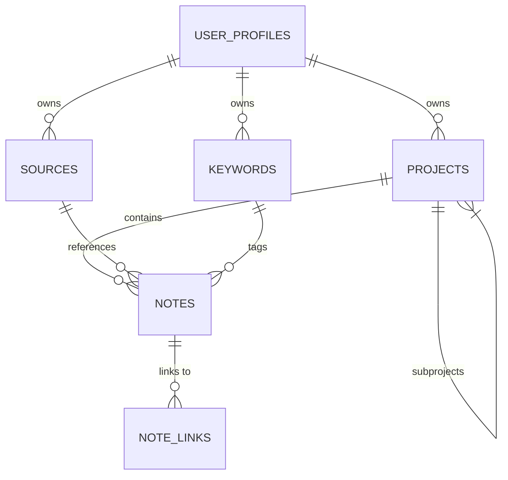

# PKM Test Data Documentation

This document describes the test data generation process and structure for the PKM application.

## Data Generation Process

1. Run `python src/pkm_app/tests/data_generation/generate_test_data.py`
2. The script will:
   - Generate test data entities in memory
   - Create a seed SQL file at `src/pkm_app/infrastructure/persistence/schema/seed.sql`
   - Create an Alembic migration file at `src/pkm_app/infrastructure/persistence/migrations/versions/`
3. Apply the migration to populate the database:
   ```bash
   alembic upgrade head
   ```

## Entity Relationships



## Data Volumes

| Entity       | Count | Notes |
|--------------|-------|-------|
| Users        | 2     | Base users |
| Projects     | 4-6   | 2-3 per user, including 1 subproject |
| Sources      | 2-4   | 1-2 per user |
| Keywords     | 6-10  | 3-5 per user |
| Notes        | 12-30 | 3-5 per project |
| Note Links   | 12-60 | 1-2 per note |

## Example Data

### User Profile
```json
{
  "id": "c8a3d1b0-7e5a-4e8f-9d2c-1b3d4e5f6a7b",
  "name": "John Doe",
  "email": "john@example.com",
  "preferences": {"theme": "dark", "language": "es"}
}
```

### Project
```json
{
  "id": "a1b2c3d4-e5f6-7890-abcd-ef1234567890",
  "name": "Research Project",
  "description": "A project for researching PKM systems",
  "owner_id": "c8a3d1b0-7e5a-4e8f-9d2c-1b3d4e5f6a7b"
}
```

### Note
```json
{
  "id": "b2c3d4e5-f6a7-890b-cdef-1234567890ab",
  "title": "Note on PKM Architecture",
  "content": "This note discusses clean architecture for PKM systems...",
  "type": "markdown",
  "metadata": {"tags": ["architecture", "pkm"]},
  "user_id": "c8a3d1b0-7e5a-4e8f-9d2c-1b3d4e5f6a7b",
  "project_id": "a1b2c3d4-e5f6-7890-abcd-ef1234567890"
}
```

## Validation

After applying the migration, verify the data by:
1. Starting the application
2. Checking that all entities appear in the UI
3. Verifying relationships between entities
4. Running integration tests
